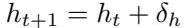

# AgentGym-RL：透過多輪強化學習訓練用於長時程決策的 LLM 代理

Zhiheng Xi \(^{1*}\) , Jixuan Huang \(^{1*}\) , Chenyang Liao \(^{1*}\) , Baodai Huang \(^{1}\) , Honglin Guo \(^{1}\) , Jiaqi Liu \(^{1}\) , Rui Zheng \(^{1}\) , Junjie Ye \(^{1}\) , Jiazheng Zhang \(^{1}\) , Wenxiang Chen \(^{1}\) , Wei He \(^{1}\) , Yiwen Ding \(^{1}\) , Guanyu Li \(^{1}\) , Zehui Chen \(^{2}\) , Zhengyin Du \(^{2}\) , Xuesong Yao \(^{2}\) , Yufei Xu \(^{2}\) , Jiecao Chen \(^{2}\) , Tao Gui \(^{1,3}\) , Zuxuan Wu \(^{1,3}\) , Qi Zhang \(^{1}\) , Xuanjing Huang \(^{1}\) , Yu- Gong Jiang \(^{1}\)

\(^{1}\) 復旦大學, \(^{2}\) 字節跳動 Seed, \(^{3}\) 上海創新研究院

## 摘要

開發能夠透過一系列智慧決策來解決複雜現實世界任務的自主 LLM 代理，是一個快速發展的前沿領域。如同人類認知發展一樣，代理預期透過探索和與環境互動來獲取知識和技能。儘管取得了進展，但社群仍然缺乏一個統一的互動式強化學習（RL）框架，能夠在多樣化和真實的環境中，從零開始有效地訓練此類代理，而無需依賴於監督式微調（SFT）。為彌補這一差距，我們引入 **AgentGym-RL**，一個透過 RL 訓練 LLM 代理進行多輪互動式決策的新框架。該框架具有模組化和解耦的架構，確保了高度的靈活性和可擴展性。它涵蓋了各種現實世界的場景，並支援主流的 RL 演算法。此外，我們提出了 **ScalingInter-RL**，一種旨在平衡探索與利用並穩定 RL 優化的訓練方法。在早期階段，它透過限制互動次數來強調利用，並隨著時間推移逐漸轉向更大時程的探索，以鼓勵多樣化的問題解決策略。透過這種方式，代理能夠發展出更多樣化的行為，並在長時程下更不容易崩潰。我們進行了廣泛的實驗，以驗證 AgentGym-RL 框架和 ScalingInter-RL 方法的穩定性和有效性。我們的代理在多樣化環境的 27 項任務上，與商業模型相匹配甚至超越。我們提供了一些關鍵見解，並將開放完整 AgentGym-RL 框架的原始碼和資料集，以賦予研究社群開發下一代智慧代理的能力。

  
圖 1 左圖：專有模型、開源模型和我們的 RL 模型在不同代理任務上的表現。右圖：關於模型規模的表現。我們的框架和方法協同作用，顯著提升了開源 7B 規模模型的能力，使其達到甚至超越頂級專有大型模型的水平。

---

# 1 簡介

隨著大型語言模型（LLM）的巨大發展 [2, 11, 41, 65, 84]，其應用已從聊天機器人擴展到能夠處理**長時程**現實世界任務的**自主代理** [39, 79]。對於一個複雜任務，這些代理與環境互動，進行一系列智慧決策以達成目標 [95]。與人類認知發展類似，LLM 代理預期透過積極探索和與環境互動來獲取新知識和技能 [42, 77]。因此，一個自然的方法是使用**強化學習**（RL）來訓練這些代理 [62]。

儘管 RL 在諸如 LLM 推理等領域取得了進展 [12, 18, 23, 66, 68, 76]，但大多數現有研究僅限於單輪任務，其中模型不需要與複雜環境進行多輪互動 [71]。雖然最近的一些努力試圖將 RL 擴展到訓練具有多輪能力的 LLM 代理 [3, 26, 30, 47, 71, 95]，但這些工作的任務複雜度和環境多樣性有限。此外，它們在優化穩定性和效率方面遇到困難，導致次優性能。關鍵是，目前社群缺乏一個**統一、端到端、互動式多輪 RL 框架**，該框架已被證明在廣泛的現實世界場景和環境中，無需以 SFT 作為初步步驟即可有效地訓練 LLM 代理 [12]。

為彌補這一差距，我們引入 **AgentGym-RL**，一個用於透過 RL 訓練 LLM 代理進行多輪互動式決策的新框架（圖 2）。AgentGym-RL 採用**模組化和解耦**的架構，能夠清晰地分離代理、環境和學習演算法，為各種研究需求提供了高度的可擴展性和靈活性。該框架支援主流的 RL 演算法，包括 PPO [53]、GRPO [54] 和 REINFORCE++ [21]，並配備了廣泛的現實世界場景，例如**網頁導航** [13, 87, 94]、**深度搜尋** [26, 72]、**數位遊戲** [15, 45]、**具身任務** [7, 58] 和**科學任務** [60, 69]。

此外，為了解決探索-利用權衡並提高代理 RL 訓練中的優化穩定性，我們提出了 **ScalingInter-RL**，一種在訓練期間逐步擴展代理-環境互動時程的方法。這種方法的核心見解是讓代理分階段適應環境：首先透過**利用**來實現對基本技能和簡單任務的可靠掌握；隨後**增加互動時程**以促進**探索**、完善行為、克服捷徑，並解決更複雜的挑戰。這種漸進式的互動縮放策略使代理能夠發現更豐富的互動模式（例如規劃和反思），並隨著時間培養更廣泛的技能和行為。

  
圖 2 AgentGym-RL 框架概覽。它具有解耦、靈活和可擴展的架構，由三個主要模組組成：環境、代理和訓練模組。它支援多樣化的場景、環境和演算法。

我們廣泛的實驗證明，AgentGym-RL 在涵蓋 5 個場景的 5 個任務中為代理提供了持續且顯著的性能提升（圖 1a）。使用我們的框架和方法訓練的開源模型（例如 Qwen-2.5-7B [83]）平均提升了 33.65 分，與 OpenAI-o3 [42] 和 Gemini-2.5-Pro [10] 等大型商業閉源模型相匹配甚至超越。我們還進行了大量的分析實驗，提供了關鍵的發現和見解，表明擴展訓練後和測試時的計算對於開發代理智慧具有巨大的潛力（圖 1b）。我們希望我們的工作能為社群的進步做出寶貴貢獻。

總結來說，我們的主要貢獻是：

1.  我們提出並開源了 **AgentGym-RL**，一個新的統一、模組化和靈活的端到端 RL 框架，專為代理的多輪互動式決策而設計，其中包括多樣化的場景和環境。
2.  我們提出了 **ScalingInter-RL**，一個漸進式互動縮放框架，逐步調整代理以適應其環境，促進互動模式的完善和技能的獲取。它增強了 RL 中的優化穩定性，並在探索和利用之間實現了平衡。
3.  我們廣泛的實驗證明，AgentGym-RL 和 ScalingInter-RL 提供了顯著且持續的性能提升，與商業模型相匹配或超越。此外，我們進行的實證分析產生了對代理設計和操作範式的關鍵見解，為未來的研究提供了寶貴的指導和資源。

---

# 2 基礎知識

## 2.1 表述

在這項工作中，我們研究多輪互動式決策任務，即代理任務，並將它們建模為部分可觀察馬可夫決策過程 (POMDP) \((\mathcal{U}, \mathcal{S}, \mathcal{A}, \mathcal{O}, \mathcal{T}, r)\)，如 Xi et al. [77]、Zhou et al. [95] 所述，其中 \(\mathcal{U}, \mathcal{S}, \mathcal{O}, \mathcal{T}: \mathcal{S} \times \mathcal{A} \to \mathcal{S}, r: \mathcal{U} \times \mathcal{S} \to \mathbb{R}\) 分別代表指令空間、狀態空間、動作空間、觀察空間、確定性狀態轉換函數和獎勵函數。

給定一個任務指令 \(u\in \mathcal{U}\)，代理任務要求 LLM 代理根據其由 \(\theta\) 參數化的策略 \(\pi_{\theta}\) 生成一系列動作 \(a_{k}^{T}\sim \pi_{\theta}(\cdot |s_{k})\) 來完成給定任務，其中 \(a_{k}\in \mathcal{A}\)，\(s_k\in S\) 且 \(T\) 是思維路徑 [88]。代理隨後從環境接收一個觀察 \(o_k\in \mathcal{O}\)，然後狀態轉換為 \(\mathcal{T}(s_k,a_k) = s_{k + 1}\)。最終在 \(N\) 輪互動後，環境 \(e\) 提供一個結果獎勵 \(r(\tau)\in [0,1]\) 來描述多輪互動式決策任務的完成度。

## 2.2 策略梯度

我們利用策略梯度方法 [63] 來優化我們的策略以最大化預期累積獎勵。與估計值函數以得出策略的基於值的方法不同，策略梯度方法直接搜尋策略參數空間以找到最佳策略。

策略梯度方法的核心思想是根據目標 \(J(\theta)\) 執行梯度上升，其中 \(J(\theta)\) 是策略參數 \(\theta\) 的函數。具體來說，\(J(\theta)\) 代表代理在遵循策略 \(\pi_{\theta}\) 並與環境互動時預期獲得的預期累積獎勵。在數學上，這表示為在由策略生成的軌跡 \(\mathcal{T}\) 上總獎勵 \(r(\tau)\) 的期望值：


為了在 \(J(\theta)\) 上執行梯度上升，我們需要策略梯度 \(\nabla_{\theta}J(\theta)\)。在原始策略梯度方法中，策略梯度可以透過以下方式估計：


其中 \(\pi_{\theta}\) 是由 \(\theta\) 參數化的策略，\(\mathcal{T}\) 代表由一系列狀態和動作組成的軌跡，\(a_{k}\) 和 \(s_k\) 是時間步長 \(k\) 的動作和狀態，而 \(r(\tau)\) 是軌跡 \(\mathcal{T}\) 的獎勵。

估計出策略梯度後，我們可以透過梯度下降法優化策略 \(\pi_{\theta}\) 的參數 \(\theta\)，使其朝著最大化預期累積獎勵的方向發展：


其中 \(\alpha \in [0,1]\) 是學習率。用於訓練 LLM 的主流 RL 演算法包括 PPO [53]、GRPO [54]、REINFORCE++ [21] 和 RLOO [30]，所有這些都已整合到我們的框架中。

---

# 3 AgentGym-RL 框架

## 3.1 架構概覽

AgentGym-RL 框架建立在 AgentGym [77] 之上，後者為 LLM 代理提供了一些基本的互動式環境。我們的主要擴展集中在三個方面：

1.  引入更真實的環境和任務（例如深度搜尋任務），以促進開發更通用的代理。
2.  納入一組多樣化的線上強化學習演算法，涵蓋經典和最先進的方法，以確保與當前研究前沿保持一致，並為社群提供可擴展的基礎。
3.  實現廣泛的工程優化和代理-環境協同設計，例如改進的 rollout 並行化和記憶體洩漏緩解。

```

Stage 1: Generate responses
task\_ids = expand(task\_ids, sample\_num)
envs = create\_env\_clients(task\_ids, "webarena", base\_url)

Do in parallel:
for (env, task\_id) in zip(envs, task\_ids):
env.reset(task\_id)
handlers = [ RolloutHandler().add\_user\_message(env.observe) for env in envs]
for i in range(novsounds)
prompts = [h.get\_prompt) for h in handlers]
responses = actor.generate(prompts)
results = thread\_safe\_list
Do in parallel:
for (env, response) in zip (envs, responses):
results.append(env.step(response))
for (h, r, res) in zip(handlers, responses, results):
h.add\_assistant\_message(r)
h.add\_user\_message(res.state)
h.score = res.score
if all\_done(handlers):
break

Stage 2: Prepare experience
batch = gen\_batch\_from\_rollout\_handler(handlers)
batch = actor.compute\_log\_prob(batch)
batch = reference.compute\_ref\_log\_prob(batch)
batch = compute\_advantages(batch, method = "grp0")

Stage 3: Actor training
actor.update\_actor(batch)

```

  
圖 3 偽代碼演示了我們提出的框架的範例用法（標記為橙色的 API），以及說明代理-環境互動和訓練流程的簡化理論圖。

如圖 2 所示，該框架分為三個主要組件：

**環境模組**透過帶有統一 HTTP 協定的標準化伺服器-客戶端架構提供多樣化的場景。**代理模組**封裝了代理在多輪互動中的推理和決策過程，並支援長時程規劃和自我反思等先進機制。**訓練模組**實施強化學習流程和其他訓練方法以優化代理策略。

我們架構的更詳細描述請參見附錄 A。

給定一批使用者查詢和初始環境狀態，我們的框架並行初始化多個獨立的環境客戶端。每個客戶端專門與一個代理互動，確保執行是隔離且互不干擾的。在每個客戶端中，代理生成一個動作，該動作在環境中執行，然後環境返回更新後的狀態和獎勵以供下一個決策。一批這樣的軌跡在客戶端之間同時收集，並隨後饋送到訓練模組中以更新代理策略。我們框架的整體工作流程和相應的偽代碼如圖 3 所示。

## 3.2 特徵與特性

在本節中，我們將重點介紹 AgentGym-RL 框架的關鍵特徵，涵蓋四個方面：環境覆蓋、演算法支援、架構優勢和開源貢獻。

### 3.2.1 多樣化的場景與環境

為了建立能夠在現實世界環境中進行多輪順序決策的 LLM 代理，AgentGym-RL 涵蓋了廣泛的場景，以全面評估和培養代理感知其環境、長期規劃以實現目標、深入推理以做出智慧決策以及在面對挫折或犯錯時反思和糾正的能力。

它包括：

* **網頁導航**：與動態網站互動以執行預訂航班或提取結構化資訊等任務，這要求代理遵循指令、解釋文字和視覺內容、操作動態介面並規劃多步驟動作。
* **深度搜尋**：使用瀏覽器或 Python 解釋器等工具執行多步驟、目標導向的查詢，要求強大的資訊搜尋、多跳推理、長期記憶和跨來源的知識整合能力。
* **數位遊戲**：在互動式遊戲類環境中探索和解決問題，強調即時決策、策略開發和對複雜動態環境的適應性。
* **具身任務**：控制虛擬或實體身體以進行導航、操縱和任務執行，這需要目標導向規劃、空間推理和穩健的感知-動作基礎。
* **科學任務**：在基於物理、知識密集型的環境中進行實驗和解決問題，需要精確執行、對反饋的動態解釋、基於證據的推理以及迭代假設細化。

### 3.2.2 全面的 RL 演算法支援

雖然原始的 AgentGym 僅支援有限的基於監督式微調的訓練方法，但 AgentGym-RL 將**線上強化學習**置於其核心，使代理能夠透過與環境的持續互動來動態探索和適應。

AgentGym-RL 實施了一套主流的線上 RL 演算法：(1) **PPO** [53]，一種策略梯度方法，透過裁剪策略更新來防止過大的步驟，從而提高訓練穩定性，簡化了來自 TRPO [52] 的信任區域概念，同時保持強大的經驗性能；(2) **GRPO** [54]，一種源自 PPO 的方法，它對每種狀態下採樣的動作組內的獎勵進行歸一化，並應用 PPO 式裁剪，強化相對於其他動作的高性能動作；(3) **RLOO** [30]，一種 REINFORCE 變體，它使用同一批次中其他樣本的平均獎勵作為每樣本基準，從而減少策略梯度估計中的變異性；(4) **REINFORCE++** [21]，一種增強的 REINFORCE [73] 演算法，它整合了 PPO 式裁剪和 KL 懲罰，實現更穩定、更簡單和計算效率更高的訓練，而無需批評家網路。

除了線上 RL，該框架還支援廣泛的互補訓練範式：**SFT**（監督式微調）[44] 是一種標準的訓練方法，其中代理學習逐步模仿專家示範或黃金軌跡。**DPO**（直接偏好優化）[50] 是一種強化學習的變體，不涉及與環境的線上互動；相反，它從預先收集的偏好對中學習。對於**拒絕採樣** [35]，我們支援 AgentEvol [77] 等方法，該方法在代理自行生成並根據任務成功率過濾的軌跡上進行迭代微調。

### 3.2.3 可擴展性、可伸縮性和可靠性

由於 AgentGym-RL 的主要設計目的是支援社群進行大規模強化學習研究和開發，我們進行了廣泛的工程設計、實踐和優化，以確保框架的可擴展性、可伸縮性和可靠性。

* **可擴展性**。可擴展性對於支援不斷發展的研究需求至關重要，它允許框架在不破壞現有組件的情況下適應新環境、代理架構和訓練策略。在我們的系統中，我們採用**模組化和解耦**的設計，其中核心組件——**環境**、**代理**和**訓練**——完全即插即用。因此，研究人員可以輕鬆地納入新的強化學習目標、獎勵函數或採樣技術，促進可重現的實驗，並能夠探索廣泛的演算法方向。例如，可以透過簡單地繼承 BaseEnvClient 並實現所需的 reset()、step() 和 observe() 等方法來引入新環境。一旦實現，

  
圖 4 我們框架可視化使用者介面的概覽。

新環境可以與現有的代理架構和訓練程序無縫使用，從而實現快速實驗，而無需修改任何核心框架組件。

* **可伸縮性**。強化學習的最新進展越來越依賴於大規模訓練，涉及大量的資料和擴展的互動序列，這對系統可伸縮性構成了重大挑戰。為應對這些挑戰，框架必須能夠在**並行性**和**互動持續時間**兩方面進行擴展。我們實施了一系列優化來實現這一點。例如，我們用基於子程序的架構取代了 WebArena 預設的每個程序單一瀏覽器設計，使單個伺服器能夠同時管理多個 Chromium 實例，從而增強了並行性。同樣，在 SciWorld 環境中，我們重新設計了環境的初始化和重置程序，以支援多個實例的穩健並行創建和重置，解決了以前並發實例化中的失敗。此外，我們透過 WebArena 中的完整重置介面支援更長的訓練時程，該介面在每個回合後將每個網頁伺服器恢復到其初始狀態，並隨著時間推移緩解狀態不一致。總體而言，這些優化使我們的框架能夠有效地擴展，促進大規模訓練，並使研究社群能夠進行廣泛的實驗。

* **可靠性**。大規模多輪代理 RL 訓練對系統可靠性構成了重大挑戰，即在長時間訓練期間保持一致和可靠運行的能力。為了實現可靠性，框架必須防止可能中斷訓練的故障，並確保關鍵資源得到正確管理。例如，我們優化了 TextCraft 中的記憶體管理實現。原始環境在其遞迴 crafting_tree 實現中存在記憶體洩漏，其中列表結構的冗餘自我複製導致指數級記憶體增長並最終在訓練期間崩潰。我們透過重構遞迴來消除冗餘副本，從而解決了這個問題。同樣，在 SciWorld 中，其內部時鐘機制中的記憶體洩漏導致在擴展的 rollout 期間逐步積累記憶體並導致不穩定。我們透過重構時鐘實現來消除洩漏，從而解決了這個問題。透過我們的優化，框架為長時程訓練提供了可靠的環境，確保在擴展的互動序列上一致且不間斷的運行。

總體而言，這些設計和優化消除了主要的工程瓶頸，並使跨異構環境的可重現、大規模 RL 實驗成為可能。

### 3.2.4 開源可用性與社群可擴展性

我們設計 AgentGym-RL 旨在培養一個協作生態系統，其中社群貢獻直接加速方法學進展，同時維護可驗證的研究標準。AgentGym-RL 作為一個開放原始碼框架在寬鬆許可下發布，建立在 veRL [56] 和 AgentGym [77] 等成熟的開源框架之上，同時保持完整的開源可用性。該框架提供全面的文件、可重現的訓練流程和標準化的 API，以確保研究透明度和

  
圖 5 ScalingInter-RL 方法的圖示。它允許代理分階段適應：首先，透過限制互動輪次來優先利用、掌握基本技能和解決簡單任務；之後，透過逐步增加互動來探索、避免捷徑、完善行為並解決更困難的問題。最終，這個過程訓練出一個更強大的代理。

實際應用。其模組化架構（包括清晰定義的擴展點）能夠無縫整合新環境和訓練方法，允許研究社群在不破壞核心工作流程的情況下擴展功能。為了方便探查資料和模型行為，我們提供了一個互動式使用者介面，可簡化經驗分析以進行迭代開發。

**可用性、可重現性和標準化評估**。AgentGym-RL 的設計對社群來說是使用者友好的。為了系統地解決基於 LLM 的強化學習中的可重現性挑戰，AgentGym-RL 建立了一個標準化的評估過程和可重現的訓練流程。這種設計強制執行統一的指標和一致的實驗程序，以確保公平比較。我們提供易於設定的重現腳本，自動化從環境配置到最終評估的整個工作流程。這種設計使研究人員能夠高保真地重現先前的發現，並顯著降低在現有工作基礎上進行建構的障礙，從而促進可驗證的研究標準。

**用於可觀察性和分析的可視化使用者介面**。如圖 4 所示，AgentGym-RL 包含一個互動式使用者介面，旨在促進對資料和模型行為的探查。該工具透過使研究人員能夠對代理的決策過程進行細粒度、逐步的檢查來簡化經驗分析。它允許重放和檢查完整的互動軌跡，可視化環境觀察、代理的內部推理及其結果動作之間的相互作用。此功能提供了對模型性能和故障模式的直接見解，從而加速了迭代開發和調試週期。

## 3.3 Scalinglnter-RL：漸進式縮放互動以用於代理 RL

**動機和核心見解**。當被分配一個任務時，代理與環境進行迭代互動——觀察變化、對其進行推理並執行後續動作。透過這個循環，代理進行徹底的探索和實驗，最終達到目標狀態。這個過程類似於 LLM 推理中的推理-計算縮放（如 OpenAI o1 和 DeepSeek-R1 的範例），其中在測試時或 RL rollout 期間分配額外的計算資源，允許模型在產生最終答案之前進行更深入的推理。

相較之下，我們認為除了依賴內部推理來選擇下一個動作外，代理還應該擴展其與環境的外部互動，以確保充分探索並累積更豐富的上下文以實現最終目標——捕捉一種**練習驅動的洞察力**。然而，我們的初步實驗表明，從大量的互動輪次開始往往會導致模型陷入冗餘推理和無效動作，最終導致訓練崩潰和性能下降。相反，持續限制互動次數往往會縮小探索範圍，並限制代理掌握多樣化模式的能力。這促使我們提出了我們的方法。

**方法**。我們從用於 LLM 推理的強化學習 [12, 18, 23, 66, 68, 76] 中汲取靈感，並提出了 **ScalingInter-RL**，一種旨在平衡探索與利用，同時確保穩定優化的訓練方法。其核心是一種漸進式時程縮放策略，可自適應地調整 RL 期間的互動輪次數。目標是在受限的互動預算下最大化預期終端獎勵：


其中每個軌跡 \(\tau = \left(a_0^T, o_1, a_1^T, \ldots , a_{K - 1}^T, o_K\right)\) 都是從當前策略 \(\pi_{\theta}\) 中採樣的，\(K\) 代表總互動輪次數。為了使代理能夠在有限的互動資源下快速學習有效行為，我們從一個小**時程**開始訓練。透過最初限制時程，代理學會以最大效率利用其策略，在簡單任務上實現早期熟練，並為更深層次、長時程的推理奠定基礎。隨著訓練的進展，我們引入了一個**單調排程** \(\{h_1 < h_2 < \dots < h_n\}\)，其中 \(h_t\) 定義了階段 \(t\) 允許的最大互動輪次數：


時程 \(h_t\) 根據課程表，每 \(\Delta\) 個訓練步驟更新一次：



其中 \(\delta_h\) 是一個自適應增量。隨著時程的增加，代理被鼓勵探索更長的決策路徑，從而促進更高階認知行為的出現，例如規劃、反思和策略性回溯，這類似於用於大型推理模型的 RLVR 中的**長度縮放現象** [3, 12, 37]。這種分階段縮放允許 ScalingInter-RL 將互動深度與代理不斷發展的策略能力相匹配，彌合了高效的早期利用和長時程泛化之間的差距。

---

# 4 實驗

為了驗證 AgentGym-RL 框架的穩定性和有效性，我們在多樣化的場景和環境中進行了廣泛的實驗。我們的結果表明，LLM 代理能夠完全基於環境回饋從零開始探索和學習，無需事先進行監督式微調，最終實現與 OpenAI o3 等商業閉源模型相當甚至超越的性能。

## 4.1 實驗設定

**場景、環境和任務**。如前所述，我們在 AgentGym-RL 中包含了五個場景。具體來說，對於網頁導航，我們包含了 **WebArena** [94]，這是一個真實且可重現的網頁環境，包含網路上流行的四個不同領域：線上購物、討論區、協作開發和商業內容管理；對於深度搜尋，我們包含了一個基於 **RAG** 的環境 [19, 26, 28, 32, 38, 46, 67, 85]，它使 LLM 能夠與搜尋引擎互動並解決多輪檢索和推理任務；對於數位遊戲，我們包含 **TextCraft** [45]，一個基於文字的製作遊戲環境，其中代理透過自然語言互動和基於任務的規劃來完成任務；對於具身任務，我們包含 **BabyAI** [7]，它提供了一個可控的網格世界，其中包含用於在模擬環境中進行具身推理的文字指令；對於科學任務，我們包含 **SciWorld** [69]，它提供了一個科學探索模擬器，其中代理透過文字驅動的推理週期進行科學實驗。

**基準模型和骨幹模型**。我們利用 **Qwen-2.5-3B** 和 **Qwen-2.5-7B** [83] 作為我們的主要骨幹模型。我們引入了閉源的 **Gemini 2.5 Pro** [10]、**OpenAI o3** [42] 和 **GPT-4o** [22] 作為基準。此外，我們還包含了開源的 **DeepSeek-R1** [12]、**Qwen-2.5-72B** [83]、**Llama-3.1-8B** [14] 和 **Llama-3.1-70B** [14] 模型進行比較。

**每個環境的詳細設定**。我們在附錄 B 中提供了每個環境的工具、API 和實驗設定的詳細描述。

  
圖 6 不同環境中的訓練獎勵。

## 4.2 整體結果、發現與見解

主要結果如圖 1、表 1、表 2、表 3、表 4 和表 5 所示。在本節中，我們討論整體發現和見解。

**強化學習通常將開源 LLM 的代理智慧提升到專有模型的水平**。如圖 1 所示，AgentGym-RL-7B 模型不僅以巨大的優勢超越了其他開源模型，而且在五個不同的場景中，其平均成功率也明顯領先於 GPT-4o 和 Gemini-2.5-Pro 等領先的閉源模型。這一成就突顯了我們框架在使模型能夠在複雜互動任務中學習和決策方面的有效性，成功彌合了開源模型和專有模型在高級智慧任務上的性能差距。

**ScalingInter-RL 顯著且持續地提升性能**。我們沒有依賴廣泛的超參數調整，而是根據原始 RL 過程的總優化步驟設定階段之間的過渡點。如我們的結果所示，ScalingInter-RL 在多樣化的環境和任務中持續優於基準模型。值得注意的是，它在 WebArena 上實現了超過 10% 的提升，使性能接近閉源商業模型。在 TextCraft 基準上，它超越了基礎模型 30 分，實現了**最先進**的結果。這些發現突顯了我們方法在強化學習中平衡探索和利用方面的有效性。如圖 6 所示，跨不同環境的實驗表明，利用我們的 AgentGym-RL 框架與 ScalingInter-RL 演算法可產生穩定、持續和實質性的獎勵提升。

**較大的互動預算會加速早期收益，但最終會導致不穩定的訓練**。如圖 7 所示，我們觀察到，使用較大的最大互動輪次（例如 10）在早期階段實現的性能高於較短輪次設定（例如 5），但隨著訓練的進行會迅速崩潰。這表明在訓練早期階段過度探索不一定是個好選擇。在建立堅實基礎之前，代理可能會進行無效和低效的探索，從而導致訓練不穩定的風險。相比之下，較短的回合限制了早期探索，但提供了更穩定的學習訊號，從而帶來更可靠的長期性能。總體而言，這些較長和較短輪次之間的對比動態激發了我們的 ScalingInter-RL 方法，該方法在訓練期間逐步擴展互動時程。

**ScalingInter-RL 在 RL 優化期間表現出更穩定和高效的訓練動態**。如圖 7 所示，我們的方法最初受到互動輪次數量的限制。儘管它一開始難以完全掌握困難任務，但透過利用基礎技能和知識，它實現了獎勵的顯著增加；之後，隨著它與環境進行更多輪次的互動和探索，它塑造了其推理範式和互動行為，最終達到了高水平的性能。相比之下，較少輪次的 RL 在後期階段收益遞減並達到性能上限，而具有較大互動預算的 RL 則會迅速崩潰。此外，正如在用於推理模型的 RL 中所觀察到的 [3]，我們漸進式縮放互動顯著減少了 RL 階段所需的計算資源和時間，從而實現了更高效的優化。

**訓練後和測試時計算顯示出比模型規模更高的擴展潛力**。我們的實驗的一個關鍵見解是，在訓練後和測試時計算中進行策略性投資比僅僅增加模型的參數數量更具影響力。圖 1（右）清楚地說明了這一點：我們的 ScalingInter-RL 模型，只有 7B 個參數，在我們的強化學習框架訓練後實現了約 58.6% 的平均成功率。這一性能不僅超越了類似規模的其他開源模型，而且顯著優於 Llama3.1-70B（47%）和 Qwen2.5-72B（43%）等大得多的模型，這些模型的參數幾乎是其十倍。這表明，單純擴大模型規模所帶來的性能提升是有限且不那麼陡峭的，相比之下，使用像 AgentGym-RL 這樣的框架進行有針對性的訓練後和推理時計算所帶來的收益更高。

**環境結構是強化學習效率的關鍵決定因素**。AgentGym-RL 的有效性因環境和回饋的性質而異。在具有明確規則和明確因果關係的模擬世界中，例如 TextCraft、BabyAI 和 SciWorld，RL 提供了最顯著的性能飛躍。在 SciWorld 的複雜科學推理任務中，我們的方法將模型的得分從 1.50 提升到 50.50，驚人地增加了近 50 分。相比之下，對於 WebArena 和 Deep Search 等更開放的環境，RL 帶來的性能提升則相對溫和，儘管仍然是正向的。在這些任務中，代理必須瀏覽真實網站的複雜性、處理多步驟製作

  
圖 7 在深度搜尋環境中不同最大互動輪次下的訓練動態。較長輪次設定（例如 10）透過實現更豐富的探索，最初獲得更高的獎勵，但由於高變異性、信用分配困難和對虛假行為的過度擬合而迅速崩潰。較短輪次（例如 5）產生更穩定但探索性較差的學習，導致性能達到上限。我們的 ScalingInter-RL 方法逐步增加互動時程，最終實現更高和更高效的長期性能。

表 1 WebArena 基準的評估結果。對於每個組，最佳結果以粗體顯示，次佳結果以下劃線顯示。在第一行中，G & R 表示 GitLab 和 Reddit。  


計劃，或處理來自搜尋引擎的嘈雜資訊，這使得透過試錯法學習最佳策略更具挑戰性。這表明，雖然 RL 具有廣泛的適用性，但它在那些可以透過探索輕鬆發現清晰回饋和成功路徑的環境中表現最出色。

## 4.3 跨環境的詳細任務表現

**網頁導航**。如表 1 所示，我們的模型在 WebArena 基準上表現出極具競爭力的性能。特別是，ScalingInter-7B 模型實現了 26.00% 的總體準確率，顯著超越了 GPT-4o (16.00%) 等頂級專有模型，並且與 DeepSeek-R1-0528 (28.00%) 和 Gemini-2.5-Pro (28.00%) 等大型模型相當。此外，我們的另一個 7B 模型 AgentGym-RL-7B 也實現了 16.00% 的總體得分，與 GPT-4o 的性能相匹配。這種強大的整體性能得益於 ScalingInter-7B 在結構化網頁導航方面的最先進熟練度，它在購物中實現了 33.33% 的得分，在 CMS 中實現了 26.67% 的得分，與所有模型在這些類別中的最佳性能相匹配。然而，與表現最佳的 OpenAI o3 (34.00%) 和 o4-mini (36.00%) 相比，仍然存在顯著的性能差距，這種差異幾乎完全集中在“GitLab & Reddit”子任務中。

**深度搜尋**。表 2 中的評估結果顯示了複雜推理能力的重要性，其中專有模型——尤其是 OpenAI 'o' 系列——目前設定了性能基準，其中 OpenAI o3 實現了 49.50 的最高總體得分。在這一競爭激烈的環境中，我們的模型表現出卓越的性能。具體來說，我們的 ScalingInter-7B 模型實現了 38.25 的出色總體得分，不僅超越了 GPT-4o (26.75) 和 Gemini-2.5-Pro (36.50) 等頂級專有模型，而且與最強大的開源模型 DeepSeek-R1-0528 (40.25) 相當。它的優勢在關鍵領域尤其突出：它在 NQ 任務中獲得了最高的總體得分（52.00），並在 TriviaQA 中與 GPT-4o 並列第一（70.00）。此外，我們的 AgentGym-RL-7B (34.00) 和 AgentGym-RL-3B (25.75) 模型也取得了強勁的結果，每個都顯著優於類似甚至更大規模的開源對手。這些結果提供了強有力的證據，表明我們的強化學習方法有效地釋放了模型固有的推理能力，使其在關鍵場景中達到甚至超過精英推理模型的性能——最重要的是，無需額外的顯式長程推理。

**數位遊戲**。TextCraft 基準有效地評估了模型在廣泛難度範圍內的能力，如表 3 所示。在淺層深度（深度 1）下，任務主要由頂級模型解決。相反，在最大複雜度（深度 4）下，挑戰變得幾乎無法克服，為大多數代理創造了一個性能懸崖。正是在這些中間和最高的難度下，我們模型的功效變得尤為明顯。我們的 ScalingInter-7B 模型獲得了 91.00 的傑出總體得分，使其穩居頂級專有和大型開源模型（93.00-94.00）之列。至關重要的是，它是少數在深度 4 實現非零得分的模型之一，得分為 33.33，並在最大複雜度下展示了獨特的穩健性。我們的 AgentGym-RL-7B 也表現出色，得分為 89.00，超過了 GPT-4o (83.00) 等知名模型。我們的 RL 訓練對較小的模型來說尤其戲劇性，AgentGym-RL-3B 獲得了 75.00 的得分，遠遠超過了類似大小的模型，如 Qwen2.5-3B-Instruct (14.00)。這些結果表明，我們的 RL 方法將我們的模型提升到在複雜、順序決策任務中實現有競爭力的性能。

**具身任務**。如表 4 所示，我們的 RL 模型在 BabyAI 基準上實現了**最先進**（SOTA）的性能，總體得分為 96.67，與 o3 和 o4-mini 等領先的專有模型具有競爭力。值得注意的是，我們的 ScalingInter-7B 模型獲得了 96.67% 的最高總體準確率，超越了 OpenAI o3 (94.44%) 和 GPT-4o (86.67%) 等頂級模型。這種卓越的性能得益於 ScalingInter-7B 對各種子任務的一致掌握，在 GoTo、ActionObjDoor (AOD) 和 SynthLoc 中實現了 100% 的完美得分，在 FindObjS7 (Find) 和 OneRoomS20 (Room) 中也獲得了 80% 的強勁結果。同樣，我們的 AgentGym-RL-7B 和 AgentGym-RL-3B 模型也展示了強大的能力，分別達到了 92.22% 和 93.33% 的總體準確率，並在 GoTo 和 AOD 任務中獲得了完美得分。與其他開源模型，例如 Qwen3-235B-A22B (87.78%) 和 DeepSeek-R1-0528 (93.33%) 相比，我們基於 RL 的模型保持了持續的高性能，同時有效地處理了更具挑戰性的子任務，如 Room 和 Find，許多 LLM 在其中表現出顯著的變異性。總體而言，這些結果突顯了我們基於 RL 的方法，尤其是 ScalingInter-7B，在 BabyAI 基準上實現了結構化導航和物件互動任務的最先進性能。

表 4 BabyAI 基準的評估結果。對於每個組，最佳結果以粗體顯示，次佳結果以下劃線顯示。在第一行中，AOD 表示 ActionObjDoor，Find 表示 FindObjS7，Room 表示 OneRoomS20，SLoc 表示 SynthLoc。  


**科學場景**。我們在 SciWorld 基準上的實驗（如表 5 所示）證明了我們 RL 訓練模型的先進性能。我們的 ScalingInter-7B 模型以 57.00 的總體得分樹立了新的**最先進**，顯著超越了所有開源和專有模型，包括次佳的專有模型 OpenAI o3 (41.50)。這種卓越的性能主要歸因於在“Find”（88.64）和“Test-Cond”（55.42）子任務中的高分。此外，我們的 AgentGym-RL-7B 模型也顯示出強大的能力，獲得了第二高的總體得分（50.50），並在“Test-Cond”（59.04）中獲得了最高分。這些結果突顯了我們的 RL 方法在訓練代理進行探索和程序執行任務方面的有效性。然而，我們的發現也確定了一個所有被評估模型都共有的關鍵局限性。“Chem-Mix”子任務被證明是難以處理的，每個模型，包括我們表現最好的模型，都獲得了零分。這一統一的結果表明，目前的語言模型在需要複雜科學推理和多步驟化學模擬的任務中存在系統性挑戰，這標誌著這是未來研究的一個關鍵領域。

---

# 5 討論

## 5.1 代理的測試時縮放

在本小節中，我們研究了隨著推理計算的增加，代理性能如何變化。**縮放順序互動**。首先，我們研究了當模型可用的最大互動輪次增加時，性能如何變化。如圖 8 所示，所有模型都隨著輪次數的增加而表現出明顯的收益，這驗證了我們 ScalingInter-RL 方法背後的見解——即代理必須徹底探索環境以塑造其互動和行為模式。此外，我們訓練有素的代理持續以顯著的優勢超越基準模型，進一步證明了我們方法的有效性。**縮放並行採樣**。如圖 9 所示，增加樣本數量會使 Pass@K 性能得到顯著提升，這表明每個模型都有下游優化的潛力。即使在採樣預算很小的情況下，我們的模型也超越了基準模型，並且隨著採樣的增加，它繼續以穩定和顯著的方式超越基準：例如，在 64 次採樣嘗試下，我們的 RL 模型在深度搜尋環境中實現了 5.5% 的提升，在 SciWorld 環境中實現了 7.05% 的提升，這展示了其卓越的優化能力。

表 5 SciWorld 基準的評估結果。對於每個組，最佳結果以粗體顯示，次佳結果以下劃線顯示。在第一行中，Test-Cond. 表示 test-conductivity，Chem-Mix 表示 chemistry-mix。  


  
圖 8 縮放測試互動輪次。

  
圖 9 Pass@K 性能。

## 5.2 不同 RL 演算法的性能

我們比較了兩種用於 LLM 訓練後的主流 RL 演算法，即 **GRPO** 和 **REINFORCE++**。如表 6 所示，我們的實驗顯示，GRPO 在 TextCraft、BabyAI 和 Deep Search 基準上持續且實質性地優於 REINFORCE++。雖然模型規模從 3B 擴展到 7B 參數改善了兩種演算法的結果，但 GRPO 的優越性尤為顯著：其 3B 變體獲得了比 7B REINFORCE++ 模型更高的分數。這一發現指出了 GRPO 擁有的根本性演算法優勢，其影響比單純的模型規模更大。性能差異可以透過每種演算法如何處理這些任務的核心困難來解釋：廣闊的探索空間和稀疏獎勵。REINFORCE++ 的學習訊號來自完整的蒙地卡羅回報，這通常會導致高變異性梯度，這些梯度對長軌跡上的隨機成功和失敗很敏感。相比之下，GRPO 透過評估相對於學習基準的動作相對優點來緩解這種不穩定性。對動作優勢的關注提供了更穩定和穩健的梯度，有助於在複雜、低訊號環境中進行更高效的探索和信用分配。

## 5.3 案例研究

在本節中，我們介紹了一系列案例研究，這些研究突出了基礎代理的缺點以及我們的強化學習模型所取得的改進。在導航、組合問題解決和網頁互動場景中，經過 RL 訓練的代理持續克服了無效的行為循環，表現出適應性恢復策略，並展示了更系統的任務執行。為了提供一個平衡的視角，我們還包括了兩個代表性的失敗案例——在科學推理和高效網頁互動中——這些案例強調了需要進一步改進的領域。在正文中，我們展示了 WebArena 軌跡圖解及其相應的可視化，而其他環境的額外軌跡圖解則在附錄 C 中提供。**增強導航**。圖 12 顯示了 BabyAI 環境中導航能力的顯著改進。雖然基礎代理表現出以重複移動模式為特徵的次優行為——在沒有發展出強大搜尋策略的情況下穿過先前探索過的位置——但透過強化學習訓練的模型表現出更有效的探索策略。RL 代理展示了**策略性回溯能力**，系統地透過門口退出，然後選擇替代路徑，最終進入一個綠色的門，直接通向目標藍色盒子。這突出了 RL 模型在空間推理方面的卓越能力以及其規避無效行為循環的能力。**組合任務掌握**。圖 14 例證了強化學習在複雜科學任務執行中的成功應用。基礎代理表現出任務解釋方面的根本缺陷，誤用了非互動對象並生成了無效動作。相比之下，經過 RL 優化的代理透過其系統方法展示了全面的任務理解：正確識別和操縱一個活物（香蕉樹），執行適當的庫存管理操作，在多房間環境中導航並解決障礙物，並透過將樹存放在指定的紫色盒子中成功完成目標。這突出了 RL 代理在推理、規劃和順序任務執行方面的增強能力。**自適應網頁導航策略**。圖 10 和圖 11 說明了透過強化學習優化實現的網頁導航能力的出現。基礎代理持續與無響應的介面元素互動，特別是在無效目標上進行重複點擊行為，而沒有意識到這些動作的徒勞。我們經過 RL 訓練的代理表現出明顯優越的自適應行為：它在遇到“找不到頁面”錯誤時成功實施了**錯誤恢復機制**，隨後利用搜尋框找到“pittsburgh”論壇，識別熱門貼文中與上下文相關的內容，並成功完成訂閱任務——展示了在錯誤處理、有目的的導航策略以及在避免無效行為模式的同時保持任務專注方面的增強穩健性。**科學場景中的局限性**。圖 15 揭示了在 SciWorld 任務完成中持續存在的根本性程序執行失敗，儘管 RL 代理能夠達到與任務相關的遊戲狀態。這些實例例證了兩種不同的失敗模式：首先，當面對需要系統調試的互動失敗時，代理不適當地用直接的事實回憶取代了預期的實驗程序；其次，代理表現出不充分的系統探索，這可以從其在導航到室外環境後過早終止任務並僅關注變色龍蛋而不是分析任務要求的所有可用動物中得到證明。這些失敗共同表明，該模型缺乏執行嚴格科學比較分析所需的**深入程序理解**。**網頁導動中的過度互動模式**。圖 16 顯示了在網頁導航任務中普遍存在的過度且低效的互動序列失敗模式。儘管在兩個圖解案例中都成功導航到正確的目標網站，RL 代理仍從事不必要的互動模式——包括冗餘點擊、不必要的懸停和過度滾動——這阻礙了從目標頁面成功提取資訊。這些行為模式表明，強化學習過程未能灌輸實現最佳任務完成所需的精確度和效率，這表明在那些狀態下，達到狀態的能力與有效的動作選擇之間存在差距。

---

# 6 相關工作

**使用大型語言模型開發代理**。隨著大型語言模型 [1, 2, 65] 的發展，研究人員已開始使用它們來建立能夠進行多輪智慧決策的代理 [79, 86]。主要方法依賴於**提示**來引導模型調用工具 [48, 90]，並輔以諸如**自我反思** [51, 57, 78, 82]、**長時程規劃** [36, 40, 45, 61] 和**自我糾正** [29, 31] 等機制。一些工作構建了為多個 LLM 分配不同角色的工作流程 [17, 20, 34, 64, 74]，每個 LLM 在任務完成中扮演一個專業部分。然而，這些方法通常依賴於強大的專有模型（例如 OpenAI o3），並且不訓練底層模型以演變成具有**內在代理能力**的代理。另一條工作線是收集大規模的專家軌跡，並訓練代理逐步模仿專家 [4, 6, 91, 92]，從而獲得 API 調用、規劃和自我反思等能力。然而，這種方法成本高昂、難以擴展，並且模型難以透過與環境的互動來自我提升。