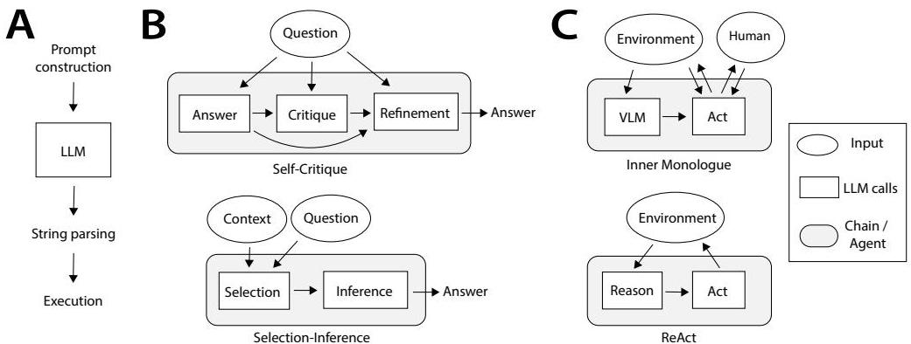
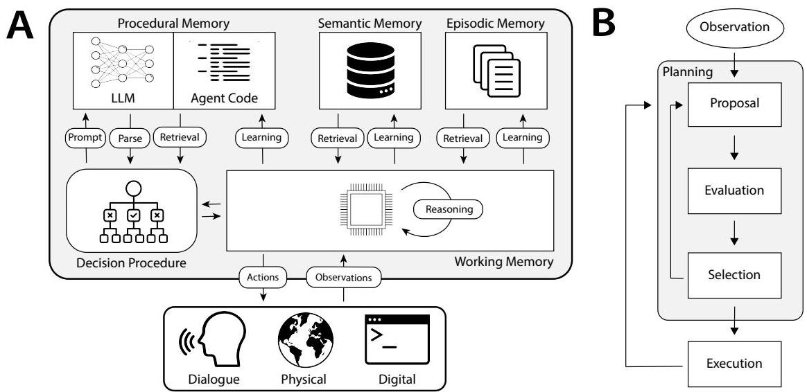
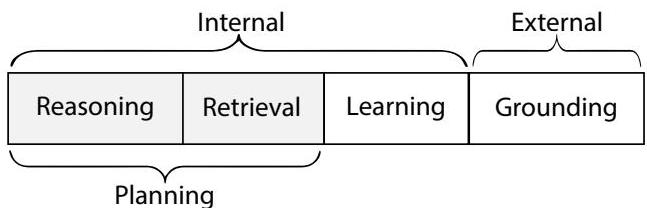

# **語言代理的認知架構**

Theodore R. Summers* Shunyu Yao* Karthik Narasimhan Thomas L. Griffiths 普林斯頓大學 {sumers, shunyuy, karthikn, tomg}@princeton.edu

評論於 OpenReview：https://openreview.org/forum?id=1i6ZCvflQJ

## **摘要**

最近的研究透過**外部資源**（例如，網際網路）或**內部控制流**（例如，提示鏈）來增強大型語言模型（LLMs），以執行需要基礎化或推理的任務，從而產生了一種新型的語言代理。儘管這些代理取得了巨大的實證成功，但我們缺乏一個框架來組織現有代理並規劃未來的發展。在本文中，我們借鑑認知科學和符號人工智慧豐富的歷史，提出了**語言代理的認知架構（Cognitive Architectures for Language Agents, CoALA）**。CoALA 將語言代理描述為：

- 具有**模組化記憶組件**
- 用於與**內部記憶**和**外部環境**互動的**結構化行動空間**
- 選擇行動的**廣義決策過程**

我們使用 CoALA 回顧性地調查和組織了大量近期工作，並前瞻性地確定了通往更強大代理的可行方向。總而言之，CoALA 將當今的語言代理置於更廣泛的 AI 歷史背景中，並勾勒出通向基於語言的通用智慧的道路。

## **1 導言**

語言代理（Weng, 2023; Wang et al., 2023b; Xi et al., 2023; Yao and Narasimhan, 2023）是一類新興的人工智慧（AI）系統，它利用大型語言模型（LLMs; Vaswani et al., 2017; Brown et al., 2020; Devlin et al., 2019; OpenAI, 2023a）與世界進行互動。它們將 LLMs 的最新進展應用於現有的代理設計領域（Russell and Norvig, 2013）。有趣的是，這種結合為這兩個領域都帶來了好處。

一方面，LLMs 的知識和推理能力有限。語言代理透過將 LLMs 連接到內部記憶和環境，將其基礎化到現有知識或外部觀察來緩解這些問題。另一方面，傳統代理通常需要**人工編寫的規則**（Wilkins, 2014）或**強化學習**（Sutton and Barto, 2018），這使得推廣到新環境變得困難（Lake et al., 2016）。語言代理利用 LLMs 中存在的常識先驗知識來適應新任務，從而減少對人類註釋或試錯學習的依賴。

雖然最早的代理使用 LLMs 直接選擇或生成行動（圖 1B; Ahn et al., 2022; Huang et al., 2022b），但最近的代理還使用它們來進行**推理**（Yao et al., 2022b）、**規劃**（Hao et al., 2023; Yao et al., 2023）和管理**長期記憶**（Park et al., 2023; Wang et al., 2023a）以改善決策。這最新一代的**認知語言代理**使用非常複雜的內部過程（圖 1C）。然而，今天，個別工作使用自訂術語來描述這些過程（例如「工具使用」、「基礎化」、「行動」），這使得難以比較不同的代理、理解它們如何隨時間演變，或以清晰和一致的抽象來建構新代理。

為了建立一個組織這些工作的概念框架，我們借鑑了計算機和人工智慧（AI）歷史上的兩個概念：**生成系統**（production systems）和**認知架構**（cognitive architectures）。生成系統透過迭代應用規則來生成一組結果（Newell and Simon, 1972）。它們最初是作為字串操作系統而產生的——這是 LLMs 所解決問題的一種類比——隨後被 AI 社群採用，以定義能夠進行複雜、分層結構行為的系統（Newell et al., 1989）。為此，它們被納入**認知架構**中，這些架構指定了用於選擇、應用甚至生成新生成式的控制流（Laird et al., 1987; Laird, 2022; Kotseruba and Tsotsos, 2020）。我們認為生成系統和 LLMs 之間存在有意義的類比：正如生成式表明了修改字串的可能方式一樣，LLMs 定義了字串變更或新增的分布。這進一步表明，用於生成系統的認知架構中的控制也可能同樣適用於將 LLMs 轉換為語言代理。

因此，我們提出了**語言代理的認知架構（CoALA）**，這是一個用於描述和設計通用語言代理的概念框架。CoALA 從三個關鍵維度來組織代理：

1. 它們的**資訊儲存**（分為工作記憶和長期記憶）
2. 它們的**行動空間**（分為內部行動和外部行動）
3. 它們的**決策程序**（其結構為一個具有規劃和執行的互動循環）

透過這三個概念（記憶、行動和決策），我們展示了 CoALA 可以巧妙地表達大量現有代理，並確定了未被充分探索的開發新代理的方向。值得注意的是，雖然最近有幾篇論文提出了通用智慧的概念架構（LeCun, 2022; McClelland et al., 2019）或實證調查了語言模型和代理（Mialon et al., 2023; Weng, 2023; Wang et al., 2023b），但本文結合了這兩者的元素：我們提出了一個理論框架，並用它來組織多樣化的實證工作。這將我們的理論基礎於現有實踐，並使我們能夠為未來的工作確定短期和長期的方向。

本文其餘部分的計劃如下。我們首先介紹生成系統和認知架構（第 2 節），並展示 LLMs 和語言代理的這些最新發展如何重現這些歷史思想（第 3 節）。在這些類比的啟發下，第 4 節介紹了 CoALA 框架並用它來調查現有的語言代理。第 5 節對幾個著名代理提供了更深入的案例研究。第 6 節提出了建構未來語言代理的可行步驟，而第 7 節則強調了認知科學和 AI 更廣泛發展中的開放性問題。最後，第 8 節做出結論。對應用代理設計感興趣的讀者可以優先閱讀第 4-6 節。

## **2 背景：從字串到符號通用人工智慧 (AGI)**

我們首先介紹生成系統和認知架構，為認知科學和人工智慧提供一個歷史視角：從邏輯和計算理論（Post, 1943）開始，到嘗試建構符號人工通用智慧（Newell et al., 1989）結束。然後我們簡要介紹語言模型和語言代理。第 3 節將連接這些思想，並在生成系統和語言模型之間建立類比。

### **2.1 用於字串操作的生成系統**

在二十世紀上半葉，一條重要的思想路線導致了數學（Whitehead and Russell, 1997）和計算（Church, 1932; Turing et al., 1936）被還原為符號操作。生成系統就是這樣一種形式。直觀上，生成系統由一組規則組成，每個規則都指定了一個**前提**和一個**行動**。當前提得到滿足時，就可以採取該行動。這個想法源於表徵計算極限的努力。Post (1943) 提出以這種方式來思考任意的邏輯系統，其中公式被表達為字串，而它們所授權的結論則由生成規則來識別（其中一個字串「生成」了另一個）。這種表述隨後被證明等同於一個更簡單的字串重寫系統。在這樣的系統中，我們指定形式為

的規則，表示字串 `XYZ` 可以被重寫為字串 `XWZ`。字串重寫在形式語言理論中扮演著重要角色，其形式為 Chomsky 的短語結構文法（Chomsky, 1956）。

### **2.2 控制流：從字串到演算法**

就其本身而言，生成系統只描述了可以從起點生成的字串集合。然而，如果我們施加**控制流**來決定執行哪些生成式，它們就可以被用來指定演算法。例如，馬爾可夫演算法是具有優先順序的生成系統（Markov, 1954）。以下演算法透過將由筆畫 `|` 組成的數字轉換為 `Q*R` 形式來實現帶餘數的除法，其中 `Q` 是除以 5 的商，`R` 是餘數：

其中優先順序由上到下，從左到右移動時（包括最後一個生成式中的空字串），生成式被應用於第一個匹配其前提的子字串，而 `→` 表示演算法在執行該規則後終止。第一個規則有效地「減去」五（如果可能的話）；第二個處理當不能再減去時的終止條件；第三個處理空字串輸入的情況。例如，給定輸入 `11`，這將產生一系列生成式 `*||||||||||\rightarrow |\ast ||||||\rightarrow ||\ast |\stackrel {\bullet}{\rightarrow}||\ast ||`，這被解釋為 2 餘 1。簡單的生成式可以產生複雜的行為——馬爾可夫演算法可以被證明是圖靈完備的。

### **2.3 認知架構：從演算法到代理**

生成系統由 Allen Newell 在 AI 社群中普及，他正在尋找一種形式來捕捉人類解決問題的能力（Newell, 1967; Newell and Simon, 1972）。生成式被推廣到字串重寫之外的邏輯操作：前提可以根據代理的目標和世界狀態進行檢查，如果前提得到滿足，則應採取的行動。在他們具有里程碑意義的著作《人類問題解決》（Human Problem Solving, Newell and Simon, 1972）中，Allen Newell 和 Herbert Simon 給出了一個簡單的恆溫器代理的生成系統範例：

在這項工作之後，生成系統被 AI 社群採用。由此產生的代理包含了大型生成系統，連接到外部感測器、致動器和知識庫——需要相應複雜的控制流。AI 研究人員定義了**「認知架構」**來模仿人類認知——明確地實例化感知、記憶和規劃等過程（Adams et al., 2012），以實現靈活、理性、即時的行為（Sun, 2004; Newell, 1980; 1992; Anderson and Lebiere, 2003）。這導致了從心理學建模到機器人學的應用，有數百種架構和數千篇出版物（有關最近的調查，請參見 Kotseruba and Tsotsos (2020)）。

一個經典的例子是 **Soar** 架構（圖 2A）。Soar 將生成式儲存在**長期記憶**中，並根據它們的前提與**工作記憶**的匹配程度來執行它們（圖 2B）。這些生成式指定了修改工作記憶和長期記憶內容的行動。接下來，我們簡要概述 Soar，並請讀者參考 Laird (2022; 2019) 以獲得更深入的介紹。

**記憶**。基於心理學理論，Soar 使用幾種類型的記憶來追蹤代理的狀態（Atkinson and Shiffrin, 1968）。

- **工作記憶**（Baddeley and Hitch, 1974）反映了代理的當前情況：它儲存代理最近的感知輸入、目標以及中間、內部推理的結果。
- **長期記憶**分為三種不同的類型：
    - **程序記憶**（Procedural memory）儲存生成系統本身：可以應用於工作記憶以確定代理行為的一組規則。
    - **語義記憶**（Semantic memory）儲存有關世界的**事實**（Lindes and Laird, 2016）。
    - **情節記憶**（Episodic memory）儲存代理過去行為的**序列**（Nuxoll and Laird, 2007）。

**基礎化**（Grounding）。Soar 可以在模擬（Tambe et al., 1995; Jones et al., 1999）或真實世界機器人系統（Laird et al., 2012）中實例化。在具身化的情境中，各種感測器將感知輸入串流到工作記憶中，在那裡可用於決策。Soar 代理還可以配備致動器，允許物理行動和透過語言的互動式學習（Mohan et al., 2012; Mohan and Laird, 2014; Kirk and Laird, 2014）。

**決策**。Soar 實現了一個決策循環，它評估生成式並應用匹配最佳的一個（圖 2B）。生成式儲存在長期程序記憶中。在每個決策週期中，它們的前提都會根據代理的工作記憶進行檢查。在**提案**和**評估**階段，一組生成式用於生成和排序一組可能的候選行動。然後選擇最佳行動。然後另一組生成式用於**執行**該行動——例如，修改工作記憶的內容或發出運動指令。

**學習**。Soar 支援多種學習模式。

1. 新資訊可以直接儲存在長期記憶中：事實可以寫入語義記憶，而經驗可以寫入情節記憶（Derbinsky et al., 2012）。這些資訊稍後可以在決策需要時檢索回工作記憶。
2. 行為可以被修改。強化學習（Sutton and Barto, 2018）可用於提高產生良好結果的生成式的權重，使代理能夠從經驗中學習（Nason and Laird, 2005）。
3. 最引人注目的是，Soar 還能夠將新的生成式寫入其程序記憶中（Laird et al., 1986）——有效地更新其原始碼。

認知架構在心理學和計算機科學中得到了廣泛應用，應用範圍包括機器人學（Laird et al., 2012）、軍事模擬（Jones et al., 1999; Tambe et al., 1995）和智慧家教（Koedinger et al., 1997）。然而，在過去的幾十年裡，它們在 AI 社群中變得不那麼受歡迎了。這種受歡迎程度的下降反映了此類系統所涉及的兩個挑戰：它們僅限於可以用邏輯謂詞描述的領域，並且需要許多預先指定的規則才能運作。

有趣的是，LLMs 似乎能夠很好地應對這些挑戰。首先，它們對任意文本進行操作，使其比基於邏輯的系統更靈活。其次，它們不要求使用者指定生成式，而是透過對網際網路語料庫的預訓練來學習生成式的分布。認識到這一點，研究人員已開始在認知架構中使用 LLMs，利用其隱含的世界知識（Wray et al., 2021）來增強傳統的符號方法（Kirk et al., 2023; Romero et al., 2023）。在這裡，我們轉而引入認知架構的原則來指導基於 LLM 的代理設計。

### **2.4 語言模型和代理**

語言建模是 NLP 和 AI 社群中數十年來的努力，旨在開發能夠在給定某些上下文的情況下生成文本的系統（Jurafsky, 2000）。形式上，語言模型學習一個分布 $$P(w_{i} \mid w_{< i})$$，其中每個 $$w$$ 都是一個獨立的詞元（單字）。然後該模型可以透過從該分布中取樣，一次一個詞元地生成文本。從根本上說，語言模型是一個機率輸入-輸出系統，因為文本本身有幾種繼續方式（例如，「我去」→「市場」|「海灘」| ...）。雖然早期建模語言的嘗試（例如，n-gram）在泛化和擴展方面面臨挑戰，但由於基於 Transformer 的（Vaswani et al., 2017）具有大量（數十億）參數的 LLMs（例如，GPT-4; OpenAI, 2023a）和智慧詞元化方案的興起，該領域最近又重新煥發了活力。現代 LLMs 經過海量資料的訓練，這幫助它們從大量的輸入-輸出組合中累積知識，並成功生成類人文本（Andreas, 2022）。

出乎意料的是，在網際網路規模的文本上訓練這些模型也使其對於除了生成文本之外的許多任務變得有用，例如：

- 編寫程式碼（Li et al., 2022b; Rozière et al., 2023; Li et al., 2023c）
- 建模蛋白質（Meier et al., 2021）
- 在互動式環境中行動（Yao et al., 2022b; Nakano et al., 2021）

後者導致了「語言代理」的興起——這些系統使用 LLMs 作為核心計算單元來進行推理、規劃和行動——其應用範圍包括機器人學（Ahn et al., 2022）、製造業（Xia et al., 2023）、網頁操作（Yao et al., 2022a; Deng et al., 2023）、解謎（Yao et al., 2023; Hao et al., 2023）和互動式程式碼生成（Yang et al., 2023）。語言理解和決策能力的結合是一個令人興奮的新興方向，有望使這些代理更接近類人智慧。

## **3 語言模型與生成系統之間的關聯**

基於它們在處理字串方面的共同起源，生成系統和語言模型之間存在自然的類比。我們發展了這個類比，然後展示了提示方法如何重現基於生成系統的演算法和代理。生成系統和語言模型之間的對應關係激發了我們使用認知架構來建構語言代理，我們將在第 4 節中介紹。

### **3.1 作為機率生成系統的語言模型**

在其最初的實例中，生成系統指定了可以從起點生成的字串集合，將此過程分解為一系列字串重寫操作。語言模型也定義了一個字串的可能擴展或修改集——即提供給模型的提示。

例如，我們可以將完成一段文本的問題表述為一個生成式。如果 $$X$$ 是提示，$$Y$$ 是續寫，那麼我們可以將其寫成生成式 $$X\rightarrow XY.$$. 我們可能希望允許多種可能的續寫，在這種情況下，對於某些集合 $$Y_{i}$$，我們有 $$X\rightarrow XY_{i}$$. LLMs 為這些續寫中的每一個分配一個機率。從這個角度來看，LLM 定義了一個機率分布，用於在給定輸入 $$X$$ 時選擇哪一個生成式，從而產生一個關於可能續寫的分布 $$P(Y_{i}|X)$$（Dohan et al., 2022）。因此，LLMs 可以被視為**機率生成系統**，每次被呼叫時都會取樣一個可能的續寫，例如 $$X\rightarrow XY$$.

與傳統生成系統相比，這種機率形式既有優點也有缺點。LLMs 的主要缺點是其固有的不透明性：生成系統由離散且人類可讀的規則定義，而 LLMs 則由數十億個難以解釋的參數組成。這種不透明性——加上其機率表述所帶來的固有隨機性——使得分析或控制其行為變得具有挑戰性（Romero et al., 2023; Valmeekan et al., 2022）。儘管如此，它們的規模和預訓練提供了超越傳統生成系統的巨大優勢。LLMs 經過大規模網際網路資料的預訓練，學習了關於字串續寫的極其有效的先驗知識，使其能夠開箱即用地解決廣泛的任務（Huang et al., 2022b）。

### **3.2 提示工程作為控制流**

LLM 的權重定義了輸出字串（續寫）的優先順序，其條件是輸入字串（提示）。由此產生的分布可以被解釋為生成式的任務特定優先順序——換句話說，是一個簡單的**控制流**。問答等任務可以直接被表述為一個輸入字串（問題），產生關於續寫（可能答案）的條件分布。

關於**少樣本學習**（Brown et al., 2020）和**提示工程**（Wei et al., 2022b; Kojima et al., 2022; Xu et al., 2023c）的早期工作發現，可以透過預處理輸入字串來進一步偏向於高品質的生成式。這些簡單的操作——通常是將額外文本連接到輸入——本身可以被視為生成式，這意味著這些方法定義了一個**生成式序列**（表 1）。後續工作將這些方法擴展到動態、上下文敏感的提示：例如，選擇與輸入最相關的少樣本範例（Liu et al., 2021），或用來自影片（Zeng et al., 2022）或資料庫（Lewis et al., 2020）的外部觀察填充範本。有關此類提示技術的調查，請參見 Liu et al. (2023d)。

隨後的工作使用 LLM 本身作為預處理步驟，引導目標推理以突出問題的某個特定方面（Bai et al., 2022; Jin et al., 2022; Ganguli et al., 2023; Madaan et al., 2023; Saunders et al., 2022; Kim et al., 2023; Kirk et al., 2023）或在返回答案之前生成中間推理步驟（Tafjord et al., 2021; Creswell et al., 2023; Yao et al., 2023）。將對 LLM 的多次呼叫串聯起來（Wu et al., 2022a,b; Dohan et al., 2022）可以實現越來越複雜的演算法（圖 3）。

| Prompting Method | Production Sequence |
| :--- | :--- |
| Zero-shot | Q → LLM → Q A |
| Few-shot | Q → Q1 A1 Q2 A2 Q → LLM → Q1 A1 Q2 A2 Q A |
| Retrieval Augmented Generation | Q Wk1→ QO → LLM→ QOA |
| Socratic Models | Q VLM→ QO → LLM→ QOA |
| Self-Critique | Q → LLM→ QA → LLM→ QAC → LLM→ QAC A |

> **表 1**：概念圖，說明了提示方法如何在生成續寫之前操作輸入字串。`Q =` 問題，`A =` 答案，`O =` 觀察，`C =` 批評，而 `rightsquigarrow` 表示從隨機生成式中取樣。這些預處理操作——可以使用其他模型，例如視覺-語言模型（VLMs），甚至 LLM 本身——可以被視為生成式。因此，提示方法定義了一個生成式序列。

> **圖 3**：從語言模型到語言代理。
> - **A**：LLM 呼叫的基本結構。提示建構選擇一個範本並用來自工作記憶的變數填充它。呼叫 LLM 後，字串輸出被解析為行動空間並被執行。對 LLM 的一次呼叫可能會導致一個或多個行動——例如，返回一個答案、呼叫一個函式或發出運動指令。
> - **B**：提示鏈技術，例如自批判（Self-Critique）（Wang et al., 2022b）或選擇-推斷（Selection-Inference）（Creswell et al., 2023），使用預定義的 LLM 呼叫序列來生成輸出。
> - **C**：語言代理，例如內心獨白（Inner Monologue）（Huang et al., 2022c）和 ReAct（Yao et al., 2022b），則使用與外部環境的互動式回饋循環。視覺-語言模型（VLMs）可用於將感知資料轉換為文本，供 LLM 處理。

### **3.3 邁向認知語言代理**

語言代理超越了預定義的提示鏈，而是將 LLM 置於與外部環境的回饋循環中（圖 1B）。這些方法首先將多模態輸入轉換為文本並將其傳遞給 LLM。然後，LLM 的輸出被解析並用於確定一個外部行動（圖 3C）。早期代理將 LLM 直接與外部環境連接，使用它根據代理的狀態產生高階指令（Ahn et al., 2022; Huang et al., 2022c; Dasgupta et al., 2022）。後續工作開發了更複雜的語言代理，這些代理在選擇行動之前使用 LLM 執行**中間推理**（Yao et al., 2022b）。最新的代理結合了複雜的學習策略，例如反思情節記憶以產生新的語義推斷（Shinn et al., 2023）或修改其程式碼以生成程序知識（Wang et al., 2023a），利用它們以前的經驗來調整其未來的行為。

這些認知語言代理採用了非平凡的基於 LLM 的**推理**和**學習**（圖 1C）。正如認知架構被用來構建生成系統與代理的內部狀態和外部環境的互動一樣，我們認為它們可以幫助設計基於 LLM 的認知代理。在本文的其餘部分，我們使用這個視角來組織現有方法並突出有希望的擴展。

> **圖 4**：語言代理的認知架構（CoALA）。
> - **A**：CoALA 定義了一組相互作用的模組和過程。決策程序執行代理的原始碼。該原始碼包含用於與 LLM（提示範本和解析器）、內部記憶（檢索和學習）和外部環境（基礎化）互動的程序。
> - **B**：從時間上看，代理的決策程序與外部環境在一個循環中執行決策週期。在每個週期中，代理使用檢索和推理來透過提議和評估候選學習或基礎化行動來進行規劃。然後選擇並執行最佳行動。可能會進行一次觀察，然後週期再次開始。

## **4 語言代理的認知架構（CoALA）：一個概念框架**

我們提出**語言代理的認知架構（CoALA）**作為一個框架，用於組織現有的語言代理並指導新代理的開發。CoALA 將 LLM 定位為一個更大認知架構的核心組件（圖 4）。在 CoALA 下，一個語言代理將資訊儲存在**記憶模組**中（第 4.1 節），並在結構化為外部和內部部分的**行動空間**中行動（圖 5）：

- **外部行動**透過**基礎化**與外部環境互動（例如，控制機器人、與人類溝通、瀏覽網站）（第 4.2 節）。
- **內部行動**與內部記憶互動。根據訪問的記憶類型以及是讀取還是寫入，內部行動可以進一步分解為三種：**檢索**（從長期記憶中讀取；第 4.3 節）、**推理**（用 LLM 更新短期工作記憶；第 4.4 節）和**學習**（寫入長期記憶；第 4.5 節）。

語言代理透過**決策**來選擇行動，這遵循一個重複的週期（第 4.6 節，圖 4B）。在每個週期中，代理可以使用推理和檢索行動來進行**規劃**。這個規劃子過程選擇一個基礎化或學習行動，然後執行該行動以影響外部世界或代理的長期記憶。CoALA 的決策週期類似於程式的「主要」（main）程序（一個沒有回傳值的、與函式相對的方法），它不斷地在循環中運行，接受新的感知輸入並呼叫各種行動程序作為回應。

> **圖 5**：代理的行動空間可以分為內部記憶訪問和與世界的外部互動。推理和檢索行動用於支持規劃。

CoALA（圖 4）受到數十年來認知架構研究的啟發（第 2.3 節），利用了記憶、基礎化、學習和決策等關鍵概念。然而，LLM 的引入導致了「推理」行動的增加，這些行動可以靈活地產生新知識和啟發式方法，用於各種目的——取代傳統認知架構中手寫的規則。它還使文本成為事實上的內部表示，簡化了代理的記憶模組。最後，視覺-語言模型（VLMs; Alayrac et al., 2022）的最新進展可以透過提供將感知資料直接轉換為文本的翻譯來簡化基礎化（Zeng et al., 2022）。

本節的其餘部分詳細介紹了 CoALA 中的關鍵概念：記憶、行動（基礎化、推理、檢索和學習）和決策。對於每個概念，我們使用現有的語言代理（或相關的 NLP/RL 方法）作為範例——或指出文獻中的空白以供未來方向。

### **4.1 記憶**

語言模型是無狀態的：它們不會在呼叫之間保留資訊。相比之下，語言代理可以內部儲存和維護資訊，以便與世界進行多步驟互動。在 CoALA 框架下，語言代理將資訊（主要是文本，但也允許其他模態）明確地組織到多個記憶模組中，每個模組都包含不同形式的資訊。這些包括短期**工作記憶**和幾種長期記憶：**情節**、**語義**和**程序**。

**工作記憶**。工作記憶維護當前決策週期中主動且隨時可用的資訊作為符號變數（第 4.6 節）。這包括感知輸入、活動知識（由推理生成或從長期記憶中檢索）以及從上一個決策週期延續下來的其他核心資訊（例如，代理的活動目標）。先前的方法鼓勵 LLM 生成中間推理（Wei et al., 2022b; Nye et al., 2021），使用 LLM 自己的上下文作為一種工作記憶形式。CoALA 的工作記憶概念更為通用：它是一個在 LLM 呼叫之間持久存在的資料結構。在每次 LLM 呼叫時，LLM 輸入從工作記憶的一個子集（例如，一個提示範本和相關變數）中合成。LLM 輸出隨後被解析回其他變數（例如，一個行動名稱和引數），這些變數被儲存回工作記憶中，並用於執行相應的行動（圖 3A）。除了 LLM，工作記憶還與長期記憶和基礎化介面互動。因此，它充當了連接語言代理不同組件的中心樞紐。

**情節記憶**。情節記憶儲存來自早期決策週期的經驗。這可以包括訓練的輸入-輸出對（Rubin et al., 2021）、歷史事件流（Weston et al., 2014; Park et al., 2023）、來自先前情節的遊戲軌跡（Yao et al., 2020; Tuyls et al., 2022），或代理經驗的其他表示。在決策週期的**規劃**階段，這些情節可以被檢索到工作記憶中以支援推理。代理還可以將工作記憶中的新經驗寫入情節記憶作為一種學習形式（第 4.5 節）。

**語義記憶**。語義記憶儲存代理關於世界和自身的知識。利用檢索來進行推理或決策的傳統 NLP 或 RL 方法從外部資料庫初始化語義記憶以獲得知識支援。例如，NLP 中的**檢索增強**方法（Lewis et al., 2020; Borgeaud et al., 2022; Chen et al., 2017）可以被視為從非結構化文本（例如，維基百科）的語義記憶中進行檢索。在 RL 中，「閱讀以學習」方法（Branavan et al., 2012; Narasimhan et al., 2018; Hanjie et al., 2021; Zhong et al., 2021）利用遊戲手冊和事實作為語義記憶來影響策略。雖然這些範例本質上是使用固定的、唯讀的語義記憶，但語言代理也可以將從 LLM 推理中獲得的新知識寫入語義記憶作為一種學習形式（第 4.5 節），以從經驗中逐步建立世界知識。

**程序記憶**。語言代理包含兩種形式的程序記憶：儲存在 LLM 權重中的隱式知識，以及寫在代理程式碼中的顯式知識。代理程式碼可以進一步分為兩種類型：實現行動的程序（推理、檢索、基礎化和學習程序），以及實現決策本身的程序（第 4.6 節）。在決策週期中，可以透過推理行動來訪問 LLM，並且可以檢索和執行各種基於程式碼的程序。與情節或語義記憶可能最初為空甚至不存在不同，程序記憶必須由設計者使用適當的程式碼進行初始化，以啟動代理。最後，雖然透過寫入程序記憶來學習新行動是可能的（第 4.5 節），但它比寫入情節或語義記憶風險大得多，因為它很容易引入錯誤或讓代理顛覆其設計者的意圖。

### **4.2 基礎化行動**

基礎化程序執行外部行動並將環境回饋處理為文本，存入工作記憶。這有效地將代理與外部世界的互動簡化為一個帶有文本觀察和行動的「文本遊戲」。我們將三種外部環境歸類為：

1. **物理環境**。物理具身化是 AI 代理最古老的設想實例（Nilsson, 1984）。它涉及將感知輸入（視覺、聽覺、觸覺）處理為文本觀察（例如，透過預訓練的標註模型），並透過接受基於語言的命令的機器人規劃器來影響物理環境。LLMs 的最新進展已經催生了眾多機器人專案（Ahn et al., 2022; Liang et al., 2023a; Singh et al., 2023; Palo et al., 2023; Ren et al., 2023），這些專案利用 LLMs 作為機器人的「大腦」，以在物理世界中生成行動或計畫。對於感知輸入，通常使用視覺-語言模型將圖像轉換為文本（Alayrac et al., 2022; Sumers et al., 2023），為 LLM 提供額外的上下文（Driess et al., 2023; Huang et al., 2023; Brohan et al., 2022; 2023）。

2. **與人類或其他代理的對話**。經典的語言互動允許代理接受指令（Winograd, 1972; Tellex et al., 2011; Chen and Mooney, 2011; Bisk et al., 2016）或向人類學習（Nguyen et al., 2021; Sumers et al., 2022; 2021; Wang et al., 2016）。能夠生成語言的代理可能會尋求幫助（Ren et al., 2023; Nguyen et al., 2022b; 2019; Nguyen and Daume III, 2019）或澄清（Biyik and Palan, 2019; Sadigh et al., 2017; Padmakumar et al., 2022; Thomason et al., 2020; Narayan-Chen et al., 2019）——或娛樂或情感上幫助人們（Zhang et al., 2020; Zhou et al., 2018; Pataranutaporn et al., 2021; Hasan et al., 2023; Ma et al., 2023）。最近的工作還研究了多個語言代理之間的互動，用於社會模擬（Park et al., 2023; Jinxin et al., 2023; Gao et al., 2023）、辯論（Chan et al., 2023; Liang et al., 2023b; Du et al., 2023）、提高安全性（Irving et al., 2018）或協作任務解決（Qian et al., 2023; Wu et al., 2023; Hong et al., 2023a; Dong et al., 2023）。

3. **數位環境**。這包括與遊戲（Hausknecht et al., 2020; Cote et al., 2019; Shridhar et al., 2020; Wang et al., 2022a; Liu et al., 2023e）、API（Schick et al., 2023; Yao et al., 2022b; Parisi et al., 2022; Tang et al., 2023b）和網站（Shi et al., 2017; Nakano et al., 2021; Yao et al., 2022a; Zhou et al., 2023b; Gur et al., 2023; Deng et al., 2023）的互動，以及通用的程式碼執行（Yang et al., 2023; Le et al., 2022; Ni et al., 2023）。此類數位基礎化比物理或人類互動更便宜、更快。因此，它是語言代理的一個便捷試驗台，近年來得到了越來越多的深入研究。特別是對於需要增強外部知識或計算的 NLP 任務，無狀態數位 API（例如，搜尋、計算器、翻譯器）通常被打包為「工具」（Parisi et al., 2022; Schick et al., 2023; Xu et al., 2023a; Tang et al., 2023b; Qin et al., 2023），這可以被視為特殊的「單一用途」數位環境。

### **4.3 檢索行動**

在 CoALA 中，**檢索**程序（Li et al., 2022a; Gu et al., 2018）將資訊從長期記憶讀取到工作記憶中。根據資訊和記憶類型，它可以以各種方式實現，例如，基於規則的、稀疏的或密集的檢索。例如，Voyager（Wang et al., 2023a）透過密集檢索從技能庫中載入基於程式碼的技能，以與 Minecraft 世界互動——有效地從程序記憶中檢索基礎化程序。生成代理（Park et al., 2023）透過結合**新近性**（基於規則）、**重要性**（基於推理）和**相關性**（基於嵌入）分數，從情節記憶中檢索相關事件。DocPrompting（Zhou et al., 2022a）建議利用函式庫文件來輔助程式碼生成，這可以被視為從語義記憶中檢索知識。雖然檢索在人類決策中扮演著關鍵角色（Zhou et al., 2023a; Zhao et al., 2022），但在語言代理中，自適應和上下文特定的回想仍未得到充分研究。在第 6 節中，我們建議將決策和檢索的原則性整合作為一個重要的未來方向。

### **4.4 推理行動**

**推理**使語言代理能夠處理工作記憶的內容以生成新資訊。與檢索（從長期記憶讀取到工作記憶）不同，推理從工作記憶中讀取並寫入工作記憶。這使得代理能夠總結和提取關於最新觀察（Yao et al., 2022b; Peng et al., 2023）、最新軌跡（Shinn et al., 2023）或從長期記憶中檢索到的資訊的見解（Park et al., 2023）。推理可用於支援學習（透過將結果寫入長期記憶）或決策（透過將結果用作後續 LLM 呼叫的額外上下文）。

### **4.5 學習行動**

**學習**是透過將資訊寫入長期記憶而發生的，這包括一系列多樣化的程序。

- **用經驗更新情節記憶**。對於 RL 代理來說，儲存情節軌跡以更新參數化策略（Blundell et al., 2016; Pritzel et al., 2017）或建立非參數化策略（Ecoffet et al., 2019; Tuyls et al., 2022）是常見的做法。對於語言代理，情節記憶中新增的經驗稍後可以被檢索為範例，並作為推理或決策的基礎（Weston et al., 2014; Rubin et al., 2021; Park et al., 2023）。

- **用知識更新語義記憶**。最近的工作（Shinn et al., 2023; Park et al., 2023）已應用 LLMs 來推理原始經驗，並將由此產生的推斷儲存在語義記憶中。例如，Reflexion（Shinn et al., 2023）使用 LLM 來反思失敗的情節，並將結果（例如，「廚房裡沒有洗碗機」）儲存為語義知識，以便附加到 LLM 上下文中以解決後續情節。最後，機器人學中的工作（Chen et al., 2023a）使用視覺-語言模型來建構環境的語義地圖，該地圖稍後可以被查詢以執行指令。

- **更新 LLM 參數（程序記憶）**。LLM 權重代表隱式程序知識。這些可以在代理的生命週期中透過微調來調整到代理的領域。此類微調可以透過：
    - 監督式（Liu et al., 2023c; Zhang et al., 2023b）或模仿學習（Hussein et al., 2017）
    - 來自環境回饋的強化學習（RL）（Sutton and Barto, 2018）
    - 人類回饋（RLHF; Christiano et al., 2017; Ouyang et al., 2022; Nakano et al., 2021）
    - AI 回饋（Bai et al., 2022; Liu et al., 2023f）來完成。
    - 經典的 LLM 自我改進方法（Huang et al., 2022a; Zeikman et al., 2022）使用外部衡量標準，例如一致性（Wang et al., 2022b），來選擇要微調的生成。在強化學習環境中，這可以擴展到使用環境回饋來代替：例如，XTX（Tuyls et al., 2022）定期對儲存在情節記憶中的高分軌跡進行小型語言模型微調，這可以作為一個穩健的「利用」策略，以應對隨機性並達到探索前沿。微調代理的 LLM 是一種成本高昂的學習形式；因此，目前的研究指定了學習時間表。然而，隨著訓練變得更有效率——或者如果代理利用較小的、特定於子任務的 LLMs——讓語言代理自主決定何時以及如何微調它們的 LLM 可能會成為可能。

- **更新代理程式碼（程序記憶）**。CoALA 允許代理更新其原始碼，從而修改各種程序的實現。這可以分解為以下幾點：
    - **更新推理**（例如，提示範本；Gao et al., 2020; Zhou et al., 2022b）。例如，APE（Zhou et al., 2022b）從輸入-輸出範例中推斷提示指令，然後將這些指令作為 LLM 提示的一部分來協助任務解決。這種提示更新可以被視為一種學習推理的形式。
    - **更新基礎化**（例如，基於程式碼的技能；Liang et al., 2023a; Ellis et al., 2021; Wang et al., 2023a）。例如，Voyager（Wang et al., 2023a）維護一個課程庫。值得注意的是，當前的方法僅限於創建新的程式碼技能來與外部環境互動。
    - **更新檢索**。據我們所知，這些學習選項在最近的語言代理中尚未被研究。檢索通常被認為是使用某些固定實現（例如，BM25 或密集檢索）設計的基本行動，但查詢/文件擴展（Nogueira et al., 2019; Wang et al., 2023c; Tang et al., 2023a）或檢索蒸餾（Izacard et al., 2021）的研究可能對語言代理學習更好的檢索程序有所幫助。
    - **更新學習或決策**。最後，CoALA 代理在理論上可以學習新的學習或決策程序，從而提供顯著的適應性。然而，一般來說，對這些程序的更新對代理的功能和對齊都是有風險的。目前，我們尚不清楚有任何語言代理實現了這種形式的學習；我們將在第 6 節中更多地討論這種可能性。

雖然 RL 代理通常會固定一種學習方式（例如，Q-learning、PPO 或 A3C）並透過更新模型參數來學習，但語言代理可以從多樣化的學習程序中進行選擇。這使得它們能夠透過儲存與任務相關的語言（比參數更新更便宜、更快）來快速學習，並利用多種形式的學習來複合它們的自我改進（例如，第 5 節中討論的生成代理）。

> **最後**，雖然我們的討論主要集中在向記憶中添加資訊，但修改和刪除（一種「非學習」的情況）在最近的語言代理中尚未得到充分研究。我們將在第 6 節中更多地討論這些領域。

### **4.6 決策**

在行動空間中擁有多種行動（基礎化、學習、推理、檢索）後，語言代理應該如何選擇要應用的行動？這由**決策**程序處理，它實際上是最高級別或「主要」的代理程式。CoALA 將這個最高級別程式結構化為**決策週期**（圖 4B），這些週期產生一個外部基礎化行動（第 4.2 節）或內部學習行動（第 4.5 節）。在每個週期中，程式碼定義了一系列推理和檢索行動，以提議和評估替代方案（**規劃**階段），然後執行選定的行動（**執行**階段）——然後週期再次循環。

**規劃階段**。在規劃期間，可以靈活地應用推理和檢索來提議、評估和選擇行動，並且這些子階段可以交錯或迭代，以在採取外部行動之前建立多步驟模擬（Tamari et al., 2020）（Yao et al., 2023; Hao et al., 2023）。它還使代理能夠迭代地改進候選解決方案——例如，使用 LLM 模擬它們，識別缺陷，並提出解決這些缺陷的修改（Kirk et al., 2023; Shinn et al., 2023）。

- **提案**。提案子階段生成一個或多個行動候選。通常的方法是使用推理（以及可選的檢索）來從 LLM 中取樣一個（Huang et al., 2022c）或多個（Chen et al., 2021; Wang et al., 2022b）外部基礎化行動。對於行動有限的簡單領域，提案階段可能簡單地包括所有行動（例如，第 5 節中的 SayCan）。更複雜的代理使用 `if-else` 或 `while-if` 程式碼結構（Wang et al., 2023a; Park et al., 2023）；而部署在定義明確的領域中的代理可能會利用結構化模擬器（Haslum et al., 2019）來生成貌似合理的軌跡（Liu et al., 2023a; Dagan et al., 2023）。

- **評估**。如果提議了多個行動，評估子階段會為每個行動分配一個值。這可以使用啟發式規則、LLM（困惑度）值（Ahn et al., 2022）、學到的值（Yao et al., 2020）、LLM 推理（Yao et al., 2023; Hao et al., 2023）或某種組合。特別是，LLM 推理可以透過內部模擬來自外部世界的基礎化回饋來幫助評估行動（Hao et al., 2023; Yang et al., 2023）。

- **選擇**。給定一組行動及其值，選擇步驟要麼選擇一個來執行，要麼拒絕它們並迴圈回到提案步驟。根據行動值的形式，選擇可以透過 `argmax`、`softmax` 或替代方案（例如多數投票）（Wang et al., 2022b）來進行。

**執行**。透過執行來自代理原始碼的相關程序來應用所選的行動。根據代理的實現，這可能是一個外部基礎化行動（例如，一個 API 呼叫；第 4.2 節）或一個內部學習行動（例如，寫入情節記憶；第 4.5 節）。可以從環境中進行觀察，提供來自代理行動的回饋，然後週期再次循環。

> **同樣**，許多早期語言代理只是簡單地使用 LLMs 來提議一個行動（Schick et al., 2023）、一個行動序列（Huang et al., 2022b），或評估一組固定的行動（Ahn et al., 2022），而沒有中間推理或檢索。後續工作（Yao et al., 2022b; Shinn et al., 2023; Xu et al., 2023b; Lin et al., 2023; Wang et al., 2023a; Park et al., 2023）利用中間推理和檢索來分析情況、制定和維護行動計畫、根據環境回饋完善先前的行動，並利用更複雜的程序來提議單個行動。最近，研究已開始調查更複雜的決策，採用迭代提議和評估來考慮多個行動。這些程序是根據經典規劃演算法建模的：例如，思想樹（Tree of Thoughts, ToT）（Yao et al., 2023）和 RAP（Hao et al., 2023）分別使用 LLMs 來實現 BFS/DFS 和蒙地卡羅樹搜尋（MCTS; Browne et al., 2012）。LLMs 用於生成提案（即，模擬以行動為條件的軌跡）並評估它們（即，評估提議行動的結果）。

## **5 案例研究**

透過記憶模組、行動空間和決策程序的變體和消融，CoALA 可以表達廣泛的語言代理。表 2 列出了一些流行的新近方法，涵蓋了從 Minecraft 到機器人學、從純推理到社會模擬等多個領域。CoALA 有助於以簡單和結構化的方式描述它們的內部機制並揭示它們的異同。

| | 長期記憶¶ | 外部基礎化 | 內部行動 | 決策 |
| :--- | :--- | :--- | :--- | :--- |
| SayCan (Ahn et al., 2022) | - | physical | - | evaluate |
| ReAct (Yao et al., 2022b) | - | digital | reason | propose |
| Voyager (Wang et al., 2023a) | procedural | digital | reason/retrieve/learn | propose |
| Generative Agents (Park et al., 2023) | episodic/semantic | digital/agent | reason/retrieve/learn | propose |
| Tree of Thoughts (Yao et al., 2023) | - | digital | reason | propose, evaluate, select |

> **表 2**：一些根據 CoALA 框架進行歸類的近期語言代理。

- **SayCan**（Ahn et al., 2022）將語言模型基礎化為廚房中的機器人互動，以滿足使用者命令（例如，「我剛運動完，能給我拿一杯飲料和一份零食恢復一下嗎？」）。它的長期記憶只有程序記憶（一個 LLM 和一個學到的價值函式）。行動空間只有外部行動——一組固定的 551 個基礎化技能（例如，「找到蘋果」、「去桌子」），沒有推理、檢索或學習等內部行動。在決策期間，SayCan 結合 LLM 和學到的價值來評估每個行動，平衡了技能的有用性和基礎性。因此，SayCan 將 LLM（與學到的價值函式結合）用作單步驟規劃器。

- **ReAct**（Yao et al., 2022b）是一個語言代理，其基礎化於各種數位環境（例如，維基百科 API、文字遊戲、網站）。與 SayCan 一樣，它缺乏語義或情節記憶，因此沒有檢索或學習行動。其行動空間由（內部）推理和（外部）基礎化組成。其決策週期固定為使用單一推理行動來分析情況並（重新）制定行動計畫，然後生成一個基礎化行動，而沒有評估或選擇階段。ReAct 可以被認為是利用內部和外部行動的最簡單的語言代理，並且是展示它們協同作用的最初工作：推理幫助指導行動，而行動提供環境回饋以支持推理。

- **Voyager**（Wang et al., 2023a）是一個語言代理，其基礎化於 Minecraft API。與透過學到的價值函式基礎化感知的 SayCan 不同，Voyager 的基礎化是純文本的。它有一個長期程序記憶，儲存了一個基於程式碼的基礎化程序庫，也就是**技能**（例如，「combatZombie」、「craftStoneSword」）。這個函式庫是分層的：複雜的技能可以將更簡單的技能作為子程序使用（例如，「combatZombie」可能會在沒有劍的情況下呼叫「craftStoneSword」）。最令人印象深刻的是，它的行動空間擁有所有四種行動：基礎化、推理、檢索和**學習**（透過添加新的基礎化程序）。在一個決策週期中，如果工作記憶中缺少新的任務目標，Voyager 首先推理來提議它，然後推理來提議一個基於程式碼的基礎化程序來解決任務。在下一個決策週期中，Voyager 推理環境回饋以確定任務是否完成。如果成功，Voyager 選擇一個學習行動，將基礎化程序添加到程序記憶中；否則，它使用推理來完善程式碼並重新執行。透過與 ReAct 和 AutoGPT 等基準進行比較以及在沒有程序記憶的情況下進行消融實驗，長期記憶和程序學習的重要性得到了實證驗證。Voyager 被證明能夠更好地探索區域、掌握技術樹，並零樣本泛化到未見過的任務。

- **生成代理**（Park et al., 2023）是語言代理，其基礎化於一個提供與環境和其他代理互動的沙盒遊戲。它的行動空間也具有所有四種行動：基礎化、推理、檢索和學習。每個代理都有一個長期情節記憶，以列表形式儲存事件。這些代理使用檢索和推理來生成關於其情節記憶的反思（例如，「我現在喜歡滑雪」），然後將這些反思寫入長期語義記憶。在決策期間，它從語義記憶中檢索相關的反思，然後推理以制定當天的高階計畫。在執行計畫時，代理會接收一連串的基礎化觀察；它可以對這些觀察進行推理，以維護或調整計畫。

- **思想樹（Tree of Thoughts, ToT）**（Yao et al., 2023）可以被視為一種特殊的語言代理，它只有一個外部行動：提交一個最終解決方案來解決推理問題（24 點遊戲、創意寫作、填字遊戲）。它沒有長期記憶，其內部行動空間只有推理，但其深思熟慮的決策與所有先前的代理都不同。在規劃期間，ToT 根據 LLM 推理，迭代地提議、評估和選擇「思想」（推理行動），並透過樹搜尋演算法維護它們，以實現全域探索以及局部回溯和預見。

## **6 可行洞見**

與一些最近圍繞語言代理的實證調查（Mialon et al., 2023; Weng, 2023; Wang et al., 2023b）相比，CoALA 提供了一個植根於成熟的認知架構研究的理論框架。這導致了一套獨特且互補的可行洞見。

### **模組化代理：超越單體思維**

也許我們最重要的建議是代理應該是結構化和模組化的。實際上，正如標準化軟體在機器人平台上得到應用（Quigley, 2009; Macenski et al., 2022），一個語言代理框架將鞏固技術投資並提高相容性。

- 在學術研究中，標準化的術語允許跨作品進行概念比較（表 2），而開源實現將進一步促進模組化的即插即用和重複使用。例如，馬爾可夫決策過程（Markov Decision Processes, Puterman, 2014）的理論框架為強化學習提供了標準化的概念和術語集（例如，狀態、行動、獎勵、轉換）（Sutton and Barto, 2018）。同樣，像 OpenAI Gym（Brockman et al., 2016）這樣的實證框架提供了標準化的抽象（例如，`obs, reward, done, info = env.step(action)`），這有助於實證 RL 工作。因此，及時並有影響力地為語言代理實施有用的抽象（例如，記憶、行動、代理類別），並將更簡單的代理作為範例納入此類實證 CoALA 框架中，以建構更複雜的代理，將會很有意義。

- 在工業應用中，維護一個單一、全公司範圍的「語言代理函式庫」將透過促進測試和跨個別代理部署的組件重複使用來減少技術債務（Sculley et al., 2014; Lwakatare et al., 2020）。它還可以標準化客戶體驗：終端使用者將體驗到同一個基礎代理的上下文特定實例，而不是與個別團隊開發的五花八門的語言代理互動。

- **LLM 與程式碼在代理設計中的對比**。CoALA 代理擁有兩種形式的程序記憶：代理程式碼（確定性規則）和 LLM 參數（一個大型的、隨機生成系統）。代理程式碼是可解釋和可擴展的，但在面對隨機性時通常很脆弱，並且僅限於解決設計者預期的情況。相比之下，LLM 參數難以解釋，但在新情境中提供了顯著的零樣本靈活性（Huang et al., 2022b）。因此，CoALA 建議謹慎使用程式碼來實現補充 LLM 限制的通用演算法，例如，實現樹搜尋以減輕由自迴歸生成引起的近視（Yao et al., 2023; Hao et al., 2023）。

### **代理設計：超越簡單推理的思維**

CoALA 在三個不同的概念上定義了代理：
1. 內部記憶
2. 一組可能的內部和外部行動
3. 一個關於這些行動的決策程序

使用 CoALA 來開發一個特定於應用的代理包括依次為這些組件中的每一個指定實現。我們假設代理的環境和外部行動空間是給定的，並展示 CoALA 如何用於確定一個合適的高階架構。例如，我們可以想像設計一個個性化的零售助理（Yao et al., 2022a），它幫助使用者根據他們的查詢和購買歷史找到相關商品。在這種情況下，外部行動將包括與使用者的對話或返回搜尋結果。

- **確定哪些記憶模組是必要的**。在我們的零售助理範例中，代理擁有包含待售商品集的語義記憶以及關於每個客戶先前購買和互動的情節記憶將會很有幫助。它將需要程序記憶來定義查詢這些資料儲存的函式，以及工作記憶來追蹤對話狀態。
- **定義代理的內部行動空間**。這主要包括定義對代理每個記憶模組的讀取和寫入訪問。在我們的範例中，代理應該對情節記憶具有讀寫訪問權限（這樣它可以儲存與客戶的新互動），但對語義和程序記憶只有唯讀訪問權限（因為它不應更新庫存或其自身的程式碼）。
- **定義決策程序**。此步驟指定如何採取推理和檢索行動，以便選擇一個外部或學習行動。通常，這需要在效能和泛化之間進行權衡：更複雜的程序可以更好地適應特定問題（例如，用於 Minecraft 的 Voyager (Wang et al., 2023a)），而更簡單的程序則更具領域無關性和可泛化性（例如，ReAct (Yao et al., 2022b)）。對於我們的零售助理，我們可能希望鼓勵檢索與使用者的情節記憶，以提供一個關於他們搜尋意圖的先驗知識，以及一個明確的評估步驟，以推理一組特定的搜尋結果是否會滿足該意圖。我們可以透過將學習推遲到互動結束時來簡化決策程序（Shinn et al., 2023; Park et al., 2023），在將情節儲存在情節記憶中之前對其進行總結。

### **結構化推理：超越提示工程的思維**

關於提示工程的早期工作透過低階字串操作來操作 LLM 的輸入和輸出。CoALA 建議使用更結構化的推理程序來更新工作記憶變數。

- 像 LangChain（LangChain, 2022）和 LlamaIndex（LlamaIndex, 2023）這樣的提示框架可以用來定義更高階的推理步驟序列，從而減少每次 LLM 呼叫的推理負擔和低階提示編寫工作。結構化輸出解析解決方案，例如 Guidance（Guidance, 2023）和 OpenAI 函式呼叫（OpenAI, 2023b），可以幫助更新工作記憶變數。定義和建構良好的工作記憶模組也將是未來研究的一個重要方向。此類模組對於 LLM 推理需要與大規模程式碼基礎設施無縫整合的工業解決方案可能尤為重要。
- 代理中的推理用例可以在訓練實例的類型（例如，用於自我評估、反思、行動生成等的推理）和格式（例如，CoT (Wei et al., 2022b)、ReAct (Yao et al., 2022b)、Reflexion (Shinn et al., 2023)）方面，告知並重塑 LLM 的訓練。預設情況下，現有的 LLMs 是為 NLP 任務訓練和最佳化的，但代理應用已經探索了 LLM 推理的新模式（例如，自我評估），這些模式已被證明具有廣泛的用途。針對這些能力進行訓練或微調的 LLMs 將更有可能成為未來代理的支柱。

### **長期記憶：超越檢索增強的思維**

雖然傳統的檢索增強語言模型（Guu et al., 2020; Lewis et al., 2020; Borgeaud et al., 2022）僅從人類編寫的語料庫中讀取，但記憶增強語言代理可以自主地讀取和寫入自我生成的內容。這為高效的終身學習開闢了許多可能性。

- 將現有的人類知識與新經驗和技能相結合，可以幫助代理啟動以高效學習。例如，一個程式碼編寫代理可以被賦予手冊或教科書形式的語義編程知識。然後，它可以從經驗中生成自己的情節知識；反思這些經驗以生成新的語義知識；並逐步以程式碼函式庫的形式創建程序知識，儲存有用的方法。
- 整合檢索和推理有助於更好地基礎化規劃。最近的計算心理學模型暗示了記憶回想和決策的整合過程（Zhou et al., 2023a; Zhao et al., 2022）——這表明交錯記憶搜尋和正向模擬的自適應機制將使代理能夠最大化地利用其知識。

### **學習：超越上下文學習或微調的思維**

CoALA 對「學習」的定義包含了這些方法，但進一步擴展到儲存新經驗或知識，或編寫新的代理程式碼（第 4.5 節）。重要的未來方向包括：

- 透過修改代理程式碼進行**元學習**將使代理能夠更有效地學習。例如，學習更好的檢索程序可以使代理更好地利用其經驗。最近基於擴展的技術（Nogueira et al., 2019; Wang et al., 2023c; Tang et al., 2023a）可以讓代理推理某些知識何時會有用，並將其作為元資料儲存以方便後續回想。由於其難度和風險，這些形式的元學習將使代理能夠超越人類編寫的程式碼，但它們尚未得到充分研究。
- **新形式的學習**（和非學習）可以包括：
    - 針對特定推理子任務微調更小的模型（Zelikman et al., 2022; Huang et al., 2022a; Ahn et al., 2022）
    - 刪除不需要的記憶項目以進行「非學習」（Nguyen et al., 2022c）
    - 研究多種形式學習之間的互動效應（Tuyls et al., 2022; Park et al., 2023; Xie et al., 2023; Khattab et al., 2022）

### **行動空間：超越外部工具或行動的思維**

儘管「行動空間」是強化學習中的標準術語，但它在語言代理中很少被使用。CoALA 主張定義一個清晰且適合任務的行動空間，同時包含內部（推理、檢索、學習）和外部（基礎化）行動，這將有助於系統化和告知代理設計。

- **行動空間的大小**。能力更強的代理（例如，Voyager、生成代理）擁有更大的行動空間——這反過來意味著它們面臨更複雜的決策問題。因此，這些代理依賴於更客製化或人工編寫的決策程序。行動空間與決策複雜性之間的權衡是代理開發前需要考慮的一個基本問題，並且可能更傾向於採用解決給定任務所必需的最小行動空間。
- **行動空間的安全性**。行動空間的某些部分本質上更具風險。「學習」行動（尤其是程序刪除和修改）可能導致內部傷害，而「基礎化」行動（例如，bash 終端中的 `rm`、人類對話中的有害言論、在物理環境中拿著刀）可能導致外部傷害。如今，安全措施通常是特定於任務的啟發式方法。

(例如，在 Python 中移除「os」操作 (Chen et al., 2021)、在對話中過濾關鍵字 (Chowdhery et al., 2022; Driess et al., 2023)、限制機器人在受控環境中活動 (Ahn et al., 2022))。然而，隨著代理人被嵌入更複雜且具有更豐富內部機制的環境中，可能需要**具體說明**並**消融**代理人的行動空間，以預測和防止最壞情況的發生 (Yao and Narasimhan, 2023)。

### 決策：超越行動生成進行思考

我們認為語言代理人最令人興奮的未來方向之一是**決策**：如第 4.6 節所詳述，大多數工作仍僅限於**提出** (或直接**生成**) 單一行動。目前的代理人僅觸及了更為深思熟慮的「提出-評估-選擇」決策程序的皮毛。

* **結合基於語言的推理與基於程式碼的規劃，可能提供兩者的最佳優勢**。現有方法要麼直接使用自然語言進行規劃 (Huang et al., 2022; Ahn et al., 2022)，要麼使用大型語言模型 (LLMs) 將自然語言翻譯成結構化世界模型 (Wong et al., 2023; Liu et al., 2023a; Zhang et al., 2023a; Li et al., 2023a; Guan et al., 2023; Silver et al., 2022; 2023)。未來的工作可以整合這些方法：就像 Soar 整合了用於物理推理的模擬器 (Laird, 2022)，代理人或許可以即時**撰寫**並**執行**模擬程式碼，以評估計畫的後果。更多討論請參見第 7 節。

* **將深思熟慮的推理擴展到真實世界環境**。最初的工作已經實現了經典規劃和樹狀搜尋 (Yao et al., 2023; Hao et al., 2023; Liu et al., 2023a; Dagan et al., 2023)，但僅限於「24 點」或積木搭建等玩具任務。將這些方案擴展到具備**基礎能力** (grounding) (Qin et al., 2023) 和**長期記憶**的更複雜任務，是一個令人興奮的方向。

* **利用元推理 (Metareasoning) 提高效率**。呼叫 LLM 既緩慢又耗費運算資源。使用 LLM 進行決策需要在其運算成本與由此產生的優化計畫的效用之間取得平衡。大多數 LLM 推理方法都透過指定推理深度來固定搜尋預算 (Yao et al., 2023)，但人類似乎會自適應地分配運算資源 (Russek et al., 2022; Lieder and Griffiths, 2020; Callaway et al., 2022; Gershman et al., 2015)。未來的工作應開發相關機制，以**評估規劃的效用** (Laidlaw et al., 2023) 並據此調整決策程序，無論是透過**攤銷** (amortization) (根據先前行動的結果微調 LLM，例如 Nguyen, 2023; Hamrick et al., 2019)，在**多個決策子程序之間進行路由** (例如，ReAct (Yao et al., 2022b) 研究了退回至 CoT (Wei et al., 2022b) 或反之)，還是**更新決策程序本身**。

* **校準與對齊**。更複雜的決策目前受限於**過度自信**與**校準失準** (Jiang et al., 2021; Braverman et al., 2020; Chen et al., 2022)、與人類價值觀**未對齊**或**帶有偏見** (Jiang et al., 2021; Feng et al., 2023)、**自我評估中的幻覺** (Shinn et al., 2023)，以及在**不確定性**面前**缺乏人機協作機制** (Nguyen et al., 2022a; Ren et al., 2023) 等問題。解決這些問題將顯著提升 LLM 作為代理人骨幹的效用。

# 7 討論

除了上述的實用見解之外，CoALA 也提出了一些開放性的概念問題。我們簡要強調其中最有趣的部分，作為未來研究和辯論的重要方向。

### LLM vs. VLM：推理應該是**僅基於語言**還是**多模態**？

大多數語言代理人使用**僅基於語言的模型**進行決策 (Yao et al., 2022b; Wang et al., 2023a; Yao et al., 2023)，並在必要時採用單獨的**字幕模型**將環境觀察轉換為文本 (Ahn et al., 2022; Zeng et al., 2022)。然而，最新一代的語言模型是**多模態**的，允許交錯的圖像和文本輸入 (OpenAI, 2023a; Alayrac et al., 2022; Team et al., 2023; Li et al., 2023b)。基於此類多模態模型建構的語言代理人，能夠**原生**地對圖像和文本輸入進行推理 (Bavishi et al., 2023; Elsen et al., 2023; Liu et al., 2023b; Hong et al., 2023b; Driess et al., 2023)，使它們能夠**攝取感知數據**並**直接產生行動**。這**繞過了有損的圖像到文本轉換**；然而，這也將推理和規劃過程與模型的輸入模態緊密耦合。

從高層次來看，這兩種方法可以被視為將非語言模態轉換為核心推理模型語言領域的不同**詞元化方案**。模組化方法使用單獨的圖像到文本模型將感知數據轉換為語言 (Ahn et al., 2022; Zeng et al., 2022)，而整合方法則將圖像直接**投射**到語言模型的表徵空間中 (Bavishi et al., 2023; Elsen et al., 2023; Liu et al., 2023b)。整合式的多模態推理可能實現更像人類的行為：一個基於 VLM 的代理人可以「**看**」一個網頁，而一個基於 LLM 的代理人則更有可能被提供原始的 HTML。然而，將代理人的感知和推理系統耦合在一起，會使代理人**更具領域特定性**且**難以更新**。無論採用哪種方式，CoALA 所描述的基本架構原則——*內部記憶、結構化行動空間和廣義決策*——都可以用來指導代理人設計。

### 內部 vs. 外部：代理人與其環境的邊界在哪裡？

雖然人類或機器人與其具身環境有著明確的區別，但數位語言代理人的邊界則較不清晰。例如，維基百科資料庫是**內部**語義記憶還是**外部**數位環境 (Yao et al., 2022b)？如果一個代理人在提交答案之前**反覆執行並改進**程式碼 (Shinn et al., 2023; Yang et al., 2023)，程式碼執行是**內部**還是**外部**？如果一個方法包含**提案**和**評估提示** (Yao et al., 2023)，它應該被視為一個**單一代理人**還是**兩個協作的簡化代理人** (提案者和評估者)？

我們認為邊界問題可以透過**可控性**和**耦合度**來回答。例如，維基百科**不可控**：它是一個外部環境，可能被其他使用者意外修改。然而，一個只有代理人可以寫入的離線版本則是**可控**的，因此可以被視為**內部記憶**。同樣地，在內部虛擬環境上的程式碼執行應被視為**內部推理行動**，而在外部機器上 (可能存在安全漏洞) 的程式碼執行則應被視為**外部基礎行動**。最後，如果代理人的各個方面——例如提案和評估提示——是為了彼此而設計並相互依賴，那麼它們是**緊密耦合**的，最好被概念化為**一個單獨代理人**的組成部分。相反，如果這些步驟是**獨立有用**的，那麼採用**多代理人視角**可能更為合適。儘管這些困境主要是概念性的，但這樣的理解可以支持代理人設計，並幫助該領域達成共享術語的一致。分工者也可以選擇他們偏好的框架，只要它在其自身工作中保持一致且有用即可。

### 實體 vs. 數位：哪些差異值得關注？

儘管動物在物理世界中**只活一次**，但數位環境 (例如網際網路) 通常允許**連續** (透過重置) 和**平行** (平行嘗試) 的試驗。這意味著數位代理人可以更**大膽地探索** (例如，打開一百萬個網頁) 並**自我複製**以進行平行任務解決 (例如，一百萬個網路代理人嘗試不同的網路路徑)，這可能導致與當前受人類認知啟發的決策程序有所不同 (Griffiths, 2020)。

### 學習 vs. 行動：代理人應如何持續自主地學習？

在 CoALA 框架中，**學習**是決策週期的一個**結果行動**，就像**基礎能力**一樣：代理人**有意識地**選擇將資訊提交到長期記憶。這與大多數代理人形成對比，後者僅簡單地**固定**一個學習排程，只將決策用於外部行動。然而，生物代理人沒有這種奢侈：他們必須在**學習**和**外部行動**之間取得平衡，選擇何時學習以及學習什麼 (Mattar and Daw, 2018)。更靈活的語言代理人 (Wang et al., 2023a; Park et al., 2023) 將遵循類似的設計，**將學習與外部行動視為同等地位**。在常規決策過程中，學習可以被提議為一個可能的行動，允許代理人將其「**推遲**」到適當的時機。

### GPT-4 vs. GPT-N：更強大的 LLM 將如何改變代理人設計？

隨著新的 LLM 能力伴隨規模出現 (Wei et al., 2022a)，代理人設計是一個**不斷變化的目標**。例如，早期的語言模型如 GPT-2 (Radford et al., 2019) 將無法支援 LLM 代理人——事實上，當時的工作需要將 GPT-2 與強化學習結合以進行行動生成 (Yao et al., 2020)；GPT-3 (Brown et al., 2020) 解鎖了針對 NLP 任務的靈活**少樣本**和**零樣本**推理；而只有 GPT-4 (OpenAI, 2023a) 開始提供**更可靠的自我評估** (Saunders et al., 2022; Shinn et al., 2023; Yao et al., 2023) 和**自我精煉** (Madaan et al., 2023; Chen et al., 2023b)。未來的 LLM 是否會進一步降低對**編碼規則**和**額外學習模型**的需求？這是否會導致 CoALA 框架發生變化？作為一個思想實驗，想像一下 GPT-N 可以在上下文中「**模擬**」記憶、基礎能力、學習和決策：**列出所有可能的行動，模擬並評估每一個，並將其整個長期記憶明確地維持在一個非常長的上下文中**。或者更為大膽地：或許 GPT-N+1 透過在**神經元**中隱式模擬這些過程，在**沒有任何中間推理**的情況下，成功地生成下一個行動。儘管這些極端情況在近期內看似不太可能，但**漸進式的改進**可能會改變不同 CoALA 組件的重要性。例如，更長的上下文視窗可以**降低長期記憶的重要性**，而更強大的用於內部評估和模擬的推理能力可以實現**更長遠的規劃**。總體而言，LLM 不受**生物學限制** (Griffiths, 2020)，其**湧現能力**一直難以預測。儘管如此，CoALA (以及更廣義的認知科學) 可能仍有助於**組織語言代理人成功或失敗的任務**，並提出**程式碼化程序**來**補充**給定 LLM 在特定任務上的表現。即使在最極端的情況下，GPT 在神經元中實現了所有 CoALA 機制，利用 CoALA 作為概念指南來**發現**和**解釋**這些隱式電路，也可能有所助益。當然，如第 6 節所討論，**代理人的用例**也將有助於**發現、定義和塑造 LLM 的能力**。就像晶片和電腦架構共同演進一樣，語言模型和代理人設計也應發展出**互惠的**前進道路。

# 8 結論

我們提出了**語言代理人的認知架構** (CoALA)，這是一個用於描述和建構語言代理人的概念框架。我們的框架從**符號人工智慧**和**認知科學**的豐富歷史中汲取靈感，將數十年前的見解與大型語言模型的前沿研究聯繫起來。我們相信，這種方法為開發**更通用**、**更像人類**的人工智慧提供了一條路徑。