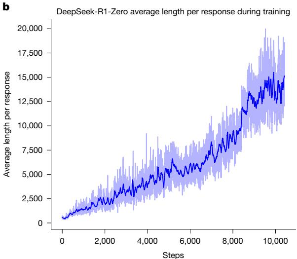

# DeepSeek-R1 透過強化學習激勵大型語言模型進行推理

https://doi.org/10.1038/s41586-025-09422-z

收稿：2025年2月14日

接受：2025年7月17日

線上發布：2025年9月17日

開放取用

檢查更新

通用推理一直是人工智慧（AI）領域一個長期而艱鉅的挑戰。最近的突破，例如大型語言模型（LLMs） 和思維鏈（CoT）提示技術，在基礎推理任務上取得了可觀的成功。然而，這種成功在很大程度上依賴於大量人工註釋的示範，且模型的能力對於更複雜的問題仍然不足。在此，我們展示了大型語言模型的推理能力可以透過**純強化學習（RL）**來激發，從而省去了對人工標記推理軌跡的需求。我們提出的RL框架促進了**自我反思**、**驗證**和**動態策略適應**等高階推理模式的**自發發展**。因此，經過訓練的模型在**可驗證的任務**（如數學、程式競賽和STEM領域）上取得了卓越的表現，超越了其透過傳統監督學習在人類示範上訓練的對應模型。此外，這些大型模型所展現的自發推理模式可以系統性地用於指導和提升小型模型的推理能力。

推理能力是人類智慧的基石，它使得從數學解題到邏輯推導和程式設計等複雜認知任務成為可能。最近AI的進展顯示，當擴展到足夠大的規模時，大型語言模型可以展現出**自發行為**，包括推理能力。然而，在預訓練階段實現此類能力通常需要大量的計算資源。與此同時，另一條研究路線表明，透過思維鏈（CoT）提示技術，大型語言模型可以得到有效強化。這種技術透過提供精心設計的 few-shot 範例或使用「讓我們一步步思考」等最簡潔的提示，使模型能夠產生中間推理步驟，從而大幅提升其在複雜任務上的表現。同樣地，當模型在後訓練階段學習**高品質、多步驟的推理軌跡**時，也觀察到了進一步的性能提升。儘管這些方法有效，但它們也存在顯著的局限性。它們對人工註釋推理軌跡的依賴性減緩了擴展性，並引入了認知偏差。此外，透過將模型限制為複製人類思維過程，其性能**受到人類提供的範例的固有限制**，這阻礙了探索更優越、非人類般的推理路徑。

為了解決這些問題，我們旨在探索大型語言模型在**最少依賴人工標註**的情況下，透過RL框架中的**自我演化**來發展推理能力的潛力。具體來說，我們基於 DeepSeek-V3 Base，並使用**群組相對策略優化（GRPO）**作為我們的RL框架。獎勵信號**僅基於最終預測相對於真實答案的正確性**，而**不對推理過程本身施加任何約束**。值得注意的是，我們**繞過了傳統的監督式微調（SFT）階段**，直接進行RL訓練。這種設計選擇源於我們的假設：**人類定義的推理模式可能會限制模型的探索**，而**不受限制的RL訓練可以更好地激發大型語言模型中新推理能力的自發產生**。透過這個在下一節中詳細介紹的過程，我們的模型（稱為 DeepSeek-R1-Zero）**自然地發展出了多樣化且複雜的推理行為**。為了解決推理問題，模型傾向於**產生更長的回答**，並在每個回答中融入**驗證、反思和探索替代方法**。儘管我們沒有明確地教導模型如何推理，但它透過RL成功地學習了改進的推理策略。

雖然 DeepSeek-R1-Zero 展現了出色的推理能力，但它也面臨一些挑戰，例如**可讀性差**和**語言混用**，偶爾會將英文和中文混合在一個思維鏈（CoT）回應中。此外，DeepSeek-R1-Zero 的基於規則的RL訓練階段**過於專注於推理任務**，導致其在**寫作和開放領域問答**等更廣泛領域的表現有限。為了解決這些挑戰，我們引入了 DeepSeek-R1，這是一個透過**整合拒絕取樣（rejection sampling）、RL和監督式微調（SFT）**的多階段學習框架訓練而成的模型，詳見「DeepSeek-R1」章節。這個訓練流程使 DeepSeek-R1 能夠繼承其前身 DeepSeek-R1-Zero 的推理能力，同時透過進一步的非推理數據**將模型行為與人類偏好對齊**。

為了以更低的能源成本讓更多人能夠使用強大的人工智慧，我們蒸餾了幾個較小的模型並將它們公開。這些蒸餾後的模型展現出強大的推理能力，超越了其原始指令微調版本的性能。我們相信，這些指令微調版本也將為研究社群做出巨大貢獻，為理解長思維鏈推理模型背後的機制並促進更強大推理模型的發展提供寶貴資源。我們公開發布 DeepSeek-R1-Zero、DeepSeek-R1、數據樣本和蒸餾模型，如「程式碼可用性」部分所述。


## DeepSeek-R1-Zero

為了實施大規模的 DeepSeek-R1-Zero RL 訓練，我們採用了一個高效的RL管線。具體來說，我們使用 **GRPO** 作為我們的RL演算法，詳見「GRPO」方法部分。此外，我們使用基於規則的獎勵系統來計算**準確度獎勵和格式獎勵**，其詳細方法在「獎勵設計」方法部分中有概述。此外，我們的**高效能RL基礎設施**在補充資訊第2.1節中有所描述，確保了訓練的可擴展性和效率。

具體來說，我們在 DeepSeek-V3 Base 上應用了RL技術來訓練 DeepSeek-R1-Zero。在訓練期間，我們設計了一個簡單的範本，要求 DeepSeek-R1-Zero **首先產生推理過程，然後是最終答案**。提示範本如下所示：


```
A conversation between User and Assistant. The User asks a question and the Assistant solves it. The Assistant first thinks about the reasoning process in the mind and then provides the User with the answer. The reasoning process and answer are enclosed within \<think\>...\</think\> and \<answer\>...\</answer\> tags, respectively, that is, \<think\>reasoning process here \</think\> \<answer\> answer here \</answer\>. User: prompt. Assistant:

```

其中 `prompt` 在訓練期間被替換為具體的推理問題。我們**有意地將約束限制在此結構格式上**，避免任何內容特有的偏差，以確保我們能準確觀察模型在RL過程中的自然進程。

圖1a顯示了 DeepSeek-R1-Zero 在整個RL訓練過程中，於 **2024年美國數學邀請賽（AIME）**基準測試上的性能軌跡。其中，AIME 2024的平均 pass@1 分數顯著提升，從最初的 $15.6\%$ 上升到 $77.9\%$。此外，透過使用**自我一致性解碼（self-consistency decoding）**，模型的性能可以進一步提升，達到 $86.7\%$ 的準確度。這一表現**大大超越了所有AIME人類參賽者的平均表現**。除了數學競賽，如補充圖8所示，DeepSeek-R1-Zero 在**程式設計競賽**和**研究生級別的生物、物理和化學問題**上也取得了非凡的表現。這些結果凸顯了RL在增強大型語言模型推理能力方面的有效性。



除了在訓練期間推理能力的逐步提升，DeepSeek-R1-Zero 還展示了透過RL訓練實現的**自我演化行為**。如圖1b所示，DeepSeek-R1-Zero 在整個訓練過程中**思考時間持續增加**，這僅由**內在適應**而非外部修改所驅動。透過利用**長思維鏈（long CoT）**，模型逐步完善其推理，產生數百到數千個tokens來探索和改進其解題策略。

思考時間的增加有助於**高階行為的自主發展**。具體來說，DeepSeek-R1-Zero 越來越多地展現出**高階推理策略**，例如**反思性推理**和**對替代解決方案的系統性探索**（見擴展數據圖1a），這**大大提升了其在可驗證任務（如數學和程式設計）上的性能**。值得注意的是，在訓練期間，DeepSeek-R1-Zero 展現出一個「**啊哈時刻（aha moment）**」，如表1所示，其特徵是反思中**「wait」（等等）一詞的使用量突然增加**（見擴展數據圖1b）。這一時刻標誌著推理模式的明顯變化，並清楚地顯示了 DeepSeek-R1-Zero 的自我演化過程。

DeepSeek-R1-Zero 的自我演化凸顯了RL的力量和美妙之處：我們**沒有明確地教導模型如何解決問題，我們只是給予它正確的激勵，它便自主地發展出高階解題策略**。這提醒了我們RL在解鎖大型語言模型更高層次能力方面的潛力，為未來更自主、適應性更強的模型鋪平了道路。

## DeepSeek-R1

儘管 DeepSeek-R1-Zero 展現了強大的推理能力，但它面臨幾個問題。DeepSeek-R1-Zero 難以解決**可讀性差**和**語言混用**等挑戰，因為 DeepSeek-V3 Base 是在多種語言（尤其是英文和中文）上訓練的。為了解決這些問題，我們開發了 DeepSeek-R1，其管線如圖2所示。在初始階段，我們收集了數千個**「冷啟動」（cold-start）數據**，這些數據展現出對話式、與人類對齊的思維過程，詳見補充資訊第2.3.2節。然後，應用RL訓練，其超參數詳見「第一階段RL的訓練細節」方法部分，數據細節詳見補充資訊第2.3.1節，以透過對話式思維過程和語言一致性來改善模型性能。隨後，我們再次應用拒絕取樣和SFT。該階段將**推理和非推理數據集**都納入SFT過程，詳見補充資訊第2.3.3節，使模型不僅擅長推理任務，還能展現出**高階寫作能力**。為了進一步使模型與人類偏好對齊，我們實施了第二階段RL，旨在**提升模型的有用性（helpfulness）和無害性（harmlessness）**，同時**精煉其推理能力**。獎勵模型在「獎勵設計」方法部分中描述，而RL超參數則在「第二階段RL的訓練細節」方法部分中。總訓練成本列在補充資訊第2.4.4節中。

我們評估了我們的模型在 MMLU、MMLU-Redux、MMLU-Pro、DROP、C-Eval、IFEval、FRAMES、GPQA Diamond、SimpleQA、C-SimpleQA、CLUEWSC、AlpacaEval 2.0、Arena-Hard、SWE-bench Verified、Aider-Polyglot、LiveCodeBench (2024-08-2025-01)、Codeforces、中國全國高中數學奧林匹克競賽（CNMO 2024） 和 AIME 2024 上的表現。這些基準測試的詳細資訊在補充表15-29中提供。

表2總結了 DeepSeek-R1 在幾個開發階段的表現，如圖2所示。DeepSeek-R1-Zero 和 DeepSeek-R1 Dev1 之間的比較顯示，在**指令遵循（instruction-following）**方面有實質性改進，這由 IF-Eval 和 Arena-Hard 基準測試上的更高分數證明。然而，由於**冷啟動數據集的規模有限**，Dev1 的推理性能相較於 DeepSeek-R1-Zero 有部分退化，在AIME基準測試上尤為顯著。相比之下，DeepSeek-R1 Dev2 在需要**高階推理技能的基準測試**上展現出顯著的性能提升，包括那些專注於**程式碼生成、數學解題和STEM相關任務**的測試。針對通用任務的基準測試，如 AlpacaEval 2.0，則顯示出邊際改進。這些結果表明，**以推理為導向的RL顯著增強了推理能力，同時對以用戶偏好為導向的基準測試影響有限**。

DeepSeek-R1 Dev3 將**推理和非推理數據集**都整合到SFT管線中，從而提升了模型在推理和通用語言生成任務方面的熟練度。與 Dev2 相比，DeepSeek-R1 Dev3 在 AlpacaEval 2.0 和 Aider-Polyglot 上取得了顯著的性能提升，這歸因於**包含大規模的非推理語料庫和程式設計數據集**。最後，在 DeepSeek-R1 Dev3 上使用**混合了推理和通用數據**進行的全面RL訓練產生了最終的 DeepSeek-R1。程式碼和數學基準測試的改進幅度較小，因為在先前的階段已進行了大量的推理專用RL訓練。最終的 DeepSeek-R1 的主要進展在於**通用指令遵循和用戶偏好基準測試**，其中 AlpacaEval 2.0 提升了 $25\%$，Arena-Hard 提升了 $17\%$。

我們還在補充資訊第4.2節中將 DeepSeek-R1 與其他模型進行了比較。模型安全性評估在補充資訊第4.3節中提供。補充資訊第5節提供了全面的評估分析，包括與 DeepSeek-V3 的比較、在新測試集上的性能評估、數學能力按類別的細分以及對測試時縮放行為的探討。補充資訊第6節顯示，**強大的推理能力可以轉移到較小的模型上**。


表2 | DeepSeek-R1每個階段的實驗結果

粗體數字表示性能在統計上顯著（t檢驗，P < 0.01）。

## 道德與安全聲明

隨著 DeepSeek-R1 推理能力的提升，我們深刻認識到潛在的道德風險。例如，R1 可能遭受**越獄攻擊**（jailbreak attacks），導致產生**危險內容**，例如炸藥製造計畫，而增強的推理能力使模型能夠提供**操作上更具可行性和可執行性的計畫**。此外，公共模型也容易受到進一步微調的影響，這可能會**破壞其內在的安全防護**。

在補充資訊第4.3節中，我們從幾個角度提交了一份全面的安全報告，包括在開源和內部安全評估基準測試上的表現、跨多種語言的安全性水平以及對抗越獄攻擊的能力。這些全面的安全分析得出結論，與其他最先進的模型相比，DeepSeek-R1 模型**固有的安全水平總體上處於中等水平**（與 GPT-4o（2024-05-13）相當）。此外，當與風險控制系統結合使用時，模型的安全水平提升到了更高的標準。

## 結論、局限性與未來工作

我們介紹了 DeepSeek-R1-Zero 和 DeepSeek-R1，它們依賴於**大規模RL來激勵模型的推理行為**。我們的結果表明，**預訓練的檢查點本身就具有解決複雜推理任務的巨大潛力**。我們相信，解鎖這一潛力的關鍵**不在於大規模的人工註釋，而在於提供高難度的推理問題、一個可靠的驗證器和充足的RL計算資源**。複雜的推理行為，如**自我驗證和反思**，似乎在RL過程中**自然地湧現**。

即使 DeepSeek-R1 在推理基準測試上取得了前沿結果，它仍然面臨幾項能力上的局限，概述如下。

### 結構化輸出和工具使用

目前，DeepSeek-R1 的**結構化輸出能力相較於現有模型仍不理想**。此外，DeepSeek-R1 無法使用**工具**，如搜尋引擎和計算器，來提升輸出性能。然而，由於為結構化輸出和工具使用建立RL環境並不困難，我們相信這個問題將在下一個版本中得到解決。

### token效率

與傳統的測試時計算擴展方法（如多數投票或蒙特卡洛樹搜索（MCTS））不同，DeepSeek-R1 在**推理期間根據問題的複雜性動態分配計算資源**。具體來說，它使用較少的tokens來解決簡單任務，但為複雜任務生成更多的tokens。然而，**在token效率方面仍有進一步優化的空間**，因為在回答較簡單問題時，仍然觀察到**過度推理**（表現為過度思考）的情況。

### 語言混用

DeepSeek-R1 目前針對**中文和英文**進行了優化，這可能導致在處理其他語言的查詢時出現**語言混用問題**。例如，即使查詢是非英文或中文，DeepSeek-R1 仍可能使用英文進行推理和回應。我們旨在未來的更新中解決這個局限。這個局限可能與基礎檢查點 DeepSeek-V3 Base 有關，該模型主要使用中文和英文，因此在這兩種語言的推理中能達到更好的結果。

### 提示工程

在評估 DeepSeek-R1 時，我們觀察到它**對提示很敏感**。**Few-shot 提示始終會降低其性能**。因此，我們建議用戶**直接描述問題並使用 zero-shot 設定指定輸出格式**，以獲得最佳結果。

### 軟體工程任務

由於**評估時間長**，這會影響RL過程的效率，因此大規模RL尚未廣泛應用於軟體工程任務。因此，DeepSeek-R1 在軟體工程基準測試上**並未比 DeepSeek-V3 表現出巨大的改進**。未來的版本將透過**在軟體工程數據上實施拒絕取樣**或**在RL過程中引入非同步評估**來提高效率，從而解決此問題。

除了具體的能力局限，純RL方法本身也存在固有的挑戰：

### 獎勵駭客（Reward hacking）

純RL的成功取決於**可靠的獎勵信號**。在這項研究中，我們透過**一個基於規則的推理領域獎勵模型**來確保獎勵的可靠性。然而，對於某些任務（例如寫作），**很難構建這種可靠的獎勵模型**。如果獎勵信號由一個模型而不是預定義的規則來分配，那麼隨著訓練的進行，它會變得**更容易被利用**，這意味著策略模型可能會找到**捷徑來欺騙獎勵模型**。因此，對於那些無法透過可靠獎勵模型有效評估的複雜任務，**擴展純RL方法仍然是一個開放的挑戰**。

在這項工作中，對於無法獲得可靠信號的任務，DeepSeek-R1 使用**人工註釋來創建監督數據**，並且只進行了數百個RL步驟。我們希望未來能獲得一個強健的獎勵模型來解決此類問題。

隨著 DeepSeek-R1 等純RL方法的出現，未來對於**任何可以被驗證器有效評估的任務**，無論其對人類有多複雜，都擁有巨大的解決潛力。配備了如此先進RL技術的機器，註定會**在這些領域超越人類的能力**，這是由其透過試錯法反覆優化性能的能力所驅動的。然而，對於那些**難以構建可靠獎勵模型的任務**，挑戰依然存在。在這種情況下，**缺乏強健的反饋機制可能會減緩進展**，這表明未來的研究應專注於開發創新方法，為這些複雜、較難驗證的問題定義和完善獎勵結構。

此外，在推理過程中**利用工具**也具有顯著前景。無論是使用編譯器或搜尋引擎等工具來檢索或計算必要資訊，還是使用生物或化學試劑等外部工具來驗證現實世界中的最終結果，這種**工具增強型推理的整合**可以極大地擴展機器驅動解決方案的範圍和準確性。

### 線上內容

任何方法、額外參考資料、Nature Portfolio 報告摘要、原始數據、擴展數據、補充資訊、致謝、同行審查資訊、作者貢獻和利益衝突聲明；以及數據和程式碼可用性聲明，均可在 https://doi.org/10.1038/s41586-025-09422-z 查閱。

1. Brown, T. B. et al. Language models are few-shot learners. In Advances in Neural Information Processing Systems 33 (eds Larochelle, H. et al.) (ACM, 2020).
2. OpenAI et al. GPT4 technical report. Preprint at https://doi.org/10.48550/arXiv.2303.08774 (2024).
3. Wei, J. et al. Chain-of-thought prompting elicits reasoning in large language models. In Advances in Neural Information Processing Systems 35 (eds Koyejo, S. et al.) 24824-24837 (ACM, 2022).
4. Wei, J. et al. Emergent abilities of large language models. In Transactions on Machine Learning Research (eds Kamath, G. et al.) (2022).
5. Kaplan, J. et al. Scaling laws for neural language models. Preprint at https://doi.org/10.48550/arXiv:2001.08361 (2020).
6. Kojima, T., Gu, S. S., Reid, M., Matsuo, Y. & Iwasawa, Y. Large language models are zero-shot reasoners. In Advances in Neural Information Processing Systems 35 (eds Oh, A. H. et al.) 22199-22213 (ACM, 2022).
7. Chung, H. W. et al. Scaling instruction-finetuned language models. J. Mach. Learn. Res. 25, 1-53 (2024).
8. DeepSeek-AI et al. DeepSeek-V3 technical report. Preprint at https://doi.org/10.48550/arXiv.2412.19437 (2025).
9. Shao, Z. et al. DeepSeekMath: pushing the limits of mathematical reasoning in open language models. Preprint at https://doi.org/10.48550/arXiv.2402.03300 (2024).
10. Wang, X. et al. Self-consistency improves chain of thought reasoning in language models. In 11th International Conference on Learning Representations (ICLR, 2023).
11. Hendrycks, D. et al. Measuring massive multitask language understanding. In 9th International Conference on Learning Representations (ICLR, 2021).
12. Gema, A. P. et al. Are we done with MMLU? In Proc. 2025 Conference of the Nations of the Americas Chapter of the Association for Computational Linguistics: Human Language Technologies (eds Chiruzzo, L. et al.) Vol. 1 (Long Papers), 5069-5096 (ACL, 2025).
13. Wang, Y. et al. MMLU-Pro: a more robust and challenging multi-task language understanding benchmark. In Advances in Neural Information Processing Systems 37 (eds Globersons, A. et al.) 95266-95290 (ACM, 2024).
14. Dua, D. et al. DROP: a reading comprehension benchmark requiring discrete reasoning over paragraphs. In Proc. 2019 Conference of the North American Chapter of the Association for Computational Linguistics: Human Language Technologies Vol. 1 (Long and Short Papers) (eds Burstein, J. et al.) 2368-2378 (ACL, 2019).
15. Huang, Y. et al. C-EVAL: a multi-level multi-discipline Chinese evaluation suite for foundation models. In Advances in Neural Information Processing Systems 36 (eds Oh, A. et al.) 62991-63010 (ACM, 2023).
16. Zhou, J. et al. Instruction-following evaluation for large language models. Preprint at https://doi.org/10.48550/arXiv.2311.07911 (2023).
17. Krishna, S. et al. Fact, fetch, and reason: a unified evaluation of retrieval-augmented generation. In Proc. 2025 Conference of the Nations of the Americas Chapter of the Association for Computational Linguistics: Human Language Technologies Vol. 1 (Long Papers) 4745-4759 (ACL, 2025).
18. Rein, D. et al. GPQA: a graduate-level Google-proof Q&A benchmark. Preprint at https://doi.org/10.48550/arXiv.2311.12022 (2023).
19. OpenAI. Introducing SimpleQA; https://openai.com/index/introducing-simpleqa/ (2024).
20. He, Y. et al. Chinese SimpleQA: a Chinese factuality evaluation for large language models. In Proc. 63rd Annual Meeting of the Association for Computational Linguistics Vol. 1 (Long Papers), 19182-19208 (ACL, 2025).
21. Xu, L. et al. CLUE: a Chinese Language Understanding Evaluation benchmark. In Proc. 28th International Conference on Computational Linguistics (eds Scott, D. et al.) 4762-4772 (International Committee on Computational Linguistics, 2020).
22. Dubois, Y., Galambosi, B., Liang, P. & Hashimoto, T. B. Length-controlled AlpacaEval: a simple way to debias automatic evaluators. Preprint at https://doi.org/10.48550/arXiv.2404.04475 (2025).
23. Li, T. et al. From crowdsourced data to high-quality benchmarks: Arena-Hard and BenchBuilder pipeline. Preprint at https://doi.org/10.48550/arXiv.2406.11939 (2024).
24. OpenAI. Introducing SWE-bench verified; https://openai.com/index/introducing-swe-bench-verified/ (2024).
25. Aider. Aider LLM leaderboards; https://aider chat/docs/leaderboards/ (2024).
26. Jain, N. et al. LiveCodeBench: holistic and contamination free evaluation of large language models for code. In 13th International Conference on Learning Representations (ICLR, 2024).
27. Mirzayanov, M. Codeforces; https://codeforces.com/ (2025).
28. Chinese Mathematical Society (CMS). Chinese National High School Mathematics Olympiad; https://www.cms.org.cn/Home/comp/comp/cid/12.html (2024).
29. Mathematical Association of America. American Invitational Mathematics Examination; https://maa.org/maa-invitational-competitions (2024).
30. OpenAI. Hello GPT-4o; https://openai.com/index/hello-gpt-4o/ (2024).

發行商聲明 Springer Nature 在發行關於管轄權主張的圖表和機構隸屬關係方面保持中立。


開放取用 本文根據「創作共用署名 4.0 國際許可證」（Creative Commons Attribution 4.0 International License）授權，該許可證允許在任何媒介或格式下使用、分享、改編、分發和複製，只要您為原始作者和來源提供適當的**署名**，提供**許可證連結**，並**標明是否進行了修改**。除非在文章的創作共用許可證中另有說明，否則文章中的圖像或其他第三方材料均包含在許可證中。如果材料未包含在文章的創作共用許可證中，並且您意圖的使用不被法定規定所允許或超過了允許的範圍，您將需要直接從版權持有者處獲得許可。欲查看本許可證的副本，請訪問 http://creativecommons.org/licenses/by/4.0/。

© The Author(s) 2025

Daya Guo , Dejian Yang , Haowei Zhang , Junxiao Song , Peiyi Wang , Qihao Zhu , Runxin Xu , Ruoyu Zhang , Shirong Ma , Xiao Bi , Xiaokang Zhang , Xingkai Yu , Yu Wu , Z. F. Wu , Zhibin Gou , Zhihong Shao , Zhuoshu Li , Ziyi Gao , Aixin Liu , Bing Xue , Bingxuan Wang , Bochao Wu , Bei Feng , Chengda Lu , Chenggang Zhao , Chengqi Deng , Chong Ruan , Damai Dai , Deli Chen , Dongjie Ji , Erhang Lin , Fangyun Lin , Fucong Dai , Fuli Luo , Guangbo Hao , Guanting Chen , Guowei Li , H. Zhang , Hanwei Xu , Honghui Ding , Huazuo Gao , Hui Qu , Hui Li , Jianzhong Guo , Jiashi Li , Jingchang Chen , Jingyang Yuan , Jinhao Tu , Junjie Qiu , Junlong Li , J. L. Cai , Jiaqi Ni , Jian Liang , Jin Chen , Kai Dong , Kaichao You , Kaige Gao , Kang Guan , Kexin Huang , Kuai Yu , Lean Wang , Lecong Zhang , Liang Zhao , Litong Wang , Liyue Zhang , Lei Xu , Leyi Xia , Mingchuan Zhang , Minghua Zhang , Minghui Tang , Mingxu Zhou , Meng Li , Miaojun Wang , Mingming Li , Ning Tian , Panpan Huang , Peng Zhang , Qiancheng Wang , Qinyu Chen , Qiushi Du , Ruiqi Ge , Ruisong Zhang , Ruizhe Pan , Runji Wang , R. J. Chen , R. L. Jin , Ruyi Chen , Shanghai Lu , Shangyan Zhou , Shanhuang Chen , Shengfeng Ye , Shiyu Wang , Shuiping Yu , Shunfeng Zhou , Shuting Pan , S. S. Li , Shuang Zhou , Shaoqing Wu , Tao Yun , Tian Pei , Tianyu Sun , T. Wang , Wangding Zeng , Wen Liu , Wenfeng Liang , Wenjun Gao , Wenqin Yu , Wentao Zhang , W. L. Xiao , Wei An , Xiaodong Liu , Xiaohan Wang , Xiaokang Chen , Xiaotao Nie , Xin Cheng , Xin Liu , Xin Xie , Xingchao Liu , Xinyu Yang , Xinyuan Li , Xuecheng Su , Xuheng Lin , X. Q. Li , Xiangyue Jin , Xiaojin Shen , Xiaosha Chen , Xiaowen Sun , Xiaoxiang Wang , Xinnan Song , Xinyi Zhou , Xianzhu Wang , Xinxia Shan , Y. K. Li , Y. Q. Wang , Y. X. Wei , Yang Zhang , Yanhong Xu , Yao Li , Yao Zhao , Yaofeng Sun , Yaohui Wang , Yi Yu , Yichao Zhang , Yifan Shi , Yiliang Xiong , Ying He , Yishi Piao , Yisong Wang , Yixuan Tan , Yiyang Ma , Yiyuan Lu , Yongqiang Guo , Yuan Ou , Yuduan Wang , Yue Gong , Yuheng Zou , Yujia He , Yunfan Xiong , Yuxiang Luo , Yuxiang You , Yuxuan Lu , Yuyang Zhou , Y.X. Zhu , Yanping Huang , Yaohui Li , Yi Zheng , Yuchen Zhu , Yunxian Ma , Ying Tang , Yukun Zha , Yuting Yan , Z. Z. Ren , Zehui Ren , Zhangli Sha , Zhe Fu , Zhean Xu , Zhenda Xie , Zhengyan Zhang , Zhenwen Hao , Zhicheng Ma , Zhigang Yan , Zhiyu Wu , Zihui Gu , Zijia Zhu , Zijun Liu , Zilin Li , Ziwei Xie , Ziyang Song , Zizheng Pan , Zhen Huang , Zhipeng Xu , Zhongyu Zhang & Zhen Zhang

 DeepSeek-AI Team, Hangzhou, China. Present address: Individual Researcher, Beijing, China. Present address: Jianping High School, Shanghai, China. Present address: University of Science and Technology of China, Hefei, China. Present address: Peking University, Beijing, China. Present address: Tsinghua University, Beijing, China. Present address: Citadel Securities, Hong Kong SAR, China. e-mail: wenfeng.liang@deepseek.com

## 方法

### GRPO

GRPO 是我們用來訓練 DeepSeek-R1-Zero 和 DeepSeek-R1 的RL演算法。它最初被提出是為了簡化訓練過程並減少近端策略優化（PPO） 的資源消耗，而 PPO 被廣泛用於大型語言模型的RL階段。GRPO 的管線如擴展數據圖2所示。

對於每個問題 $q$，GRPO 從舊策略 $\pi_{\theta_{\mathrm{old}}}$ 中取樣一組輸出 $\{o_1, o_2, \dots, o_G\}$，然後透過最大化以下目標來優化策略模型 $\pi_{\theta}$：

$$
\mathcal{L}_{\mathrm{GRPO}} (\theta) = \mathbb{E}_{(q, \{o_i\}_{i=1}^G) \sim \mathcal{D}_{\mathrm{rollout}}} \left[ \sum_{i=1}^G \left( \frac{\pi_{\theta}(o_i|q)}{\pi_{\theta_{\mathrm{old}}}(o_i|q)} \right) \cdot A_i - \beta \cdot \sum_{i=1}^G \left( \mathrm{KL}\left( \pi_{\theta}(o_i|q) \| \pi_{\mathrm{ref}}(o_i|q) \right) \right) \right]
$$

其中 $\pi_{\mathrm{ref}}$ 是一個參考策略，$\epsilon$ 和 $\beta$ 是超參數，$A_i$ 是優勢值（advantage），使用一組與每組輸出相對應的獎勵 $\{r_1, r_2, \dots, r_G\}$ 來計算：

$$
A_i = \mathrm{clip}(r_i - \frac{1}{G} \sum_{j=1}^G r_j, -\epsilon, \epsilon)
$$

我們在補充資訊第1.3節中提供了 GRPO 和 PPO 的比較。

### 獎勵設計

獎勵是訓練信號的來源，它決定了RL優化的方向。對於 DeepSeek-R1-Zero，我們使用**基於規則的獎勵**來為數學、程式碼和邏輯推理領域的數據提供精確的反饋。對於 DeepSeek-R1，我們透過**結合用於推理導向數據的基於規則獎勵和用於通用數據的基於模型獎勵**來擴展此方法，從而增強學習過程在不同領域的適應性。

**基於規則的獎勵。**我們的基於規則的獎勵系統主要由兩種獎勵組成：**準確度獎勵（accuracy rewards）和格式獎勵（format rewards）**。

* **準確度獎勵**評估回應是否正確。例如，在有確定結果的數學問題中，模型被要求以指定格式（例如，在一個框內）提供最終答案，從而能夠可靠地透過規則來驗證其正確性。同樣地，對於程式碼競賽提示，可以使用**編譯器**來針對一組預定義的測試案例評估模型的回答，從而產生關於正確性的客觀反饋。
* **格式獎勵**透過強制執行特定的格式要求來補充準確度獎勵模型。特別是，模型被激勵將其推理過程封裝在指定的標籤內，即 `<think>` 和 `</think>`。這確保了模型的思維過程被明確地劃定，增強了解釋性並促進後續分析。

$$
\text{Reward} = w_{\text{accuracy}} \times \text{Reward}_{\text{accuracy}} + w_{\text{format}} \times \text{Reward}_{\text{format}}
$$

準確度獎勵和格式獎勵以相同的權重結合。值得注意的是，我們**避免在推理任務上應用神經獎勵模型**——無論是基於結果還是基於過程的。這個決定是基於我們的觀察，即神經獎勵模型在**大規模RL期間容易受到獎勵駭客攻擊**。此外，重新訓練此類模型需要大量的計算資源，並為訓練管線引入進一步的複雜性，從而使整體優化過程變得複雜。

**基於模型的獎勵。**對於通用數據，我們**訴諸於獎勵模型來捕捉複雜和微妙場景中的人類偏好**。我們基於 DeepSeek-V3 管線，並使用類似的偏好對分佈和訓練提示。對於**有用性（helpfulness）**，我們**專門關注最終摘要**，確保評估強調回應對用戶的用途和相關性，同時最大限度地減少對底層推理過程的干擾。對於**無害性（harmlessness）**，我們評估**模型的整個回應**，包括推理過程和摘要，以識別和減輕在生成過程中可能出現的任何潛在風險、偏見或有害內容。

* **有用性獎勵模型（Helpful reward model）。**對於有用性獎勵模型的訓練，我們首先使用 Arena-Hard 提示格式（補充資訊第2.2節中列出）來提示 DeepSeek-V3，以產生偏好對，其中每對由一個用戶查詢和兩個候選回應組成。對於每對偏好對，我們查詢 DeepSeek-V3 四次，隨機將回應分配為回應A或回應B，以減輕位置偏差。最終的偏好分數由四個獨立判斷的平均值決定，僅保留分數差 $(\Delta)$ 超過1的對，以確保有意義的區別。此外，為了最小化與長度相關的偏差，我們確保整個數據集中被選擇和被拒絕的回應具有可比較的長度。總共，我們為訓練獎勵模型**策劃了66,000個數據對**。該數據集中使用的提示**均為非推理問題**，來源於公開的開源數據集或已明確同意分享其數據以用於模型改進的用戶。我們的獎勵模型架構與 DeepSeek-R1 一致，並**額外添加了一個獎勵頭**，用於預測**標量偏好分數**。

$$
\text{Loss} = -\log (\sigma(\text{Reward}(x, y_{\text{chosen}}) - \text{Reward}(x, y_{\text{rejected}})))
$$

有用性獎勵模型以256的批次大小、 $6 \times 10^{-6}$ 的學習率和單一 epoch 進行訓練。訓練期間的最大序列長度設置為8,192個tokens，而在獎勵模型推理期間沒有施加明確的限制。

* **安全性獎勵模型（Safety reward model）。**為了評估和提升模型安全性，我們策劃了一個包含106,000個提示的數據集，其中包含根據預定義安全指南被註釋為「安全」或「不安全」的模型生成回應。與有用性獎勵模型中使用的配對損失（pairwise loss）不同，**安全性獎勵模型使用點式方法（pointwise methodology）進行訓練**，以區分安全和不安全的回應。訓練超參數與有用性獎勵模型相同。

$$
\text{Loss} = -\sum_{i=1}^N \text{target}_i \log(\text{pred}_i)
$$

對於通用查詢，每個實例都被分類為屬於安全性數據集或有用性數據集。分配給每個查詢的通用獎勵 $\text{Reward}_{\text{general}}$ 對應於相關數據集中定義的各自獎勵。

### 訓練細節

**DeepSeek-R1-Zero 的訓練細節。**為了訓練 DeepSeek-R1-Zero，我們將學習率設置為 $3 \times 10^{-6}$，KL係數設置為0.001，取樣溫度設置為1。對於每個問題，我們在8.2k步之前取樣16個輸出，最大長度為32,768個tokens，之後為65,536個tokens。因此，DeepSeek-R1-Zero 的性能和回應長度在8.2k步時都出現了顯著跳躍，總共訓練了10,400個步驟，相當於1.6個訓練週期。每個訓練步驟由32個獨特的問題組成，導致每步的訓練批次大小為512。每400步，我們將參考模型替換為最新的策略模型。為了加速訓練，每次生成都會產生8,192個輸出，這些輸出被隨機分割成16個小批次，並且只進行單一的內部週期訓練。

**第一階段RL的訓練細節。**在RL的第一階段，我們將學習率設置為 $3 \times 10^{-6}$，KL係數設置為0.001，GRPO剪裁比率 $\epsilon$ 設置為10，取樣溫度設置為1。對於每個問題，我們取樣16個輸出，最大長度為32,768。每個訓練步驟由32個獨特的問題組成，導致每步的訓練批次大小為512。每400步，我們將參考模型替換為最新的策略模型。為了加速訓練，每次生成都會產生8,192個輸出，這些輸出被隨機分割成16個小批次，並且只進行單一的內部週期訓練。然而，為了**緩解語言混用問題**，我們在RL訓練期間引入了**語言一致性獎勵**，其計算方式為CoT中**目標語言單詞的比例**。

$$
\text{Reward}_{\text{language}} = \frac{\text{Number of target language words in CoT}}{\text{Total number of words in CoT}}
$$

儘管補充資訊第2.6節中的消融實驗顯示，這種對齊會導致模型性能略有下降，但這種獎勵**與人類偏好對齊，使其更具可讀性**。我們透過將其直接添加到最終獎勵中，將語言一致性獎勵應用於推理和非推理數據。

值得注意的是，剪裁比率在訓練中起著關鍵作用。較低的值可能導致大量tokens的梯度被截斷，從而降低模型性能；而較高的值可能會導致訓練期間的不穩定。本階段使用的RL數據詳見補充資訊第2.3節。

**第二階段RL的訓練細節。**具體來說，我們使用**獎勵信號和多樣化的提示分佈**相結合的方式來訓練模型。對於推理數據，我們遵循 DeepSeek-R1-Zero 中概述的方法，該方法使用基於規則的獎勵來指導數學、程式碼和邏輯推理領域的學習。在訓練過程中，我們觀察到 CoT 經常會出現語言混用，特別是當RL提示涉及多種語言時。對於通用數據，我們使用**獎勵模型**來指導訓練。最終，將獎勵信號與多樣化的數據分佈相結合，使我們能夠開發出一個不僅擅長推理，而且**優先考慮有用性和無害性**的模型。給定一批數據，獎勵可以公式化為：

$$
\text{Reward} = \alpha \times \text{Reward}_{\text{reasoning}} + (1 - \alpha) \times \text{Reward}_{\text{general}}
$$

其中

$$
\text{Reward}_{\text{reasoning}} = \text{Reward}_{\text{accuracy}} + \text{Reward}_{\text{format}}
$$

$$
\text{Reward}_{\text{general}} = \text{Reward}_{\text{helpfulness}} + \text{Reward}_{\text{harmlessness}} + \text{Reward}_{\text{language}}
$$

第二階段RL保留了第一階段的大部分參數，主要區別是將**溫度降低到0.7**，因為我們發現在這個階段較高的溫度會導致生成不連貫。這個階段總共包含1,700個訓練步驟，其中**通用指令數據和基於偏好的獎勵僅在最後400個步驟中被納入**。我們發現，使用基於模型的偏好獎勵信號進行更多的訓練步驟可能會導致**獎勵駭客**，這在補充資訊第2.5節中有詳細說明。

## 數據可用性

我們提供了用於拒絕取樣和RL提示的數據樣本，可在 https://github.com/deepseek-ai/DeepSeek-R1 (https://doi.org/10.5281/zenodo.15753193) 獲取。我們完整數據生成方法的綜合統計和細節在補充資訊第2.3節中呈現。

## 程式碼可用性

DeepSeek-R1-Zero 和 DeepSeek-R1 的訓練權重在 MIT 許可證下發布於 https://github.com/deepseek-ai/DeepSeek-R1 (https://doi.org/10.5281/zenodo.15753193)。推論腳本發布於 https://github.com/deepseek-ai/DeepSeek-V3 (https:// doi.org/10.5281/zenodo.15753347)。神經網路使用 **PyTorch** 開發，分佈式框架基於我們的內部框架 HAI-LLM (https://www.high-flyer.cn/en/blog/hai-llm)。推論框架基於 **vLLM**。數據分析使用 Python v.3.8 (https://www.python.org/)、NumPy v.1.23.1 (https://github.com/ numpy/numpy)、matplotlib v.3.5.2 (https://github.com/matplotlib/matplotlib) 和 TensorBoard v.2.9.1 (https://github.com/tensorflow/tensorboard)。

31. Schulman, J., Wolski, F., Dhariwal, P., Radford, A. & Klimov, O. Proximal policy optimization algorithms. Preprint at https://doi.org/10.48550/arXiv.1707.06347 (2017).
32. Ouyang, L. et al. Training language models to follow instructions with human feedback. In Advances in Neural Information Processing Systems 35 (eds Koyejo, S. et al.) 27730-27744 (ACM, 2022).
33. Nano et al. deepseek-ai/DeepSeek-R1: v1.0.0. Zenodo https://doi.org/10.5281/zenodo.15753192 (2025).
34. Yu, X. et al. deepseek-ai/DeepSeek-V3: v1.0.0. Zenodo https://doi.org/10.5281/zenodo.15753346 (2025).
35. Paszke, A. et al. PyTorch: an imperative style, high-performance deep learning library. In Advances in Neural Information Processing Systems 32 (eds Wallach, H. M. et al.) 8026-8037 (ACM, 2019).
36. Kwon, W. et al. Efficient memory management for large language model serving with PagedAttention. In Proc. ACM SIGOPS 29th Symposium on Operating Systems Principles 611-626 (ACM, 2023).

## 致謝

本研究由 DeepSeek-AI 贊助。

**作者貢獻** 所有作者都對本出版物有所貢獻，分別參與了數據收集和策劃、實驗設計和大型語言模型訓練框架的建立。作者們還參與了實驗設置的實施和測試、RL過程的精煉以及結果分析的執行。所有貢獻者都討論並批准了科學發現。本文由合作中的一個小組作者撰寫，並經過內部集體審查過程。所有作者都審查並批准了手稿的最終版本。核心貢獻者：D.G., D.Y., H.Z., J.S., R.Z., R.X., Q.Z., S.M., P.W., X.B., X.Z., X.Y., Y.W., Z.F.W., Z.G., Z.S., Z.L., Z.G. 這些被指定為核心貢獻者的作者對本工作做出了同等貢獻，並按字母順序排列。其餘作者也對研究做出了有意義的貢獻，其姓名同樣按字母順序排列。

**利益衝突** 作者聲明不存在任何利益衝突，並且不會申請與本手稿內容相關的專利。

## 額外資訊

**補充資訊** 線上版本包含補充材料，可在 https://doi.org/10.1038/s41586-025-09422-z 獲取。
**通訊和材料請求** 請聯繫 Wenfeng Liang。
**同行審查資訊** Nature 感謝 Edward Beeching, Yarin Gal, Jose Hernandez-Orallo, Daphne Ippolito, Subbarao Kambhampati, Lewis Tunstall, Yiming Zhang 和 Lexin Zhou 對本論文的同行審查貢獻。同行審查報告可供查閱。
**重印和許可資訊** 可在 http://www.nature.com/reprints 獲取。


**擴展數據表1 | 來自 AIME 數據集的一個說明性範例**

**提示**

設 $b \geq 2$ 為一個整數。如果一個正整數 $n$ 在以 $b$ 為基數表示時恰好有兩位數，並且這兩位數的和等於 $\sqrt{n}$，則稱 $n$ 是**b-美數**（b-eautiful）。例如，81是13-美數，因為 $81 = \underline{6} \underline{3}_{13}$，並且 $6 + 3 = \sqrt{81}$。求最小的整數 $b \geq 2$，使得存在**超過十個**b-美數。

請一步一步地進行推理，並將最終答案放在 \boxed{} 內

**評估**

解析`boxed{}`內的最終答案，並使用基於規則的評分器來確定它是否等於真實答案。根據需要對數值進行四捨五入，並使用'SymPy'來解析表達式。

所呈現的問題來源於2024年的AIME。模型被要求解決問題並以所需格式（例如，ANSWER）格式化其答案。為了進行評估，使用基於規則的評分系統來確定正確性。當且僅當模型的輸出與真實解完全匹配時，才被視為正確。