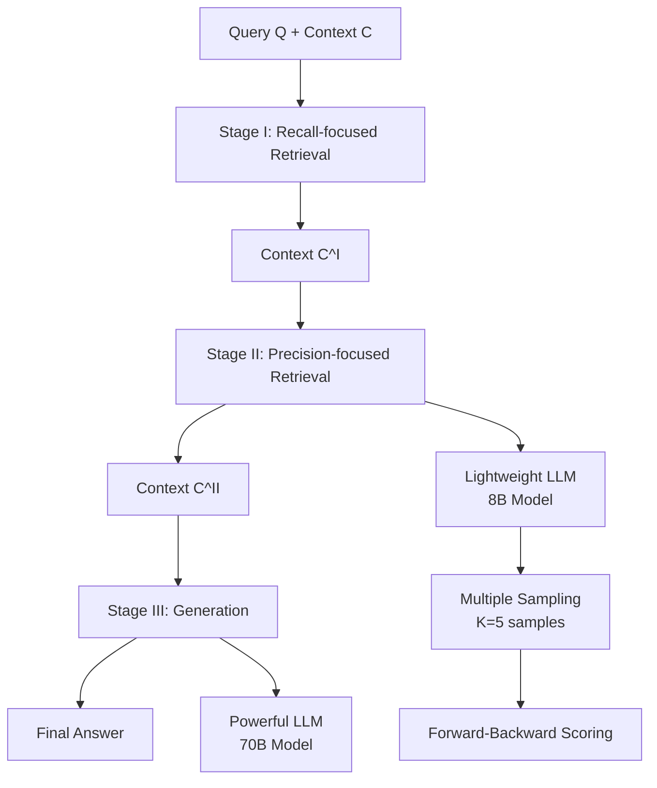

# FB-RAG 方法論分析

## 🎯 方法概述

### 核心技術方法
FB-RAG (Forward-Backward RAG) 是一個**免訓練的三階段檢索增強生成框架**，通過前瞻策略解決傳統RAG在復雜查詢中檢索精準度不足的問題。

### 技術創新點
1. **前瞻檢索機制**: 使用輕量級LLM預覽潛在答案，指導檢索過程
2. **三階段架構**: 召回導向→精度導向→生成的漸進優化
3. **多採樣策略**: 通過多次採樣捕捉模型不確定性
4. **模型分工**: 8B輕量級模型指導 + 70B重量級模型生成

### 方法定位
FB-RAG在RAG技術發展中代表了從**後瞻檢索**向**前瞻檢索**的重要轉變，是首個系統性利用LLM生成能力指導檢索過程的免訓練框架。

## 🏗️ 系統架構分析

### 整體架構設計



### 三階段架構詳解

#### Stage I: 召回導向檢索 (Recall-focused Retrieval)
**功能定位**: 初步縮小檢索範圍，保證召回率
- **輸入**: 原始查詢Q和完整上下文C
- **處理**: 使用現成檢索器（BM25）提取相關塊
- **輸出**: 較小但足夠大的上下文C^I
- **設計目標**: 確保不遺漏關鍵信息，為Stage II提供候選集

#### Stage II: 精度導向檢索 (Precision-focused Retrieval)
**功能定位**: 核心創新階段，利用前瞻信息精確篩選
- **輸入**: 查詢Q和Stage I輸出C^I
- **處理**: 輕量級LLM生成多個推理-答案樣本
- **評分**: 基於塊在樣本中的使用情況評分
- **輸出**: 高度精準的上下文C^II

#### Stage III: 最終生成 (Generation)
**功能定位**: 使用優化的上下文生成最終答案
- **輸入**: 查詢Q和精選上下文C^II
- **處理**: 重量級LLM執行最終生成
- **輸出**: 高質量的最終答案

## 🔧 核心算法分析

### 前瞻-後瞻檢索算法

#### 數學形式化定義

給定查詢Q和上下文C = {C₁, C₂, ..., Cₙ}，FB-RAG的目標是計算每個塊的重要性評分：

**理想情況下的評分函數**:
```
S_FB(C_i; Q, C) = S(C_i; [R*, A*])
```
其中R*是理想推理，A*是理想答案

**實際近似評分函數**:
```
S_FB(C_i; Q, C) = max_{k=1}^K S(C_i; [R_k, A_k])
```
其中K=5是採樣次數，R_k和A_k是第k次採樣的推理和答案

#### 前瞻檢索的核心假設

**假設1**: 輕量級LLM的生成嘗試能提供有效的檢索指導
```
P(C_i* ∈ top-ranked | [R, A]) > P(C_i* ∈ top-ranked | Q)
```

**假設2**: 多採樣能捕獲模型不確定性並提高檢索質量
```
S_multi-sample(C_i) = max_k S(C_i; [R_k, A_k]) > S_single(C_i; [R, A])
```

**假設3**: 即使錯誤的答案嘗試也能提供有用的檢索信號
```
Useful_signal([R_wrong, A_wrong]) > 0
```

### 算法實現細節

#### Stage II 詳細算法流程

```python
def precision_focused_retrieval(Q, C_I, L_light, S_retriever, K=5):
    """
    精度導向檢索算法實現
    
    Args:
        Q: 查詢
        C_I: Stage I輸出的上下文
        L_light: 輕量級LLM (8B)
        S_retriever: 檢索器評分函數
        K: 採樣次數
    
    Returns:
        C_II: 精選的上下文塊
    """
    scores = {}
    
    # 對每個上下文塊初始化評分
    for C_i in C_I:
        scores[C_i] = 0
    
    # 多次採樣生成推理-答案對
    for k in range(K):
        R_k, A_k = L_light.sample(Q, C_I, top_p=0.9, top_k=50)
        
        # 對每個塊基於當前樣本評分
        for C_i in C_I:
            score_k = S_retriever(C_i, [R_k, A_k])
            scores[C_i] = max(scores[C_i], score_k)
    
    # 選擇頂部評分的塊
    C_II = select_top_chunks(scores, target_size)
    return C_II
```

#### 採樣策略設計

**採樣參數**:
- **top-p採樣**: p = 0.9，平衡多樣性和質量
- **top-k採樣**: k = 50，控制候選詞彙範圍
- **採樣次數**: K = 5，實驗確定的最佳值

**最大值策略的理論依據**:
```
S_FB(C_i) = max_{k=1}^K S(C_i; [R_k, A_k])
```

這種設計確保即使某個塊只在一個樣本中被使用，也能獲得高分，有效捕獲相關信息。

## 🎯 模型設計分析

### 雙模型架構設計

#### 輕量級模型 (Llama3.1-8B-Instruct)
**功能定位**: 前瞻檢索的信號生成器
- **參數規模**: 8B，計算成本可控
- **主要任務**: 生成推理-答案樣本用於檢索指導
- **性能要求**: 不需要高準確率，關鍵是提供有用信號
- **優化目標**: 速度和成本效益

**提示詞設計**:
```
Please provide a step-by-step reasoning process followed by your answer.

Rationale: [Your reasoning here]
Answer: [Your final answer here]
```

#### 重量級模型 (Llama3.1-70B-Instruct)
**功能定位**: 最終答案生成器
- **參數規模**: 70B，強大的推理和生成能力
- **主要任務**: 基於精選上下文生成高質量答案
- **性能要求**: 高準確率和流暢度
- **優化目標**: 最終答案質量

### 模型分工的理論基礎

#### 性能-成本權衡分析

**輕量級模型的價值**:
- 即使生成錯誤答案，其嘗試過程仍能指導檢索
- 相比70B模型，推理成本降低約85%
- 通過多採樣提高檢索信號的穩健性

**重量級模型的作用**:
- 利用優化後的上下文生成高質量答案
- 避免在大量噪聲上下文中的性能退化
- 確保最終輸出的專業性和準確性

#### 計算複雜度分析

**時間複雜度**:
- Stage I: O(|C| × d)，其中d是檢索器維度
- Stage II: O(K × |C^I| × L_8B)，其中L_8B是8B模型推理成本
- Stage III: O(|C^II| × L_70B)，其中L_70B是70B模型推理成本

**空間複雜度**:
- O(|C| + K × max_length)，主要由樣本存儲決定

## 🛠️ 實現技術要點

### 關鍵實現挑戰

#### 1. 多採樣的並行化處理
**技術挑戰**: K=5次採樣的計算並行化
**解決方案**: 
- 批量推理降低延遲
- 異步處理提高吞吐量
- GPU資源的高效調度

#### 2. 塊評分的實時計算
**技術挑戰**: 對C^I中每個塊的實時評分計算
**解決方案**:
- 向量化檢索器評分計算
- 緩存機制減少重複計算
- 近似算法在精度和速度間平衡

#### 3. 上下文長度的動態管理
**技術挑戰**: 不同階段上下文大小的動態調整
**解決方案**:
- 自適應塊選擇策略
- 基於任務類型的參數調優
- 記憶體使用的優化管理

### 工程實現細節

#### 檢索器選擇與優化
**BM25檢索器的選擇理由**:
1. **簡單性**: 無需複雜的神經網絡訓練
2. **穩健性**: 對不同領域的數據都有穩定表現
3. **效率**: 計算成本低，適合實時應用
4. **可解釋性**: 評分機制透明，便於調試

#### 上下文塊化策略
**塊大小設定**: 300個詞彙/塊
- **平衡考量**: 語義完整性與檢索粒度
- **實驗驗證**: 300詞在多數任務上表現最佳
- **內存效率**: 避免過長序列的計算負擔

## 📊 算法性能分析

### 理論性能優勢

#### 檢索精準度提升
**相比傳統RAG的優勢**:
1. **信號增強**: 前瞻信息提供額外的檢索指導
2. **不確定性建模**: 多採樣捕獲模型的不確定性
3. **軟性整合**: 避免硬性依賴單一檢索結果

#### 計算效率優化
**延遲降低的技術原因**:
1. **上下文縮減**: C^II << C，大幅減少最終生成的計算量
2. **模型分工**: 8B模型處理檢索，70B模型專注生成
3. **並行處理**: Stage II的多採樣可以並行執行

### 實驗驗證的性能提升

#### 定量性能分析
**LongBench數據集結果**:
- 平均F1分數提升: 50.51 vs 基線的48.x
- 在7/9個數據集上達到最佳性能
- 跨領域的一致性改進

**∞Bench數據集結果**:
- EN.QA: 52.24 vs 最佳基線47.25 (+10.6%)
- EN.MC: 86.46 vs 實現基線85.59 (+1.0%)

#### 效率性能權衡
**延遲-準確率權衡選項**:
1. **高效模式**: 48%延遲降低，保持基線性能
2. **平衡模式**: 10%延遲降低，8%性能提升

## 💡 方法論評估

### 技術優勢分析
1. **創新性**: ⭐⭐⭐⭐⭐ - 首創前瞻檢索在RAG中的系統應用
2. **實用性**: ⭐⭐⭐⭐⭐ - 免訓練特性大幅降低部署門檻
3. **效果性**: ⭐⭐⭐⭐ - 在多個基準測試上的一致性改進
4. **效率性**: ⭐⭐⭐⭐⭐ - 同時實現性能提升和延遲降低

### 方法局限性
1. **模型依賴**: 依賴輕量級模型的質量，1B模型效果不佳
2. **語言限制**: 目前僅在英文數據集上驗證
3. **領域泛化**: 在某些特定領域的表現有待進一步驗證
4. **計算成本**: 雖然優化，但仍需額外的8B模型推理

### 改進空間分析
1. **動態採樣**: 根據信心分數動態調整採樣次數
2. **自適應權重**: 動態調整前瞻和後瞻組件的權重
3. **多語言擴展**: 在其他語言上的適配和優化
4. **更小模型**: 探索更小的前瞻模型（如3B、1.5B）的可行性

## 🔍 技術深度洞察

### 核心技術突破
**小模型指導大模型的範式**:
- 突破了傳統"大模型更好"的固有思維
- 證明了任務分工的重要性：檢索指導 vs 最終生成
- 為多模型協作開闢了新的研究方向

### 實際應用價值
**企業級部署優勢**:
1. **成本控制**: 通過模型分工有效控制計算成本
2. **部署靈活**: 免訓練特性使技術更容易落地
3. **性能可控**: 可在延遲和準確率間靈活權衡
4. **技術門檻**: 降低了RAG系統的實施複雜度

### 未來發展方向
**技術演進路徑**:
1. **更智能的採樣**: 基於不確定性的自適應採樣
2. **更小的前瞻模型**: 探索蒸餾或專門訓練的小模型
3. **多模態擴展**: 將前瞻策略擴展到圖像、表格等多模態數據
4. **端到端優化**: 整個流程的聯合優化和自動調參

---

**方法論分析完成時間**: 2025-09-13  
**技術深度評分**: ⭐⭐⭐⭐⭐ (5/5)  
**創新意義評分**: ⭐⭐⭐⭐⭐ (5/5)  
**實用價值評分**: ⭐⭐⭐⭐⭐ (5/5)