# FB-RAG: Improving RAG with Forward and Backward Lookup

Kushal Chawla, Alfy Samuel, Anoop Kumar, Daben Liu  Capital One  {kushal.chawla,alfy.samuel,anoop.kumar,daben.liu}@capitalone.com

Abstract

Traditional Retrieval- Augmented Generation (RAG) struggles with complex queries that lack strong signals to retrieve the most relevant context, forcing a trade- off between choosing a small context that misses key information and a large context that confuses the LLM. To address this, we propose Forward- Backward RAG (FB- RAG), a new training- free framework based on a simple yet powerful forward- looking strategy. FB- RAG employs a lightweight LLM to peek into potential future generations, using evidence from multiple sampled outputs to precisely identify the most relevant context for a final, more powerful generator. This improves performance without complex finetuning or Reinforcement. Learning common in prior work. Across 9 datasets from Long- Bench and ∞ Bench, FB- RAG consistently delivers strong results. Further, the performance gains can be achieved with reduced latency due to a shorter, more focused prompt for the powerful generator. On EN.QA dataset, FB- RAG matches the leading baseline with over 48% latency reduction or achieves an 8% performance improvement with a 10% latency reduction. Our analysis finds cases where even when the forward- looking LLM fails to generate correct answers, its attempts are sufficient to guide the final model to an accurate response, demonstrating how smaller LLMs can systematically improve the performance and efficiency of larger ones.

## 1 Introduction

Retrieval- Augmented Generation (RAG) shows immense promise in reducing hallucinations and improving generation performance (Fan et al., 2024; Gao et al., 2023). RAG achieves strong results on diverse Question Answering (QA) tasks (Borgeaud et al., 2022;Guu et al., 2020;Asai et al., 2024), general language tasks (He et al., 2021; Khandelwal et al., 2019), and across numerous downstream applications (Liu et al., 2023; Wu et al., 2024).

In this work, we focus on the task of answering queries based on an already- provided large context. Traditional RAG efforts for this setup involve two steps (Zhao et al., 2024b): 1) Retrieve important chunks by computing similarities with the query (based on a sparse or dense retriever and/or a reranker), 2) Feed the retrieved chunks along with the query to an LLM, which generates the answer. We refer to these approaches as backward- looking – looking back at the input query to score the context chunks. Such methods have been widely adopted in both academia and industry. However, standard methods struggle with complex queries that lack sufficient information to retrieve relevant chunks (see example in Figure 1). This challenge is difficult to manage in RAG, where retrieving too little risks missing key information and retrieving too much risks adding irrelevant content that can confuse the LLMs (Yu et al., 2024).

To address this challenge, we design Forward- Backward RAG (FB- RAG) for studying the impact of an emerging yet underexplored idea – forward- looking or peeking into the LLM's output generations to improve retrieval. FB- RAG generates the output in three stages: I) Recall- focused Retrieval, using an off- the- shelf retriever to extract a smaller, yet sufficiently large context, II) Precision- focused Retrieval, which either only relies on forward- looking by observing reasons and answers from a light- weight LLM to evaluate the context chunks (Ours- F) or relies on both forward and backward lookup (Ours- FB), and III) Generation, prompting a powerful LLM to get the final answer. Although prior work used related ideas to improve RAG with LLM- based feedback or confidence scores (Zhao et al., 2024a; Sun et al., 2022; Wang et al., 2024; Yang et al., 2023; Jiang et al., 2023), these methods typically propose complex fine- tuning or Reinforcement Learning strategies, and often assume access to external web search engines or rely on LLM's own memory which is

not suitable for many domain- specific practical settings. Instead, FB- RAG is a simple and effective training- free framework based on off- the- shelf retrievers and instruction- tuned LLMs that answers questions from an already- provided large context.

To find relevant chunks with an imperfect forward- looking LLM, FB- RAG samples multiple outputs and assigns a high score to a chunk if it was used for any of them. This turns out to be powerful for improving RAG results over recent baselines across diverse tasks. We also find that gains can be achieved while reducing latency. On EN.QA dataset from  \(\infty\)  Bench (Zhang et al., 2024), one can combine a 70B parameter model for final response generation with an 8B model for forward- lookup and match the baseline performance with over  \(48\%\)  latency reduction. Further, one can get an  \(8\%\)  performance improvement with  \(10\%\)  latency reduction. Through our qualitative analysis, we find instances where even if all the sampled outputs from the smaller LLM incorrectly answer the input query, and often fail to follow our instructions properly, this still proves sufficient for the final, more powerful LLM to generate the correct response. We now summarize our contributions:

1. We propose FB-RAG: a novel training-free framework for performing RAG with off-the-shelf instruction-tuned LLMs. FB-RAG employs a simple and effective look-ahead strategy to evaluate context chunks before selecting them for final response generation (Section 2). 
2. We comprehensively evaluate FB-RAG against recent training-free RAG and Long Context baselines on 9 datasets from LongBench (Bai et al., 2024) and  \(\infty\)  Bench (Zhang et al., 2024), finding that FB-RAG delivers consistent performance improvements. We further analyze key design choices in FB-RAG, such as the number of chunks retrieved and the number of samples used for forward lookup (Sections 3 and 4). 
3. We show that FB-RAG provides the flexibility to improve performance while also reducing the latency. We additionally perform qualitative analysis discussing the strengths and limitations of our approach, and provide insights for future progress in this area (Section 5).

## 2 Methodology

We focus on the task of question answering based on an already- provided context. Given an input query  \(Q\)  and a context  \(C\)  FB- RAG relies on an off- the- shelf retriever and instruction- tuned LLMs (without fine tuning) to generate the output  \(M(Q,C)^1\)  . We assume that context  \(C\)  is sufficient to answer the query  \(Q\)  , differentiating from some prior formulations that assume runtime access to web search engines (Yan et al., 2024). At its core, FB- RAG relies on a look- ahead method to retrieve the most relevant context chunks from  \(C\)  before performing the final response generation. We start by describing this method and later connect it to the overall three- stage process of FB- RAG.

### 2.1 Forward-Backward Retriever

We are given a query  \(Q\)  and context  \(C = \{C_i\} = \{C_1,C_2,C_3,\dots C_n\}\)  with  \(n\)  chunks in total. We use  \(A^{*}\)  to denote the ideal output response (ground- truth answer), and  \(C_i^*\in C\)  to denote the context chunk that contains the information needed to generate the ideal answer  \(A^{*}\)  .Further, we use  \(S(c_{i};q)\)  to represent the importance score of a context chunk  \(c_{i}\)  given a query  \(q\)  using an off- the- shelf retriever  \(S\)  .We use  \(S_{FB}(c_i;q,c)\)  to denote the importance score of chunk  \(c_{i}\)  under FB- RAG given a query  \(q\)  and the full associated context  \(c\)  .As in a typical RAG pipeline, once the importance scores are computed, we can select the highest- scoring chunks for final output generation using an LLM. Hence, our goal in this section is simply to provide a formulation for  \(S_{FB}(c_i;q,c)\)

Prior work has reported that LLMs often get confused by the irrelevant information present in the context (Xu et al., 2024; Asai et al., 2024). The inverted U shape for the performance observed by Yu et al. (2024) as the context size increases demonstrates this in action. Hence, one obvious objective for the retrievers is to assign high importance scores to the most relevant chunks so that one can use a small context for generation and reduce irrelevant content. This is challenging for retrievers relying solely on the information in the input query, especially when the query is non- specific and complex (Li et al., 2024). To address this gap, our key idea is to look forward at the potential answer to retrieve the relevant contexts. If we had access to the oracle generation model  \(L^{*}\) , we could compute  \(S_{FB}(C_i;Q,C)\)  in the following manner:

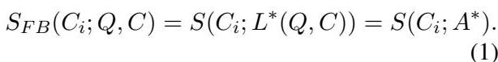

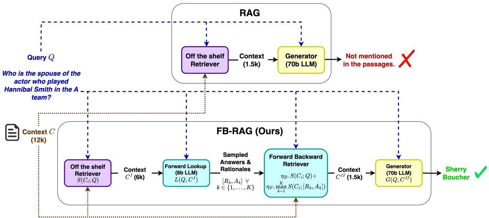  
Figure 1: Overview of FB-RAG: a training-free framework for generating answers for an input query and context. FB-RAG looks at both the input query and sampled outputs from a light-weight LLM to rank context chunks.

Unfortunately, even though we are using the oracle generator  \(L^{*}\) , this formulation is still not sufficient. Oftentimes in QA, the answers are concise entities or even binary (yes or no), meaning that even the ideal answer  \(A^{*}\)  might be insufficient to identify the most relevant context chunk  \(C_i^*\) . Hence, we also enable the oracle to generate the ideal reasoning  \(R^{*}\)  before generating the final answer  \(A^{*}\) :

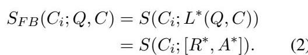

For a reasonable retriever  \(S\) , we now hypothesize:

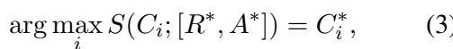

meaning that one can reasonably expect to reach  \(C_i^*\)  if given access to the ideal reasoning  \(R^{*}\)  and ideal answer  \(A^{*}\) . Note that our assumption that there is a single chunk  \(C_i^*\)  which contains all the relevant information to generate  \(A^{*}\)  is not limiting; one can trivially extend the same argument to the case where the relevant information is split across multiple chunks. In such a case, we reasonably expect the most relevant chunks to be ranked higher than irrelevant chunks based on  \(S(C_i;[R^*,A^* ])\) .

We now approximate the oracle  \(L^{*}\)  with an instruction- tuned LLM L:

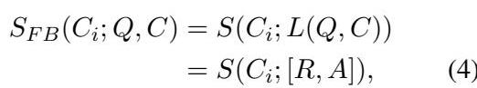

where  \(R\)  and  \(A\)  are the reasoning and answer generated by the LLM  \(L\) . To capture the uncertainty of the imperfect LLM  \(L\) , we further propose to consider the maximum over  \(K\)  samples generated from the model:

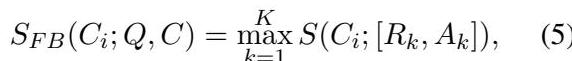

where  \(R_{k}\)  and  \(A_{k}\)  are reasoning and answer in the  \(l^{th}\)  sample respectively. Taking the maximum ensures that even if a chunk  \(C_i\)  is used only in one sample, it will still receive a high score under  \(S_{FB}(C_i;Q,C)\) . This is useful to capture the relevant chunks in cases where the LLM  \(L\)  is not confident, resulting in high variance in the samples.

Equation 5 presents the complete forward- looking component of our framework. In case of an extremely noisy model  \(L\) , the generated reasoning sequences and corresponding answers can be inaccurate and thus, can provide a misleading signal for our purpose of ranking the context chunks. Hence, merely relying on the outputs from such a noisy model  \(L\)  can unfairly penalize the true relevant chunk  \(C_i^*\) . Motivated by this, we also incorporate a backward- looking component (as a form of a regularizer) that looks at the original input query  \(Q\)  to compute the importance scores:

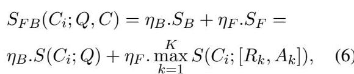

where  \(S_B\)  and  \(S_F\)  denote the backward and forward components respectively, while  \(\eta_B\)  and  \(\eta_F\)  refer to their corresponding weights.

The forward component  \(S_F\)  relies on (reasoning, answer) samples generated by the LLM, which

can be time- consuming as is. Of course, one can generate these samples in parallel, but we propose two additional simple solutions to manage this cost. First, the LLM used for this look- ahead can be selected independently from the LLM that is used to perform the final generation. In our experiments presented in Section 4, we use a relatively lightweight LLM (8B parameters) for forward- lookup and a much more powerful LLM (70B parameters) for the final response generation. We also present results with other light- weight LLM choices later in Section 5. Second, one can use a fast retriever to reduce the context size before utilizing the Forward- Backward procedure laid out in this Section. These remedies motivate the three- step process of FB- RAG, which we describe below.

### 2.2 FB-RAG Overview

We present our approach in Figure 1. FB- RAG follows a three- stage process to compute the output response  \(M(Q,C)\) : 1) Recall- focused Retrieval, 2) Precision- Focused Retrieval, and 3) Generation. Recall- focused Retrieval: In Stage I, we employ an off- the- shelf retriever to reduce the context size from  \(C\)  to  \(C^I\) . This is recall- focused, meaning one can select a relatively large context while still reducing the size significantly compared to  \(C\) . The goal here is not to perform generation with  \(C^I\) , but rather to use it for Stage II.

Precision- Focused Retrieval: In Stage II, we follow the procedure laid out in Section 2.1 using a light- weight LLM  \(L\)  to compute  \(S_{FB}(C_i;Q,C^I)\) . Importantly,  \(C_i\)  still comes from the full input context  \(C\) . We use these scores to precisely select the relevant context chunks, reducing  \(C\)  to  \(C^{II}\) , which is our target context to be used for generation.

Generation: Lastly, we prompt another instruction- tuned LLM  \(G(Q,C^{II})\)  to generate the final answer.

We evaluate two variants of our framework in this paper: 1) Ours- FB: Using both  \(\eta_B\)  and  \(\eta_F\)  as 0.5 in Equation 6, and 2) Ours- F: Using  \(\eta_B = 0\)  and  \(\eta_F = 1\)  (ignoring the backward- component). As presented later in Sections 4 and 5, we find that Ours- F consistently outperforms Ours- FB across the board, indicating that one needs to only rely on the forward- looking component - at least for the choices for LLM  \(L\)  considered in this work.

We make two observations about the overall performance achievable by our framework. First, the performance is not limited by  \(L(Q,C^I)\)  since the outputs from  \(L\)  are only used softly to score the chunks in the full context  \(C\) , and the final gener

ation is still performed by a more powerful LLM  \(G\) . Second, the performance is also not limited by  \(G(Q,C^I)\)  since Stage II works to improve the position of  \(C_i^*\) , increasing the likelihood that  \(C_i^*\)  is picked up in the smaller context  \(C^{II}\) , which can make it easier for  \(G\)  to generate an accurate answer. We provide a deeper probabilistic interpretation of our approach in Appendix A and validate these observations empirically in Section 4.

## 3 Experiment Design

We address the following four research questions:  \(RQ1)\)  Performance: How does FB- RAG perform compared to RAG and Long Context baselines? - We evaluate FB- RAG on 9 datasets spanning QA, Summarization, and Multiple Choice Questions (MCQ) tasks.  \(RQ2)\)  Design Considerations: What is the impact of key design choices on the performance of FB- RAG? - We study the performance by varying the number of retrieved chunks, the number of samples used in Stage II, and the LLM used for forward lookup.  \(RQ3)\)  Impact on Latency: How does the three- stage process of FB- RAG impact the overall latency? - We plot the performance against latency by varying the chunks and comparing our approach to a baseline.  \(RQ4)\)  Qualitative Analysis: In what specific scenarios does FB- RAG improve performance and what kind of errors does the approach make? - We perform error analysis and discuss our insights for future work.

Datasets: Following prior work (Li et al., 2024), we focus on tasks that are a) in English, b) real, and c) query- based. This leads to 7 datasets from Long- Bench (Bai et al., 2024): NarrativeQA (Kočiský et al., 2018), Qasper (Dasigi et al., 2021), MultiFieldQA (Bai et al., 2024), HotpotQA (Yang et al., 2018), 2WikiMultihopQA (Ho et al., 2020), MuSiQue (Tiroedi et al., 2022), and QMSum (Zhong et al., 2021). We also pick two datasets from co- Bench (Zhang et al., 2024), namely, EnQA and ENMC. These datasets cover diverse domains, including Wikipedia articles, meetings, narratives, and research papers, involving single and multi- hop questions. The average context lengths range from a few thousand to 150k words. Refer to Appendix B for more details.

Metrics: We use F1 score for QA datasets, Rouge- L F1 for summarization, and classification accuracy for the MCQ task. Our implementation is based on the code released with LongBench².

Methods: Long Context (LC) refers to directly feeding the full context to the LLM without explicit retrieval. Vanilla denotes the typical RAG approach, which performs retrieval based on an off- the- shelf retriever before feeding the context to the LLM. We implemented two recent approaches evaluated on the considered datasets. In OrderPreserving (OP) RAG (Yu et al., 2024), the selected chunks from the retriever are first sorted in their original ordering before feeding them to the LLM. Self- Route (Li et al., 2024) is a look- ahead approach that relies on LLM's ability to understand if the question is answerable from the retrieved context. It involves 3 steps: 1) Retrieval: Based on an off- the- shelf retriever, 2) Generation: A modified generation based on the retrieved context where the LLM can choose to output 'unanswerable' if it finds that the retrieved context is insufficient to answer the question, and 3) Generation: Based on the full input context if the LLM outputs 'unanswerable' in the previous step.

For our approach, both Ours- FB and Ours- F variants use 5 samples in Stage II obtained by combining top- p  \((p = 0.9)\)  and top- k  \((k = 50)\)  sampling. The final response generation for all methods uses Llama3.1- 70B- Instruct (Meta, 2024). Self- Route uses the same model for both generation steps. For our approach, we use Llama3.1- 8B- Instruct (Meta, 2024) for generating samples in Stage II. Refer to Appendix C for the prompts used, hardware details, and token limits. We evaluated 4 retrievers: BM25 (Trotman et al., 2014), M3Flag (Chen et al., 2024), BGEFlag (Xiao et al., 2024), and MPNet3. We chose BM25 for our experiments due to its strong relative performance, simplicity, and versatility, making it suitable for our approach, which relies on LLM- generated outputs to retrieve relevant context chunks (see Appendix D.1 for a performance comparison). For chunking, we use a chunk size of 300 words throughout.

## 4 Results

FB- RAG outperforms Long Context and other RAG baselines on both LongBench and  \(\infty\)  Bench datasets. We present the main results on LongBench datasets in Table 1. Across diverse domains and context size settings, we find that our approach exhibits consistent performance improvements over other implemented methods. Our approach achieves the best score on 5 out of 7 datasets, and our method Ours- F  \((6\mathbf{k}\rightarrow 6\mathbf{k})\)  ,which uses a 6k context output in both Stage I and II, achieves the best average performance of 50.51. We present the results for  \(\infty\)  Bench datasets in Table 2. We find performance improvements on both datasets. Our approach F  \((24\mathbf{k}\rightarrow 16\mathbf{k})\)  achieves 52.24 on EN.QA outperforming both the top reported results in the OP RAG paper (47.25) and the best OP RAG result found in our own implementation (48.27).On EN.MC, our approach achieves 86.46, which beats the best achieved in our implementation of OP- RAG (85.59) but does not beat the reported best result of 88.65, potentially due to differences in the experiment design, such as the retriever and chunking methods.

Only looking forward in Stage II of FB- RAG generally performs better than averaging out Forward and Backward components. We observe that setting  \(\eta_{\mathrm{B}} = 0\)  in Equation 6 (nullifying the backward- looking component in Stage II) performs better than giving equal weight to both forward and backward looking components. This indicates that when LLM- generated reasoning and answer samples are incorporated, the input query does not seem to provide any new useful information to retrieve the most relevant context chunks, and rather hurts the ranking. This essentially points to the effectiveness of the underlying LLM used for forward lookup (Llama- 3.1- 8B- Instruct for these reported results). In general, the 8B model is much worse than the 70B variant used for final generation  \((\sim 15\%)\)  lower average performance in our initial experiments). Often, the former even fails to follow our formatting instructions to generate the 'Rationale:' and 'Answer:' prefixes correctly. Further, we often see the answer being absent or cut off due to the model generating a long reasoning statement, leaving no room for the answer within our hard decoding token limit. However, regardless of these issues, as long as the model outputs the appropriate language relevant to answering the input question, it helps to retrieve the most relevant chunks for the final generation step by a more powerful LLM. We also experimented with different prompts for Stage II and found that some sort of reasoning or explanation provides slight gains over only using answers (Appendix D.2).

Forward- looking improves the ranking of relevant context chunks. In Figure 2 (top), we directly compare OP- RAG with our approach on EN.QA by varying the number of chunks used for final gen

Table 1: Results on LongBench. We use Rouge-L F1 for QMSum, and F1 score for others.  \((\mathrm{X}\rightarrow \mathrm{Y})\)  : Context size  \(X\)  in Stage I and  \(Y\)  in Stage II. Comparisons with other popular retrievers are in Appendix D.1.  
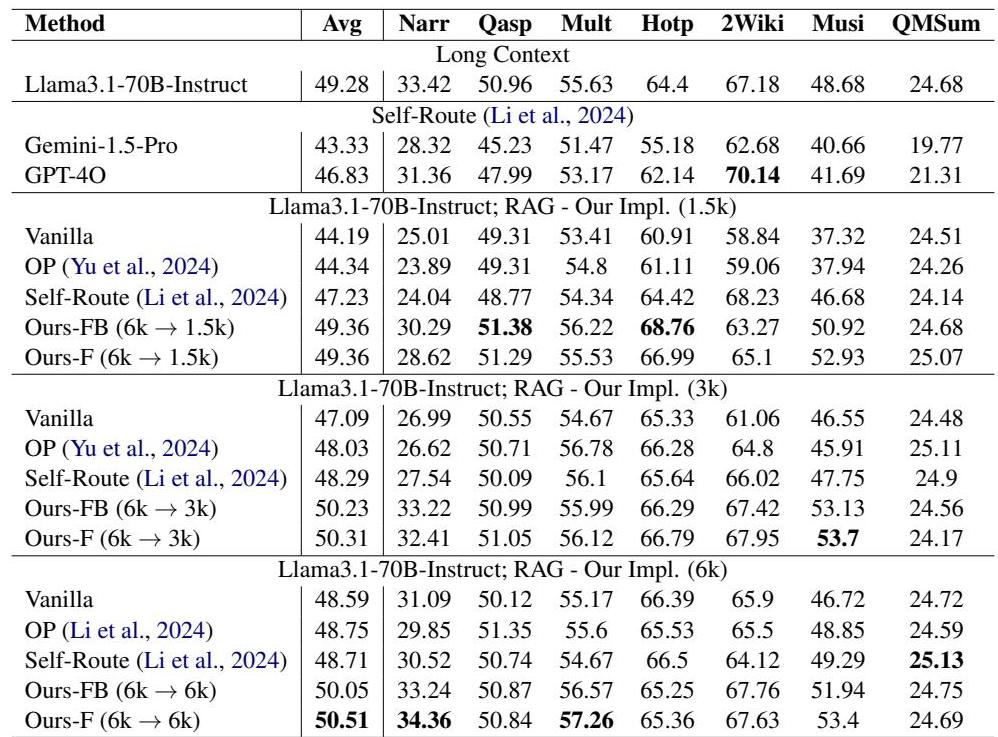

Table 2: Results on  \(\infty\)  Bench. We report F1 score for EN.QA and accuracy for EN.MC.  \((\mathrm{X}\rightarrow \mathrm{Y})\)  : Context size  \(X\)  in Stage I and  \(Y\)  in Stage II.  
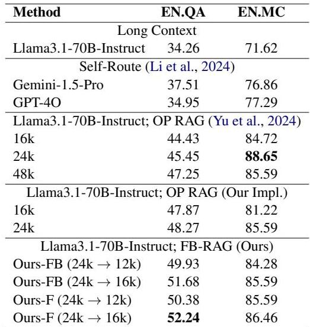

eration4. We find that our approach at 20 chunks (6k context) outperforms OP RAG at 80 chunks (24k context). On EN.MC (Appendix D.3), this happens at 53 chunks (16k context). This goes back to the discussion in Section 2.2. With forward lookup in Stage II (albeit with a less powerful LLM), our approach essentially improves the rank ing of relevant context chunks, and thus, allows one to use a smaller context for final response generation. This makes it easier for the LLM to find the correct answer, leading to improved performance.

Performance improves even with one forward sample in Stage II of FB- RAG. Finally, we analyze the impact of the number of samples used in Stage II of FB- RAG on the overall performance (Appendix D.4). We find that the performance improves greatly with only one forward sample, with maximum performance at 5. We also note that the trend is not strictly increasing, indicating that more samples may not always add value and this parameter must be tuned empirically.

## 5 Discussion

Latency Considerations: FB- RAG improves performance with lower latency. The latency of FB- RAG is governed by the two LLM calls in Stage II and III (Figure 1). We approximate the overall latency by the sum of the average time taken by Llama3.1- 8B- Instruct to generate output samples in Stage II (assuming parallelization) and the average time taken by Llama3.1- 70B- Instruct to generate the final answer. In Figure 2 (bottom), we plot performance against latency for EN.QA, varying the number of chunks used in Stage III and comparing to OP- RAG. This is complementary to

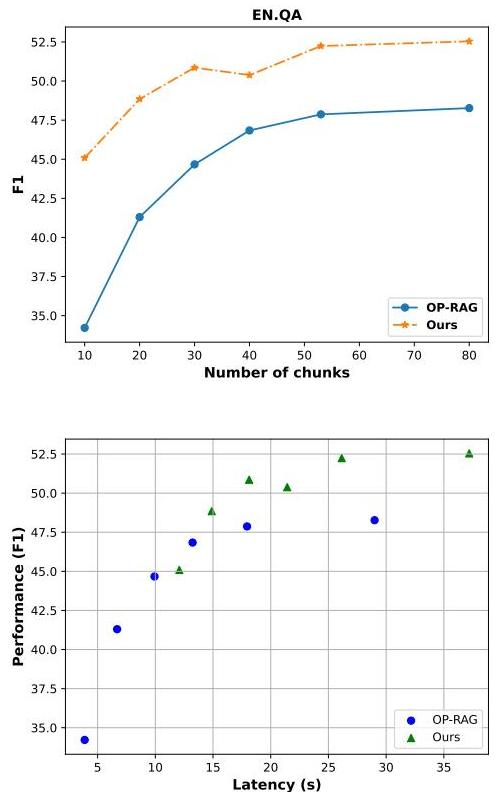  
Figure 2: Top: Results on EN.QA obtained by varying the number of chunks used for final response generation. Across all data points, our approach uses an Llama3.1-8B Instruct model for forward lookup in Stage II with 80 context chunks as input and setting  \(\eta_{F} = 1\)  and  \(\eta_{B} = 0\) . Bottom: Performance vs. Latency plot on EN.QA for the same points as in the Top Figure. Refer to Appendix C for details on the hardware used.

the performance curves in Figure 2 (top). As evident, we find that FB- RAG improves performance while reducing latency. It matches the best baseline performance (48.27 F1 at 29s), with over  \(48\%\)  reduction in latency, attaining 48.85 F1 at 14.89s. Further, FB- RAG shows  \(8\%\)  performance improvement with a  \(10\%\)  reduction in latency. This can be attributed to using a lightweight 8B model for forward- lookup with a large context, and the final generation with a 70B model using a much smaller context size, and is in line with previously reported inference speedups in 8B vs. 70B variants5.

Varying the LLM used for forward lookup: We can go even more light- weight. The latency analysis above used an 8B model for forward- lookup in Stage II of FB- RAG. Even though the 8B model fails to follow instructions properly occasionally and performs much worse compared to the 70B model, it still brings performance improvements.

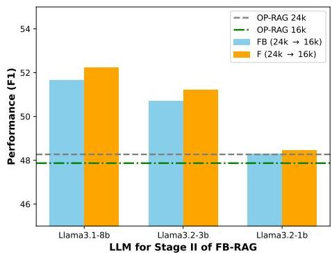  
Figure 3: Varying the model used for Forward lookup in Stage II of our approach. Results are on EN.QA dataset.

A natural question is - 'Can we push this further?' In Figure 3, we compare performance by varying the LLM used for Stage II, experimenting with Llama3.2 3B and 1B instruction- tuned variants6. As evident, we find that even the 3B model shows visible improvements in performance, while the 1B performs similar to the baseline. This finding attests to the strength of FB- RAG – although the 3B variant is nearly half as accurate as the 8B model, as long as it provides the relevant language in the generated reasons and answers, it helps to retrieve the relevant context chunks for the 70B model to generate accurate answers. From these observations, we argue that FB- RAG provides the knobs to improve performance while controlling latency with reasonable design choices – this includes the number of chunks for Stage II and Stage III, and the size of the forward- lookup model.

Qualitative Analysis: Analyzing complex queries where FB- RAG decisively outperforms the baselines, we make two observations. First (which is more straightforward), there are cases where the 8B model answers the query correctly in at least one of the Stage II samples, along with giving a reasonable rationale. This directly helps to pick the relevant chunks for Stage III following Equation 5. The second situation is more interesting, where the 8B model fails to answer a multihop query in all samples. However, it answers one hop correctly in at least one of the samples, which proves to be sufficient to retrieve the correct chunks for the 70B model to handle the multiple hops correctly. Take a query from MuSiQue as an example – 'Who is the spouse of the actor who played Hannibal Smith in the A team?', the 8B model correctly guesses

George Peppard' as the actor who played Hannibal Smith, but is unable to get to the final answer Sherry Boucher'. However, simply generating the relevant language and George Peppard' helps to retrieve the right context chunks for the 70B model to produce the correct answer - This gives insight into how even a light- weight LLM in Stage II can systematically help to improve the performance, aligned with the overall results discussed earlier.

Looking at the fewer cases where FB- RAG performs worse, we find that first, some of the errors can be traced back to the evaluation metrics. When FB- RAG predicts Sebastian instead of Sebastian Cabot' or Qatari Stars League' instead of Qatar Stars League', it hurts the F1 score it receives. Investing in improved metrics (potentially semantic) will be valuable in the future. Second, in some cases, the error can be attributed to the ambiguity in the input query. The answer to the question The Live Life Loud album's band signed to which label?' is temporally dependent, and FB- RAG gets penalized since it answers correctly but from a different year than what is unfairly assumed in the ground truth answer - Incorporating the temporal dimension to curate unambiguous queries will improve the dataset quality in the future. Finally, we find cases where the 70B model fails to resolve multihop queries even with a precise input context, for instance, confusing the spouse' with the mother' of an artist - Enabling LLMs to resolve complex multihop queries is still an open, challenging problem, demanding additional dedicated efforts in this area.

## 6 Related Work

Long Context (LC) LLMs: Context lengths have rapidly increased, with Gemini 1, 2 Pro (Team et al., 2024) and Meta Llama 4 (Meta, 2025) using even 10 million tokens. However, LLMs can get confused by irrelevant parts of the context, leading to known cases where RAG significantly outperforms LC (Xu et al., 2023; Yu et al., 2024). In terms of latency, LC is expensive due to the quadratically increasing compute costs with input size. We follow the RAG paradigm by first retrieving the most relevant context chunks and then feeding them to an LLM with the input query for answer generation.

Retrieval Augmented Generation (RAG): RAG has emerged as a popular paradigm competing with LC, improving performance across diverse tasks with significantly lower compute costs (Fan et al.,

2024). Traditional RAG is backward-looking - the context chunks are scored based on the input query using a combination of retrievers and rerankers, which further refine the selected context (Gao et al., 2023). Instead, FB-RAG uses forward-looking with samples generated from an LLM to select the relevant context chunks for the final answer generation. Unlike a typical reranker, Stage II of FB-RAG selects the chunks from the full context  \(C\)  instead of  \(C^I\)  (the output of Stage 1).

Numerous efforts augment RAG with trained filters (Yoran et al., 2023), trained compressors (Xu et al., 2024), and web search engines (Yan et al., 2024) to improve retrieval quality and generation. Self- RAG (Asai et al., 2024) trains an LLM using special reflection tokens to retrieve on demand. Li et al. (2023) and Jiang et al. (2023) perform retrieval from the web based on the LLM's lookahead confidence scores. Speculative RAG (Wang et al., 2024) uses a smaller trained LLM to generate answer candidates, which are then verified by another LLM. LongRAG (Zhao et al., 2024a) uses plug- n- play components to extract global information and factual details from context chunks which enhances the understanding from long contexts. Our setting differs in several ways: 1) We push the performance of instruction- tuned LLMs without any further training, 2) We assume no access to external web sources, and 3) We only use forward lookup from the light- weight LLM in a soft manner for selecting relevant context chunks from the entire context, with the final generation still being performed by a more powerful LLM. Two recent papers closest to our formulation are Self- Route (Li et al., 2024) and Order Preserving (OP) RAG (Yu et al., 2024), which we implemented ourselves and used as baselines in this work.

## 7 Conclusion

7 ConclusionWe proposed and evaluated FB- RAG – a new framework for RAG with LLMs. Instead of solely relying on the input query to retrieve the relevant chunks, we employed a look- ahead mechanism tightly integrated with the task at hand. This retrieves the most relevant chunks while reducing the irrelevant information in the context, resulting in superior performance. We found that FB- RAG has the potential to improve performance while simultaneously reducing latency. We performed a qualitative analysis and discussed insights to guide future work.

### Limitations

The effectiveness of FB- RAG depends on the quality of the off- the- shelf retriever that is being used. In our experiments, we found BM25 to be effective. However, if the quality of the available retriever is poor for the domain in consideration, one is forced to use a larger context size for subsequent stages, which would impact the overall latency gains from the system.

In our qualitative analysis, we observed that smaller, less- capable LLMs can be used for forward- lookup in Stage II and one can eventually get accurate responses even if this small LLM is inaccurate or fails to always follow our instructions properly. However, the minimum level of the model capability (parameters, instructionfollowing abilities) required for forward- looking signals to be helpful remains an open question and will be important for future investigation. Ultimately, the design choices that best manage the performance- latency tradeoff will depend on the specific application and platform constraints.

### Ethical Considerations

Our work was approved by the established internal review procedure. We carefully verified the licensing information associated with all the datasets and instruction- tuned LLMs used in this work, ensuring that their use was within their intended scope. All the datasets were properly anonymized before being used. We provide dataset statistics in Appendix B and refer the readers to the original dataset papers for details regarding pre- processing steps as well as the demographics of human annotators.

All datasets considered in this work were in English. Hence, it is unclear whether our findings directly translate to other languages and cultures. However, our approach is free of any such assumptions, and we encourage future work to extend it to these other scenarios.

We further note that LLMs have been known to exhibit different kinds of gender or cultural biases that can lead to discriminatory language in the generated outputs. Hence, we call for rigorous testing before any LLM- based systems are deployed. We also recommend regular monitoring after deployment to ensure that the models' behaviors remain within their planned scope.

### References

Akari Asai, Zeqiu Wu, Yizhong Wang, Avi Sil, and Hannaneh Hajishirzi. 2024. Self- rag: Learning to retrieve, generate, and critique through self- reflection. In International Conference on Learning Representa tions.

Yushi Bai, Xin Lv, Jiajie Zhang, Hongchang Lyu, Jiankai Tang, Zhidian Huang, Zhengxiao Du, Xiao Liu, Aohan Zeng, Lei Hou, Yuxiao Dong, Jie Tang, and Juanzi Li. 2024. LongBench: A bilingual, multitask benchmark for long context understanding. In Proceedings of the 62nd Annual Meeting of the Association for Computational Linguistics (Volume 1: Long Papers), pages 3119- 3137, Bangkok, Thailand. Association for Computational Linguistics.

Sebastian Borgeaud, Arthur Mensch, Jordan Hoffmann, Trevor Cai, Eliza Rutherford, Katie Millican, George Bm Van Den Driessche, Jean- Baptiste Lespiau, Bogdan Damoc, Aidan Clark, and 1 others. 2022. Improving language models by retrieving from trillions of tokens. In International conference on machine learning, pages 2206- 2240. PMLR.

Jianlyu Chen, Shitao Xiao, Peitian Zhang, Kun Luo, Defu Lian, and Zheng Liu. 2024. M3- embedding: Multi- inequality, multi- functionality, multi- granularity text embeddings through self- knowledge distillation. In Findings of the Association for Computational Linguistics: ACL 2024, pages 2318- 2335, Bangkok, Thailand. Association for Computational Linguistics.

Pradeep Dasigi, Kyle Lo, Iz Beltagy, Arman Cohan, Noah A. Smith, and Matt Gardner. 2021. A dataset of information- seeking questions and answers anchored in research papers. In Proceedings of the 2021 Conference of the North American Chapter of the Association for Computational Linguistics: Human Language Technologies, pages 4599- 4610, Online. Association for Computational Linguistics.

Wenqi Fan, Yujuan Ding, Liangbo Ning, Shijie Wang, Hengyun Li, Dawei Yin, Tat- Seng Chua, and Qing Li. 2024. A survey on rag meeting llms: Towards retrieval- augmented large language models. In Proceedings of the 30th ACM SIGKDD Conference on Knowledge Discovery and Data Mining, pages 6491- 6501.

Yunfan Gao, Yun Xiong, Xinyu Gao, Kangxiang Jia, Jinliu Pan, Yuxi Bi, Yi Dai, Jiawei Sun, Haofen Wang, and Haofen Wang. 2023. Retrieval- augmented generation for large language models: A survey. arXiv preprint arXiv:2312.10997, 2.

Kelvin Guu, Kenton Lee, Zora Tung, Panupong Pasupat, and Mingwei Chang. 2020. Retrieval augmented language model pre- training. In International conference on machine learning, pages 3929- 3938. PMLR.

Qiuxiang He, Guoping Huang, Qu Cui, Li Li, and Lemao Liu. 2021. Fast and accurate neural machine translation with translation memory. In Proceedings

of the 59th Annual Meeting of the Association for Computational Linguistics and the 11th International Joint Conference on Natural Language Processing (Volume 1: Long Papers), pages 3170- 3180.

Xanh Ho, Anh- Khoa Duong Nguyen, Saku Sugawara, and Akiko Aizawa. 2020. Constructing a multi- hop qa dataset for comprehensive evaluation of reasoning steps. In Proceedings of the 28th International Conference on Computational Linguistics, pages 6609- 6625.

Zhengbao Jiang, Frank Xu, Luyu Gao, Zhiqing Sun, Qian Liu, Jane Dwivedi- Yu, Yiming Yang, Jamie Callan, and Graham Neubig. 2023. Active retrieval augmented generation. In Proceedings of the 2023 Conference on Empirical Methods in Natural Language Processing, pages 7969- 7992, Singapore. Association for Computational Linguistics.

Urvashi Khandelwal, Omer Levy, Dan Jurafsky, Luke Zettlemoyer, and Mike Lewis. 2019. Generalization through memorization: Nearest neighbor language models. In International Conference on Learning Representations.

Tomas Kocisky, Jonathan Schwarz, Phil Blunsom, Chris Dyer, Karl Moritz Hermann, Gabor Melis, and Edward Grefenstette. 2018. The NarrativeQA reading comprehension challenge. Transactions of the Association for Computational Linguistics, 6:317- 328.

Junyi Li, Tianyi Tang, Wayne Xin Zhao, Jingyuan Wang, Jian- Yun Nie, and Ji- Rong Wen. 2023. The web can be your oyster for improving large language models. arXiv preprint arXiv:2305.10998.

Zhuowan Li, Cheng Li, Mingyang Zhang, Qiaozhu Mei, and Michael Bendersky. 2024. Retrieval augmented generation or long- context LLMs? a comprehensive study and hybrid approach. In Proceedings of the 2024 Conference on Empirical Methods in Natural Language Processing: Industry Track, pages 881- 893, Miami, Florida, US. Association for Computational Linguistics.

Shengchao Liu, Weili Nie, Chengpeng Wang, Jiarui Lu, Zhuoran Qiao, Ling Liu, Jian Tang, Chaowei Xiao, and Animashree Anandramar. 2023. Multimodal molecule structure- text model for text- based retrieval and editing. Nature Machine Intelligence, 5(12):1447- 1457.

Meta. 2024. [link].

Meta. 2025. [link].

Zhiqing Sun, Xuezhi Wang, Yi Tay, Yiming Yang, and Denny Zhou. 2022. Recitation- augmented language models. arXiv preprint arXiv:2210.01296.

Gemini Team, Petko Georgiev, Ving Ian Lei, Ryan Burnell, Libin Bai, Anmol Gulati, Garrett Tanzer, Damien Vincent, Zhufeng Pan, Shibo Wang, and 1 others. 2024. Gemini 1.5: Unlocking multimodal understanding across millions of tokens of context. arXiv preprint arXiv:2403.05530.

Harsh Trivedi, Niranjan Balasubramanian, Tushar Khot, and Ashish Sabharwal. 2022. Musique: Multihop questions via single- hop question composition. Transactions of the Association for Computational Linguistics, 10:539- 554.

Andrew Trotman, Antti Puurula, and Blake Burgess. 2014. Improvements to bm25 and language models examined. In Proceedings of the 19th Australasian Document Computing Symposium, pages 58- 65.

Zilong Wang, Zifeng Wang, Long Le, Huaixiu Steven Zheng, Swaroop Mishra, Vincent Perot, Yuwei Zhang, Anush Mattapalli, Ankur Taly, Jingbo Shang, and 1 others. 2024. Speculative rag: Enhancing retrieval augmented generation through drafting. arXiv preprint arXiv:2402.08223.

Junda Wu, Cheng- Chun Chang, Tong Yu, Zhankui He, Jianing Wang, Yupeng Hou, and Julian McAuley. 2024. Coral: Collaborative retrieval- augmented large language models improve long- tail recommendation. In Proceedings of the 30th ACM SIGKDD Conference on Knowledge Discovery and Data Mining, pages 3391- 3401.

Shitao Xiao, Zheng Liu, Peitian Zhang, Niklas Muennighoff, Defu Lian, and Jian- Yun Nie. 2024. C- pack: Packed resources for general chinese embeddings. In Proceedings of the 47th international ACM SIGIR conference on research and development in information retrieval, pages 641- 649.

Fangyuan Xu, Weijia Shi, and Eunsol Choi. 2024. Recomp: Improving retrieval- augmented lms with compression and selective augmentation. In 12th International Conference on Learning Representations, ICLR 2024.

Peng Xu, Wei Ping, Xianchao Wu, Lawrence McAfee, Chen Zhu, Zihan Liu, Sandeep Subramanian, Evelina Bakhturina, Mohammad Shoeybi, and Bryan Catanzaro. 2023. Retrieval meets long context large language models. In The Twelfth International Conference on Learning Representations.

Shi- Qi Yan, Jia- Chen Gu, Yun Zhu, and Zhen- Hua Ling. 2024. Corrective retrieval augmented generation. arXiv preprint arXiv:2401.15884.

Haoyan Yang, Zhitao Li, Yong Zhang, Jianzong Wang, Ning Cheng, Ming Li, and Jing Xiao. 2023. Prca: Fitting black- box large language models for retrieval question answering via pluggable reward- driven contextual adapter. In Proceedings of the 2023 Conference on Empirical Methods in Natural Language Processing, pages 5364- 5375.

Zhilin Yang, Peng Qi, Saizheng Zhang, Yoshua Bengio, William Cohen, Ruslan Salakhutdinov, and Christopher D. Manning. 2018. HotpotQA: A dataset for diverse, explainable multi- hop question answering. In Proceedings of the 2018 Conference on Empirical Methods in Natural Language Processing, pages 2369- 2380, Brussels, Belgium. Association for Computational Linguistics.

Ori Yoran, Tomer Wolfson, Ori Ram, and Jonathan Berant. 2023. Making retrieval- augmented language models robust to irrelevant context. arXiv preprint arXiv:2310.01558.

Tan Yu, Anbang Xu, and Rama Akkiraju. 2024. In defense of rag in the era of long- context language models. arXiv preprint arXiv:2409.01666.

Xinrong Zhang, Yingfa Chen, Shengding Hu, Zihang Xu, Junhao Chen, Moo Hao, Xu Han, Zhen Thai, Shuo Wang, Zhiyuan Liu, and Maosong Sun. 2024. ∞Bench: Extending long context evaluation beyond 100K tokens. In Proceedings of the 62nd Annual Meeting of the Association for Computational Linguistics (Volume 1: Long Papers), pages 15262- 15277, Bangkok, Thailand. Association for Computational Linguistics.

Qingfei Zhao, Ruobing Wang, Yukuo Cen, Daren Zha, Shicheng Tan, Yuxiao Dong, and Jie Tang. 2024a. Longrag: A dual- perspective retrieval- augmented generation paradigm for long- context question answering. In Proceedings of the 2024 Conference on Empirical Methods in Natural Language Processing, pages 22600- 22632.

Siyun Zhao, Yuqing Yang, Zilong Wang, Zhiyuan He, Luna K Qiu, and Lili Qiu. 2024b. Retrieval augmented generation (rag) and beyond: A comprehensive survey on how to make your llms use external data more wisely. arXiv preprint arXiv:2409.14924.

Ming Zhong, Da Yin, Tao Yu, Ahmad Zaidi, Mutethia Mutuma, Rahul Jha, Ahmed Hassan Awadallah, Asli Celikyilmaz, Yang Liu, Xipeng Qiu, and Dragomir Radev. 2021. QMSum: A new benchmark for query- based multi- domain meeting summarization. In Proceedings of the 2021 Conference of the North American Chapter of the Association for Computational Linguistics: Human Language Technologies, pages 5905- 5921, Online. Association for Computational Linguistics.

## A Methodology

In this Section, we provide a deeper insight into how FB- RAG works to improve the overall RAG performance. This interpretation is complementary to the discussion in Section 2.2. We lay out a probabilistic formulation of the RAG process below (extending the notation used in the main paper):

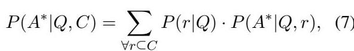

where  \(r\)  denotes all possible contexts that can be selected in the retriever stage of RAG.

The first component,  \(P(r|Q)\) , captures the retriever's role - a conditional probability distribution over all possible contexts that can be selected from the full context  \(C\)  conditioned on the query  \(Q\) . A higher probability of a specific  \(r\)  corresponds to a higher score from the retriever and a higher likelihood of it being picked up for generation.

The second component,  \(P(A^{*}|Q,r)\) , captures the job of the generator - the probability of generating the answer  \(A^{*}\)  from the query  \(Q\)  and the selected context  \(r\) . Note that  \(P(A^{*}|Q,r)\)  will be high for a better quality  \(r\)  which contains the relevant context chunks and minimizes irrelevant information, and will be low for a poor quality  \(r\)  which misses out key relevant chunks or contains a high amount of irrelevant content.

Under this formulation, when supplied with a reasonable forward- looking LLM, the procedure laid out in Section 2.1 simply works to shift the probability mass in  \(P(r|Q)\)  to better quality contexts. Combined with the better performance from the generator  \(P(A^{*}|Q,r)\)  for these better quality contexts, this holds the potential to improve the overall probability  \(P(A^{*}|Q,C)\)  of generating the accurate answer.

## B Datasets

Our experiments are based on 9 datasets from two popular benchmarks consisting long context lengths - LongBench (Bai et al., 2024) and ∞Bench (Zhang et al., 2024). QA tasks (NarrativeQA, Qasper, MultifieldQA, HotpotQA, 2Wiki- MultihopQA, MuSiQue, and EN.QA) take a query and a context as input, with the goal of generating a concise answer. The summarization task (QMSum) requires generating a free- form summary based on the given query and context. For the MCQ task (EN.MC), the input additionally includes a set of choices, and the task is to choose the correct choice that answers the input query based on the provided context. We present key statistics for these datasets in Table 3.

## C Experiment Design

We provide additional experimental design details in this section to promote reproducibility. We further plan to release our code on acceptance.

### C.1 Prompts

We release all the prompts used in our experiments. Tables 4 and 5 list the prompts for LongBench datasets, while Table 6 presents the prompts for the two datasets from ∞Bench. Note that for QMSum, we use the same prompt for FB- RAG Stage II as

Table 3: Statistics for all the datasets considered in our experiments in this paper.  
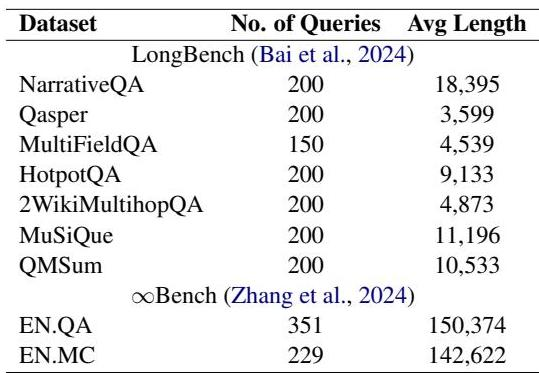

the one used for Vanilla RAG. This is because the output summary is already descriptive, unlike other datasets where answers tend to be very concise (a few words or a phrase).

### C.2 Hardware Used

All the experiments presented in this paper were performed on 8 NVIDIA A100 GPUs. We used the default inference configuration provided by Huggingface, which uses 'device_map=auto'. We did not use any additional optimizations.

### C.3 Decoding Token Limits

We set maximum limits for the number of tokens that can be generated per LLM call. For LongBench datasets, we use the limits from the code released with the benchmark7. For EN.QA and EN.MC datasets from ∞Bench benchmark, we set the limit to 64, based on the ground truth distributions. When generating both reasoning and answer in Stage II of our approach, we add 64 to the original token limit for all datasets.

## D Results

### D.1 Retriever comparisons

We compared the performance of several off- the- shelf retrievers in our initial experiments, as presented in Table 7. All methods use OP RAG at 3k context size. We find that BM25 performs reasonably well on average in comparison to numerous top- performing semantic retrievers. In addition, BM25 is a versatile approach without any underlying assumptions about the query, making it well- suited for our forward- looking approach in this paper. Hence, we fixed BM25 as the retriever for the rest of our experiments discussed in Section 4 in the main paper.

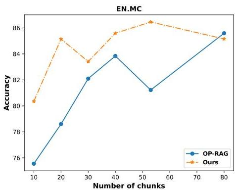  
Figure 4: Performance comparison between our approach and OP RAG on EN.MC dataset. Y-Axis: The performance on the corresponding metric. X-Axis: The number of chunks used by both methods for final response generation. Across all data points, our approach uses an Llama3.1-8B-Instruct model for forward lookup in Stage 2 with 80 context chunks as input and setting  \(\eta_F = 1\)  and  \(\eta_B = 0\) .

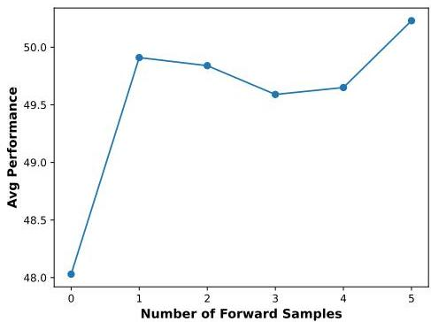  
Figure 5: Studying the impact on the average performance of FB-RAG on LongBench datasets by varying the number of samples used in Stage II. Model used: Ours-FB (6k → 3k).

### D.2 FB-RAG Stage II Prompt comparisons

We experimented with a few prompt variations for Stage II of FB- RAG. Table 8 presents these comparisons on LongBench datasets. We observe that only using the answers sampled from the LLM shows improvements over other RAG baselines presented in the main paper, although this can be further improved slightly by using some form of reasoning along with the answer. This helps to handle scenarios where the answers are entity names or binary that contain little information for retrieving the most relevant context chunks.

Table 4: (Part 1 / 2) Prompts used in our experiments for LongBench datasets.  
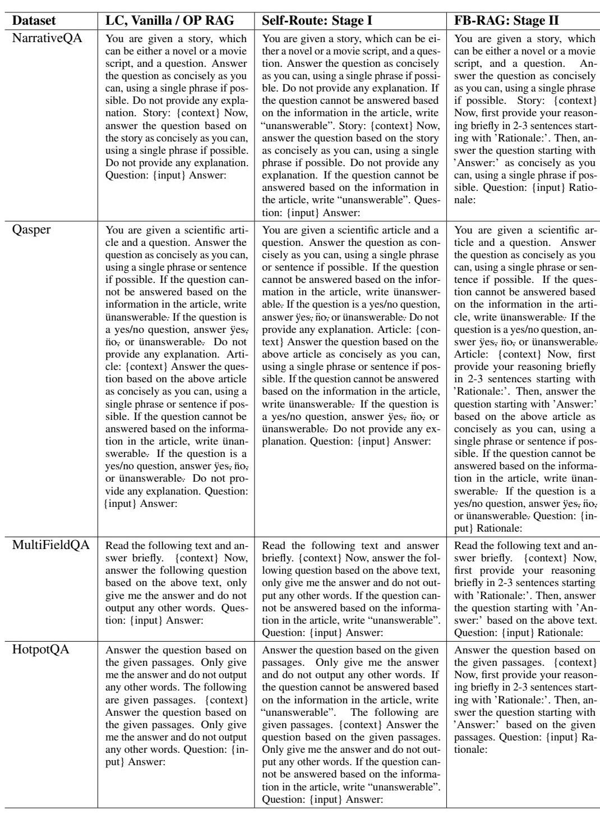

Table 5: (Part 2 / 2) Prompts used in our experiments for LongBench datasets.  
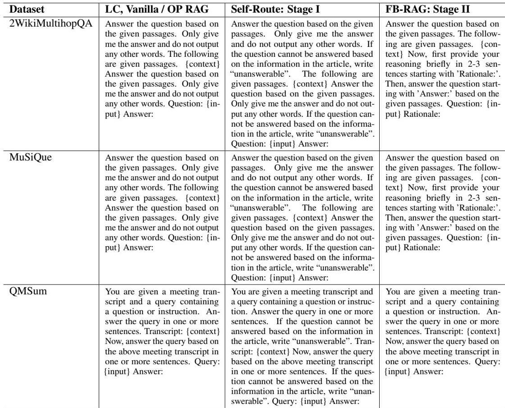

Table 6: Prompts used in our experiments for  \(\infty\)  Bench datasets.  
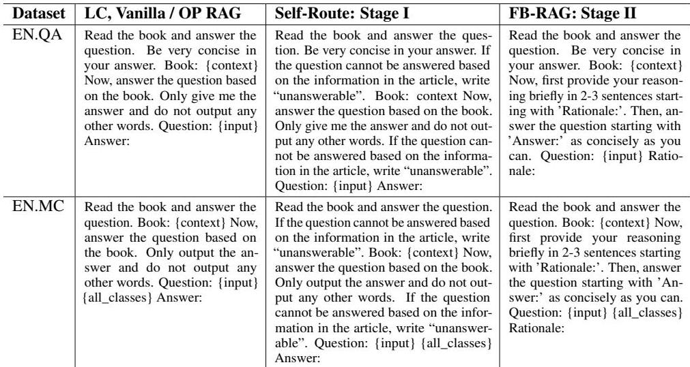

### D.3 Varying the number of chunks used for final generation

In Figure 4, we compare the performance of our approach with OP- RAG on EN.MC dataset by varying the number of chunks used for final generation. We find that FB- RAG at 53 chunks (16k context) beats the best performance of the baseline at 80 chunks (24k context).

### D.4 Varying the number of samples used in Stage II of FB-RAG

We present the plot for analysis in Figure 5. The X- axis denotes the number of samples used. The Y- axis denotes the average performance on Long- Bench datasets. The results are shown for the Ours- FB  \((6\mathbf{k}\rightarrow 3\mathbf{k})\)  configuration. As evident from the figure, we find that the performance improves visibly with just one forward sample, while attaining the maximum at 5 samples.

Table 7: Performance comparisons of off-the-shelf retrievers on LongBench datasets. All results are based on OP RAG at 3k context with Llama3.1-70B-Instruct model. We compared two weight configurations for M3Flag, taking recommendations from the authors to set the weights - refer to the original paper for details (Chen et al., 2024).  
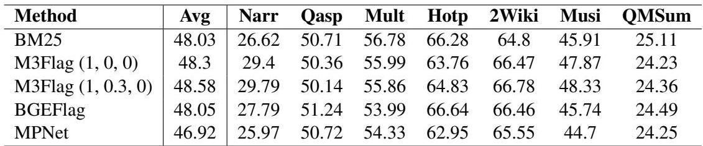

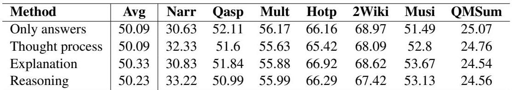

Table 8: Performance comparisons of our approach on LongBench datasets by varying the prompt used for sampling in Stage II. Model Used: Ours- FB  \((6\mathrm{k}\rightarrow 3\mathrm{k})\)  .Thought process: Generate the thought process before the final answer, Reasoning: Generate a reasoning sequence before the final answer, Explanation: Generate an explanation after generating the answer. While the performance improves over the baselines by only considering the final answers as samples, we find that using reasoning or explanation performs slightly better on average.