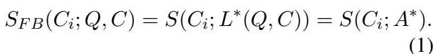
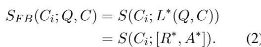
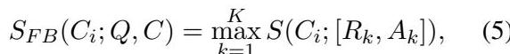
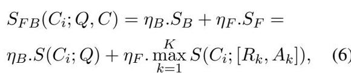
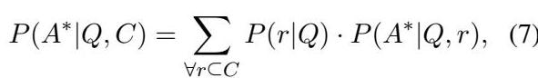
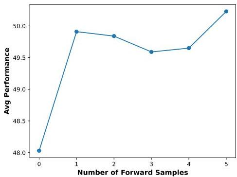

# FB-RAG：利用前瞻與後瞻查詢改進 RAG

Kushal Chawla, Alfy Samuel, Anoop Kumar, Daben Liu
Capital One
{kushal.chawla,alfy.samuel,anoop.kumar,daben.liu}@capitalone.com

摘要

傳統的檢索增強生成（Retrieval-Augmented Generation, RAG）在處理複雜查詢時面臨挑戰，因為這類查詢缺乏強烈的信號來檢索最相關的上下文，導致必須在「選擇一個可能遺漏關鍵訊息的小上下文」和「選擇一個可能讓大型語言模型（LLM）混淆的大上下文」之間做出權衡。為了解決這個問題，我們提出了**前瞻後瞻 RAG (Forward-Backward RAG, FB-RAG)**，這是一個基於簡單而強大的**前瞻策略**的新型**免訓練框架**。FB-RAG 使用一個輕量級的 LLM 來預覽潛在的未來生成內容，並利用多個採樣輸出中的證據，精確地識別出最相關的上下文，以供最終、更強大的生成器使用。這在沒有複雜微調或強化學習（這在先前工作中很常見）的情況下，顯著提高了效能。在來自 LongBench 和 ∞Bench 的 9 個資料集上，FB-RAG 始終表現出色。此外，由於為強大生成器提供的提示更短、更集中，因此效能提升的同時也能降低延遲。在 EN.QA 資料集上，FB-RAG 在延遲降低超過 48% 的情況下與領先的基準模型持平，或在延遲降低 10% 的情況下實現了 8% 的效能提升。我們的分析發現，即使在前瞻 LLM 未能生成正確答案的情況下，它的嘗試也足以引導最終模型給出準確的回應，這證明了較小的 LLM 如何能系統性地改進較大 LLM 的效能與效率。

---

## 1 引言

檢索增強生成（RAG）在減少幻覺並提高生成效能方面展現了巨大的潛力（Fan et al., 2024; Gao et al., 2023）。RAG 在多樣化的問答（QA）任務（Borgeaud et al., 2022; Guu et al., 2020; Asai et al., 2024）、通用語言任務（He et al., 2021; Khandelwal et al., 2019）以及許多下游應用中都取得了優異的結果（Liu et al., 2023; Wu et al., 2024）。

在這項工作中，我們專注於**根據已提供的龐大上下文來回答查詢**的任務。傳統的 RAG 方法通常涉及兩個步驟（Zhao et al., 2024b）：1）透過計算與查詢的相似度（基於稀疏或密集檢索器和/或重排序器）來檢索重要片段，2）將檢索到的片段連同查詢一起提供給 LLM，由其生成答案。我們將這類方法稱為**後瞻**——即回過頭來檢視輸入查詢，以對上下文片段進行評分。這類方法在學術界和工業界都已被廣泛採用。然而，標準方法難以應對缺乏足夠資訊來檢索相關片段的複雜查詢（參見圖 1 中的範例）。這個挑戰在 RAG 中很難管理，因為檢索太少會冒著遺漏關鍵資訊的風險，而檢索太多則可能引入不相關的內容，從而混淆 LLM（Yu et al., 2024）。

為了應對這一挑戰，我們設計了**前瞻後瞻 RAG (FB-RAG)**，用於研究一個新興但未被充分探索的想法：**前瞻**或**預覽 LLM 的輸出生成**以改進檢索。FB-RAG 以三個階段生成輸出：
I) **側重召回的檢索 (Recall-focused Retrieval)**：使用現成的檢索器來提取一個較小但足夠大的上下文。
II) **側重精確度的檢索 (Precision-focused Retrieval)**：這一步或者**僅僅**依賴前瞻，透過觀察來自一個輕量級 LLM 的**原因和答案**來評估上下文片段（`Ours-F`），或者**同時**依賴前瞻和後瞻查詢（`Ours-FB`）。
III) **生成 (Generation)**：提示一個強大的 LLM 以獲得最終答案。
儘管先前的研究也使用了相關想法，透過基於 LLM 的回饋或信心分數來改進 RAG（Zhao et al., 2024a; Sun et al., 2022; Wang et al., 2024; Yang et al., 2023; Jiang et al., 2023），但這些方法通常提出複雜的微調或強化學習策略，並且通常假設可以訪問外部網路搜尋引擎或依賴 LLM 自身的記憶，這在許多特定領域的實際應用中並不適用。相反，FB-RAG 是一個**簡單而有效的免訓練框架**，基於現成的檢索器和指令微調的 LLM，用於從已提供的龐大上下文來回答問題。

為了用一個**不完美**的前瞻 LLM 來尋找相關片段，FB-RAG 採樣多個輸出，如果某個片段在任何一個採樣中被使用，它就會被賦予高分。這對於**在多樣化任務上改進 RAG 結果優於最新基準模型**而言，被證明是強大的。我們還發現，效能提升的同時可以**降低延遲**。在 ∞Bench (Zhang et al., 2024) 的 EN.QA 資料集上，可以將一個 70B 參數的模型用於最終回應生成，並將一個 8B 模型用於前瞻查詢，從而在**延遲降低超過 48%** 的情況下與基準效能持平。此外，還可以獲得 **8% 的效能提升**，同時**延遲降低 10%**。透過我們的定性分析，我們發現，即使較小的 LLM 的所有採樣輸出都錯誤地回答了輸入查詢，並且通常未能正確遵循我們的指令，這**仍然足以引導**最終、更強大的 LLM 生成正確的回應。我們現在總結我們的貢獻：

1. 我們提出了 FB-RAG：一個新穎的免訓練框架，用於使用現成的指令微調 LLM 執行 RAG。FB-RAG 採用一個簡單而有效的前瞻策略，在選擇上下文片段進行最終回應生成之前對其進行評估（第 2 節）。
2. 我們在 LongBench (Bai et al., 2024) 和 ∞Bench (Zhang et al., 2024) 的 9 個資料集上，全面評估了 FB-RAG 與最近的免訓練 RAG 和長上下文基準模型的比較，發現 FB-RAG 提供了持續的效能提升。我們還進一步分析了 FB-RAG 中的關鍵設計選擇，例如檢索到的片段數量和用於前瞻查詢的採樣數量（第 3 和第 4 節）。
3. 我們展示了 FB-RAG 提供了在**提高效能的同時降低延遲**的靈活性。我們還進行了定性分析，討論了我們方法的優點和局限性，並為該領域未來的進展提供了見解（第 5 節）。

---

## 2 方法

我們專注於**根據已提供的上下文進行問答**的任務。給定一個輸入查詢 $Q$ 和一個上下文 $C$，FB-RAG 依賴一個現成的檢索器和指令微調的 LLM（無需微調）來生成輸出 $M(Q,C)^1$。我們假設上下文 $C$ 足以回答查詢 $Q$，這與一些假設可以在執行時訪問網路搜尋引擎的先前公式不同（Yan et al., 2024）。FB-RAG 的核心是**依賴一個前瞻方法**，在執行最終回應生成之前，從 $C$ 中檢索最相關的上下文片段。我們首先描述這個方法，然後再將其與 FB-RAG 的整體三階段過程聯繫起來。

### 2.1 前瞻後瞻檢索器

我們得到一個查詢 $Q$ 和上下文 $C = \{C_i\} = \{C_1,C_2,C_3,\dots C_n\}$，其中總共有 $n$ 個片段。我們使用 $A^{*}$ 來表示理想的輸出回應（黃金標準答案），並使用 $C_i^*\in C$ 來表示包含生成理想答案 $A^{*}$ 所需資訊的上下文片段。此外，我們使用 $S(c_{i};q)$ 來表示在給定查詢 $q$ 的情況下，使用現成檢索器 $S$ 得到的上下文片段 $c_{i}$ 的重要性分數。我們使用 $S_{FB}(c_i;q,c)$ 來表示在給定查詢 $q$ 和完整相關上下文 $c$ 的情況下，FB-RAG 下的片段 $c_{i}$ 的重要性分數。與典型的 RAG 管道一樣，一旦計算出重要性分數，我們就可以選擇得分最高的片段，以供 LLM 進行最終輸出生成。因此，我們在本節中的目標僅是為 $S_{FB}(c_i;q,c)$ 提供一個公式。

先前的研究報告稱，LLM 經常會被上下文中不相關的資訊所混淆（Xu et al., 2024; Asai et al., 2024）。Yu et al. (2024) 觀察到隨著上下文大小的增加，效能呈現倒 U 形，這就證明了這一點。因此，檢索器的一個明顯目標是為最相關的片段分配高重要性分數，以便可以用一個小的上下文進行生成並減少不相關的內容。這對於僅依賴輸入查詢中資訊的檢索器來說是個挑戰，特別是當查詢不具體且複雜時（Li et al., 2024）。為了彌補這一差距，我們的**核心思想是前瞻潛在的答案以檢索相關的上下文**。如果我們能夠訪問預言機生成模型 $L^{*}$，我們可以按照以下方式計算 $S_{FB}(C_i;Q,C)$：

  
圖 1: FB-RAG 概覽：一個用於為輸入查詢和上下文生成答案的免訓練框架。FB-RAG 既檢視輸入查詢，也檢視從輕量級 LLM 採樣的輸出，以對上下文片段進行排序。

不幸的是，即使我們使用預言機生成器 $L^{*}$，這個公式仍然不夠。在問答任務中，答案通常是簡潔的實體甚至是二元（是或否）的，這意味著即使是理想答案 $A^{*}$ 也可能不足以識別最相關的上下文片段 $C_i^*$。因此，我們還讓預言機能夠在生成最終答案 $A^{*}$ 之前，生成理想的**推理** $R^{*}$：

對於一個合理的檢索器 $S$，我們現在假設：

這意味著，如果能夠訪問理想的推理 $R^{*}$ 和理想的答案 $A^{*}$，我們可以合理地期望找到 $C_i^*$。請注意，我們假設有一個單一的片段 $C_i^*$ 包含了生成 $A^{*}$ 的所有相關資訊，這並非限制；可以輕鬆地將相同的論點擴展到相關資訊分散在多個片段中的情況。在這種情況下，我們合理地期望最相關的片段會根據 $S(C_i;[R^*,A^*])$ 被排名高於不相關的片段。

我們現在用一個**指令微調的 LLM L** 來近似預言機 $L^{*}$：

其中 $R$ 和 $A$ 是 LLM $L$ 生成的推理和答案。為了捕捉不完美 LLM $L$ 的不確定性，我們進一步提議考慮從模型中採樣的 $K$ 個輸出的最大值：

其中 $R_{k}$ 和 $A_{k}$ 分別是第 $l$ 個採樣中的推理和答案。取最大值確保即使一個片段 $C_i$ 僅在一個採樣中使用過，它在 $S_{FB}(C_i;Q,C)$ 下仍然會獲得高分。這對於在 LLM $L$ 信心不足，導致採樣結果有很大變異性的情況下，捕捉相關片段非常有用。

公式 5 呈現了我們框架的完整**前瞻**組件。在模型 $L$ 雜訊極大的情況下，生成的推理序列和相應的答案可能不準確，因此，可能為我們對上下文片段進行排序的目的提供誤導性信號。因此，僅僅依賴於來自這種雜訊模型 $L$ 的輸出可能會不公平地懲罰真正的相關片段 $C_i^*$。受此啟發，我們還整合了一個**後瞻**組件（作為一種正規化形式），該組件檢視原始輸入查詢 $Q$ 來計算重要性分數：

其中 $S_B$ 和 $S_F$ 分別表示後瞻和前瞻組件，而 $\eta_B$ 和 $\eta_F$ 則表示它們各自的權重。

前瞻組件 $S_F$ 依賴於由 LLM 生成的（推理，答案）採樣，這本身可能很耗時。當然，可以並行生成這些採樣，但我們提出了另外兩個簡單的解決方案來管理這個成本。首先，用於這個前瞻查詢的 LLM 可以獨立於用於執行最終生成的 LLM 來選擇。在我們第 4 節中展示的實驗中，我們使用一個相對輕量級的 LLM（8B 參數）進行前瞻查詢，而使用一個強大得多的 LLM（70B 參數）進行最終回應生成。我們還在第 5 節中展示了使用其他輕量級 LLM 選項的結果。其次，可以使用一個快速的檢索器來減少上下文大小，然後再使用本節中提出的前瞻後瞻程序。這些補救措施激發了 FB-RAG 的三步驟過程，我們將在下面進行描述。

### 2.2 FB-RAG 概覽

我們在圖 1 中介紹了我們的方法。FB-RAG 遵循一個三階段過程來計算輸出回應 $M(Q,C)$：1) 側重召回的檢索，2) 側重精確度的檢索，和 3) 生成。
**側重召回的檢索**：在第一階段，我們使用一個現成的檢索器來將上下文大小從 $C$ 減少到 $C^I$。這一步是**側重召回**的，這意味著可以選擇一個相對較大的上下文，同時與 $C$ 相比顯著減小其大小。這裡的目標不是用 $C^I$ 來執行生成，而是將其用於第二階段。

**側重精確度的檢索**：在第二階段，我們遵循第 2.1 節中提出的程序，使用一個輕量級 LLM $L$ 來計算 $S_{FB}(C_i;Q,C^I)$。重要的是，$C_i$ 仍然來自完整的輸入上下文 $C$。我們使用這些分數來精確選擇相關的上下文片段，將 $C$ 減少到 $C^{II}$，這就是我們用於生成的目標上下文。

**生成**：最後，我們提示另一個指令微調的 LLM $G(Q,C^{II})$ 來生成最終答案。

我們在本文中評估了我們框架的兩種變體：1) **`Ours-FB`**：在公式 6 中使用 $\eta_B$ 和 $\eta_F$ 均為 0.5；2) **`Ours-F`**：使用 $\eta_B = 0$ 和 $\eta_F = 1$（忽略後瞻組件）。正如我們在第 4 和第 5 節中稍後介紹的，我們發現 `Ours-F` 在所有情況下都持續優於 `Ours-FB`，這表明至少對於本研究中考慮的 LLM $L$ 選擇，只需要依賴前瞻組件。

我們對我們框架可實現的整體效能做出兩點觀察。首先，效能不受 $L(Q,C^I)$ 的限制，因為來自 $L$ 的輸出僅用於**軟性地**對完整上下文 $C$ 中的片段進行評分，而最終的生成仍然由一個更強大的 LLM $G$ 執行。其次，效能也不受 $G(Q,C^I)$ 的限制，因為第二階段致力於**改善 $C_i^*$ 的位置**，增加 $C_i^*$ 在較小的上下文 $C^{II}$ 中被選中的可能性，這可以使 $G$ 更容易生成準確的答案。我們在附錄 A 中提供了我們方法的更深層次概率解釋，並在第 4 節中以經驗驗證了這些觀察。

---

## 3 實驗設計

我們解決以下四個研究問題：
* $RQ1)$ **效能**：與 RAG 和長上下文基準模型相比，FB-RAG 的效能如何？- 我們在 9 個資料集上評估 FB-RAG，涵蓋問答、摘要和多選題（MCQ）任務。
* $RQ2)$ **設計考量**：關鍵設計選擇對 FB-RAG 的效能有何影響？- 我們透過改變檢索到的片段數量、第二階段中使用的採樣數量以及用於前瞻查詢的 LLM 來研究效能。
* $RQ3)$ **對延遲的影響**：FB-RAG 的三階段過程對整體延遲有何影響？- 我們繪製了效能與延遲的關係圖，透過改變片段數量並將我們的方法與基準模型進行比較。
* $RQ4)$ **定性分析**：FB-RAG 在哪些特定場景中優於基準模型，以及該方法會犯什麼樣的錯誤？- 我們進行了錯誤分析，並討論了我們對未來工作的見解。

**資料集**：根據先前的研究（Li et al., 2024），我們專注於滿足以下條件的任務：a) 為英文，b) 為真實，c) 為基於查詢。這讓我們選定了來自 LongBench (Bai et al., 2024) 的 7 個資料集：NarrativeQA (Kočiský et al., 2018)、Qasper (Dasigi et al., 2021)、MultiFieldQA (Bai et al., 2024)、HotpotQA (Yang et al., 2018)、2WikiMultihopQA (Ho et al., 2020)、MuSiQue (Tiroedi et al., 2022) 和 QMSum (Zhong et al., 2021)。我們還從 ∞Bench (Zhang et al., 2024) 中選擇了兩個資料集，即 EN.QA 和 EN.MC。這些資料集涵蓋了多樣化的領域，包括維基百科文章、會議記錄、敘事和研究論文，涉及單跳和多跳問題。平均上下文長度從幾千字到 150k 字不等。請參考附錄 B 以獲取更多詳細資訊。

**評估指標**：我們對問答資料集使用 F1 分數，對摘要任務使用 Rouge-L F1，對多選題任務使用分類準確度。我們的實作基於 LongBench² 釋出的程式碼。

**方法**：**長上下文 (LC)** 指的是直接將完整上下文提供給 LLM，而無需顯式檢索。**Vanilla** 代表典型的 RAG 方法，它在將上下文提供給 LLM 之前，會基於一個現成的檢索器進行檢索。我們實作了在所考慮的資料集上評估過的兩種最新方法。在 **OrderPreserving (OP) RAG** (Yu et al., 2024) 中，從檢索器中選出的片段首先按其原始順序排序，然後再提供給 LLM。**Self-Route** (Li et al., 2024) 是一種前瞻方法，它依賴於 LLM 理解檢索到的上下文是否可以回答問題的能力。它包括 3 個步驟：1) **檢索**：基於一個現成的檢索器；2) **生成**：基於檢索到的上下文進行修改後的生成，其中如果 LLM 發現檢索到的上下文不足以回答問題，它可以選擇輸出「無法回答」；3) **生成**：如果 LLM 在上一步中輸出「無法回答」，則基於完整的輸入上下文進行生成。

對於我們的方法，`Ours-FB` 和 `Ours-F` 這兩種變體都在第二階段使用了 5 個採樣，這些採樣是透過結合 `top-p` ($p = 0.9$) 和 `top-k` ($k = 50$) 採樣獲得的。所有方法的最終回應生成都使用了 **Llama3.1-70B-Instruct** (Meta, 2024)。Self-Route 在兩個生成步驟中都使用了相同的模型。對於我們的方法，我們使用 **Llama3.1-8B-Instruct** (Meta, 2024) 在第二階段生成採樣。請參考附錄 C 以獲取使用的提示、硬體詳細資訊和標記限制。我們評估了 4 種檢索器：BM25 (Trotman et al., 2014)、M3Flag (Chen et al., 2024)、BGEFlag (Xiao et al., 2024) 和 MPNet³。我們選擇 BM25 作為我們的實驗，因為它具有強大的相對效能、簡單性和多功能性，使其適用於我們的依賴 LLM 生成輸出以檢索相關上下文片段的方法（請參見附錄 D.1 了解效能比較）。對於分塊，我們始終使用 300 字的塊大小。

---

## 4 結果

FB-RAG 在 LongBench 和 ∞Bench 資料集上的效能優於長上下文和其他 RAG 基準模型。我們在表 1 中展示了 LongBench 資料集的主要結果。在多樣化的領域和上下文大小設定中，我們發現我們的方法比其他實作方法展現出持續的效能提升。我們的方法在 7 個資料集中的 5 個上獲得了最佳分數，而我們的 `Ours-F (6k→6k)` 方法（在第一階段和第二階段都使用了 6k 上下文輸出）獲得了 50.51 的最佳平均效能。我們在表 2 中展示了 ∞Bench 資料集的結果。我們發現兩個資料集上都有效能提升。我們的 `F (24k→16k)` 方法在 EN.QA 上達到了 52.24，優於 OP RAG 論文中報告的最高結果（47.25）以及我們自己實作中發現的最佳 OP RAG 結果（48.27）。在 EN.MC 上，我們的方法達到了 86.46，這超過了我們實作的 OP-RAG 中達到的最佳分數（85.59），但沒有超過報告的最佳結果 88.65，這可能是由於實驗設計的差異，例如檢索器和分塊方法。

在 FB-RAG 的第二階段中，僅僅前瞻通常比前瞻和後瞻的平均結果表現更好。我們觀察到，在公式 6 中設定 $\eta_B = 0$（使第二階段中的後瞻組件無效）比給予前瞻和後瞻組件相等的權重表現更好。這表明，當 LLM 生成的推理和答案採樣被整合時，輸入查詢似乎沒有提供任何新的有用資訊來檢索最相關的上下文片段，反而會損害排名。這本質上指向了用於前瞻查詢的底層 LLM 的有效性（對於這些報告的結果是 Llama-3.1-8B-Instruct）。總體而言，8B 模型比用於最終生成的 70B 變體差得多（在我們最初的實驗中平均效能低約 15%）。前者甚至經常未能正確遵循我們的格式指令來生成「Rationale:」和「Answer:」前綴。此外，我們經常看到答案缺失或被截斷，因為模型生成了冗長的推理陳述，在我們嚴格的解碼標記限制內沒有留下答案的空間。然而，無論這些問題如何，只要模型輸出與回答輸入問題相關的適當語言，它就有助於為一個更強大的 LLM 的最終生成步驟檢索最相關的片段。我們還嘗試了用於第二階段的不同提示，發現某種形式的推理或解釋比僅僅使用答案提供了輕微的提升（附錄 D.2）。

前瞻查詢改善了相關上下文片段的排名。在圖 2（上）中，我們透過改變用於最終生成4的片段數量，直接比較了 EN.QA 上的 OP-RAG 與我們的方法。我們發現，我們的方法在 20 個片段（6k 上下文）時的效能優於 OP RAG 在 80 個片段（24k 上下文）時的效能。在 EN.MC 上（附錄 D.3），這種情況發生在 53 個片段（16k 上下文）。這回到了第 2.2 節的討論。透過在第二階段進行前瞻查詢（儘管使用了效能較弱的 LLM），我們的方法本質上改善了相關上下文片段的排名，因此，允許使用一個更小的上下文進行最終回應生成。這使得 LLM 更容易找到正確答案，從而提高了效能。

即使在 FB-RAG 的第二階段中只有一個前瞻採樣，效能也會提升。最後，我們分析了 FB-RAG 的第二階段中使用的採樣數量對整體效能的影響（附錄 D.4）。我們發現，即使只有一個前瞻採樣，效能也會有很大提升，並在 5 個採樣時達到最大效能。我們也注意到，這個趨勢並非嚴格遞增，這表明更多的採樣可能並不總能增加價值，這個參數必須憑經驗進行調整。

---

## 5 討論

**延遲考量**：FB-RAG 在提高效能的同時降低了延遲。FB-RAG 的延遲由第二階段和第三階段的兩次 LLM 呼叫決定（圖 1）。我們將總延遲近似為 Llama3.1-8B-Instruct 在第二階段生成輸出採樣所花費的平均時間（假設並行化）和 Llama3.1-70B-Instruct 生成最終答案所花費的平均時間的總和。在圖 2（下）中，我們繪製了 EN.QA 上的效能與延遲關係圖，同時改變了第三階段中使用的片段數量並將其與 OP-RAG 進行比較。這與圖 2（上）中的效能曲線互補。顯然，我們發現 FB-RAG 在提高效能的同時降低了延遲。它以超過 48% 的延遲降低達到了最佳基準效能（48.27 F1，耗時 29s），實現了 48.85 F1，耗時 14.89s。此外，FB-RAG 在延遲降低 10% 的情況下，展示了 8% 的效能提升。這可以歸因於使用一個輕量級的 8B 模型進行帶有大上下文的前瞻查詢，以及使用一個更強大的 70B 模型進行帶有更小上下文大小的最終生成，這與之前報告的 8B vs. 70B 變體中的推斷加速一致5。

**用於前瞻查詢的 LLM 變體**：我們可以使用更輕量級的模型。上面的延遲分析在 FB-RAG 的第二階段中使用了 8B 模型進行前瞻查詢。儘管 8B 模型偶爾未能正確遵循指令，並且與 70B 模型相比效能差得多，但它仍然帶來了效能提升。

  
圖 2: 上圖：透過改變用於最終回應生成的片段數量，在 EN.QA 上獲得的結果。在所有資料點中，我們的方法在第二階段使用 Llama3.1-8B-Instruct 模型進行前瞻查詢，其輸入為 80 個上下文片段，並設定 $\eta_{F} = 1$ 和 $\eta_{B} = 0$。下圖：EN.QA 上效能與延遲的關係圖，與上圖中的點相同。請參考附錄 C 以獲取有關所用硬體的詳細資訊。

  
圖 3: 改變我們方法第二階段中用於前瞻查詢的模型。結果基於 EN.QA 資料集。

一個自然的問題是——「我們可以更進一步嗎？」在圖 3 中，我們比較了改變第二階段使用的 LLM 的效能，實驗了 Llama3.2 3B 和 1B 指令微調變體。顯然，我們發現即使是 3B 模型也顯示出明顯的效能提升，而 1B 模型則表現與基準模型相似。這一發現證明了 FB-RAG 的強大之處——儘管 3B 變體的準確度幾乎只有 8B 模型的一半，但只要它在生成的推理和答案中提供相關的語言，它就有助於為 70B 模型檢索相關的上下文片段，以生成準確的答案。從這些觀察中，我們認為 FB-RAG 提供了在控制延遲的同時提高效能的旋鈕，這包括第二階段和第三階段的片段數量，以及前瞻查詢模型的大小。

**定性分析**：分析 FB-RAG 決定性地優於基準模型的複雜查詢時，我們有兩個觀察結果。首先（這更直接），在某些情況下，8B 模型在至少一個第二階段採樣中正確回答了查詢，並給出了合理的理由。這直接有助於遵循公式 5 為第三階段選擇相關片段。第二種情況更有趣，在所有採樣中，8B 模型都未能回答一個多跳查詢。然而，它在至少一個採樣中正確回答了其中一跳，這足以為 70B 模型檢索正確的片段，使其能夠正確處理多跳。以 MuSiQue 中的一個查詢為例——「在《天龍特攻隊》中扮演漢尼拔·史密斯的演員的配偶是誰？」8B 模型正確猜出「George Peppard」是扮演漢尼拔·史密斯的演員，但無法得到最終答案「Sherry Boucher」。然而，僅僅生成相關的語言和「George Peppard」就有助於為 70B 模型檢索正確的上下文片段，以產生正確的答案——這提供了關於即使是第二階段中的輕量級 LLM 也能系統地幫助提高效能的見解，與前面討論的整體結果相符。

在 FB-RAG 表現較差的少數情況下，我們發現首先，一些錯誤可以追溯到評估指標。當 FB-RAG 預測「Sebastian」而不是「Sebastian Cabot」或「Qatari Stars League」而不是「Qatar Stars League」時，它會損害其獲得的 F1 分數。未來投資於改進的指標（可能是語義上的）將會很有價值。其次，在某些情況下，錯誤可以歸因於輸入查詢的歧義。問題「The Live Life Loud 專輯的樂團簽約了哪個唱片公司？」的答案是時間依賴的，FB-RAG 會受到懲罰，因為它回答正確，但來自與黃金標準答案中不公平地假設的年份不同——未來納入時間維度以整理無歧義的查詢將會改善資料集品質。最後，我們發現在某些情況下，即使給予精確的輸入上下文，70B 模型也無法解決多跳查詢，例如將藝術家的「配偶」與「母親」混淆——使 LLM 能夠解決複雜的多跳查詢仍然是一個開放且具有挑戰性的問題，需要額外專門的努力。

---

## 6 相關工作

**長上下文 (LC) LLM**：上下文長度迅速增加，Gemini 1.5 Pro (Team et al., 2024) 和 Meta Llama 4 (Meta, 2025) 甚至使用了 1000 萬個標記。然而，LLM 可能會被上下文中的不相關部分所混淆，導致了眾所周知的 RAG 顯著優於 LC 的案例（Xu et al., 2023; Yu et al., 2024）。在延遲方面，由於計算成本隨輸入大小呈二次方增加，LC 非常昂貴。我們遵循 RAG 範式，首先檢索最相關的上下文片段，然後將它們與輸入查詢一起提供給 LLM 進行答案生成。

**檢索增強生成 (RAG)**：RAG 已成為一個流行的範式，與 LC 競爭，並在顯著降低計算成本的情況下，提高各種任務的效能（Fan et al., 2024）。傳統的 RAG 是**後瞻**的——上下文片段基於輸入查詢，使用檢索器和重排序器的組合進行評分，重排序器進一步細化選定的上下文（Gao et al., 2023）。相反，FB-RAG 使用了**前瞻**，利用從 LLM 生成的採樣來選擇相關的上下文片段，以進行最終答案生成。與典型的重排序器不同，FB-RAG 的第二階段是從完整的上下文 $C$ 中而不是從 $C^I$（第一階段的輸出）中選擇片段。

許多研究工作透過訓練過濾器（Yoran et al., 2023）、訓練壓縮器（Xu et al., 2024）和網路搜尋引擎（Yan et al., 2024）來增強 RAG，以提高檢索品質和生成。**Self-RAG** (Asai et al., 2024) 使用特殊的反射標記訓練 LLM 按需檢索。Li et al. (2023) 和 Jiang et al. (2023) 根據 LLM 的前瞻信心分數從網路執行檢索。**Speculative RAG** (Wang et al., 2024) 使用一個較小的訓練過的 LLM 來生成答案候選，然後由另一個 LLM 進行驗證。**LongRAG** (Zhao et al., 2024a) 使用即插即用組件從上下文片段中提取全局資訊和事實細節，從而增強了對長上下文的理解。我們的設定在幾個方面有所不同：1) 我們在不進一步訓練的情況下提升了指令微調 LLM 的效能；2) 我們假設無法訪問外部網路資源；3) 我們只以軟性方式使用來自輕量級 LLM 的前瞻查詢，從整個上下文中選擇相關的上下文片段，而最終的生成仍然由一個更強大的 LLM 執行。與我們公式最接近的兩篇近期論文是 **Self-Route** (Li et al., 2024) 和 **Order Preserving (OP) RAG** (Yu et al., 2024)，我們自己實作了這些方法並將其用作本研究中的基準。

---

## 7 結論

我們提出並評估了 FB-RAG——一個用於帶有 LLM 的 RAG 的新框架。我們沒有僅僅依賴輸入查詢來檢索相關片段，而是採用了一個與手頭任務緊密整合的前瞻機制。這在檢索最相關片段的同時，減少了上下文中的不相關資訊，從而帶來了卓越的效能。我們發現 FB-RAG 有潛力在提高效能的同時降低延遲。我們進行了定性分析，並討論了指導未來工作的見解。

### 局限性

FB-RAG 的有效性取決於所使用的現成檢索器的品質。在我們的實驗中，我們發現 BM25 是有效的。然而，如果對於所考慮的領域，可用檢索器的品質較差，則將會被迫為後續階段使用更大的上下文大小，這將影響系統的整體延遲收益。

在我們的定性分析中，我們觀察到較小、能力較弱的 LLM 可用於第二階段的前瞻查詢，即使這個小型 LLM 不準確或未能始終正確遵循我們的指令，最終仍然可以獲得準確的回應。然而，前瞻信號要變得有用所需的模型能力的最低水準（參數、遵循指令的能力）仍然是一個懸而未決的問題，對於未來的研究將很重要。最終，最能平衡效能-延遲權衡的設計選擇將取決於特定的應用程式和平台限制。

### 倫理考量

我們的工作已獲得既定內部審查程序的批准。我們仔細驗證了本研究中使用的所有資料集和指令微調 LLM 的授權資訊，確保它們的使用在其預期範圍內。所有資料集在使用前都經過了適當的匿名化處理。我們在附錄 B 中提供了資料集統計數據，並請讀者參考原始資料集論文以獲取有關預處理步驟以及人工標註者的人口統計資訊的詳細資訊。

本研究中考慮的所有資料集均為英文。因此，尚不清楚我們的發現是否直接適用於其他語言和文化。然而，我們的方法沒有任何此類假設，我們鼓勵未來的工作將其擴展到這些其他場景。

我們進一步注意到，眾所周知，LLM 表現出不同類型的性別或文化偏見，這可能導致生成的輸出中出現歧視性語言。因此，我們呼籲在部署任何基於 LLM 的系統之前進行嚴格的測試。我們還建議在部署後定期監控，以確保模型的行為保持在其計劃範圍內。

### 參考文獻

Akari Asai, Zeqiu Wu, Yizhong Wang, Avi Sil, and Hannaneh Hajishirzi. 2024. Self- rag: Learning to retrieve, generate, and critique through self- reflection. In International Conference on Learning Representa tions.

Yushi Bai, Xin Lv, Jiajie Zhang, Hongchang Lyu, Jiankai Tang, Zhidian Huang, Zhengxiao Du, Xiao Liu, Aohan Zeng, Lei Hou, Yuxiao Dong, Jie Tang, and Juanzi Li. 2024. LongBench: A bilingual, multitask benchmark for long context understanding. In Proceedings of the 62nd Annual Meeting of the Association for Computational Linguistics (Volume 1: Long Papers), pages 3119- 3137, Bangkok, Thailand. Association for Computational Linguistics.

Sebastian Borgeaud, Arthur Mensch, Jordan Hoffmann, Trevor Cai, Eliza Rutherford, Katie Millican, George Bm Van Den Driessche, Jean- Baptiste Lespiau, Bogdan Damoc, Aidan Clark, and 1 others. 2022. Improving language models by retrieving from trillions of tokens. In International conference on machine learning, pages 2206- 2240. PMLR.

Jianlyu Chen, Shitao Xiao, Peitian Zhang, Kun Luo, Defu Lian, and Zheng Liu. 2024. M3- embedding: Multi- inequality, multi- functionality, multi- granularity text embeddings through self- knowledge distillation. In Findings of the Association for Computational Linguistics: ACL 2024, pages 2318- 2335, Bangkok, Thailand. Association for Computational Linguistics.

Pradeep Dasigi, Kyle Lo, Iz Beltagy, Arman Cohan, Noah A. Smith, and Matt Gardner. 2021. A dataset of information- seeking questions and answers anchored in research papers. In Proceedings of the 2021 Conference of the North American Chapter of the Association for Computational Linguistics: Human Language Technologies, pages 4599- 4610, Online. Association for Computational Linguistics.

Wenqi Fan, Yujuan Ding, Liangbo Ning, Shijie Wang, Hengyun Li, Dawei Yin, Tat- Seng Chua, and Qing Li. 2024. A survey on rag meeting llms: Towards retrieval- augmented large language models. In Proceedings of the 30th ACM SIGKDD Conference on Knowledge Discovery and Data Mining, pages 6491- 6501.

Yunfan Gao, Yun Xiong, Xinyu Gao, Kangxiang Jia, Jinliu Pan, Yuxi Bi, Yi Dai, Jiawei Sun, Haofen Wang, and Haofen Wang. 2023. Retrieval- augmented generation for large language models: A survey. arXiv preprint arXiv:2312.10997, 2.

Kelvin Guu, Kenton Lee, Zora Tung, Panupong Pasupat, and Mingwei Chang. 2020. Retrieval augmented language model pre- training. In International conference on machine learning, pages 3929- 3938. PMLR.

Qiuxiang He, Guoping Huang, Qu Cui, Li Li, and Lemao Liu. 2021. Fast and accurate neural machine translation with translation memory. In Proceedings

of the 59th Annual Meeting of the Association for Computational Linguistics and the 11th International Joint Conference on Natural Language Processing (Volume 1: Long Papers), pages 3170- 3180.

Xanh Ho, Anh- Khoa Duong Nguyen, Saku Sugawara, and Akiko Aizawa. 2020. Constructing a multi- hop qa dataset for comprehensive evaluation of reasoning steps. In Proceedings of the 28th International Conference on Computational Linguistics, pages 6609- 6625.

Zhengbao Jiang, Frank Xu, Luyu Gao, Zhiqing Sun, Qian Liu, Jane Dwivedi- Yu, Yiming Yang, Jamie Callan, and Graham Neubig. 2023. Active retrieval augmented generation. In Proceedings of the 2023 Conference on Empirical Methods in Natural Language Processing, pages 7969- 7992, Singapore. Association for Computational Linguistics.

Urvashi Khandelwal, Omer Levy, Dan Jurafsky, Luke Zettlemoyer, and Mike Lewis. 2019. Generalization through memorization: Nearest neighbor language models. In International Conference on Learning Representations.

Tomas Kocisky, Jonathan Schwarz, Phil Blunsom, Chris Dyer, Karl Moritz Hermann, Gabor Melis, and Edward Grefenstette. 2018. The NarrativeQA reading comprehension challenge. Transactions of the Association for Computational Linguistics, 6:317- 328.

Junyi Li, Tianyi Tang, Wayne Xin Zhao, Jingyuan Wang, Jian- Yun Nie, and Ji- Rong Wen. 2023. The web can be your oyster for improving large language models. arXiv preprint arXiv:2305.10998.

Zhuowan Li, Cheng Li, Mingyang Zhang, Qiaozhu Mei, and Michael Bendersky. 2024. Retrieval augmented generation or long- context LLMs? a comprehensive study and hybrid approach. In Proceedings of the 2024 Conference on Empirical Methods in Natural Language Processing: Industry Track, pages 881- 893, Miami, Florida, US. Association for Computational Linguistics.

Shengchao Liu, Weili Nie, Chengpeng Wang, Jiarui Lu, Zhuoran Qiao, Ling Liu, Jian Tang, Chaowei Xiao, and Animashree Anandramar. 2023. Multimodal molecule structure- text model for text- based retrieval and editing. Nature Machine Intelligence, 5(12):1447- 1457.

Meta. 2024. [link].

Meta. 2025. [link].

Zhiqing Sun, Xuezhi Wang, Yi Tay, Yiming Yang, and Denny Zhou. 2022. Recitation- augmented language models. arXiv preprint arXiv:2210.01296.

Gemini Team, Petko Georgiev, Ving Ian Lei, Ryan Burnell, Libin Bai, Anmol Gulati, Garrett Tanzer, Damien Vincent, Zhufeng Pan, Shibo Wang, and 1 others. 2024. Gemini 1.5: Unlocking multimodal understanding across millions of tokens of context. arXiv preprint arXiv:2403.05530.

Harsh Trivedi, Niranjan Balasubramanian, Tushar Khot, and Ashish Sabharwal. 2022. Musique: Multihop questions via single- hop question composition. Transactions of the Association for Computational Linguistics, 10:539- 554.

Andrew Trotman, Antti Puurula, and Blake Burgess. 2014. Improvements to bm25 and language models examined. In Proceedings of the 19th Australasian Document Computing Symposium, pages 58- 65.

Zilong Wang, Zifeng Wang, Long Le, Huaixiu Steven Zheng, Swaroop Mishra, Vincent Perot, Yuwei Zhang, Anush Mattapalli, Ankur Taly, Jingbo Shang, and 1 others. 2024. Speculative rag: Enhancing retrieval augmented generation through drafting. arXiv preprint arXiv:2402.08223.

Junda Wu, Cheng- Chun Chang, Tong Yu, Zhankui He, Jianing Wang, Yupeng Hou, and Julian McAuley. 2024. Coral: Collaborative retrieval- augmented large language models improve long- tail recommendation. In Proceedings of the 30th ACM SIGKDD Conference on Knowledge Discovery and Data Mining, pages 3391- 3401.

Shitao Xiao, Zheng Liu, Peitian Zhang, Niklas Muennighoff, Defu Lian, and Jian- Yun Nie. 2024. C- pack: Packed resources for general chinese embeddings. In Proceedings of the 47th international ACM SIGIR conference on research and development in information retrieval, pages 641- 649.

Fangyuan Xu, Weijia Shi, and Eunsol Choi. 2024. Recomp: Improving retrieval- augmented lms with compression and selective augmentation. In 12th International Conference on Learning Representations, ICLR 2024.

Peng Xu, Wei Ping, Xianchao Wu, Lawrence McAfee, Chen Zhu, Zihan Liu, Sandeep Subramanian, Evelina Bakhturina, Mohammad Shoeybi, and Bryan Catanzaro. 2023. Retrieval meets long context large language models. In The Twelfth International Conference on Learning Representations.

Shi- Qi Yan, Jia- Chen Gu, Yun Zhu, and Zhen- Hua Ling. 2024. Corrective retrieval augmented generation. arXiv preprint arXiv:2401.15884.

Haoyan Yang, Zhitao Li, Yong Zhang, Jianzong Wang, Ning Cheng, Ming Li, and Jing Xiao. 2023. Prca: Fitting black- box large language models for retrieval question answering via pluggable reward- driven contextual adapter. In Proceedings of the 2023 Conference on Empirical Methods in Natural Language Processing, pages 5364- 5375.

Zhilin Yang, Peng Qi, Saizheng Zhang, Yoshua Bengio, William Cohen, Ruslan Salakhutdinov, and Christopher D. Manning. 2018. HotpotQA: A dataset for diverse, explainable multi- hop question answering. In Proceedings of the 2018 Conference on Empirical Methods in Natural Language Processing, pages 2369- 2380, Brussels, Belgium. Association for Computational Linguistics.

Ori Yoran, Tomer Wolfson, Ori Ram, and Jonathan Berant. 2023. Making retrieval- augmented language models robust to irrelevant context. arXiv preprint arXiv:2310.01558.

Tan Yu, Anbang Xu, and Rama Akkiraju. 2024. In defense of rag in the era of long- context language models. arXiv preprint arXiv:2409.01666.

Xinrong Zhang, Yingfa Chen, Shengding Hu, Zihang Xu, Junhao Chen, Moo Hao, Xu Han, Zhen Thai, Shuo Wang, Zhiyuan Liu, and Maosong Sun. 2024. ∞Bench: Extending long context evaluation beyond 100K tokens. In Proceedings of the 62nd Annual Meeting of the Association for Computational Linguistics (Volume 1: Long Papers), pages 15262- 15277, Bangkok, Thailand. Association for Computational Linguistics.

Qingfei Zhao, Ruobing Wang, Yukuo Cen, Daren Zha, Shicheng Tan, Yuxiao Dong, and Jie Tang. 2024a. Longrag: A dual- perspective retrieval- augmented generation paradigm for long- context question answering. In Proceedings of the 2024 Conference on Empirical Methods in Natural Language Processing, pages 22600- 22632.

Siyun Zhao, Yuqing Yang, Zilong Wang, Zhiyuan He, Luna K Qiu, and Lili Qiu. 2024b. Retrieval augmented generation (rag) and beyond: A comprehensive survey on how to make your llms use external data more wisely. arXiv preprint arXiv:2409.14924.

Ming Zhong, Da Yin, Tao Yu, Ahmad Zaidi, Mutethia Mutuma, Rahul Jha, Ahmed Hassan Awadallah, Asli Celikyilmaz, Yang Liu, Xipeng Qiu, and Dragomir Radev. 2021. QMSum: A new benchmark for query- based multi- domain meeting summarization. In Proceedings of the 2021 Conference of the North American Chapter of the Association for Computational Linguistics: Human Language Technologies, pages 5905- 5921, Online. Association for Computational Linguistics.

---

## A 方法論

在本節中，我們將更深入地探討 FB-RAG 如何運作以改善整體 RAG 效能。這一解釋與第 2.2 節中的討論相輔相成。我們在下面列出了 RAG 過程的概率公式（擴展了主論文中使用的符號）：

其中 $r$ 表示在 RAG 的檢索階段可以選擇的所有可能上下文。

第一個組件 $P(r|Q)$ 捕捉了檢索器的作用——一個基於查詢 $Q$ 的、從完整上下文 $C$ 中可以選擇的所有可能上下文上的條件概率分佈。特定 $r$ 的概率越高，對應於檢索器的得分越高，以及它被選中進行生成的可能性越大。

第二個組件 $P(A^{*}|Q,r)$ 捕捉了生成器的任務——從查詢 $Q$ 和選定的上下文 $r$ 中生成答案 $A^{*}$ 的概率。請注意，對於包含相關上下文片段並最小化不相關資訊的**優質** $r$，$P(A^{*}|Q,r)$ 將會很高；而對於遺漏關鍵相關片段或包含大量不相關內容的**劣質** $r$，$P(A^{*}|Q,r)$ 將會很低。

在這種公式下，當提供一個合理的前瞻 LLM 時，第 2.1 節中提出的程序僅僅是**將 $P(r|Q)$ 中的概率質量轉移到質量更好的上下文上**。結合生成器 $P(A^{*}|Q,r)$ 在這些質量更好的上下文上表現出更好的效能，這就有潛力改善生成準確答案的整體概率 $P(A^{*}|Q,C)$。

---

## B 資料集

我們的實驗基於來自兩個流行長上下文基準（LongBench (Bai et al., 2024) 和 ∞Bench (Zhang et al., 2024)）的 9 個資料集。問答任務（NarrativeQA、Qasper、MultifieldQA、HotpotQA、2Wiki-MultihopQA、MuSiQue 和 EN.QA）將查詢和上下文作為輸入，目標是生成一個簡潔的答案。摘要任務（QMSum）需要根據給定的查詢和上下文生成一個自由形式的摘要。對於多選題任務（EN.MC），輸入還額外包括一組選項，任務是根據提供的上下文選擇回答輸入查詢的正確選項。我們在表 3 中提供了這些資料集的關鍵統計數據。

---

## C 實驗設計

本節我們提供了額外的實驗設計細節，以促進重現性。我們還計劃在論文被接受後釋出程式碼。

### C.1 提示

我們釋出了實驗中使用的所有提示。表 4 和表 5 列出了 LongBench 資料集的提示，而表 6 則呈現了 ∞Bench 的兩個資料集的提示。請注意，對於 QMSum，我們對 FB-RAG 第二階段使用的提示與用於 Vanilla RAG 的提示相同。這是因為其輸出摘要已經是描述性的，不像其他資料集中的答案往往非常簡潔（幾個詞或一個短語）。

### C.2 使用的硬體

本文中展示的所有實驗都是在 8 個 NVIDIA A100 GPU 上執行的。我們使用了 Huggingface 提供的預設推斷配置，該配置使用了「device_map=auto」。我們沒有使用任何額外的最佳化。

### C.3 解碼標記限制

我們為每個 LLM 呼叫可以生成的標記數量設定了最大限制。對於 LongBench 資料集，我們使用基準² 釋出的程式碼中的限制。對於 ∞Bench 基準中的 EN.QA 和 EN.MC 資料集，我們根據黃金標準答案的分佈將限制設定為 64。在我們方法第二階段中同時生成推理和答案時，我們為所有資料集在原始標記限制上增加了 64。

---

## D 結果

### D.1 檢索器比較

我們在最初的實驗中比較了幾種現成檢索器的效能，如表 7 所示。所有方法都使用了 3k 上下文大小的 OP RAG。我們發現 BM25 的平均效能與許多頂級語義檢索器相比表現得相當不錯。此外，BM25 是一種多功能方法，對查詢沒有任何底層假設，這使得它非常適合我們本文中的前瞻方法。因此，我們將 BM25 定為我們在主論文第 4 節中討論的其餘實驗的檢索器。

  
圖 4: 在 EN.MC 資料集上，我們的方法與 OP RAG 的效能比較。Y 軸：相應指標上的效能。X 軸：兩種方法用於最終回應生成的片段數量。在所有資料點中，我們的方法在第二階段使用 Llama3.1-8B-Instruct 模型進行前瞻查詢，其輸入為 80 個上下文片段，並設定 $\eta_F = 1$ 和 $\eta_B = 0$。

  
圖 5: 研究在 FB-RAG 的第二階段中改變採樣數量對 LongBench 資料集平均效能的影響。使用的模型：`Ours-FB (6k → 3k)`。

### D.2 FB-RAG 第二階段提示比較

我們對 FB-RAG 第二階段的幾個提示變體進行了實驗。表 8 呈現了這些在 LongBench 資料集上的比較。我們觀察到，僅使用從 LLM 採樣的答案就比主論文中提出的其他 RAG 基準有所改進，儘管透過使用某種形式的推理和答案可以進一步輕微提升效能。這有助於處理答案是實體名稱或二元的情況，這些答案包含很少的資訊來檢索最相關的上下文片段。

表 4: (第 1/2 部分) 我們的實驗中用於 LongBench 資料集的提示。

表 5: (第 2/2 部分) 我們的實驗中用於 LongBench 資料集的提示。

表 6: 我們的實驗中用於 ∞Bench 資料集的提示。

### D.3 改變用於最終生成的片段數量

在圖 4 中，我們透過改變用於最終生成的片段數量，比較了我們的**方法**與 **OP-RAG** 在 **EN.MC** 資料集上的效能。我們發現 FB-RAG 在 53 個片段（16k 上下文）時的效能優於基準在 80 個片段（24k 上下文）時的最佳效能。

### D.4 改變 FB-RAG 第二階段中使用的採樣數量

我們在圖 5 中展示了分析圖。X 軸表示使用的採樣數量。Y 軸表示 LongBench 資料集的平均效能。結果顯示的是 `Ours-FB (6k → 3k)` 配置。從圖中可以清楚地看到，我們發現效能僅僅用一個前瞻採樣就有了顯著提升，並在 5 個採樣時達到了最大值。

表 7: 現成檢索器在 LongBench 資料集上的效能比較。所有結果均基於 3k 上下文的 OP RAG，使用 Llama3.1-70B-Instruct 模型。我們比較了 M3Flag 的兩種權重配置，根據作者的建議進行了設定——請參閱原始論文以獲取詳細資訊（Chen et al., 2024）。

表 8: 透過改變第二階段中用於採樣的提示，我們的**方法**在 LongBench 資料集上的效能比較。使用的模型：`Ours-FB (6k → 3k)`。**Thought process**：在最終答案之前生成思考過程。**Reasoning**：在最終答案之前生成推理序列。**Explanation**：在生成答案之後生成解釋。雖然僅僅考慮最終答案作為採樣就能比基準模型有所改進，但我們發現使用推理或解釋在平均表現上略勝一籌。