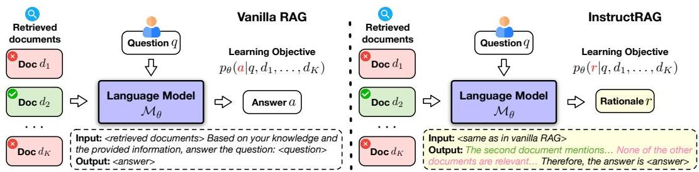
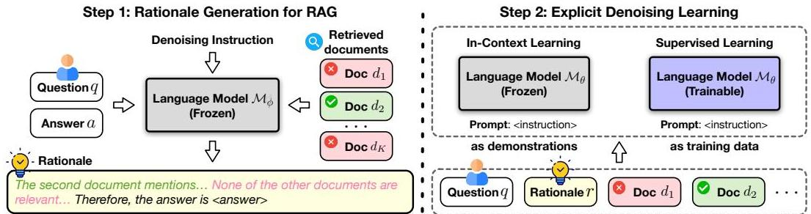
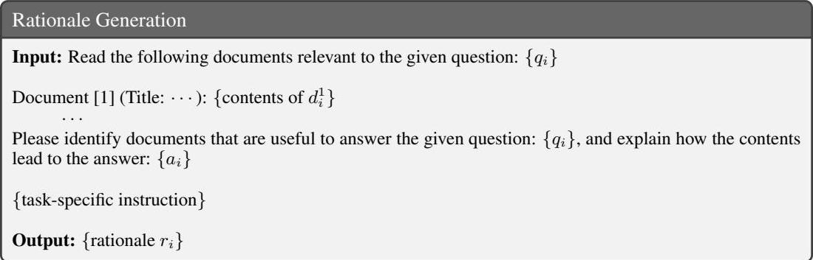
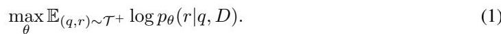
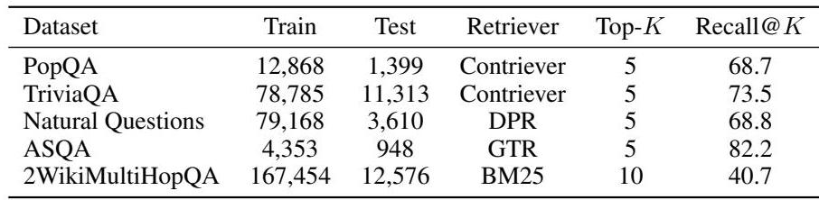
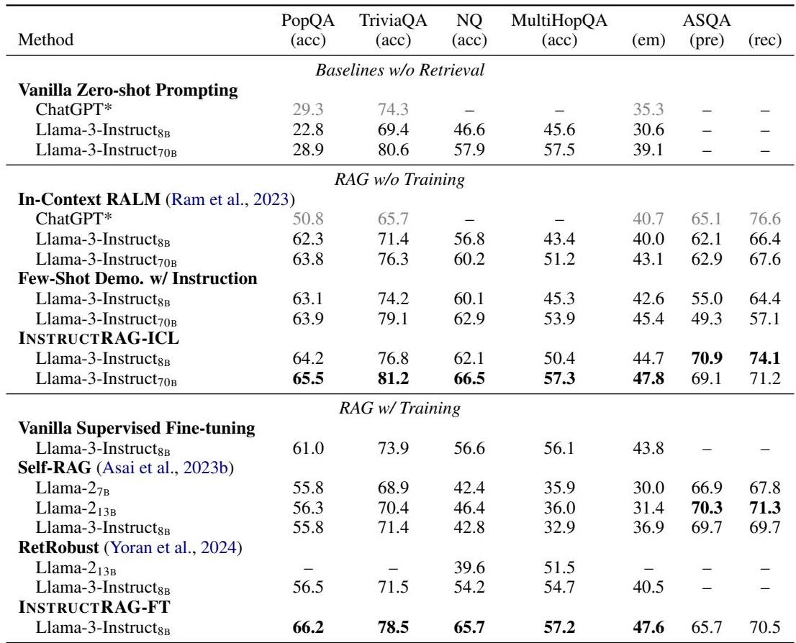
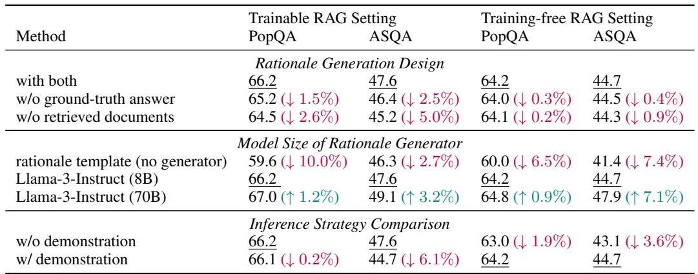
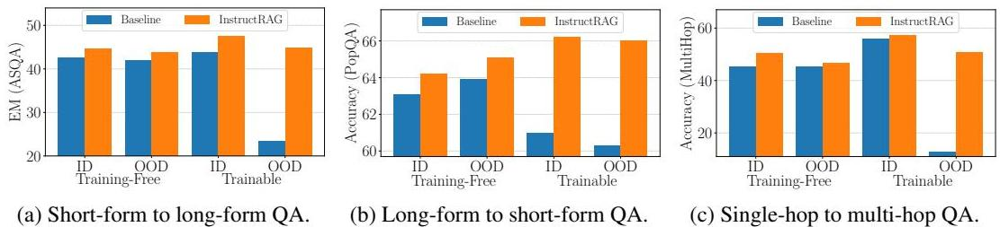
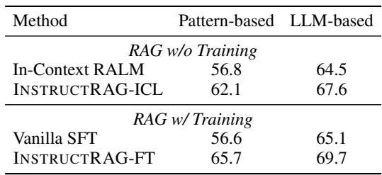

# INSTRUCTRAG: 透過自我合成理由指導檢索增強生成

Zhepei Wei Wei-Lin Chen Yu Meng 電腦科學系 維吉尼亞大學 {zhepei, wei, wlchen, yumen5}@virginia.edu

## 摘要

檢索增強生成 (RAG) 已顯示出增強語言模型 (LMs) 準確性和事實性的巨大潛力。然而，不完美的檢索器或嘈雜的語料庫可能將誤導性甚至錯誤的資訊引入到檢索內容中，對生成品質構成重大挑戰。現有的 RAG 方法通常透過直接預測最終答案來應對這一挑戰，儘管輸入可能嘈雜，這導致一個難以解釋和驗證的隱式去噪過程。另一方面，獲取顯式的去噪監督通常成本高昂，需要大量人力。在這項工作中，我們提出了 **INSTRUCTRAG**，其中 **LMs** 透過**自我合成的理由**顯式地學習去噪過程 — 首先，我們指導 **LM** 解釋如何從檢索文件中得出真實答案。然後，這些理由可以用作顯式去噪的上下文學習示範，或作為有監督的微調數據來訓練模型。與標準 **RAG** 方法相比，**INSTRUCTRAG** 不需要額外的監督，允許更容易地驗證預測答案，並有效地提高生成準確性。實驗顯示，**INSTRUCTRAG** 在無訓練和可訓練情境中持續優於現有的 **RAG** 方法，在五個知識密集型基準測試中，平均比最佳基準方法相對提高了 \(8.3\%\)。廣泛的分析表明，**INSTRUCTRAG** 隨著檢索文件數量的增加而表現良好，即使在域外數據集中也始終展現出強大的去噪能力，證明了其強大的泛化能力。1

## 1 引言

儘管大型語言模型 (**LMs**) 已展現出卓越的文本生成能力 (Brown et al., 2020; Team et al., 2023; Touvron et al., 2023)，但它們偶爾會產生事實上不正確的內容 (Dhuliawala et al., 2023; Huang et al., 2023a; Ji et al., 2023; Sun et al., 2023; Xu et al., 2024; Zhang et al., 2023)，特別是當手邊的任務需要最新資訊或預訓練語料庫中未充分表示的域外知識時 (Jiang et al., 2023b; Shuster et al., 2021; Yu et al., 2023; Zhao et al., 2023)。這一限制嚴重阻礙了 **LMs** 在事實性至關重要的高風險領域中的可靠部署 (Magesh et al., 2024; Singhal et al., 2023; Xiao et al., 2021; Xiong et al., 2024)。

有鑑於此，檢索增強生成 (**RAG**) (Asai et al., 2023b; Guu et al., 2020; Izacard et al., 2023; Khandelwal et al., 2019; Lewis et al., 2020) 已被引入，透過利用來自外部來源的最新資訊和專業知識，來增強 **LMs** 在知識密集型任務中的生成準確性 (Kasai et al., 2024; Vu et al., 2023; Yang et al., 2024; Zhou et al., 2022)。然而，由於缺乏完美的檢索解決方案 (Izacard et al., 2021; Karpukhin et al., 2020; Khattab et al., 2022; 2023; Shi et al., 2023; Su et al., 2024) 以及檢索語料庫中存在嘈雜數據 (Izacard & Grave, 2021; Li et al., 2023; Yoran et al., 2024)，檢索到的內容通常與不相關甚至錯誤的資訊混合在一起，這對幾乎所有 **RAG** 系統構成了長期存在的挑戰。通常，普通的 **RAG** 方法透過訓練 **LMs** 直接預測正確答案來隱式地解決這個問題，儘管輸入嘈雜。這種潛在的過程不僅難以解釋和驗證，而且容易受到更高的噪音比率的影響，特別是當檢索文件數量較多時 (Chen et al., 2024; Cuconasu et al., 2024; Liu et al., 2024a; Wu et al., 2024)。另一方面，獲得高品質的顯式去噪監督通常需要大量人力，既耗時又昂貴。

圖 1: 普通 **RAG** 與我們的 **INsTRucTRAG** 的比較。在普通的 **RAG** 中，模型的任務是直接預測答案，而沒有顯式的去噪過程或解釋答案是如何得出的，儘管輸入查詢和檢索文件可能嘈雜。相比之下，我們提出的 **INsTRucTRAG** 生成了**理由**，這些理由顯式地對檢索文件進行去噪並證明了預測答案的合理性，從而提高了生成準確性和可信度。

在這項工作中，我們引入了一個新的 **RAG** 框架，**INsTRucTRAG**，它使 **LM** 能夠透過生成去噪回應（即**理由**）來顯式地去噪檢索資訊並證明其預測的最終答案的合理性，如圖 1 所示。與普通的 **RAG** 方法相比，**INsTRucTRAG** 不需要任何額外的監督，同時享有更高的生成準確性和可信度。具體來說，我們的方法包括兩個步驟。首先，給定一組問題-答案對和可能嘈雜的檢索文件，我們提示一個經過指令調整的 **LM** 來合成去噪**理由**，這些**理由**分析文件並闡明它們如何導向真實答案 (§ 2.2)。然後，這些合成**理由**可以用作上下文學習的範例或作為有監督的微調數據，使 **LM** 能夠顯式地學習去噪檢索內容 (§ 2.3)。**INsTRucTRAG** 的有效性可歸因於 **LMs** 強大的指令遵循能力 (Jiang et al., 2024b; Ouyang et al., 2022; Wei et al., 2021)，這是一個在 **RAG** 環境中仍未充分探索的重要特性。我們表明，這種**自我合成的理由**不僅為**域內** **RAG** 任務提供了高品質的顯式去噪監督，而且還促進了卓越的**域外**泛化。這一發現強調了經過指令調整的 **LMs** 如何合成可泛化的監督以克服 **RAG** 中不可避免的噪音。

這項工作的主要貢獻如下：(1) 我們提出了 **INsTRucTRAG**，一個簡單但有效的 **RAG** 框架，它允許 **LMs** 透過生成**理由**來顯式地去噪檢索內容，以獲得更好的可驗證性和可信度。(2) **INsTRucTRAG** 是一種**自我合成**方法，與標準 **RAG** 方法相比不需要額外監督，並且可以無縫地應用於**上下文學習**和**有監督的微調**設定。(3) **INsTRucTRAG** 持續優於最先進的 **RAG** 方法，在五個知識密集型基準測試中，平均比最佳基準方法相對提高了 \(8.3\%\)。廣泛的分析和消融研究進一步證實了**自我合成去噪理由**的優越性，並證明了 **INsTRucTRAG** 在各種**無訓練**和**可訓練**情境下，對增加的噪音比率具有強大的去噪能力和強大的任務可轉移性。

## 2 我們的**方法**：**INsTRucTRAG**

在本節中，我們首先介紹我們的問題設定 (§ 2.1)，然後介紹我們提出的框架 **INsTRucTRAG**，它使 **LMs** 能夠顯式地去噪檢索內容。如圖 2 所示，我們的方法由兩個步驟組成。首先，我們提示一個經過指令調整的 **LM**（即**理由**生成器 \(\mathcal{M}_{\phi}\)）來合成提供去噪監督的**理由** (§ 2.2)。這些**理由**旨在解釋如何從每個訓練樣本中可能嘈雜的檢索文件中得出正確答案。然後，我們引導 **LM**（即**理由**學習器 \(\mathcal{M}_{\theta}\)）透過利用這些**理由**作為**上下文學習**示範或作為**有監督微調**數據來學習顯式去噪 (§ 2.3)。如**演算法 1** 所詳述，在整個過程中，**INsTRucTRAG** 不需要任何超出標準 **RAG** 方法的額外監督。預設情況下，我們使用相同的現成指令調整模型（即 *meta-llama/Meta-Llama-3-8B-Instruct*）來實例化 \(\mathcal{M}_{\phi}\) 和 \(\mathcal{M}_{\theta}\)，這使得 **INsTRucTRAG** 成為一個完全**自我合成**的方法。我們還實驗了 \(\mathcal{M}_{\phi}\) 和 \(\mathcal{M}_{\theta}\) 的不同實例化，並在**無訓練**和**可訓練**設定中進行了消融研究 (§ 3.3)。為簡化起見，我們在本節中使用的提示中使用了佔位符來表示省略的指令，而完整提示模板列表則在附錄 D 中提供。

圖 2: **INsTRucTRAG** 概覽。在第一步中，給定來自訓練集的問題 \(q\)、檢索文件 \(\{d_1,\dots ,d_K\}\) 和真實答案 \(a\)，我們提示一個經過指令調整的 **LM**（即**理由**生成器 \(\mathcal{M}_{\phi}\)）來生成**理由** \(r\)，解釋如何從可能嘈雜的輸入中得出答案。在第二步中，我們利用第一步中合成的**理由**來引導 **LM**（即**理由**學習器 \(\mathcal{M}_{\theta}\)）透過**上下文學習**或**有監督學習**顯式地學習對檢索文件的去噪。預設情況下，我們對 \(\mathcal{M}_{\phi}\) 和 \(\mathcal{M}_{\theta}\) 使用相同的模型，但它們也可以用不同的模型實例化（見消融研究 \(\S 3.3)\)）。

表 1: 第 \(i\) 個訓練樣本的理由生成提示。

### 2.1 問題設定

我們採用標準的 **RAG** 設定，其中 **LM** \(\mathcal{M}_{\theta}\) 可以訪問下游任務的註釋數據集（例如，問答任務 \(\mathcal{T} = \{\langle q,a\rangle \}\)），以及帶有現成檢索器 \(\mathcal{R}\) 的外部知識庫以進行檢索。與之前的作品 (Asai et al., 2023b; Yoran et al., 2024)  leveraging additional supervisions from GPT-3 (Brown et al., 2020) or GPT-4 (Achiam et al., 2023) 不同，我們假設模型對上述兩種資訊來源的訪問受到嚴格限制。給定一個問題 \(q\)，檢索器 \(\mathcal{R}\) 從外部知識庫返回一組可能嘈雜的文件 \(D = \{d_1,\dots ,d_K\}\)。然後，模型的任務是根據 \(D\) 及其自身的參數知識，預測給定問題 \(q\) 的正確答案 \(a\)，表示為 \(p_{\theta}(a|q,D)\)。

我們的工作重點是研究 **LMs** 的抗噪能力，並為 **RAG** 開發有效的去噪技術。因此，我們直接採用現成的檢索器，而不是訓練我們自己的，並將所有檢索到的文件作為輸入預先添加到問題中，不進行任何過濾或重新排序。此設定與現有研究工作正交，這些工作主要集中於優化檢索器或執行自適應檢索 (Asai et al., 2023b; Wang et al., 2024a; Yang et al., 2024)。

### 演算法 1 INSTRUCTRAG

*要求*: 檢索器 \(\mathcal{R}\)、**理由**生成器 \(\mathcal{M}_{\phi}\)、**理由**學習器 \(\mathcal{M}_{\theta}\)、訓練數據 \(\mathcal{T} = \{\langle q,a\rangle \}\)
\(*訓練數據生成 \(\neq\) \)*
1: 對於每個 \(\langle q,a\rangle \in T\)
2: 檢索 \(D = \{d_1,\dots ,d_K\} \leftarrow \mathcal{R}(q)\)
3: 合成去噪**理由** \(r\leftarrow \mathcal{M}_{\phi}(q,a,D)\) **理由**生成 \((\S 2.2)\)
4: 擴增訓練數據 \(\mathcal{T}\rightarrow \mathcal{T}^{+} = \{\langle q,r\rangle \}\)
\(*兩種學習模式 \(\neq\) \)*
5: 如果 *LearningMode* \(=\) **上下文學習** 則
> **INSTRUCTRAG-ICL**
6: 採樣 ICL 範例 \(\mathcal{E} = \{\langle q,r\rangle \} \subseteq \mathcal{T}^{+}\)
7: \(r\leftarrow \mathcal{M}_{\theta}(r|q,\mathcal{R}(q),\mathcal{E})\) 給定推理查詢 \(q\) D 詳見表 10
8: 否則如果 *LearningMode* \(= =\) **微調** 則 D **INSTRUCTRAG-FT**
9: 在 \(\mathcal{T}^{+}\) 上對 \(\mathcal{M}_{\theta}\) 進行微調，並帶有檢索文件 \(\{\langle q,r,D\rangle \}\)
10: \(r\leftarrow \mathcal{M}_{\theta}(r|q,\mathcal{R}(q))\) 給定推理查詢 \(q\) D 詳見表 11
11: 返回 \(r\)

### 2.2 透過指令遵循生成**理由**

最近的研究 (Leike et al., 2018; Meng et al., 2024; Ouyang et al., 2022) 在使 **LMs** 與人類偏好和意圖對齊方面取得了令人鼓舞的進展，這使得能夠合成嚴格遵循用戶指令的高品質數據 (Xu et al., 2024c)。受這些進展的啟發，我們建議利用 **LM** 強大的指令遵循能力來為 **RAG** 生成**顯式去噪回應**（即**理由**）。如表 1 所示，給定一個 **QA** 對 \(\langle q_i, a_i \rangle \in \mathcal{T}\) 和一組檢索文件 \(\{d_1^+, \dots , d_i^+\}\)，我們用去噪指令提示一個現成的 **LM**（作為**理由**生成器 \(\mathcal{M}_{\phi}\)），以產生相應的**理由** \(r_i\)，該**理由**將有用的文件與嘈雜的文件區分開來，並解釋上下文如何導向真實答案 \(a_i\)。為了確保合成**理由**與真實答案對齊，我們使用一個簡單的子字串匹配來評估其一致性。在至少包含一個包含真實答案的相關文件的訓練樣本上，一致性比率在五個基準測試中平均為 98%，這支持了合成**理由**作為健全性檢查的可靠性。這使我們能夠僅透過指導 **LM**，在沒有任何額外監督的情況下，有效地用**自我合成的去噪理由**擴增標準數據集 \(\mathcal{T} = \{\langle q, a \rangle \} \rightarrow \mathcal{T}^{+} = \{\langle q, r \rangle \}\)。

我們還驗證了使用基於 **LM** 的生成器（即 \(\mathcal{M}_{\phi}\)）來創建**理由**的必要性，而不是採用簡單的啟發式方法 — 沒有生成器，**理由**可以透過模板化的方式創建（表 6），透過與真實答案進行簡單的子字串匹配來粗略地識別相關的檢索文件。然而，正如我們的消融研究所示，這種方法存在語義不準確匹配相關文件的問題，導致性能顯著下降。基於 **LM** 的生成器的另一個優勢是，即使在不參考真實答案的情況下，它也能產生高品質的**理由**，這只會導致性能略微下降。關於**理由**生成設計的更詳細分析可以在我們的消融研究 (§ 3.3) 中找到。

### 2.3 在 **RAG** 中學習去噪**理由**

有了**理由**擴增數據集 \(\mathcal{T}^{+}\)，就可以開發一個**理由**學習器 \(\mathcal{M}_{\theta}\)，它透過有效的學習策略直接學習 **RAG** 任務的顯式去噪。接下來，我們介紹**無訓練**和**可訓練** **RAG** 設定中的兩種簡單而有效的學習方法，即 **INSTRUCTRAG-ICL** 和 **INSTRUCTRAG-FT**。

**INSTRUCTRAG-ICL** 是 **INSTRUCTRAG** 的**無訓練**實例化，其中模型透過**上下文學習** (**ICL**) 來學習去噪**理由**。如表 10 所示，給定一個測試問題 \(q\) 和一組檢索文件 \(D = \{d_1, \dots , d_K\}\)，我們首先從**理由**擴增訓練數據集中隨機採樣 \(N\) 個示範 \(\langle q_i, r_i \rangle \in \mathcal{T}^{+}\)，然後提示模型遵循範例並生成**理由** \(r\)。為了節省記憶體並提高推理效率，我們僅在此類 **ICL** 示範中顯示範例問題及其相應的**理由**。

**INsTRucTRAG-FT** 是 **INsTRucTRAG** 的**可訓練**實例化，它透過**有監督微調** (**FT**) 和標準語言建模目標來學習去噪**理由**。正如等式 1 中所定義，它最大化**理由** \(r\) 在問題 \(q\) 和檢索文件 \(D\) 上的條件可能性。

其中 \(\theta\) 代表模型參數。**INsTRucTRAG-FT** 的訓練和推理共享相同的數據格式。如表 11 所示，它將檢索文件後跟問題作為輸入，並輸出去噪**理由** \(r\)。

## 3 實驗

### 3.1 實驗設定

表 2: 數據集統計和檢索設定。

**RAG** 任務和評估指標。我們在五個知識密集型基準測試上廣泛驗證了 **INsTRucTRAG** 的有效性，包括 PopQA (Mallen et al., 2023)、TriviaQA (Joshi et al., 2017)、Natural Questions (Kwiatkowski et al., 2019)、ASQA (Stelmakh et al., 2022) 和 2WikiMultiHopQA (Ho et al., 2020)。我們使用維基百科語料庫作為檢索來源，並使用**無訓練**和**可訓練**兩種現成檢索器測試我們的方法，包括 BM25 (Robertson & Walker, 1994)、DPR (Karpukhin et al., 2020)、GTR (Ni et al., 2022) 和 Contriver (Izacard et al., 2021)。檢索品質由 Recall@K 衡量，表示檢索到的 \(K\) 個文件是否包含正確答案。表 2 顯示了詳細的數據集統計數據。遵循標準評估設定 (Asai et al., 2023b)，我們採用 **ASQA** 的正確性 (str-em)、引用精確度 (pre) 和召回率 (rec) 的官方指標 (Gao et al., 2023a)，並對其他任務使用準確性，這衡量了模型生成中是否包含真實答案 (Mallen et al., 2023; Schick et al., 2023)。此外，我們還採用 **LLM** 作為評審進行進一步評估 (§ 3.4)，因為上述標準指標受到模式匹配的限制，無法準確處理語義等價性。

**基準線**。我們在**無訓練**和**可訓練**兩種設定下，將我們的方法與廣泛的 **RAG** 基準線進行了比較。鑑於最先進的 **LMs** 在預訓練階段已經整合了大量的世界知識，我們也報告了無檢索基準線（即**普通的零樣本提示**）的性能以供參考。具體來說，**無訓練 RAG** 基準線包括：(1) 上下文檢索增強語言建模 (**RALM**) (Ram et al., 2023)，這是一種透過向模型呈現檢索文件來擴展無檢索基準線的提示方法；(2) 帶有指令的**少樣本示範**，一種使用從訓練集中採樣的真實問題-答案對作為示範範例的 **ICL** 方法。

**可訓練 RAG** 基準線包括：(1) **普通的有監督微調 (SFT)**，一種有監督方法，其訓練目標是在給定可能嘈雜的輸入的情況下，最大化真實答案的數據可能性；(2) **RetRobust** (Yoran et al., 2024)，它在相關和不相關上下文的混合上微調 **RAG** 模型，使其對不相關上下文具有魯棒性；(3) **Self-RAG** (Asai et al., 2023b)，一個強大的**可訓練**基準線，專注於由特殊**反思標記**控制的自適應檢索。**RetRobust** 和 **Self-RAG** 最初都是基於 Llama-2 (Touvron et al., 2023) 和額外監督構建的。例如，**RetRobust** 透過提示 **GPT-3** 來分解原始查詢並生成中間**子查詢**，從而擴增**多跳推理**任務（例如 2WikiMultiHopQA）的訓練數據，而 **Self-RAG** 需要 **GPT-4** 來生成額外的**反思標記**來擴增訓練樣本。

為了公平比較，我們在 Llama-\(2_{7\mathrm{B}}\) 和/或 Llama-\(2_{13\mathrm{B}}\) 上重新實現了這兩種方法，並使用其作者發布的擴增訓練數據，並報告它們的性能，取原始分數和我們重現結果中較高的一個。由於我們的方法採用指令調整的 Llama-3 作為骨幹模型，我們還使用 Llama-3-Instruct8B 訓練了 **RetRobust** 和 **Self-RAG**，並透過廣泛的**超參數**搜索來優化其性能。有關實施的更多細節，包括訓練、推理和提示設計，請參見附錄 B 和附錄 D。我們還在附錄 C 中介紹了一些案例研究。

表 3: **INsTRucTRAG** 和基準線在**無訓練**和**可訓練 RAG** 設定下，於五個知識密集型基準測試上的總體結果。我們重新實現了基準線，並報告了其性能，取原始分數和我們重現結果中較高的一個。\*表示從 Asai et al. (2023b) 複製的結果以供參考。*表示原始論文中未報告或不適用（例如，某些方法無法產生引用）。最佳性能以粗體突出顯示。

### 3.2 主要結果

表 3 顯示了總體實驗結果，提供了我們的 **INsTRucTRAG** 和基準線方法在**無訓練**和**可訓練 RAG** 設定下的全面比較。

**無檢索的基準線**。如第一塊所示，基本的指令調整模型（Llama3-Instruct8B 和 Llama-3-Instruct70B）已經在所有五個基準測試中取得了顯著的性能，其中 70B 模型在 TriviaQA 上展現了驚人的 \(80.6\%\) 的競爭性性能。這一觀察表明，這些任務所需的知識大多屬於 **LM** 的參數知識，這可能是由於所謂的**數據污染**（即，下游任務的測試數據存在於 **LMs** 的預訓練數據中）(Golchin & Surdeanu, 2023; Jacovi et al., 2023; Magar & Schwartz, 2022)。

**無訓練的 RAG**。第二塊顯示了**無訓練 RAG** 方法之間的比較。上下文 **RALM** 和帶有指令的**少樣本示範**方法通常比**無檢索**基準線獲得更高的性能，這突顯了檢索對於知識密集型任務的重要性。令人鼓舞的是，我們的 **INsTRucTRAG-ICL** 在各種指標上持續優於所有**無訓練**基準線，證實了**自我合成去噪理由**的有效性。此外，從 8B 到 70B 模型的提升表明，**INsTRucTRAG-ICL** 可以隨**較大的骨幹模型**有效擴展，驗證了我們方法的泛化能力。

**有訓練的 RAG**。如表 3 底部所示，我們的 **INsTRucTRAG-FT** 不僅在所有五個基準測試上超越了所有**無檢索**和**無訓練**基準線，而且幾乎在每個指標上都顯著優於**可訓練 RAG** 準線。唯一的例外是在 ASQA 任務中，我們的**方法**在**引用**方面（即 pre 和 rec）略遜於 **Self-RAG**。這是因為我們的工作主要關注 **RAG** 的顯式去噪，以提高生成的正確性，這是由 em 衡量的。儘管沒有明確針對**引用**指標進行優化，但我們的方法仍然實現了有競爭力的**引用**性能，顯著提高了**生成準確性**和**可信度**。值得注意的是，**RetRobust** 在涉及**多跳推理**的 **2WikiMultiHopQA** 上取得了有競爭力的性能。我們將此歸因於 **GPT-3** 提供的額外訓練監督，這使模型能夠顯式地生成中間**子查詢**和**子答案**。另一個有趣的發現是，**Self-RAG** 的性能持續遜於**普通的 SFT**，甚至在所有基準測試上都遜於**無訓練**的**上下文 RALM** 基準線。我們推測原因可能是這些 **RAG** 任務比一般知識更傾向於**特定領域**知識。然而，**Self-RAG** 難以直接利用現有訓練數據中的**域內**特徵，因為它需要 **GPT-4** 在這些基準測試上生成**反思標記**，而這在我們問題設定中是不可用的 (§ 2.1)。

### 3.3 消融研究

提供**真實答案**和**檢索文件**對於**理由**生成很重要。如表 4 的第一塊所示，我們從兩個方面消融了**理由**生成設計：(1) **w/o 真實答案**，其中模型在**理由**生成期間無法訪問**真實答案**，並且必須僅根據**檢索文件**預測答案並解釋其是如何得出的；(2) **w/o 檢索文件**，其中模型在**理由**生成期間未提供任何**檢索文件**，在這種情況下，它必須根據其自身知識來解釋給定的答案。儘管我們的預設設計持續優於這兩種消融設計並不奇怪，但令人鼓舞的是，即使在無法訪問**檢索文件**或**真實答案**的情況下，我們的方法仍然運作良好。這一發現表明，我們的 **INsTRucTRAG** 有望以完全**無監督**的方式運作，我們認為這是未來工作的一個令人興奮的方向。

表 4: 關於**真實答案**、**檢索文件**和**模型大小**對**理由生成**以及**模型推理**期間**示範**使用的影響的消融研究。我們的 **INsTRuCtRAG** 預設設定的結果帶有下劃線。

**更大的理由生成器**會帶來更好的結果。中間塊顯示了不同大小的**理由生成器**如何影響我們方法的性能。顯然，基於模板的**理由生成**方法顯著遜於我們的方法，這突顯了**理由生成器**的必要性。這是因為基於模板的方法依賴於**模式匹配**來識別包含真實答案的相關文件，這只考慮了詞彙相似性而忽略了語義。對語義的忽視不可避免地會給模板生成的**理由**引入噪音，使得它們與 **LMs** 生成的**理由**相比效果較差。此外，我們還比較了使用 Llama-3-INstruct\(_{BB}\) 和 Llama-3-INstruct\(_{70B}\) 作為**理由生成器**的 **INsTRucTRAG** 的兩種變體。結果顯示，具有 70B 生成器的變體在**無訓練**和**可訓練**設定中持續優於其 8B 對應物，這表明當由**更強大的模型**生成時，**自我合成去噪理由**可以提供更好的監督。

**帶有示範的推理**應僅應用於 **INsTRucTRAG-ICL**。在底部塊中，我們研究了**模型推理**期間**示範**的使用。儘管**示範**對於 **INsTRucTRAG-ICL** 來說發揮著重要作用，但我們發現它們實際上損害了 **INsTRucTRAG-FT** 的性能。我們將此歸因於以下事實：**INsTRucTRAG-FT** 經過優化，可以直接生成去噪**理由**，而無需參考任何**示範**，即使在輸入可能嘈雜的情況下。因此，為 **INsTRucTRAG-FT** 提供上下文**示範**是多餘的，並且由於訓練和推理之間的差異，可能會損害其能力。

### 3.4 分析

**INsTRucTRAG-ICL** 持續受益於更多示範。圖 3a 顯示了 **INsTRucTRAG-ICL** 和帶有指令的**少樣本示範**基準線的**示範敏感性**。有趣的是，**基準線方法**僅用一個**示範**就實現了其最佳性能，而呈現更多**示範**實際上損害了其性能。相比之下，我們的方法隨著**示範**數量的增加而持續改善，這證實了**自我合成理由**在去噪方面優於普通答案的優越性。

圖 3: 不同數量**示範**和**檢索文件**的影響。(a) **INsTRucTRAG-ICL** 的**示範敏感性**研究。(b) **INsTRucTRAG-ICL** 的**噪音魯棒性**研究。(c) **INsTRucTRAG-FT** 的**噪音魯棒性**研究。

**INsTRucTRAG-ICL** 和 **INsTRucTRAG-FT** 對增加的噪音比率具有魯棒性。圖 3b 和圖 3c 顯示了 **INsTRucTRAG-ICL** 和 **INsTRucTRAG-FT** 的**生成準確性**以及在**檢索文件**數量增加的情況下相應的**檢索精確度**。雖然檢索更多文件為 **RAG** 模型提供了更豐富的外部知識，但它也引入了更多噪音並降低了**檢索精確度**。因此，**無訓練**和**可訓練**基準線都顯示出改進減弱甚至**性能下降**，這反映了它們對高噪音比率的脆弱性。相比之下，我們的 **INsTRucTRAG-ICL** 和 **INsTRucTRAG-FT** 並未受到這種增加的噪音比率的負面影響，反而獲得了進一步的改進，這證明了它們強大的**去噪能力**。

**INsTRucTRAG-ICL** 和 **INsTRucTRAG-FT** 對**未見過的任務**具有良好的泛化能力。圖 4 演示了我們的方法在**無訓練**和**可訓練**設定中的**泛化能力**。對於**域內 (ID)** 方法，它直接利用**目標域**示範（在**無訓練**設定中）或在**目標域**任務上進行訓練（在**可訓練**設定中）。相比之下，**域外 (OOD)** 方法只能從**源域**中的示範或訓練數據中學習，並且對**目標域**沒有先驗知識。在這種情況下，模型必須利用從**源域**任務中學到的知識來解決**未見過的目標域**任務。結果顯示，我們的方法在**域內**和**域外**設定中的各種情境下持續優於**基準線**，證明了其強大的**任務泛化能力**。一個反直覺的發現是，在從**長形式**到**短形式 QA** 任務的泛化情境中（圖 4b），**無訓練 OOD** 方法的表現**顯著優於其域內對應物**。我們推測**無訓練 OOD** 方法之所以能獲得更好的性能，是因為它受益於來自**源域**（ASQA）的**長答案示範**。原因是 ASQA 中的問題是模糊的，可以有多種解釋，而真實的**長答案**通常從多個角度解決問題，這可以被視為一種**思維鏈**示範形式。

圖 4: 將 **INsTRucTRAG** 從**源域任務**泛化到**目標域任務**，其中 **ID** 和 **OOD** 表示**域內**和**域外**設定。(a) PopQA（**短形式 QA** 任務）作為**源域**，ASQA（**長形式 QA** 任務）作為**目標域**。(b) ASQA 作為**源域**，PopQA 作為**目標域**。(c) PopQA（**單跳 QA** 任務）作為**源域**，2WikiMultiHopQA（**多跳 QA** 任務）作為**目標域**。我們採用帶有指令的**少樣本示範**和**普通的有監督微調**作為**無訓練**和**可訓練基準線**。

此外，我們還研究了 **INsTRucTRAG** 對非 **QA** 知識密集型任務（例如**程式碼生成**）的**泛化能力**。如表 5a 所示，我們直接應用在 **QA** 任務（PopQA）上訓練的 **INsTRucTRAG-FT** 來解決**未見過的程式碼生成**任務（HumanEval (Chen et al., 2021)），遵循 **CodeRAG-Bench** 設定 (Wang et al., 2024c)。我們使用標準的 *pass@k* 指標評估**程式碼生成**性能，並將我們的方法與現成的 Llama-3-8B-Instruct 作為**基準線**進行比較。可以觀察到，我們的方法在**無檢索**和**檢索增強生成**設定中，在**未見過的程式碼生成**任務中**持續實現更好的泛化性能**。這一發現與我們的觀察一致，即在 **QA** 任務上訓練的 **INsTRucTRAG** 傾向於生成更多基於文本的註解，以闡明程式碼解決方案的設計，從而導向更準確的程式碼生成。

表 5: (a) 從**源 QA** 任務 (PopQA) 到**目標程式碼生成**任務 (HumanEval) 的遷移。我們的方法 **INsTRucTRAG-FT** 僅在**源任務**上進行微調，並在**未見過的目標任務**上進行評估。我們將其與現成的 LLaMA-3-8B-Instruct 進行比較，在**無檢索**和**檢索增強生成**設定中，使用標準指標 *pass@k* (Chen et al., 2021)。(b) 使用 GPT-4o 作為評審的評估。與基於模式匹配的指標相比，它允許評審考慮**語義等價性**，預計會產生更公平的評估。

(a) 從 **QA** 任務到**程式碼生成**任務的遷移。

(b) 使用 GPT-4o 作為評審的評估。

**使用 LLM 作為評審進行評估**。儘管**準確性**或**精確匹配**是**問答**的標準評估指標，但眾所周知它們並不完美 (Cuconasu et al., 2024)，因為它們主要依賴於**模式匹配**來判斷模型預測的正確性。此類指標無法處理預測和真實答案是同義詞的情況（例如，“Donald Trump” 與 “Donald J. Trump” 不能被正確識別為匹配），導致**評估結果存在偏差**。因此，我們使用 **LLM 作為評審** (Bubeck et al., 2023; Zheng et al., 2024b) 來使用 GPT-4o (OpenAI, 2024) 評估預測，這允許評審考慮**語義等價性**，預計會產生更公平的評估。如表 5b 所示，我們在**無訓練**和**可訓練 RAG** 設定下，在**開放域 Natural Questions** 基準測試上評估了我們的方法和基準模型。與基於**模式匹配**的指標相比，**LLM 作為評審**通常會產生更高的**評估結果**，這主要歸因於其準確匹配**語義等價短語**的能力。值得注意的是，我們的方法在基於**模式匹配**和**基於 LLM** 的評估指標下持續優於**基準線**，進一步驗證了 **INsTRucTRAG** 的有效性。

## 4 相關工作

### 4.1 檢索增強生成

檢索增強生成 (**RAG**) 是一種廣泛採用來使用外部知識增強大型語言模型 (**LLMs**) 的方法 (Asai et al., 2023a; 2024; Borgeaud et al., 2022; Gao et al., 2023b; Guu et al., 2020; Khandelwal et al., 2019; Lewis et al., 2020; Ram et al., 2023; Shi et al., 2023)，它在減少幻覺和提高 **LLMs** 在各種現實世界應用中的生成準確性方面展示了巨大的潛力 (Chase, 2022; Jin et al., 2024b; Liu, 2022; Lu et al., 2022; Siriwardhana et al., 2023; Tan et al., 2024; Zhou et al., 2022; Liu et al., 2024b; Xiong et al., 2025)。最近，越來越多的研究工作致力於從各個方面增強 **RAG**，例如提高**解碼效率** (Merth et al., 2024; Jin et al., 2024a; Liu et al., 2023; Wang et al., 2024b)、探索**長上下文檢索** (Xu et al., 2024a; Yen et al., 2024)、**壓縮提示** (Jiang et al., 2023a; Xu et al., 2023; Cheng et al., 2024)，以及解決實際問題，例如**對抗性檢索** (Xiang et al., 2024; Zhong et al., 2023; Zou et al., 2024) 和**隱私洩露** (Huang et al., 2023b; Zeng et al., 2024)。儘管有這些優勢，這些 **RAG** 系統不可避免地會受到**不完美檢索器**或**嘈雜檢索語料庫**引入的不相關資訊的影響。然而，大多數現有工作通常透過**提高檢索品質**和**減少模型暴露於噪音**來解決這個問題 (Gupta et al., 2024; Jiang et al., 2024a; Santhi et al., 2024; Wang et al., 2024a; Yan et al., 2024; Yang et al., 2024; Zhang et al., 2024a,b)。值得注意的方法包括**自適應檢索** (Asai et al., 2023b; Jiang et al., 2023b; Yao et al., 2022) 和**查詢重寫** (Chan et al., 2024; Mao et al., 2024)。相比之下，我們的工作專注於一個正交的方向，即為 **RAG** 開發**顯式去噪方法**，從而增強模型的**噪音魯棒性**和**生成準確性**，即使在高度嘈雜的上下文中也是如此。

### 4.2 誘發大型語言模型的推理

最近的研究廣泛探索了 **LMs** 的**推理能力**，但通常不在 **RAG** 的背景下，因為在 **RAG** 中，如果沒有得到妥善處理，可能嘈雜的檢索內容可能會誤導推理。**思維鏈** (**CoT**) **提示** (Wei et al., 2022) 是一種有效的方法，透過展示帶有詳細解釋（即**理由** (Feng et al., 2024; Lampinen et al., 2022; Rajani et al., 2019; Zelikman et al., 2024)）的範例來從 **LMs** 誘發**逐步推理**，這些**理由**導向最終答案。然而，此類工作通常需要**手動製作的示範** (Wang et al., 2022; Xu et al., 2024b)，這既昂貴又需要大量努力和領域知識 (Zheng et al., 2024a)。為了減輕這一限制，已經引入了其他方法來**自動從語料庫中選擇實例** (Zhang et al., 2022) 或**由 LM 本身策劃示範** (Chen et al., 2023a)，並結合**零樣本 CoT** (Kojima et al., 2022) 來生成**理由**。此外，已經證明 **CoT** **推理**即使在沒有顯式提示的情況下也可以被誘發，特別是對於**指令調整的 LMs** (Wang & Zhou, 2024)。另一項相關工作表明，由小模型生成的**理由**可以幫助大模型更好地**推理** (Lee et al., 2024)。儘管**合理化**已在許多 **NLP** 任務中得到廣泛研究 (Chen et al., 2023b; 2022; Ghoshal et al., 2022; Paranjape et al., 2020; Wiegreffe et al., 2021)，但它們都沒有專為 **RAG** 設計，以及如何在 **RAG** 的背景下利用 **LMs** 的**指令遵循能力**來進行**顯式去噪**仍然未得到充分探索。

## 5 結論

在這項工作中，我們提出了 **INSTRUCTRAG**，一種簡單的檢索增強生成 (**RAG**) 方法，它顯式地對檢索內容進行去噪並產生準確的生成。透過利用**大型語言模型**強大的**指令遵循能力**，**INSTRUCTRAG** 生成了詳細的**理由**，闡明如何從**檢索文件**中得出真實答案。這些**合成理由**可以作為**上下文學習範例**或**有監督的微調數據**，使模型能夠學習**顯式去噪過程**。在五個知識密集型基準測試上的實驗表明，**INSTRUCTRAG** 在**無訓練**和**可訓練**設定中，持續優於最先進的 **RAG** 方法，並取得了顯著的改進。與最佳基準方法相比，**INSTRUCTRAG** 在所有基準測試上平均提高了 \(8.3\%\)，證明了其在增強**檢索增強生成噪音魯棒性**方面的有效性。局限性和未來工作在附錄 A 中討論。

## 致謝

作者要感謝維吉尼亞大學的 Xinyu Zhu、普林斯頓 **NLP** 組的 Tianyu Gao 和 Zexuan Zhong 提供的寶貴意見和討論。這項研究部分得到了 NVIDIA 學術資助和 OpenAI 研究者訪問計劃的支持。我們感謝匿名審稿人富有建設性和洞察力的評論。

## 重現性聲明

為了確保我們的報告結果具有最高水準的**重現性**，我們提供了：

* 完整的**原始碼**，可透過以下連結訪問：https://github.com/weizhepei/InstructRAG；
* 附錄 B 中全面的**實施細節**；
* 附錄 D 中我們實驗中使用的所有**提示模板**。

## 參考文獻

Josh Achiam, Steven Adler, Sandhini Agarwal, Lama Ahmad, Ilge Akkaya, Florencia Leoni Aleman, Diogo Almeida, Janko Altenschmidt, Sam Altman, Shyamal Anadkat, et al. GPT-4 technical report. *arXiv preprint arXiv:2303.08774*, 2023.

Akari Asai, Sewon Min, Zexuan Zhong, and Danqi Chen. Retrieval-based language models and applications. In *Proceedings of the 61st Annual Meeting of the Association for Computational Linguistics (Volume 6: Tutorial Abstracts)*, pp. 41–46, 2023a.

Akari Asai, Zeqiu Wu, Yizhong Wang, Avirup Sil, and Hannaneh Hajishirzi. Self-RAG: Learning to retrieve, generate, and critique through self-reflection. In *The Tweakfit International Conference on Learning Representations*, 2023b.

Akari Asai, Zexuan Zhong, Danqi Chen, Pang Wei Koh, Luke Zettlemoyer, Hannaneh Hajishirzi, and Wen-tau Yih. Reliable, adaptable, and attributable language models with retrieval. *arXiv preprint arXiv:2403.03187*, 2024.

Sebastian Borgeaud, Arthur Mensch, Jordan Hoffmann, Trevor Cai, Eliza Rutherford, Katie Millican, George Bm Van Den Driessche, Jean-Baptiste Lespiau, Bogdan Damoc, Aidan Clark, et al. Improving language models by retrieving from trillions of tokens. In *International conference on machine learning*, pp. 2206–2240. PMLR, 2022.

Tom Brown, Benjamin Mann, Nick Ryder, Melanie Subbiah, Jared D Kaplan, Prafulla Dhariwal, Arvind Neelakantan, Pranav Shyam, Girish Sastry, Amanda Askell, et al. Language models are few-shot learners. *Advances in neural information processing systems, 33*:1877–1901, 2020.

Sébastien Bubeck, Varun Chandrasekaran, Ronen Eldan, Johannes Ge...