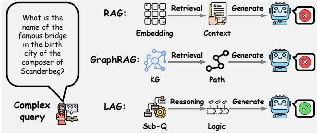
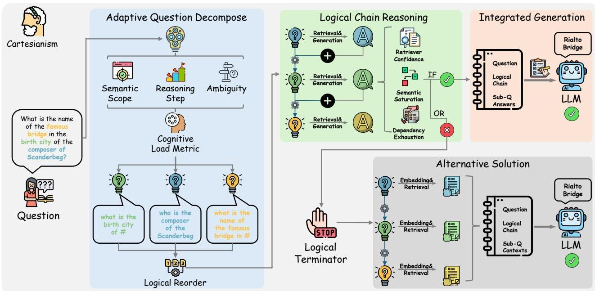

# LAG: Logic-Augmented Generation from a Cartesian Perspective

Yilin Xiao, Chuang Zhou, Qinggang Zhang, Su Dong, Shengyuan Chen, Xiao Huang

The Hong Kong Polytechnic University Hong Kong SAR {yilin.xiao, chuang- qqzj.zhou, su.dong} @connect.polyu.hk, {qinggang.zhang ,sheng- yuan.chen ,xiao.huang} @polyu.edu.hk

Abstract

Large language models (LLMs) have demonstrated remarkable capabilities across a wide range of tasks, yet exhibit critical limitations in knowledge- intensive tasks, often generating hallucinations when faced with questions requiring specialized expertise. While retrieval- augmented generation (RAG) mitigates this by integrating external knowledge, it struggles with complex reasoning scenarios due to its reliance on direct semantic retrieval and lack of structured logical organization. Inspired by Cartesian principles from Discours de la methode, this paper introduces Logic- Augmented Generation (LAG), a novel paradigm that reframes knowledge augmentation through systematic question decomposition and dependency- aware reasoning. Specifically, LAG first decomposes complex questions into atomic sub- questions ordered by logical dependencies. It then resolves these sequentially, using prior answers to guide context retrieval for subsequent sub- questions, ensuring stepwise grounding in logical chain. To prevent error propagation, LAG incorporates a logical termination mechanism that halts inference upon encountering unanswerable sub- questions and reduces wasted computation on excessive reasoning. Finally, it synthesizes all sub- resolutions to generate verified responses. Experiments on four benchmark datasets demonstrate that LAG significantly enhances reasoning robustness, reduces hallucination, and aligns LLM problem- solving with human cognition, offering a principled alternative to existing RAG systems.

## Introduction

Large language models (LLMs), like Claude (Anthropic 2024), ChatGPT (OpenAI 2023) and the Deepseek series (Liu et al. 2024), have demonstrated remarkable capabilities in many real- world tasks (Chen et al. 2024b; Zhou et al. 2025), such as question answering (Allam and Haggag 2012), text comprehension (Wright and Cervetti 2017) and content generation (Kumar 2024). Despite the success, these models are often criticized for their tendency to produce hallucinations, generating incorrect statements on tasks beyond their knowledge and perception (Ji et al. 2023; Zhang et al. 2024). Recently, retrieval- augmented generation (RAG) (Gao et al. 2023; Lewis et al. 2020) has emerged as a promising solution to alleviate such hallucinations. By dynamically leveraging external knowledge from textual corpora, RAG enables LLMs to generate more accurate and reliable responses without costly retraining (Lewis et al. 2020;

  
Figure 1: Comparison of three paradigms. LAG exhibits greater lightweight properties compared to GraphRAG while achieving higher accuracy than RAG and GraphRAG.

Devalal and Karthikeyan 2018).

RAG systems typically operate through three key stages: knowledge preprocessing, retrieval, and integration. First, external textual corpora are segmented into manageable chunks and converted into vector representations for efficient indexing. When a query is received, the system then retrieves relevant text segments using semantic similarity matching (Sawarkar, Mangal, and Solanki 2024) or keyword- based search (Purwar and Sundar 2023). Finally, during integration, the retrieved information is combined with the original query to produce knowledge- enhanced responses. Recent advances in RAG technology have evolved beyond basic text retrieval toward more sophisticated approaches. These include graph- based systems (Zhang et al. 2025; Peng et al. 2024; Procko and Ochoa 2024; Shengyuan et al. 2023) that model conceptual relationships using graph structures, hierarchical methods (Chen et al. 2024a; Li et al. 2025b; Chen et al. 2025) preserving document organization through multi- level retrieval, re- ranking implementations (Glass et al. 2022; Xu, Shi, and Choi 2024) utilizing preliminary retrieval followed by refined scoring, Self- RAG architectures (Asai et al. 2024) capable of on- demand retrieval and self- reflection, and adaptive frameworks (Tang et al. 2025; Sarthi et al. 2024) that dynamically adjust retrieval strategies based on query complexity. These strategies significantly enhance naive RAG systems through improved retrieval accuracy.

However, despite the potential of retrieval- centric architectures, existing RAG systems exhibit three critical limitations when handling questions of high complexity. First, direct retrieval using semantic or keyword matching often fails to capture the underlying logical structure of complex questions, leading to irrelevant or fragmented context. For instance, retrieving with the question shown in Figure 1 returns only information about Scanderbeg, which is insufficient to arrive at the correct answer. Second, when relevant knowledge is retrieved, RAG lacks mechanisms to organize information according to inherent logical dependencies, limiting coherent reasoning in practical scenarios. Revisiting the question in Figure 1, even when relevant context is retrieved, the LLM still often struggle because it fails to capture the logical dependencies inherent (Scanderbeg  \(\rightarrow\)  composer  \(\rightarrow\)  birth city  \(\rightarrow\)  famous bridge) in the question. Finally, although some methods (Li et al. 2025a; Trivedi et al. 2023) use the Chain- of- Thought (Wei et al. 2022) to assist in retrieval or reasoning, the overall process remains uncontrolled. These methods mainly rely on the semantic capabilities of large language models, often resulting in unstable reasoning chains, where initial errors can be irreversibly propagated. These gaps reveal a fundamental misalignment with human cognitive processes, where problem- solving involves systematic decomposition and controllable reasoning rather than brute- force retrieval.

To bridge this gap, we introduce Logic- Augmented Generation (LAG), a novel paradigm inspired by Cartesian principles outlined in Discours de la methode. LAG introduces a new reasoning- first pipeline that integrates systematic decomposition and controllable reasoning into retrieval- augmented generation. Instead of immediately invoking a retriever, LAG begins by carefully analyzing the question and breaking it down into a set of atomic sub- questions that follow a logical dependency structure. The system then answers these sub- questions step by step, starting with the most basic ones that do not rely on any prior information. As each sub- question is resolved, its answer becomes part of the context used to guide the retrieval and resolution of the next, more dependent sub- question. The final answer is synthesized only after all necessary sub- questions have been addressed. If an inconsistency arises during reasoning, the logical terminator is triggered to activate the alternative solution. Generally, our main contribution is listed as follows:

We identify the limitations of existing RAG systems when dealing with complex questions, and propose LAG, a new reasoning- first pipeline that integrates systematic decomposition and logical reasoning into RAG systems. LAG first decomposes complex questions into atomic sub- questions ordered by logical dependencies. It then resolves these sequentially, using prior answers to guide context retrieval for subsequent sub- questions, ensuring stepwise grounding in logical chain. To prevent error propagation, LAG incorporates a logical termination mechanism that halts inference upon encountering unreasonable situations. Extensive experiments demonstrate that LAG significantly enhances reasoning robustness, reduces hallucination, and aligns LLM problem- solving with structured human cognition, offering a principled alternative to conventional RAG systems.

## Related Work

RAG has emerged as a critical framework for enhancing LLMs by integrating external knowledge. Early approaches such as REALM (Guu et al. 2020) and DPR (Karpukhin et al. 2020) focus on encoding large text corpora into dense embeddings. In recent years, GraphRAG has become a new direction because it can structure fragmented knowledge. RAPTOR (Sarthi et al. 2024) and Microsoft's GraphRAG (Edge et al. 2025) both use hierarchical clustering. RAPTOR constructs recursive trees with multi- level summarization, and GraphRAG applies community detection with LLM- generated synopses, to support coarse- to- fine retrieval and high- coverage responses. DALK (Li et al. 2024) and KGP (Wang et al. 2024) introduce dynamic KG construction and traversal agents, using LLMs to build domain- specific graphs and self- aware retrieval policies, to inject structural context while reducing noise. GFM- RAG (Luo et al. 2025), G- Retriever (He et al. 2024), and LightRAG (Guo et al. 2025) combine graph neural encoders with specialized retrieval objectives: a query- dependent GNN trained in two stages for multi- hop generalizability, a Prize Collecting Steiner Tree formulation to reduce hallucination and improve scalability, and a dual- level graph- augmented index for efficient, incrementally updatable lookup, respectively enabling accurate, scalable reasoning over graphs. HippoRAG (Gutierrez et al. 2024), inspired by hippocampal memory processes, leverages Personalized PageRank for single- step multi- hop retrieval, delivering state- of- the- art efficiency and performance on both path following and path finding QA tasks. HippoRAG2 (Gutierrez et al. 2025) further optimizes knowledge graph refinement and deeper passage integration. More details regarding related work are provided in the Appendix A.

### Preliminaries.

Retrieval- Augmented Generation (RAG) enhances language models by incorporating external knowledge retrieved from a large corpus. We denote the input as a natural language question  \(q\) , which may involve latent constraints, or multihop reasoning. The system has access to a retrieval corpus  \(\mathcal{C} = \{c_1, c_2, \ldots , c_N\}\) , where each  \(c_i\)  represents a passage, document chunk, or knowledge entry consisting of unstructured text. These entries may vary in granularity and source (e.g., Wikipedia, scientific papers, web documents), but are assumed to be independently indexable and retrievable. Given a query  \(q\)  or any intermediate sub- question  \(q'\) , a retriever  \(\mathcal{R}\)  returns a ranked list of relevant passages  \(\mathcal{R}(q') \subset \mathcal{C}\)  to support downstream reasoning. Each retrieved item  \(c \in \mathcal{C}\)  is treated as a semantically self- contained unit of information, which the system uses as external evidence during the generation or verification process.

## The Framework of LAG

In Discours de la methode, Descartes proposed four principles for solving problems scientifically: 1) Doubt every-

  
Figure 2: The overall framework of our proposed LAG.

thing, avoiding precipitancy and prejudice. 2) Divide any complex question into multiple simpler subquestions. 3) Order sub- questions from the simplest to the most complex and fix them step by step. 4) Once all issues are solved, review them to ensure that nothing was omitted. Inspired by this principle, LAG introduces a novel reasoning- first paradigm that directly aligns with it. First, to avoid precipitancy, LAG does not perform direct retrieval of the entire question. Second, the adaptive decomposition module decomposes the complex query into multiple atomic subquestions. Third, the logical reorder module arranges these sub- questions according to their logical dependency, and the logical chain reasoning module resolves them accordingly. Finally, final answers are constructed by logically combining all sub- solutions, followed by validation against the original question to ensure complete coverage. Notably, a insurance mechanism is incorporated into this process: when the reasoning process is deemed invalid, the logical terminator is activated to initiate the alternative solution.

### Adaptive Question Decomposition

Our decomposition module employs cognitive load to dynamically split complex questions into verifiable atomic sub- questions. Such a mechanism decomposes complex queries through a recursive doubt- and- verify process, as exemplified by the question "What is the name of the famous bridge in the birth city of the composer of Scanderbeg?". While traditional retrieval systems might directly search for context related to Scanderbeg, potentially confusing "where is the bridge?", our method first generates verified sub- questions: ["1. who is the composer of the Scanderbeg?", "2. what is the birth city of #?", "3. what is the name of the famous bridge in #?"]. The process combines cognitive load estimation with recursive refinement:

![[splitcondition_marhrm.png]]

The Cognitive Load metric  \(\mathrm{CL}(q)\)  integrates three complementary signals to estimate the complexity of a question. The first term, SEMANTIC SCOPE, is computed as the variance of the question's embedding  \(\phi (q)\) , capturing how broad the question is semantically. A higher value often indicates a wider topic range or more entangled concepts. The second term, REASONING STEPS, measures the depth of compositional reasoning required to answer  \(q\) . We estimate this by counting the number of latent inference steps involved. The final term, AMBIGUITY, quantifies semantic uncertainty through a heuristic entropy- based function  \(\mathcal{H}(q)\) , which reflects referential ambiguity (e.g., unclear pronouns).  \(\sigma (\cdot)\)  represents normalization function. Once  \(\mathrm{CL}(q)\)  exceeds the threshold  \(\tau (t)\) , which decays over time to encourage early resolution, our module recursively fractures  \(q\)  into smaller sub- questions until all resulting  \(q_i\)  satisfy  \(\mathrm{CL}(q_i) \leq \tau (t)\) . This recursive refinement balances the need for logical soundness and factual verifiability with the goal of minimizing unnecessary conversational turns.

### Logical Chain Reasoning

The third rule in Cartesian principles teaches us to solve problems by starting with the simplest parts and gradually working up to the more complicated ones. This mirrors how humans naturally reason: we first establish what

we know with certainty, then turn to the more challenging questions. Similarly, our LAG system breaks down questions into smaller parts and solves them. Before finalizing the reasoning order, the system analyzes all decomposed questions to identify their logical relationships. This reordering rearranges that basic factual questions form the foundation, followed by analytical or comparative ones. Next, we solve questions in a logical order and use the logical information of the preceding questions to guide the retrieval of subsequent questions. At every step, three safeguards ensure reliability: 1)Is the system confident in its response? 2)Does this answer make sense with what came before? 3)Does it have enough good information? If any of these checks fail, the system knows to stop rather than guessing. In empirical evaluations, this structured, self- verifying strategy not only outputs more interpretable reasoning traces but also strengthens the justifications for its conclusions.

Logic- Guided Retrieval After prior sub- question is answered, we update the retrieval query by incorporating both its corresponding answer and the subsequent sub- question into a single textual context. Instead of directly combining embeddings, we concatenate the prior answer  \(a_{i}\)  and subsequent sub- question  \(q_{i + 1}\)  into a natural language form, e.g.,  \(A_{i}:a_{i},Q_{i + 1}:q_{i + 1}\)  and encode the resulting text to obtain a query vector for the next retrieval step. Formally, the query embedding at step  \(i + 1\)  is computed as:

![[the-query_embedding_at_step.png]]

where  \(\mathrm{concat}(q_i,q_i)\)  denotes the textual concatenation of the sub- question and prior answer, and  \(\phi (\cdot)\)  is a shared encoder used for both questions and passages. The vector  \(\mathbf{q}^{(i + 1)}\)  is then used to query the corpus  \(\mathcal{C}\)  , retrieving a set of passages  \(\mathcal{R}(q^{(i + 1)})\)  to support resolution of the sub- . question  \(q_{i + 1}\)  . This context- aware retrieval process allows the system to progressively incorporate verified knowledge into subsequent steps, enabling more precise and contextually grounded evidence collection along the logical chain.

Logical Terminator To ensure both efficiency and robustness, we design an automatic stopping mechanism that prevents excessive or unnecessary reasoning during the logical chain reasoning. This component plays a critical role in avoiding error propagation from unanswerable sub- questions and reducing wasted computation on low- value expansions. By monitoring retrieval confidence, logical dependency states, and semantic redundancy, the system dynamically determines when to halt further reasoning, ensuring that the model focuses its efforts only when informative progress can be made.

\(①\)  Retriever Confidence Drop. We monitor the retriever's output quality across consecutive sub- questions. Specifically, if the top-  \(k\)  retrieved passages for a given sub- question all exhibit low semantic similarity with the query embedding, the system interprets this as a signal of insufficient external support. Let  \(\sin (\mathbf{q}',c_i)\)  denote the cosine similarity between a sub- question  \(q^{\prime}\)  and a retrieved passage

![[denote_the_cosine_similarity_betwwen.png]]

where  \(\delta\)  is a pre- defined similarity threshold (0.3), the resolution process for  \(q^{\prime}\)  is terminated early, avoiding further propagation of uncertainty.

\(②\)  Dependency Exhaustion. In our logical chain reasoning framework, sub- questions are arranged based on their logical dependencies. When all prerequisite sub- questions for query  \(q^{\prime}\)  have been successfully resolved, but the query still lacks sufficient support or a valid answer, the system considers the reasoning chain to be exhausted. Formally, let  \(\mathrm{Deps}(q^{\prime}) = \{q_{1},q_{2},\ldots ,q_{m}\}\)  denote the set of sub- questions that  \(q^{\prime}\)  depends on. If all  \(q_{i}\in \mathrm{Deps}(q^{\prime})\)  are answered and yet  \(q^{\prime}\)  cannot be resolved, we halt further reasoning:

![[are_answered_and_yet_cannot_be_resolved.png]]

\(⑥\)  Semantic Saturation and Step Limit. To prevent excessive reasoning depth, we introduce two additional halting conditions. First, semantic saturation is detected when the newly retrieved passages show high redundancy with the accumulated context. Let  \(\mathcal{C}_{\mathrm{prev}}\)  denote previously retrieved content, and  \(c_{\mathrm{new}}\)  a candidate passage.

![[sim_c_.png]]

For most  \(c_{\mathrm{new}}\)  ,where  \(\gamma\)  is a redundancy threshold (0.9), the system considers the information space saturated. Second, to guarantee tractability, we define a maximum number of reasoning steps  \(T_{\mathrm{max}}\)  (3). Once the number of resolved sub- questions reaches  \(T_{\mathrm{max}}\)  , the reasoning process is terminated.

### Integrated Generation

As shown in Figure 2, our framework synthesizes the final answer by integrating all validated sub- question responses through a composition process. The system retrieves relevant evidence for each sub- query. Building upon the established reasoning chain, we first generate a comprehensive draft answer that incorporates each verified sub- solution while maintaining logical coherence with the original query. This draft must properly address all sub- questions without contradiction while fully covering the scope of the initial problem. When inconsistencies are identified, the logical terminator will stop further reasoning and merely retain the reliable logical chain, then proceed to the alternative solution, which will feed sub- questions, reliable logical chain, and retrieved context to the LLM to generate the final response. For unresolved sub- questions, instead of relying on prior knowledge, the information retrieved will be used as the basis. This mechanism maintains the natural flow of human- like explanation rather than simply concatenating facts.

## Experiment

### Experimental Setup

Dataset To evaluate the effectiveness of LAG, we conducted experiments on three standard public multihop QA benchmarks: HotpotQA (Yang et al. 2018),

<table><tr><td rowspan="2">Method</td><td colspan="2">HotpotQA</td><td colspan="2">2Wiki</td><td colspan="2">Musique</td></tr><tr><td>Contain-Acc.</td><td>GPT-Acc.</td><td>Contain-Acc.</td><td>GPT-Acc.</td><td>Contain-Acc.</td><td>GPT-Acc.</td></tr><tr><td colspan="7">Direct Zero-shot LLM Inference</td></tr><tr><td>Llama3 (8B) (Meta 2024)</td><td>23.7</td><td>20.1</td><td>33.8</td><td>15.4</td><td>6.4</td><td>6.0</td></tr><tr><td>Llama3 (13B) (Meta 2024)</td><td>17.7</td><td>11.1</td><td>22.3</td><td>4.7</td><td>2.3</td><td>2.0</td></tr><tr><td>GPT-3.5-turbo (OpenAI 2024)</td><td>31.5</td><td>35.4</td><td>31.0</td><td>29.9</td><td>7.9</td><td>10.9</td></tr><tr><td>GPT-4o-mini (OpenAI 2024)</td><td>30.4</td><td>34.2</td><td>29.0</td><td>28.6</td><td>7.8</td><td>10.1</td></tr><tr><td colspan="7">Vanilla Retrieval-Augmented-Generation</td></tr><tr><td>Retrieval (Top-3)</td><td>52.1</td><td>55.1</td><td>45.1</td><td>43.1</td><td>23.4</td><td>27.1</td></tr><tr><td>Retrieval (Top-5)</td><td>54.6</td><td>56.8</td><td>46.6</td><td>45.3</td><td>25.6</td><td>29.0</td></tr><tr><td>Retrieval (Top-10)</td><td>56.0</td><td>58.6</td><td>48.7</td><td>45.8</td><td>26.7</td><td>31.2</td></tr><tr><td>CoT (Top-5) (Wei et al. 2022)</td><td>55.1</td><td>57.1</td><td>48.7</td><td>45.9</td><td>27.1</td><td>30.7</td></tr><tr><td>IRCoT (Top-5) (Trivedi et al. 2023)</td><td>58.4</td><td>59.6</td><td>53.0</td><td>36.8</td><td>22.6</td><td>26.1</td></tr><tr><td colspan="7">Novel Retrieval-Augmented-Generation Methods</td></tr><tr><td>KGP (Wang et al. 2024)</td><td>56.2</td><td>57.1</td><td>52.2</td><td>33.9</td><td>30.5</td><td>27.3</td></tr><tr><td>G-retriever (He et al. 2024)</td><td>41.3</td><td>40.9</td><td>47.8</td><td>25.7</td><td>14.1</td><td>15.6</td></tr><tr><td>RAPTOR (Sarthi et al. 2024)</td><td>58.1</td><td>55.3</td><td>60.6</td><td>43.9</td><td>32.2</td><td>29.7</td></tr><tr><td>LightRAG (Guo et al. 2025)</td><td>61.5</td><td>60.5</td><td>54.4</td><td>38.0</td><td>27.7</td><td>28.3</td></tr><tr><td>HippoRAG (single-step) (Gutiérrez et al. 2024)</td><td>55.2</td><td>57.9</td><td>63.7</td><td>57.5</td><td>31.4</td><td>30.1</td></tr><tr><td>HippoRAG (multi-step) (Gutiérrez et al. 2024)</td><td>61.1</td><td>63.6</td><td>66.4</td><td>62.4</td><td>34.0</td><td>31.8</td></tr><tr><td>GFM-RAG (single-step) (Luo et al. 2025)</td><td>61.4</td><td>64.8</td><td>66.2</td><td>61.1</td><td>29.3</td><td>32.6</td></tr><tr><td>GFM-RAG (multi-step) (Luo et al. 2025)</td><td>63.4</td><td>65.5</td><td>69.5</td><td>63.2</td><td>31.5</td><td>35.5</td></tr><tr><td>HippoRAG 2 (Gutiérrez et al. 2025)</td><td>61.2</td><td>64.3</td><td>62.0</td><td>58.8</td><td>34.5</td><td>35.6</td></tr><tr><td>LAG(Ours)</td><td>68.3</td><td>69.4</td><td>71.3</td><td>64.0</td><td>42.8</td><td>43.5</td></tr></table>

Table 1: Performance comparison among state-of-the-art baselines and LAG on three benchmark datasets in terms of both Contain-Match and GPT-Evaluation Accuracy.

MuSiQue (Trivedi et al. 2022), and 2WikiMultiHopQA (2Wiki) (Ho et al. 2020). Following the evaluation protocol of HippoRAG, we used the same corpus for retrieval and sampled 1,000 questions (same with HippoRAG) from each validation set as our test queries. This setup ensures a fair, apples- to- apples comparison across methods. To further assess LAG's reasoning capabilities, we also evaluated it on the recently released GraphRAG- Bench (Xiao et al. 2025), which proved that LAG not only can generate correct answers but also maintains the rationality of the reasoning. In the Appendix C, we provide additional experimental results regarding efficiency and comprehensiveness.

Baseline We compared our approach against a diverse set of established baselines, grouped into three categories: 1) LLM- Only: Direct question answering using a large language model without any external retrieval. 2) Vanilla Retrieval- Augmented Generation: Integration of semantic retrieval with chain- of- thought prompting to guide the LLM's generation. 3) State- of- the- Art RAG Systems: Recent, high- performing retrieval- augmented generation methods, including HippoRAG 2 (Gutiérrez et al. 2025), GFM- RAG (Luo et al. 2025), HippoRAG (Gutiérrez et al. 2024), LightRAG (Guo et al. 2025), KGP (Wang et al. 2024), G- Retriever (He et al. 2024), and RAPTOR (Sarthi et al. 2024). A detailed description of each baseline is provided in the Appendix B.

Metrics Exact string matching can be overly stringent for multi- hop QA, as variations in casing, grammar, tense, or paraphrasing may cause a correct response to be marked wrong. Following existing work (Wang et al. 2025), we adopt two complementary metrics: 1) Contain- Match Accuracy: Measures whether the predicted answer contains the gold answer as a sub- string. This metric accommodates minor surface- form differences while still enforcing semantic correctness. 2) GPT- Evaluation Accuracy: An LLM- based evaluation in which the model receives the question, the gold answer, and the prediction, then judges whether the prediction is semantically equivalent to the gold answer. These metrics together provide a balanced assessment of both surface- level fidelity and deeper semantic correctness. For challenging reasoning task, we follow metric setting of the benchmark (Xiao et al. 2025).

Implementation Details Both our proposed method and all baselines utilize GPT- 4o- mini as the default LLM. All experiments were executed on the RTX 4090 D. For all the methods, we use all- MiniLM- L6- v2 as the embedding model. For top- k parameters across methods, we set  \(k = 5\) .

### Main Results

As shown in Table 1, the base LLM exhibited weak performance when directly addressing these complex questions. When simple semantic retrieval and CoT prompting were incorporated, response quality improved notably. Performance across novel RAG methods exhibits variability:

KGP, RAPTOR and LightRAG demonstrated improvements in some scenarios, but they did not consistently outperform the Vanilla RAG. In contrast, HippoRAG, GFM- RAG, and HippoRAG 2 consistently achieved significant performance gains across all three datasets.

Our proposed LAG method significantly outperformed all baseline approaches on both Contain- Acc and GPT- Acc metrics. Specifically, compared to the default LLM (GPT4o- mini), LAG achieved absolute improvements of approximately 40 points in both Contain- Acc and GPT- Acc on the HotpotQA and 2Wiki datasets, with similar gains of around 30 points observed on the Musique dataset. Relative to existing RAG baselines, LAG maintained a significant advantage over most methods; even compared to the strong performers HippoRAG 2 and GFM- RAG, LAG's superiority remained pronounced, particularly when handling the challenging Musique dataset. Overall, these results confirm that LAG not only elevates answer accuracy across diverse domains but also ensures stable performance where other RAG approaches struggle. The marked improvements highlight LAG's superior logical capabilities in RAG.

Table 2: Reasoning performance comparison among stateof-the-art baselines and LAG on GraphRAG-Bench. R score is used to evaluate the consistency between the generated rationales and the gold rationales. AR Score is an evaluation of generated answers based on the R score.  

<table><tr><td rowspan="2">Method</td><td colspan="2">GraphRAG-Bench</td></tr><tr><td>R Score</td><td>AR Score</td></tr><tr><td>KGP (Wang et al. 2024)</td><td>58.7</td><td>42.2</td></tr><tr><td>G-retriever (He et al. 2024)</td><td>60.2</td><td>43.7</td></tr><tr><td>LightRAG (Guo et al. 2025)</td><td>60.5</td><td>43.8</td></tr><tr><td>GFM-RAG (Luo et al. 2025)</td><td>60.4</td><td>44.3</td></tr><tr><td>HippoRAG (Gutiérrez et al. 2024)</td><td>60.9</td><td>44.6</td></tr><tr><td>HippoRAG 2 (Gutiérrez et al. 2025)</td><td>59.8</td><td>43.7</td></tr><tr><td>RAPTOR (Sarthi et al. 2024)</td><td>60.8</td><td>45.5</td></tr><tr><td>LAG(Ours)</td><td>65.2</td><td>46.4</td></tr></table>

### Challenging Reasoning Task

Our experiments demonstrate that LAG not only achieves strong accuracy in multi- hop question answering but also excels at complex reasoning challenges. As Table 2 shows, existing RAG methods yield reasoning scores comparable to one another, whereas LAG significantly widens this gap. This improvement arises from LAG's explicit decomposition of a complex question into logically ordered sub- questions, followed by step- wise solution along the resulting reasoning chain. Consequently, the rationales generated by LAG more closely align with the standard scientific explanations. Moreover, when evaluated using the AR metric, LAG again outperforms all baselines, indicating its ability to balance rigorous logical inference with accurate answer generation. Together, these results confirm that LAG substantially enhances reasoning capability over RAG systems.

Table 3: Verification of the importance of logic.  

<table><tr><td rowspan="2">Method</td><td colspan="2">Musique</td></tr><tr><td>Contain-Acc.</td><td>GPT-Acc.</td></tr><tr><td>Vanilla RAG (Random order)</td><td>24.4</td><td>27.6</td></tr><tr><td>Vanilla RAG (Logical order)</td><td>27.0</td><td>31.8</td></tr><tr><td>LAG (wo/former embedding)</td><td>33.5</td><td>36.1</td></tr><tr><td>LAG (Random order)</td><td>35.1</td><td>36.4</td></tr><tr><td>LAG (logical order)</td><td>42.8</td><td>43.5</td></tr></table>

### Verification of the Importance of Logic

We hypothesize that the effectiveness of our proposed LAG framework derives fundamentally from the preservation of logic. To substantiate this claim, we first invoke the Cartesian principle, which establishes a theoretical foundation for the role of logic in reasoning systems. We then perform an empirical validation: in the case of a vanilla RAG, we observe that maintaining a logical order yields markedly better performance on complex tasks. To isolate the contribution of logical order within LAG, we introduce two controlled perturbations: (1) We don't concatenate the embedding of the former dependency question to the subsequent question. (2) We shuffle the order of the logical chain before retrieval and generation. Both interventions incur a statistically significant drop in performance, thereby confirming that logic is essential to RAG systems.

### Ablation Study

To validate the effectiveness of each component in our proposed LAG, we conducted a ablation study. Results are presented in Table 4, with key observations as follows: The LLM- only baseline exhibited suboptimal performance in complex QA tasks. However, incorporating the retrieval module produced significant improvements, demonstrating the critical role of external knowledge retrieval. Specifically, adding the decomposition module further enhanced performance; we attribute to its ability to break down complex questions into simpler sub- questions, which facilitates more targeted and effective retrieval. Furthermore, integrating the reordering module led to additional gains by strengthening the logical coherence among sub- questions, optimizing the reasoning sequence. A more substantial performance boost was observed when introducing the core "logical chain reasoning" module, particularly in high- difficulty scenarios. This highlights the indispensable role of structured logical chains in guiding complex QA processes. Notably, incorporating the logical terminator module achieved the best overall performance. This improvement stems from its ability to mitigate error propagation in chain- based reasoning by terminating erroneous inference paths in a timely manner, thereby preventing cumulative errors.

### Case Study

To demonstrate the superiority of LAG more intuitively, we present case study results in Table 5. For real- world complex questions, vanilla RAG exhibit critical limitations: sim

Table 4: Ablation study on three standard datasets.  

<table><tr><td rowspan="2">LAG</td><td colspan="2">HotpotQA</td><td colspan="2">2Wiki</td><td colspan="2">Musique</td></tr><tr><td>Contain-Acc.</td><td>GPT-Acc.</td><td>Contain-Acc.</td><td>GPT-Acc.</td><td>Contain-Acc.</td><td>GPT-Acc.</td></tr><tr><td>GPT-4o-mini (Default LLM)</td><td>30.4</td><td>34.2</td><td>29.0</td><td>28.6</td><td>7.8</td><td>10.1</td></tr><tr><td>GPT-4o-mini + retrieval</td><td>54.6</td><td>56.8</td><td>46.6</td><td>45.3</td><td>25.6</td><td>29.0</td></tr><tr><td>w/ decompose</td><td>60.0</td><td>59.9</td><td>57.5</td><td>46.9</td><td>30.0</td><td>30.8</td></tr><tr><td>w/ decompose+ reorder</td><td>62.3</td><td>61.1</td><td>59.4</td><td>48.6</td><td>33.8</td><td>32.1</td></tr><tr><td>w/ decompose+ reorder+ chain reasoning</td><td>65.8</td><td>64.8</td><td>66.9</td><td>60.2</td><td>36.6</td><td>38.9</td></tr><tr><td>w/ decompose+ reorder+ chain reasoning+ terminator</td><td>68.3</td><td>69.4</td><td>71.3</td><td>64.0</td><td>42.8</td><td>43.5</td></tr></table>

Table 5: Case study of LAG. For complex questions, LAG yields solutions more consistent with human scientific reasoning.  

<table><tr><td>Question</td><td>When did the explorer reach the city where the headquarters of the only group larger than Vilaiyaadu Mankatha&#x27;s record label is located?</td></tr><tr><td>Ground Truth</td><td>August 3, 1769</td></tr><tr><td>Support Context</td><td>[&quot;Vilaiyaadu Mankatha&quot;, &quot;Sony Music&quot;, &quot;The Right Stuff Records&quot;, &quot;Santa Monica&quot;]</td></tr><tr><td>Vanilla RAG</td><td>Directly retrieved context:
1) × &quot;Francisco de Orellana&quot;: Francisco de Orellana was a Spanish explorer...
2) × &quot;Malta Summit&quot;: The meetings took place in the Mediterranean, off the...
3) × &quot;Vilaiyaadu Mankatha&quot;: ...and were marketed by Sony Music Entertainment...
4) × &quot;Military history of Indonesia&quot;: Many inscriptions were found that mention...
5) × &quot;Menteng, Menteng&quot;: Menteng is an administrative village in the Menteng...
Prediction:
× Guayaquil.</td></tr><tr><td>LAG</td><td>Logical chain:
Sub-Q1: What is the record label of Vilaiyaadu Mankatha? →Sony Music
Sub-Q2: What company is the only group larger than #1? →Universal Music Group
Sub-Q3: Where is the headquarters of #2? →Santa Monica
Sub-Q4: What date did the explorer reach #3? →August 3, 1769
Retrieved context by logical chain:
1) × &quot;Vilaiyaadu Mankatha&quot;: ...and were marketed by Sony Music Entertainment...
2) × &quot;Sony Music&quot;: ...second recorded music company, after Universal Music Group...
3) × &quot;The Right Stuff Records&quot;: ...Universal Music Group and is based out of Santa Monica...
4) × &quot;Santa Monica&quot;: ...who camped near the present day intersection of ... on August 3, 1769...
Prediction:
✓ August 3, 1769.</td></tr></table>

ply performing retrieval based solely on the semantic information of the original question fails to retrieve useful knowledge. Additionally, LLMs may struggle to fully comprehend the question itself, resulting in a substantial discrepancy between predicted and ground- truth answers. In contrast, LAG addresses these challenges through a structured reasoning process: 1) decomposing the complex question into atomic sub- questions; 2) reordering these sub- questions according to logical reasoning sequences; 3) performing reasoning on sub- questions in this logical order, where retrieval and inference for each sub- question leverage answer information from previously solved, logically dependent sub- questions. This approach not only enables effective retrieval of relevant information but also supports reasonable inference for each step. This process adheres to a scientific reasoning paradigm consistent with Cartesian principles. It involves breaking down complex questions into manageable components and reasoning sequentially based on prior results, ultimately leading to the correct answer.

## Conclusion

Existing RAG systems exhibit limitations in logical reasoning when addressing complex questions. Inspired by Cartesian principles, we propose LAG (Logic- Augmented Generation), a reasoning- first pipeline. The proposed adaptive decomposition module decomposes complex questions into atomic questions with logical dependencies. These atomic sub- questions are then solved sequentially following their logical dependencies via the proposed logical chain reasoning mechanism. Notably, we introduce a logical terminator mechanism that enables timely termination of the reasoning process when deviations occur, preventing error propagation in the logical chain and reducing wasted computation on low- value expansions. This framework perfectly aligns with the paradigm of solving complex questions based on Cartesian principles. Comprehensive experiments validate that proposed LAG outperforms conventional RAG systems in both multi- hop QA and challenging reasoning tasks, offering a principled alternative to existing RAG systems.

## References

Allam, A. M. N.; and Haggag, M. H. 2012. The question answering systems: A survey. International Journal of Research and Reviews in Information Sciences (IJRRIS), 2(3). Anthropic. 2024. The Claude 3 Model Family: Opus, Sonnet, Haiku. Claude- 3 Model Card. Asai, A.; Wu, Z.; Wang, Y.; Sil, A.; and Hajishirzi, H. 2024. Self- RAG: Learning to Retrieve, Generate, and Critique through Self- Reflection. In The Twelfth International Conference on Learning Representations. Chen, R.; Zhang, X.; Wu, J.; and et al. 2024a. Multi- Level Querying using A Knowledge Pyramid. arXiv preprint arXiv:2407.21276. Chen, S.; Zhang, Q.; Dong, J.; Hua, W.; Li, Q.; and Huang, X. 2024b. Entity Alignment with Noisy Annotations from Large Language Models. In The Thirty- eighth Annual Conference on Neural Information Processing Systems. Chen, S.; Zhou, C.; Yuan, Z.; Zhang, Q.; Cui, Z.; Chen, H.; Xiao, Y.; Cao, J.; and Huang, X. 2025. You Don't Need Pre- built Graphs for RAG: Retrieval Augmented Generation with Adaptive Reasoning Structures. arXiv:2508.06105. Devalal, S.; and Karthikeyan, A. 2018. LoRa technology- an overview. In 2018 second international conference on electronics, communication and aerospace technology (ICECA), 284- 290. IEEE. Edge, D.; Trinh, H.; Cheng, N.; Bradley, J.; Chao, A.; Mody, A.; Truitt, S.; Metropolitansky, D.; Ness, R. O.; and Larson, J. 2025. From Local to Global: A Graph RAG Approach to Query- Focused Summarization. arXiv:2404.16130. Guo, Y.; Xiong, Y.; Gao, X.; Jia, K.; Pan, J.; Bi, Y.; Dai, Y.; Sun, J.; and Wang, H. 2023. Retrieval- augmented generation for large language models: A survey. arXiv preprint arXiv:2312.10997. Glass, M.; Rossiello, G.; Chowdhury, M. F. M.; Naik, A.; Cai, P.; and Gliozzo, A. 2022. Re2G: Retrieve, Rerank, Generate. In Carpuat, M.; de Marneffe, M.- C.; and Meza Ruiz, I. V., eds., Proceedings of the 2022 Conference of the North American Chapter of the Association for Computational Linguistics: Human Language Technologies, 2701- 2715. Seattle, United States: Association for Computational Linguistics. Guo, Z.; Xia, L.; Yu, Y.; Ao, T.; and Huang, C. 2025. Light- tRAG: Simple and Fast Retrieval- Augmented Generation. arXiv:2410.05779. Gutierrez, B. J.; Shu, Y.; Gu, Y.; Yasunaga, M.; and Su, Y. 2024. Hipporag: Neurobiologically inspired long- term memory for large language models. In The Thirty- eighth Annual Conference on Neural Information Processing Systems. Gutierrez, B. J.; Shu, Y.; Qi, W.; Zhou, S.; and Su, Y. 2025. From RAG to Memory: Non- Parametric Continual Learning for Large Language Models. In Forty- second International Conference on Machine Learning. Guu, K.; Lee, K.; Tung, Z.; Pasupat, P.; and Chang, M.- W. 2020. REALM: retrieval- augmented language model pretraining. In Proceedings of the 37th International Conference on Machine Learning, ICML'20. JMLR.org.

He, X.; Tian, Y.; Sun, Y.; Chawla, N.; Laurent, T.; LeCun, Y.; Bresson, X.; and Hooi, B. 2024. G- retriever: Retrieval- augmented generation for textual graph understanding and question answering. Advances in Neural Information Processing Systems, 37: 132876- 132907. Ho, X.; Duong Nguyen, A.- K.; Sugawara, S.; and Aizawa, A. 2020. Constructing A Multi- hop QA Dataset for Comprehensive Evaluation of Reasoning Steps. In Scott, D.; Bel, N.; and Zong, C., eds., Proceedings of the 28th International Conference on Computational Linguistics, 6609- 6625. Barcelona, Spain (Online): International Committee on Computational Linguistics. Ji, Z.; Yu, T.; Xu, Y.; Lee, N.; Ishii, E.; and Fang, P. 2023. Towards mitigating LLM hallucination via self reflection. In Findings of the Association for Computational Linguistics: EMNLP 2023, 1827- 1843. Karpukhin, V.; Oguz, B.; Min, S.; Lewis, P.; Wu, L.; Edunov, S.; Chen, D.; and Yih, W.- t. 2020. Dense Passage Retrieval for Open- Domain Question Answering. In Webber, B.; Cohn, T.; He, Y.; and Liu, Y., eds., Proceedings of the 2020 Conference on Empirical Methods in Natural Language Processing (EMNLP), 6769- 6781. Online: Association for Computational Linguistics. Kumar, P. 2024. Large language models (LLMs): survey, technical frameworks, and future challenges. Artificial Intelligence Review, 57(10): 260. Lewis, P.; Perez, E.; Piktus, A.; Petroni, F.; Karpukhin, V.; Goyal, N.; Kuttler, H.; Lewis, M.; Yih, W.- t.; Rocktäschel, T.; et al. 2020. Retrieval- augmented generation for knowledge- intensive nlp tasks. In Advances in Neural Information Processing Systems. Li, D.; Yang, S.; Tan, Z.; Baik, J. Y.; Yun, S.; Lee, J.; Chacko, A.; Hou, B.; Duong- Tran, D.; Ding, Y.; Liu, H.; Shen, L.; and Chen, T. 2024. DALK: Dynamic Co- Augmentation of LLMs and KG to answer Alzheimer's Disease Questions with Scientific Literature. In Al- Onaizan, Y.; Bansal, M.; and Chen, Y.- N., eds., Findings of the Association for Computational Linguistics: EMNLP 2024, 2187- 2205. Miami, Florida, USA: Association for Computational Linguistics. Li, F.; Fang, P.; Shi, Z.; Khan, A.; Wang, F.; Feng, D.; Wang, W.; Zhang, X.; and Cui, Y. 2025a. Cot- rag: Integrating chain of thought and retrieval- augmented generation to enhance reasoning in large language models. arXiv preprint arXiv:2504.13534. Li, Z.; Chen, X.; Yu, H.; Lin, H.; Lu, Y.; Tang, Q.; Huang, F.; Han, X.; Sun, L.; and Li, Y. 2025b. StructRAG: Boosting Knowledge Intensive Reasoning of LLMs via Inference- time Hybrid Information Structurization. In The Thirteenth International Conference on Learning Representations. Liu, A.; Feng, B.; Xue, B.; Wang, B.; Wu, B.; Lu, C.; Zhao, C.; Deng, C.; Zhang, C.; Ruan, C.; et al. 2024. Deepseek- v3 technical report. arXiv preprint arXiv:2412.19437. Luo, L.; Zhao, Z.; Haffari, G.; Phung, D.; Gong, C.; and Pan, S. 2025. GFM- RAG: Graph Foundation Model for Retrieval Augmented Generation. arXiv preprint arXiv:2502.01113. Meta. 2024. The Llama 3 Herd of Models. arXiv:2407.21783.

OpenAI. 2023. GPT- 4 Technical Report. OpenAI Blog. OpenAI. 2024. GPT- 4o System Card. arXiv:2410.21276. Peng, B.; Zhu, Y.; Liu, Y.; Bo, X.; Shi, H.; Hong, C.; Zhang, Y.; and Tang, S. 2024. Graph retrieval- augmented generation: A survey. arXiv preprint arXiv:2408.08921. Procko, T. T.; and Ochoa, O. 2024. Graph retrievalaugmented generation for large language models: A survey. In Conference on AI, Science, Engineering, and Technology (AIxSET). Purwar, A.; and Sundar, R. 2023. Keyword Augmented Retrieval: Novel framework for Information Retrieval integrated with speech interface. In Proceedings of the Third International Conference on AI- ML Systems, 1- 5. Sarthi, P.; Abdullah, S.; Tuli, A.; Khanna, S.; Goldie, A.; and Manning, C. D. 2024. Raptor: Recursive abstractive processing for tree- organized retrieval. In The Twelfth International Conference on Learning Representations. Sawarkar, K.; Mangal, A.; and Solanki, S. R. 2024. Blended rag: Improving rag (retriever- augmented generation) accuracy with semantic search and hybrid query- based retrievers. In 2024 IEEE 7th international conference on multimedia information processing and retrieval (MIPR), 155- 161. IEEE. Shengyuan, C.; Cai, Y.; Fang, H.; Huang, X.; and Sun, M. 2023. Differentiable neuro- symbolic reasoning on largescale knowledge graphs. Advances in Neural Information Processing Systems, 36. Tang, X.; Gao, Q.; Li, J.; Du, N.; Li, Q.; and Xie, S. 2025. MBA- RAG: a Bandit Approach for Adaptive RetrievalAugmented Generation through Question Complexity. In Rambow, O.; Wanner, L.; Apidianaki, M.; Al- Khalifa, H.; Eugenio, B. D.; and Schockaert, S., eds., Proceedings of the 31st International Conference on Computational Linguistics, 3248- 3254. Abu Dhabi, UAE: Association for Computational Linguistics. Trivedi, H.; Balasubramanian, N.; Khot, T.; and Sabharwal, A. 2022. MuSiQue: Multihop Questions via Single- hop Question Composition. Trans. Assoc. Comput. Linguistics, 10:539- 554. Trivedi, H.; Balasubramanian, N.; Khot, T.; and Sabharwal, A. 2023. Interleaving Retrieval with Chain- of- Thought Reasoning for Knowledge- Intensive Multi- Step Questions. In Rogers, A.; Boyd- Graber, J.; and Okazaki, N., eds., Proceedings of the 61st Annual Meeting of the Association for Computational Linguistics (Volume 1: Long Papers), 10014- 10037. Toronto, Canada: Association for Computational Linguistics. Wang, S.; Fang, Y.; Zhou, Y.; Liu, X.; and Ma, Y. 2025. ArchRAG: Attributed Community- based Hierarchical Retrieval- Augmented Generation. arXiv:2502.09891. Wang, Y.; Lipka, N.; Rossi, R. A.; Siu, A.; Zhang, R.; and Derr, T. 2024. Knowledge graph prompting for multidocument question answering. In Proceedings of the AAAI Conference on Artificial Intelligence, 19206- 19214. Wei, J.; Wang, X.; Schuurmans, D.; Bosma, M.; ichter, b.; Xia, F.; Chi, E.; Le, Q. V.; and Zhou, D. 2022. Chain- ofThought Prompting Elicits Reasoning in Large Language

Models. In Koyejo, S.; Mohamed, S.; Agarwal, A.; Belgrave, D.; Cho, K.; and Oh, A., eds., Advances in Neural Information Processing Systems, volume 35, 24824- 24837. Curran Associates, Inc.

Wright, T. S.; and Cervetti, G. N. 2017. A systematic review of the research on vocabulary instruction that impacts text comprehension. Reading research quarterly, 52(2): 203- 226.

Xiao, Y.; Dong, J.; Zhou, C.; Dong, S.; wen Zhang, Q.; Yin, D.; Sun, X.; and Huang, X. 2025. GraphRAG- Bench: Challenging Domain- Specific Reasoning for Evaluating Graph Retrieval- Augmented Generation. arXiv:2506.02404.

Xu, F.; Shi, W.; and Choi, E. 2024. RECOMP: Improving Retrieval- Augmented LMs with Context Compression and Selective Augmentation. In The Twelfth International Conference on Learning Representations.

Yang, Z.; Qi, P.; Zhang, S.; Bengio, Y.; Cohen, W.; Salakhutdinov, R.; and Manning, C. D. 2018. HotpotQA: A Dataset for Diverse, Explainable Multi- hop Question Answering. In Riloff, E.; Chiang, D.; Hockenmaier, J.; and Tsujii, J., eds., Proceedings of the 2018 Conference on Empirical Methods in Natural Language Processing, 2369- 2380. Brussels, Belgium: Association for Computational Linguistics.

Zhang, Q.; Chen, S.; Bei, Y.; Yuan, Z.; Zhou, H.; Hong, Z.; Dong, J.; Chen, H.; Chang, Y.; and Huang, X. 2025. A Survey of Graph Retrieval- Augmented Generation for Customized Large Language Models. arXiv preprint arXiv:2501.13958.

Zhang, Q.; Dong, J.; Chen, H.; Zha, D.; Yu, Z.; and Huang, X. 2024. Knowgpt: Knowledge graph based prompting for large language models. Advances in Neural Information Processing Systems, 37: 6052- 6080.

Zhou, C.; Wang, Z.; Chen, S.; Du, J.; Zheng, Q.; Xu, Z.; and Huang, X. 2025. Taming Language Models for Text- attributed Graph Learning with Decoupled Aggregation. In Proceedings of the 63rd Annual Meeting of the Association for Computational Linguistics (Volume 1: Long Papers). Association for Computational Linguistics.