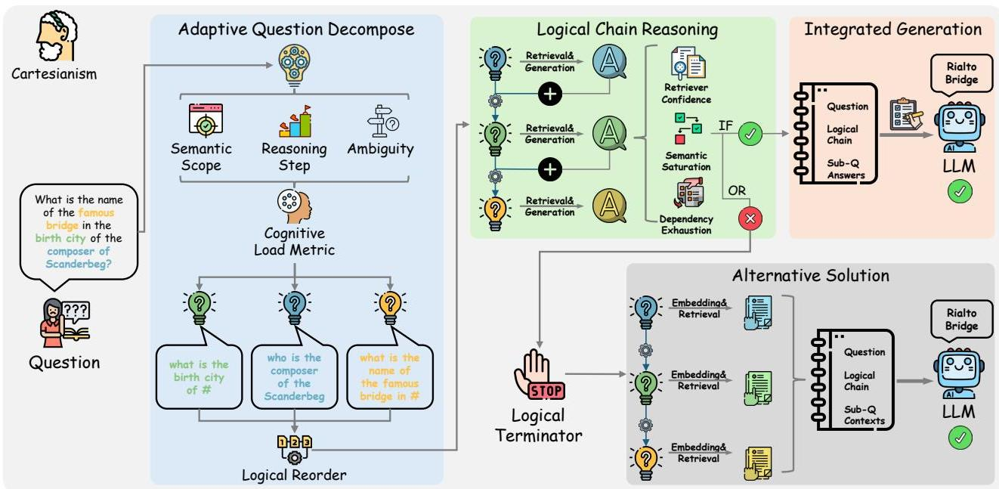

# LAG：從笛卡爾視角看邏輯增強生成

Yilin Xiao, Chuang Zhou, Qinggang Zhang, Su Dong, Shengyuan Chen, Xiao Huang

香港理工大學，香港特別行政區 {yilin.xiao, chuang- qqzj.zhou, su.dong} @connect.polyu.hk, {qinggang.zhang ,sheng- yuan.chen ,xiao.huang} @polyu.edu.hk

**摘要**

大型語言模型 (LLM) 在廣泛的任務中展現了卓越的能力，但在**知識密集型任務**中卻表現出嚴重的局限性，當面對需要專業知識的問題時，經常會產生**幻覺**。儘管**檢索增強生成 (RAG)** 通過整合外部知識來緩解這一問題，但由於其依賴直接的語義檢索和缺乏結構化的邏輯組織，因此在複雜的推理場景中表現不佳。本論文受《方法論》中**笛卡爾原理**的啟發，提出了一種新穎的範式 **邏輯增強生成 (LAG)**，該範式通過**系統性的問題分解和依賴感知的推理**來重新構建知識增強。具體而言，LAG 首先將複雜問題分解為按邏輯依賴關係排序的**原子子問題**。然後，它按順序解決這些子問題，利用先前的答案來引導後續子問題的**上下文檢索**，確保在邏輯鏈中逐步奠定基礎。為了防止**錯誤傳播**，LAG 整合了一個**邏輯終止機制**，該機制在遇到無法回答的子問題時停止推理，並減少在過度推理上浪費的計算。最後，它綜合所有子解決方案以生成經過驗證的響應。在四個基準數據集上的實驗證明，LAG 顯著增強了**推理的穩健性**，減少了**幻覺**，並使 LLM 的問題解決方式與**人類認知**對齊，為現有的 RAG 系統提供了一種原則性的替代方案。

---

## 導言

大型語言模型 (LLM)，如 Claude (Anthropic 2024)、ChatGPT (OpenAI 2023) 和 Deepseek 系列 (Liu et al. 2024)，在許多現實世界任務中展現了卓越的能力 (Chen et al. 2024b; Zhou et al. 2025)，例如**問答** (Allam and Haggag 2012)、**文本理解** (Wright and Cervetti 2017) 和**內容生成** (Kumar 2024)。儘管取得了成功，這些模型常因傾向於產生幻覺而受到批評，即在超出其知識和感知範圍的任務上生成不正確的陳述 (Ji et al. 2023; Zhang et al. 2024)。最近，**檢索增強生成 (RAG)** (Gao et al. 2023; Lewis et al. 2020) 已成為一種有希望的解決方案來緩解此類幻覺。通過動態利用來自**文本語料庫**的外部知識，RAG 使得 LLM 能夠在無需昂貴的再訓練下生成更準確、更可靠的響應 (Lewis et al. 2020; Devalal and Karthikeyan 2018)。

RAG 系統通常通過三個關鍵階段運行：**知識預處理**、**檢索**和**整合**。首先，將外部文本語料庫分段為易於管理的塊，並轉換為向量表示以進行高效索引。當收到查詢時，系統會使用**語義相似性匹配** (Sawarkar, Mangal, and Solanki 2024) 或**基於關鍵字的搜索** (Purwar and Sundar 2023) 來檢索相關的文本段落。最後，在整合階段，將檢索到的資訊與原始查詢結合，以產生知識增強的響應。最近 RAG 技術的進展已超越基本文本檢索，轉向更複雜的方法。這些方法包括：

- **基於圖的系統** (Zhang et al. 2025; Peng et al. 2024; Procko and Ochoa 2024; Shengyuan et al. 2023)：使用圖結構建模概念關係。
- **分層方法** (Chen et al. 2024a; Li et al. 2025b; Chen et al. 2025)：通過多級檢索保留文檔組織。
- **重新排序實施** (Glass et al. 2022; Xu, Shi, and Choi 2024)：利用初步檢索後再進行精煉評分。
- **自我 RAG 架構** (Asai et al. 2024)：能夠按需檢索和自我反思。
- **自適應框架** (Tang et al. 2025; Sarthi et al. 2024)：根據查詢複雜性動態調整檢索策略。

這些策略通過提高檢索準確性，顯著增強了樸素的 RAG 系統。

然而，儘管以檢索為中心的架構具有潛力，但現有的 RAG 系統在處理高複雜性問題時表現出**三個關鍵局限性**。

1.  **檢索失敗**：使用語義或關鍵字匹配的直接檢索通常無法捕捉複雜問題的**底層邏輯結構**，導致檢索到的上下文不相關或碎片化。例如，如圖 1 所示，檢索問題僅返回關於 Scanderbeg 的資訊，這不足以得出正確答案。
2.  **缺乏組織**：當檢索到相關知識時，RAG 缺乏根據**固有邏輯依賴關係**來組織資訊的機制，這限制了在實際場景中的**連貫推理**。回到圖 1 的問題，即使檢索到相關上下文，LLM 仍然常常表現不佳，因為它未能捕捉到問題中固有的邏輯依賴關係（Scanderbeg -> 作曲家 -> 出生城市 -> 著名橋樑）。
3.  **過程失控**：儘管一些方法 (Li et al. 2025a; Trivedi et al. 2023) 使用**思維鏈 (Chain-of-Thought)** (Wei et al. 2022) 來輔助檢索或推理，但整體過程仍然**不受控制**。這些方法主要依賴大型語言模型的語義能力，通常導致**不穩定的推理鏈**，其中初始錯誤可能會不可逆地傳播。

這些差距揭示了與人類認知過程的根本性不匹配，因為人類解決問題涉及**系統性分解**和**可控推理**，而不是**暴力檢索**。

---

*圖 1：三種範式的比較。LAG 與 GraphRAG 相比，具有更輕量級的特性，同時比 RAG 和 GraphRAG 實現了更高的準確性。*

---

為了彌合這一差距，我們引入了 **邏輯增強生成 (LAG)**，這是一種受《方法論》中**笛卡爾原理**啟發的新穎範式。LAG 引入了一種**推理優先**的管道，它將**系統性分解和可控推理**整合到檢索增強生成中。LAG 不會立即調用檢索器，而是首先仔細分析問題並將其分解為一組遵循**邏輯依賴結構**的**原子子問題**。然後，系統逐步回答這些子問題，從最基本的、不依賴於任何先驗資訊的子問題開始。隨著每個子問題得到解決，其答案將成為上下文的一部分，用於引導下一個更具依賴性的子問題的檢索和解決。最終答案只有在所有必要的子問題都得到解決後才會被綜合。如果在推理過程中出現不一致，將觸發**邏輯終結器**以啟動替代解決方案。總體而言，我們的主要貢獻如下：

- 我們確定了現有 RAG 系統在處理複雜問題時的局限性，並提出了 **LAG**，這是一種將**系統性分解和邏輯推理**整合到 RAG 系統中的**新推理優先管道**。
- LAG 首先將複雜問題分解為按邏輯依賴關係排序的**原子子問題**。然後，它按順序解決這些子問題，使用先前的答案來引導後續子問題的上下文檢索，確保在邏輯鏈中逐步奠定基礎。
- 為了防止**錯誤傳播**，LAG 整合了一個**邏輯終止機制**，該機制在遇到不合理情況時停止推理。
- 廣泛的實驗證明，LAG 顯著增強了**推理的穩健性**，減少了**幻覺**，並使 LLM 的問題解決方式與**結構化的人類認知**對齊，為傳統 RAG 系統提供了一種原則性的替代方案。

---

## 相關工作

RAG 已成為通過整合外部知識來增強 LLM 的關鍵框架。早期的方法，例如 REALM (Guu et al. 2020) 和 DPR (Karpukhin et al. 2020)，側重於將大型文本語料庫編碼為**密集嵌入**。近年來，**GraphRAG** 因其能夠構造碎片化知識而成為一個新方向。RAPTOR (Sarthi et al. 2024) 和 Microsoft 的 GraphRAG (Edge et al. 2025) 都使用**分層聚類**。RAPTOR 構建了帶有多級摘要的遞歸樹，而 GraphRAG 則應用**社群檢測**和 LLM 生成的概要，以支持從粗到細的檢索和高覆蓋率的響應。DALK (Li et al. 2024) 和 KGP (Wang et al. 2024) 引入了**動態 KG 構建**和**遍歷代理**，使用 LLM 來構建特定領域的圖和自我感知的檢索策略，以注入結構化上下文同時減少噪音。GFM-RAG (Luo et al. 2025)、G-Retriever (He et al. 2024) 和 LightRAG (Guo et al. 2025) 將**圖神經編碼器**與專門的檢索目標相結合：前者是一種經過兩階段訓練的**依賴於查詢的 GNN** 以實現多跳泛化，後者是一種**獎勵收集 Steiner 樹公式**以減少幻覺並提高可擴展性，最後一種是**雙層圖增強索引**以實現高效、可增量更新的查找，分別實現了對圖的準確、可擴展推理。HippoRAG (Gutierrez et al. 2024) 受海馬記憶過程啟發，利用**個性化 PageRank** 進行單步多跳檢索，在路徑跟蹤和路徑尋找 QA 任務上提供了最先進的效率和性能。HippoRAG2 (Gutierrez et al. 2025) 進一步優化了**知識圖譜精煉**和**更深層的段落整合**。有關相關工作的更多細節，請參見附錄 A。

### **預備知識**

**檢索增強生成 (RAG)** 通過整合從大型語料庫中檢索到的外部知識來增強語言模型。我們將輸入表示為一個自然語言問題 $q$，它可能涉及潛在的約束或多跳推理。系統可以訪問一個檢索語料庫 $\mathcal{C} = \{c_1, c_2, \ldots , c_N\}$，其中每個 $c_i$ 表示一個由非結構化文本組成的段落、文檔塊或知識條目。這些條目的粒度和來源可能不同（例如，維基百科、科學論文、網頁文檔），但被假定為可以獨立索引和檢索的。給定一個查詢 $q$ 或任何中間子問題 $q'$，檢索器 $\mathcal{R}$ 會返回一個相關段落的排名列表 $\mathcal{R}(q') \subset \mathcal{C}$ 以支持下游推理。每個檢索到的項目 $c \in \mathcal{C}$ 都被視為一個語義上獨立的資訊單元，系統在生成或驗證過程中將其用作外部證據。

---

## LAG 的框架

在《方法論》中，笛卡爾提出了四個科學解決問題的原則：

1.  **懷疑一切**：避免倉促和偏見。
2.  **分解問題**：將任何複雜問題分解為多個更簡單的子問題。
3.  **排序解決**：按從最簡單到最複雜的順序排列子問題並逐步解決它們。
4.  **回顧驗證**：一旦所有問題都解決了，回顧它們以確保沒有遺漏。

受此原則啟發，LAG 引入了一種與其直接對齊的新穎**推理優先範式**。

1.  為了**避免倉促**，LAG 不會對整個問題執行直接檢索。
2.  **自適應分解模塊**將複雜查詢分解為多個原子子問題。
3.  **邏輯重新排序模塊**根據它們的邏輯依賴關係排列這些子問題，**邏輯鏈推理模塊**相應地解決它們。
4.  最後，通過**邏輯組合所有子解決方案**來構建最終答案，然後針對原始問題進行驗證以確保完全覆蓋。

值得注意的是，此過程中還整合了一個**保險機制**：當推理過程被認為無效時，**邏輯終結器**會被啟動以啟動替代解決方案。

---

*圖 2：我們提出的 LAG 的整體框架。*

---

### **自適應問題分解**

我們的分解模塊利用**認知負荷**來動態地將複雜問題分解為可驗證的**原子子問題**。這種機制通過**遞歸的懷疑與驗證過程**來分解複雜查詢，例如問題「**Vilaiyaadu Mankatha 的唱片公司所屬的唯一比它大的團體總部所在的城市，那裡最著名的橋樑叫什麼名字？**」。傳統的檢索系統可能會直接搜索與 Vilaiyaadu Mankatha 相關的上下文，可能會混淆「橋在哪裡？」這個問題，而我們的方法首先生成經過驗證的子問題：
`["1. 誰是 Vilaiyaadu Mankatha 的作曲家？", "2. # 的出生城市是哪裡？", "3. # 的著名橋樑叫什麼名字？"]`。該過程將認知負荷估計與遞歸細化相結合：

- **認知負荷度量 $\mathrm{CL}(q)$**：整合了三個互補訊號來估計問題的複雜性。
    1.  **語義範圍**：計算問題嵌入 $\phi (q)$ 的方差，捕捉問題在語義上的廣度。
    2.  **推理步驟**：測量回答 $q$ 所需的組合推理深度。
    3.  **歧義**：通過基於啟發式熵的函數 $\mathcal{H}(q)$ 量化語義不確定性，該函數反映了指稱歧義（例如，不清楚的代詞）。
- $\sigma (\cdot)$ 表示歸一化函數。一旦 $\mathrm{CL}(q)$ 超過閾值 $\tau (t)$（隨時間衰減以鼓勵早期解決），我們的模塊會遞歸地將 $q$ 分解為更小的子問題，直到所有生成的 $q_i$ 都滿足 $\mathrm{CL}(q_i) \leq \tau (t)$。這種遞歸細化平衡了邏輯健全性和事實可驗證性，同時也旨在最大程度地減少不必要的對話回合。

### **邏輯鏈推理**

笛卡爾原則中的第三條規則教導我們從最簡單的部分開始，逐步解決更複雜的問題。這與人類自然推理的方式類似：我們首先確定我們確切知道的東西，然後轉向更具挑戰性的問題。同樣，我們的 LAG 系統將問題分解為更小的部分並解決它們。在最終確定推理順序之前，系統會分析所有分解後的問題，以識別它們的邏輯關係。這種**重新排序**會將基本事實問題作為基礎，然後是分析性或比較性問題。

接下來，我們按邏輯順序解決問題，並利用先前問題的邏輯資訊來引導後續問題的檢索。每一步都有**三種保障**來確保可靠性：
1. 系統對其響應有信心嗎？
2. 這個答案與之前的部分有意義嗎？
3. 它有足夠的好資訊嗎？

如果任何一個檢查失敗，系統就知道要停止而不是猜測。在實證評估中，這種**結構化的、自我驗證的策略**不僅輸出了更可解釋的推理軌跡，而且也加強了其結論的理由。

#### **邏輯引導的檢索**

在先前的子問題得到回答後，我們通過將其對應的答案和後續子問題整合到單個文本上下文中來更新檢索查詢。我們不會直接組合嵌入，而是將先前的答案 $a_{i}$ 和後續的子問題 $q_{i+1}$ **連接**成一個自然語言形式，例如 $A_{i}:a_{i},Q_{i + 1}:q_{i + 1}$，並對生成的文本進行編碼以獲得用於下一個檢索步驟的查詢向量。形式上，步驟 $i+1$ 的查詢嵌入計算如下：

![[the-query_embedding_at_step.png]]

其中，$\mathrm{concat}(q_i,q_i)$ 表示子問題和先前答案的文本連接，$\phi (\cdot)$ 是用於問題和段落的共享編碼器。然後，向量 $\mathbf{q}^{(i+1)}$ 用於查詢語料庫 $\mathcal{C}$，檢索一組段落 $\mathcal{R}(q^{(i+1)})$ 以支持子問題 $q_{i+1}$ 的解決。這種**上下文感知檢索**過程允許系統逐步將經過驗證的知識整合到後續步驟中，從而在邏輯鏈中實現更精確和上下文化的事實收集。

#### **邏輯終結器**

為了確保效率和穩健性，我們設計了一個**自動停止機制**，以防止在邏輯鏈推理過程中進行過度或不必要的推理。該組件在避免來自無法回答的子問題的**錯誤傳播**以及減少在低價值擴展上浪費的計算方面發揮著關鍵作用。通過監控**檢索置信度**、**邏輯依賴狀態**和**語義冗餘**，系統動態地確定何時停止進一步的推理，確保模型僅在能夠取得有益進展時才集中精力。

- **① 檢索器置信度下降**：我們監控連續子問題的檢索器輸出品質。具體來說，如果給定子問題的前 $k$ 個檢索到的段落都與查詢嵌入顯示出**低語義相似性**，系統會將此解釋為**外部支持不足**的訊號。設 $\sin (\mathbf{q}',c_i)$ 表示子問題 $q^{\prime}$ 和檢索到的段落之間的**餘弦相似性**，其中 $\delta$ 是一個預定義的相似性閾值 (0.3)，則 $q^{\prime}$ 的解決過程會提前終止，以避免不確定性的進一步傳播。

- **② 依賴耗盡**：在我們的邏輯鏈推理框架中，子問題是根據它們的邏輯依賴關係排列的。當查詢 $q^{\prime}$ 的所有先決子問題 $\mathrm{Deps}(q^{\prime}) = \{q_{1},q_{2},\ldots ,q_{m}\}$ 都已成功解決，但查詢仍然**缺乏足夠的支持或有效的答案**時，系統會認為推理鏈已耗盡。形式上，如果所有 $q_{i}\in \mathrm{Deps}(q^{\prime})$ 都已回答但 $q^{\prime}$ 無法解決，我們就會停止進一步的推理。

- **③ 語義飽和與步數限制**：為了防止過度的推理深度，我們引入了兩個額外的停止條件。首先，當新檢索的段落與累積的上下文顯示出**高冗餘**時，會檢測到語義飽和。設 $\mathcal{C}_{\mathrm{prev}}$ 表示先前檢索的內容，而 $c_{\mathrm{new}}$ 是一個候選段落。對於大多數 $c_{\mathrm{new}}$，其中 $\gamma$ 是冗餘閾值 (0.9)，系統會認為資訊空間已飽和。其次，為了保證可追溯性，我們定義了**最大推理步數 $T_{\mathrm{max}}$ (3)**。一旦解決的子問題數量達到 $T_{\mathrm{max}}$，推理過程就會終止。

### **整合生成**

如圖 2 所示，我們的框架通過**組合過程**整合所有經過驗證的子問題響應，從而合成最終答案。系統會為每個子查詢檢索相關的證據。基於已建立的推理鏈，我們首先生成一個**全面的草稿答案**，該答案整合了每個經過驗證的子解決方案，同時與原始查詢保持邏輯連貫性。該草稿必須正確解決所有子問題而不產生矛盾，同時完全涵蓋初始問題的範圍。當識別出不一致時，邏輯終結器將停止進一步的推理，僅保留可靠的邏輯鏈，然後進入替代解決方案，該方案將把子問題、可靠的邏輯鏈和檢索到的上下文提供給 LLM，以生成最終響應。對於未解決的子問題，資訊檢索將作為基礎，而不是依賴先驗知識。這種機制維持了類似人類解釋的自然流暢性，而不是簡單地將事實串聯起來。

---

## 實驗

### **實驗設置**

#### **數據集**

為了評估 LAG 的有效性，我們在三個標準的公共**多跳問答基準**上進行了實驗：
- HotpotQA (Yang et al. 2018)
- MuSiQue (Trivedi et al. 2022)
- 2WikiMultiHopQA (2Wiki) (Ho et al. 2020)

遵循 HippoRAG 的評估協議，我們使用相同的語料庫進行檢索，並從每個驗證集中抽取 1,000 個問題（與 HippoRAG 相同）作為我們的測試查詢。此設置確保了方法之間的公平比較。為了進一步評估 LAG 的推理能力，我們還在最近發布的 GraphRAG-Bench (Xiao et al. 2025) 上對其進行了評估，這證明了 LAG 不僅可以生成正確的答案，而且還能保持推理的合理性。在附錄 C 中，我們提供了有關效率和全面性的額外實驗結果。

#### **基準模型**

我們將我們的方法與一組不同的**成熟基準模型**進行了比較，分為三類：

1.  **僅 LLM**：使用大型語言模型直接回答問題，不進行任何外部檢索。
2.  **樸素檢索增強生成**：將語義檢索與思維鏈提示整合以引導 LLM 的生成。
3.  **最先進的 RAG 系統**：最近高性能的檢索增強生成方法，包括 HippoRAG 2 (Gutiérrez et al. 2025)、GFM-RAG (Luo et al. 2025)、HippoRAG (Gutiérrez et al. 2024)、LightRAG (Guo et al. 2025)、KGP (Wang et al. 2024)、G-Retriever (He et al. 2024) 和 RAPTOR (Sarthi et al. 2024)。

每個基準模型的詳細描述請參見附錄 B。

#### **評估指標**

對於多跳問答，精確的字串匹配可能過於嚴格，因為大小寫、語法、時態或釋義的變化可能會導致正確的響應被標記為錯誤。我們遵循現有的工作 (Wang et al. 2025)，採用兩種互補的指標：

1.  **包含匹配準確度 (Contain- Match Accuracy)**：測量預測答案是否包含黃金答案作為子字串。此指標可以容納輕微的表面形式差異，同時仍強制執行語義正確性。
2.  **GPT 評估準確度 (GPT- Evaluation Accuracy)**：一種基於 LLM 的評估，模型接收問題、黃金答案和預測，然後判斷預測在語義上是否等同於黃金答案。

這些指標共同提供了對表面層次保真度和更深層次語義正確性的平衡評估。對於具有挑戰性的推理任務，我們遵循基準 (Xiao et al. 2025) 的指標設置。

#### **實施細節**

我們提出的方法和所有基準模型都將 **GPT- 4o- mini** 作為默認 LLM。所有實驗均在 RTX 4090 D 上執行。對於所有方法的頂部 k 參數，我們設置 $k = 5$。

### **主要結果**

如表 1 所示，基礎 LLM 在直接解決這些複雜問題時表現出較弱的性能。當整合了簡單的語義檢索和 CoT 提示後，響應質量顯著提高。新型 RAG 方法的性能表現出可變性：

- KGP、RAPTOR 和 LightRAG 在某些場景中顯示出改進，但它們並**沒有始終優於樸素的 RAG**。
- 相比之下，HippoRAG、GFM-RAG 和 HippoRAG 2 在所有三個數據集上都**持續實現了顯著的性能提升**。

我們提出的 **LAG 方法**在**包含匹配準確度**和 **GPT 評估準確度**指標上**顯著優於所有基準方法**。具體來說，與默認 LLM (GPT4o-mini) 相比，LAG 在 HotpotQA 和 2Wiki 數據集上，包含匹配準確度和 GPT 評估準確度都**絕對提升了約 40 分**，在 Musique 數據集上也觀察到了**約 30 分的類似提升**。相對於現有的 RAG 基準，LAG 相對於大多數方法保持了顯著優勢；即使與表現強勁的 HippoRAG 2 和 GFM-RAG 相比，LAG 的優越性仍然很明顯，尤其是在處理具有挑戰性的 Musique 數據集時。總體而言，這些結果證實，LAG 不僅提升了不同領域的答案準確性，而且在其他 RAG 方法舉步維艱的地方確保了穩定的性能。這些顯著的改進凸顯了 LAG 在 RAG 中卓越的**邏輯能力**。

---

| 方法 | HotpotQA | | 2Wiki | | Musique | |
| :--- | :---: | :---: | :---: | :---: | :---: | :---: |
| | Contain-Acc. | GPT-Acc. | Contain-Acc. | GPT-Acc. | Contain-Acc. | GPT-Acc. |
| **直接零樣本 LLM 推理** | | | | | | |
| Llama3 (8B) (Meta 2024) | 23.7 | 20.1 | 33.8 | 15.4 | 6.4 | 6.0 |
| Llama3 (13B) (Meta 2024) | 17.7 | 11.1 | 22.3 | 4.7 | 2.3 | 2.0 |
| GPT-3.5-turbo (OpenAI 2024) | 31.5 | 35.4 | 31.0 | 29.9 | 7.9 | 10.9 |
| GPT-4o-mini (OpenAI 2024) | 30.4 | 34.2 | 29.0 | 28.6 | 7.8 | 10.1 |
| **樸素檢索增強生成** | | | | | | |
| Retrieval (Top-3) | 52.1 | 55.1 | 45.1 | 43.1 | 23.4 | 27.1 |
| Retrieval (Top-5) | 54.6 | 56.8 | 46.6 | 45.3 | 25.6 | 29.0 |
| Retrieval (Top-10) | 56.0 | 58.6 | 48.7 | 45.8 | 26.7 | 31.2 |
| CoT (Top-5) (Wei et al. 2022) | 55.1 | 57.1 | 48.7 | 45.9 | 27.1 | 30.7 |
| IRCoT (Top-5) (Trivedi et al. 2023) | 58.4 | 59.6 | 53.0 | 36.8 | 22.6 | 26.1 |
| **新型檢索增強生成方法** | | | | | | |
| KGP (Wang et al. 2024) | 56.2 | 57.1 | 52.2 | 33.9 | 30.5 | 27.3 |
| G-retriever (He et al. 2024) | 41.3 | 40.9 | 47.8 | 25.7 | 14.1 | 15.6 |
| RAPTOR (Sarthi et al. 2024) | 58.1 | 55.3 | 60.6 | 43.9 | 32.2 | 29.7 |
| LightRAG (Guo et al. 2025) | 61.5 | 60.5 | 54.4 | 38.0 | 27.7 | 28.3 |
| HippoRAG (single-step) (Gutiérrez et al. 2024) | 55.2 | 57.9 | 63.7 | 57.5 | 31.4 | 30.1 |
| HippoRAG (multi-step) (Gutiérrez et al. 2024) | 61.1 | 63.6 | 66.4 | 62.4 | 34.0 | 31.8 |
| GFM-RAG (single-step) (Luo et al. 2025) | 61.4 | 64.8 | 66.2 | 61.1 | 29.3 | 32.6 |
| GFM-RAG (multi-step) (Luo et al. 2025) | 63.4 | 65.5 | 69.5 | 63.2 | 31.5 | 35.5 |
| HippoRAG 2 (Gutiérrez et al. 2025) | 61.2 | 64.3 | 62.0 | 58.8 | 34.5 | 35.6 |
| **LAG(我們的方法)** | **68.3** | **69.4** | **71.3** | **64.0** | **42.8** | **43.5** |

*表 1：在三個基準數據集上，最先進的基準模型與 LAG 在包含匹配準確度和 GPT 評估準確度方面的性能比較。*

---

### **具挑戰性的推理任務**

我們的實驗證明，LAG 不僅在多跳問答中取得了高準確度，而且在**複雜推理挑戰**方面也表現出色。如表 2 所示，現有 RAG 方法的推理分數彼此相當，而 LAG 顯著擴大了這一差距。這種改進源於 LAG 將複雜問題**明確分解**為**邏輯排序的子問題**，然後沿著由此產生的推理鏈**逐步解決**。因此，LAG 生成的理由與標準科學解釋更為接近。此外，當使用 AR 指標進行評估時，LAG 再次優於所有基準模型，這表明它能夠平衡嚴格的邏輯推理和準確的答案生成。總體而言，這些結果證實 LAG 大幅增強了 RAG 系統的**推理能力**。

---

| 方法 | GraphRAG-Bench | |
| :--- | :---: | :---: |
| | R Score | AR Score |
| KGP (Wang et al. 2024) | 58.7 | 42.2 |
| G-retriever (He et al. 2024) | 60.2 | 43.7 |
| LightRAG (Guo et al. 2025) | 60.5 | 43.8 |
| GFM-RAG (Luo et al. 2025) | 60.4 | 44.3 |
| HippoRAG (Gutiérrez et al. 2024) | 60.9 | 44.6 |
| HippoRAG 2 (Gutiérrez et al. 2025) | 59.8 | 43.7 |
| RAPTOR (Sarthi et al. 2024) | 60.8 | 45.5 |
| **LAG(我們的方法)** | **65.2** | **46.4** |

*表 2：在 GraphRAG-Bench 上，最先進的基準模型與 LAG 的推理性能比較。R Score 用於評估生成的理由與黃金理由之間的一致性。AR Score 是根據 R Score 對生成的答案進行的評估。*

---

### **對邏輯重要性的驗證**

我們假設我們提出的 LAG 框架的有效性根本上源於**邏輯的保留**。為了證實這一點，我們首先援引**笛卡爾原理**，它為邏輯在推理系統中的作用奠定了理論基礎。然後我們進行了**實證驗證**：在樸素 RAG 的情況下，我們觀察到**維持邏輯順序**在複雜任務上能產生顯著更好的性能。為了隔離 LAG 中邏輯順序的貢獻，我們引入了兩種受控的擾動：

1.  我們**不將**先前依賴問題的嵌入與後續問題的嵌入連接。
2.  我們在檢索和生成之前**打亂**邏輯鏈的順序。

這兩種干預都導致了統計學上顯著的性能下降，從而證實了**邏輯對於 RAG 系統至關重要**。

---

| 方法 | Musique | |
| :--- | :---: | :---: |
| | Contain-Acc. | GPT-Acc. |
| Vanilla RAG (Random order) | 24.4 | 27.6 |
| Vanilla RAG (Logical order) | 27.0 | 31.8 |
| LAG (wo/former embedding) | 33.5 | 36.1 |
| LAG (Random order) | 35.1 | 36.4 |
| **LAG (logical order)** | **42.8** | **43.5** |

*表 3：對邏輯重要性的驗證。*

---

### **消融研究**

為了驗證我們提出的 LAG 中每個組件的有效性，我們進行了**消融研究**。結果如表 4 所示，主要觀察結果如下：

- **僅 LLM** 的基準模型在複雜 QA 任務中表現不佳。然而，加入**檢索模塊**後產生了顯著改進，證明了外部知識檢索的關鍵作用。
- 具體而言，添加**分解模塊**進一步提升了性能；我們將此歸因於其能夠將複雜問題分解為更簡單的子問題，從而促進更具針對性和有效的檢索。
- 此外，整合**重新排序模塊**通過增強子問題之間的邏輯連貫性、優化推理順序，帶來了額外的收益。
- 當引入核心的「**邏輯鏈推理**」模塊時，觀察到了更實質性的性能提升，尤其是在高難度場景中。這凸顯了結構化邏輯鏈在指導複雜 QA 過程中的不可或缺作用。
- 值得注意的是，加入**邏輯終結器模塊**達到了整體最佳性能。這種改進源於其能夠通過及時終止錯誤的推理路徑來**緩解基於鏈的推理中的錯誤傳播**，從而防止累積錯誤。

---

| LAG | HotpotQA | | 2Wiki | | Musique | |
| :--- | :---: | :---: | :---: | :---: | :---: | :---: |
| | Contain-Acc. | GPT-Acc. | Contain-Acc. | GPT-Acc. | Contain-Acc. | GPT-Acc. |
| GPT-4o-mini (Default LLM) | 30.4 | 34.2 | 29.0 | 28.6 | 7.8 | 10.1 |
| GPT-4o-mini + retrieval | 54.6 | 56.8 | 46.6 | 45.3 | 25.6 | 29.0 |
| w/ decompose | 60.0 | 59.9 | 57.5 | 46.9 | 30.0 | 30.8 |
| w/ decompose+ reorder | 62.3 | 61.1 | 59.4 | 48.6 | 33.8 | 32.1 |
| w/ decompose+ reorder+ chain reasoning | 65.8 | 64.8 | 66.9 | 60.2 | 36.6 | 38.9 |
| w/ decompose+ reorder+ chain reasoning+ terminator | **68.3** | **69.4** | **71.3** | **64.0** | **42.8** | **43.5** |

*表 4：在三個標準數據集上的消融研究。*

---

### **案例研究**

為了更直觀地展示 LAG 的優越性，我們在表 5 中提供了案例研究結果。對於現實世界的複雜問題，樸素 RAG 表現出關鍵的局限性：**僅基於原始問題的語義資訊進行檢索**，無法檢索到有用的知識。此外，LLM 可能難以完全理解問題本身，導致預測答案與黃金答案之間存在顯著差異。

---

| 問題 | 探險家到達 Vilaiyaadu Mankatha 唱片公司所屬的唯一比它大的團體總部所在的城市是在什麼時候？ |
| :--- | :--- |
| **黃金答案** | 1769 年 8 月 3 日 |
| **支持上下文** | ["Vilaiyaadu Mankatha", "Sony Music", "The Right Stuff Records", "Santa Monica"] |
| **樸素 RAG** | **直接檢索到的上下文**： 1) × "Francisco de Orellana"：Francisco de Orellana 是一位西班牙探險家... 2) × "Malta Summit"：會議在地中海舉行，靠近... 3) × "Vilaiyaadu Mankatha"：...並由 Sony Music Entertainment 進行營銷... 4) × "Military history of Indonesia"：發現了許多提及... 5) × "Menteng, Menteng"：Menteng 是 Menteng 的一個行政村... **預測**： × Guayaquil. |
| **LAG** | **邏輯鏈**： 子問題 1：Vilaiyaadu Mankatha 的唱片公司是什麼？→Sony Music 子問題 2：唯一比 #1 大的團體是哪家公司？→Universal Music Group 子問題 3：#2 的總部在哪裡？→Santa Monica 子問題 4：探險家到達 #3 是在什麼日期？→1769 年 8 月 3 日 **由邏輯鏈檢索到的上下文**： 1) × "Vilaiyaadu Mankatha"：...並由 Sony Music Entertainment 進行營銷... 2) × "Sony Music"：...第二大唱片公司，僅次於 Universal Music Group... 3) × "The Right Stuff Records"：...Universal Music Group 的一部分，總部位於 Santa Monica... 4) × "Santa Monica"：...他於 1769 年 8 月 3 日在接近當前交叉路口的地方紮營... **預測**： ✓ 1769 年 8 月 3 日。 |

*表 5：LAG 的案例研究。對於複雜問題，LAG 產生的解決方案與人類的科學推理更為一致。*

---

相比之下，LAG 通過**結構化推理過程**解決了這些挑戰：
1.  將複雜問題分解為**原子子問題**。
2.  根據**邏輯推理序列**重新排列這些子問題。
3.  按此邏輯順序對子問題進行推理，其中每個子問題的檢索和推理都利用先前已解決的、具有邏輯依賴關係的子問題的**答案資訊**。

這種方法不僅能夠有效檢索相關資訊，還能支持每一步的**合理推理**。此過程遵循與**笛卡爾原理**一致的科學推理範式。它涉及將複雜問題分解為可管理的組成部分，並根據先前的結果按順序推理，最終得出正確答案。

---

## 結論

現有的 RAG 系統在處理複雜問題時，在邏輯推理方面表現出局限性。受**笛卡爾原理**啟發，我們提出了 **LAG (邏輯增強生成)**，一種**推理優先的管道**。所提出的**自適應分解模塊**將複雜問題分解為具有邏輯依賴關係的原子問題。然後，這些原子子問題通過所提出的**邏輯鏈推理機制**按其邏輯依賴關係順序解決。值得注意的是，我們引入了一個**邏輯終結器機制**，該機制能夠在出現偏差時及時終止推理過程，防止邏輯鏈中的**錯誤傳播**，並減少在低價值擴展上浪費的計算。這個框架完美地契合了基於笛卡爾原理解決複雜問題的範式。全面的實驗驗證了所提出的 LAG 在多跳問答和具挑戰性的推理任務中均優於傳統 RAG 系統，為現有的 RAG 系統提供了一種原則性的替代方案。