# LEANN: A Low-Storage Vector Index

Yichuan Wang†,1, Shu Liu1, Zhifei Li1, Yongji Wu†,1, Ziming Mao1, Yilong Zhao1, Xiao Yan2, Zhiying Xu*,3, Yang Zhou1,4, Ion Stoica1, Sewon Min1, Matei Zaharia1, Joseph E. Gonzalez1 1UC Berkeley 2CUHK 3Amazon Web Services 4UC Davis

Abstract

Embedding- based search is widely used in applications such as recommendation and retrieval- augmented generation (RAG). Recently, there is a growing demand to support these capabilities over personal data stored locally on devices. However, maintaining the necessary data structure associated with the embedding- based search is often infeasible due to its high storage overhead. For example, indexing 100 GB of raw data requires 150 to  \(700\mathrm{GB}\)  of storage, making local deployment impractical. Reducing this overhead while maintaining search quality and latency becomes a critical challenge.

In this paper, we present LEANN, a storage- efficient approximate nearest neighbor (ANN) search index optimized for resource- constrained personal devices. LEANN combines a compact graph- based structure with an efficient on- the- fly recomputation strategy to enable fast and accurate retrieval with minimal storage overhead. Our evaluation shows that LEANN reduces index size to under  \(5\%\)  of the original raw data, achieving up to 50 times smaller storage than standard indexes, while maintaining  \(90\%\)  top- 3 recall in under 2 seconds on real- world question answering benchmarks.

## 1 Introduction

With the recent advances in AI [27, 37], embedding- based search now significantly outperforms traditional keywordbased search methods [30, 71] across many domains such as question answering, recommendation, and large- scale web applications such as search engines [14, 74]. These systems rely on dense vector representations to capture semantic similarity and use approximate nearest neighbor (ANN) search to retrieve relevant results efficiently. Recently, there has been growing interest in enabling such capabilities on edge devices like laptops or phones, enabling applications like personalized search, on- device assistants, and privacypreserving retrieval over local data [24, 32, 66, 69].

However, ANN data structures introduce substantial storage overheads, often 1.5 to  \(7x\)  the size of the original raw data [57]. While such overheads are acceptable in large- scale web application deployments, they pose a significant bottleneck when deploying ANN search on personal devices or when using large datasets. For example, a  \(2x\)  storage overhead on a personal laptop is impractical. To make ANN search viable in these settings, we seek to reduce storage overhead to under  \(5\%\)  of the original data size. At the same time, any such reduction must preserve high search accuracy while maintaining reasonable search latency to ensure responsive, real- time search experiences.

Existing solutions, however, fall short of this goal. Most ANN indices store full embeddings and index metadata on disk [65], requiring terabytes of storage to index hundreds of gigabytes of documents, far exceeding the capacity of edge devices. While compression techniques such as product quantization (PQ) [29] can reduce storage, they often come at the cost of degraded search accuracy or require increased search latency to achieve comparable results.

In this paper, we tackle the challenge of reducing ANN storage overhead and present LEANN, a novel graph- based vector index designed for storage- constrained environments. Built on top of Hierarchical Navigable Small World (HNSW) [38], a widely adopted, state- of- the- art graph- based ANN index, LEANN introduces system and algorithm optimizations that reduce total index storage to under  \(5\%\)  of the original data size, while preserving low query latency and high retrieval accuracy. At its core, LEANN is driven by two key insights.

The first insight is that in graph- based indexes like HNSW, a single query typically explores only a small subset of the embedding vectors to identify its nearest neighbors. As such, instead of storing these embeddings on disk, we can recompute them on the fly at search time. However, naive recomputation can still incur a high latency overhead. To address this challenge, LEANN introduces a two- level traversal algorithm that interleaves an approximate and an exact distance queue, while prioritizing the most promising candidates in the search process, thus reducing the number of recompu- . tations. Additionally, LEANN also incorporates a dynamic batching mechanism that aggregates embedding computations across search hops, improving GPU utilization and thus minimizing recomputation latency.

However, even without storing embeddings, the index metadata (e.g., graph structure) itself can lead to non- trivial storage overhead relative to the original data size. For example, a typical HNSW index uses a node degree of 64, meaning each node stores 64 neighbor links. With 4 bytes per link, this results in 256 bytes of metadata per node, which normally accounts for more than  \(25\%\)  storage overhead of a common 256- token document chunk [57].

The second insight is that much of the graph index metadata is redundant: not all nodes and edges contribute equally

to search accuracy. Based on this observation, LEANN introduces a high- degree preserving graph pruning strategy that removes low- utility edges while preserving high- degree "hub" nodes that are essential for maintaining effective search paths. By retaining only structurally important components of the graph, LEANN significantly reduces the size of the index without sacrificing the quality of the retrieval.

We implement LEANN on top of FAISS [17] and evaluate it on four popular information retrieval (IR) benchmarks: NQ [31], HotpotQA [65], TriviaQA [28], and GPQA [48]. These benchmarks have been widely used in evaluations of information retrieval systems. Our experiments span both an NVIDIA A10 workstation [43] and an M1- based Mac [3]. The results show that LEANN reduces storage consumption by more than  \(50\times\)  compared to state- of- the- art indexes while achieving competitive latency to achieve high accuracy. In summary, we make the following contributions:

We conduct the first study on enabling low- latency, high- accuracy search over personal data with minimal storage overhead on edge devices. We present LEANN, a compact graph- based ANN index that prunes redundant graph metadata by prioritizing preserving high degree nodes, and avoids storing embeddings by recomputing them on the fly. To minimize recomputation latency, LEANN also introduces a two- level search strategy with dynamic batching. We show that LEANN can deliver  \(90\%\)  top- 3 recall using less than  \(5\%\)  storage overhead relative to the raw data size, while the end- to- end search time is still less than 2 seconds on four benchmarks and various hardware platforms.

## 2 Background and Motivation

In this section, we provide background on approximate nearest neighbor (ANN) search indexes, with a focus on graph- based approaches, and outline the requirements for deploying vector indexes on consumer devices.

### 2.1 ANN Search

Vector search systems rely on high- dimensional embeddings to enable semantic search across unstructured data. A core operation in such systems is the top-  \(k\)  nearest neighbor search, where the goal is to find the  \(k\)  most similar vectors in a dataset to a given query vector. Formally, given a set of vectors  \(X = \{x_{1},x_{2},\ldots ,x_{n}\} \subset \mathbb{R}^{m}\)  and a query vector  \(q\in \mathbb{R}^{m}\) , a top-  \(k\)  nearest neighbor search aims to retrieve a set  \(S\subset X\)  of  \(k\)  vectors such that:

![[s_min_x_atops.png]]

where  \(\mathrm{Dist}(\cdot ,\cdot)\)  denotes a distance or similarity metric (e.g., Euclidean distance or cosine similarity).

While exact search guarantees retrieval of the true nearest neighbors, it becomes computationally prohibitive at scale. Approximate nearest neighbor (ANN) methods [33, 38] offer a trade- off by allowing minor inaccuracies in exchange for substantially lower query latency. The effectiveness of an ANN algorithm is typically measured by Recall@k, defined as:

![[s_min_x_atops.png]]

where  \(S\)  is the set of true top-  \(k\)  neighbors returned by exact search, and  \(S^{\prime}\)  is the set returned by the ANN method. This metric quantifies the fraction of relevant neighbors successfully retrieved. Applications such as retrieval- augmented generation (RAG) typically require high recall (e.g.,  \(\geq 0.9\) ) to preserve downstream task quality [58].

To accelerate ANN search, vector indexes organize embeddings using data structures that reduce the number of comparisons required. Generally, a vector index consists of two primary components: (1) the stored embedding vectors themselves, representing the data, and (2) the index structure (such as graph connections or cluster assignments) built upon these vectors to expedite the search. Both components contribute to the overall storage footprint. Two widely used classes of ANN indices are described below:

Cluster- based Index. Methods such as IVF [33] partition the dataset into clusters (or "cells") using algorithms like K- means [9], grouping semantically similar vectors together. At query time, only the most relevant clusters are searched, reducing the overall number of comparisons.

Graph- based Index. Methods such as HNSW [38] and other proximity- graph- based approaches [21, 26, 59] construct a graph by linking each vector to its nearest neighbors. These indices are among the most effective for ANN search, typically requiring fewer distance computations to reach a target recall compared to cluster- based alternatives like IVF. Despite differences in graph construction, most methods rely on a best- first search (BFS) strategy to process ANN queries. We describe this algorithm in §2.2.

### 2.2 Best-first Search (BFS) in Graph-based index

In Algorithm 1, we illustrate how BFS operates on a graph- based index. The search begins by placing the entry node  \(p\)  into a min- priority queue  \(C\) , referred to as the candidate queue, which prioritizes nodes closer to the query vector  \(x_{q}\) . In each iteration (lines 4- 9), the algorithm selects the closest node  \(c\)  from  \(C\)  and explores its neighbors. For each unvisited neighbor  \(n\) , we extract its embedding, compute its distance to the query  \(x_{q}\) , and insert  \(n\)  into the visited set  \(V\) , the candidate queue  \(C\) , and the result set  \(R\) .

The search terminates when the candidate queue  \(C\)  becomes empty or when the closest node in  \(C\)  is farther from the query than the farthest node in the result set  \(R\) , indicating that further exploration is unlikely to improve the result. The parameter  \(ef\)  controls how many candidates the algorithm considers during the search. It acts as a quality

![[algorithm1_.png]]

knob: increasing  \(ef\)  allows the algorithm to examine more candidates, improving recall at the expense of higher latency.

Graph- based indexes converge quickly to the nearest neighbors for two main reasons: (1) During index construction, each vector is connected to a set of approximate neighbors, typically selected to be semantically similar. If a vector is close to the query, its neighbors are also likely to be close, allowing the search to rapidly move toward high- quality results. (2) The graph implicitly yields a much finer- grained partitioning of the vector space compared to IVF, enabling the search to examine significantly fewer candidates from the entire database [22, 26, 35, 38]. An illustrative example of this traversal process is shown in Fig. 1.

### 2.3 Deploying vector index on Consumer Devices

Local Vector Index System Requirement. Consumer devices, such as smart home appliances and personal workstations [32, 55, 66, 70], are heavily constrained in storage capacity [45, 62, 67]. At the same time, many downstream generative AI tasks rely heavily on similarity search over dense embeddings. However, embeddings are often significantly larger than the original raw data, typically causing up to a  \(7\times\)  storage blowup [40, 57, 77]. Unlike datacenter servers, which can dedicate hundreds of gigabytes or even terabytes to store uncompressed vector indexes [7, 16], consumer devices typically share a limited storage capacity with many colocating applications and media content [63]. This tight storage constraint makes it infeasible to store large- scale, uncompressed indexes and embeddings.

At the same time, these devices often support user- facing tasks such as large- scale document retrieval [32, 66] or offline semantic recall [6], where second- level latency (i.e., under 10 seconds) is generally acceptable. Usability typically degrades only when response times exceed this threshold.

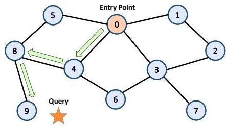  
Figure 1. Best-First Search in graph-based index

This combination of stringent storage constraints (e.g., using less than  \(5\%\)  of the original data size) and moderately relaxed latency requirements opens up a distinct design space for on- device vector search: a highly storage- efficient index that exploits on- device compute resources (e.g., GPU) to achieve high recall within seconds.

Existing System Limitations on Consumer Devices. Most vector search indexes, such as HNSW and IVF, are designed to optimize retrieval accuracy and latency under the assumption that the entire index, including full- precision embeddings, fits in DRAM. As a result, they are not suitable for DRAM- constrained environments such as consumer devices. Some recent methods [59, 64] reduce memory usage by storing compressed embeddings in DRAM for initial traversal. However, they still require accessing full- precision embeddings from disk for reranking, which incurs substantial storage overhead at query time.

Quantization- based methods, such as PQ [29], are the main approach for reducing storage by approximating embeddings using compact codebooks. While these techniques can shrink the embedding size dramatically, the inherent information loss from this lossy compression often degrades retrieval accuracy. This degradation means that critical vector distinctions can be permanently lost during quantization, making it impossible to achieve high target recall using only the compressed data, a limitation we experimentally demonstrate in §6 and which is documented in the literature [59]. As a result, they struggle to balance storage efficiency with the high accuracy needed for quality retrieval.

To our knowledge, there is no prior system for vector index that has explicitly targeted consumer devices where storage footprint is a first- class objective. Our goal in this work is to design a vector search system that significantly reduces storage overhead, both for embeddings and index structures, while meeting the latency and recall requirements.

## 3 Overview

In this section, we provide an overview of the core techniques and show how LEANN incorporates them into its architecture.

Graph- based Recomputation. In the HNSW structure that LEANN builds upon, each query requires embeddings for

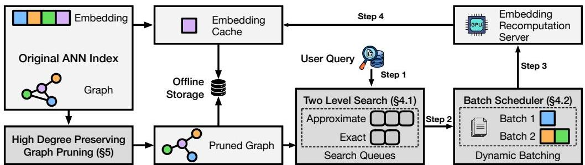  
Figure 2. LEANN System Diagram. The system combines high-degree preserving graph pruning for minimal storage footprint with graph-based recomputation and two-level search with dynamic batching for efficient query processing (Steps 1-4).

only a small subset of nodes, specifically those in the candidate set  \(C\)  defined in Algorithm 1. This observation motivates LEANN to compute these embeddings at query time rather than storing all of them beforehand. Concretely, instead of loading precomputed embeddings as in line 9, we modify the system to recompute them during query execution without changing any algorithm.

Main Techniques. This paradigm introduces two key challenges. First, naive on- demand recomputation of embeddings at query time can lead to high search latency. Second, although LEANN removes the need to store dense embeddings, the remaining graph metadata, particularly node connectivity information, can still account for a significant portion of total storage (for example, over 10 percent).

LEANN offers two main techniques to address the challenges mentioned before. First, LEANN uses a two- level graph traversal algorithm and a dynamic batching mechanism to reduce recomputation latency (§4). Second, LEANN deploys a high degree of preserving graph pruning technique to greatly reduce the storage needed for graph metadata (§5).

System Workflow. The end- to- end workflow incorporating the optimizations discussed above is shown in Fig. 2. Given a dataset of items, LEANN first computes the embeddings of all items to build a vector index for the dataset using an off- shelf graph- based index. While LEANN design is agnostic to any particular graph index, we focus on the commonly used HNSW. We discuss how LEANN can be applied to other graph indices in §8.1.

After the index is built, LEANN discards the embeddings (dense vectors) of the items, while pruning the graph for online storage with our high degree preserving graph pruning algorithm (§5). The pruning algorithm aims to preserve important high- degree nodes, as we observe that node access patterns are highly skewed in practice: a small subset of nodes, often "hub" nodes of high degree, are frequently visited, while many others contribute little to search quality. To serve a user query at runtime, LEANN applies a two- level search algorithm (described in §4.1) to traverse the pruned graph, identifying and prioritizing promising nodes for efficient exploration. These selected nodes are then sent to the embedding server (an on- device component utilizing the original embedding model for recomputation, as illustrated in Fig. 2) to obtain their corresponding embeddings. To further improve GPU utilization and reduce latency, LEANN employs a dynamic batching strategy to schedule embedding computation tasks on the GPU (§4.2).

Furthermore, when additional disk space is available, LEANN uses it to cache "hub" nodes by prioritizing the embeddings of high- degree nodes. At runtime, LEANN recomputes embeddings only for nodes not in the cache and loads cached embeddings directly from disk.

## 4 Efficient Graph-based Recomputation

In this section, we first present our methodology for minimizing the number of nodes involved in recomputation (§4.1), followed by an approach to fully leverage GPU resources during the recomputation process (§4.2).

### 4.1 Two-Level Search with Hybrid Distance

As shown in eq. (1), the overall latency of a single query in LEANN is largely determined by the number of nodes whose embeddings must be recomputed. To reduce this overhead, we introduce the Two- Level Search, a multi- fidelity distance computation framework that strategically varies computational intensity across different stages of the search. By using lightweight approximate computations to broadly evaluate candidates and applying exact computations only to the most promising ones, our approach reduces search latency while preserving search quality.

Algorithm 2 presents the complete algorithm. At each expansion step, we first compute approximate distances for all neighboring nodes using a lightweight method (line 12). We maintain an approximate queue  \((AQ)\) , a priority queue that stores approximate distances for all nodes encountered throughout the search. Rather than computing exact distances for all neighbors of the current expansion node  \(v\) , we define a re- ranking ratio  \(a\)  and extract the top  \(a\%\)  of nodes from  \(AQ\) . To avoid redundant computation, we exclude nodes that are already present in the exact queue  \((EQ)\) . The resulting subset is denoted as  \(M\)  (line 14), for which we then compute exact distances.

![[algorithm2_.png]]

Because  \(AQ\)  globally tracks all previously encountered nodes, the algorithm can revisit earlier neighbors that become more promising as the search progresses. As a result, even when all immediate neighbors in the current iteration are far from the query, the algorithm can still select previously seen but unexplored nodes that are now ranked higher.

At the end of each iteration, nodes in  \(M\)  with computed exact distances are inserted into  \(EQ\)  which serves as the candidate pool for subsequent expansions. We repeat this process iteratively, and in each iteration, the number of nodes requiring recomputation is further reduced.

The core insight of this design is to combine the complementary strengths of approximate and exact distance computations. Approximate distances, though not fully accurate, are often sufficient to surface the most relevant candidates near the top, enabling early pruning of unpromising directions. We exploit this by using approximate distances to evaluate neighbors during traversal, and exact distances to re- rank only the most promising candidates. This approach achieves high recall while substantially reducing computational cost, thereby lowering overall latency.

For efficient approximate distance calculation, we employ PQ, a widely used technique that compresses the embedding space by several orders of magnitude. In our setting, we use only 2GB of PQ- compressed embeddings to represent the original 200GB of full- precision data, resulting in minimal storage overhead. Although PQ introduces some accuracy loss, our framework compensates by applying exact computations to a small subset of high- ranking candidates, thereby preserving end- to- end search quality.

Finally, our method is flexible and generalizable. It can incorporate alternative lightweight approximation techniques beyond quantization. For instance, distillation- based embeddings or link- and- code representations [18] can be used, provided they offer sufficient efficiency. This adaptability makes the Two- Level Search paradigm applicable across diverse computational budgets and deployment scenarios.

### 4.2 Dynamic Batching to Fully Utilize GPU

During the search process, GPU resources are often underuti- . lized because each expansion step only triggers recomputation for a small number of nodes, typically equal to the degree of the current node  \(\mathcal{V}\)  . This problem is further exacerbated when using the Two Level Search algorithm (see line 16), where the candidate set is even more selective, resulting in smaller batch sizes. As a result, LEANN frequently fails to meet the minimum batch size required to saturate GPU throughput, leading to inefficient use of hardware resources at runtime.

This leads to a key challenge: how can we design an algorithm that fully utilizes GPU compute capacity and takes advantage of batch processing [15, 76] without sacrificing search efficiency?

To address this, LEANN introduces a dynamic batching strategy that slightly relaxes the strict data dependency in best- first search in Algorithm 1. While this introduces minor staleness in the expansion order, it significantly increases the batch size for the embedding model, thereby reducing the end- to- end latency per query.

Specifically, LEANN breaks the strict data dependency in best- first search, where the current node to be expanded depends on the immediate results of the previous expansion, by dynamically collecting a group of the closest candidates from the priority queue. The algorithm accumulates neighbors, that is, nodes requiring recomputation, until a target batch size is reached (for example, 64 for the A10 GPU), which can be efficiently determined through lightweight offline profiling. This dynamic batching mechanism integrates naturally with the Two- Level Search described in  \(\S 4.1\)  .We accumulate nodes in the set  \(M\)  across iterations until the predefined batch size threshold is reached, at which point we perform embedding recomputation for all nodes in  \(M\)

This idea shares a similar insight with the beam search strategy used in DiskANN [59], where a fixed number of round- trip node accesses are batched together to amortize disk access latency. However, unlike DiskANN's fixed beam width, LEANN uses dynamic batching based on the degrees of current candidates, reducing staleness and offering greater flexibility for our setting. Furthermore, while DiskANN aims to reduce I/O latency, our dynamic batching strategy focuses on maximizing GPU utilization. As a result, LEANN adopts a

![[algorithm3_.png]]

different optimization objective: rather than minimizing disk access, it prioritizes efficient GPU usage to reduce end- to- end latency.

## 5Storage-optimized Graph Structure

With the Two- Level Search and dynamic batching mechanisms in place to optimize recomputation latency, we now examine how LEANN reduces the storage costs associated with graph metadata through a high degree preserving graph pruning algorithm.

As discussed in  \(\S 3\)  while LEANN avoids storing exact embeddings by recomputing them at query time, the graph metadata used to guide the search process can still introduce substantial overhead. For example, in the datastore described by [56], the index structure alone accounts for over  \(30\%\)  of the total storage footprint.

In datacenter environments, this overhead is typically acceptable: storage is relatively inexpensive, and the operational costs of index maintenance (e.g., updates, rebuilds, and monitoring) are manageable. In contrast, consumer devices are often storage- constrained, making even the metadata footprint of the index structure a significant concern.

To address this, LEANN allows users to specify a disk usage constraint  \(C\)  .When the metadata size exceeds this threshold, LEANN invokes a graph pruning algorithm that reduces the number of edges while preserving high- degree nodes. This design maintains retrieval accuracy and avoids significant increases in query- time latency, while substantially reducing the metadata footprint.

The graph, stored in a compressed sparse row (CSR) format, for example, consumes space proportional to the total number of edges, i.e., the number of nodes times their average degree2. Since each node corresponds to a fixed chunk of text, the number of nodes is fixed given the text. The key challenge, then, is to reduce the average node degree without significantly compromising search latency. We formalize this optimization problem as follows: given a storage budget, construct a graph that maximizes search efficiency.

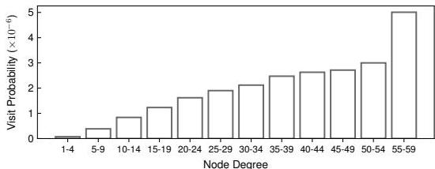  
Figure 3. Node access probability per query

![[figure3_.png]]

Here,  \(n\)  denotes the number of nodes in the graph, corresponding to the number of text or image chunks.  \(D_{i}\)  represents the degree of node  \(i\)  ,and ef is a parameter that controls the length of the search queue, as described in Algorithm 1. During Best- First Search, each time a node  \(i\)  is selected for expansion, all of its  \(D_{i}\)  neighbors must be recomputed3.

Throughput denotes the number of chunks the embedding server can process per second. Since LEANN's performance bottleneck lies in recomputation as shown in Fig. 11, this formulation serves as a reasonable approximation of the search time. Finally, Dtype indicates the size of the data type used to store node connections in the graph, which is typically int32 (4 bytes).

While indiscriminate edge reduction in graph- based indexes often degrades search quality, as shown in  \(\S 6.4\)  , our key insight is that selectively retaining hub nodes is sufficient to preserve performance. This strategy is motivated by the skewed node access pattern observed in Fig. 3, where highdegree nodes are accessed more frequently during search. Accordingly, we aim to preserve these high- degree nodes, which serve as the backbone of the graph's connectivity, even as we reduce the overall number of edges. To implement this idea, we introduce Algorithm 3. At a high level, our hubpreservation strategy incorporates two key modifications to the original graph construction process.

On the one hand, we apply differentiated degree thresholds to nodes based on their estimated importance. Specifically, we reduce the number of connections for most nodes to a lower threshold  \(m\)  (line 10), while allowing a small fraction (i.e.,  \(a\%\) ) of important nodes to retain a higher degree up to a threshold  \(M\)  (line 8). Given a storage budget  \(C\) , LEANN automatically tunes the values of  \(m\)  and  \(M\)  through offline profiling across multiple datasets. To identify important nodes, we follow prior work [42, 51] and use node degree as a proxy for influence, selecting the top  \(a\%\)  of nodes by degree (line 4). Empirically, we find that preserving only the top  \(2\%\)  of high- degree nodes significantly reduces the total number of edges while maintaining high retrieval accuracy.

On the other hand, while we restrict the number of outgoing connections during node insertion, as shown in line 10, we allow all nodes to establish bidirectional edges with newly inserted nodes, up to the maximum threshold  \(M\)  (as shown in line 13, not  \(m\) ). This design choice ensures that each node retains the opportunity to connect with high- degree hub nodes, thereby preserving the navigability of the graph with minimal impact on search quality.

Note that this algorithm does not require knowledge about the query distribution. Hence, it can scale efficiently to large datasets, providing a simple yet effective mechanism to balance graph size and search performance.

## 6 Evaluation

In our evaluation, we answer the following important questions:

1. How does LEANN perform compared to state-of-the-art baselines in terms of latency and storage, across different search accuracy (recall) levels? (§6.2)  
2. How does LEANN impact downstream task accuracy, particularly when compared to low-storage alternatives such as index compression techniques and keyword-based search? (§6.3)  
3. How does each individual technique of LEANN contribute to its overall efficiency and effectiveness? (§6.4)

6.1 Setup

Table 1. Summary of our dataset and index setup.  

<table><tr><td>Specification</td><td>Value</td></tr><tr><td>Dataset</td><td>rpj_wiki [10]</td></tr><tr><td>Raw text size</td><td>76G</td></tr><tr><td>Chunk size</td><td>256 token</td></tr><tr><td># of chunks</td><td>60 million</td></tr><tr><td>Embed model</td><td>Contriever [27]</td></tr><tr><td>Embed dimension</td><td>768</td></tr><tr><td>Embedding size</td><td>171G</td></tr><tr><td>Index type</td><td>FLAT</td></tr><tr><td>Distance metric</td><td>Inner Product</td></tr></table>

Workloads We construct a datastore for retrieval based on the RPJ- Wiki dataset [10], a widely used corpus containing 76 GB of raw Wikipedia text. The indexing configuration is summarized in Tab. 1. Following prior work [57], we segment the text into passages of 256 tokens and generate an embedding for each chunk using Contriever [27], an unsupervised contrastive learning based dense retriever. Each embedding has a dimensionality of 768.

Besides retrieval itself, we also consider the predominant downstream task of RAG. We adopt the widely deployed LLaMA model family for generation and report downstream task accuracy with the Llama- 3.2- 1B- Instruct model [19].

For evaluation, we adopt four standard benchmarks widely used in RAG and open- domain retrieval: NQ [31], TriviaQA [28], GPQA [48], and HotpotQA [68].

Testbed. We evaluate our system and baselines on two hardware platforms. The first is an NVIDIA A10 server hosted on an AWS g5.48xlarge instance [4], equipped with a 96- core CPU,  \(2 \times 3.8\)  TB AWS NVMe SSD, and an NVIDIA A10G GPU with 24 GB of memory. The second is a Mac environment, provided via an AWS EC2 M1 Mac instance [3], featuring an Apple M1 Ultra processor (Arm64), macOS, and utilizes a 512GB Amazon EBS volume for its main storage.

Metrics. We compare LEANN against alternative baselines in three main dimensions: storage, latency, and accuracy. For accuracy, we evaluate both the search (retrieval) accuracy and downstream task accuracy.

To evaluate retrieval accuracy, we report Recall@k as defined in §2. In open- domain settings, ground- truth labels for retrieved passages are typically unavailable. Following standard practice [29, 54, 75], we use the results from exact search as a proxy for ground truth. In our experiments, we set  \(k = 3\)  following prior work standard setup [1, 57], and report Recall@3. The exact search is implemented with faiss. IndexFlatIP over our datastore for each query set.

To evaluate downstream task (RAG) accuracy, we use the exact match (EM) and the F1 score as metrics. EM measures the proportion of predictions that match the ground- truth answers provided by the query dataset. The F1 score captures the harmonic mean of precision and recall, typically calculated at the token level. It assigns partial credit by considering the overlap in tokens between the predicted answer and the ground- truth answer, even if they are not an exact match.

For the retrieval latency evaluation, we measure the time required to reach different target recall levels. Specifically, we perform a binary search to identify the minimal search queue length  \(ef\)  (as defined in Algorithm 1) that meets the

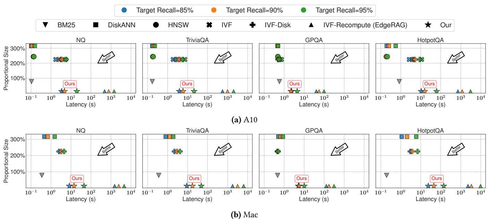  
Figure 4. [Main Result]: Latency-storage trade-offs in RAG applications across four datasets and two hardware configurations. The y-axis shows the storage overhead, defined as the size of the ANN index relative to the raw data size (as detailed in Tab. 1). We vary the target recall to evaluate latency under different retrieval accuracy levels. Since recall is not applicable to BM25, it appears as a single data point in each figure. Additionally, we omit the PQ-compressed method, as it fails to reach the target recall threshold despite being a vector-based approach. As shown in Fig. 5, both BM25 and PQ result in poor downstream accuracy.

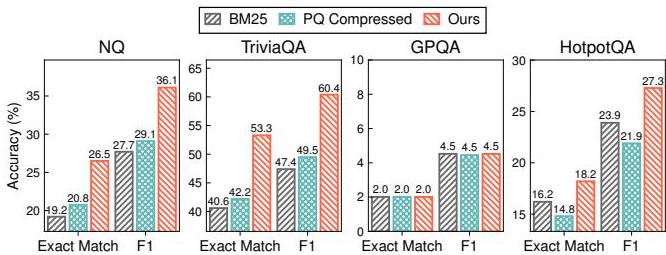  
Figure 5. [Main Result]: Comparison of Exact Match and F1 scores for downstream RAG tasks across three methods: keyword search (BM25), PQ-compressed vector search, and our proposed vector search system. Our method is configured to achieve a target recall of  \(90\%\)  while the PQ baseline is given extended search time to reach its highest possible recall. Here we use Llama-3.2-1B as the generation model.

target recall, and report the average latency of 20 queries using the resulting  \(ef\)  value.

Baselines We compare LEANN against the following baseline methods and systems:

- HNSW (in-memory) [38]: HNSW is a widely-used state-of-the-art vector index [2, 47]. We use the faiss. IndexHNSWFlat implementation with construction parameters recommended by Faiss:  \(M = 30\)  and efConstruction  \(= 128\) , distinct from the search-time parameter  \(ef\) .

- IVF (in-memory): The Inverted File (IVF) index is a widely used cluster-based vector index. We adopt the faiss. IndexIVFFlat implementation. Following best practices from Faiss [52] and prior work [25], we set the number of centroids to  \(\sqrt{N}\) , where  \(N\)  is the size of the datastore. In our setup, we use a  \(60M\)  datastore, which corresponds to  \(n_{\text{list}} = 8192\) .

- DiskANN [59]: DiskANN is a graph-based vector search system optimized for memory efficiency. It keeps only a PQ table in memory and loads full embeddings from disk on demand. We configure it with  \(M = 60\)  and efConstruction  \(= 128\) , following recommended settings [59].

- IVF-Disk: IVF-Disk reduces memory usage by employing memory-mapped files (mmap) instead of loading the entire index into memory. We implement it using Faiss's faiss.contrib.ondisk module and adopt the same configuration as in IVF (in-memory).

- IVF-based recomputation: We adopt the idea of IVF-based recomputation from Edge RAG [55], where we use online recomputation to avoid storing the full set of embeddings, while using the same construction parameters as IVF (in-memory).

- PQ Compression [29]: We apply PQ to compress embeddings to match our storage footprint while preserving the graph structure.

- BM25 [13, 49]: A classical lexical ranking algorithm widely used in keyword-based search.

### 6.2 Main Results - Storage and Latency

Fig. 4 presents the storage consumption and end- to- end RAG query latency across all baseline systems and LEANN. The results show that LEANN is the only system that reduces storage to less than  \(5\%\)  of the original raw text size while maintaining reasonable latency, which we discussed in  \(\S 2.3\)  such as achieving  \(90\%\)  recall on GPQA in under 2 seconds.

We report storage consumption as a proportion of the raw text size (76 GB), referred to as proportional size in Fig. 4. Since all methods operate on the same fixed datastore based on the RPJ- Wiki dataset, their storage consumption remains constant across hardware platforms and query datasets. The figure shows that HNSW stores all dense embeddings along with the graph structure, leading to substantial storage overhead. DiskANN incurs even higher overhead due to its sectoraligned design. Each node's data, including its embedding  \((768\times 4\)  bytes) and edge list (60 neighbors,  \(60\times 4\)  bytes), is padded to a 4 KB SSD sector, resulting in the largest storage footprint among all methods. IVF and IVF- Disk exhibit similar storage overheads, both dominated by the embedding file. The additional metadata required by IVF (e.g., centroids) is relatively small, typically amounting to only about  \(1 / \sqrt{N}\)  of the total embedding size, and thus contributes little overhead. For BM25, storage is determined by the vocabulary size and the associated posting lists (i.e., the frequency of each token). In our setting, the size of the BM25 index is comparable to that of the original corpus. LEANN stores only a compact graph structure, resulting in less than  \(5\%\)  additional storage. Among the baselines, IVF- based recomputation achieves the lowest storage footprint, as it only stores the IVF centroids on disk, which adds little overhead.

For latency evaluation, we measure per- query latency under different target recall levels across all combinations of query datasets and hardware platforms. For BM25, we report a single number for its latency value using the default keyword search configuration. Unlike embedding- based search methods, BM25 is a lexical search technique and does not operate over dense embeddings. As a result, recall is not applicable for evaluating its effectiveness because it is defined based on approximate nearest neighbor retrieval. We omit results for HNSW and IVF on the Mac platform, as both methods require loading the full dense embedding matrix into memory, which leads to out- of- memory (OOM) errors. Specifically, the Mac system has 128GB of RAM, while the index size exceeds 171GB, as shown in Tab. 1. We also exclude the PQ- compressed baseline, as it fails to achieve the target recall even with an arbitrarily long search time.

Fig. 4 shows that LEANN consistently outperforms EdgeRAG, an IVF- based recomputation method, achieving significantly lower latency, ranging from  \(21.17\times\)  to  \(200.60\times\)  across all the datasets and hardware platforms. This advantage is partly due to the asymptotic difference in recomputation complexity: the number of recomputed chunks in LEANN grows polylogarithmically with  \(N\)  while it grows as  \(\sqrt{N}\)  in Edge- RAG[65]. Graph- based baselines such as HNSW and DiskANN represent upper bounds on latency performance, as they store all embeddings in RAM or on disk. While LEANN trades some latency for substantial storage savings, its performance remains well within an acceptable range. This latency degradation is acceptable for two main reasons as we discussed in  \(\S 2.3\)  : (1) second- level latency is acceptable for large- scale local document or image retrieval tasks, and (2) many downstream tasks on local devices, such as image or text generation, typically take over tens of seconds to complete [11, 34], making the additional latency introduced by LEANN reasonable in practice. Comparing across hardware platforms, A10 achieves a  \(2.28\times\)  to  \(3.01\times\)  speedup over the Mac, which aligns with their theoretical TFLOPS specifications [12, 43].

### 6.3 Main Result - Accuracy for Downstream RAG Task

We evaluate downstream task accuracy across four query datasets, as shown in Fig. 5. For all methods, we retrieve the top- 3 most relevant documents. Our method is configured to achieve a target recall of  \(90\%\)  while BM25 operates with its default keyword matching configuration. Although the PQ- compressed method fails to meet the target recall defined in  \(\S 6.2\)  it still achieves approximately  \(20\%\)  recall across all datasets. We include its downstream performance using these lower- quality retrieved results.

As illustrated in Fig. 5, our method consistently achieves higher downstream accuracy across all datasets except GPQA. Our ANN method shows limited gains on GPQA due to a distributional mismatch: the RPJ- Wiki datastore is somewhat out- of- distribution for GPQA, which consists of graduatelevel questions that are poorly supported by the retrieved content from Wikipedia. The accuracy improvement on HotpotQA is also more modest compared to the first two datasets, as HotpotQA requires multi- hop reasoning, while our current setup performs only single- hop retrieval, limiting its effectiveness for this task.

Finally, we note that when a target recall level (e.g.,  \(90\%\)  is enforced, the downstream accuracy of our method aligns with that of other lossless ANN approaches, confirming that our system does not sacrifice accuracy for storage efficiency.

### 6.4 Ablation Study

We conduct comprehensive and detailed ablation studies to analyze the impacts of each methodology we use in LEANN.

Ablation study on latency optimization technique. To evaluate LEANN's latency optimization techniques, we incrementally enable the components introduced in  \(\S 4\)  , using a fixed target recall across multiple datasets. We begin with a naive graph- based recomputation baseline. Incorporating

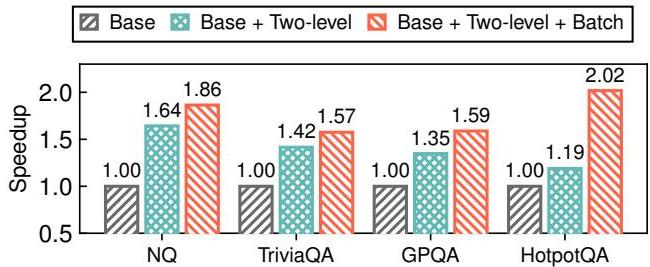  
Figure 6. [Ablation Study]: Speedup achieved by different optimization techniques described in §4 when evaluated on four datasets to reach the same recall level on the A10 GPU. Two-level refers to the optimization in §4.1, while Batch corresponds to §4.2.

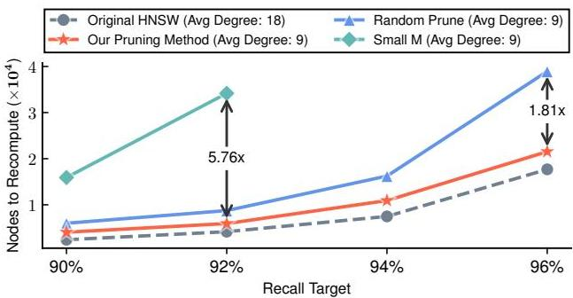  
Figure 7. [Ablation Study]: Comparison of pruned graph quality against two heuristic methods and the upper bound using the datastore in Tab. 1. We vary the target recall and measure the number of nodes each method needs to recompute. The dashed gray line represents the original HNSW graph, which serves as the upper bound, with twice the storage (i.e., average degree) of the others.

the two- level hybrid distance computation strategy from §4.1 yields an average speedup of  \(1.40\times\) , reaching up to  \(1.64\times\)  by reducing the number of nodes requiring recomputation and enabling lightweight distance estimation without querying the embedding server. Adding the dynamic batching technique further improves GPU utilization during recomputation, increasing the overall speedup to  \(1.76\times\) , with a maximum of  \(2.02\times\) . Among all datasets, HotpotQA benefits the most from batching, as its longer search queue required to achieve the target recall allows more effective grouping of multi hop requests.

Comparison with Alternative Graph Pruning Methods. We compare our graph pruning algorithm with two heuristic baselines and evaluate graph quality by measuring the number of embeddings that must be fetched to achieve a given recall target, as shown in Fig. 7. In LEANN, the end- to- end latency scales linearly with the number of embeddings that require recomputation, making this metric a strong proxy for retrieval latency.

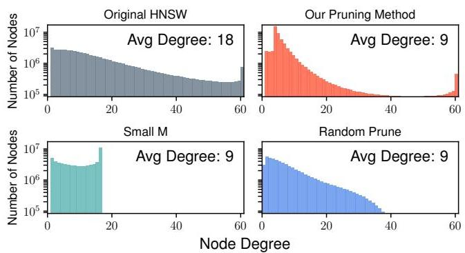  
Figure 8. [Ablation Study]: Comparison of (out-)degree distributions between the original graph, our pruning method, and two heuristic baselines. Similar to Fig. 7, the gray curve represents the original HNSW graph, which has twice the size of the others. Only our pruning method successfully preserves the high degree nodes.

The two heuristic baselines are as follows: (1) Random Prune, which randomly removes  \(50\%\)  of the existing edges from the original graph; and (2) Small M, which directly constrains the maximum out- degree during graph construction, resulting in an average degree that is half that of the original graph.

The original graph, constructed on the datastore described in Tab. 1, has an average degree of 18. All three pruning methods, ours and the two baselines, are applied to reduce the total number of edges by half, thereby halving the graph's storage overhead.

We evaluate the performance of different graph structures on the NQ dataset by varying the search queue length  \(ef\) , aiming to determine the minimum number of embeddings that must be fetched to achieve various recall targets. As shown in Fig. 7, our pruning method introduced in §5 achieves performance comparable to the original unpruned graph, despite using only half the edges. It outperforms the Random Prune baseline by up to  \(1.18\times\)  and the Small M baseline by up to  \(5.76\times\) . We omit the Small M data points at  \(94\%\)  and  \(96\%\)  recall targets due to their poor performance.

Degree Distribution in Pruned Graphs. To better understand the effectiveness of our pruning strategy, we analyze the out- degree distributions of the original graph, our approach, Random Prune, and Small M. As discussed in §5, our design explicitly aims to preserve high- degree "hub" nodes. As shown in Fig. 8, it successfully retains a substantial number of such nodes, whereas the other two baselines fail to do so. This underscores the critical role of hub nodes in supporting efficient graph- based vector search, a finding that aligns with insights from prior work [39, 42, 51].

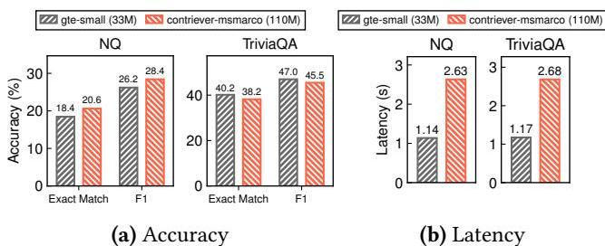  
Figure 9. [Ablation Study]: Latency on the A10 GPU and accuracy of a smaller embedding model evaluated on a 2M-chunk datastore, using a fixed search queue length of  \(e \in 50\) . The smaller embedding model significantly reduces latency without causing a substantial drop in downstream accuracy.

Using different embedding model sizes. Since the primary bottleneck of our system lies in the recomputation process, as shown in Fig. 11 later, we further explore the potential for latency reduction by adopting a smaller embedding model. Specifically, we replace the original contriever model (110M parameters) used in §6.2 with the lightweight GTE- small model [36], which has only 34M parameters. We evaluate performance on a smaller 2M document datastore using a fixed search queue length of  \(e \in 50\) , as shown in Fig. 9. The results show that GTE- small achieves a  \(2.3 \times\)  speedup while maintaining downstream task accuracy within  \(2\%\)  of the Contriever baseline. This demonstrates the potential of LEANN to further reduce search latency by leveraging a lightweight embedding model.

Relaxing disk constraint. As discussed in §3, when disk storage constraints are relaxed, LEANN can materialize the embeddings of high- degree nodes to reduce recomputation overhead. This effectively builds an on- disk embedding cache, reducing the number of nodes that need to be recomputed at query time. For instance, storing just  \(10\%\)  of the original embeddings yields a  \(1.47 \times\)  speedup, with a cache hit rate of up to  \(41.9\%\) . This high cache hit rate arises from the skewed access pattern characteristic of graph- based traversal. However, the observed speedup does not fully align with the hit rate due to the non- negligible loading overhead introduced by SSDs with limited bandwidth.

Graph- based recomputation breakdown. Fig. 11 breaks down the time cost of a single batch in graph- based recomputation into three stages, categorized by the primary system resource used. Each batch aggregates multiple hops of recomputation, as described in §4.2. First, LEANN performs PQ lookups to select promising nodes, then retrieves and tokenizes the corresponding raw text. The tokenized inputs are sent to the embedding server. Finally, LEANN performs embedding recomputation and distance calculation.

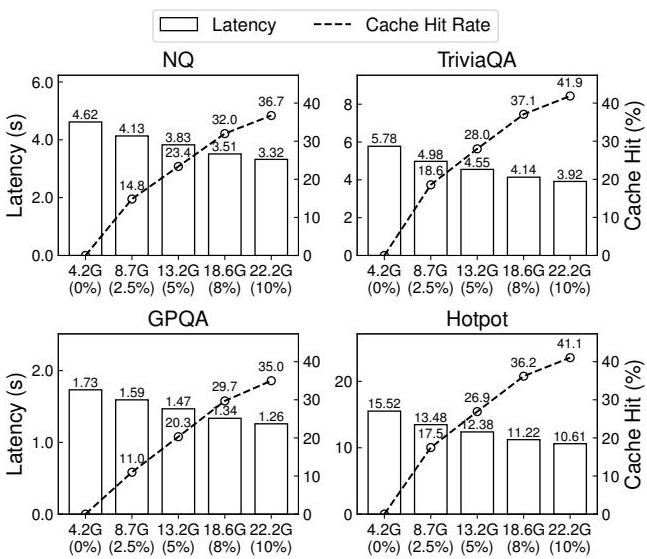  
Figure 10. [Ablation Study]: Latency and cache hit rate comparison under varying storage constraints across four datasets. The x-axis indicates total storage size (graph size + cached embeddings on disk) and the corresponding percentage of cached embeddings.

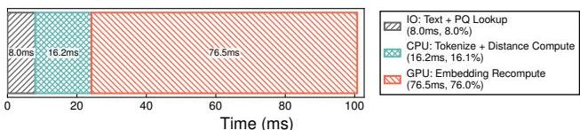  
Figure 11. [Ablation Study]: Latency breakdown of a batch of requests in graph-based recomputation.

Although embedding recomputation is the primary bottleneck in LEANN, accounting for  \(76\%\)  of total latency, the three stages—spanning I/O, CPU, and GPU resources—can potentially be overlapped to improve overall efficiency. We leave this optimization for future work.

## 7 Related Work

General Vector Search. Vector search primarily follows two paradigms: IVF [33] and proximity graphs [38]. IVF clusters vectors and probes relevant subsets during search, while graph- based methods such as HNSW [38], NSG [21], Vamana [59], and others [8, 20, 41] connect similar vectors to enable efficient traversal. Graph- based approaches are widely regarded as state of the art due to their favorable trade- offs between accuracy and efficiency [65]. Prior work has explored reducing graph size through learned neighbor selection [5, 73], but these methods are often impractical due to the high training cost and the need for labeled data.

Resource- Constrained Vector Search. Numerous efforts have aimed to reduce the memory footprint of vector search. Disk- based approaches such as DiskANN [59] store both vectors and graph structures on disk, leveraging in- memory compressed embeddings for navigation. Stalling [64] improves I/O efficiency for disk- resident graphs, while FusionANNS [61] enables cost- effective search through coordinated use of SSD, CPU, and GPU resources. AiSAQ [60], LM- DiskANN [46] further minimizes DRAM usage by storing compressed embeddings directly on disk. EdgeRAG [55] alleviates memory pressure by generating embeddings online using an IVF- based index. However, it still incurs substantial storage overhead due to the need to maintain large clusters on disk as dictated by its design, and its performance degrades at scale owing to the high recomputation cost introduced by an inefficient index structure. An alternative approach is embedding compression, such as PQ [29], or more recent methods like RabbitQ [23], which offers quantization with theoretical error bounds. Yet, these methods struggle to maintain high search accuracy under tight storage budgets. In contrast, LEANN integrates on- the- fly embedding recomputation with a graph- based index, incorporating high- degree preserving graph pruning and a specialized traversal algorithm optimized for edge devices.

Vector Search Applications on Edge Devices. On- device vector search enables privacy- preserving, low- latency, and offline capabilities across diverse applications. On- device RAG systems ground language models in personal document collections while maintaining data privacy [32, 53, 66, 72]. Personalized recommendation systems [69] match user profiles with item embeddings directly on the device, while content- based search over large collections of locally stored images and videos employs efficient vision embedding models [50] to generate vector representations for fast retrieval. These applications motivate the design of LEANN to enable efficient, low- overhead vector search on edge devices.

## 8 Discussion and Future Work

This section examines the general applicability of our graph- based recomputation approach, outlines current limitations, and highlights potential directions for future work.

### 8.1 Generality of Graph-based recompute

The core techniques of LEANN, including on- the- fly recomputation from on- disk data, graph pruning, and a recomputation friendly search algorithm, are broadly applicable across a range of graph- based approximate nearest neighbor frameworks. While we use HNSW as a concrete implementation example, these techniques are compatible with many other graph structures discussed earlier. Furthermore, LEANN's methodology can be naturally adapted to alternative algorithmic and system designs. For instance, in a DiskANN- style architecture, one can keep PQ- compressed embeddings in memory, store the graph structure on disk, and traverse the graph using PQ results. Instead of loading exact embeddings from disk, embeddings are recomputed on demand, and final reranking is performed using the recomputed values.

### 8.2 Limitation

LEANN requires computing embeddings for all passages in advance in order to build the graph, after which the embeddings can be discarded. In other words, while LEANN incurs low storage overhead during search, the peak storage usage during index construction can be high. There are multiple potential solutions to tackle storage- efficient index building. One approach is to pre- cluster the data, then embed and construct the graph structure independently within each cluster. This process is performed sequentially, and for each cluster, the embeddings are discarded after the graph is built. During the search, results from all clusters are simply aggregated to form the final result.

### 8.3 Future Work

For edge deployments, the latency overhead of LEANN is expected to decrease as consumer- grade GPUs continue to advance. For example, the RTX 5090 is projected to deliver over three times the FP16 Tensor throughput (419 TFLOPS [44]) compared to the NVIDIA A10 (125 TFLOPS [43]). In parallel, ongoing progress in compact and efficient embedding models is expected to reduce the cost of the forward pass, further accelerating LEANN and broadening its applicability across diverse hardware platforms. Building on our core algorithm, we envision future optimizations that further reduce latency and improve responsiveness.

Beyond edge devices, our solution has broader applicability. In datacenter environments, where high- dimensional vectors are used to represent each object (e.g., text or image) for semantic search and other downstream tasks, storage quickly becomes a significant burden. Efficiently managing these representations is therefore essential. LEANN introduces fine- grained, on- demand embedding computation, offering a promising strategy for reducing storage overhead. We hope that LEANN will inspire further research into addressing storage challenges in large- scale ANN systems, particularly as the adoption of advanced embedding models continues to accelerate in datacenter settings.

## 9 Conclusion

Similarity search over high- dimensional embeddings underpins many generative AI applications such as retrieval- augmented generation (RAG). However, enabling such capabilities on personal devices remains challenging due to the substantial storage required for storing embeddings and rich vector index metadata. In this paper, we present LEANN, a

storage- efficient neural retrieval system that leverages graph- based recomputation. By combining a two- level search algorithm with batch execution, LEANN achieves efficient query processing without storing the full embedding set. Furthermore, we introduce a high degree preserving pruning strategy to reduce graph storage overhead while maintaining accuracy. Together, these techniques enable LEANN to operate with less than  \(5\%\)  of the original data size – achieving a  \(50\times\)  storage reduction compared to existing methods – while maintaining fast and accurate retrieval.

## References

[1] Akari Asai, Zeqiu Wu, Yizhong Wang, Avirup Sil, and Hannaneh Hajishirzi. 2023. Self- rag: Learning to retrieve, generate, and critique through self- reflection. In The Twelfth International Conference on Learning Representations. [2] Martin Aumuller, Erik Bernhardsson, and Alexander Faithfull. 2020. ANN- Benchmarks: A benchmarking tool for approximate nearest neighbor algorithms. Information Systems 87 (2020), 101374. [3] AWS. 2025. Amazon EC2 G5 instance. https://aws.amazon.com/ec2/instance- types/mac/. [Online; accessed April- 2025]. [4] AWS. 2025. Amazon EC2 G5 instance. https://aws.amazon.com/ec2/instance- types/g5. [Online; accessed April- 2025]. [5] Dmitry Baranchuk and Artem Babenko. 2019. Towards similarity graphs constructed by deep reinforcement learning. arXiv preprint arXiv:1911.12122 (2019). [6] Dongqi Cai, Shangguang Wang, Chen Peng, et al. 2024. Recall: Empowering Multimodal Embedding for Edge Devices. arXiv:2409.15342. [7] Pablo Castro. 2024. Announcing cost- effective RAG at scale with Azure AI Search. https://techcommunity.micrc.eu/tem/blog/azure- ai- services- blog/announcing- cost- effective- rag- at- scale- with- azure- ai- search/4104961. [8] Qi Chen, Bing Zhao, Haidong Wang, Mingqin Li, Chuanjie Liu, Zengzhong Li, Mao Yang, and Jingdong Wang. 2021. SPANN: Highly- efficient Billion- scale Approximate Nearest Neighbor Search. In 35th Conference on Neural Information Processing Systems (NeurIPS 2021). [9] Davin Choo, Christoph Crunau, Julian Portmann, and Vaclav Rozhon. 2020. k- means++: few more steps yield constant approximation. In International Conference on Machine Learning. PMLR, 1909- 1917. [10] Together Computer. 2023. RedPajama: An Open Source Recipe to Reproduce LLaMA Training Dataset. https://github.com/togethercomputer/RedPajama- Data. Accessed: May 10, 2025. [11] KVCACHE. AI Contributors. 2025. KTransformers: A Flexible Framework for Experiencing Cutting- edge LLM Inference Optimizations. https://github.com/kvcache- /ktransformers. Accessed: 2025- 05- 14. [12] CPU- Monkey. n.d.. Apple M1 Ultra 64- Core GPU. https://www.cpumonkey.com/en/igpu- apple_m1_ultra_64_core. Accessed: 2025- 05- 10. [13] Nick Craswell, Bhaskar Mitra, Emine Yilmaz, Daniel Campos, and Jimmy Lin. 2021. Ms marco: Benchmarking ranking models in the large- data regime. In proceedings of the 44th International ACM SIGIR conference on research and development in information retrieval. 1566- 1576. [14] Nick Craswell, Bhaskar Mitra, Emine Yilmaz, Daniel Campos, and Ellen M Voorhees. 2020. Overview of the TREC 2019 deep learning track. arXiv preprint arXiv:2003.07820 (2020). [15] Weihao Cui, Han Zhao, Quan Chen, Hao Wei, Zirui Li, Deze Zeng, Chao Li, and Minyi Guo. 2022. {DvABatch}: Diversity- aware {Multi- Entry} {Multi- Exit} batching for efficient processing of {DNN} services on {GPUs}. In 2022 USENIX Annual Technical Conference (USENIX ATC 22). 183- 198. [16] Matthijs Douze. 2020. Indexing 1T Vectors. https://github.com/faceb ookresearch/faiss/wiki/Indexing- 1T- vectors.

[17] Matthijs Douze, Alexandr Guzhva, Chengqi Deng, Jeff Johnson, Gergely Szilvasy, Pierre- Emmanuel Mazaré, Maria Lomeli, Lucas Hosseini, and Hervé Jégou. 2025. The Faiss library. arXiv:2401.08281 [cs.LG] https://arxiv.org/abs/2401.08281 [18] Matthijs Douze, Alexandre Sablayrolles, and Hervé Jégou. 2018. Link and code: Fast indexing with graphs and compact regression codes. In Proceedings of the IEEE conference on computer vision and pattern recognition. 3646- 3654. [19] Abhimanyu Dubey, Abhinav Jauhri, Abhimav Pandey, Abhishek Kadian, Ahmad Al- Dahle, Aiesha Letman, Akhil Mathur, Alan Schelten, Amy Yang, Angela Fan, et al. 2024. The llama 3 herd of models. arXiv preprint arXiv:2407.21783 (2024). [20] Cong Fu, Changxu Wang, and Deng Cai. 2021. High Dimensional Similarity Search with Satellite System Graph: Efficiency, Scalability, and Unindexed Query Compatibility. arXiv:1907.06146 [cs.IR] https://arxiv.org/abs/1907.06146 [21] Cong Fu, Chao Xiang, Changxu Wang, and Deng Cai. 2019. Fast approximate nearest neighbor search with the navigating spreading- out graph. Proc. VLDB Endow. 12, 5 (Jan. 2019), 461- 474. https://doi.org/10.14778/3303753.3303754 [22] Jianyang Gao and Cheng Long. 2023. High- Dimensional Approximate Nearest Neighbor Search: with Reliable and Efficient Distance Comparison Operations. Proc. ACM Manag. Data 1, 2, Article 137 (June 2023), 27 pages. https://doi.org/10.1145/3589282 [23] Jianyang Gao and Cheng Long. 2024. RabbitQ: Quantizing High- Dimensional Vectors with a Theoretical Error Bound for Approximate Nearest Neighbor Search. In Proceedings of the ACM on Management of Data (SIGMOD '24), Vol. 2. Article 167. [24] Yanzhang He, Tara N. Sainath, Rohit Prabhavalkar, Ian McGraw, Raziel Alvarez, Ding Zhao, et al. 2019. Streaming End- to- End Speech Recognition for Mobile Devices. In Proc. IEEE ICASSP. 6381- 6385. [25] Alexandra Henzinger, Emma Dauterman, Henry Corrigan- Gibbs, and Nickolai Zeldovich. 2023. Private Web Search with Tiptoe. Cryptology ePrint Archive, Paper 2023/1438. https://doi.org/10.1145/3600006.3613134 [26] Piotr Indyk and Rajeev Motwani. 1998. Approximate nearest neighbors: towards removing the curse of dimensionality. In Proceedings of the Thirtieth Annual ACM Symposium on Theory of Computing (Dallas, Texas, USA) (STOC '98). Association for Computing Machinery, New York, NY, USA, 604- 613. https://doi.org/10.1145/276698.276876 [27] Gautier Izacard, Mathilde Caron, Lucas Hosseini, Sebastian Riedel, Piotr Bojanowski, Armand Joulin, and Edouard Grave. 2021. Unsupervised dense information retrieval with contrastive learning. arXiv preprint arXiv:2112.09118 (2021). [28] Mandar Joshi, Eunsol Choi, Daniel S Weld, and Luke Zettlemoyer. 2017. Triviaqa: A large scale distantly supervised challenge dataset for reading comprehension. arXiv preprint arXiv:1705.03551 (2017). [29] Herve Jégou, Matthijs Douze, and Cordelia Schmid. 2011. Product Quantization for Nearest Neighbor Search. IEEE Transactions on Pattern Analysis and Machine Intelligence 33, 1 (2011), 117- 128. https://doi.org/10.1109/TPAMI.2010.57 [30] Vladimir Karpukhin, Barlas Oguz, Sewon Min, Patrick SH Lewis, Ledell Wu, Sergey Edunov, Danqi Chen, and Wen- tau Yih. 2020. Dense Passage Retrieval for Open- Domain Question Answering.. In EMNLP (1). 6769- 6781. [31] Tom Kwiatkowski, Jennimaria Palomaki, Olivia Redfield, Michael Collins, Ankur Parikh, Chris Alberti, Danielle Epstein, Illia Polosukhin, Jacob Devlin, Kenton Lee, Kristina Toutanova, Llion Jones, Matthew Kelcey, Ming- Wei Chang, Andrew M. Dai, Jakob Uszkoreit, Quoc Le, and Slav Petrov. 2019. Natural Questions: A Benchmark for Question Answering Research. Transactions of the Association for Computational Linguistics 7 (2019), 452- 466. https://doi.org/10.1162/tacl_a_00276 [32] Chanhee Lee, Deeksha Prahlad, Dongha Kim, and Hokeun Kim. 2024. Work- in- Progress: On- device Retrieval Augmented Generation with

Knowledge Graphs for Personalized Large Language Models. In 2024 International Conference on Embedded Software (EMSOFT). 1- 1. https://doi.org/10.1109/EMSOFT6024.2024.00006[33] Victor Lempitsky. 2012. The inverted multi- index. In Proceedings of the 2012 IEEE Conference on Computer Vision and Pattern Recognition (CVPR) (CVPR '12). IEEE Computer Society, USA, 3069- 3076. [34] Muyang Li, Yujun Lin, Zhekai Zhang, Tianle Cai, Xiuyu Li, Junxian Guo, Enze Xie, Chenlin Meng, Jun- Yan Zhu, and Song Han. 2024. Svdqunat: Absorbing outliers by low- rank components for 4- bit diffusion models. arXiv preprint arXiv:2411.05007 (2024).[35] Wen Li, Ying Zhang, Yifang Sun, Wei Wang, Mingjie Li, Wenjie Zhang, and Xuemin Lin. 2019. Approximate nearest neighbor search on high dimensional data—experiments, analyses, and improvement. IEEE Transactions on Knowledge and Data Engineering 32, 8 (2019), 1475- 1488. [36] Zehan Li, Xin Zhang, Yanzhao Zhang, Dingkun Long, Pengjun Xie, and Meishan Zhang. 2023. Towards general text embeddings with multistage contrastive learning. arXiv preprint arXiv:2308.03281 (2023).[37] Jimmy Lin, Rodrigo Nogueira, and Andrew Yates. 2022. Pretrained transformers for text ranking: Bert and beyond. Springer Nature.[38] Yu A Malkov and Dmitry A Yashunin. 2018. Efficient and robust approximate nearest neighbor search using hierarchical navigable small world graphs. IEEE transactions on pattern analysis and machine intelligence 42, 4 (2018), 824- 836. [39] Magdalen Dobson Manohar, Zheqi Shen, Guy Blelloch, Laxman Dhulpala, Yan Gu, Harsha Vardhan Simhadri, and Yihan Sun. 2024. Parlayann: Scalable and deterministic parallel graph- based approximate nearest neighbor search algorithms. In Proceedings of the 29th ACM SIGPLAN Annual Symposium on Principles and Practice of Parallel Programming. 270- 285. [40] Microsoft Learn. 2025. Vector index size and staying under limits. https://learn.microsoft.com/en- us/azure/search/vector- search- index- size?utm_source=chatgpt.com&tabs=partial- vector- quota[41] Javier Vargas Munoz, Marcos A Goncalves, Zanoni Dias, and Ricardo da S Torres. 2019. Hierarchical clustering- based graphs for large scale approximate nearest neighbor search. Pattern Recognition 96 (2019), 106970. [42] Blaise Munyampirwa, Vihan Lakshman, and Benjamin Coleman. 2024. Down with the Hierarchy: The H in HNSW Stands for Hubs. arXiv preprint arXiv:2412.01940 (2024).[43] NVIDIA. n.d.. NVIDIA A10 Tensor Core GPU. https://www.nvidia.com/en- us/data- center/products/a10- gpu/. Accessed: 2025- 05- 10. [44] NVIDIA Corporation. 2024. NVIDIA RTX Blackwell GPU Architecture. https://images.nvidia.com/aem- dam/Solutions/geforce/blackwell/nvidia- rtx- blackwell- gpu- architecture.pdf. Whitepaper.[45] ObjectBox Ltd. 2024. Edge AI: The era of on- device AI. https://objectbox.io/on- device- vector- databases- and- edge- ai/. Accessed May 2025. [46] Yu Pan, Jianxin Sun, and Hongfeng Yu. 2023. LM- DiskANN: Low Memory Footprint in Disk- Native Dynamic Graph- Based ANN Indexing. In 2023 IEEE International Conference on Big Data (BigData). 5987- 5996. https://doi.org/10.1109/BigData59044.2023.10386517[47] Pinecone. n.d.. Vector Search: Hierarchical Navigable Small Worlds. https://www.pinecone.io/learn/series/faiss/hnsw/. Accessed: 2025- 05- 10. [48] David Rein, Betty Li Hou, Asa Cooper Stickland, Jackson Petty, Richard Yuanzhe Pang, Julien Dirani, Julian Michael, and Samuel R Bowman. 2024. Gpqa: A graduate- level google- proof q&a benchmark. In First Conference on Language Modeling.[49] Navid Rekabsaz, Oleg Lesota, Markus Schedl, Jon Brassey, and Carsten Eickhoff. 2021. TripClick: the log files of a large health web search engine. In Proceedings of the 44th International ACM SIGIR Conference on Research and Development in Information Retrieval. 2507- 2513.

[50] Jian Ren, Sergey Tulyakov, Kuan- Chuan Peng, Zhangyang Wang, and Humphrey Shi. 2023. Efficient Neural Networks: From Algorithm Design to Practical Mobile Deployments. CVPR 2023 Tutorial. https://snap- research.github.io/efficient- nn- tutorial/.[51] Jie Ren, Minjia Zhang, and Dong Li. 2020. HM- ANN: efficient billion- point nearest neighbor search on heterogeneous memory. In Proceedings of the 34th International Conference on Neural Information Processing Systems (Vancouver, BC, Canada). (NIPS '20). Curran Associates Inc., Red Hook, NY, USA, Article 895, 13 pages.[52] Facebook AI Research. n.d.. Guidelines to Choose an Index. https://github.com/facebookresearch/faiss/wiki/Guidelines- to- choose- an- index/28074dc0ddc733ff84b06fa4d99b3f6e2ef5613d#if- below- 1mvectors- ivx. Accessed: 2025- 05- 10. [53] Michael J. Ryan, Danmei Xu, Chris Nijvera, and Daniel Campos. 2024. EnronQA: Towards Personalized RAG over Private Documents. arXiv preprint arXiv:2505.00263 (2024).[54] Christoph Schuhmann, Richard Vencu, Romain Beaumont, Robert Kaczmarczyk, Clayton Mullis, Aarush Katta, Theo Coombes, Jenia Jitsev, and Aran Komatsuzaki. 2021. Lain- 400m: Open dataset of clip- filtered 400 million image- text pairs. arXiv preprint arXiv:2111.02114 (2021).[55] Korakit Seemakhupt, Sihang Liu, and Samira Khan. 2024. EdgeRAG: Online- Indexed RAG for Edge Devices. arXiv preprint arXiv:2412.21023 (2024).[56] Daniel Severo, Giuseppe Ottaviano, Matthew Muckley, Karen Ullrich, and Matthijs Douze. 2025. Lossless Compression of Vector IDs for Approximate Nearest Neighbor Search. arXiv preprint arXiv:2501.10479 (2025).[57] Rulin Shao, Jacqueline He, Akari Asai, Weijia Shi, Tim Dettmers, Sewon Min, Luke Zettlemoyer, and Pang WeiW Koh. 2024. Scaling retrieval- based language models with a trillion- token datastore. Advances in Neural Information Processing Systems 37 (2024), 91260- 91299. [58] Michael Shen, Muhammad Umar, Kiwan Maeng, G. Edward Suh, and Udit Gupta. 2024. Towards Understanding Systems Trade- offs in Retrieval- Augmented Generation Model Inference. arXiv:2412.11854 [cs.AR] https://arxiv.org/abs/2412.11854[59] Suhas Jayaram Subramanya, Devvrit, Rohan Kadekodi, Ravishankar Krishaswamy, and Harsha Vardhan Simhadri. 2019. DiskANN: fast accurate billion- point nearest neighbor search on a single node. Curran Associates Inc., Red Hook, NY, USA.[60] Kento Tatsumo, Daisuke Miyashita, Taiga Ikeda, Kiyoshi Ishiyama, Kazunari Sumiyoshi, and Jun Deguchi. 2024. AiSAQ: All- in- Storage ANNS with Product Quantization for DRAM- free Information Retrieval. arXiv preprint arXiv:2404.06004 (2024). arXiv:2404.06004 https://arxiv.org/abs/2404.06004[61] Bing Tian, Haikun Liu, Yuhang Tang, Shihai Xiao, Zhuohui Duan, Xiaofei Liao, Hai Jin, Xuecang Zhang, Junhua Zhu, and Yu Zhang. 2025. Towards High- throughput and Low Latency Billion- scale Vector Search via CPU/GPU Collaborative Filtering and Re- ranking. In 23rd USENIX Conference on File and Storage Technologies (FAST 25). USENIX Association, Santa Clara, CA, 171- 185. https://www.usenix.org/conference/fast25/presentation/tian- bing[62] Vincent Totino. 2025. Phone Storage: How Much Do You Really Need? https://www.optimum.com/articles/mobile/choosing- phone- storage- amount- needs- guide[63] Vincent Totino. 2025. Phone Storage: How Much Do You Really Need? https://www.optimum.com/articles/mobile/choosing- phone- storage- amount- needs- guide Accessed May 15, 2025. [64] Mengzhao Wang, Weizhi Xu, Xiaomeng Yi, Songlin Wu, Zhangyang Peng, Xiangyu Ke, Yunjun Gao, Xiaoliang Xu, Rentong Guo, and Charles Xie. 2024. Starling: An I/O- Efficient Disk- Resident Graph Index Framework for High- Dimensional Vector Similarity Search on Data Segment. In Proceedings of the ACM on Management of Data (SIGMOD '24), Vol. 2. Article V2mod014. https://doi.org/10.1145/3639269.3652200

[65] Peng Wang, Chen Wang, Xiaofang Lin, Wenjie Zhang, and Qing He. 2021. A Comprehensive Survey and Experimental Comparison of Graph- Based Approximate Nearest Neighbor Search. Proc. VLDB Endow. 14, 11 (2021), 1964–1978. https://doi.org/10.14778/3476249.3476258[66] Zijie J Wang and Duen Horng Chau. 2024. MeMemo: On- device Retrieval Augmentation for Private and Personalized Text Generation. In Proceedings of the 47th International ACM SIGIR Conference on Research and Development in Information Retrieval. 2765–2770. [67] Zhenliang Xue, Yixin Song, et al. 2024. PowerInfer- 2: Fast Large Language Model Inference on a Smartphone. arXiv preprint arXiv:2406.06282 (2024).[68] Zhilin Yang, Peng Qi, Suzheng Zhang, Yoshua Bengio, William W Cohen, Ruslan Salakhutdinov, and Christopher D Manning. 2018. HotpotQA: A dataset for diverse, explainable multi- hop question answering. arXiv preprint arXiv:1809.09600 (2018).[69] Hongzhi Yin, Tong Chen, Liang Qu, and Bin Cui. 2024. On- Device Recommender Systems: A Comprehensive Survey. arXiv preprint arXiv:2401.11441 (2024).[70] Weiping Yu, Ningyi Liao, Siqiang Luo, and Junfeng Liu. 2025. RAGDoll: Efficient Offloading- based Online RAG System on a Single GPU. arXiv preprint arXiv:2504.15302 (2025).

[71] Hamed Zamani, Johanne R Trippas, Jeff Dalton, Filip Radlinski, et al. 2023. Conversational information seeking. Foundations and Trends in Information Retrieval 17, 3- 4 (2023), 244–456. [72] Saber Zerhoudi and Michael Granitzer. 2024. PersonaRAG: Enhancing Retrieval- Augmented Generation Systems with User- Centric Agents. arXiv preprint arXiv:2407.09394 (2024).[73] Minjia Zhang, Wenhan Wang, and Yuxiong He. 2020. Learning to Anneal and Prune Proximity Graphs for Similarity Search. In International Conference on Learning Representations (ICLR). Available at https://openreview.net/forum?id=HJlXC3EtwB.[74] Yanhao Zhang, Pan Pan, Yun Zheng, Kang Zhao, Yingya Zhang, Xiaofeng Ren, and Rong Jin. 2018. Visual search at alibaba. In Proceedings of the 24th ACM SIGKDD international conference on knowledge discovery & data mining. 993–1001. [75] Jinhao Zhu, Liana Patel, Matei Zaharia, and Raluca Ada Popa. 2024. Compass: Encrypted Semantic Search with High Accuracy. Cryptology ePrint Archive, Paper 2024/1255. https://eprint.iacr.org/2024/1255[76] Kan Zhu, Yilong Zhao, Liangyu Zhao, Gefei Zuo, Yile Gu, Dedong Xie, Yufei Gao, Qinyu Xu, Tian Tang, Zihao Ye, et al. 2024. Nanoflow: Towards optimal large language model serving throughput. arXiv preprint arXiv:2408.12757 (2024).[77] Zilliz AI FAQ. 2025. How much memory overhead is typically introduced by indexes like HNSW or IVF? Accessed May 2025.