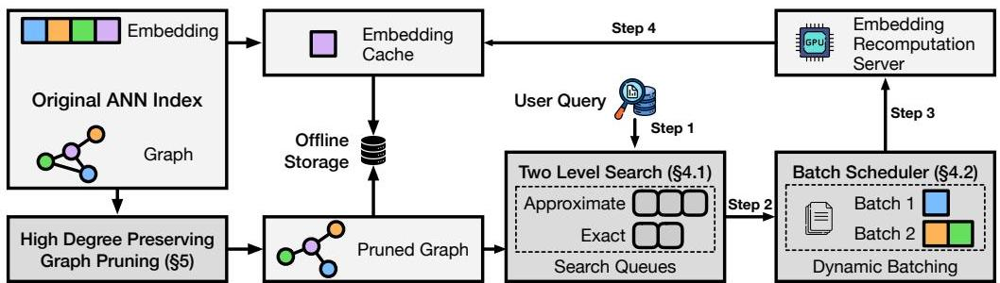
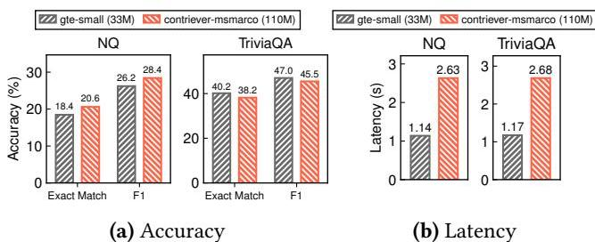

# LEANN：低儲存向量索引

Yichuan Wang†,1, Shu Liu1, Zhifei Li1, Yongji Wu†,1, Ziming Mao1, Yilong Zhao1, Xiao Yan2, Zhiying Xu*,3, Yang Zhou1,4, Ion Stoica1, Sewon Min1, Matei Zaharia1, Joseph E. Gonzalez1 1加州大學柏克萊分校 (UC Berkeley) 2香港中文大學 (CUHK) 3亞馬遜網路服務 (Amazon Web Services) 4加州大學戴維斯分校 (UC Davis)

## 摘要

基於嵌入的搜尋被廣泛應用於推薦和檢索增強生成（RAG）等應用程式。最近，越來越多的需求是支援在本地裝置上儲存的個人資料上進行這些功能。然而，維護與基於嵌入搜尋相關的必要資料結構通常是不可行的，因為其儲存開銷很高。例如，索引 100 GB 的原始資料需要 150 到 700 GB 的儲存空間，這使得本地部署變得不切實際。在保持搜尋品質和延遲的同時減少這種開銷，成為一個關鍵的挑戰。

在本文中，我們提出了 LEANN，一種針對資源受限的個人裝置優化的儲存高效近似最近鄰（ANN）搜尋索引。LEANN 將緊湊的基於圖的結構與高效的即時重新計算策略相結合，以實現最小儲存開銷下的快速準確檢索。我們的評估顯示，LEANN 將索引大小減少到原始資料的 5% 以下，比標準索引的儲存空間小 50 倍，同時在真實世界的問答基準測試中，能在 2 秒內保持 90% 的前 3 召回率。

## 1 簡介

隨著人工智慧的最新進展 [27, 37]，基於嵌入的搜尋在許多領域顯著優於傳統的基於關鍵字的搜尋方法 [30, 71]，例如問答、推薦和大規模網路應用程式（如搜尋引擎）[14, 74]。這些系統依賴於密集向量表示來捕捉語義相似性，並使用近似最近鄰（ANN）搜尋來高效地檢索相關結果。最近，人們對在筆記型電腦或手機等邊緣裝置上啟用此類功能越來越感興趣，這使得個人化搜尋、裝置內助理和本地資料的隱私保護檢索等應用成為可能 [24, 32, 66, 69]。

然而，ANN 資料結構會引入大量的儲存開銷，通常是原始資料大小的 1.5 到 7 倍 [57]。雖然在大型網路應用程式部署中可以接受這種開銷，但在個人裝置上部署 ANN 搜尋或使用大型資料集時，它們會構成一個嚴重的瓶頸。例如，在個人筆記型電腦上，2 倍的儲存開銷是不切實際的。為了使 ANN 搜尋在這些設定下可行，我們尋求將儲存開銷減少到原始資料大小的 5% 以下。同時，任何此類減少都必須保持高搜尋準確性，並維持合理的搜尋延遲，以確保反應迅速的即時搜尋體驗。

然而，現有的解決方案未能達到這個目標。大多數 ANN 索引在磁碟上儲存完整的嵌入和索引中繼資料 [65]，索引數百 GB 的文件需要 TB 級的儲存空間，遠遠超過邊緣裝置的容量。儘管像乘積量化（PQ）[29] 這樣的壓縮技術可以減少儲存空間，但它們往往以犧牲搜尋準確性為代價，或者需要增加搜尋延遲才能達到可比較的結果。

在本文中，我們解決了減少 ANN 儲存開銷的挑戰，並提出了 LEANN，這是一種為儲存受限環境設計的新型基於圖的向量索引。LEANN 建立在分層可導航小世界（HNSW）[38] 之上，這是一種廣泛採用、最先進的基於圖的 ANN 索引，它引入了系統和演算法優化，將總索引儲存空間減少到原始資料大小的 5% 以下，同時保持低查詢延遲和高檢索準確性。LEANN 的核心是由兩個關鍵洞察驅動。

第一個洞察是，在像 HNSW 這樣的基於圖的索引中，單個查詢通常只探索一小部分嵌入向量來識別其最近鄰居。因此，我們可以不在磁碟上儲存這些嵌入，而是在搜尋時即時重新計算它們。然而，天真的重新計算仍然可能導致高延遲開銷。為了解決這個挑戰，LEANN 引入了一種雙層遍歷演算法，它交錯使用近似和精確距離佇列，同時在搜尋過程中優先考慮最有前景的候選者，從而減少了重新計算的次數。此外，LEANN 還結合了動態批次處理機制，將跨搜尋跳躍的嵌入計算聚合起來，提高了 GPU 利用率，從而最大程度地減少了重新計算延遲。

然而，即使不儲存嵌入，索引中繼資料（例如，圖結構）本身也可能相對於原始資料大小產生不可忽視的儲存開銷。例如，一個典型的 HNSW 索引使用節點度數為 64，這意味著每個節點儲存 64 個鄰居連結。每個連結 4 位元組，這導致每個節點有 256 位元組的中繼資料，這通常佔一個常見 256-token 文件塊的 25% 以上的儲存開銷 [57]。

第二個洞察是，大部分圖索引中繼資料是冗餘的：並非所有節點和邊都對搜尋準確性有同等的貢獻。基於這個觀察，LEANN 引入了一種**高度數保留**的圖修剪策略，該策略移除低效用的邊，同時保留對於維持有效搜尋路徑至關重要的**高度數「樞紐」節點**。透過僅保留圖中結構上重要的部分，LEANN 顯著減小了索引的大小，而不會犧牲檢索的品質。

我們在 FAISS [17] 之上實現了 LEANN，並在四個流行的資訊檢索（IR）基準測試上對其進行了評估：NQ [31]、HotpotQA [65]、TriviaQA [28] 和 GPQA [48]。這些基準測試已被廣泛用於評估資訊檢索系統。我們的實驗涵蓋了 NVIDIA A10 工作站 [43] 和基於 M1 的 Mac [3]。結果顯示，LEANN 相比最先進的索引減少了超過 50 倍的儲存消耗，同時實現了具有競爭力的延遲以達到高準確性。總結來說，我們做出了以下貢獻：

- 我們首次研究了如何在邊緣裝置上以最小儲存開銷實現個人資料的低延遲、高準確性搜尋。
- 我們提出了 LEANN，一個緊湊的基於圖的 ANN 索引，它透過優先保留高度數節點來修剪冗餘的圖中繼資料，並透過即時重新計算來避免儲存嵌入。
- 為了最小化重新計算延遲，LEANN 還引入了具有動態批次處理的雙層搜尋策略。
- 我們展示了 LEANN 在四個基準測試和各種硬體平台上，可以使用小於原始資料大小 5% 的儲存開銷，提供 90% 的前 3 召回率，同時端到端搜尋時間仍小於 2 秒。

## 2 背景與動機

在本節中，我們將提供近似最近鄰（ANN）搜尋索引的背景，重點關注基於圖的方法，並概述在消費裝置上部署向量索引的要求。

### 2.1 ANN 搜尋

向量搜尋系統依賴於高維嵌入，以實現跨非結構化資料的語義搜尋。此類系統中的核心操作是**前 k 個最近鄰搜尋**，其目標是從資料集中找到與給定查詢向量最相似的 k 個向量。形式上，給定一組向量 $X = \{x_{1},x_{2},\ldots ,x_{n}\} \subset \mathbb{R}^{m}$ 和一個查詢向量 $q\in \mathbb{R}^{m}$，前 k 個最近鄰搜尋旨在檢索一個子集 $S\subset X$ 的 k 個向量，使得：

![[s_min_x_atops.png]]

其中 $\mathrm{Dist}(\cdot ,\cdot)$ 表示距離或相似性度量（例如，歐幾里得距離或餘弦相似度）。

雖然精確搜尋保證檢索真正的最近鄰居，但在大規模應用中計算上變得非常昂貴。近似最近鄰（ANN）方法 [33, 38] 透過允許微小的不準確性來換取顯著較低的查詢延遲。ANN 演算法的有效性通常由 Recall@k 來衡量，其定義為：

![[s_min_x_atops.png]]

其中 $S$ 是由精確搜尋返回的真實前 k 個鄰居集，而 $S^{\prime}$ 是由 ANN 方法返回的集。該指標量化了成功檢索的相關鄰居的比例。像檢索增強生成（RAG）這樣的應用程式通常需要高召回率（例如，$\geq 0.9$）來保持下游任務的品質 [58]。

為了加速 ANN 搜尋，向量索引使用資料結構來組織嵌入，從而減少所需的比較次數。通常，向量索引由兩個主要組成部分組成：（1）儲存的嵌入向量本身，代表資料；以及（2）建立在這些向量之上以加速搜尋的索引結構（例如圖連接或聚類分配）。這兩個組成部分都構成了總體的儲存空間。下面描述了兩類廣泛使用的 ANN 索引：

- **基於聚類的索引**：像 IVF [33] 這樣的方法使用像 K-means [9] 這樣的演算法將資料集分割成簇（或「單元格」），將語義相似的向量分組在一起。在查詢時，只會搜尋最相關的簇，從而減少總體的比較次數。
- **基於圖的索引**：像 HNSW [38] 和其他基於鄰近圖的方法 [21, 26, 59] 透過將每個向量與其最近鄰居連結起來來構建一個圖。這些索引是 ANN 搜尋中最有效的方法之一，與像 IVF 這樣的基於聚類的替代方案相比，通常需要更少的距離計算來達到目標召回率。儘管圖的構建方式不同，但大多數方法都依賴於**最佳優先搜尋**（BFS）策略來處理 ANN 查詢。我們在 §2.2 中描述了這個演算法。

### 2.2 基於圖的索引中的最佳優先搜尋（BFS）

在演算法 1 中，我們闡釋了 BFS 如何在基於圖的索引上運作。搜尋開始時，將入口節點 $p$ 放入一個最小優先佇列 $C$ 中，稱為**候選佇列**，該佇列優先考慮距離查詢向量 $x_{q}$ 更近的節點。在每次迭代中（第 4-9 行），演算法從 $C$ 中選擇最近的節點 $c$ 並探索其鄰居。對於每個未訪問的鄰居 $n$，我們提取其嵌入，計算其與查詢 $x_{q}$ 的距離，並將 $n$ 插入到已訪問集 $V$、候選佇列 $C$ 和結果集 $R$ 中。

搜尋在候選佇列 $C$ 變空或 $C$ 中最近的節點比結果集 $R$ 中最遠的節點離查詢更遠時終止，這表明進一步的探索不太可能改善結果。參數 *ef* 控制演算法在搜尋過程中考慮多少候選者。它充當一個品質調節器：增加 *ef* 允許演算法檢查更多的候選者，以更高的延遲為代價來提高召回率。

![[algorithm1_.png]]

基於圖的索引能快速收斂到最近鄰居，主要有兩個原因：（1）在索引構建期間，每個向量都連接到一組近似鄰居，通常選擇為語義相似的向量。如果一個向量靠近查詢，其鄰居也可能靠近，這使得搜尋能夠迅速向高品質結果移動。（2）與 IVF 相比，圖隱式地產生了更細粒度的向量空間分割，使搜尋能夠從整個資料庫中檢查顯著更少的候選者 [22, 26, 35, 38]。圖 1 顯示了這個遍歷過程的一個說明性例子。

### 2.3 在消費裝置上部署向量索引

**本地向量索引系統要求**。智慧家居設備和個人工作站等消費裝置 [32, 55, 66, 70]，在儲存容量方面受到嚴重限制 [45, 62, 67]。同時，許多下游生成式 AI 任務嚴重依賴於對密集嵌入的相似性搜尋。然而，嵌入通常比原始資料大得多，通常會導致高達 7 倍的儲存膨脹 [40, 57, 77]。與可以專門分配數百 GB 甚至 TB 級儲存空間來儲存未壓縮向量索引的資料中心伺服器 [7, 16] 不同，消費裝置通常與許多並存的應用程式和媒體內容共享有限的儲存容量 [63]。這種嚴格的儲存限制使得儲存大規模、未壓縮的索引和嵌入變得不可行。

同時，這些裝置通常支援面向使用者的任務，例如大規模文件檢索 [32, 66] 或離線語義召回 [6]，其中秒級延遲（即在 10 秒以下）通常是可以接受的。只有當回應時間超過這個閾值時，可用性才會降低。

圖 1. 基於圖的索引中的最佳優先搜尋

這種嚴格的儲存限制（例如，使用少於原始資料大小 5% 的空間）和適度放寬的延遲要求相結合，為裝置內向量搜尋開闢了一個獨特的設計空間：一種高效儲存的索引，它利用裝置內運算資源（例如 GPU）在數秒內實現高召回率。

**現有系統在消費裝置上的限制**。大多數向量搜尋索引，如 HNSW 和 IVF，其設計是為了在整個索引（包括全精度嵌入）適合 DRAM 的假設下優化檢索準確性和延遲。因此，它們不適用於像消費裝置這樣 DRAM 受限的環境。最近的一些方法 [59, 64] 透過在 DRAM 中儲存壓縮嵌入以進行初始遍歷來減少記憶體使用。然而，它們仍然需要在查詢時從磁碟存取全精度嵌入以進行重新排序，這會產生大量的儲存開銷。

基於量化的方法，如 PQ [29]，是透過使用緊湊的碼本來近似嵌入以減少儲存空間的主要方法。雖然這些技術可以顯著縮小嵌入大小，但這種有損壓縮帶來的固有資訊損失通常會降低檢索準確性。這種退化意味著關鍵的向量區別可能會在量化期間永久丟失，使得僅使用壓縮資料無法實現高目標召回率，我們在 §6 中透過實驗證明了這一點，並且文獻中也有記載 [59]。因此，它們難以在儲存效率和高品質檢索所需的高準確性之間取得平衡。

據我們所知，以前沒有任何向量索引系統明確針對消費裝置，將儲存空間視為首要目標。我們在這項工作中的目標是設計一個向量搜尋系統，它能顯著減少嵌入和索引結構的儲存開銷，同時滿足延遲和召回率要求。

## 3 總覽

在本節中，我們將概述核心技術並展示 LEANN 如何將它們融入其架構中。

**基於圖的重新計算**。在 LEANN 所建立的 HNSW 結構中，每個查詢只需要一小部分節點的嵌入，特別是演算法 1 中定義的候選集 $C$ 中的節點。這個觀察啟發 LEANN 在查詢時計算這些嵌入，而不是預先儲存所有嵌入。具體來說，我們修改系統，使其在查詢執行期間重新計算它們，而不是像第 9 行那樣載入預先計算好的嵌入，同時不改變任何演算法。

**主要技術**。這種範式引入了兩個關鍵挑戰。首先，在查詢時天真的按需重新計算嵌入可能導致高搜尋延遲。其次，儘管 LEANN 消除了儲存密集嵌入的需要，但剩餘的圖中繼資料，特別是節點連接資訊，仍然可以佔總儲存空間的很大一部分（例如，超過 10%）。

LEANN 提供了兩種主要技術來應對上述挑戰。首先，LEANN 使用雙層圖遍歷演算法和動態批次處理機制來減少重新計算延遲（§4）。其次，LEANN 部署了一種**高度數保留的圖修剪技術**，以極大地減少圖中繼資料所需的儲存空間（§5）。

**系統工作流程**。圖 2 顯示了結合了上述優化的端到端工作流程。給定一個項目資料集，LEANN 首先計算所有項目的嵌入，以使用現成的基於圖的索引為資料集建立向量索引。雖然 LEANN 的設計與任何特定的圖索引無關，但我們專注於常用的 HNSW。我們在 §8.1 中討論了 LEANN 如何應用於其他圖索引。

圖 2. LEANN 系統圖。該系統結合了**高度數保留的圖修剪**以實現最小儲存空間，以及**基於圖的重新計算**和**具有動態批次處理的雙層搜尋**以實現高效的查詢處理（步驟 1-4）。

索引建立後，LEANN 丟棄項目的嵌入（密集向量），同時使用我們的高**度數保留圖修剪演算法**（§5）來修剪圖以進行線上儲存。修剪演算法旨在保留重要的高度數節點，因為我們觀察到，在實踐中，節點存取模式高度偏斜：一小部分節點，通常是高度數的「樞紐」節點，被頻繁訪問，而許多其他節點對搜尋品質貢獻不大。為了在運行時服務使用者查詢，LEANN 應用**雙層搜尋演算法**（§4.1）來遍歷修剪後的圖，識別並優先考慮有前景的節點以進行高效探索。然後，這些選定的節點被發送到嵌入伺服器（一個利用原始嵌入模型進行重新計算的裝置內組件，如圖 2 所示）以獲得其對應的嵌入。為了進一步提高 GPU 利用率和減少延遲，LEANN 採用**動態批次處理策略**來安排 GPU 上的嵌入計算任務（§4.2）。

此外，當有額外的磁碟空間可用時，LEANN 透過優先儲存**高度數節點的嵌入**來快取「樞紐」節點。在運行時，LEANN 只重新計算不在快取中的節點的嵌入，並直接從磁碟載入快取的嵌入。

## 4 高效的基於圖的重新計算

在本節中，我們首先介紹我們的**最小化參與重新計算節點數量的方法**（§4.1），然後是**在重新計算過程中充分利用 GPU 資源的方法**（§4.2）。

### 4.1 具有混合距離的雙層搜尋

如方程式（1）所示，LEANN 中單個查詢的總延遲在很大程度上取決於必須重新計算其嵌入的節點數量。為了減少這種開銷，我們引入了**雙層搜尋**，這是一個多保真度距離計算框架，它在搜尋的不同階段策略性地改變計算強度。透過使用輕量級近似計算來廣泛評估候選者，並僅對最有前景的候選者應用精確計算，我們的方法減少了搜尋延遲，同時保持了搜尋品質。

演算法 2 呈現了完整的演算法。在每個擴展步驟中，我們首先使用輕量級方法計算所有鄰近節點的近似距離（第 12 行）。我們維護一個**近似佇列**（*AQ*），這是一個優先佇列，用於儲存整個搜尋過程中遇到的所有節點的近似距離。我們不是為當前擴展節點 *v* 的所有鄰居計算精確距離，而是定義一個**重新排序比率** *a* 並從 *AQ* 中提取前 *a*% 的節點。為了避免冗餘計算，我們排除了已經存在於精確佇列（*EQ*）中的節點。由此產生的子集被表示為 *M*（第 14 行），我們隨後為其計算精確距離。

![[algorithm2_.png]]

由於 *AQ* 全局跟蹤所有先前遇到的節點，因此隨著搜尋的進展，演算法可以重新訪問變得更有前景的早期鄰居。因此，即使在當前迭代中所有直接鄰居都遠離查詢，演算法仍然可以選擇先前看到但未探索的節點，這些節點現在的排名更高。

在每次迭代結束時，已計算出精確距離的 *M* 中的節點會被插入到 *EQ* 中，*EQ* 作為後續擴展的候選池。我們重複這個過程，在每次迭代中，需要重新計算的節點數量會進一步減少。

這個設計的核心洞察是將近似和精確距離計算的互補優勢結合起來。近似距離雖然不完全準確，但通常足以將最相關的候選者浮現到頂部，從而實現對無前景方向的早期修剪。我們利用這一點，使用近似距離在遍歷期間評估鄰居，並僅對最有前景的候選者進行精確距離的重新排序。這種方法在顯著降低計算成本的同時實現了高召回率，從而降低了總體延遲。

為了高效的近似距離計算，我們採用了 PQ，這是一種廣泛使用的技術，可將嵌入空間壓縮多個數量級。在我們的設定中，我們僅使用 2GB 的 PQ 壓縮嵌入來表示原始 200GB 的全精度資料，從而實現最小的儲存開銷。儘管 PQ 會引入一些準確性損失，但我們的框架透過對一小部分高排名候選者應用精確計算來進行補償，從而保持端到端搜尋品質。

最後，我們的方法是靈活和可推廣的。它可以整合量化以外的替代輕量級近似技術。例如，可以使用基於蒸餾的嵌入或連結和程式碼表示 [18]，只要它們提供足夠的效率。這種適應性使得雙層搜尋範式適用於不同的計算預算和部署場景。

### 4.2 動態批次處理以充分利用 GPU

在搜尋過程中，GPU 資源常常未被充分利用，因為每個擴展步驟只觸發少量節點的重新計算，通常等於當前節點 $\mathcal{V}$ 的度數。當使用雙層搜尋演算法時，這個問題會進一步加劇（參見第 16 行），候選集變得更加有選擇性，導致批次大小更小。因此，LEANN 經常無法滿足飽和 GPU 吞吐量所需的最小批次大小，從而導致運行時硬體資源的低效利用。

這導致了一個關鍵挑戰：我們如何設計一個演算法，既能充分利用 GPU 運算能力並利用批次處理 [15, 76] 的優勢，又不犧牲搜尋效率？

為了解決這個問題，LEANN 引入了**動態批次處理**策略，它稍微放寬了演算法 1 中最佳優先搜尋的嚴格資料依賴性。雖然這在擴展順序中引入了輕微的**陳舊性**，但它顯著增加了嵌入模型的批次大小，從而減少了每個查詢的端到端延遲。

具體來說，LEANN 打破了最佳優先搜尋中的嚴格資料依賴性，即要擴展的當前節點取決於前一次擴展的即時結果，它透過從優先佇列中動態收集一組最接近的候選者來實現。演算法累積鄰居，即需要重新計算的節點，直到達到目標批次大小（例如，對於 A10 GPU 為 64），這可以透過輕量級離線分析有效地確定。這種動態批次處理機制與 §4.1 中描述的雙層搜尋自然地整合在一起。我們在迭代中累積集合 *M* 中的節點，直到達到預定義的批次大小閾值，此時我們對 *M* 中的所有節點執行嵌入重新計算。

這個想法與 DiskANN [59] 中使用的**光束搜尋**策略有相似的見解，其中固定數量的往返節點存取被批次處理在一起，以分攤磁碟存取延遲。然而，與 DiskANN 的固定光束寬度不同，LEANN 根據當前候選者的度數使用動態批次處理，減少了陳舊性並為我們的設定提供了更大的靈活性。此外，儘管 DiskANN 旨在減少 I/O 延遲，但我們的動態批次處理策略專注於**最大化 GPU 利用率**。因此，LEANN 採用了不同的優化目標：它優先考慮高效的 GPU 使用來減少端到端延遲，而不是最小化磁碟存取。

## 5 儲存優化的圖結構

隨著雙層搜尋和動態批次處理機制到位以優化重新計算延遲，我們現在研究 LEANN 如何透過**高度數保留的圖修剪演算法**來減少與圖中繼資料相關的儲存成本。

如 §3 所述，雖然 LEANN 透過在查詢時重新計算來避免儲存精確嵌入，但用於指導搜尋過程的圖中繼資料仍然可以引入大量的開銷。例如，在 [56] 所描述的資料儲存中，僅索引結構就佔總儲存空間的 30% 以上。

在資料中心環境中，這種開銷通常是可以接受的：儲存相對便宜，並且索引維護的操作成本（例如，更新、重建和監控）是可管理的。相比之下，消費裝置通常儲存受限，使得即使是索引結構的中繼資料空間也成為一個重要的問題。

為了解決這個問題，LEANN 允許使用者指定一個磁碟使用限制 *C*。當中繼資料大小超過這個閾值時，LEANN 會調用一個圖修剪演算法，該演算法在**減少邊數量的同時保留高度數節點**。這種設計在顯著減少中繼資料空間的同時，保持了檢索準確性，並避免了查詢時間延遲的顯著增加。

圖（例如，以壓縮稀疏行（CSR）格式儲存）消耗的空間與邊的總數成正比，即節點數乘以它們的平均度數。由於每個節點對應於一個固定的文字塊，節點數量在給定文字的情況下是固定的。那麼，關鍵挑戰是在不顯著影響搜尋延遲的情況下，減少平均節點度數。我們將這個優化問題形式化如下：在給定儲存預算的情況下，構建一個能**最大化搜尋效率**的圖。

圖 3. 每個查詢的節點存取機率

![[figure3_.png]]

這裡，$n$ 表示圖中的節點數，對應於文字或圖像塊的數量。$D_{i}$ 代表節點 $i$ 的度數，*ef* 是一個控制搜尋佇列長度的參數，如演算法 1 中所述。在最佳優先搜尋期間，每次選擇節點 $i$ 進行擴展時，其所有 $D_{i}$ 個鄰居都必須重新計算。

**吞吐量**表示嵌入伺服器每秒可以處理的塊數。由於 LEANN 的效能瓶頸在於重新計算，如圖 11 所示，此公式可作為搜尋時間的合理近似。最後，*Dtype* 表示用於在圖中儲存節點連接的資料類型的大小，通常是 int32（4 位元組）。

雖然在基於圖的索引中不加區別地減少邊通常會降低搜尋品質，如 §6.4 所示，但我們的關鍵洞察是，**選擇性地保留樞紐節點**足以保持效能。這一策略的動機是圖 3 中觀察到的偏斜節點存取模式，其中高度數節點在搜尋期間被更頻繁地存取。因此，我們的目標是保留這些高度數節點，它們充當圖連接的骨幹，即使我們減少了總邊數。為了實現這個想法，我們引入了演算法 3。從高層次來看，我們的**樞紐保留策略**在原始圖構建過程中包含了兩個關鍵修改。

一方面，我們根據節點的估計重要性，對其應用**差異化的度數閾值**。具體來說，我們將大多數節點的連接數減少到較低的閾值 *m*（第 10 行），同時允許一小部分（即 *a*%）重要節點保留高達閾值 *M* 的較高度數（第 8 行）。在給定儲存預算 *C* 的情況下，LEANN 透過跨多個資料集的離線分析自動調整 *m* 和 *M* 的值。為了識別重要節點，我們遵循先前的研究 [42, 51]，使用節點度數作為影響力的代理，按度數選擇前 *a*% 的節點（第 4 行）。根據經驗，我們發現僅保留前 2% 的高度數節點就可以顯著減少總邊數，同時保持高檢索準確性。

另一方面，雖然我們在節點插入期間限制了出站連接的數量，如第 10 行所示，但我們允許所有節點與新插入的節點建立雙向邊，直到達到最大閾值 *M*（如第 13 行所示，而不是 *m*）。這種設計選擇確保每個節點都有機會與高度數樞紐節點連接，從而在對搜尋品質影響最小的情況下保留圖的可導航性。

請注意，此演算法不需要有關查詢分佈的知識。因此，它可以有效地擴展到大型資料集，提供一個簡單但有效的機制來平衡圖大小和搜尋效能。

## 6 評估

在我們的評估中，我們回答了以下重要問題：

1. LEANN 在不同搜尋準確度（召回率）水準下，與最先進的基準方法相比，在延遲和儲存方面表現如何？（§6.2）
2. LEANN 如何影響下游任務的準確性，特別是與索引壓縮技術和基於關鍵字的搜尋等低儲存替代方案相比？（§6.3）
3. LEANN 的每個單獨技術如何對其整體效率和有效性做出貢獻？（§6.4）

### 6.1 設定

表 1. 我們的資料集和索引設定總結。

| 規格 | 值 |
| :--- | :--- |
| 資料集 | rpj_wiki [10] |
| 原始文字大小 | 76G |
| 塊大小 | 256 token |
| 塊數 | 60 百萬 |
| 嵌入模型 | Contriever [27] |
| 嵌入維度 | 768 |
| 嵌入大小 | 171G |
| 索引類型 | FLAT |
| 距離度量 | 內積 |

**工作負載**。我們基於 RPJ-Wiki 資料集 [10] 構建了一個用於檢索的資料儲存，這是一個廣泛使用的語料庫，包含 76 GB 的原始維基百科文字。索引配置總結在表 1 中。根據先前的工作 [57]，我們將文字分割成 256 個 token 的段落，並使用 Contriever [27]（一種基於無監督對比學習的密集檢索器）為每個塊生成嵌入。每個嵌入的維度為 768。

除了檢索本身，我們還考慮了 RAG 的主要下游任務。我們採用廣泛部署的 LLaMA 模型家族進行生成，並使用 Llama-3.2-1B-Instruct 模型 [19] 報告下游任務準確性。

為了進行評估，我們採用了四個在 RAG 和開放域檢索中廣泛使用的標準基準測試：NQ [31]、TriviaQA [28]、GPQA [48] 和 HotpotQA [68]。

**測試平台**。我們在兩個硬體平台上評估我們的系統和基準。第一個是託管在 AWS g5.48xlarge 實例 [4] 上的 NVIDIA A10 伺服器，配備 96 核 CPU、$2 \times 3.8$ TB AWS NVMe SSD 和一個帶有 24 GB 記憶體的 NVIDIA A10G GPU。第二個是 Mac 環境，透過 AWS EC2 M1 Mac 實例 [3] 提供，配備 Apple M1 Ultra 處理器（Arm64）、macOS，並使用 512GB Amazon EBS 卷作為其主儲存。

**度量**。我們從三個主要維度比較 LEANN 與替代基準：儲存、延遲和準確性。對於準確性，我們評估搜尋（檢索）準確性和下游任務準確性。

- **檢索準確性**：我們報告 §2 中定義的 Recall@k。在開放域設定中，檢索到的段落的真實標籤通常不可用。按照標準做法 [29, 54, 75]，我們使用來自**精確搜尋**的結果作為真實值的代理。在我們的實驗中，我們遵循先前工作的標準設定 [1, 57]，將 $k = 3$，並報告 Recall@3。精確搜尋是使用 faiss.IndexFlatIP 在我們的資料儲存上為每個查詢集實現的。
- **下游任務（RAG）準確性**：我們使用**精確匹配**（EM）和 **F1 分數**作為度量。EM 衡量與查詢資料集提供的真實答案匹配的預測比例。F1 分數捕捉了精確度和召回率的調和平均值，通常在 token 級別計算。它透過考慮預測答案和真實答案之間在 token 上的重疊來分配部分分數，即使它們不完全匹配。
- **檢索延遲**：我們測量達到不同目標召回率所需的**時間**。具體來說，我們執行二分搜尋以確定滿足目標召回率的最小搜尋佇列長度 *ef*（如演算法 1 中所定義），並報告使用所得 *ef* 值的 20 個查詢的平均延遲。

**基準**。我們將 LEANN 與以下基準方法和系統進行比較：

- **HNSW (in-memory) [38]**：HNSW 是一種廣泛使用的最先進向量索引 [2, 47]。我們使用 faiss.IndexHNSWFlat 實現，其構建參數遵循 Faiss 建議：$M = 30$ 和 efConstruction $= 128$，這與搜尋時參數 *ef* 不同。
- **IVF (in-memory)**：倒排檔案（IVF）索引是一種廣泛使用的基於聚類的向量索引。我們採用 faiss.IndexIVFFlat 實現。根據 Faiss [52] 和先前工作 [25] 的最佳實踐，我們將質心數設定為 $\sqrt{N}$，其中 $N$ 是資料儲存的大小。在我們的設定中，我們使用 60M 的資料儲存，這對應於 $n_{\text{list}} = 8192$。
- **DiskANN [59]**：DiskANN 是一種基於圖的向量搜尋系統，針對記憶體效率進行了優化。它只在記憶體中保留一個 PQ 表，並按需從磁碟載入完整的嵌入。我們將其配置為 $M = 60$ 和 efConstruction $= 128$，遵循推薦設定 [59]。
- **IVF-Disk**：IVF-Disk 透過使用記憶體映射檔案（mmap）而不是將整個索引載入到記憶體中來減少記憶體使用。我們使用 Faiss 的 faiss.contrib.ondisk 模組實現它，並採用與 IVF（in-memory）相同的配置。
- **IVF-based recomputation**：我們從 Edge RAG [55] 中採用了基於 IVF 的重新計算的想法，我們使用線上重新計算來避免儲存完整的嵌入集，同時使用與 IVF（in-memory）相同的構建參數。
- **PQ Compression [29]**：我們應用 PQ 來壓縮嵌入以匹配我們的儲存空間，同時保留圖結構。
- **BM25 [13, 49]**：一種經典的詞彙排名演算法，廣泛用於基於關鍵字的搜尋。

### 6.2 主要結果 - 儲存和延遲

圖 4 顯示了所有基準系統和 LEANN 的儲存消耗和端到端 RAG 查詢延遲。結果顯示，LEANN 是唯一一個能將儲存空間減少到原始原始文字大小的 5% 以下，同時保持合理延遲的系統，這在 §2.3 中討論過，例如在 2 秒內在 GPQA 上達到 90% 的召回率。

圖 4. [主要結果]：四個資料集和兩種硬體配置下的 RAG 應用程式中的延遲-儲存權衡。y 軸顯示儲存開銷，定義為 ANN 索引的大小相對於原始資料大小（如表 1 中詳述）。我們改變目標召回率以評估不同檢索準確度水準下的延遲。由於召回率不適用於 BM25，它在每張圖中都顯示為單個資料點。此外，我們省略了 PQ 壓縮方法，因為儘管它是一種基於向量的方法，但它未能達到目標召回率閾值。如圖 5 所示，BM25 和 PQ 都導致下游準確性不佳。

我們報告的儲存消耗是原始文字大小（76 GB）的比例，在圖 4 中稱為**比例大小**。由於所有方法都基於相同的固定資料儲存（RPJ-Wiki 資料集），它們的儲存消耗在不同硬體平台和查詢資料集上保持不變。該圖顯示，HNSW 儲存所有密集嵌入以及圖結構，導致巨大的儲存開銷。DiskANN 由於其**扇區對齊**的設計而產生更高的開銷。每個節點的資料，包括其嵌入（$768\times 4$ 位元組）和邊列表（60 個鄰居，$60\times 4$ 位元組），都被填充到一個 4 KB 的 SSD 扇區，導致所有方法中最大的儲存空間。IVF 和 IVF-Disk 顯示出相似的儲存開銷，兩者都由嵌入檔案主導。IVF 所需的額外中繼資料（例如，質心）相對較小，通常僅佔總嵌入大小的約 $1 / \sqrt{N}$，因此貢獻很小。對於 BM25，儲存由詞彙大小和相關的倒排列表（即每個 token 的頻率）決定。在我們的設定中，BM25 索引的大小與原始語料庫的大小相當。LEANN 只儲存一個緊湊的圖結構，導致不到 5% 的額外儲存。在基準中，基於 IVF 的重新計算實現了最低的儲存空間，因為它只在磁碟上儲存 IVF 質心，這增加了很少的開銷。

對於延遲評估，我們在所有查詢資料集和硬體平台的組合下，測量不同目標召回率下的**單個查詢延遲**。對於 BM25，我們報告使用預設關鍵字搜尋配置的單一延遲值。與基於嵌入的搜尋方法不同，BM25 是一種詞彙搜尋技術，不對密集嵌入進行操作。因此，召回率不適用於評估其有效性，因為它是根據近似最近鄰檢索來定義的。我們省略了 HNSW 和 IVF 在 Mac 平台上的結果，因為這兩種方法都需要將整個密集嵌入矩陣載入到記憶體中，這會導致記憶體不足（OOM）錯誤。具體來說，Mac 系統有 128GB 的 RAM，而索引大小超過 171GB，如表 1 所示。我們還排除了 PQ 壓縮基準，因為即使給予任意長的搜尋時間，它也無法達到目標召回率。

圖 4 顯示，LEANN 持續優於 EdgeRAG（一種基於 IVF 的重新計算方法），在所有資料集和硬體平台上實現了顯著更低的延遲，範圍從 $21.17\times$ 到 $200.60\times$。這個優勢部分歸因於重新計算複雜度的漸近差異：LEANN 中重新計算的塊數與 $N$ 的多對數成比例增長，而在 Edge-RAG [65] 中則以 $\sqrt{N}$ 增長。基於圖的基準，如 HNSW 和 DiskANN，代表了延遲效能的上限，因為它們將所有嵌入儲存在 RAM 或磁碟上。儘管 LEANN 以一些延遲換取了大量的儲存節省，但其效能仍處於可接受的範圍內。這種延遲下降是可接受的，主要有兩個原因，正如我們在 §2.3 中討論的：（1）秒級延遲對於大規模本地文件或圖像檢索任務是可接受的；（2）本地裝置上的許多下游任務，如圖像或文字生成，通常需要數十秒才能完成 [11, 34]，這使得 LEANN 引入的額外延遲在實踐中是合理的。跨硬體平台比較，A10 實現了比 Mac 快 $2.28\times$ 到 $3.01\times$ 的加速，這與它們的理論 TFLOPS 規格一致 [12, 43]。

### 6.3 主要結果 - 下游 RAG 任務的準確性

我們評估了四個查詢資料集上的下游任務準確性，如圖 5 所示。對於所有方法，我們檢索前 3 個最相關的文件。我們的方法被配置為達到 90% 的目標召回率，而 BM25 則使用其預設的關鍵字匹配配置運行。儘管 PQ 壓縮方法未能達到 §6.2 中定義的目標召回率，但它在所有資料集上仍實現了約 20% 的召回率。我們將其下游效能與這些低品質檢索結果一起呈現。

圖 5. [主要結果]：三種方法在下游 RAG 任務上的**精確匹配**（EM）和 **F1 分數**比較：**關鍵字搜尋**（BM25）、**PQ 壓縮向量搜尋**和我們提出的**向量搜尋系統**。我們的方法被配置為達到 90% 的目標召回率，而 PQ 基準則被給予更長的搜尋時間以達到其最高可能的召回率。這裡我們使用 Llama-3.2-1B 作為生成模型。

如圖 5 所示，除了 GPQA 之外，我們的方法在所有資料集上都持續實現了更高的下游準確性。我們的 ANN 方法在 GPQA 上的收益有限，這是由於**分佈不匹配**：RPJ-Wiki 資料儲存對於 GPQA 來說有些**分佈外**，後者包含研究生級別的問題，而維基百科檢索到的內容對其支援不佳。在 HotpotQA 上的準確性提升也比前兩個資料集更為溫和，因為 HotpotQA 需要多跳推理，而我們目前的設定只執行單跳檢索，這限制了其對於此任務的有效性。

最後，我們注意到，當強制執行目標召回率（例如 90%）時，我們方法的下游準確性與其他無損 ANN 方法的準確性保持一致，這證實了我們的系統並沒有為了儲存效率而犧牲準確性。

### 6.4 燒毀性研究

我們進行了全面而詳細的燒毀性研究，以分析我們在 LEANN 中使用的每種方法的影響。

**關於延遲優化技術的燒毀性研究**。為了評估 LEANN 的延遲優化技術，我們逐步啟用 §4 中引入的組件，並在多個資料集上使用固定的目標召回率。我們從一個天真的**基於圖的重新計算基準**開始。整合來自 §4.1 的**雙層混合距離計算策略**，平均加速比為 $1.40\times$，最高可達 $1.64\times$，透過減少需要重新計算的節點數量並啟用無需查詢嵌入伺服器的輕量級距離估計。新增**動態批次處理技術**進一步提高了重新計算期間的 GPU 利用率，將整體加速比提高到 $1.76\times$，最高可達 $2.02\times$。在所有資料集中，HotpotQA 從批次處理中受益最多，因為其為達到目標召回率所需的較長搜尋佇列允許更有效地對多跳請求進行分組。

圖 6. [燒毀性研究]：在 A10 GPU 上，為達到相同召回率，§4 中描述的不同優化技術在四個資料集上實現的加速比。「雙層」指 §4.1 中的優化，而「批次」對應於 §4.2。

**與其他圖修剪方法的比較**。我們將我們的圖修剪演算法與兩個啟發式基準進行比較，並透過衡量為實現給定召回目標必須獲取嵌入的節點數量來評估圖品質，如圖 7 所示。在 LEANN 中，端到端延遲與需要重新計算的嵌入數量呈線性關係，這使得該度量成為檢索延遲的有力代理。

圖 7. [燒毀性研究]：修剪後圖品質與兩種啟發式方法和使用表 1 中資料儲存的上限的比較。我們改變目標召回率並測量每種方法需要重新計算的節點數量。灰色虛線代表原始 HNSW 圖，它作為上限，其儲存空間（即平均度數）是其他方法的兩倍。

這兩個啟發式基準如下：（1）**隨機修剪**，它從原始圖中隨機移除 50% 的現有邊；（2）**小 M**，它在圖構建期間直接約束最大出度，導致平均度數是原始圖的一半。

在表 1 中描述的資料儲存上構建的原始圖的平均度數為 18。所有三種修剪方法，我們的和兩個基準，都被應用於將總邊數減少一半，從而將圖的儲存開銷減半。

我們在 NQ 資料集上評估了不同圖結構的效能，透過改變搜尋佇列長度 *ef*，旨在確定為實現各種召回目標必須獲取的最小嵌入數量。如圖 7 所示，我們在 §5 中引入的修剪方法儘管只使用了**一半的邊**，但其效能與原始未修剪的圖相當。它比**隨機修剪**基準高出多達 $1.18\times$，比**小 M** 基準高出多達 $5.76\times$。我們省略了小 M 在 94% 和 96% 召回目標下的資料點，因為它們的效能太差。

**修剪後圖中的度數分佈**。為了更好地理解我們修剪策略的有效性，我們分析了原始圖、我們的方法、隨機修剪和小 M 的出度分佈。正如 §5 中所討論的，我們的設計明確旨在**保留高度數「樞紐」節點**。如圖 8 所示，它成功地保留了大量此類節點，而其他兩個基準則未能做到。這強調了樞紐節點在支援高效基於圖的向量搜尋中的關鍵作用，這一發現與先前工作的見解一致 [39, 42, 51]。

圖 8. [燒毀性研究]：原始圖、我們的修剪方法和兩個啟發式基準之間（出）度分佈的比較。與圖 7 類似，灰色曲線代表原始 HNSW 圖，其大小是其他圖的兩倍。只有我們的修剪方法成功地保留了高度數節點。

**使用不同嵌入模型大小**。由於我們系統的主要瓶頸在於重新計算過程，如後續圖 11 所示，我們進一步探索了透過採用更小的嵌入模型來減少延遲的潛力。具體來說，我們將 §6.2 中使用的原始 contriever 模型（110M 參數）替換為輕量級的 GTE-small 模型 [36]，該模型只有 34M 參數。我們在一個較小的 2M 文件資料儲存上使用固定的搜尋佇列長度 $e \in 50$ 來評估效能，如圖 9 所示。結果顯示，GTE-small 實現了 $2.3\times$ 的加速，同時將下游任務準確性保持在 Contriever 基準的 2% 以內。這證明了 LEANN 透過利用輕量級嵌入模型進一步減少搜尋延遲的潛力。

圖 9. [燒毀性研究]：在 2M 塊資料儲存上評估較小嵌入模型的 A10 GPU 延遲和準確性，使用固定的搜尋佇列長度 $e \in 50$。較小的嵌入模型顯著減少了延遲，而不會導致下游準確性的實質性下降。

**放寬磁碟限制**。正如 §3 中所討論的，當磁碟儲存限制放寬時，LEANN 可以將高度數節點的嵌入實體化以減少重新計算開銷。這有效地建立了一個**磁碟上的嵌入快取**，減少了在查詢時需要重新計算的節點數量。例如，僅儲存原始嵌入的 10% 就能產生 $1.47\times$ 的加速，快取命中率高達 41.9%。這種高快取命中率源於基於圖遍歷的**偏斜存取模式**。然而，觀察到的加速與命中率並不完全一致，這是由於帶寬有限的 SSD 引入的不可忽略的載入開銷。

圖 10. [燒毀性研究]：在不同儲存限制下的延遲和快取命中率比較，跨四個資料集。x 軸表示總儲存大小（圖大小 + 磁碟上快取的嵌入）和相應的快取嵌入百分比。

**基於圖的重新計算分解**。圖 11 將基於圖的重新計算中單個批次的**時間成本**分解為三個階段，按使用的主要系統資源進行分類。每個批次聚合了多次重新計算跳躍，如 §4.2 中所述。首先，LEANN 執行 PQ 查詢以選擇有前景的節點，然後檢索並 token 化相應的原始文字。token 化的輸入被發送到嵌入伺服器。最後，LEANN 執行嵌入重新計算和距離計算。

圖 11. [燒毀性研究]：基於圖的重新計算中一個批次請求的延遲分解。

儘管嵌入重新計算是 LEANN 的主要瓶頸，佔總延遲的 76%，但這三個階段——涵蓋 I/O、CPU 和 GPU 資源——可以潛在地**重疊**以提高整體效率。我們將這項優化留作未來的工作。

## 7 相關工作

**一般向量搜尋**。向量搜尋主要遵循兩種範式：IVF [33] 和鄰近圖 [38]。IVF 在搜尋期間對向量進行聚類並探測相關子集，而基於圖的方法，如 HNSW [38]、NSG [21]、Vamana [59] 和其他 [8, 20, 41] 則連接相似的向量以實現高效的遍歷。基於圖的方法因其在準確性和效率之間有利的權衡而被廣泛認為是最先進的 [65]。先前的工作已經探索了透過**學習鄰居選擇**來減少圖大小 [5, 73]，但這些方法通常不切實際，因為需要高昂的訓練成本和標記資料。

**資源受限的向量搜尋**。許多努力旨在減少向量搜尋的記憶體空間。基於磁碟的方法，如 DiskANN [59]，將向量和圖結構都儲存在磁碟上，利用記憶體中的壓縮嵌入進行導航。Stalling [64] 提高了磁碟駐留圖的 I/O 效率，而 FusionANNS [61] 透過協調使用 SSD、CPU 和 GPU 資源來實現經濟高效的搜尋。AiSAQ [60]、LM-DiskANN [46] 透過將壓縮嵌入直接儲存在磁碟上進一步最小化 DRAM 使用。EdgeRAG [55] 透過使用基於 IVF 的索引線上生成嵌入來緩解記憶體壓力。然而，由於其設計需要維護磁碟上的大型簇，它仍然會產生大量的儲存開銷，並且由於低效的索引結構引入的高重新計算成本，其效能在大規模應用中會下降。另一種方法是**嵌入壓縮**，例如 PQ [29]，或像 RabbitQ [23] 這樣提供帶有理論誤差邊界的量化的最新方法。然而，這些方法在嚴格的儲存預算下難以保持高搜尋準確性。相比之下，LEANN 將即時嵌入重新計算與基於圖的索引整合，並結合了針對邊緣裝置優化的**高度數保留圖修剪**和**專門的遍歷演算法**。

**邊緣裝置上的向量搜尋應用**。裝置內向量搜尋可在各種應用程式中實現**隱私保護**、**低延遲**和**離線功能**。裝置內 RAG 系統將語言模型與個人文件集合結合，同時保持資料隱私 [32, 53, 66, 72]。**個人化推薦系統** [69] 直接在裝置上將使用者個人資料與項目嵌入進行匹配，而對本地儲存的大量圖像和影片進行**基於內容的搜尋**則採用高效的視覺嵌入模型 [50] 來生成向量表示以進行快速檢索。這些應用程式激發了 LEANN 的設計，以在邊緣裝置上實現高效、低開銷的向量搜尋。

## 8 討論與未來工作

本節討論了我們的**基於圖的重新計算方法**的**普遍適用性**，概述了當前的**限制**，並強調了未來工作的**潛在方向**。

### 8.1 基於圖的重新計算的普適性

LEANN 的核心技術，包括從磁碟資料進行即時重新計算、圖修剪和對重新計算友好的搜尋演算法，廣泛適用於一系列**基於圖的近似最近鄰框架**。雖然我們使用 HNSW 作為具體的實現例子，但這些技術與前面討論的許多其他圖結構都是相容的。此外，LEANN 的方法可以自然地適應替代的演算法和系統設計。例如，在 DiskANN 式的架構中，可以將 PQ 壓縮的嵌入保留在記憶體中，將圖結構儲存在磁碟上，並使用 PQ 結果遍歷圖。嵌入會按需重新計算，而不是從磁碟載入精確的嵌入，最終的重新排序則使用重新計算的值來執行。

### 8.2 限制

LEANN 需要**預先計算所有段落的嵌入**才能構建圖，之後嵌入可以被丟棄。換句話說，雖然 LEANN 在搜尋期間的儲存開銷很低，但在索引構建期間的峰值儲存使用量可能很高。有多種潛在的解決方案可以解決儲存高效的索引構建問題。一種方法是預先對資料進行聚類，然後在每個簇內獨立地嵌入和構建圖結構。這個過程是**順序**執行的，並且對於每個簇，在圖建立後嵌入就會被丟棄。在搜尋期間，所有簇的結果簡單地聚合以形成最終結果。

### 8.3 未來工作

對於邊緣部署，隨著消費級 GPU 的持續進步，LEANN 的延遲開銷預計會降低。例如，RTX 5090 預計將提供超過 NVIDIA A10 三倍的 FP16 Tensor 吞吐量（419 TFLOPS [44] 對比 125 TFLOPS [43]）。同時，緊湊高效嵌入模型的持續進展預計將降低前向傳播的成本，進一步加速 LEANN 並擴大其在不同硬體平台上的適用性。在我們的核心演算法基礎上，我們設想未來的優化將進一步減少延遲並提高響應能力。

除了邊緣裝置，我們的解決方案還具有更廣泛的適用性。在資料中心環境中，高維向量用於表示每個物件（例如，文字或圖像）以進行語義搜尋和其他下游任務，儲存很快成為一個沉重的負擔。因此，有效管理這些表示至關重要。LEANN 引入了**細粒度、按需的嵌入計算**，為減少儲存開銷提供了一種有前景的策略。我們希望 LEANN 將激發進一步的研究，以解決大規模 ANN 系統中的儲存挑戰，特別是隨著先進嵌入模型在資料中心設定中的採用持續加速。

## 9 結論

在高維嵌入上的相似性搜尋是許多生成式 AI 應用程式（如檢索增強生成（RAG））的基礎。然而，由於儲存嵌入和豐富的向量索引中繼資料所需的大量儲存空間，在個人裝置上啟用此類功能仍然充滿挑戰。在本文中，我們提出了 LEANN，一個**儲存高效的神經檢索系統**，它利用**基於圖的重新計算**。透過將**雙層搜尋演算法**與**批次執行**相結合，LEANN 在不儲存完整嵌入集的情況下實現了高效的查詢處理。此外，我們引入了**高度數保留的修剪策略**，以減少圖儲存開銷同時保持準確性。總體而言，這些技術使 LEANN 能夠以**原始資料大小的 5% 以下**運行——與現有方法相比**儲存空間減少了 50 倍**——同時保持快速準確的檢索。

## 參考文獻

[1] Akari Asai, Zeqiu Wu, Yizhong Wang, Avirup Sil, and Hannaneh Hajishirzi. 2023. Self- rag: Learning to retrieve, generate, and critique through self- reflection. In The Twelfth International Conference on Learning Representations.
[2] Martin Aumuller, Erik Bernhardsson, and Alexander Faithfull. 2020. ANN- Benchmarks: A benchmarking tool for approximate nearest neighbor algorithms. Information Systems 87 (2020), 101374.
[3] AWS. 2025. Amazon EC2 G5 instance. https://aws.amazon.com/ec2/instance- types/mac/. [Online; accessed April- 2025].
[4] AWS. 2025. Amazon EC2 G5 instance. https://aws.amazon.com/ec2/instance- types/g5. [Online; accessed April- 2025].
[5] Dmitry Baranchuk and Artem Babenko. 2019. Towards similarity graphs constructed by deep reinforcement learning. arXiv preprint arXiv:1911.12122 (2019).
[6] Dongqi Cai, Shangguang Wang, Chen Peng, et al. 2024. Recall: Empowering Multimodal Embedding for Edge Devices. arXiv:2409.15342.
[7] Pablo Castro. 2024. Announcing cost- effective RAG at scale with Azure AI Search. https://techcommunity.micrc.eu/tem/blog/azure- ai- services- blog/announcing- cost- effective- rag- at- scale- with- azure- ai- search/4104961.
[8] Qi Chen, Bing Zhao, Haidong Wang, Mingqin Li, Chuanjie Liu, Zengzhong Li, Mao Yang, and Jingdong Wang. 2021. SPANN: Highly- efficient Billion- scale Approximate Nearest Neighbor Search. In 35th Conference on Neural Information Processing Systems (NeurIPS 2021).
[9] Davin Choo, Christoph Crunau, Julian Portmann, and Vaclav Rozhon. 2020. k- means++: few more steps yield constant approximation. In International Conference on Machine Learning. PMLR, 1909- 1917.
[10] Together Computer. 2023. RedPajama: An Open Source Recipe to Reproduce LLaMA Training Dataset. https://github.com/togethercomputer/RedPajama- Data. Accessed: May 10, 2025.
[11] KVCACHE. AI Contributors. 2025. KTransformers: A Flexible Framework for Experiencing Cutting- edge LLM Inference Optimizations. https://github.com/kvcache- /ktransformers. Accessed: 2025- 05- 14.
[12] CPU- Monkey. n.d.. Apple M1 Ultra 64- Core GPU. https://www.cpumonkey.com/en/igpu- apple_m1_ultra_64_core. Accessed: 2025- 05- 10.
[13] Nick Craswell, Bhaskar Mitra, Emine Yilmaz, Daniel Campos, and Jimmy Lin. 2021. Ms marco: Benchmarking ranking models in the large- data regime. In proceedings of the 44th International ACM SIGIR conference on research and development in information retrieval. 1566- 1576.
[14] Nick Craswell, Bhaskar Mitra, Emine Yilmaz, Daniel Campos, and Ellen M Voorhees. 2020. Overview of the TREC 2019 deep learning track. arXiv preprint arXiv:2003.07820 (2020).
[15] Weihao Cui, Han Zhao, Quan Chen, Hao Wei, Zirui Li, Deze Zeng, Chao Li, and Minyi Guo. 2022. {DvABatch}: Diversity- aware {Multi- Entry} {Multi- Exit} batching for efficient processing of {DNN} services on {GPUs}. In 2022 USENIX Annual Technical Conference (USENIX ATC 22). 183- 198.
[16] Matthijs Douze. 2020. Indexing 1T Vectors. https://github.com/faceb ookresearch/faiss/wiki/Indexing- 1T- vectors.
[17] Matthijs Douze, Alexandr Guzhva, Chengqi Deng, Jeff Johnson, Gergely Szilvasy, Pierre- Emmanuel Mazaré, Maria Lomeli, Lucas Hosseini, and Hervé Jégou. 2025. The Faiss library. arXiv:2401.08281 [cs.LG] https://arxiv.org/abs/2401.08281
[18] Matthijs Douze, Alexandre Sablayrolles, and Hervé Jégou. 2018. Link and code: Fast indexing with graphs and compact regression codes. In Proceedings of the IEEE conference on computer vision and pattern recognition. 3646- 3654.
[19] Abhimanyu Dubey, Abhinav Jauhri, Abhimav Pandey, Abhishek Kadian, Ahmad Al- Dahle, Aiesha Letman, Akhil Mathur, Alan Schelten, Amy Yang, Angela Fan, et al. 2024. The llama 3 herd of models. arXiv preprint arXiv:2407.21783 (2024).
[20] Cong Fu, Changxu Wang, and Deng Cai. 2021. High Dimensional Similarity Search with Satellite System Graph: Efficiency, Scalability, and Unindexed Query Compatibility. arXiv:1907.06146 [cs.IR] https://arxiv.org/abs/1907.06146
[21] Cong Fu, Chao Xiang, Changxu Wang, and Deng Cai. 2019. Fast approximate nearest neighbor search with the navigating spreading- out graph. Proc. VLDB Endow. 12, 5 (Jan. 2019), 461- 474. https://doi.org/10.14778/3303753.3303754
[22] Jianyang Gao and Cheng Long. 2023. High- Dimensional Approximate Nearest Neighbor Search: with Reliable and Efficient Distance Comparison Operations. Proc. ACM Manag. Data 1, 2, Article 137 (June 2023), 27 pages. https://doi.org/10.1145/3589282
[23] Jianyang Gao and Cheng Long. 2024. RabbitQ: Quantizing High- Dimensional Vectors with a Theoretical Error Bound for Approximate Nearest Neighbor Search. In Proceedings of the ACM on Management of Data (SIGMOD '24), Vol. 2. Article 167.
[24] Yanzhang He, Tara N. Sainath, Rohit Prabhavalkar, Ian McGraw, Raziel Alvarez, Ding Zhao, et al. 2019. Streaming End- to- End Speech Recognition for Mobile Devices. In Proc. IEEE ICASSP. 6381- 6385.
[25] Alexandra Henzinger, Emma Dauterman, Henry Corrigan- Gibbs, and Nickolai Zeldovich. 2023. Private Web Search with Tiptoe. Cryptology ePrint Archive, Paper 2023/1438. https://doi.org/10.1145/3600006.3613134
[26] Piotr Indyk and Rajeev Motwani. 1998. Approximate nearest neighbors: towards removing the curse of dimensionality. In Proceedings of the Thirtieth Annual ACM Symposium on Theory of Computing (Dallas, Texas, USA) (STOC '98). Association for Computing Machinery, New York, NY, USA, 604- 613. https://doi.org/10.1145/276698.276876
[27] Gautier Izacard, Mathilde Caron, Lucas Hosseini, Sebastian Riedel, Piotr Bojanowski, Armand Joulin, and Edouard Grave. 2021. Unsupervised dense information retrieval with contrastive learning. arXiv preprint arXiv:2112.09118 (2021).
[28] Mandar Joshi, Eunsol Choi, Daniel S Weld, and Luke Zettlemoyer. 2017. Triviaqa: A large scale distantly supervised challenge dataset for reading comprehension. arXiv preprint arXiv:1705.03551 (2017).
[29] Herve Jégou, Matthijs Douze, and Cordelia Schmid. 2011. Product Quantization for Nearest Neighbor Search. IEEE Transactions on Pattern Analysis and Machine Intelligence 33, 1 (2011), 117- 128. https://doi.org/10.1109/TPAMI.2010.57
[30] Vladimir Karpukhin, Barlas Oguz, Sewon Min, Patrick SH Lewis, Ledell Wu, Sergey Edunov, Danqi Chen, and Wen- tau Yih. 2020. Dense Passage Retrieval for Open- Domain Question Answering.. In EMNLP (1). 6769- 6781.
[31] Tom Kwiatkowski, Jennimaria Palomaki, Olivia Redfield, Michael Collins, Ankur Parikh, Chris Alberti, Danielle Epstein, Illia Polosukhin, Jacob Devlin, Kenton Lee, Kristina Toutanova, Llion Jones, Matthew Kelcey, Ming- Wei Chang, Andrew M. Dai, Jakob Uszkoreit, Quoc Le, and Slav Petrov. 2019. Natural Questions: A Benchmark for Question Answering Research. Transactions of the Association for Computational Linguistics 7 (2019), 452- 466. https://doi.org/10.1162/tacl_a_00276
[32] Chanhee Lee, Deeksha Prahlad, Dongha Kim, and Hokeun Kim. 2024. Work- in- Progress: On- device Retrieval Augmented Generation with Knowledge Graphs for Personalized Large Language Models. In 2024 International Conference on Embedded Software (EMSOFT). 1- 1. https://doi.org/10.1109/EMSOFT6024.2024.00006
[33] Victor Lempitsky. 2012. The inverted multi- index. In Proceedings of the 2012 IEEE Conference on Computer Vision and Pattern Recognition (CVPR) (CVPR '12). IEEE Computer Society, USA, 3069- 3076.
[34] Muyang Li, Yujun Lin, Zhekai Zhang, Tianle Cai, Xiuyu Li, Junxian Guo, Enze Xie, Chenlin Meng, Jun- Yan Zhu, and Song Han. 2024. Svdqunat: Absorbing outliers by low- rank components for 4- bit diffusion models. arXiv preprint arXiv:2411.05007 (2024).
[35] Wen Li, Ying Zhang, Yifang Sun, Wei Wang, Mingjie Li, Wenjie Zhang, and Xuemin Lin. 2019. Approximate nearest neighbor search on high dimensional data—experiments, analyses, and improvement. IEEE Transactions on Knowledge and Data Engineering 32, 8 (2019), 1475- 1488.
[36] Zehan Li, Xin Zhang, Yanzhao Zhang, Dingkun Long, Pengjun Xie, and Meishan Zhang. 2023. Towards general text embeddings with multistage contrastive learning. arXiv preprint arXiv:2308.03281 (2023).
[37] Jimmy Lin, Rodrigo Nogueira, and Andrew Yates. 2022. Pretrained transformers for text ranking: Bert and beyond. Springer Nature.
[38] Yu A Malkov and Dmitry A Yashunin. 2018. Efficient and robust approximate nearest neighbor search using hierarchical navigable small world graphs. IEEE transactions on pattern analysis and machine intelligence 42, 4 (2018), 824- 836.
[39] Magdalen Dobson Manohar, Zheqi Shen, Guy Blelloch, Laxman Dhulpala, Yan Gu, Harsha Vardhan Simhadri, and Yihan Sun. 2024. Parlayann: Scalable and deterministic parallel graph- based approximate nearest neighbor search algorithms. In Proceedings of the 29th ACM SIGPLAN Annual Symposium on Principles and Practice of Parallel Programming. 270- 285.
[40] Microsoft Learn. 2025. Vector index size and staying under limits. https://learn.microsoft.com/en- us/azure/search/vector- search- index- size?utm_source=chatgpt.com&tabs=partial- vector- quota
[41] Javier Vargas Munoz, Marcos A Goncalves, Zanoni Dias, and Ricardo da S Torres. 2019. Hierarchical clustering- based graphs for large scale approximate nearest neighbor search. Pattern Recognition 96 (2019), 106970.
[42] Blaise Munyampirwa, Vihan Lakshman, and Benjamin Coleman. 2024. Down with the Hierarchy: The H in HNSW Stands for Hubs. arXiv preprint arXiv:2412.01940 (2024).
[43] NVIDIA. n.d.. NVIDIA A10 Tensor Core GPU. https://www.nvidia.com/en- us/data- center/products/a10- gpu/. Accessed: 2025- 05- 10.
[44] NVIDIA Corporation. 2024. NVIDIA RTX Blackwell GPU Architecture. https://images.nvidia.com/aem- dam/Solutions/geforce/blackwell/nvidia- rtx- blackwell- gpu- architecture.pdf. Whitepaper.
[45] ObjectBox Ltd. 2024. Edge AI: The era of on- device AI. https://objectbox.io/on- device- vector- databases- and- edge- ai/. Accessed May 2025.
[46] Yu Pan, Jianxin Sun, and Hongfeng Yu. 2023. LM- DiskANN: Low Memory Footprint in Disk- Native Dynamic Graph- Based ANN Indexing. In 2023 IEEE International Conference on Big Data (BigData). 5987- 5996. https://doi.org/10.1109/BigData59044.2023.10386517
[47] Pinecone. n.d.. Vector Search: Hierarchical Navigable Small Worlds. https://www.pinecone.io/learn/series/faiss/hnsw/. Accessed: 2025- 05- 10.
[48] David Rein, Betty Li Hou, Asa Cooper Stickland, Jackson Petty, Richard Yuanzhe Pang, Julien Dirani, Julian Michael, and Samuel R Bowman. 2024. Gpqa: A graduate- level google- proof q&a benchmark. In First Conference on Language Modeling.
[49] Navid Rekabsaz, Oleg Lesota, Markus Schedl, Jon Brassey, and Carsten Eickhoff. 2021. TripClick: the log files of a large health web search engine. In Proceedings of the 44th International ACM SIGIR Conference on Research and Development in Information Retrieval. 2507- 2513.
[50] Jian Ren, Sergey Tulyakov, Kuan- Chuan Peng, Zhangyang Wang, and Humphrey Shi. 2023. Efficient Neural Networks: From Algorithm Design to Practical Mobile Deployments. CVPR 2023 Tutorial. https://snap- research.github.io/efficient- nn- tutorial/.
[51] Jie Ren, Minjia Zhang, and Dong Li. 2020. HM- ANN: efficient billion- point nearest neighbor search on heterogeneous memory. In Proceedings of the 34th International Conference on Neural Information Processing Systems (Vancouver, BC, Canada). (NIPS '20). Curran Associates Inc., Red Hook, NY, USA, Article 895, 13 pages.
[52] Facebook AI Research. n.d.. Guidelines to Choose an Index. https://github.com/facebookresearch/faiss/wiki/Guidelines- to- choose- an- index/28074dc0ddc733ff84b06fa4d99b3f6e2ef5613d#if- below- 1mvectors- ivx. Accessed: 2025- 05- 10.
[53] Michael J. Ryan, Danmei Xu, Chris Nijvera, and Daniel Campos. 2024. EnronQA: Towards Personalized RAG over Private Documents. arXiv preprint arXiv:2505.00263 (2024).
[54] Christoph Schuhmann, Richard Vencu, Romain Beaumont, Robert Kaczmarczyk, Clayton Mullis, Aarush Katta, Theo Coombes, Jenia Jitsev, and Aran Komatsuzaki. 2021. Lain- 400m: Open dataset of clip- filtered 400 million image- text pairs. arXiv preprint arXiv:2111.02114 (2021).
[55] Korakit Seemakhupt, Sihang Liu, and Samira Khan. 2024. EdgeRAG: Online- Indexed RAG for Edge Devices. arXiv preprint arXiv:2412.21023 (2024).
[56] Daniel Severo, Giuseppe Ottaviano, Matthew Muckley, Karen Ullrich, and Matthijs Douze. 2025. Lossless Compression of Vector IDs for Approximate Nearest Neighbor Search. arXiv preprint arXiv:2501.10479 (2025).
[57] Rulin Shao, Jacqueline He, Akari Asai, Weijia Shi, Tim Dettmers, Sewon Min, Luke Zettlemoyer, and Pang WeiW Koh. 2024. Scaling retrieval- based language models with a trillion- token datastore. Advances in Neural Information Processing Systems 37 (2024), 91260- 91299.
[58] Michael Shen, Muhammad Umar, Kiwan Maeng, G. Edward Suh, and Udit Gupta. 2024. Towards Understanding Systems Trade- offs in Retrieval- Augmented Generation Model Inference. arXiv:2412.11854 [cs.AR] https://arxiv.org/abs/2412.11854
[59] Suhas Jayaram Subramanya, Devvrit, Rohan Kadekodi, Ravishankar Krishaswamy, and Harsha Vardhan Simhadri. 2019. DiskANN: fast accurate billion- point nearest neighbor search on a single node. Curran Associates Inc., Red Hook, NY, USA.
[60] Kento Tatsumo, Daisuke Miyashita, Taiga Ikeda, Kiyoshi Ishiyama, Kazunari Sumiyoshi, and Jun Deguchi. 2024. AiSAQ: All- in- Storage ANNS with Product Quantization for DRAM- free Information Retrieval. arXiv preprint arXiv:2404.06004 (2024). arXiv:2404.06004 https://arxiv.org/abs/2404.06004
[61] Bing Tian, Haikun Liu, Yuhang Tang, Shihai Xiao, Zhuohui Duan, Xiaofei Liao, Hai Jin, Xuecang Zhang, Junhua Zhu, and Yu Zhang. 2025. Towards High- throughput and Low Latency Billion- scale Vector Search via CPU/GPU Collaborative Filtering and Re- ranking. In 23rd USENIX Conference on File and Storage Technologies (FAST 25). USENIX Association, Santa Clara, CA, 171- 185. https://www.usenix.org/conference/fast25/presentation/tian- bing
[62] Vincent Totino. 2025. Phone Storage: How Much Do You Really Need? https://www.optimum.com/articles/mobile/choosing- phone- storage- amount- needs- guide
[63] Vincent Totino. 2025. Phone Storage: How Much Do You Really Need? https://www.optimum.com/articles/mobile/choosing- phone- storage- amount- needs- guide Accessed May 15, 2025.
[64] Mengzhao Wang, Weizhi Xu, Xiaomeng Yi, Songlin Wu, Zhangyang Peng, Xiangyu Ke, Yunjun Gao, Xiaoliang Xu, Rentong Guo, and Charles Xie. 2024. Starling: An I/O- Efficient Disk- Resident Graph Index Framework for High- Dimensional Vector Similarity Search on Data Segment. In Proceedings of the ACM on Management of Data (SIGMOD '24), Vol. 2. Article V2mod014. https://doi.org/10.1145/3639269.3652200
[65] Peng Wang, Chen Wang, Xiaofang Lin, Wenjie Zhang, and Qing He. 2021. A Comprehensive Survey and Experimental Comparison of Graph- Based Approximate Nearest Neighbor Search. Proc. VLDB Endow. 14, 11 (2021), 1964–1978. https://doi.org/10.14778/3476249.3476258
[66] Zijie J Wang and Duen Horng Chau. 2024. MeMemo: On- device Retrieval Augmentation for Private and Personalized Text Generation. In Proceedings of the 47th International ACM SIGIR Conference on Research and Development in Information Retrieval. 2765–2770.
[67] Zhenliang Xue, Yixin Song, et al. 2024. PowerInfer- 2: Fast Large Language Model Inference on a Smartphone. arXiv preprint arXiv:2406.06282 (2024).
[68] Zhilin Yang, Peng Qi, Suzheng Zhang, Yoshua Bengio, William W Cohen, Ruslan Salakhutdinov, and Christopher D Manning. 2018. HotpotQA: A dataset for diverse, explainable multi- hop question answering. arXiv preprint arXiv:1809.09600 (2018).
[69] Hongzhi Yin, Tong Chen, Liang Qu, and Bin Cui. 2024. On- Device Recommender Systems: A Comprehensive Survey. arXiv preprint arXiv:2401.11441 (2024).
[70] Weiping Yu, Ningyi Liao, Siqiang Luo, and Junfeng Liu. 2025. RAGDoll: Efficient Offloading- based Online RAG System on a Single GPU. arXiv preprint arXiv:2504.15302 (2025).
[71] Hamed Zamani, Johanne R Trippas, Jeff Dalton, Filip Radlinski, et al. 2023. Conversational information seeking. Foundations and Trends in Information Retrieval 17, 3- 4 (2023), 244–456.
[72] Saber Zerhoudi and Michael Granitzer. 2024. PersonaRAG: Enhancing Retrieval- Augmented Generation Systems with User- Centric Agents. arXiv preprint arXiv:2407.09394 (2024).
[73] Minjia Zhang, Wenhan Wang, and Yuxiong He. 2020. Learning to Anneal and Prune Proximity Graphs for Similarity Search. In International Conference on Learning Representations (ICLR). Available at https://openreview.net/forum?id=HJlXC3EtwB.
[74] Yanhao Zhang, Pan Pan, Yun Zheng, Kang Zhao, Yingya Zhang, Xiaofeng Ren, and Rong Jin. 2018. Visual search at alibaba. In Proceedings of the 24th ACM SIGKDD international conference on knowledge discovery & data mining. 993–1001.
[75] Jinhao Zhu, Liana Patel, Matei Zaharia, and Raluca Ada Popa. 2024. Compass: Encrypted Semantic Search with High Accuracy. Cryptology ePrint Archive, Paper 2024/1255. https://eprint.iacr.org/2024/1255
[76] Kan Zhu, Yilong Zhao, Liangyu Zhao, Gefei Zuo, Yile Gu, Dedong Xie, Yufei Gao, Qinyu Xu, Tian Tang, Zihao Ye, et al. 2024. Nanoflow: Towards optimal large language model serving throughput. arXiv preprint arXiv:2408.12757 (2024).
[77] Zilliz AI FAQ. 2025. How much memory overhead is typically introduced by indexes like HNSW or IVF? Accessed May 2025.