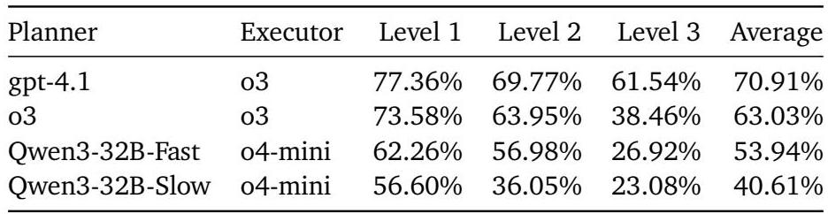

# Memento：無需微調 LLM 即可微調 LLM 代理

Huichi Zhou\*¹'²、Yihang Chen\*²、Siyuan Guo³、Xue Yan⁴、Kin Hei Lee²、Zihan Wang²、Ka Yiu Lee²、Guchun Zhang²、Kun Shao²、Linyi Yang² 和 Jun Wang²

(¹¹) AI Centre, UCL, (²) Huawei Noah's Ark Lab, UK, (³) Jilin University, (⁴) Institute of Automation, CAS

## 摘要

在本文中，我們為自適應大型語言模型 (LLM) 代理引入了一種新穎的學習範式，該範式**無需**對底層 LLM 進行微調。現有方法通常過於僵化，依賴靜態、人工編寫的反射工作流程，或者計算量巨大，需要更新 LLM 模型參數的梯度。相比之下，我們的方法透過**基於記憶體的線上強化學習**，實現了低成本的持續適應。我們將此形式化為一個**記憶體增強馬可夫決策過程 (M-MDP)**，並配備一個神經**案例選擇策略**來指導行動決策。過去的經驗儲存在一個**情景記憶體**中，可以是可微分的或非參數的。該策略會根據環境回饋，透過記憶體重寫機制持續更新，而策略改進則透過有效的記憶體讀取（檢索）來實現。我們在深度研究情境中實例化了我們的代理模型，命名為 **Memento**，它在 GAIA 驗證集上取得了第一名 (87.88% Pass@3) 並在測試集上達到 79.40%。它在 DeepResearcher 資料集上達到了 66.6% 的 F1 和 80.4% 的 PM，**超越了最先進的基於訓練的方法**，同時**基於案例的記憶體**在分佈外任務上增加了 4.7% 至 9.6% 的絕對分數。我們的方法為開發**能夠持續、即時學習且無需梯度更新的通才型 LLM 代理**提供了一條可擴展且高效的途徑，將機器學習推向**開放式技能習得和深度研究場景**。程式碼可在 https://github.com/Agent- on- the- Fly/Memento 上取得。

  
圖 1：Memento 在基準線、基準測試、記憶體設計和泛化方面的評估概覽。

## 1. 引言

大型語言模型 (LLM) 代理是一種利用一個或多個 LLM，透過互動、推理和決策來自主執行複雜任務的系統，通常可以存取外部工具、記憶體或環境 (Christianos et al., 2023, Yang et al., 2025)。與孤立地回應提示的被動 LLM 不同，LLM 代理在明確目標的指導下，主動且反覆地運作。它們越來越多地被部署為自主問題解決器 (Choudhary et al., 2021, Wei et al., 2022, Yao et al., 2023)，涵蓋各種領域。值得注意的例子包括深度研究代理 (OpenAI, 2025, Google, 2025, ByteDance, 2025)、工具增強型執行系統 (Li et al., 2025c, Zheng et al., 2025, Qian et al., 2025) 和程式碼生成代理 (Cui et al., 2021, Guo et al., 2024, Grosnit et al., 2024, Guo et al., 2025)，所有這些都證明了在複雜科學和工程任務中的強大能力。

儘管最近取得了進展，但目前的 LLM 代理通常遵循兩種主流範式，每種都存在根本性限制。第一種方法**建立具有固定工作流程和硬編碼推理的專門框架**，這對於狹窄的任務運作良好，但缺乏靈活性。部署後，此類代理是靜態的：它們既不納入線上資訊，也不適應新情況。第二種範式**專注於透過底層 LLM 的參數調整來更新 LLM 本身**——透過**監督式微調**或**強化學習**——這允許更靈活的行為 (Christianos et al., 2023, Shi et al., 2025)，但計算成本高昂。這些方法對於持續適應和線上學習來說效率低下，對於部署在開放式場景中的代理而言不切實際。這一觀察對通才代理提出了一個核心研究挑戰：

> 我們如何才能建立能夠從不斷變化的環境中持續學習，而無需承擔微調底層 LLM 的高昂成本的 LLM 代理？

受人類記憶機制的啟發，我們透過提出一個**基於記憶體的學習框架**來應對這一挑戰，該框架可以在不修改底層 LLM 的情況下實現持續適應。我們觀察到，人類的表現穩步提高，因為每段經驗都 (i) 被編碼為**情景痕跡** (Pritzel et al., 2017)，(ii) 在**睡眠依賴性整合**過程中提煉成抽象規則 (Squire et al., 2015)，(iii) 透過**多巴胺驅動的信用分配**選擇性地加強 (Glimcher, 2011)，以及 (iv) 在類似問題出現時透過**基於案例或類比的推理**進行檢索 (Ashley, 1992)。因此，LLM 代理**不是微調基礎模型**，而是利用**外部記憶體**來儲存過去的軌跡——包括成功和失敗標籤——並從類似的過去經驗中汲取靈感來指導決策。這種方法與**基於案例的推理 (CBR)** 原則 (Aarnodt and Plaza, 1994, Guo et al., 2024, 2025) 相一致，這是一種有心理學依據的學習策略，其證據表明人類通常透過回憶類比的過去情境來解決問題 (Anderson, 2013, Ross, 1989)。例如，在一個深度研究場景中，之前在基於網路的任務上取得成功的深度研究代理可以利用其經驗來解決從未見過且結構相似的任務 (Wiratunga et al., 2024)。我們的方法為深度研究代理的**持續學習**提供了一條新途徑——**高效、可泛化且受人類學習方式啟發**。

為此，我們引入了 Memento，一個**非參數化、即時學習的 CBR 框架** (Smyth and McClave, 2001, Hatalis et al., 2025)，實例化為一個**規劃器-執行器架構**，其基礎是一個**基於記憶體的馬可夫決策過程 (MDP)**。Memento 包含三個主要組成部分：(i) **規劃器**，(ii) **工具增強型執行器**，以及 (iii) 一個不斷增長的**案例庫 (Case Bank)**，用於儲存過去的軌跡作為情景記憶體。與僅依賴 LLM 在訓練後固定的參數記憶體不同，Memento 中的線上基於案例的推理是透過儲存豐富的情景痕跡來實現的。

我們的實驗在 4 個基準測試上進行，其中 GAIA (Mialon et al., 2023) 用於**長程工具使用**，DeepResearcher (Zheng et al., 2025) 用於**即時網路研究**，SimpleQA (Wei et al., 2024) 用於**事實精確度**，HLE (Phan et al., 2025) 用於**長尾學術推理**。我們使用一個**規劃器-執行器架構**，其中 GPT-4.1 作為規劃器，o4-mini 作為預設執行器（GAIA 為 o3），並配備了工具，即 Memento。我們在 GAIA 驗證集上取得了**第一名** (87.88% Pass@3)，在私人測試排行榜上取得 79.40%，在 DeepResearcher 資料集上達到了 66.6% 的 F1 和 80.4% 的 PM，**超越了最先進的基於訓練的系統**，同時基於案例的記憶體在**分佈外任務**上增加了 4.7 至 9.6 個絕對百分點，並在 SimpleQA 上達到了 95.0% 的 PM。據我們所知，我們是**第一個將基於案例的持續學習**應用於 LLM 代理的，並在 GAIA 基準測試上取得了頂級性能，從而為深度研究代理的持續適應提供了一個**原則性框架**。

## 2. 相關工作

我們首先回顧為 LLM 配備持續學習能力的方法。然後，我們討論用外部工具和多代理協調來增強代理的方法。最後，我們介紹代理的記憶體機制，描述其在表示、檢索和衰減方面的設計選擇，以及它們對持續學習的影響。

### 2.1. LLM 代理系統中的持續學習

LLM 代理的持續學習策略可分為兩類。**參數化方法** (Zhu et al., 2025b,a) 透過訓練後 (例如，強化學習 (Wang et al., 2025)) 或監督式微調 (例如，START (Li et al., 2025a)) 來更新 LLM，以高昂的計算、資料成本和**災難性遺忘**的危險 (Li et al., 2024) 為代價實現高任務保真度。人們通常認為，要獲得解決複雜推理問題的能力，需要對模型的參數進行實質性修改，因此，在 RL 期間廣泛應用了完全微調 (Liu et al., 2025)。然而，在處理長程、複雜任務 (Mialon et al., 2023, Phan et al., 2025) 時，LLM 代理系統必須花費大量時間展開軌跡以收集訓練資料，並且它們額外依賴於大量人工註釋的問題。不同的是，**非參數化方法**凍結 LLM 並附加一個外部記憶體來優化提示建構過程。人類智慧在很大程度上依賴於記憶系統，特別是**情景記憶體**，它支援從成功和失敗中學習 (Baddeley, 1983)。認知科學表明，這些記憶被分割並選擇性地重播，以告知未來的決策 (Anderson et al., 1997, Khosla et al., 2023, Fountas et al., 2024)。這啟發了早期的 AI 範式，如**基於案例的推理 (CBR)** (Francis and Ram, 1993)。儘管現代**檢索增強生成 (RAG)** 系統 (Lewis et al., 2020) 與 CBR 有表面上的相似之處，但它們通常查詢靜態文獻庫，並且缺乏持續適應的機制 (Gao et al., 2023)。

### 2.2. 工具增強型 LLM

語言代理越來越多地納入**外部工具**以克服上下文限制和計算瓶頸。基於提示的方法，包括 WebGPT (Nakano et al., 2021)，直接在生成軌跡中嵌入工具調用。然而，處理長程任務通常需要**多跳工具調用**。因此，最近的工作提出了**多代理管道**，例如 AutoGen (Wu et al., 2023)、OWL (Camel-AI, 2025) 和 DeerFlow (ByteDance, 2025)，透過對話協調專業代理。為了處理與外部工具環境的動態、多輪互動中的長程決策，**代理強化學習 (Agentic RL)** 已成為一種有前途的訓練範式。這種方法將 LLM 訓練從靜態任務解決 (例如，數學或程式碼) 轉變為動態的代理-環境推理。**監督式微調**方法，包括 Toolformer (Schick et al., 2023)、API-Bench (Li et al., 2023) 和基於 GRPO 的優化 (Wang et al., 2025, Qian et al., 2025, Feng et al., 2025) 教導模型何時以及如何調用 API，但需要**昂貴的重新訓練**，並且通常假設工具集固定且較小 (例如，Code 和 Search)。然而，如果沒有明確的規劃，決定何時以及調用哪些工具仍然是長程任務的主要瓶頸。我們將規劃建模為一個**有狀態的 MDP**，並為過去的案例提供**明確的記憶體**。透過將基於案例的推理引入規劃，執行器被引導進行戰略性工具調用和始終如一的強大性能。

### 2.3. 代理記憶體機制

最近的工作集中於為 LLM 代理賦予**明確的記憶體結構**。越來越多的工作 (Camel-AI, 2025, Liang et al., 2025, Google, 2025, ByteDance, 2025) 表明，目前的 LLM 代理是為固定環境設計的，這限制了它們的進化能力。儘管一些努力，例如 ReAct 風格的代理和**反射提示管道** (Shinn et al., 2023, Yao et al., 2023) 透過回饋展示了改進，但它們仍然受到預定義啟發式方法的約束，並且無法實現真正的終身學習。DS-Agent (Guo et al., 2024) 透過挖掘先前的 Kaggle 解決方案並將其轉化為可執行管道來穩定規劃。Agent-K (Grosnt et al., 2024) 添加了結構化記憶體和信用分配以重用過去的工作，從而實現 Kaggle 風格工作流程的端到端自動化。此外，Agent-KB (Tang et al., 2025) 和 Alita (Qiu et al., 2025) 建構了**共享知識庫**和優化的工具集，以支援代理問題解決。然而，大多數系統不斷添加案例而沒有進行選擇性整理，這導致了經典的**淹沒問題**，即檢索成本超過了實用性 (Francis and Ram, 1993)。

LLM 代理越來越多地配備**長程記憶體**，該記憶體會隨著時間的推移而增長和適應，使它們能夠積累知識、回憶先前的上下文，並根據經驗調整行為。Memory-Bank (Zhong et al., 2024) 將檢索與艾賓浩斯風格的遺忘時間表結合，以便較舊、實用性低的項目會衰減，而與使用者相關的事實則會得到加強。在此基礎上，SAGE (Liang et al., 2024) 將反射與基於艾賓浩斯的記憶體優化器統一，以支援持續的自我完善。Mem0 (Chhikara et al., 2025) 採用了一種帶有明確操作 (ADD, UPDATE, DELETE, NOOP) 的結構化記憶體機制。A-MEM (Xu et al., 2025) 透過類型學網路維護記憶體。MemInsight (Salama et al., 2025) 透過用摘要和標籤增強原始記憶體來進一步推動語義，以幫助檢索。一些工作線路從互動軌跡中提煉操作知識：ExpeL (Zhao et al., 2024) 收集軌跡並將其轉換為可重用的自然語言見解和規則；AutoGuide (Fu et al., 2024) 將離線日誌壓縮為簡潔、有條件、上下文感知指南；而 Agent Workflow Memory (Wang et al., 2024) 將頻繁使用的子任務序列誘導為輔助技能。最後，Agent-KB (Tang et al., 2025) 和 Alita (Qiu et al., 2025) 建構了共享知識庫和優化工具集以支援代理問題解決。不同的是，我們將規劃形式化為一個**記憶體增強型 MDP**，並透過**線上軟 Q-學習**在情景案例庫上學習一個**神經案例選擇策略**，從而在不微調底層 LLM 參數的情況下實現持續適應。

## 3. 方法論：基於記憶體的 MDP 與基於案例的推理策略

在這項工作中，我們將 LLM 代理與基於案例的推理相整合，這是一種經典的問題解決範式，它透過**從先前遇到的類似問題的解決方案中學習**來解決新問題。因此，LLM

  
圖 2：基於記憶體的馬可夫決策過程的圖形模型。

代理可以透過**從儲存在記憶體中的經驗中學習**來實現持續改進，而無需進行參數微調。首先，我們將 CBR 代理的順序決策過程建模為**基於記憶體的馬可夫決策過程 (M-MDP)**，如下所示。

**定義 3.1 (基於記憶體的馬可夫決策過程)**。基於記憶體的馬可夫決策過程是一個元組 $\langle S, \mathcal{A}, \mathcal{P}, \mathcal{R}, \gamma, \mathcal{M} \rangle$，其中 $S$ 是**狀態空間**，$\mathcal{A}$ 是**動作空間**，$\mathcal{P}: S \times \mathcal{A} \rightarrow \Delta(S)$ 是**轉移動態**，$\mathcal{R}: \mathcal{S} \times \mathcal{A} \rightarrow \mathbb{R}$ 是**獎勵函數**，$\gamma \in [0,1)$ 是**折扣因子**，而 $\mathcal{M} = (S \times \mathcal{A} \times \mathbb{R})^*$ 是**記憶體空間**。

M-MDP 的圖形模型如圖 2 所示。請注意，與標準 MDP 的主要區別在於，我們引入了**記憶體空間**作為一組過去的經驗。在 CBR 代理設定中，狀態空間和動作空間都被定義為預定義詞彙表 $\mathcal{V}$ 上所有有限長度序列的集合。

有了 M-MDP 公式，CBR 代理的行為可以形式化描述如下。在時間步長 $t$，我們維護一個**案例庫**（即記憶體）$M_t = \{c_i\}_{i=1}^{N_t}$，每個案例 $c_i$ 都是一個元組 $(s_i, a_i, r_i)$，而 $N_t$ 是當前案例庫中的案例數量。給定當前狀態 $s_t$，CBR 代理首先檢索一個案例 $c_t \sim \mu(\cdot | s_t, M_t)$，然後透過 LLM 重用和調整它，即 $a_t \sim p_{\mathrm{LLM}}(\cdot | s_t, c_t)$。這裡，$\mu$ 表示**案例檢索策略**，其實現細節將在後面介紹。採取動作 $a_t$，CBR 代理接收到獎勵 $r_t = \mathcal{R}(s_t, a_t)$ 並觀察到下一個狀態 $s_{t+1} \sim \mathcal{P}(\cdot | s_t, a_t)$。CBR 代理還將新案例保留在案例庫中，即 $M_{t+1} = M_t \cup \{(s_t, a_t, r_t)\}$。透過這種方式，我們可以定義 CBR 代理的整體策略如下。

**定義 3.2 (基於案例的推理代理)**。基於案例的推理代理是一種根據**當前狀態**和**過去經驗的有限記憶**做出決策的代理。形式上，讓 $s \in S$ 表示當前狀態；$M \in \mathcal{M}$ 表示由過去案例 $c$ 組成的當前案例庫；$a \in \mathcal{A}$ 表示動作；$\mu(c | s, M)$ 表示**案例檢索策略**，在給定當前狀態 $s$ 的情況下，為 $M$ 上的分佈分配機率；$p_{LLM}(a | s, c)$ 表示大型語言模型 (LLM) 在給定當前狀態 $s$ 和檢索到的案例 $c \in M$ 的情況下的**動作可能性**。那麼，CBR 代理的整體策略 $\pi$ 定義為：

$ \pi(a \mid s, M) = \sum_{c \in M} p_{\mathrm{LLM}}(a \mid s, c)\mu(c \mid s, M) $

總體而言，CBR 代理的軌跡 $\tau$ 可以描述為：$\tau = \{M_0, s_0, c_0, a_0, r_0, M_1, s_1, c_1, a_1, r_1, \dots\}$。採樣軌跡 $\tau$ 的機率可以建模為：

$ \mathbb{P}(\tau) = \mathbb{P}(s_0)\prod_{t = 0}^{T-1}\mathbb{P}(s_{t+1}|s_t,a_t)\pi(a_t|s_t,M_t)\mu(c_t|s_t,M_t) \mathbb{I}(r_t = \mathcal{R}(s_t,a_t))\mathbb{I}(M_{t+1} = M_t\cup\{(s_t,a_t,r_t)\}) $

其中 $\mathbb{I}(\cdot)$ 是**指示函數**，如果條件成立則分配機率 1，否則為 0，用於建模確定性獎勵函數和記憶體更新，而 $T$ 表示最大軌跡長度。請注意，在某些特定情況下，獎勵函數和記憶體更新也可以是機率性的，這我們留待未來工作。其中，(1) **檢索**、(2) **重用與調整**和 (4) **保留**描述了代理行為；(3) **評估**和 (5) **轉移**建模了環境動態。

**CBR 代理的軟 Q-學習**。為了優化方程式 (1) 中的 CBR 策略 $\pi$，我們旨在學習案例檢索策略 $\mu$，同時固定 LLM 組件 $p_{\mathrm{LLM}}$。在此背景下，$\mu$ 的「動作」是從案例庫 $M$ 中選擇一個案例 $c = (s, a, r)$。為了優化它同時鼓勵檢索案例的多樣性，我們應用了**最大熵 RL 框架** (Haarnoja et al., 2018) 並得出以下優化目標：

$ \pi^* = \arg\max_{\pi}\mathbb{E}_{\tau\sim\pi}\left[\sum_{t=0}^T\gamma^t\left(\mathcal{R}(s_t, a_t) + \alpha \mathcal{H}(\pi( \cdot \mid s_t, M_t))\right)\right] $

其中 $\mathcal{H}$ 表示**熵**，$\alpha$ 表示最終獎勵中的**熵權重超參數**。在此框架下，價值函數可以定義為：

$ V^{\pi}(s, M) = \mathbb{E}_{\tau\sim\pi}\left[\sum_{t=0}^T\gamma^t(\mathcal{R}(s_t,a_t)+\alpha\mathcal{H}(\pi(\cdot\mid s_t,M_t)))\mid s_0 = s, M_0 = M\right] $

同樣，在給定狀態下，採取「動作」（即選擇案例）的 $Q$ 值函數可以定義為：

$ Q^{\pi}(s, c; M) = \mathbb{E}_{\tau\sim\pi}\left[\sum_{t=0}^{T}\gamma^t \mathcal{R}(s_t, a_t) + \alpha\sum_{t=0}^{T}\gamma^t \mathcal{H}(\pi(\cdot\mid s_t, M_t)) \mid s_0=s, c_0=c, M_0=M\right] $

其中 $M_{t+1}$ 表示在添加 $(s_t, a_t, r_t)$ 後更新的記憶體。讓 $d^{\pi}(s, M) = \sum_{t=0}^{\infty}\gamma^{t-1}\mathbb{P}(s_t = s, M_t = M)$ 表示在 $\pi$ 下的折扣訪問頻率 $(s, M)$。則預期價值函數目標定義為：

$ \arg\min_{\pi}\mathbb{E}_{(s,M)\sim d^{\pi}}\left[\mathbb{E}_{c\sim\mu(\cdot\mid s,M)}\left[-\alpha\log\mu(c\mid s,M) - Q(s, c; M) + V(s, M)\right]\right] $

然後，我們可以得出最優檢索策略的閉式解，作為最優 $Q$ 值的 softmax：

$ \mu^*(c \mid s, M) \propto \exp\left(\frac{1}{\alpha}Q^*(s, c; M)\right) $

詳細推導可在附錄 A 中找到。透過這種方式，我們可以透過學習 $Q$-函數 $Q$ 來得出最優檢索策略，這可以透過軟 $Q$-學習中的**時間差分 (TD) 學習** (Haarnoja et al., 2017) 來實現，即：

$ Q(s_t, c_t; M_t) = r_t + \gamma\mathbb{E}_{a_{t+1}, c_{t+1}\sim\pi(\cdot\mid s_{t+1}, M_{t+1})}\left[Q(s_{t+1}, c_{t+1}; M_{t+1})-\alpha\log\mu(c_{t+1}\mid s_{t+1}, M_{t+1})\right] $

其中 $\eta$ 表示學習率。接下來，我們提供一種更簡單的方法，透過學習狀態上的相似度核來學習 $Q$-函數。

**演算法 1 使用軟 Q-學習和狀態相似度微調 CBR 代理** **要求**：核網路參數 $\theta$，LLM 策略 $p_{\mathrm{LLM}}$，熵權重 $\alpha$，折扣因子 $\gamma$，學習率 $\eta$，目標網路更新週期 $K$，平均權重 $\beta$，初始案例庫 $M_0 = \emptyset$，初始情景記憶體 $\mathcal{D} = \emptyset$ 和初始重放緩衝區 $B = \emptyset$  
1: 初始化目標檢索網路 $\bar{\theta} \gets \theta$  
2: **for** 時間步長 $t = 0, 1, 2, \ldots$ **do** 3: 檢索：採樣案例 $c_t \sim \mu_{\theta}(\cdot \mid s_t, M_t)$  $\triangleright$ 記憶體讀取，遵循方程式 (7) 和方程式 (9)  
4: 重用與調整：採樣動作 $a_t \sim p_{\mathrm{LLM}}(\cdot \mid s_t / \cdot \epsilon_t)$  
5: 執行 $a_t$ 並觀察獎勵 $r_t$ 和下一個狀態 $s_{t+1}$  
6: 保留：$M_{t+1} = M_t \cup \{(s_t, a_t, r_t)\}$  
7: 在 $\mathcal{B}$ 中儲存轉移 $(s_t, c_t, r_t, s_{t+1}, M_{t+1})$  
8: 添加情景記憶體 $\mathcal{D} \gets \mathcal{D} \cup \{(s_t, c_t, Q_i)\}$ $\triangleright$ 記憶體寫入  
9: 採樣小批量 $\{(s_i, c_i, r_i, s_i', M_i')\} \sim \mathcal{B}$  
10: $\theta \leftarrow \theta - \eta \nabla_{\theta}\mathcal{L}_{i}$ $\triangleright$ 遵循方程式 (10)  
11: **if** $t \mod K = 0$ **then** $\triangleright$ 更新目標網路  
12: $\bar{\theta} \leftarrow \beta \bar{\theta} + (1 - \beta)\theta$  
13: **end if** 14: **end for**

**基於狀態相似度增強 Q-學習**。如方程式 (8) 中所示，我們可以透過 TD 學習從頭開始學習 Q 函數。然而，由於自然語言形式的複雜狀態和案例描述，直接學習 Q 函數具有挑戰性。為此，我們建議遵循情景控制 (EC) 演算法 (Pritzel et al., 2017) 透過**基於核的估計**來近似 Q 值。具體來說，我們維護一個情景記憶體 $\mathcal{D} = \{(s, c, Q)\}$，包括狀態、檢索到的案例以及每次互動的 Q 值。然後，我們透過由 $\theta$ 參數化的核網路 $k_{\theta}(\cdot, \cdot)$ 來近似 Q 函數：

$ Q(s, c) = \frac{\sum_{(s_i, Q_i)\in \mathcal{D}_c}k_{\theta}(s, s_i)Q_i}{\sum_{(s_i, Q_i)\in \mathcal{D}_c}k_{\theta}(s, s_i)} $

其中 $\mathcal{D}_c = \{(s_i, c_i, Q_i) \in \mathcal{D}: c_i = c\}$ 表示儲存在情景記憶體 $\mathcal{D}$ 中具有相同檢索案例 $c$ 的過去互動。透過將方程式 (9) 代入方程式 (8)，我們可以透過 TD 學習優化核參數 $\theta$ 來學習 Q 函數，即：

$ \mathcal{L}(\theta) = \mathbb{E}_{(s,c,r,s',M')\sim\mathcal{B}}\left[\left(f_{\theta}(s, c) - \left(r + \gamma\alpha\log\sum_{c'\in M'}\exp\big(f_{\bar{\theta}}(s', c')\big)\right)\right)^2\right] $

其中 $\bar{\theta}$ 表示目標核網路，$s'$ 表示下一個狀態，而 $M' = M \cup \{c\}$ 表示更新後的案例庫。更具體地說，我們提供了關於 $\theta$ 的 TD 學習損失梯度：

$ \nabla_{\theta}\mathcal{L} = \mathbb{E}\left[\big(f_{\theta}(s, c) - y\big)\left(\sum_{(s_i, Q_i)\in \mathcal{D}_c}\frac{k_{\theta}(s,s_i)\nabla_{\theta}k_{\theta}(s,s_i)}{\sum_{s_j\in \mathcal{D}_c}k_{\theta}(s,s_j)}(Q_i - f_{\theta}(s,c))\right)\right] $

其中 $w_i = \frac{k_{\theta}(s, s_i)}{\sum_{s_j \in \mathcal{D}_c}k_{\theta}(s, s_j)}$，$f_{\theta}(s, c) = \sum_{(s_i, Q_i)\in \mathcal{D}_c}w_i Q_i$，以及 $y = r + \gamma\alpha\log\sum_{c'\in M'}\exp\big(f_{\bar{\theta}}(s', c')\big)$。

  
圖 3：帶有參數記憶體的 Memento 架構。Memento 被實例化為一個**規劃器-執行器框架**，在**基於案例的規劃**（階段 1）和**基於工具的執行**（階段 2）之間交替進行。規劃器是一個**LLM 驅動的 CBR 代理**，由**案例記憶體**模組增強，該模組支援**寫入**（記錄新案例並線上改進 Q 函數）和**讀取**（透過學習到的檢索策略檢索案例以進行自適應案例選擇）。執行器是一個基於 LLM 的 MCP 客戶端，透過 MCP 協定調用託管在 MCP 伺服器上的外部工具。

## 4. 實施：深度研究代理

我們在**深度研究**場景 (Huang et al., 2025) 中透過 **M-MDP** 方法 (§ 3) 實施有狀態的**提示工程**，在這種場景中，代理必須透過與其環境反覆互動、調用外部工具、從外部來源檢索資訊以及處理異構資料以進行動態推理來解決複雜、長程的任務。如圖 3 所示，Memento 在兩個核心階段之間交替進行：**基於案例的規劃**和**基於工具的執行**。

### 4.1. 框架

為了應對長程推理的挑戰，Memento 遵循**規劃與執行**範式 (Erdogan et al., 2025)，其中規劃器和執行器在一個交替迴圈中運作，以反覆推進任務完成。為了有效協調，Memento 整合了三個記憶體模組：**案例記憶體**（用於高層次規劃的向量化先前案例儲存）、**子任務記憶體**（用於活躍子任務及其結果的基於文字的儲存）和**工具記憶體**（用於每個子任務的基於文字的工具互動日誌）。

在**規劃階段**，作為 LLM 驅動的 CBR 代理實例化的**規劃器**接收任務指令並查詢案例記憶體以獲取相關的案例三元組 $(s_i, a_i, r_i)_{i=1}^K$，其中 $s_i$ 是任務，$a_i$ 是計畫，$r_i$ 表示成功，而 $K$ 是檢索計數。此過程由**案例記憶體**模組支援，該模組透過基於相似度的檢索器或線上更新的 Q 函數從案例庫中檢索相關經驗，從而使規劃器能夠利用參數和非參數記憶體作為先驗。檢索到的案例與當前任務指令串聯起來形成提示，引導 LLM 為每個子任務生成一個計畫。一旦初始任務被分解，**子任務記憶體**模組會協調規劃器和執行器之間的互動，記錄生成的子任務及其執行結果。每次迭代後，規劃器會使用累積的執行歷史來評估任務完成情況。如果任務未完成，規劃器會根據更新的上下文重新規劃；否則，會返回最終結果，並且只有在任務完成時，案例記憶體才會用新經驗進行更新。

**執行階段**由一個通用 LLM 驅動的**執行器**管理，它負責使用 MCP 協定將每個子任務作為一個自主情景 (Sumers et al., 2023) 執行。與先前的代理 (Zheng et al., 2025, Weng et al., 2025) 不同，Memento 的執行器支援豐富的推理和靈活的工具組合。對於每個子任務，執行器會諮詢工具記憶體，確定適當的工具調用，並更新作為**模型上下文協定 (MCP)** $^1$ 客戶端運作的結果。執行器從子任務記憶體中讀取待處理的子任務，從**工具記憶體**（每個子任務範圍）中存取相關歷史，並確定是調用外部工具還是返回結果。MCP 充當一個標準化、與模型無關的介面，實現與各種外部工具和資料來源的靈活協調。透過在單個協定層下統一存取，Memento 可以無縫地整合跨多個領域的動態推理和組合工具使用。

### 4.2. 案例記憶體管理

案例記憶體是一個**線上增長的案例庫** $M_t$，具有**寫入**和**讀取**操作，有**非參數化**和**參數化**兩種變體。在非參數化設定中，寫入僅僅是**附加** $(s_t, a_t, r_t)$，而讀取則透過相似度檢索案例以提高計算效率。在參數化設定中，寫入進一步**線上更新**一個 Q 函數來塑造檢索分佈，而讀取則由學習到的 Q 函數驅動，從而實現自適應案例選擇。更多細節請參閱附錄 B。

**記憶體儲存**。遵循定義 3.2 中的 CBR 代理，**寫入**操作在每個時間步長 $t$ 之後將每個歷史案例 $(s_t, a_t, r_t)$ 附加到案例庫 $M_t$：

$ M_{t+1} = M_t \cup \{(s_t, a_t, r_t)\} $

在此過程中，狀態 $s_t$ 使用凍結的文字編碼器進行編碼，而動作 $a_t$ 和獎勵 $r_t$ 以其原始形式保留，因為只有狀態表示需要向量化以進行後續的檢索操作。此寫入操作在代理執行過程中持續進行，使案例庫能夠**增量地**成長為一個全面且可轉移的經驗儲存庫。透過累積成功和失敗，記憶體不僅可以實現**追溯分析**以有意識地避免過去的錯誤，而且還提供**成功的軌跡**，從而前瞻性地指導未來的規劃。

**非參數記憶體檢索**。Memento 的一個基石是其**動態演變的案例庫**，它支撐了其持續學習能力。在每個規劃步驟中，這個非參數記憶體模組接收任務指令，然後檢索相關案例，其中包含成功和失敗案例的混合。這種 CBR 方法反映了人類的類比學習，其中先前遇到的結果會影響決策 (Aamodt and Plaza, 1994)。具體來說，我們透過計算當前狀態與過去狀態之間的**語義相似度**，從案例庫中檢索 K 個最近的過去案例。這種設計遵循主流的 CBR 範式，即假設**類似問題應該有類似的解決方案** (Wiratunga et al., 2024, Guo et al., 2025)，從而使代理能夠優先處理其歷史上下文與當前任務最一致的案例。形式上，非參數記憶體的**讀取**操作定義為：

$ \mathrm{Read}(s_t, M_t) = \arg\max_K \mathrm{sim}(\mathrm{enc}(s_t), \mathrm{enc}(s_i)) $

其中 $s_t$ 和 $M_t$ 分別表示時間步長 $t$ 的查詢和案例庫。這裡，$\operatorname{enc}(\cdot)$ 表示預訓練的文字編碼器，而 $\operatorname{sim}(\cdot)$ 表示**餘弦相似度函數**。

**參數記憶體檢索**。為了使代理能夠選擇性地利用**高實用性案例**來增強從過去經驗中的規劃，我們透過一個**參數化 Q 函數**在 Memento 中設計了一個**可微分的記憶體機制**。當向案例庫寫入新案例時，與僅僅像方程式 (12) 那樣附加元組的非參數化方法相反，參數化方法**同時線上更新 Q 函數**。同時，由於 CBR 僅用於 Memento 中的規劃，因此 CBR 規劃器可以簡化為**單步設定**，而不是多步 M-MDP。此單步設定將方程式 (10) 中的 TD 目標折疊為**即時獎勵**，從而簡化了學習目標。如果沒有**引導**，更新會簡化為**監督學習範式**，這避免了**非平穩目標**。因此，我們可以**端到端地訓練**一個參數化 Q 函數 $Q(s, c; \theta)$，而無需方程式 (9) 中的基於核的估計。因此，單步 Q-學習損失可以公式化為：

$ \mathcal{L}(\theta) = \mathbb{E}_{\{(s, c, r)\}\sim\mathcal{B}}\left[\big(Q(s, c; \theta) - r\big)^2\right] $

其中元組 $\{(s, c, r)\}$ 儲存在**重放緩衝區** $\mathcal{B}$ 中，$Q$ 被實施為一個**神經網路**。值得注意的是，深度研究任務中的獎勵訊號是二進位的 $(r \in \{0, 1\})$，我們用**交叉熵 (CE) 損失**替換了**均方誤差 (MSE) 目標**，因為 MSE 損失在 $0/1$ 附近會出現梯度消失，而 CE 損失提供更具數值穩定性的訊號。因此，我們將訓練目標重新公式化為**二元分類損失**：

$ \mathcal{L}_{\mathrm{CE}}(\theta) = -\mathbb{E}\left[r\log\big(Q(s,c;\theta)\big)+(1-r)\log\big(1-Q(s,c;\theta)\big)\right] $

其中 $Q$ 可以被視為一個標準化值，代表機率 $p(r = 1 | s, c; \theta)$，即在給定案例庫 $M$ 的情況下，檢索到的案例 $c$ 是當前狀態 $s$ 的良好參考的可能性。與僅保留新案例的非參數化方法不同，參數記憶體還在寫入期間**改進 Q 函數**，使每次更新既可以記錄新案例，又可以更新整體 Q 值景觀。

在檢索期間，學習到的 Q 函數用於透過方程式 (7) 計算檢索策略分佈，從中可以採樣案例。為了減少案例選擇的隨機性並增強代理決策過程的可解釋性，參數記憶體的**讀取**操作應用**TopK 運算子**來選擇具有最高 Q 值的 K 個案例，這些案例用作規劃參考：

$ \mathrm{Read}_{\mathrm{parametric}}(s_t, M_t) = \arg\max_K Q(s_t, c_i, \theta) $

透過持續使用新樣本更新 Q 函數，參數記憶體模組學習捕捉**狀態和案例之間的潛在模式**，從而產生更接近案例檢索策略 $\mu^*$ 底層分佈的近似值。

### 4.3. 工具使用

除了長任務執行序列和多輪互動的固有要求外，深度研究任務還對**原子動作**提出了嚴格要求，要求代理能夠獲取外部資訊並隨後處理、整合和分析它。因此，我們為 Memento 設計了一套可透過 MCP 協定存取的工具，包括用於**資訊檢索**的模組，例如搜尋引擎和網路爬蟲，以及用於處理和分析**多模態資訊**的組件，包括影片和圖像資料，以及各種格式的檔案。

**外部資訊獲取**。為了支援需要存取最新外部知識的開放式任務 (例如 GAIA, BrowseComp)，我們設計了一個**搜尋工具包**，它整合了檢索和內容獲取功能。具體來說，我們採用 **searxng** $^2$，一個**自我託管的元搜尋引擎**，它匯總了來自 Google $^3$、Bing $^4$、Duckduckgo $^5$ 和 Brave $^6$ 等多個來源的結果。然後根據與查詢上下文的語義相似度對檢索到的候選者進行重新排序，以確保相關性和精確度。為了補充這一點，我們整合了 **Crawl4AI** $^7$ 來抓取和解析所選結果的完整網路內容，當執行器需要更深入的理解時。換句話說，**搜尋工具**充當基於使用者查詢中的**關鍵字匹配**的粗略篩選器，而**爬蟲**則作為一種**細粒度機制**，用於在必要時從檢索到的來源中提取詳細資訊。

**多模態異構資訊處理**。為了支援對異構資料來源的下游推理，我們實施了一個**多功能且細粒度的文件處理工具包**，可自動從廣泛的檔案類型和模態中提取資訊。例如，**圖像**使用**視覺-語言模型 (VLM)** 進行描述；**音訊**透過**自動語音辨識**進行轉錄；**PowerPoint 檔案**逐頁解析並附帶嵌入的圖像描述；**試算表**轉換為可讀的按行佈局；**壓縮檔案**被解包；**純文字和程式碼檔案**直接讀取；**JSON 和 XML** 解析為結構化物件；**Word 文件**轉換為 Markdown；而**影片**則從 VLMs 接收自然語言摘要。對於 PDF 或不受支援的格式，則透過 **Chunkr AI** $^8$ 或純文字解析使用備用提取。此工具包提供了一個統一的介面，用於存取和解釋跨不同檔案類型和模態的內容，從而簡化了實際場景中**異構資料的處理**。

**推理**。推理和分析工具包整合了**程式碼執行**和**數學運算**，以支援 Memento 框架內的穩健、自動化分析。**程式碼工具**提供了一個**沙盒環境**，用於在統一的工作區內編寫、執行和管理程式碼。使用者可以建立檔案、執行 shell 或 Python 命令以及檢查輸出——所有這些都在一個**持久性任務目錄**中進行。Python 指令碼會根據**安全白名單**進行驗證以確保安全執行，支援常用的庫，如 numpy、pandas 和 torch。工作區在各個步驟之間保持狀態，從而實現**反覆開發**。這個代理對於解決資料分析、自動化或動態程式碼生成任務至關重要。作為補充，**數學工具**處理基本的算術運算。

## 5. 實驗

在本文中，我們研究了**深度研究代理**，它需要工具使用並支援與外部真實世界環境進行多輪互動。為了全面評估代理的能力，我們選擇了四個資料集，每個資料集都代表研究挑戰的一個不同方面：(i) **長程工具使用和規劃** (GAIA) (Mialon et al., 2023)，(ii) **即時基於網路的研究** (DeepResearcher) (Zheng et al., 2025)，(iii) **簡潔的事實準確性** (SimpleQA) (Wei et al., 2024)，以及 (iv) 在**人類知識前沿的探索** (HLE) (Phan et al., 2025)。

表 1：基於提示、基於訓練和我們的方法在七個開放域 QA 資料集上的性能比較。我們報告了 F1 分數和 PM 分數。最後兩列給出了所有基準測試的加權平均值 (Avg)，其中 Bamboogle 貢獻了 125 個例子，其他每個資料集貢獻了 512 個例子。使用 Qwen2.5 (7B) 的基於提示和基於訓練的方法的結果參見 DeepResearcher (Zheng et al., 2025)。

### 5.1. 資料集

為了評估 Memento 的**通用推理能力**，我們採用了 **GAIA 基準測試** (Mialon et al., 2023)，它包含 450 個具有明確答案的非平凡問題——測試集中有 300 個，驗證集中有 150 個。每個問題都需要不同程度的工具使用和自主規劃，並且資料集分為三個難度級別：**級別 1**：需要使用單一工具約 5 個步驟；**級別 2**：需要 5-10 個步驟，涉及多個工具；**級別 3**：涉及多達 50 個步驟，對工具的數量或類型沒有限制。每個級別都包含一個公共驗證分割和一個帶有隱藏真實答案和中繼資料的私人測試分割。

我們進一步在 DeepResearcher (Zheng et al., 2025) 中編譯的更廣泛基準測試上評估了 Memento，該基準測試來自七個開放域 QA 資料集：Natural Questions (NQ) (Kwiatkowski et al., 2019)、TriviaQA (TQ) (Joshi et al., 2017)、HotpotQA (Yang et al., 2018)、2Wiki (Ho et al., 2020)、MusiQue (Trivedi et al., 2022)、Bamboogle (Press et al., 2022) 和 PopQA (Mallen et al., 2022)。每個資料集貢獻 512 個例子，除了 Bamboogle 提供了 125 個高品質樣本，這些樣本經過整理以最大程度地減少污染並強調基於網路的合成。

此外，我們還包括兩個**具有挑戰性的基準測試**：1) **SimpleQA** (Wei et al., 2024)，由 4,330 個尋求事實的問題組成，專注於**事實準確性**。2) **Humanity's Last Exam (HLE)** (Phan et al., 2025)，包含跨不同學術主題的 2,500 個問題，評估**廣泛領域推理的極限**。

### 5.2. 評估指標

由於每個 GAIA 查詢都有一個單一的參考答案，我們遵循 GAIA 排行榜並使用**精確匹配 (EM)** 指標，該指標僅在預測在標準化 (小寫、標點符號和冠詞移除、空格標準化) 後與真實答案完全匹配時才標記為正確。EM 分數反映了**完美匹配答案的百分比**。

然而，EM 無法準確反映 LLM 代理的能力，因為它**忽略了表達的多樣性**。我們使用**巨集 F1 分數**來評估 DeepResearcher、SimpleQA 和 HLE 資料集。

表 2：截至 2025 年 6 月 26 日 GAIA 排行榜的頂級結果，Memento 在開源代理框架中的驗證集和測試集上均取得了第一名。

同時，**部分匹配 (PM)** 表示 LLM 生成的答案與黃金答案之間的部分語義匹配分數。我們利用 GPT-4o-mini 作為答案評估器來給出分數，提示與 DeepResearcher (Zheng et al., 2025) 相同。

### 5.3. 模型配置

**規劃器**由 **GPT-4.1** 提供支援，**執行器**在 GAIA 上由 **o3** 提供支援，其他資料集由 **o4-mini** 提供支援，**圖像處理**由 **GPT-4o** 提供，**影片代理**由 **Gemini 2.5 Pro** 提供，**音訊代理**由 **Assembly AI** 提供。對於非參數化 CBR，我們使用 SimCSE 編碼句子並使用餘弦相似度對候選案例進行排名。對於參數化 CBR，我們使用 SimCSE 初始化句子表示，並將 Q 函數實施為一個**兩層 MLP** 來分配 Q 值。同時，CBR 規劃器在每個步驟中的狀態通常包含從先前狀態繼承的資訊。為了避免冗餘儲存，**只有來自每個軌跡最後一步的狀態、動作和獎勵**才被寫入記憶體，確保案例庫既緊湊又資訊豐富。

**離線執行器**設定是指一個靜態執行器，移除了規劃器、案例記憶體和所有外部工具，因此它僅反映來自 LLM 的原始參數知識。**線上執行器**從那個簡化後的基準線開始，但將相同的執行器重新連接到即時搜尋和其他 MCP 工具，反映了即時檢索和工具執行的價值。**Memento (無 CBR)** 保持情景記憶體停用，這使我們能夠專門測量由基於案例的推理帶來的額外收益。

### 5.4. 實驗結果

**Deep Researcher**。我們將此資料集納入以測試**即時網路研究**、**證據檢索**、**跨頁合成**和**多跳推理**。如表 1 所示，使用 MCP 工具（例如，搜尋引擎、瀏覽器）增強的 Memento 在七個 DeepResearcher 基準測試中達到了平均 **66.6% 的 F1**，幾乎是 CoT + RAG 基準線 37.7% F1 的兩倍。這表明**即時、線上檢索工具可以與精心策劃的靜態資料庫相媲美甚至超越**。

**GAIA (驗證集和測試集)**。為了評估在**長程規劃、工具協調和執行**方面的穩健性，我們採用了 GAIA 基準測試。Memento 在驗證集上取得了**第一名**，在測試集上取得了**第四名**，**超越了大多數現有代理框架** (表 2)。值得注意的是，它在驗證集和測試集上均超越了廣泛使用的開源框架，包括 Manus (Liang et al., 2025)、Aworld (Alibaba, 2025) 和 OWL (Camel-AI, 2025)。

對於 GAIA 驗證評估，我們從頭開始初始化記憶體，並在三次迭代中反覆將成功和失敗的軌跡儲存在案例庫中。使用 GPT-4.1 作為規劃器和 o3 作為執行器，Memento 在驗證集上實現了 **87.88% 的準確性**。對於 GAIA 測試集，性能完全基於在驗證期間累積的案例庫，準確性為 **79.40%**。儘管 Memento 表現出強大的整體性能，但對於需要**延長推理範圍和高級工具協調**的**級別 3 任務**，挑戰依然存在。

**Humanity's Last Exam (HLE)**。為了評估**人類知識的前沿**以及在**長尾、專業領域**的複雜推理能力，我們納入了 HLE$^9$。使用我們的規劃器-執行器架構，規劃器為 GPT-4.1，執行器為帶有工具的 o4-mini，Memento 達到了 **24.4% PM**，總體排名第二，與 GPT-5 的 25.32% 僅相差 0.92 個百分點，同時**優於** Gemini-2.5-Pro 的 21.64%、o3-high 的 20.32% 和 o4-mini-high 的 18.08%。這些結果表明，透過 **CBR 進行的持續學習有效地將情景經驗轉化為可重用知識**，為泛化提供了一條互補途徑，即使在**常規工具使用和檢索方法難以應對的長尾領域**也是如此。

**SimpleQA**。為了評估 Memento 在**單跳事實問答**中的可靠性和對**幻覺的穩健性**，我們採用了 SimpleQA 基準測試。如圖 4 所示，使用工具增強的規劃器-執行器框架（GPT-4.1 作為規劃器，o4-mini 作為執行器）實施的 Memento 在所有基準線中都取得了**最高準確性**。具體來說，它達到了 **95.0% 的準確性**，優於 WebSailor (93.5%)、WebDancer (90.5%)、WebThinker (77.5%) 和 DeepSeek-r1-React (72.2%)。這些結果表明，Memento 在直接的**單跳查詢**上提供了強大的**事實可靠性**並**顯著緩解了幻覺**，為先前的網路代理基準線樹立了**新的最先進水準**。

### 5.5. 消融研究

我們分析了 Memento 的**超參數選擇**、**元件分析**、**參數和非參數基於案例的推理的學習曲線**、**分佈外性能**和**代幣成本**。

#### 5.5.1. 超參數選擇

增加 CBR 中檢索案例的數量會提高計算成本，並可能引入來自不相關例子的雜訊。為了評估這一點，我們在 DeepResearcher 資料集上將 $K$ 變為 0、2、4、8、16、32。如表 3 所示，**性能提高到 $K=4$**——產生了最高的 F1 (64.5) 和 PM (78.5)——但對於更大的 $K$ 則**持平或略有下降**。這表明 CBR 受益於**小而高品質的記憶體**，這與少樣本提示不同，在後者中更多例子通常會有所幫助 (Agarwal et al., 2024)。因此，**仔細的案例選擇和記憶體整理**對於持續學習至關重要。

表 3：Memento 在 DeepResearcher 資料集上不同案例數量的性能。我們使用 gpt-4.1 作為規劃器，o4-mini 作為執行器。

表 4：Memento 在 DeepResearcher 資料集上經過五次學習迭代的性能提升，展示了在案例庫中累積案例的好處。

#### 5.5.2. 元件分析

從表 5 中，我們觀察到 HLE、SimpleQA 和 DeepResearcher 之間存在一致的模式。從**離線執行器**轉向**即時工具**通常可以**減少幻覺**並增加 F1 和 PM，儘管增幅取決於任務類型（SimpleQA: $+28.8$ F1 / $+63.3$ PM，HLE: $+4.8 / +7.1$)，甚至在開放域資料上可能會有所損害 (DeepResearcher: $-18.0 / -2.1$)。引入**規劃** (Memento 無 CBR) 在每個基準測試上都產生了**穩健的增益** (HLE: $+11.0 / +1.6$，SimpleQA: $+32.5 / +4.9$，DeepResearcher: $+29.1 / +11.5$)，這表明**明確的分解和工具協調**系統地改善了執行。最後，**基於案例的推理**提供了**一致的、附加的改進** (HLE: $+4.5 / +7.0$，SimpleQA: $+3.7 / +5.3$，DeepResearcher: $+6.7 / +8.2$)。然而，對於 HLE，如果主幹模型中沒有編碼足夠的領域知識，單獨的工具使用或規劃都無法可靠地在長尾、專家級任務上產生正確答案。對於 DeepResearcher，我們還發現了七個被評估的基準測試之間的**資料污染** (Shumailov et al., 2024)，當從沒有規劃的離線執行器轉向線上執行器時，F1 和 PM 都出現了顯著下降 (DeepResearcher: $-18.0$ F1 / $-2.1$ PM)。這與該領域的更廣泛發現相一致 (Sun et al., 2022, Yu et al., 2022, Zhou et al., 2025)：**簡單地使用外部知識有時可能會對模型產生負面影響**，而**模型中的內部知識**在 QA 任務中發揮著重要作用，甚至可以**優於 RAG**。

(a) HLE  

(b) SimpleQA  

  
(c) DeepResearcher

表 5：三個基準測試的消融結果。每個單元格顯示 F1/PM。我們使用 gpt-4.1 作為規劃器，o4-mini 作為執行器。

#### 5.5.3. 參數和非參數 CBR 增強的持續學習能力

圖 1c 和表 4 呈現了 Memento 框架中不同記憶體設計的**持續學習曲線**，比較了三種配置的性能：帶有非參數化 CBR 或參數化 CBR 的 Memento 和不帶 CBR 的 Memento。結果表明，**完整的 Memento 架構**在所有迭代中都**始終優於消融版本**，在每個步驟中都實現了更高的準確性。值得注意的是，移除 CBR 會導致性能明顯下降，這突顯了**參數化 CBR 和非參數化 CBR 組件在增強 Memento 持續學習能力方面的有效性和互補優勢**。更重要的是，我們觀察到 DeepResearcher 資料集上的準確性隨著迭代次數的增加而呈現**學習曲線**，這表明**基於記憶體的方法可以在不需要參數更新的情況下有效增強 LLM 代理**。

儘管我們試圖在學習曲線上定位任何性能下降，但在實踐中，這樣的轉折點是難以捉摸的。只有約 3k 的訓練資料，案例庫很快就會飽和。因此，每次額外的迭代，先前未見過（並因此可能失敗）的案例數量會逐漸減少。在我們模擬的、開放式但最終有限的環境中，我們觀察到**快速收斂**，在幾次迭代後收益微乎其微。因此，添加更多迭代會導致收益遞減，並且對我們對基於記憶體的持續學習的理解貢獻不大。

#### 5.5.4. 跨任務泛化

為了評估**分佈外 (OOD) 泛化**，我們遵循 Zheng et al. (2025) 的評估協定。具體來說，由於其獨特的問題風格和資訊分佈，MusiQue (Trivedi et al., 2022)、Bamboogle (Press et al., 2022) 和 PopQA (Mallen et al., 2022) 被選為 **OOD 資料集**，而 NQ (Kwiatkowski et al., 2019)、TQ (Joshi et al., 2017)、HotpotQA (Yang et al., 2018) 和 2Wiki (Ho et al., 2020) 用於**訓練**。我們首先從訓練資料集中收集軌跡並將其儲存在案例庫中。在推理期間，Memento 為每個目標查詢從案例庫中檢索四個最相關的案例。如圖 1d 所示，Memento 在所有 OOD 基準測試上都取得了**實質性改進**，絕對收益範圍從 **4.7% 到 9.6%**。這些結果突顯了**基於案例的推理在增強對未見任務的泛化方面的有效性**。

## 6. 討論與分析

在建立 Memento 有效性的 § 5 結果的基礎上，我們進一步分析了其**效率和操作行為**。具體來說，我們 (i) 分析了每個任務在三個難度級別下的**平均工具調用次數**，以評估 MCP 框架如何隨著任務複雜性的增加而適應，(ii) 表徵了**工具調用統計資料**，以及 (iii) 評估了使用**面向推理**與**通用模型**的影響。

表 6：快速和慢速思考模式對 GAIA 驗證資料集 (pass@1) 的影響。  

### 6.1. 每個任務的代幣數量

如圖 5 所示，**程式碼、搜尋和爬蟲任務**在所有級別中佔主導地位，其使用量隨著難度的增加而顯著增加。重要的是，雖然**整體工具使用量隨任務複雜性而增長**，但最具挑戰性的問題越來越依賴於模型的**內部推理**來解釋和聚合先前的工具輸出中的證據，而不是簡單地透過 MCP 調用更多工具。這突顯了**規劃、記憶體和證據聚合之間有效整合**對於解決開放式、長程深度研究任務的重要性。

  
圖 5：每個級別的每種任務類型的平均數量，突顯了隨著難度級別增加，程式碼、搜尋和爬蟲任務的主導地位。

### 6.2. MCP 工具統計

如圖 6 所示，我們分別從 GAIA 驗證集中隨機採樣 10 個任務，以計算每個任務的代幣和成本。**平均回應代幣**隨著任務難度急劇增加：**級別 1** 查詢需要 **26k 輸入代幣和 4.7k 輸出代幣**，**級別 2** 增加到 **48k/6.9k**，而**級別 3** 達到峰值 **121k/9.8k**。這突顯了複雜場景中的主要計算負擔源於**整合和分析多步工具輸出**，而不是生成長回應。

我們觀察到，**輸出代幣在各任務級別中保持穩定**，因為最終答案通常只需要簡短的回應。這表明我們的系統有效地控制了生成長度，並避免了推理過程中不必要的冗長。然而，由於真實世界環境的複雜性和不可預測性，**輸入上下文**隨著任務難度顯著增長。隨著任務變得更加複雜，更詳細的觀察、計畫、工具輸出和中間推理步驟必須被納入輸入提示中，導致輸入代幣數量大幅增加。

  
圖 6：GAIA 上的代幣成本。

### 6.3. 快速和慢速思考模式的影響

表 6 比較了**快速和慢速思考規劃器**對不同任務難度下整體系統性能 (pass@1) 的影響。結果表明，將**快速、非審慎的 GPT-4.1 規劃器**與 o3 執行器配對，產生了**最高的平均準確性 (70.9%)**，甚至**優於更具審慎性的 o3 規劃器 (63.03%)**，儘管兩者使用相同的執行器。同樣，當使用 o4-mini 執行器時，**GPT-4.1 比 o3 取得了實質性提高 16.4%**。Qwen3-32B 模型進一步證實了這一趨勢，**快速規劃器始終優於其慢速對應者**。

對系統軌跡的分析揭示了快速規劃器優越性的幾個關鍵原因。**依賴 o3 模型**的規劃器通常要麼**直接回答**——完全跳過計畫生成——要麼產生**過於冗長的計畫**，這可能會用不完整的指令誤導執行器。此外，在複雜的多步推理領域，**慢速規劃器**傾向於將解決方案壓縮成一個**單一、複雜的思維鏈**，而**快速規劃器**有效地將問題分解為**可管理的子任務**。

總體而言，這些發現突顯了在模組化 LLM 系統中，**簡潔和結構化的規劃**導致**更有效的下游執行**。過於審慎的規劃不僅引入了不必要的上下文和冗餘，還會導致**角色混淆**，從而破壞兩階段架構旨在利用的專業化。

## 7. 結論

我們引入了 Memento，一個**基於記憶體的學習範式**，它使 LLM 代理能夠**線上適應**而無需更新模型權重。Memento 將**深度研究代理**形式化為一個**基於記憶體的馬可夫決策過程 (MDP)**，並在**規劃器-執行器框架**內實施它，利用**情景案例庫**來記錄和檢索軌跡以進行**持續策略改進**。在實證上，我們在 GAIA、DeepResearcher 和 SimpleQA 上取得了強勁的性能。消融研究表明，**參數和非參數 CBR** 對於顯著的性能提升至關重要，並且**小而經過整理的記憶體**可產生最佳結果。這些發現激發了使用**基於記憶體的 MDP** 進行深度研究任務的未來工作。

參考文獻

Agnar Aamodt and Enric Plaza. Case-based reasoning: Foundational issues, methodological variations, and system approaches. AI communications, 7(1):39–59, 1994. Rishabh Agarwal, Avi Singh, Lei Zhang, Bernd Bohnet, Luis Rosias, Stephanie Chan, Biao Zhang, Ankesh Anand, Zaheer Abbas, Azade Nova, et al. Many-shot in-context learning. Advances in Neural Information Processing Systems, 37:76930–76966, 2024. Alibaba. Aworld: A unified agent playground for computer and phone use tasks, 2025. URL https://github.com/inclusionAI/AWorld. John R Anderson. The architecture of cognition. Psychology Press, 2013. John R Anderson, Michael Matessa, and Christian Lebiere. Act-r: A theory of higher level cognition and its relation to visual attention. Human-Computer Interaction, 12(4):439–462, 1997. Kevin D Ashley. Case-based reasoning and its implications for legal expert systems. Artificial Intelligence and Law, 1(2):113–208, 1992. Alan David Baddeley. Working memory. Philosophical Transactions of the Royal Society of London. B, Biological Sciences, 302(110):311–324, 1983. ByteDance. Deerflow: Deep exploration and efficient research framework. https://deerflow.tech/z, 2025.