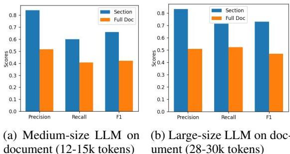
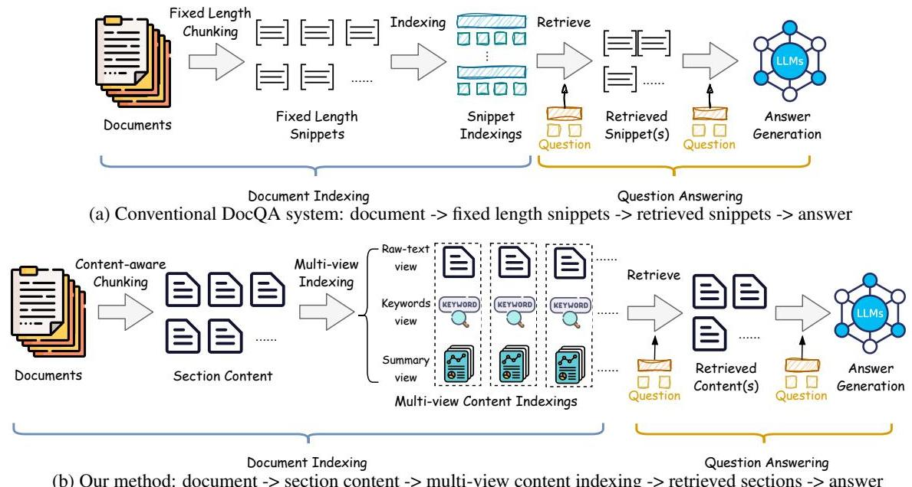
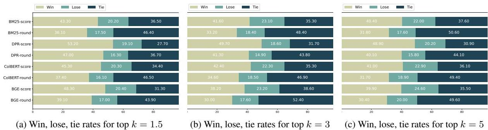
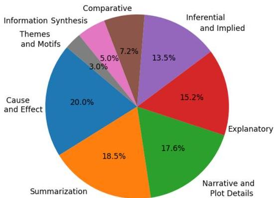

# 多視角內容感知索引用於長文件檢索

Kuicai Dong†, Derrick Goh Xin Deik†, Yi Quan Lee, Hao Zhang, Xiangyang Li, Cong Zhang, Yong Liu 華為諾亞方舟實驗室 {dong.kuicai; goh.xin.deik; liu.yong6}@huawei.com

摘要

長文件問答（DocQA）旨在從超過一萬字以上的長文件中回答問題。這些文件通常包含諸如章節、小節和段落分隔等內容結構。然而，長文件的索引方法仍未得到充分探索，現有系統通常採用**固定長度分塊**。由於它們不考慮內容結構，所產生的區塊可能會遺漏重要資訊或包含不相關的內容。基於此，我們提出了**多視角內容感知索引**（MC-indexing），旨在透過以下方式實現更有效的長文件問答：(i) 將結構化文件分割成內容區塊，以及 (ii) 以**原始文本**、**關鍵字**和**摘要**三種視角來表示每個內容區塊。我們強調，MC-indexing **既不需要訓練也不需要微調**。它具備**隨插即用**的能力，可以無縫地與任何檢索器整合，以提升其效能。此外，我們提出了一個長文件問答資料集，其中不僅包含問答對，還包含文件結構和答案範圍。與最先進的分塊方案相比，MC-indexing 在 top-k = 1.5, 3, 5 和 10 的情況下，平均召回率分別顯著增加了 **42.8%**、**30.0%**、**23.9%** 和 **16.3%**。這些改進的分數是透過對 8 個廣泛使用的檢索器（2 個稀疏和 6 個稠密）進行大量實驗後得出的平均值。

## 1 引言

文件問答（DocQA）是自然語言處理（NLP）中的一項關鍵任務，其涉及利用文本文件作為參考答案範圍來回答問題。傳統的 DocQA 系統由三個核心元件組成：(i) 一個**索引器**，用於將文件分割成可管理的文本區塊並用嵌入進行索引；(ii) 一個**檢索器**，用於識別並提取與相應問題最相關的區塊；以及 (iii) 一個**閱讀器**，用於消化檢索到的答案範圍並生成準確的答案。相較於檢索器（Robertson and Zaragoza, 2009; Karpukhin et al., 2020; Khattab and Zaharia, 2020a）和閱讀器（Nie et al., 2019; Lewis et al., 2020; Izacard and Grave, 2021）已得到廣泛研究，索引器受到的關注相對較少。

現有的索引方案在處理長文件時忽略了內容結構的重要性，因為長文件通常被組織成章節、小節和段落（Yang et al., 2020; Buchmann et al., 2024），即**結構化**的。廣泛使用的**固定長度分塊**策略很容易破壞長文件文本區塊之間的上下文關聯性。這種分塊錯誤可能會被檢索器和閱讀器進一步加劇。此外，確定區塊之間的邊界可能很棘手，需要精心的設計以防止上下文連貫性中斷。理想情況下，每個區塊應該代表一個連貫且與內容相關的文本跨度。否則，它可能導致遺漏相關資訊或包含不相關的文本，如圖 1 所示。我們對固定長度分塊的實證研究顯示，將區塊長度設定為 100 會導致超過 **70%** 的長答案/支援證據被截斷，即不完整。儘管將區塊長度增加到 200，這種不完整性仍然存在於 **45%** 的情況下。¹

> 問題 (a): 如何烤一個巧克力蛋糕？
> 期望的參考文本: 你可以按照以下步驟烤一個巧克力蛋糕：1. 準備：... 2. 準備材料：... 3. 混合乾燥材料：... 4. 混合濕潤材料：... 5. 結合混合物：... 6. 烤蛋糕：...（500 字）
> 實際檢索到的區塊：... 你可以按照以下步驟烤一個巧克力蛋糕：1. 準備：...（100 字）
>
> (a) 整個章節（約 500 字）是回答問題所必需的。檢索到的區塊只有 100 字。
>
> 問題 (b): DELL XPS 13 的硬體規格（CPU、顯示器、電池等）是什麼？
>
> 期望的參考文本：... 第 14 代 Intel Core i7 處理器 ... 13.4 吋 FHD Infinite-Edge 顯示器 ... 電池壽命 ... 背光鍵盤 ... 帶有 Thunderbolt 4 埠 ...（250 字）
>
> 實際檢索到的區塊：
>
> 1. ... 第 11 代 Intel Core i7 處理器 ... 13.4 吋 FHD Infinity Edge 顯示器 (內容：Dell XPS 13，100 字)
> 2. ... 新的 M1 Pro 晶片 ... 14 吋 Liquid Retina XDR 顯示器展示 ... (內容：MacBook Pro，100 字)
> 3. ... 強大的 Intel Core M 處理器 ... 13.3 吋 4K UHD 觸控顯示器 ... (內容：Dell XPS 12，100 字)
>
> (b) 整個章節（約 250 字）是回答與 Dell XPS 13 相關的給定問題所必需的。遺失資訊（例如型號名稱）導致資訊衝突。


圖 1：由於遺漏相關文本和包含不相關文本而導致的固定長度分塊不良案例。

最近，人們對利用**大型語言模型**（LLMs）進行問答任務的興趣日益增長（Chen et al., 2023; Sarhi et al., 2024）。然而，**臭名昭著的詞元限制**阻礙了 LLM 應用於長文件。例如，LLaMA（Touvron et al., 2023a）、LLaMA 2（Touvron et al., 2023b）和 Mistral（Jiang et al., 2023）分別限制在 2k、4k 和 8k 詞元，這對於超過 10k 字的長文件來說是不足的。即使是**先進的商業 LLM**，在有效處理和理解這類長文件方面也存在困難。如圖 2 所示，我們的研究表明，當用於長文件（12k-30k 詞元）上的跨度式問答時，先進商業 LLM 的效能與專用章節（平均 370 詞元）相比**顯著下降**。² 此外，Liu et al. (2023) 指出，LLMs 在保留和引用長文件早期部分資訊時面臨困難。


圖 2：使用完整文件與專用章節進行跨度式問答檢索的商業 LLM 比較。

為緩解上述挑戰，我們提出了一種新方法：**多視角內容感知索引**（MC-indexing），它能實現更有效的長文件檢索。我們的方法涉及對**結構化長文件進行內容感知分塊**，其中，我們不採用天真的固定長度分塊，而是將文件分割成**章節區塊**。然後，每個章節區塊以三種不同的視角進行索引，分別用**原始文本**、**關鍵字列表**和**摘要**來表示每個區塊。這種多視角表示顯著增強了每個區塊的語義豐富性。對於檢索，我們基於多視角聚合最相關的 top 相關區塊。值得注意的是，MC-indexing 的整個過程是**無監督的**。我們利用現有檢索器的優勢來生成原始文本、關鍵字和摘要視角的嵌入。我們利用 LLM 的答案生成能力，基於檢索到的區塊來生成答案。據我們所知，現有的 DocQA 資料集沒有提供內容結構。因此，我們將一個現有的長文件資料集，即 **WikiWeb2M**（Burns et al., 2023），轉換為一個問答資料集，透過為文件添加註釋。此外，我們用內容結構來補充 **Natural Questions** 資料集（Kwiatkowski et al., 2019），並僅篩選出長文件用於我們的實驗。與其他問答資料集不同，我們的文件更長（平均為 15k 詞元）並包含詳細的內容結構。我們的貢獻有四個方面：

- 我們提出了一個長文件問答資料集，並註釋了問答對、文件內容結構和答案範圍。
- 我們提出了多視角內容感知索引（MC-indexing），它可以 (i) 根據文件內容結構分割長文件，並 (ii) 以三種視角表示每個區塊，即原始文本、關鍵字和摘要。
- MC-indexing 既不需要訓練也不需要微調，可以無縫地作為一個隨插即用的索引器，以提升任何現有檢索器的效能。
- 透過大量實驗和分析，我們證明了 MC-indexing 可以在兩個長文件問答資料集上顯著提升八個常用檢索器（2 個稀疏和 6 個稠密）的檢索效能。

## 2 相關工作

### 檢索方法

目前的內容檢索方法主要分為稀疏檢索和稠密檢索。兩種廣泛使用的稀疏檢索方法是 **TF-IDF**（Salton et al., 1983）和 **BM25**（Robertson et al., 1995）。TF-IDF 透過將詞頻乘以逆文件頻率來計算一個詞對於語料庫中文件的相關性。BM25 是 TF-IDF 的一個進步，它引入了非線性詞頻飽和和長度正規化來提高檢索準確性。

最近，稠密檢索方法透過將內容編碼為高維表示，顯示出令人鼓舞的結果。**DPR**（Karpukhin et al., 2020）是問答任務稠密向量表示的開創性工作。同樣，**Colbert**（Khattab and Zaharia, 2020b）引入了一個高效的問題-文件互動模型，透過允許細粒度詞項匹配來增強檢索準確性。**Contriever**（Izacard et al., 2022）進一步利用對比學習來改進內容的稠密編碼。**E5**（Wang et al., 2022）和 **BGE**（Xiao et al., 2023）提出了新穎的訓練和數據準備技術來增強檢索效能，例如在 E5 中對嘈雜的網路數據進行一致性過濾，以及在 BGE 中使用 RetroMAE（Xiao et al., 2022）預訓練範式。此外，**GTE**（Li et al., 2023）整合了基於圖形學的技術來增強稠密嵌入。

總而言之，這些系統專注於如何檢索相關區塊，但忽視了文本內容是如何被分塊的。相比之下，MC-indexing 可以利用現有檢索器的優勢，並進一步提升其檢索效能。

### 分塊方法

分塊是問答或檢索增強生成（RAG）中的一個關鍵步驟。在處理超長文本文件時，區塊優化涉及將文件分解成更小的區塊。在實踐中，**固定長度分塊**是一種常用的方法，它易於實施。它以固定長度分塊文本，例如 200 字。**句子分塊**涉及根據句子來分割文本內容。**遞歸分塊**則採用各種分隔符，如段落分隔符、換行符或空格，來遞歸地分割文本。然而，這些方法往往無法保留關鍵內容的語義完整性。相比之下，**內容感知分塊**（第 3.1 節）則根據文件的內容結構，將文本分塊為最小的細分單元。這確保了每個區塊在語義上是連貫的，從而減少了分塊錯誤。

### 長文件檢索

傳統的檢索方法，如 BM25 和 DPR，僅從檢索語料庫中檢索短的連續區塊，這限制了對長文件上下文的整體理解。為克服這一缺點，已經提出了幾種專注於長文件檢索的方法。Nie et al. (2022) 提出了一個**壓縮圖選擇器網絡**，從長文件中選擇與問題相關的區塊，然後使用選定的短區塊來生成答案。**AttenWalker**（Nie et al., 2023）透過採用精心設計的答案生成器來解決整合長範圍資訊的任務。Chen et al. (2023) 將長文件轉換成一個**摘要節點樹**。當收到一個問題時，LLM 會導航這棵樹以找到相關摘要，直到收集到足夠的資訊。Sarthi et al. (2024) 利用遞歸嵌入、聚類和摘要文本區塊來構建一個具有不同級別摘要的樹。然而，現有方法只考慮從一個視角檢索長文件，這限制了語義的完整性和連貫性。

## 3 方法論

### 3.1 內容感知分塊

我們詳細介紹了如何執行**內容感知分塊**以獲得章節區塊。給定一個結構化文件（例如，Markdown、Latex、維基百科文章），我們首先提取文件的**目錄**（或標題資訊，如果目錄不可用）。獲得此資訊後，我們根據內容的結構，識別文件中最小的細分單元，例如**章節**、**小節**或**子小節**。假設這些最小的細分單元在文件中充當**原子、連貫的語義單元**是合理的。每個最小細分單元中存在的文本就是我們期望的章節區塊。

與固定長度分塊不同，基於最小細分單元的分塊確保了每個區塊中的資訊不會跨越兩個不同的章節。最重要的是，我們在分塊過程中**保留了語義完整性**，使得每個章節區塊都是一個原子且連貫的語義單元。請注意，不同的章節之間可能存在**層次關係**。我們暫時忽略它們，並假設不同區塊之間是**扁平結構**。

### 3.2 多視角索引與檢索

大多數稠密檢索方法主要使用來自每個區塊的**原始文本**來確定每個區塊與給定問題的相關性。當使用固定長度區塊以確保區段不超過稠密檢索模型詞元限制時，這種方法效果良好。然而，我們的**內容感知分塊**方法將文件分割成其最小的有意義的細分單元，這通常會導致區塊大於模型的最大詞元容量。如表 1 所示，Wiki-NQ 資料集每章節平均有 500 個詞元。這可能導致在檢索過程中出現截斷和資訊丟失，從而削弱方法的有效性。

為緩解上述問題，有必要引入更**簡潔的表示或視角**來提高檢索效率。除了僅由章節文本組成的原始文本視角外，我們還引入了**摘要視角**和**關鍵字視角**。

**摘要視角**，顧名思義，用簡潔的摘要來表示每個章節區塊。它捕捉了每個章節的關鍵資訊。摘要是由**生成式 LLM** 使用圖 8 中提供的提示生成的。這確保了摘要在檢索過程中符合稠密檢索模型的最長輸入限制。

為了彌補生成的摘要中可能遺漏的關鍵細節，我們引入了**關鍵字視角**。這個視角透過一個**基本關鍵字列表**來描述每個章節區塊，其中包括來自該章節的重要概念、實體和術語。我們採用圖 9 中概述的提示，使生成式 LLM 能夠識別並列出與每個章節相關的關鍵字。

最後，我們描述了利用**多視角索引**來檢索與給定問題相關的 top-k 個相關章節的程序。對於每個視角，例如原始文本、摘要、關鍵字，我們只需使用每個視角對章節進行排名，以首先檢索 top-k' 個結果。將 k' 設置為約 2k/3 是有效的，因為根據經驗，我們預期在**去重**後平均總共會有 3k'/2 個獨特結果。之後，我們將原始文本集提供給 LLM，使用圖 10 中的提示來生成答案。請注意，MC-indexing**獨立於檢索器選擇**。它可以用於增強任何檢索器，只需提供跨不同視角排名靠前的區塊。作為所有現有檢索器的隨插即用增強器，MC-indexing **無需額外的訓練或微調**即可有效整合。

## 4 資料集建構

在我們的工作中，我們專注於**長且結構化的文件**，因此我們根據以下兩個因素來收集資料集語料庫。(1) **結構化資訊的存在**：長文件的內容通常被分成多個章節。例如，一篇研究論文被組織成各種章節，如摘要、引言、方法論和結論。結構化文件明確地標註了章節及其對應的文本。大多數現有的問答資料集（例如，SQuAD (Rajpurkar et al., 2016)、TriviaQA (Joshi et al., 2017)、MS MARCO (Bajaj et al., 2018)）專注於檢索相關段落。因此，來源文件的原始組織結構通常被省略。然而，出於 MC-indexing 的目的，保留結構資訊是必要的。(2) **足夠長的文件**：我們的方法利用最小的細分單元作為章節區塊。特別是，如果一個文件太短，根據內容感知分塊，它只會被分成幾個章節區塊。為了避免這些瑣碎的情況，我們只選擇**至少有 10k 字的文件**，因為章節數與文件長度呈正相關。

根據這些標準，我們選擇了 **Wikipedia Webpage 2M**（WikiWeb2M）（Burns et al., 2023）和 **Natural Questions**（NQ）（Kwiatkowski et al., 2019）資料集。我們將更詳細地討論這些資料集上的資料處理和註釋。

### 4.1 Wikipedia Webpage 2M (WikiWeb2M)

WikiWeb2M 是為多模態網頁理解而不是問答而設計的。該資料集在每篇維基百科文章中存儲了單獨的章節。因此，除了結構化資訊外，我們還註釋了額外的**問答對**及其**答案範圍**。我們利用**先進的商業 LLM** 為 WikiWeb2M 中選定的文章（超過 10k 詞元）建構問題。為了確保問題依賴於**長答案範圍跨度**，我們定義了 8 種類型的問題。對於給定的每個章節，我們要求 LLM（使用圖 6 所示的提示）生成 (i) 三個問題，(ii) 每個問題對應的答案，以及 (iii) 每個答案的答案範圍。然後，我們利用建構的資料來評估 MC-indexing 的檢索效率和答案品質。

使用這種方法，我們已經為來自 3,365 個文件的 83,625 個章節生成了問題。為了進行評估，為了展示我們方法在長文件問答中的有效性，我們**只使用從 28k 到 30k 詞元的文件中生成的問題**，最終用於評估的文件為 30 個。其餘未用於評估的問題旨在用於訓練/微調（如果需要的話）。請注意，我們提出的方法（在第 3 節中）**不需要任何形式的微調**。

### 4.2 Natural Questions (NQ)

NQ 資料集提供了維基百科文章的渲染 HTML 以及問題和答案範圍。透過解析渲染的 HTML，我們能夠提取每個章節的名稱和相應的文本。我們用我們提取的結構化資訊來**增強 NQ 資料集**。我們省略了諸如「參見」、「註釋」和「參考資料」等章節，這些章節作為主要內容的參考，以減少檢索過程中的噪音。我們在工作中遵循 NQ 的訓練/開發集分割設定。然而，我們**只保留其對應文件超過 10k 詞元的問題**。此外，我們**篩選掉註釋的答案範圍跨越多個章節的查詢**。對於開發集，存在多個註釋。我們只保留所有註釋都位於同一章節內的問題。篩選後，我們分別為訓練/開發集獲得了 36,829 和 586 個問答對。我們再次強調，我們的方法**不需要微調**，並且**只使用開發集**。

![[table_1_document_statistics.png]]
表 1：文件統計。

## 5 實驗

### 5.1 基線系統

在進行實驗時，我們主要採用**固定長度分塊（FLC）**方案作為我們的基線。我們首先將文件分割成單獨的句子，以避免每個區塊的第一個和最後一個句子被截斷。我們據此將句子合併成區塊，大約為 100、200 或 300 個詞元。

我們還評估了**內容感知**在提升 FLC 方面的能力。我們首先將文件分割成章節區塊，並在每個章節上進一步應用 FLC。因此，一個章節可能有多個區塊，但每個區塊只能與一個章節相關聯。這被稱為 **FLC-content**。我們還評估了我們在第 3.2 節中提到的 **MC-indexing** 的多視角變體。與原始文本相比，這些視角提供了如何處理和分析數據的不同視角。

我們將 MC-indexing 和所有基線應用於**第 2 節中的 2 個稀疏**（TF-IDF 和 BM25）和**6 個稠密**（DPR、Colbert、Contriever、E5、BGE 和 GTE）檢索器。這些檢索器的實施細節可以在附錄 A.1 中找到。

### 5.2 評估指標

我們根據 (i) **檢索召回率**和 (ii) **答案生成品質**來評估 MC-indexing 和其他基線的效能。

![[table_2_main_results_recall.png]]
表 2：主要結果：黃金真相跨度的召回率。最後一欄是所有欄位的平均分數。

**檢索召回率**。檢索器根據每個區塊與問題的相關性對其進行評分，並返回分數最高的 top-k 個區塊。我們將**召回率**定義為**黃金真相答案範圍**被檢索器成功檢索到的**比例**。例如，如果三個檢索到的區塊分別與黃金真相答案範圍重疊 10%、50% 和 0%，則召回率是所有個別分數的總和，為 0.6。召回率清晰地顯示了我們的分塊策略在提升檢索器方面的有效性。

由於 MC-indexing 結合了來自三個視角的結果，我們減少了從每個視角檢索的區塊數量，以便與單視角基線進行公平比較。具體來說，當與 top-k = 3 的單視角基線比較時，MC-indexing 將只從每個視角檢索 top-k = 1 或 2 的結果。透過結合來自每個視角的區塊並移除重疊的部分，MC-indexing 設法總共檢索到大約 3 個區塊。同樣地，對於 top-k = 5，我們的方法只從每個視角檢索 3 個區塊。對於 top-k = 10，我們的方法從每個視角檢索 6 或 7 個區塊。為了評估我們方法在貪婪排名中的效能，我們的方法從每個視角檢索一個區塊，而其他基線平均檢索 1.5 個區塊。這是通過對一半問題檢索 1 個區塊，對另一半問題檢索 2 個區塊來實現的。

**答案生成**。由於 DocQA 的最終目標是生成準確的答案，因此我們有必要根據檢索到的區塊來評估最終答案的品質。我們透過**使用先進的商業 LLM 作為評估器**進行**成對評估**來評估答案。具體來說，我們為 LLM 提供提示（參見圖 11），為每個答案評分。為了避免任何**位置偏差**，這可能導致 LLM 模型偏愛初始顯示的答案，我們在兩輪評估中**切換答案位置**。獲勝的答案是根據兩輪的分數來確定的。

對於**基於分數的評估**，來自兩輪的每個答案的分數被組合起來。總分更高的答案是贏家。如果兩個答案分數相同，則結果為平局。對於**基於輪次的評估**，比較每輪的分數，並確定每輪的贏家。總體贏家是贏得兩輪的答案。在每個答案各贏一輪，或兩輪都平局的情況下，結果被標記為平局。

### 5.3 主要結果

我們在表 2 中顯示了我們的主要結果，並總結了我們的分析，得出了幾個關鍵觀察結果：(1) **區塊的大小顯著影響召回率**。當比較不同區塊大小的 FLC 時，我們發現**更大的區塊導致召回率增加**。我們認為更大的區塊能夠在單個區塊中保留更多答案範圍的資訊，這導致檢索的預測更好。如表 2 所示，從 FLC-100 到 FLC-300 的改進約為 10-15%。(2) **內容感知分塊進一步降低了黃金真相答案範圍被分割的可能性**。我們將這種錯誤定義為分塊錯誤（參見第 5.6 節）。如表 2 所示，鑑於 FLC 和 FLC-content 的區塊大小大致相同，我們觀察到 FLC-content 有 3-5% 的改進。(3) **多視角策略的每個視角都傾向於幫助檢索實現比 FLC 更高的召回率**。在每個單獨的視角中，使用摘要視角產生了最好的結果，而原始文本視角產生了次好的結果。儘管關鍵字視角由於文本語義結構不佳而整體效能較差，但我們觀察到**關鍵字能夠解決其他兩個視角無法解決的一些任務**。這對檢索產生了積極的影響（參見第 5.4 節）。(4) **多視角策略**，它整合了原始文本、關鍵字和摘要視角的排名靠前的結果，可以**顯著提高所有 FLC 和單視角基線的召回率**。我們認為這種改進主要歸功於內容感知分塊和多視角索引。另一方面，**不同的視角能夠從不同的角度對章節與問題的相關性進行排名，從而提供互補資訊**。

### 5.4 消融研究

我們進行了一項深入研究，透過**消融**我們多視角索引策略中的每個視角，並測量召回率的效能。從表 3 中提供的結果，我們觀察到：(1) **移除摘要視角**導致效能下降最顯著，範圍在 2% 到 8% 之間。(2) **移除原始文本視角**導致第二顯著的效能下降，範圍在 2% 到 5% 之間。(3) **忽略關鍵字視角**導致效能下降，範圍在 1% 到 4% 之間。


表 3：召回效能的消融研究。最後一欄是所有其他欄位的平均分數。

因此，我們推斷每個視角對檢索召回效能的影響，從最顯著到最不顯著，依次為：**摘要視角**、**原始文本視角**和**關鍵字視角**。總之，每個視角在提高召回效能方面都發揮了關鍵作用。更多關於 NQ 資料集的消融結果顯示在附錄 A.2 中。

### 5.5 答案生成評估

我們透過**生成的答案的相關性**來比較 MC-indexing 與 FLC-300 的效能。對於我們的實驗，我們採用了各種檢索方法，包括 BM25、DPR、Colbert 和 BGE。對於 MC-indexing 和 FLC-300，我們首先使用這些檢索器來採樣與問題相關的章節。給定檢索到的章節，我們繼續使用圖 10 中提供的提示來生成答案。然後使用成對比較來比較生成的答案（參見第 5.2 節）。

![[answer_generaion_chunk_scheme.png]]

這個比較評估的結果顯示在圖 4 中。我們發現，MC-indexing 在所有檢索器和兩種評估指標下，其**勝率始終高於負率**。

LLM 中的**位置偏差**可能導致它為提示中的第一個答案分配更高的分數。與基於分數的評估不同，基於輪次的評估純粹基於每個答案贏得的輪次數。因此，我們預期基於輪次的評估將產生比基於分數的評估更多的平局。

![[table_4_chunking_error_for_each.png]]
表 4：每個區塊方案的分塊錯誤。

### 5.6 分塊錯誤

如前所述的第 1 節，FLC 往往會導致顯著的**分塊錯誤**。在本節中，我們闡述了兩種固定長度分塊策略中的分塊錯誤。

首先，現有的 FLC 方法是**內容無感知的**。這是因為該方法將整個文件分割成固定長度的區塊，這可能會無意中將一個連貫的章節分解成獨立的部分。作為替代方案，我們推薦另一種 FLC 方法，它將文件的每個章節分割成固定長度的區塊。這將確保一個區塊不會跨越兩個不同的章節，從而對分塊錯誤更具魯棒性。總之，我們提出的**內容感知分塊策略**確保了**沒有區塊會擴展到兩個章節之上**，從而有效地減少了分塊錯誤。表 4 中顯示的結果突顯了內容感知分塊對分塊錯誤的影響。

## 6 結論

在本文中，我們提出了一種新方法：**多視角內容感知索引**（MC-indexing），用於更有效地檢索長文件。特別地，我們提出了一個長文件問答資料集，它不僅註釋了問答對，還註釋了文件結構和回答該問題的文件範圍。我們提出了一個**內容感知分塊方法**，根據其組織內容結構將文件分割成內容區塊。我們設計了一種**多視角索引方法**，以原始文本、關鍵字和摘要視角表示每個內容區塊。透過大量實驗，我們證明了**內容感知分塊可以消除分塊錯誤**，而**多視角索引可以顯著有益於長文件問答**。對於未來的工作，我們希望探索如何使用**層次文件結構**進行更有效的檢索。此外，我們希望訓練或微調一個可以跨多個視角生成更細粒度或更微妙嵌入的檢索器。

### 侷限性

我們的方法 MC-indexing 的侷限性可以從兩個主要角度進行評估。

首先，我們的方法**嚴重依賴於文件的結構化格式**。當文件缺乏明確的內容結構指示時，應用我們的內容感知分塊技術變得具有挑戰性。然而，我們想強調，我們的工作專注於長文件的結構化索引和檢索，而**長文件通常具有可利用的結構化內容**。很少會遇到作者寫了數萬字而沒有提供清晰的文件章節或段落劃分的長且結構不良的文件。

為了將我們的方法擴展到非結構化文件，我們建議開發一個**章節分塊器**，它可以將沒有預定義內容結構的文件分割成原子且連貫的語義單元，作為未來的研究方向。

其次，**短文件**在大型語言模型（LLM）的容量範圍內，這意味著模型可能不需要結構化佈局即可有效地執行問答（QA）任務。因此，我們澄清**我們的方法目的不是增強非結構化短文件的檢索效能**。相比之下，我們的方法可以顯著有益於**結構化長文件的檢索**。

## 參考文獻

Payal Bajaj, Daniel Campos, Nick Craswell, Li Deng, Jianfeng Gao, Xiaodong Liu, Rangan Majumder, Andrew McNamara, Bhaskar Mitra, Tri Nguyen, Mir Rosenberg, Xia Song, Alina Stoica, Saurabh Tiwary, and Tong Wang. 2018. Ms phrase: A human generated machine reading comprehension dataset. Jan Buchmann, Max Eichler, Jan- Micha Bodensohn, Ilia Kuznetsov, and Iryna Gurevych. 2024. Document structure in long document transformers. In Proceedings of the 18th Conference of the European Chapter of the Association for Computational Linguistics (Volume 1: Long Papers), pages 1056- 1073, St. Julian's, Malta. Association for Computational Linguistics. Andrea Burns, Krishna Srinivasan, Joshua Ainslie, Geoff Brown, Bryan A. Plummer, Kate Saenko, Jianmo Ni, and Mandy Guo. 2023. Wikiweb2m: A page- level multimodal wikipedia dataset. Howard Chen, Ramakanth Pasumuru, Jason Weston, and Asli Celikyilmaz. 2023. Walking down the mem
ory maze: Beyond context limit through interactive reading.

Gautier Izacard, Mathilde Caron, Lucas Hosseini, Sebastian Riedel, Piotr Bojanowski, Armand Joulin, and Edouard Grave. 2022. Unsupervised dense information retrieval with contrastive learning. Trans. Mach. Learn. Res., 2022.

Gautier Izacard and Edouard Grave. 2021. Leveraging passage retrieval with generative models for open domain question answering. In Proceedings of the 16th Conference of the European Chapter of the Association for Computational Linguistics: Main Volume, pages 874- 880, Online. Association for Computational Linguistics.

Albert Q. Jiang, Alexandre Sablayrolles, Arthur Mensch, Chris Bamford, Devendra Singh Chaplot, Diego de las Casas, Florian Bressand, Gianna Lengyel, Guillaume Lample, Lucile Saulnier, Lelio Renard Lavaud, Marie- Anne Lachaux, Pierre Stock, Teven Le Scao, Thibaut Lavril, Thomas Wang, Timothée Lacroix, and William El Sayed. 2023. Mistral 7b.

Mandar Joshi, Eunsol Choi, Daniel Weld, and Luke Zettlemoyer. 2017. TriviaQA: A large scale distantly supervised challenge dataset for reading comprehension. In Proceedings of the 55th Annual Meeting of the Association for Computational Linguistics (Volume 1: Long Papers), pages 1601- 1611, Vancouver, Canada. Association for Computational Linguistics.

Vladimir Karpukhin, Barlas Oguz, Sewon Min, Patrick Lewis, Ledell Wu, Sergey Edunov, Danqi Chen, and Wen- tau Yih. 2020. Dense passage retrieval for open- domain question answering. In Proceedings of the 2020 Conference on Empirical Methods in Natural Language Processing (EMNLP), pages 6769- 6781, Online. Association for Computational Linguistics.

Omar Khattab and Matei Zaharia. 2020a. Colbert: Efficient and effective passage search via contextualized late interaction over bert. In Proceedings of the 43rd International ACM SIGIR Conference on Research and Development in Information Retrieval, SIGIR '20, page 39- 48, New York, NY, USA. Association for Computing Machinery.

Omar Khattab and Matei Zaharia. 2020b. Colbert: Efficient and effective passage search via contextualized late interaction over bert. In Proceedings of the 43rd International ACM SIGIR Conference on Research and Development in Information Retrieval, SIGIR '20, page 39- 48, New York, NY, USA. Association for Computing Machinery.

Tom Kwiatkowski, Jennimaria Palomaki, Olivia Redfield, Michael Collins, Ankur Parikh, Chris Alberti, Danielle Epstein, Ilia Polosukhin, Jacob Devlin, Kenton Lee, Kristina Toutanova, Llion Jones, Matthew Kelcey, Ming- Wei Chang, Andrew M. Dai, Jakob Uszkoreit, Quoc Le, and Slav Petrov. 2019. Natural questions: A benchmark for question answering research. Transactions of the Association for Computational Linguistics, 7:452- 466.

Patrick Lewis, Ethan Perez, Aleksandra Piktus, Fabio Petroni, Vladimir Karpukhin, Naman Goyal, Heinrich Kuttler, Mike Lewis, Wen- tau Yih, Tim Rocktäschel, Sebastian Riedel, and Douwe Kiela. 2020. Retrieval- augmented generation for knowledge- intensive nlp tasks. In Proceedings of the 34th International Conference on Neural Information Processing Systems, NIPS'20, Red Hook, NY, USA. Curran Associates Inc.

Zehan Li, Xin Zhang, Yanzhao Zhang, Dingkun Long, Pengjun Xie, and Meishan Zhang. 2023. Towards general text embeddings with multi- stage contrastive learning.

Nelson F. Liu, Kevin Lin, John Hewitt, Ashwin Paranjape, Michele Bevilacqua, Fabio Petroni, and Percy Liang. 2023. Lost in the middle: How language models use long contexts.

Yixin Nie, Songhe Wang, and Mohit Bansal. 2019. Revealing the importance of semantic retrieval for machine reading at scale. In Proceedings of the 2019 Conference on Empirical Methods in Natural Language Processing and the 9th International Joint Conference on Natural Language Processing (EMNLP- IJCNLP), pages 2553- 2566, Hong Kong, China. Association for Computational Linguistics.

Yuxiang Nie, Heyan Huang, Wei Wei, and Xian- Ling Mao. 2022. Capturing global structural information in long document question answering with compressive graph selector network. In Proceedings of the 2022 Conference on Empirical Methods in Natural Language Processing, pages 5036- 5047, Abu Dhabi, United Arab Emirates. Association for Computational Linguistics.

Yuxiang Nie, Heyan Huang, Wei Wei, and Xian- Ling Mao. 2023. AttenWalker: Unsupervised long- document question answering via attention- based graph walking. In Findings of the Association for Computational Linguistics: ACL 2023, pages 13650- 13663, Toronto, Canada. Association for Computational Linguistics.

Pranav Rajpurkar, Jian Zhang, Konstantin Lopyrev, and Percy Liang. 2016. SQuAD: 100.000+ questions for machine comprehension of text. In Proceedings of the 2016 Conference on Empirical Methods in Natural Language Processing, pages 2383- 2392, Austin, Texas. Association for Computational Linguistics.

Stephen E Robertson, Steve Walker, Susan Jones, Micheline M Hancock- Beaulieu, Mike Gatford, et al. 1995. Okapi at trec- 3. Nist Special Publication Sp, 109:109.

Stephen E. Robertson and Hugo Zaragoza. 2009. The probabilistic relevance framework: BM25 and beyond. Found. Trends Inf. Retr., 3(4):333- 389.

Gerard Salton, Edward A Fox, and Harry Wu. 1983. Extended boolean information retrieval. Communications of the ACM, 26(11):1022- 1036.

Parth Sarthi, Salman Abdullah, Aditi Tuli, Shubh Khanna, Anna Goldie, and Christopher D. Manning. 2024. Raptor: Recursive abstractive processing for tree- organized retrieval.

Hugo Touvron, Thibaut Lavril, Gautier Izacard, Xavier Martinet, Marie- Anne Lachaux, Timothée Lacroix, Baptiste Rozière, Naman Goyal, Eric Hambro, Faisal Azhar, Aurelien Rodriguez, Armand Joulin, Edouard Grave, and Guillaume Lample. 2023a. Llama: Open and efficient foundation language models.

Hugo Touvron, Louis Martin, Kevin Stone, Peter Albert, Amjad Almahairi, Yasmine Babaei, Nikolay Bashlykov, Soumya Batra, Prajjwal Bhargava, Shruti Bhosale, Dan Bikel, Lukas Blecher, Cristian Canton Ferrer, Moya Chen, Guillem Cucurull, David Esiobu, Jude Fernandes, Jeremy Fu, Wenyin Fu, Brian Fuller, Cynthia Gao, Vedanuj Goswami, Naman Goyal, Anthony Hartshorn, Saghur Hosseini, Rui Hou, Hakan Inan, Marcin Kardas, Viktor Kerkez, Madian Khabsa, Isabel Kloumann, Artem Korenev, Punit Singh Koura, Marie- Anne Lachaux, Thibaut Lavril, Jenya Lee, Diana Liskovich, Yinghai Lu, Yuning Mao, Xavier Martinet, Todor Mihaylov, Pushkar Mishra, Igor Molybog, Yixin Nie, Andrew Poulton, Jeremy Reizenstein, Rashi Rungta, Kalyan Saladi, Alan Schelten, Ruan Silva, Eric Michael Smith, Ranjan Subramanian, Xiaoqing Ellen Tan, Binh Tang, Ross Taylor, Adina Williams, Jian Xiang Kuan, Puxin Xu, Zheng Yan, Iliyan Zarov, Yuchen Zhang, Angela Fan, Melanie Kembadur, Sharan Narang, Aurelien Rodriguez, Robert Stojnic, Sergey Edunov, and Thomas Scialom. 2023b. Llama 2: Open foundation and fine- tuned chat models.

Liang Wang, Nan Yang, Xiaolong Huang, Binxing Jiao, Linjun Yang, Daxin Jiang, Rangan Majumder, and Furu Wei. 2022. Text embeddings by weakly- supervised contrastive pre- training.

Shitao Xiao, Zheng Liu, Yingxia Shao, and Zhao Cao. 2022. Retromac: Pre- training retrieval- oriented language models via masked auto- encoder.

Shitao Xiao, Zheng Liu, Peitian Zhang, and Niklas Muennighoff. 2023. C- pack: Packaged resources to advance general chinese embedding.

Liu Yang, Mingyang Zhang, Cheng Li, Michael Bendersky, and Marc Najork. 2020. Beyond 512 tokens: Siamese multi- depth transformer- based hierarchical encoder for long- form document matching. In Proceedings of the 29th ACM International Conference on Information & Knowledge Management, CIKM '20, page 1725- 1734, New York, NY, USA. Association for Computing Machinery.

## A 附錄

### A.1 檢索器實施細節

我們在第 5 節使用了 6 個稠密檢索模型和 2 個稀疏檢索模型。部署的稠密檢索模型分別是 DPR（Dense Passage Retriever）、ColBERT、Contriever、E5、BGE 和 GTE。這些模型使用了來自 Bert 的 WordPiece 詞元分析器，並繼承了 Bert 的最大輸入長度 512 詞元。我們使用了 HuggingFace 4 上可用的預訓練檢查點；具體的檢查點資訊可以在表 5 中找到，以及其他配置細節。此外，我們在部署 E5、BGE 和 GTE 時使用了 sentence-transformer 庫。

![[table_5_implementation_details_for_dense.png]]
表 5：稠密檢索模型的實施細節。

實施的 2 個稀疏檢索模型是 BM25 和 TF-IDF (Term Frequency - Inverse Document Frequency)。請注意，在計算每個問題的 BM25 和 TF-IDF 分數時，我們將語料庫限制為出現在唯一相關維基百科文章中的區塊。對於 BM25，我們使用了來自 github 儲存庫的程式碼：https://github.com/dorianbrown/rank_bm25。對於 TF-IDF，我們使用了來自 scikit-learn 庫 6 的 TF-IDF Vectorizer。我們簡要描述一下我們如何使用 TF-IDF 向量器對文件進行排名。首先，給定語料庫（即出現在唯一相關維基百科文章中的區塊），我們將每個區塊轉換成一個稀疏向量，其中每個條目表示出現在該區塊中的每個詞的 TF-IDF 分數。接下來，我們將問題轉換成一個稀疏向量。最後，為了對每個區塊進行排名，我們計算問題稀疏向量與每個單獨區塊的稀疏向量之間的餘弦相似度。

### A.2 NQ 上的擴展消融研究

在本節中，我們報告了 MC-indexing 在 NQ 資料集上的消融結果，作為第 5.4 節的擴展。從表 6 中的數據可以看出：(1) 移除**原始文本視角**導致效能下降最顯著，範圍在 3.2% 到 7.6% 之間。(2) 移除**摘要視角**導致第二顯著的效能下降，範圍在 3.2% 到 6.6% 之間。(3) 忽略**關鍵字視角**導致效能下降，範圍在 2.7% 到 5% 之間。

![[table_6_ablation_study_of_recall.png]]
表 6：在 NQ 資料集上的召回率消融研究。

### A.3 WikiWeb2M 的問題生成

我們的目標是生成傾向於依賴長答案範圍的問題。通常，答案範圍的長度在 50 到 500 個詞元之間。我們定義了以下 8 種類型的問題：

- **敘事和情節細節**：詢問敘事（例如，故事、電影或歷史事件）中的具體細節或事件順序。
- **摘要**：需要對長段落、論點或複雜過程進行摘要。
- **推斷和隱含**：依賴於理解細微之處和閱讀長段落。
- **資訊綜合**：詢問對分散在長段落中的資訊進行綜合。
- **因果關係**：理解長段落中事件之間的因果關係。
- **比較**：要求比較文本中不同想法、人物或事件。
- **解釋性**：要求解釋詳細描述的複雜概念或過程。
- **主題和母題**：考慮整個文本以識別模式並得出核心資訊的結論。

生成的**問題類型分佈**如圖 5 所示。


圖 5：問題類型分佈的圓餅圖。

### A.4 WikiWeb2M 的問答註釋

對於每個給定的章節，我們要求先進的商業 LLM 生成 3 個問題、相應的答案並識別與答案相關的原始文本。在我們圖 6 的提示中，我們為 LLM 提供了給定章節的原始文本、附錄 A.3 中 8 種類型問題的描述以及我們設計的提示指令。我們的提示指令確保 LLM 生成連續的上下文句子以充分回答問題。答案範圍隨後用於評估 MC-indexing 的檢索效率。

### A.5 提示設計

在本文中，我們利用先進的商業 LLM 上的以下提示來促進各自的過程：

- WikiWeb2M 問題、問題類型、答案和答案上下文句子的生成。提示如圖 6 所示。
- 在提供長文件或文件章節時的上下文句子檢索。這用於評估先進的商業 LLM 是否能直接處理長文件。提示如圖 7 所示。
- 包含超過 200 個詞元的章節的摘要生成。生成的摘要用作文件索引的額外視角。提示如圖 8 所示。
- 每個章節的關鍵字列表生成。生成的關鍵字列表用作文件索引的額外視角。提示如圖 9 所示。
- 在提供檢索到的 top-k 個區塊或章節時的答案生成。提示如圖 10 所示。
- 對兩個答案的自動答案評估，給定黃金真相答案。這用於評估答案品質。該提示如圖 11 所示。

### A.6 評估 LLM 在長文件問答中的效能

我們評估了最先進的 LLM 是否能有效地處理長文件問答（QA）。我們選擇了**跨度式問答**（Span-QA）設定來簡化過程。在這裡，黃金答案是直接從輸入文件中提取的原始文本跨度。然後，我們測量檢索到的跨度與該黃金答案的精準率、召回率和 F1 分數。

由於最先進的商業 LLM 能夠處理相當長的輸入，它的任務是分析更長的文件，大約 30k 詞元，並回答 2,000 個問題。這些問題都來自我們的 Wiki-2M 資料集（在第 4.1 節中）。為了進一步確定 LLM 在給定較短答案範圍時是否能表現得更出色，我們調整了我們的輸入方法。**不向模型提供整個文件，而是只輸入相應的章節**，其平均有 370 個詞元。

最後，我們比較了使用整個文件和只使用一個章節時的效能。這使得可以對模型處理不同長度文本的能力進行全面評估。結果在圖 2 中有詳細闡述。

> 你是一個複雜的問題生成器。你需要使用參考文本來生成一個問題，包括其問題類型、支援上下文句子和簡短答案。
>
> 生成應嚴格遵循以下準則：
>
> 1. 生成的問題必須完全基於給定的上下文。
> 2. 生成的問題必須是事實性的，並且能從給定文本中找到唯一的正確答案。
> 3. 避免生成「是/否」問題或需要深入推斷的問題。
> 4. 答案必須是連續的文本片段，**不應**包含任何外部資訊。
> 5. 答案應該簡潔，並盡可能不超過 50 個詞元。
> 6. 提供的上下文應該是包含答案的完整句子集，不超過 200 個詞元。
> 7. 提供 8 種問題類型，你必須從中選擇一種。這 8 種類型為：
>
>   - 敘事和情節細節：詢問敘事（例如，故事、電影或歷史事件）中的具體細節或事件順序。
>   - 摘要：需要對長段落、論點或複雜過程進行摘要。
>   - 推斷和隱含：依賴於理解細微之處和閱讀長段落。
>   - 資訊綜合：詢問對分散在長段落中的資訊進行綜合。
>   - 因果關係：理解長段落中事件之間的因果關係。
>   - 比較：要求比較文本中不同想法、人物或事件。
>   - 解釋性：要求解釋詳細描述的複雜概念或過程。
>   - 主題和母題：考慮整個文本以識別模式並得出核心資訊的結論。
>
> 8. 你必須以 JSON 格式輸出你的回應，格式為：
>
> ```json
> [
>   {
>     "question_type": "問題類型",
>     "question": "問題",
>     "answer": "簡短答案",
>     "context": "支援上下文"
>   },
>   ...
> ]
> ```

![[last_text.png]]