# On the Theoretical Limitations of Embedding-Based Retrieval

Orion Weller*,1,2, Michael Boratko1, Iftekhar Naim1 and Jinhyuk Lee1  1Google DeepMind, 2Johns Hopkins University

Vector embeddings have been tasked with an ever- increasing set of retrieval tasks over the years, with a nascent rise in using them for reasoning, instruction- following, coding, and more. These new benchmarks push embeddings to work for any query and any notion of relevance that could be given. While prior works have pointed out theoretical limitations of vector embeddings, there is a common assumption that these difficulties are exclusively due to unrealistic queries, and those that are not can be overcome with better training data and larger models. In this work, we demonstrate that we may encounter these theoretical limitations in realistic settings with extremely simple queries. We connect known results in learning theory, showing that the number of top-  \(k\)  subsets of documents capable of being returned as the result of some query is limited by the dimension of the embedding. We empirically show that this holds true even if we restrict to  \(k = 2\) , and directly optimize on the test set with free parameterized embeddings. We then create a realistic dataset called LIMIT that stress tests models based on these theoretical results, and observe that even state- of- the- art models fail on this dataset despite the simple nature of the task. Our work shows the limits of embedding models under the existing single vector paradigm and calls for future research to develop methods that can resolve this fundamental limitation.

## 1. Introduction

Over the last two decades, information retrieval (IR) has moved from models dominated by sparse techniques (such as BM25 [Robertson et al., 1995]) to those that use neural language models (LM) as their backbones [Lee et al., 2019, Craswell et al., 2020, Izacard et al., 2021, Wang et al., 2022]. These neural models are predominantly used in a single vector capacity, where they output a single embedding representing the entire input (also known as dense retrieval). These embedding models are capable of generalizing to new retrieval datasets and have been tasked with solving increasingly complicated retrieval problems [Thakur et al., 2021, Enevoldsen et al., 2025, Lee et al., 2025].

In recent years this has been pushed even further with the rise of instruction- following retrieval benchmarks, where models are asked to represent any relevance definition for any query [Weller et al., 2025a,b, Song et al., 2025, Xiao et al., 2024, Su et al., 2024]. For example, the QUEST dataset [Malaviya et al., 2023] uses logical operators to combine different concepts, studying the difficulty of retrieval for complex queries (e.g., "Moths or Insects or Arthropods of Guadeloupe"). On the other hand, datasets like BRIGHT [Su et al., 2024] explore the challenges stemming from different definitions of relevance by defining relevance in ways that require reasoning. One subtask includes reasoning over a given Leetcode problem (the query) to find other Leetcode problems that share a sub- task (e.g. others problems using dynamic programming). Although models cannot solve these benchmarks yet, the community has proposed these problems in order to push the boundaries of what dense retrievers are capable of—which is now implicitly every task that could be defined.

Rather than proposing empirical benchmarks to gauge what embedding models can achieve, we seek to understand at a more fundamental level what the limitations are. Since embedding models use

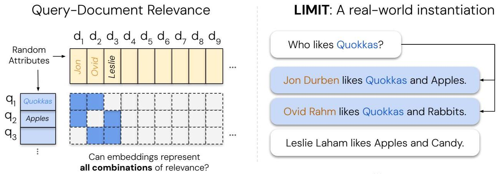  
Figure 1 | A depiction of the LIMIT dataset creation process, based on theoretical limitations. We test all combinations of relevance for  \(N\)  documents (i.e. in the figure, all combinations of relevance for three documents with two relevant documents per query) and instantiate it using a simple mapping. Despite this simplicity, SoTA MTEB models perform poorly, scoring less than 20 recall@100.

vector representations in geometric space, there exists well- studied fields of mathematical research [Papadimitriou and Sipser, 1982] that could be used to analyze these representations.

Our work aims to bridge this gap, connecting known theoretical results in geometric algebra with modern advances in neural information retrieval. We draw upon research in communication complexity theory to provide a lower bound on the embedding dimension needed to represent a given combination of relevant documents and queries. Specifically, we show that for a given embedding dimension  \(d\)  there exists top-  \(k\)  combinations of documents that cannot be returned- - no matter the query- - highlighting a theoretical and fundamental limit to embedding models.

To show that this theoretical limit is true for any retrieval model or training dataset, we test a setting where the vectors themselves are directly optimized with the test data. This allows us to empirically show how the embedding dimension enables the solving of retrieval tasks. We find there exists a crucial point for each embedding dimension  \((d)\)  where the number of documents is too large for the embedding dimension to encode all combinations. We then gather these crucial points for a variety of  \(d\)  and show that this relationship can be modeled empirically with a polynomial function.

We also go one step further and construct a realistic but simple dataset based on these theoretical limitations (called LIMIT). Despite the simplicity of the task (e.g., who likes Apples? and Jon likes Apples, ..., we find it is very difficult for even state- of- the- art embedding models [Lee et al., 2025, Zhang et al., 2025] on MTEB [Enevoldsen et al., 2025] due to the theoretical underpinnings, and impossible1 for models with small embedding dimensions.

Overall, our work contributes: (1) a theoretical basis for the fundamental limitations of embedding models, (2) a best- case empirical analysis showing that this proof holds for any dataset instantiation (by free embedding optimization), and (3) a simple real- world natural language instantiation called LIMIT that even state- of- the- art embedding models cannot solve.

These results imply interesting findings for the community: on one hand we see neural embedding models becoming immensely successful. However, academic benchmarks test only a small amount of the queries that could be issued (and these queries are often overfitted to), hiding these limitations. Our work shows that as the tasks given to embedding models require returning ever- increasing combinations of top-  \(k\)  relevant documents (e.g., through instructions connecting previously unrelated

documents with logical operators), we will reach a limit of combinations they cannot represent.

Thus, the community should be aware of these limitations, both when designing evaluations (as LIMIT shows) and by choosing alternative retrieval approaches - such as cross- encoders or multi- vector models - when attempting to create models that can handle the full range of instruction- based queries, i.e. any query and relevance definition.

## 2. Related Work

### 2.1. Neural Embedding Models

There has been immense progress on embedding models in recent years [Lee et al., 2019, Craswell et al., 2020, BehnamGhader et al., 2024], moving from simple web search (text- only) to advanced instruction- following and multi- modal representations. These models generally followed advances in language models, such as pre- trained LMs [Hoffmann et al., 2022], multi- modal LMs [Li et al., 2024, Team, 2024], and advances in instruction- following [Zhou et al., 2023, Ouyang et al., 2022]. Some of the prominent examples in retrieval include CoPali [Faysse et al., 2024] and DSE [Ma et al., 2024] which focus on multimodal embeddings, Instructor [Su et al., 2022] and FollowIR [Weller et al., 2024a] for instruction following, and GritLM [Muennighoff et al., 2024] and Gemini Embeddings [Lee et al., 2025] for pre- trained LMs turned embedders.

Our work, though focused solely on textual representations for simplicity, applies to all modalities of single vector embeddings for any domain of dataset. As the space of things to represent grows (through instructions or multi- modality) they will increasingly run into these theoretical limitations.

### 2.2. Empirical tasks pushing the limits of dense retrieval

Retrieval models have been pushed beyond their initial use cases to handle a broad variety of areas. Notable works include efforts to represent a wide group of domains [Thakur et al., 2021, Lee et al., 2024], a diverse set of instructions [Weller et al., 2024a, Zhou et al., 2024, Oh et al., 2024], and to handle reasoning over the queries [Xiao et al., 2024, Su et al., 2024]. This has pushed the focus of embedding models from basic keyword matching to embeddings that can represent the full semantic meaning of language. As such, it is more common than ever to connect what were previously unrelated documents into the top-  \(k\)  relevant set,2 increasing the number of combinations that models must be able to represent. This has motivated our interest in understanding the limits of what embeddings can represent, as current work expects it to handle every task.

Previous work has explored empirically the limits of models: Reimers and Gurevych [2020] showed that smaller dimension embedding models have more false positives, especially with larger- scale corpora. Ormazabal et al. [2019] showed the empirical limitations of models in the cross- lingual setting and Yin and Shen [2018] showed how embedding dimensions relate to the bias- variance tradeoff. In contrast, our work provides a theoretical connection between the embedding dimension and the sign- rank of the query relevance (qrel) matrix, while also showing empirical limitations.

### 2.3. Theoretical Limits of Vectors in Geometric Space

Understanding and finding nearest neighbors in semantic space has a long history in mathematics research, with early work such as the Voronoi diagram being studied as far back as 1644 and formalized in 1908 [Voronoi, 1908]. The order- k version of the Voronoi diagram (i.e. the Voronoi diagram

depicting the set of closest k points) is an obvious analog to information retrieval and has been studied for many years [Clarkson, 1988]. However, proofs placing a bound on the count of the number of regions in the order- k Voronoi problem are notoriously different to bound tightly and do not provide much practical insight for IR [Bohler et al., 2015, Lee, 1982, Chen et al., 2023].

We approach this problem from another angle by proving that the set of the constraints implied by the top-  \(k\)  retrieval problem can be formalized to show that it places a lower bound on the dimensionality of the embedding needed to represent it. We then show that this dimensionality can be much larger than the dimensionality of embedding models for practical IR problems. This approach relies on previous work in the communication complexity theory community to place bounds using the sign- rank of a matrix. Due to the difficulty of computing the sign- rank, we rely on known previous work that has already proven the sign- rank of known matrices [Hatami et al., 2022, Alon et al., 2014, Chierichetti et al., 2017, Chattopadhyay and Mande, 2018, Hatami and Hatami, 2024]. Our results also provide a proof of a method that can place a lower bound on the sign rank through what we call free embeddings in §4 (i.e. if it can be solved, then the dimension  \(d\)  is  \(\leq\)  to the sign rank).

## 3. Representational Capacity of Vector Embeddings

In this section we prove the implication of known results from communication complexity theory to the setting of vector embeddings.

### 3.1. Formalization

We consider a set of  \(m\)  queries and  \(n\)  documents with a ground- truth relevance matrix  \(A\in \{0,1\}^{m\times n}\)  where  \(A_{ij} = 1\)  if and only if document  \(j\)  is relevant to query  \(i.^3\)  Vector embedding models map each query to a vector  \(u_{i}\in \mathbb{R}^{d}\)  and each document to a vector  \(\upsilon_{j}\in \mathbb{R}^{d}\)  . Relevance is modeled by the dot product  \(u_{i}^{T}\upsilon_{j}\)  , with the goal that relevant documents should score higher than irrelevant ones.

Concatenating the vectors for queries in a matrix  \(U\in \mathbb{R}^{d\times m}\)  and those for documents in a matrix  \(V\in \mathbb{R}^{d\times n}\)  , these dot products are the entries of the score matrix  \(B = U^{T}V\)  . The smallest embedding dimension  \(d\)  that can realize a given score matrix is, by definition, the rank of  \(B\)  . Therefore, our goal is equivalent to finding the minimum rank of a score matrix  \(B\)  that correctly orders documents according to the relevance specified in  \(A\)  , which we formalize in the following definition.

Definition 1. Given a matrix  \(A\in \mathbb{R}^{m\times n}\)  , the row- wise order- preserving rank of  \(A\)  is the smallest integer  \(d\)  such that there exists a rank-  \(d\)  matrix  \(B\)  that preserves the relative order of entries in each row of  \(A\)  . We denote this as

\(\mathrm{rank}_{\mathrm{rop}}A = \min \{\mathrm{rank}B\mid B\in \mathbb{R}^{m\times n}\)  , such that for all  \(i,j,k,\)  if  \(A_{ij} > A_{ik}\)  then  \(B_{ij} > B_{ik}\}\)

In other words, if  \(A\)  is a binary ground- truth relevance matrix,  \(\mathrm{rank}_{\mathrm{rop}}A\)  is the minimum dimension necessary for any vector embedding model to return relevant documents before irrelevant ones for all queries. Alternatively, we might require that the scores of relevant documents can be cleanly separated from those of irrelevant ones by a threshold.

Definition 2. Given a binary matrix  \(A\in \{0,1\}^{m\times n}\)  ..

The row- wise thresholdable rank of  \(A\) \((\mathrm{rank}_{\mathrm{rt}}A)\)  is the minimum rank of a matrix  \(B\)  for which there exist row- specific thresholds  \(\{\tau_{i}\}_{i = 1}^{m}\)  such that for all  \(i,j,B_{ij} > \tau_{i}\)  if  \(A_{ij} = 1\)  and  \(B_{ij}< \tau_{i}\)  if  \(A_{ij} = 0\)

- The globally thresholdable rank of  \(A\) \(\mathrm{(rank_{gt}A)}\)  is the minimum rank of a matrix  \(B\)  for which there exists a single threshold  \(\tau\)  such that for all  \(i,j,\) \(B_{ij} > \tau\)  if  \(A_{ij} = 1\)  and  \(B_{ij}< \tau\)  if  \(A_{ij} = 0\)

Remark 1. This two- sided separation condition may be seen as slightly stronger than requiring,  \(B_{ij} > \tau_i\)  if and only if  \(A_{ij} = 1\)  , however since there are only finitely many elements of  \(B_{ij}\)  we could always perturb the latter threshold by a sufficient number such that the two- sided condition holds.4

### 3.2. Theoretical Bounds

For binary matrices, row- wise ordering and row- wise thresholding are equivalent notions of representational capacity.

Proposition 1. For a binary matrix  \(A\in \{0,1\}^{m\times n}\)  we have that  \(\mathrm{rank}_{rop}A = \mathrm{rank}_{rt}A\)

Proof.  \((\leq)\)  Suppose  \(B\)  and  \(\tau\)  satisfy the row- wise thresholdable rank condition. Since  \(A\)  is a binary matrix  \(A_{ij} > A_{ik}\)  implies  \(A_{ij} = 1\)  and  \(A_{ik} = 0\)  , thus  \(B_{ij} > \tau_i > B_{ik}\)  , and hence  \(B\)  also satisfies the row- wise order- preserving condition.

\((\geq)\)  Let  \(B\)  satisfy the row- wise order- preserving condition, so  \(A_{ij} > A_{ik}\)  implies  \(B_{ij} > B_{ik}\)  . For each row  \(i\)  , let  \(U_{i} = \{B_{ij}\mid A_{ij} = 1\}\)  and  \(L_{i} = \{B_{ij}\mid A_{ij} = 0\}\)  . The row- wise order- preserving condition implies that every element of  \(U_{i}\)  is greater than every element of  \(L_{i}\)  . We can therefore always find a threshold  \(\tau_{i}\)  separating them (e.g.  \(\tau_{i} = (\mathrm{max}L_{i} + \mathrm{min}U_{i}) / 2\)  if both are non- empty, trivial otherwise). Thus  \(B\)  is also row- wise thresholdable to  \(A\)

The notions we have described so far are closely related to the sign rank of a matrix, which we use in the rest of the paper to establish our main bounds.

Definition 3 (Sign Rank). The sign rank of a matrix  \(M\in \{- 1,1\}^{m\times n}\)  is the smallest integer  \(d\)  such that there exists a rank  \(d\)  matrix  \(B\in \mathbb{R}^{m\times n}\)  whose entries have the same sign as those of  \(M\)  , i.e.

\(\mathrm{rank}_{\pm}M = \min \{\mathrm{rank}B\mid B\in \mathbb{R}^{m\times n}\)  such that for all  \(i,j\)  we have sign  \(B_{ij} = M_{ij}\}\)

In what follows, we use  \(\mathbf{1}_n\)  to denote the  \(n\)  - dimensional vector of ones, and  \(\mathbf{1}_{m\times n}\)  to denote an  \(m\times n\)  matrix of ones.

Proposition 2. Let  \(A\in \{0,1\}^{m\times n}\)  be a binary matrix. Then  \(2A - \mathbf{1}_{m\times n}\in \{- 1,1\}^{m\times n}\)  and we have

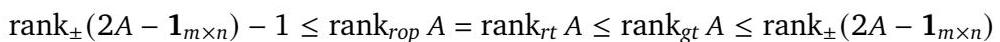

Proof. N.b. the equality was already established in Proposition 1. We prove each inequality separately.

1.  \(\mathrm{rank}_{\mathrm{rt}}A\leq \mathrm{rank}_{\mathrm{gt}}A\)  : True by definition, since any matrix satisfying the globally thresholdable condition trivially satisfies a row-wise thresholdable condition with the same threshold for each row.

2.  \(\mathrm{rank}_{\mathrm{gt}}A\leq \mathrm{rank}_{\pm}(2A - \mathbf{1}_{m\times n})\)  : Let  \(B\)  be any matrix whose entries have the same sign as  \(2A - \mathbf{1}_{m\times n}\)

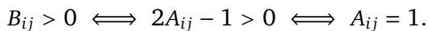

Thus  \(B\)  satisfies the globally thresholdable condition with a threshold of 0.

3.  \(\mathrm{rank}_{\pm}(2A - \mathbf{1}_{m\times n}) - 1\leq \mathrm{rank}_{\mathrm{rt}}A\)  : Suppose  \(B\)  satisfies the row-wise thresholding condition with minimal rank, so  \(\mathrm{rank}_{\mathrm{rt}}A = \mathrm{rank}B\)  and there exists  \(\tau \in \mathbb{R}^{m}\)  such that  \(B_{ij} > \tau_i\)  if  \(A_{ij} = 1\)  and  \(B_{ij}< \tau_i\)  if  \(A_{ij} = 0\)  . Then the entries of  \(B - \tau \mathbf{1}_n^T\)  have the same sign as  \(2A - \mathbf{1}_{m\times n}\)  , since  \((B - \tau \mathbf{1}_n^T)_{ij} = B_{ij} - \tau_i\)  and

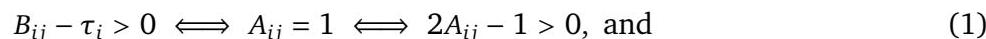

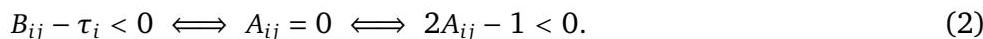

Thus  \(\mathrm{rank}_{\pm}(2A - \mathbf{1}_{m\times n})\leq \mathrm{rank}(B - \tau \mathbf{1}_n^T)\leq \mathrm{rank}(B) + \mathrm{rank}(\tau \mathbf{1}_n^T) = \mathrm{rank}_{\mathrm{rt}}A + 1.\)

Combining these gives the desired chain of inequalities.

### 3.3. Consequences

In the context of a vector embedding model, this provides a lower and upper bound on the dimension of vectors required to exactly capture a given set of retrieval objectives, in the sense of row- wise ordering, row- wise thresholding, or global thresholding. In particular, given some binary relevance matrix  \(A\in \{0,1\}^{m\times n}\)  , we need at least  \(\mathrm{rank}_{\pm}(2A - \mathbf{1}_{m\times n}) - 1\)  dimensions to capture the relationships in  \(A\)  exactly, and can always accomplish this in at most  \(\mathrm{rank}_{\pm}(2A - \mathbf{1}_{m\times n})\)  dimensions.

Practically, this means:

1. For any fixed dimension  \(d\)  , there exists a binary relevance matrix which cannot be captured via  \(d\)  -dimensional embeddings (as there are matrices with arbitrarily high sign-rank). In other words, retrieval tasks whose qrel matrices have higher sign-rank are more difficult to capture exactly for embedding models, requiring higher embedding dimensions. 
2. If we are able to embed a given matrix  \(A\in \{0,1\}^{m\times n}\)  in a row-wise order-preserving manner in  \(d\)  dimensions, this implies a bound on the sign rank of  \(2A - \mathbf{1}_{m\times n}\)  . In particular, this suggests a practical mechanism for determining an upper-bound on sign-rank for matrices via gradient descent optimization of free embedding representations.

## 4. Empirical Connection: Best Case Optimization

We have now established a theoretical limitation of embedding models based on the sign- rank of the qrel matrix and their embedding dimension  \(d\)  . Now we seek to show that this empirically as well.

To show the strongest optimization case possible, we design experiments where the vectors themselves are directly optimizable with gradient descent.5 We call this "free embedding" optimization, as the embeddings are free to be optimized and not constrained by natural language, which imposes constraints on any realistic embedding model. Thus, this shows whether it is feasible for any embedding model to solve this problem: if the free embedding optimization cannot solve the problem, real retrieval models will not be able to either. It is also worth noting that we do this by directly optimizing the embeddings over the target qrel matrix (test set). This will not generalize to a new dataset, but is done to show the highest performance that could possibly occur.

Experimental Settings We create a random document matrix (size  \(n\)  ) and a random query matrix with top-  \(\cdot k\)  sets (of all combinations, i.e. size  \(m=\binom{n}{k}\)  ), both with unit vectors. We then directly optimize for solving the constraints with the Adam optimizer [Kingma and Ba, 2014].6 Each gradient update is a full pass through all correct triples (i.e. full dataset batch- size) with the InfoNCE loss function

[Oord et al., 2018],7 with all other documents as in- batch negatives (i.e. full dataset in batch). As nearly all embedding models use normalized vectors, we do also (normalizing after updates). We perform early stopping when there is no improvement in the loss for 1000 iterations. We gradually increase the number of documents (and thus the binomial amount of queries) until the optimization is no longer able to solve the problem (i.e. achieve  \(100\%\)  accuracy). We call this the critical-  \(n\)  point.

We focus on relatively small sizes for  \(n\) ,  \(k\) , and  \(d\)  due to the combinatorial explosion of combinations with larger document values (i.e. 50k docs with top-  \(k\)  of 100 gives  \(7.7\mathrm{e} + 311\)  combinations, which would be equivalent to the number of query vectors of dimension  \(d\)  in that free embedding experiment). We use  \(k = 2\)  and increase  \(n\)  by one for each  \(d\)  value until it breaks. We fit a polynomial regression line to the data so we can model and extrapolate results outwards.

Results Figure 2 shows that the curve fits a 3rd degree polynomial curve, with formula  \(y = - 10.5322 + 4.0309d + 0.0520d^2 + 0.0037d^3\) \((r^2 = 0.999)\) . Extrapolating this curve outward gives the critical-  \(n\)  values (for embedding size): 500k (512), 1.7m (768), 4m (1024), 107m (3072), 250m (4096). We note that this is the best case: a real embedding model cannot directly optimize the query and document vectors to match the test qrel matrix (and is constrained by factors such as "modeling natural language"). However, these numbers already show that for web- scale search, even the largest embedding dimensions with ideal test- set optimization are not enough to model all combinations.

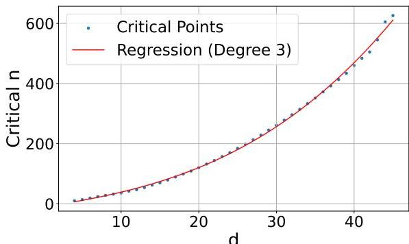  
Figure 2 | The critical-n value where the dimensionality is too small to successfully represent all the top-2 combinations. We plot the trend line as a polynomial function.

## 5. Empirical Connection: Real-World Datasets

The free embedding experiments provide empirical evidence that our theoretical results hold true. However, they still are abstract - what does this mean for real embedding models? In this section we (1) draw connections from this theory to existing datasets and (2) create an trivially simple yet extremely difficult retrieval task for existing SOTA models.

### 5.1. Connection to Existing Datasets

Existing retrieval datasets typically use a static evaluation set with limited numbers of queries, as relevance annotation is expensive to do for each query. This means practically that the space of queries used for evaluation is a very small sample of the number of potential queries. For example, the QUEST dataset [Malaviya et al., 2023] has 325k documents and queries with 20 relevant documents per query, with a total of 3357 queries. The number of unique top- 20 document sets that could be returned with the QUEST corpus would be  \(\binom{325k}{20}\)  which is equal to  \(7.1\mathrm{e} + 91\)  (larger than the estimate of atoms in the observable universe,  \(10^{82}\) ). Thus, the 3k queries in QUEST can only cover an infinitesimally small part of the qrel combination space.

Although it not possible to instantiate all combinations when using large- scale corpora, search evaluation datasets are a proxy for what any user would ask for and ideally would be designed to test many combinations, as users will do. In many cases, developers of new evaluations simply choose to use fewer queries due to cost or computational expense of evaluation. For example, QUEST's query "Novels from 1849 or George Sand novels" combines two categories of novels with the "OR" operator – one could instantiate new queries to relate concepts through OR'ing other categories together. Similarly, with the rise of search agents, we see greater usage of hyper- specific queries: BrowseComp [Wei et al., 2025] has  \(5+\)  conditions per query, including range operators. With these tools, it is possible to sub- select any top-  \(k\)  relevant set with the right operators if the documents are sufficiently expressive (i.e. non- trivial). Thus, that existing datasets choose to only instantiate some of these combinations is mainly for practical reasons and not because of a lack of existence.

In contrast to these previous works, we seek to build a dataset that evaluates all combinations of top-  \(k\)  sets for a small number of documents. Rather than using difficult query operators like QUEST, BrowseComp, etc. (which are already difficult for reasons outside of the qrel matrix) we choose very simple query and documents to highlight the difficulty of representing all top-  \(k\)  sets themselves.

### 5.2. The LIMIT Dataset

Dataset Construction In order to have a natural language version of this dataset, we need some way to map combinations of documents into something that could be retrieved with a query. One simple way to do this is to create a synthetic version with latent variables for queries and documents and then instantiate it with natural language. For this mapping, we choose to use attributes that someone could like (i.e. Jon likes Hawaiian pizza, sports cars, etc.) as they are plentiful and don't present issues w.r.t. other items: one can like Hawaiian pizza but dislike pepperoni, all preferences are valid. We then enforce two constraints for realism: (1) users shouldn't have too many attributes, thus keeping the documents short (less than 50 per user) and (2) each query should only ask for one item to keep the task simple (i.e. "who likes X"). We gather a list of attributes a person could like through prompting Gemini 2.5 Pro. We then clean it to a final 1850 items by iteratively asking it to remove duplicates/hypernyms, while also checking the top failures with BM25 to ensure no overlap.

We choose to use  \(50k\)  documents in order to have a hard but relatively small corpus and 1000 queries to maintain statistical significance while still being fast to evaluate. For each query, we choose to use two relevant documents (i.e.  \(k = 2\) ), both for simplicity in instantiating and to mirror previous work (i.e. NQ, HotpotQA, etc. [Kwiatkowski et al., 2019, Yang et al., 2018]).

Our last step is to choose a qrel matrix to instantiate these attributes. Although we could not prove the hardest qrel matrix definitively with theory (as the sign rank is notoriously hard to prove), we speculate based on intuition that our theoretical results imply that the more interconnected the qrel matrix is (e.g. dense with all combinations) the harder it would be for models to represent. Following this, we use the qrel matrix with the highest number of documents for which all combinations would be just above 1000 queries for a top-  \(k\)  of 2 (46 docs, since  \(\binom{46}{2}\)  is 1035, the smallest above 1k).

We then assign random natural language attributes to the queries, adding these attributes to their respective relevant documents (c.f. Figure 1). We give each document a random first and last name from open- source lists of names. Finally, we randomly sample new attributes for each document until all documents have the same number of attributes. As this setup has many more documents than those that are relevant to any query (46 relevant documents, 49.95k non- relevant to any query) we also create a "small" version with only the 46 documents that are relevant to one of the 1000 queries.

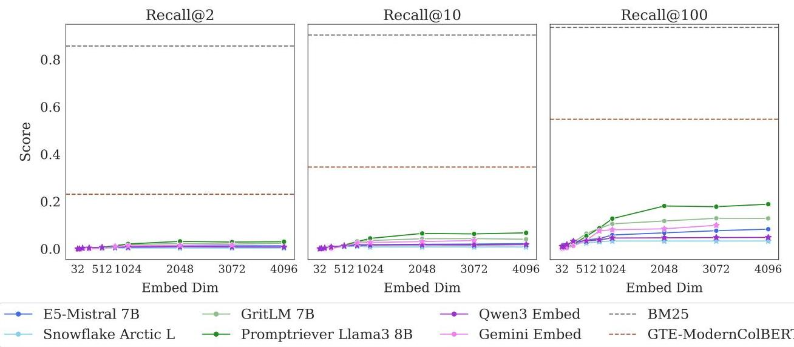  
Figure 3 | Scores on the LIMIT task. Despite the simplicity of the task we see that SOTA models struggle. We also see that the dimensionality of the model is a limiting factor and that as the dimension increases, so does performance. Even multi-vector models struggle. Lexical models like BM25 do very well due to their higher dimensionality. Stars indicate models trained with MRL.

Models We evaluate the state- of- the- art embedding models including GritLM [Muennighoff et al., 2024], Qwen 3 Embeddings [Zhang et al., 2025], Promptriever [Weller et al., 2024b], Gemini Embeddings [Lee et al., 2025], Snowflake's Arctic Embed Large v2.0 [Yu et al., 2024], and E5- Mistral Instruct [Wang et al., 2022, 2023]. These models range in embedding dimension (1024 to 4096) as well as in training style (instruction- based, hard negative optimized, etc.). We also evaluate three non- single vector models to show the distinction: BM25 [Robertson et al., 1995, Lu, 2024], gte- ModernColBERT [Chaffin, 2025, Chaffin and Sourty, 2024], and a token- wise TF- IDF.9

We show results at the full embedding dimension and also with truncated embedding dimension (typically used with matryosnka learning, aka MRL [Kusupati et al., 2022]). For models not trained with MRL this will result in sub- par scores, thus, models trained with MRL are indicating with stars in the plots. However, as there are no LLMs with an embedding dimension smaller than 384, we include MRL for all models to small dimensions (32) to show the impact of embedding dimensionality.

Results Figure 3 shows the results on the full LIMIT while Figure 4 shows the results on the small (46 document) version. The results are surprising - models severely struggle even though the task is trivially simple. For example, in the full setting models struggle to reach even  \(20\%\)  recall@100 and in the 46 document version models cannot solve the task even with recall@20.

We see that model performance depends crucially on the embedding dimensionality (better performance with bigger dimensions). Interestingly, models trained with more diverse instruction, such as Promptriever, perform better, perhaps because their training allows them to use more of their embedding dimensions (compared to models which are trained with MRL and on a smaller range of tasks that can perhaps be consolidated into a smaller embedding manifold).

For alternative architectures, GTE- ModernColBERT does significantly better than single- vector

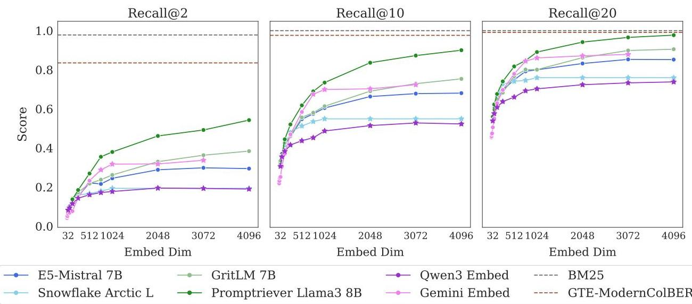  
Figure 4 | Scores on the LIMIT small task  \((N = 46)\)  over embedding dimensions. Despite having just 46 documents, model struggle even with recall@10 and cannot solve the task even with recall@20.

models (although still far from solving the task) while BM25 comes close to perfect scores. Both of these alternative architectures (sparse and multi- vector) offer various trade- offs, see §5.6 for analysis.

### 5.3. Is this Domain Shift?

Although our queries look similar to standard web search queries, we wondered whether there could be some domain shift causing the low performance. If so, we would expect that training on a training set of similar examples would significantly improve performance. On the other hand, if the task was intrinsically hard, training on the training set would provide little help whereas training on the test set would allow the model to overfit to those tokens (similar to the free parameterized experiments).

To test this we take an off the shelf embedding model and train it on either the training set (created synthetically using non- test set attributes) or the official test set of LIMIT. We use lightonai/modernbert- embed- large and fine- tune it on these splits, using the full dataset for in batch negatives (excluding positives) using SentenceTrans formers [Reimers and Gurevych, 2019]. We show a range of dimensions by projecting the hidden layer down to the specified size during training (rather than using MRL).

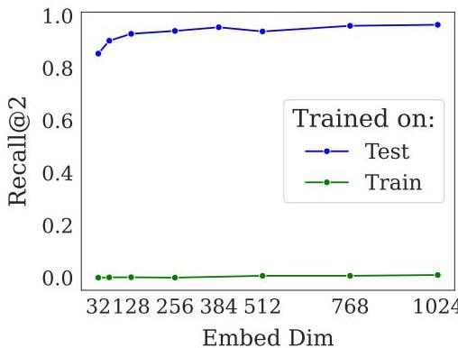  
Figure 5 | Training on LIMIT train does not significantly help, indicating the issue is not domain shift. But models can solve it if they overfit to the test set.

Results Figure 5 shows the model trained on the training set cannot solve the problem, although it does see very minor improvement from near zero recall@10 to up to 2.8 recall@10. The lack of performance gains when training in- domain indicate that poor performance is not due to domain shift. By training the model on the test set we see it can learn the task, overfitting on the tokens in the test queries. This aligns with our free embedding results, that it is possible to overfit to the  \(N = 46\)  version with only 12 dimensions. However, it is notable that the real embedding model with 64 dimensions still cannot completely solve the task, indicating that real world models are multiple

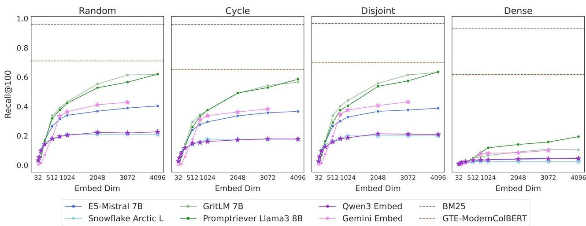  
Figure 6 | Model results from LIMIT datasets created with different qrel patterns. The dense qrel pattern that uses the maximum number of combinations is significantly harder than the other patterns. Note that the "dense" version is the main LIMIT shown in Figure 3.

times more limited than free- embeddings, exacerbating the limitations shown in Figure 2.

### 5.4. Effects of Qrel Patterns

As mentioned in previous sections, the crucial difference that makes LIMIT hard is that it tests models on more combinations of documents than typically used. Although this makes intuitive sense, here we ablate this decision and show that methods that do not test as many combinations (i.e. when the qrels are represented as a graph, have lower graph density) are easier empirically.

Experiment Setup We instantiate LIMIT from four different qrel patterns: (1) random sampling from all combinations (2) a cycle- based setup where the next query is relevant to one document from the previous query and the following next document, (3) a disjoint pattern where each query is relevant to two new documents and (4) the pattern that maximizes the number of connections (n choose k) for the largest number of documents that fit in the query set (dense, our standard setup). For all configurations, we use the same setup as the main LIMIT (50k docs, 1k queries,  \(k = 2\) , etc).

Results We see in Figure 6 that all patterns except dense have relatively similar performance. However, moving to dense shows strikingly lower scores across the board for all models: GritLM drops 50 absolute recall@100, whereas E5- Mistral has an almost 10x reduction (40.4 vs 4.8 recall@100).

### 5.5. Correlation with MTEB

BEIR (used in MTEB v1) [Thakur et al., 2021, Muennighoff et al., 2022] has frequently been cited as something that embedding models have overfit to [Weller et al., 2025b, Thakur et al., 2025]. We compare performance on LIMIT to BEIR in Figure 7. We see that performance is generally not correlated and that smaller models (like Arctic Embed) do worse on both, likely due to embedding dimension and pre- trained model knowledge.

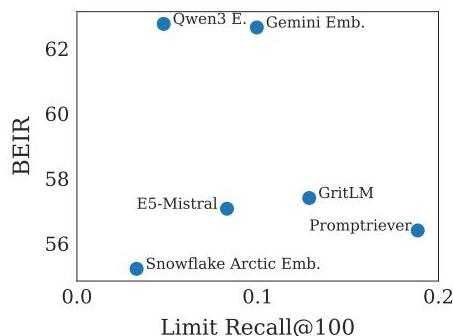  
Figure 7 | No obvious correlation between BEIR vs LIMIT.

### 5.6. Alternatives to Embedding Models

Our previous results show both theoretically and empirically that embedding models cannot represent all combinations of documents in their top-  \(\cdot k\)  sets, making them unable to represent and solve some retrieval tasks. As current embedding models have grown larger (e.g. up to 4096), this has helped reduce negative effects for smaller dataset sizes. However, with enough combinations of top-  \(\cdot k\)  sets the dimensionality would have to increase to an infeasible size for non- toy datasets.

Thus, our results show an interesting tradeoff: embeddings can represent a large amount of combinations but not all combinations. Although they are useful for first stage results to a degree, more expressive retriever architectures will be needed. We briefly discuss some of these below.

Cross- Encoders Although not suitable for first stage retrieval at scale, they are already typically used to improve first stage results. However, is LIMIT challenging for rerankers also?

We evaluate a long context reranker, Gemini- 2.5- Pro [Comanici et al., 2025] on the small setting as a comparison. We give Gemini all 46 documents and all 1000 queries at once, asking it to output the relevant documents for each query with one generation. We find that it can successfully solve  \((100\%)\)  all 1000 queries in one forward pass. This is in contrast to even the best embedding models with a recall  \(a2\)  of less than  \(60\%\)  (Figure 4). Thus we can see that LIMIT is simple for state- of- the- art reranker models as they do not have the same limitations based on embedding dimension. However, they still have the limitation of being more computationally expensive than embedding models and thus cannot be used for first stage retrieval when there are large numbers of documents.

Multi- vector models Multi- vector models are more expressive through the use of multiple vectors per sequence combined with the MaxSim operator [Khattab and Zaharia, 2020]. These models show promise on the LIMIT dataset, with scores greatly above the single- vector models despite using a smaller backbone (ModernBERT, Warner et al. [2024]). However, these models are not generally used for instruction- following or reasoning- based tasks, leaving it an open question to how well multi- vector techniques will transfer to these more advanced tasks.

Sparse models Sparse models (both lexical and neural versions) can be thought of as single vector models but with very high dimensionality. This dimensionality helps BM25 avoid the problems of the neural embedding models as seen in Figure 3. Since the  \(d\)  of their vectors is high, they can scale to many more combinations than their dense vector counterparts. However, it is less clear how to apply sparse models to instruction- following and reasoning- based tasks where there is no lexical or even paraphrase- like overlap. We leave this direction to future work.

## 6. Conclusion

6. ConclusionWe introduce the LIMIT dataset, which highlights the fundamental limitations of embedding models. We provide a theoretical connection that shows that embedding models cannot represent all combinations of top- \(k\)  documents until they have a large enough embedding dimension  \(d\) . We show these theoretical results hold empirically as well, through best case optimization of the vectors themselves. We then make a practical connection to existing state-of-the-art models by creating a simple natural language instantiation of the theory, called LIMIT, that these models cannot solve. Our results imply that the community should consider how instruction-based retrieval will impact retrievers, as there will be combinations of top- \(k\)  documents cannot represent.

### Limitations

Although our experiments provide theoretical insight for the most common type of embedding model (single vector) they do not hold necessarily for other architectures, such as multi- vector models. Although we showed initial empirical results with non- single vector models, we leave it to future work to extend our theoretical connections to these settings.

We also did not show theoretical results for the setting where the user allows some mistakes, e.g. capturing only the majority of the combinations. We leave putting a bound on this scenario to future work and would invite the reader to examine works like Ben- David et al. [2002].

We have showed the theoretical connection that proves that some combinations cannot be represented by embedding models, however, we cannot prove apriori which types of combinations they will fail on. Thus, it is possible that there are some instruction- following or reasoning tasks they can solve perfectly, however, we do know that there exists some tasks that they will never be able to solve.

### Acknowledgments

AcknowledgmentsWe thank Tanmaya Dabral, Zhongli Ding, Anthony Chen, Ming- Wei Chang, Kenton Lee, and Kristina Toutanova for their helpful feedback.

### References

ReferencesN. Alon, S. Moran, and A. Yehudayoff. Sign rank, vc dimension and spectral gaps. In Electronic Colloquium on Computational Complexity (ECCC), volume 21, page 10, 2014. P. BehnamGhader, V. Adlakha, M. Mosbach, D. Bahdanau, N. Chapados, and S. Reddy. Llm2vec: Large language models are secretly powerful text encoders. arXiv preprint arXiv:2404.05961, 2024. S. Ben- David, N. Eiron, and H. U. Simon. Limitations of learning via embeddings in euclidean half spaces. Journal of Machine Learning Research, 3(Nov):441- 461, 2002. C. Bohler, P. Cheilaris, R. Klein, C.- H. Liu, E. Papadopoulou, and M. Zavershynskyi. On the complexity of higher order abstract voronoi diagrams. Computational Geometry, 48(8):539- 551, 2015. ISSN 0925- 7721. doi: https://doi.org/10.1016/j.comgeo.2015.04.008. URL https://www.sciencedirect.com/science/article/pii/S0925772115000346. A. Chaffin. Gte- moderncolbert, 2025. URL https://huggingface.co/lightonai/GTE- ModernColBERT- v1. A. Chaffin and R. Sourty. Pylate: Flexible training and retrieval for late interaction models, 2024. URL https://github.com/lightonai/pylate. A. Chattopadhyay and N. Mande. A short list of equalities induces large sign rank. In 2018 IEEE 59th Annual Symposium on Foundations of Computer Science (FOCS), pages 47- 58. IEEE, 2018. B. Y. Chen, H. Huang, H.- P. Chen, W. Liu, X.- Y. Chen, and T. Jia. Efficient algorithm for constructing order k voronoi diagrams in road networks. ISPRS International Journal of Geo- Information, 12(4): 172, 2023. F. Chierichetti, S. Gollapudi, R. Kumar, S. Lattanzi, R. Panigrahy, and D. P. Woodruff. Algorithms for  \(\ell_p\)  low- rank approximation. In International Conference on Machine Learning, pages 806- 814. PMLR, 2017.

K. 
L. Clarkson. Applications of random sampling in computational geometry, ii. In Proceedings of the fourth annual symposium on Computational geometry, pages 1-11, 1988.G. Comanici, 
E. Bieber, 
M. Schaekermann, 
I. Pasupat, 
N. Sachdeva, 
I. Dhillon, 
M. Blistein, 
O. Ram, 
D. Zhang, 
E. Rosen, et al. Gemini 2.5: Pushing the frontier with advanced reasoning, multimodality, long context, and next generation agentic capabilities. arXiv preprint arXiv:2507.06261, 2025.N. Craswell, 
B. Mitra, 
E. Yilmaz, 
D. Campos, and 
E. 
M. Voorhees. Overview of the trec 2019 deep learning track. arXiv preprint arXiv:2003.07820, 2020.K. Enevoldsen, 
I. Chung, 
I. Kerboua, 
M. Kardos, 
A. Mathur, 
D. Stap, 
J. Gala, 
W. Siblini, 
D. Krzemiński, 
G. 
I. Winata, et al. Mmteb: Massive multilingual text embedding benchmark. arXiv preprint arXiv:2502.13595, 2025.M. Faysse, 
H. Sibille, 
T. Wu, 
B. Omrani, 
G. Viaud, 
C. Hudelot, and 
P. Colombo. Colpali: Efficient document retrieval with vision language models. arXiv preprint arXiv:2407.01449, 2024.H. Hatami and 
P. Hatami. Structure in communication complexity and constant-cost complexity classes. arXiv preprint arXiv:2401.14623, 2024.H. Hatami, 
P. Hatami, 
W. Pires, 
R. Tao, and 
R. Zhao. Lower bound methods for sign-rank and their limitations. In Approximation, Randomization, and Combinatorial Optimization. Algorithms and Techniques (APPROX/RANDOM 2022), pages 22-1. Schloss Dagstuhl-Leibniz-Zentrum für Informatik, 2022.J. Hoffmann, 
S. Borgeaud, 
A. Mensch, 
E. Buchatskaya, 
T. Cai, 
E. Rutherford, 
D. 
d. 
L. Casas, 
L. 
A. Hendricks, 
J. Welbl, 
A. Clark, et al. Training compute-optimal large language models. arXiv preprint arXiv:2203.15556, 2022.G. Izacard, 
M. Caron, 
L. Hosseini, 
S. Riedel, 
P. Bojanowski, 
A. Joulin, and 
E. Grave. Unsupervised dense information retrieval with contrastive learning. arXiv preprint arXiv:2112.09118, 2021.O. Khattab and 
M. Zaharia. Colbert: Efficient and effective passage search via contextualized late interaction over bert. In Proceedings of the 43rd International ACM SIGIR conference on research and development in Information Retrieval, pages 39-48, 2020.D. 
P. Kingma and 
J. Ba. Adam: A method for stochastic optimization. arXiv preprint arXiv:1412.6980, 2014.A. Kusupati, 
G. Bhatt, 
A. Rege, 
M. Wallingford, 
A. Sinha, 
V. Ramanujan, 
W. Howard-Snyder, 
K. Chen, 
S. Kakade, 
P. Jain, et al. Maryyoshka representation learning. Advances in Neural Information Processing Systems, 35:30233-30249, 2022.T. Kwiatkowski, 
J. Palomaki, 
O. Redfield, 
M. Collins, 
A. Parikh, 
C. Alberti, 
D. Epstein, 
I. Polosukhin, 
J. Devlin, 
K. Lee, et al. Natural questions: a benchmark for question answering research. Transactions of the Association for Computational Linguistics, 7:453-466, 2019.D.-T. Lee. On k-nearest neighbor voronoi diagrams in the plane. IEEE transactions on computers, 100 (6):478-487, 1982.J. Lee, 
Z. Dai, 
X. Ren, 
B. Chen, 
D. Cer, 
J. 
R. Cole, 
K. Hui, 
M. Boratko, 
R. Kapadia, 
W. Ding, et al. Gecko: Versatile text embeddings distilled from large language models. arXiv preprint arXiv:2403.20327, 2024.

J. Lee, 
F. Chen, 
S. Dua, 
D. Cer, 
M. Shanbhogue, 
I. Naim, 
G. 
H. Abrego, 
Z. Li, 
K. Chen, 
H. 
S. Vera, et al. Gemini embedding: Generalizable embeddings from gemini. arXiv preprint arXiv:2503.07891, 2025.K. Lee, 
M.-W. Chang, and 
K. Toutanova. Latent retrieval for weakly supervised open domain question answering. In 
A. Korhonen, 
D. Traum, and 
L. Marquez, editors, Proceedings of the 57th Annual Meeting of the Association for Computational Linguistics, pages 6086-6096, Florence, Italy, July 2019. Association for Computational Linguistics. doi: 10.18653/v1/P19-1612. URL https://aclanthology.org/P19-1612/.C. Li, 
Z. Gan, 
Z. Yang, 
J. Yang, 
L. Li, 
L. Wang, 
J. Gao, et al. Multimodal foundation models: From specialists to general-purpose assistants. Foundations and Trends® in Computer Graphics and Vision, 16(1-2):1-214, 2024.X. 
H. Lu. Bm25s: Orders of magnitude faster lexical search via eager sparse scoring. arXiv preprint arXiv:2407.03618, 2024.X. Ma, 
S.-C. Lin, 
M. Li, 
W. Chen, and 
J. Lin. Unifying multimodal retrieval via document screenshot embedding. arXiv preprint arXiv:2406.11251, 2024.C. Malaviya, 
P. Shaw, 
M.-W. Chang, 
K. Lee, and 
K. Toutanova. Quest: A retrieval dataset of entity-seeking queries with implicit set operations. arXiv preprint arXiv:2305.11694, 2023.N. Muennighoff, 
N. Tazi, 
L. Magee, and 
N. Reimers. Mteb: Massive text embedding benchmark. arXiv preprint arXiv:2210.07316, 2022.N. Muennighoff, 
S. Hongjin, 
L. Wang, 
N. Yang, 
F. Wei, 
T. Yu, 
A. Singh, and 
D. Kiela. Generative representational instruction tuning. In ICLR 2024 Workshop: How Far Are We From AGI, 2024.H. Oh, 
H. Lee, 
S. Ye, 
H. Shin, 
H. Jang, 
C. Jun, and 
M. Seo. Instructir: A benchmark for instruction following of information retrieval models. arXiv preprint arXiv:2402.14334, 2024.A. 
v. 
d. Oord, 
Y. Li, and 
O. Vinyals. Representation learning with contrastive predictive coding. arXiv preprint arXiv:1807.03748, 2018.A. Ormazabal, 
M. Artetxe, 
G. Labaka, 
A. Soroa, and 
E. Agirre. Analyzing the limitations of cross-lingual word embedding mappings. arXiv preprint arXiv:1906.05407, 2019.L. Ouyang, 
J. Wu, 
X. Jiang, 
D. Almeida, 
C. Wainwright, 
P. Mishkin, 
C. Zhang, 
S. Agarwal, 
K. Slama, 
A. Ray, et al. Training language models to follow instructions with human feedback. Advances in neural information processing systems, 35:27730-27744, 2022.C. 
H. Papadimitriou and 
M. Sipser. Communication complexity. In Proceedings of the fourteenth annual ACM symposium on Theory of computing, pages 196-200, 1982.N. Reimers and 
I. Gurevych. Sentence-bert: Sentence embeddings using siamese bert-networks. In Proceedings of the 2019 Conference on Empirical Methods in Natural Language Processing. Association for Computational Linguistics, 11 2019. URL https://arxiv.org/abs/1908.10084.N. Reimers and 
I. Gurevych. The curse of dense low-dimensional information retrieval for large index sizes. arXiv preprint arXiv:2012.14210, 2020.S. 
E. Robertson, 
S. Walker, 
S. Jones, 
M. 
M. Hancock-Beaulieu, 
M. Gatford, et al. Okapi at trec-3. Nist Special Publication Sp, 109:109, 1995.

T. Song, 
G. Gan, 
M. Shang, and 
Y. Zhao. Ifir: A comprehensive benchmark for evaluating instruction-following in expert-domain information retrieval. arXiv preprint arXiv:2503.04644, 2025.H. Su, 
W. Shi, 
J. Kasai, 
Y. Wang, 
Y. Hu, 
M. Ostendorf, 
W.-t. Yih, 
N. 
A. Smith, 
L. Zettlemoyer, and 
T. Yu. One embedder, any task: Instruction-finetuned text embeddings. arXiv preprint arXiv:2212.09741, 2022.H. Su, 
H. Yen, 
M. Xia, 
W. Shi, 
N. Muennighoff, 
H.-y. Wang, 
H. Liu, 
Q. Shi, 
Z. 
S. Siegel, 
M. Tang, et al. Bright: A realistic and challenging benchmark for reasoning-intensive retrieval. arXiv preprint arXiv:2407.12883, 2024.C. Team. Chameleon: Mixed-modal early-fusion foundation models. arXiv preprint arXiv:2405.09818, 2024.N. Thakur, 
N. Reimers, 
A. Ruckle, 
A. Srivastava, and 
I. Gurevych. Beir: A heterogenous benchmark for zero-shot evaluation of information retrieval models. arXiv preprint arXiv:2104.08663, 2021.N. Thakur, 
J. Lin, 
S. Havens, 
M. Carbin, 
O. Khattab, and 
A. Drozdov. Freshstack: Building realistic benchmarks for evaluating retrieval on technical documents. arXiv preprint arXiv:2504.13128, 2025.G. Voronoi. Nouvelles applications des paramètres continus à la théorie des formes quadratiques. deuxième mémoire. recherches sur les paralléloèdres primitifs. Journal für die reine und angewandte Mathematik (Crelles Journal), 1908(134):198-287, 1908.D. Wadden, 
S. Lin, 
K. Lo, 
L. 
L. Wang, 
M. van Zuylen, 
A. Cohan, and 
H. Hajishirzi. Fact or fiction: Verifying scientific claims. arXiv preprint arXiv:2004.14974, 2020.L. Wang, 
N. Yang, 
X. Huang, 
B. Jiao, 
L. Yang, 
D. Jiang, 
R. Majumder, and 
F. Wei. Text embeddings by weakly-supervised contrastive pre-training. arXiv preprint arXiv:2212.03533, 2022.L. Wang, 
N. Yang, 
X. Huang, 
L. Yang, 
R. Majumder, and 
F. Wei. Improving text embeddings with large language models. arXiv preprint arXiv:2401.00368, 2023.B. Warner, 
A. Chaffin, 
B. Clavié, 
O. Weller, 
O. Hallström, 
S. Taghadouini, 
A. Gallagher, 
R. Biswas, 
F. Ladhak, 
T. Aarsen, et al. Smarter, better, faster, longer: A modern bidirectional encoder for fast, memory efficient, and long context finetuning and inference. arXiv preprint arXiv:2412.13663, 2024.J. Wei, 
Z. Sun, 
S. Papay, 
S. McKinney, 
J. Han, 
I. Fulford, 
H. 
W. Chung, 
A. 
T. Passos, 
W. Fedus, and 
A. Glaese. Browsecomp: A simple yet challenging benchmark for browsing agents. arXiv preprint arXiv:2504.12516, 2025.O. Weller, 
B. Chang, 
S. MacAvaney, 
K. Lo, 
A. Cohan, 
B. Van Durme, 
D. Lawrie, and 
L. Soldaini. Followir: Evaluating and teaching information retrieval models to follow instructions. arXiv preprint arXiv:2403.15246, 2024a.O. Weller, 
B. Van Durme, 
D. Lawrie, 
A. Paranjape, 
Y. Zhang, and 
J. Hessel. Promptriever: Instruction-trained retrievers can be prompted like language models. arXiv preprint arXiv:2409.11136, 2024b.O. Weller, 
B. Chang, 
E. Yang, 
M. Yarmohammadi, 
S. Barham, 
S. MacAvaney, 
A. Cohan, 
L. Soldaini, 
B. Van Durme, and 
D. Lawrie. mfollowir: a multilingual benchmark for instruction following in retrieval. arXiv preprint arXiv:2501.19264, 2025a.

O. Weller, 
K. Ricci, 
E. Yang, 
A. Yates, 
D. Lawrie, and 
B. Van Durme. Rank1: Test-time compute for reranking in information retrieval. arXiv preprint arXiv:2502.18418, 2025b.

C. Xiao, 
G. 
T. Hudson, and 
N. 
A. Moubayed. Rar-b: Reasoning as retrieval benchmark. arXiv preprint arXiv:2404.06347, 2024.

Z. Yang, 
P. Qi, 
S. Zhang, 
Y. Bengio, 
W. 
W. Cohen, 
R. Salakhutdinov, and 
C. 
D. Manning. Hotpotqa: A dataset for diverse, explainable multi-hop question answering. arXiv preprint arXiv:1809.09600, 2018.

Z. Yin and 
Y. Shen. On the dimensionality of word embedding. Advances in neural information processing systems, 31, 2018.

P. Yu, 
L. Merrick, 
G. Nuti, and 
D. Campos. Arctic-embed 2.0: Multilingual retrieval without compromise. arXiv preprint arXiv:2412.04506, 2024.

Y. Zhang, 
M. Li, 
D. Long, 
X. Zhang, 
H. Lin, 
B. Yang, 
P. Xie, 
A. Yang, 
D. Liu, 
J. Lin, 
F. Huang, and 
J. Zhou. Qwen3 embedding: Advancing text embedding and reranking through foundation models. arXiv preprint arXiv:2506.05176, 2025.

J. Zhou, 
T. Lu, 
S. Mishra, 
S. Brahma, 
S. Basu, 
Y. Luan, 
D. Zhou, and 
L. Hou. Instruction-following evaluation for large language models. arXiv preprint arXiv:2311.07911, 2023.

J. Zhou, 
Y. Zheng, 
W. Chen, 
Q. Zheng, 
Z. Shang, 
W. Zhang, 
R. Meng, and 
X. Shen. Beyond content relevance: Evaluating instruction following in retrieval models. ArXiv, abs/2410.23841, 2024. URL https://api.semanticscholar.org/CorpusID:273707185.

## 7. Using the Triangle Inequality to Provide Theoretical Limits

It is tempting to use the triangle inequality to show that embedding models have theoretical limitations. This is true for metric spaces, however, vector search often uses cosine similarity which operates in non- metric space. Thus, for realistic scenarios, we cannot use the triangle inequality to bound what embedding models can represent.

## 8. Relationship to Order-K Voronoi Regions

We also provide an explanation for how our results compare to Clarkson [1988] which put bounds on the number of regions in the order-  \(k\)  Voronoi graph. The order-  \(k\)  Voronoi graph is defined as the set of points having a particular set of  \(n\)  points in  \(S\)  as its  \(n\)  nearest neighbors. This maps nicely to retrieval, as each order-  \(k\)  region is equivalent to one retrieved set of top-  \(k\)  results. Then the count of unique regions in the Voronoi graph is the total number of combinations that could be returned for those points. However, creating an empirical order-  \(k\)  Voronoi graph is computationally infeasible for  \(d > 3\) , and theoretically it is hard to bound tightly. Thus we use a different approach for showing the limitations of embedding models, through the use of the sign- rank.

## 9. Hyperparameter and Compute Details

Inference We use the default length settings for evaluating models using the MTEB framework [Enevoldsen et al., 2025]. As our dataset has relatively short documents (around 100 tokens), this does not cause an issue.

Training For training on the LIMIT training and test set we use the SentenceTransformers library [Reimers and Gurevych, 2019] using the MultipleNegativesRankingLoss. We use a full dataset batch size and employ the no duplicates sampler to ensure that no in- batch negatives are duplicates of the positive docs. We use a learning rate of 5e- 5. We train for 5 epochs and limit the training set slightly to the size of the test set (from 2.5k to 2k examples, matching test).

Compute Inference and training for LIMIT is done with A100 GPUs on Google Colab Pro. The free embedding experiments are done mainly on H100 GPUs and TPU v5's for larger size  \(N\)  to accommodate higher VRAM for full- dataset batch vector optimization.

## 10. Metrics Measuring Qrel Graph Density

We show two metrics that treat the qrel matrix as a graph and show that LIMIT has unique properties compared to standard IR datasets (Table 1). We call these metrics Graph Density and Average Query Strength and describe them below.

Graph Density We use the qrel matrix to construct the graph, where nodes are documents and an edge exists between two documents if they are both relevant to at least one common query.

For a given graph  \(G = (V,E)\)  with  \(V\)  being the set of nodes and  \(E\)  being the set of edges, the graph density is defined as the ratio of the number of edges in the graph to the maximum possible number of edges. For an undirected graph, the maximum possible number of edges is  \(\frac{|V|(|V| - 1)}{2}\) . Thus, the density  \(\rho\)  is calculated as:

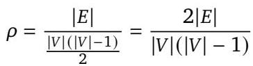

This metric indicates how connected the graph is; a density of 1 signifies a complete graph (all possible edges exist), while a density close to 0 indicates a sparse graph. For a qrel dataset, the

Average Query Strength In a query- query graph where nodes are queries and edges represent similarity between queries (e.g., Jaccard similarity of their relevant documents), the strength of a query node  \(i\) , denoted  \(s_i\) , is defined as the sum of the weights of all edges incident to it. If  \(w_{ij}\)  is the weight of the edge between query  \(i\)  and query  \(j\) , and  \(N(i)\)  is the set of neighbors of query  \(i\) , then the strength is:

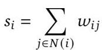

The Average Query Strength  \(\bar{s}\)  is the mean of these strengths across all query nodes in the graph:

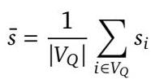

where  \(V_{Q}\)  is the set of all query nodes in the graph. This metric provides an overall measure of how strongly connected queries are to each other on average within the dataset, based on their shared relevant documents.

Comparisons to other datasets We compare with standard IR Datasets such as NQ [Kwiatkowski et al., 2019], HotpotQA [Yang et al., 2018], and SciFact [Wadden et al., 2020]. We also show an instruction- following dataset, FollowIR Core17 [Weller et al., 2024a]. For all datasets, we use the test set only. The results in Table 1 show that LIMIT has significantly higher values for both of these metrics (i.e. 28 for query similarity compared to 0.6 or lower for the others).

Table 1 | Metrics measuring the density of the qrel matrix. We see that LIMIT is significantly higher than other datasets, but that the closest are instruction- following datasets such as Core17 from FollowIR. Our empirical ablations suggest (although cannot definitively prove) that datasets with higher values here will be harder for retrieval models to represent.

# 11. Table Forms of Figures

In this section we show the table form of various figures. For Figure 3 it is Table 5, Figure 4 in Table 4, Figure 2 in Table 6, Figure 5 in Table 2, and Figure 6 in Table 3.

Table 2 | Fine-tuning results in table form. See Figure 5 for the comparable plot.  

Table 3 | Results for various qrel patterns. See Figure 6 for the comparable plot.  
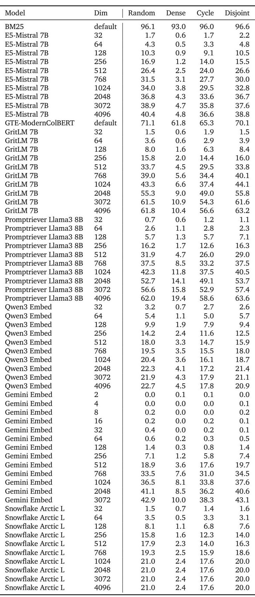

Table 4 | Results for the LIMIT small version. See comparable Figure 4.  
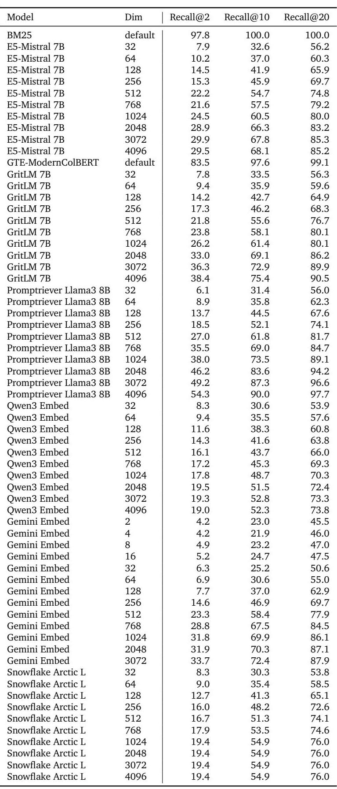

Table 5 | Results on LIMIT. See comparable Figure 3.  
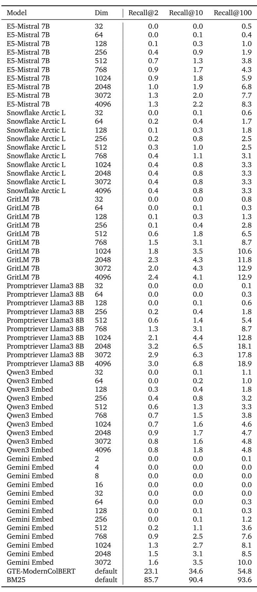

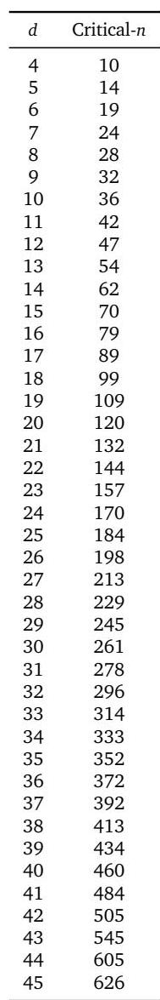
Table 6 | Critical Values of n for different d values in the Free Embedding optimization experiments. See Figure 2 for the corresponding figure.

Table 7 | BEIR vs LIMIT results. See Figure 7 for the comparable plot.  
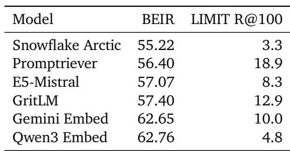
