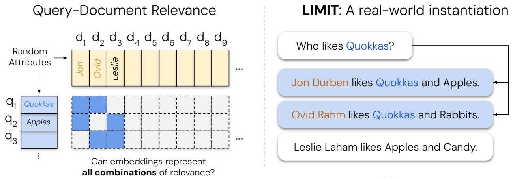
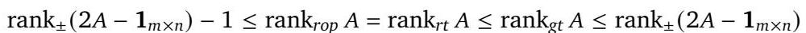
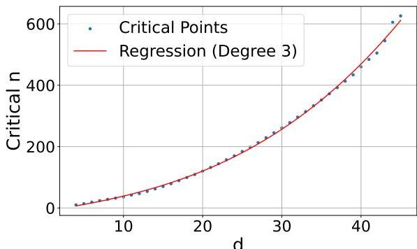
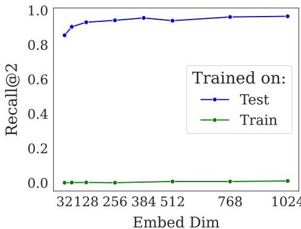
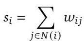
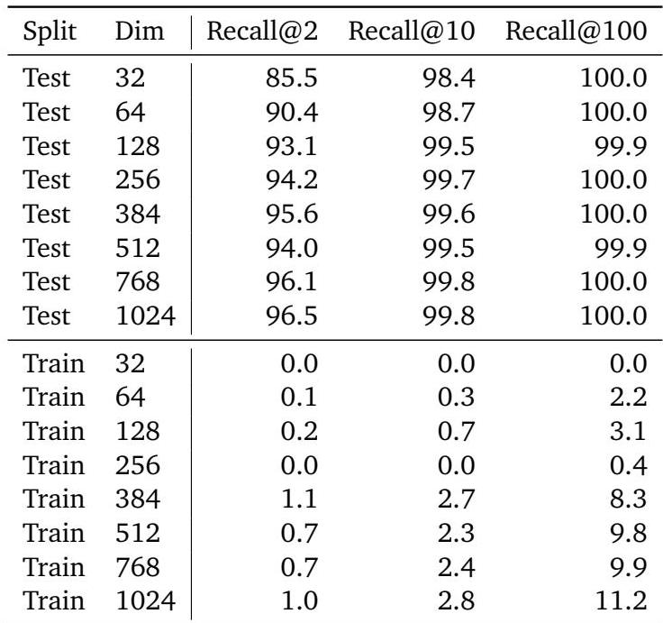
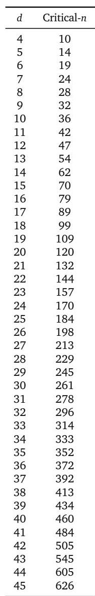

# 關於基於嵌入的檢索之理論限制

Orion Weller*,1,2, Michael Boratko1, Iftekhar Naim1 和 Jinhyuk Lee1 1Google DeepMind, 2Johns Hopkins University

多年來，向量嵌入被賦予了越來越多的檢索任務，近期更興起將其用於推理、指令遵循、程式碼撰寫等領域。這些新的基準測試推動嵌入技術應對任何查詢和任何給定的相關性概念。儘管先前的研究已經指出了向量嵌入的理論限制，但人們普遍認為這些困難僅僅是由於不切實際的查詢，而那些非不切實際的查詢可以透過更好的訓練資料和更大的模型來克服。在本研究中，我們證明即使在非常簡單的查詢的現實設定下，我們也可能會遇到這些理論限制。我們結合學習理論中的已知結果，顯示能夠作為某些查詢結果的頂部 \(k\) 文件子集的數量受到嵌入維度的限制。我們憑經驗證明，即使我們將 \(k = 2\) 並使用自由參數化嵌入直接在測試集上進行最佳化，這一點也同樣成立。然後，我們根據這些理論結果建立了一個名為 LIMIT 的現實資料集，用於對模型進行壓力測試，並觀察到即使是最先進的模型也無法應對這個任務，儘管任務本質上很簡單。我們的研究顯示了現有單向量範式下嵌入模型的極限，並呼籲未來的研究開發能夠解決這一根本限制的方法。

## 1. 前言

在過去的二十年裡，資訊檢索 (IR) 已經從以稀疏技術 (例如 BM25 [Robertson et al., 1995]) 為主導的模型轉變為使用神經語言模型 (LM) 作為其骨幹的模型 [Lee et al., 2019, Craswell et al., 2020, Izacard et al., 2021, Wang et al., 2022]。這些神經模型主要以單向量能力使用，它們輸出一個單一嵌入來表示整個輸入 (也稱為密集檢索)。這些嵌入模型能夠泛化到新的檢索資料集，並被賦予了解決日益複雜的檢索問題 [Thakur et al., 2021, Enevoldsen et al., 2025, Lee et al., 2025]。

近年來，隨著指令遵循檢索基準的興起，這一點被進一步推動，模型被要求表示任何查詢的任何相關性定義 [Weller et al., 2025a,b, Song et al., 2025, Xiao et al., 2024, Su et al., 2024]。例如，QUEST 資料集 [Malaviya et al., 2023] 使用邏輯運算子來組合不同的概念，研究複雜查詢的檢索難度 (例如，「瓜德羅普島的飛蛾或昆蟲或節肢動物」)。另一方面，像 BRIGHT [Su et al., 2024] 這樣的資料集則透過需要推理的方式定義相關性，來探索不同相關性定義所帶來的挑戰。其中一個子任務包括對一個給定的 Leetcode 問題 (查詢) 進行推理，以找到共享一個子任務的其他 Leetcode 問題 (例如，其他使用動態規劃的問題)。儘管模型尚未能解決這些基準測試，但社群提出這些問題是為了突破密集檢索器的能力界限——現在它被隱含地期望能解決所有可能定義的任務。

與其提出經驗基準來衡量嵌入模型的能力，我們更希望從一個更基本的層面來理解它們的限制。由於嵌入模型在幾何空間中使用向量表示，因此存在著經過充分研究的數學研究領域 [Papadimitriou and Sipser, 1982]，可以用來分析這些表示。

圖 1 | LIMIT 資料集創建過程的描述，基於理論限制。我們測試了所有 \(N\) 個文件的所有相關性組合 (即圖中，三個文件每查詢有兩個相關文件的所有相關性組合)，並使用一個簡單的映射來實例化它。儘管如此簡單，但 MTEB 的 SoTA 模型表現不佳，召回率@100 得分低於 20。

我們的研究旨在彌合這一差距，將幾何代數中的已知理論結果與神經資訊檢索的現代進展聯繫起來。我們利用通訊複雜性理論的研究，為表示給定文件和查詢組合所需的嵌入維度提供一個下限。具體來說，我們證明對於給定嵌入維度 \(d\)，存在一些頂部 \(k\) 的文件組合是無法作為某些查詢的結果返回的——無論查詢是什麼——這突顯了嵌入模型的一個理論和根本限制。

為了證明這個理論限制對於任何檢索模型或訓練資料集都成立，我們測試了一個設定，其中向量本身可以直接使用測試資料進行最佳化。這使我們能夠憑經驗顯示嵌入維度如何實現檢索任務的解決。我們發現對於每個嵌入維度 \((d)\) 都存在一個關鍵點，即文件的數量對於嵌入維度來說太大，無法編碼所有組合。然後，我們收集了各種 \(d\) 的這些關鍵點，並顯示這種關係可以透過多項式函數憑經驗建模。

我們還更進一步，基於這些理論限制建構了一個既現實又簡單的資料集 (稱為 **LIMIT**)。儘管任務很簡單 (例如，誰喜歡蘋果？而 Jon 喜歡蘋果…)，我們發現即使是 MTEB [Enevoldsen et al., 2025] 上最先進的嵌入模型 [Lee et al., 2025, Zhang et al., 2025] 也感到非常困難，這是由於其理論基礎所致，對於嵌入維度較小的模型來說更是**不可能**的。

總體而言，我們的研究貢獻了：(1) 嵌入模型基本限制的理論基礎，(2) 顯示此證明對於任何資料集實例化都成立的最佳情況經驗分析 (透過自由嵌入最佳化)，以及 (3) 一個簡單的真實世界自然語言實例化，稱為 **LIMIT**，即使是最先進的嵌入模型也無法解決。

這些結果對社群有著有趣的啟示：一方面，我們看到神經嵌入模型變得極為成功。然而，學術基準測試只測試了可以發出的少量查詢 (而且這些查詢通常是過度擬合的)，隱藏了這些限制。我們的研究顯示，隨著賦予嵌入模型的任務需要返回越來越多的頂部 \(k\) 相關文件組合 (例如，透過使用邏輯運算子將先前不相關的文件連接起來的指令)，我們將達到它們無法表示的組合極限。

因此，社群應該意識到這些限制，無論是在設計評估時 (如 LIMIT 所示)，還是在試圖創建可以處理全方位基於指令的查詢 (即任何查詢和相關性定義) 的模型時，都應選擇替代的檢索方法——例如**交叉編碼器**或**多向量模型**。

## 2. 相關工作

### 2.1. 神經嵌入模型

近年來，嵌入模型取得了巨大進展 [Lee et al., 2019, Craswell et al., 2020, BehnamGhader et al., 2024]，從簡單的網路搜尋 (僅限文字) 發展到高級的指令遵循和多模態表示。這些模型通常遵循語言模型的進展，例如**預訓練 LM** [Hoffmann et al., 2022]、**多模態 LM** [Li et al., 2024, Team, 2024]，以及**指令遵循**的進展 [Zhou et al., 2023, Ouyang et al., 2022]。檢索中的一些突出範例包括 CoPali [Faysse et al., 2024] 和 DSE [Ma et al., 2024]，它們專注於多模態嵌入；Instructor [Su et al., 2022] 和 FollowIR [Weller et al., 2024a] 用於指令遵循；以及 GritLM [Muennighoff et al., 2024] 和 Gemini Embeddings [Lee et al., 2025] 用於將預訓練 LM 轉變為嵌入器。

儘管我們的研究為了簡單起見，只專注於**文字**表示，但它適用於任何資料集領域的所有**單向量嵌入**模式。隨著要表示的事物空間 (透過指令或多模態) 的增長，它們將越來越多地遇到這些理論限制。

### 2.2. 挑戰密集檢索極限的經驗任務

檢索模型已被推動超越其初始用例，以處理廣泛的領域。值得注意的工作包括努力表示廣泛的領域群組 [Thakur et al., 2021, Lee et al., 2024]、多樣化的指令集 [Weller et al., 2024a, Zhou et al., 2024, Oh et al., 2024]，以及處理對查詢的推理 [Xiao et al., 2024, Su et al., 2024]。這使得嵌入模型的焦點從基本的關鍵字匹配轉向能夠表示語言的完整語義。因此，將先前不相關的文件連接到頂部 \(k\) 相關集合變得比以往任何時候都更常見，這增加了模型必須能夠表示的組合數量。這激發了我們對理解嵌入所能表示的極限的興趣，因為目前的工作期望它能處理所有任務。

先前的工作已經透過經驗探索了模型的極限：Reimers 和 Gurevych [2020] 顯示，較小維度嵌入模型有更多的假陽性，尤其是在較大語料庫中。Ormazabal et al. [2019] 顯示了模型在跨語言設定中的經驗限制，而 Yin 和 Shen [2018] 則顯示了嵌入維度與偏差-變異權衡的關係。相比之下，我們的工作提供了嵌入維度與查詢相關性 (qrel) 矩陣的符號秩之間的理論聯繫，同時也顯示了經驗限制。

### 2.3. 幾何空間中向量的理論限制

理解和在語義空間中尋找最近鄰居在數學研究中歷史悠久，早期的研究如 Voronoi 圖早在 1644 年就已被研究，並於 1908 年形式化 [Voronoi, 1908]。Voronoi 圖的 k 階版本 (即描述最近 k 個點的集合的 Voronoi 圖) 是資訊檢索的一個明顯類比，並已被研究多年 [Clarkson, 1988]。然而，對於 k 階 Voronoi 問題中區域數量的嚴格界限證明是眾所周知的困難，並且沒有為 IR 提供太多實際見解 [Bohler et al., 2015, Lee, 1982, Chen et al., 2023]。

我們從另一個角度來處理這個問題，證明了由頂部 \(k\) 檢索問題所暗示的約束集可以被形式化，以顯示它對表示它所需的嵌入維度設定了一個下限。然後，我們證明對於實際的 IR 問題，這個維度可能比嵌入模型的維度大得多。這種方法依賴於通訊複雜性理論社群中先前的研究，以使用矩陣的符號秩來設定界限。由於計算符號秩的難度，我們依賴於已經證明了已知矩陣符號秩的先前工作 [Hatami et al., 2022, Alon et al., 2014, Chierichetti et al., 2017, Chattopadhyay and Mande, 2018, Hatami and Hatami, 2024]。我們的結果還提供了一種可以透過我們在 §4 中稱為**自由嵌入**的方法來設定符號秩下限的證明 (即，如果可以解決，則維度 \(d\) \(\leq\) 符號秩)。

## 3. 向量嵌入的表示能力

在本節中，我們證明了通訊複雜性理論中已知結果對向量嵌入設定的影響。

### 3.1. 形式化

我們考慮一組 \(m\) 個查詢和 \(n\) 個文件，以及一個真實相關性矩陣 \(A\in \{0,1\}^{m\times n}\)，其中當且僅當文件 \(j\) 與查詢 \(i\) 相關時，\(A_{ij} = 1\)。向量嵌入模型將每個查詢映射到一個向量 \(u_{i}\in \mathbb{R}^{d}\)，並將每個文件映射到一個向量 \(\upsilon_{j}\in \mathbb{R}^{d}\)。相關性由點積 \(u_{i}^{T}\upsilon_{j}\) 建模，其目標是使相關文件的分數應高於不相關的文件。

將查詢向量串聯在矩陣 \(U\in \mathbb{R}^{d\times m}\) 中，並將文件向量串聯在矩陣 \(V\in \mathbb{R}^{d\times n}\) 中，這些點積是分數矩陣 \(B = U^{T}V\) 的條目。可以實現給定分數矩陣的最小嵌入維度 \(d\) 根據定義是 \(B\) 的**秩**。因此，我們的目標等同於找到分數矩陣 \(B\) 的最小秩，該矩陣根據 \(A\) 中指定的相關性正確地對文件進行排序，我們在以下定義中將其形式化。

**定義 1.** 給定一個矩陣 \(A\in \mathbb{R}^{m\times n}\)，**逐行保持順序秩** \(\mathrm{rank}_{\mathrm{rop}}A\) 是最小的整數 \(d\)，使得存在一個秩為 \(d\) 的矩陣 \(B\)，該矩陣保持 \(A\) 中每行的條目的相對順序。我們將其表示為

\(\mathrm{rank}_{\mathrm{rop}}A = \min \{\mathrm{rank}B\mid B\in \mathbb{R}^{m\times n}\)，使得對於所有 \(i,j,k\)，如果 \(A_{ij} > A_{ik}\) 則 \(B_{ij} > B_{ik}\}\)

換句話說，如果 \(A\) 是一個二元真實相關性矩陣，\(\mathrm{rank}_{\mathrm{rop}}A\) 是任何向量嵌入模型為了對所有查詢返回相關文件在不相關文件之前所需的最小維度。或者，我們可能要求相關文件的分數可以透過一個閾值與不相關文件的分數明確分離。

**定義 2.** 給定一個二元矩陣 \(A\in \{0,1\}^{m\times n}\)...

- \(A\) 的**逐行可閾值化秩** \((\mathrm{rank}_{\mathrm{rt}}A)\) 是矩陣 \(B\) 的最小秩，使得存在逐行特定的閾值 \(\{\tau_{i}\}_{i = 1}^{m}\)，對於所有 \(i,j\) ，當 \(A_{ij} = 1\) 時，\(B_{ij} > \tau_{i}\)；當 \(A_{ij} = 0\) 時，\(B_{ij}< \tau_{i}\)。
- \(A\) 的**全域可閾值化秩** \((\mathrm{rank_{gt}A})\) 是矩陣 \(B\) 的最小秩，使得存在一個單一閾值 \(\tau\)，對於所有 \(i,j\)，當 \(A_{ij} = 1\) 時，\(B_{ij} > \tau\)；當 \(A_{ij} = 0\) 時，\(B_{ij}< \tau\)。

**備註 1.** 這種雙邊分離條件可能被視為比要求 \(B_{ij} > \tau_i\) 當且僅當 \(A_{ij} = 1\) 略強，然而由於 \(B_{ij}\) 只有有限個元素，我們總是可以將後者的閾值擾動足夠的數量，使得雙邊條件成立。

### 3.2. 理論界限

對於二元矩陣，逐行排序和逐行閾值化是等價的表示能力概念。

**命題 1.** 對於一個二元矩陣 \(A\in \{0,1\}^{m\times n}\)，我們有 \(\mathrm{rank}_{rop}A = \mathrm{rank}_{rt}A\)。

**證明.** \((\leq)\) 假設 \(B\) 和 \(\tau\) 滿足逐行可閾值化秩條件。由於 \(A\) 是一個二元矩陣，\(A_{ij} > A_{ik}\) 意味著 \(A_{ij} = 1\) 和 \(A_{ik} = 0\)，因此 \(B_{ij} > \tau_i > B_{ik}\)，所以 \(B\) 也滿足逐行保持順序的條件。

\((\geq)\) 令 \(B\) 滿足逐行保持順序的條件，因此 \(A_{ij} > A_{ik}\) 意味著 \(B_{ij} > B_{ik}\)。對於每一行 \(i\)，令 \(U_{i} = \{B_{ij}\mid A_{ij} = 1\}\) 和 \(L_{i} = \{B_{ij}\mid A_{ij} = 0\}\)。逐行保持順序的條件意味著 \(U_{i}\) 的每個元素都大於 \(L_{i}\) 的每個元素。因此，我們總是可以找到一個閾值 \(\tau_{i}\) 來分離它們 (例如，如果兩者都非空，\(\tau_{i} = (\mathrm{max}L_{i} + \mathrm{min}U_{i}) / 2\)，否則為平凡)。因此 \(B\) 對 \(A\) 也是逐行可閾值化的。

我們到目前為止所描述的概念與矩陣的**符號秩**密切相關，我們在論文的其餘部分使用它來建立我們的主要界限。

**定義 3 (符號秩).** 一個矩陣 \(M\in \{- 1,1\}^{m\times n}\) 的符號秩是最小的整數 \(d\)，使得存在一個秩為 \(d\) 的矩陣 \(B\in \mathbb{R}^{m\times n}\)，其條目與 \(M\) 的條目具有相同的符號，即

\(\mathrm{rank}_{\pm}M = \min \{\mathrm{rank}B\mid B\in \mathbb{R}^{m\times n}\) 使得對於所有 \(i,j\) 我們有 \(\mathrm{sign} B_{ij} = M_{ij}\}\)

在接下來的部分中，我們使用 \(\mathbf{1}_n\) 來表示 \(n\) 維的全一向量，並使用 \(\mathbf{1}_{m\times n}\) 來表示一個 \(m\times n\) 的全一矩陣。

**命題 2.** 令 \(A\in \{0,1\}^{m\times n}\) 是一個二元矩陣。那麼 \(2A - \mathbf{1}_{m\times n}\in \{- 1,1\}^{m\times n}\) 並且我們有

**證明.** 注意，等式已經在命題 1 中建立。我們分別證明每個不等式。

1. \(\mathrm{rank}_{\mathrm{rt}}A\leq \mathrm{rank}_{\mathrm{gt}}A\): 根據定義為真，因為任何滿足全域可閾值化條件的矩陣都平凡地滿足具有相同閾值的逐行可閾值化條件。

2. \(\mathrm{rank}_{\mathrm{gt}}A\leq \mathrm{rank}_{\pm}(2A - \mathbf{1}_{m\times n})\): 令 \(B\) 是任何條目與 \(2A - \mathbf{1}_{m\times n}\) 具有相同符號的矩陣

因此 \(B\) 滿足閾值為 0 的全域可閾值化條件。

3. \(\mathrm{rank}_{\pm}(2A - \mathbf{1}_{m\times n}) - 1\leq \mathrm{rank}_{\mathrm{rt}}A\): 假設 \(B\) 滿足具有最小秩的逐行閾值化條件，所以 \(\mathrm{rank}_{\mathrm{rt}}A = \mathrm{rank}B\)，並且存在 \(\tau \in \mathbb{R}^{m}\)，使得當 \(A_{ij} = 1\) 時，\(B_{ij} > \tau_i\)；當 \(A_{ij} = 0\) 時，\(B_{ij}< \tau_i\)。那麼 \(B - \tau \mathbf{1}_n^T\) 的條目與 \(2A - \mathbf{1}_{m\times n}\) 具有相同的符號，因為 \((B - \tau \mathbf{1}_n^T)_{ij} = B_{ij} - \tau_i\) 且

因此 \(\mathrm{rank}_{\pm}(2A - \mathbf{1}_{m\times n})\leq \mathrm{rank}(B - \tau \mathbf{1}_n^T)\leq \mathrm{rank}(B) + \mathrm{rank}(\tau \mathbf{1}_n^T) = \mathrm{rank}_{\mathrm{rt}}A + 1\)。

將這些組合起來就得到了所需的不等式鏈。

### 3.3. 影響

在向量嵌入模型的背景下，這為精確捕捉給定檢索目標集所需的向量維度提供了下限和上限，其意義在於逐行排序、逐行閾值化或全域閾值化。特別是，給定一些二元相關性矩陣 \(A\in \{0,1\}^{m\times n}\)，我們至少需要 \(\mathrm{rank}_{\pm}(2A - \mathbf{1}_{m\times n}) - 1\) 維度來精確捕捉 \(A\) 中的關係，並且總能以最多 \(\mathrm{rank}_{\pm}(2A - \mathbf{1}_{m\times n})\) 維度來完成。

實際上，這意味著：

1. 對於任何固定維度 \(d\)，存在一個無法透過 \(d\) 維嵌入捕捉的二元相關性矩陣 (因為存在具有任意高符號秩的矩陣)。換句話說，其 qrel 矩陣具有更高符號秩的檢索任務對於嵌入模型來說更難以精確捕捉，需要更高的嵌入維度。
2. 如果我們能夠以逐行保持順序的方式將給定矩陣 \(A\in \{0,1\}^{m\times n}\) 嵌入到 \(d\) 維中，這意味著對 \(2A - \mathbf{1}_{m\times n}\) 的符號秩有一個界限。特別是，這提出了一種實用機制，透過對自由嵌入表示進行梯度下降最佳化來確定矩陣符號秩的上限。

## 4. 經驗聯繫：最佳情況最佳化

我們現在已經建立了基於 qrel 矩陣的符號秩及其嵌入維度 \(d\) 的嵌入模型理論限制。現在我們也希望在經驗上證明這一點。

為了展示可能的最強最佳化情況，我們設計了實驗，其中向量本身可以直接透過梯度下降進行最佳化。我們稱之為「**自由嵌入**」最佳化，因為嵌入可以自由地進行最佳化，並且不受自然語言的約束，而自然語言會對任何現實的嵌入模型施加約束。因此，這顯示了任何嵌入模型是否有可能解決這個問題：如果自由嵌入最佳化無法解決問題，那麼真實的檢索模型也將無法做到。還值得注意的是，我們透過直接在目標 qrel 矩陣 (測試集) 上最佳化嵌入來實現這一點。這不會泛化到新的資料集，但目的是為了顯示可能發生的最高效能。

**實驗設定** 我們創建一個隨機文件矩陣 (大小為 \(n\)) 和一個具有頂部- \(k\) 集合 (所有組合，即大小為 \(m=\binom{n}{k}\)) 的隨機查詢矩陣，兩者都是單位向量。然後我們直接使用 Adam 最佳化器 [Kingma and Ba, 2014] 來解決這些約束。每個梯度更新都是對所有正確三元組的完整傳遞 (即完整資料集批次大小)，使用 InfoNCE 損失函數 [Oord et al., 2018]，所有其他文件都作為批次內負例 (即完整資料集在批次中)。由於幾乎所有嵌入模型都使用正規化向量，我們也這樣做 (在更新後進行正規化)。當損失在 1000 次迭代中沒有改進時，我們執行提前停止。我們逐漸增加文件數量 (因此也增加了查詢的二項式數量)，直到最佳化不再能夠解決問題 (即達到 100% 準確性)。我們將此稱為**臨界- \(n\) 點**。

由於隨著文件值變大，組合會呈指數級增長 (即 50k 個文件，頂部 \(k\) 為 100，會得到 \(7.7\mathrm{e} + 311\) 個組合，這將等同於在該自由嵌入實驗中維度為 \(d\) 的查詢向量數量)，我們專注於相對較小的 \(n\)、\(k\) 和 \(d\) 大小。我們使用 \(k = 2\)，並為每個 \(d\) 值增加 \(n\) 一直到它被打破。我們對資料進行多項式迴歸擬合，以便我們能夠對結果進行建模和外推。

**結果** 圖 2 顯示曲線擬合了一個三階多項式曲線，公式為 \(y = - 10.5322 + 4.0309d + 0.0520d^2 + 0.0037d^3\) \((r^2 = 0.999)\)。將此曲線向外推斷，可以得到臨界- \(n\) 值 (對於嵌入大小)：500k (512)、1.7m (768)、4m (1024)、107m (3072)、250m (4096)。我們注意到這是最佳情況：一個真實的嵌入模型無法直接最佳化查詢和文件向量以匹配測試 qrel 矩陣 (並且受到諸如「建模自然語言」等因素的約束)。然而，這些數字已經顯示，對於網路規模的搜尋，即使是具有理想測試集最佳化的最大嵌入維度也不足以建模所有組合。

圖 2 | 當維度太小而無法成功表示所有頂部 2 組合時的臨界-n 值。我們將趨勢線繪製為多項式函數。

## 5. 經驗聯繫：真實世界資料集

自由嵌入實驗提供了經驗證據，證明我們的理論結果是真實的。然而，它們仍然是抽象的——這對真實的嵌入模型意味著什麼？在本節中，我們 (1) 將這個理論與現有資料集聯繫起來，並 (2) 創建一個對於現有 SOTA 模型來說非常簡單但極其困難的檢索任務。

### 5.1. 與現有資料集的聯繫

現有的檢索資料集通常使用靜態評估集，查詢數量有限，因為相關性註解對於每個查詢來說都是昂貴的。這意味著實際上用於評估的查詢空間只是潛在查詢數量的一個非常小的樣本。例如，QUEST 資料集 [Malaviya et al., 2023] 有 325k 個文件和查詢，每個查詢有 20 個相關文件，總共有 3357 個查詢。可以使用 QUEST 語料庫返回的唯一頂部 20 個文件集合的數量將是 \(\binom{325k}{20}\)，這等於 \(7.1\mathrm{e} + 91\) (大於可觀察宇宙中原子的估計數量 \(10^{82}\))。因此，QUEST 中的 3k 個查詢只能覆蓋 qrel 組合空間中微乎其微的一部分。

雖然在使用大規模語料庫時無法實例化所有組合，但搜尋評估資料集是任何使用者可能提出的問題的代理，理想情況下會被設計來測試多種組合，因為使用者會這樣做。在許多情況下，新評估的開發者由於成本或評估的計算開銷而選擇使用較少的查詢。例如，QUEST 的查詢「來自 1849 年的小說或 George Sand 小說」使用「OR」運算子組合了兩類小說——可以實例化新的查詢來透過 OR'ing 其他類別來關聯概念。同樣，隨著搜尋代理的興起，我們看到越來越多地使用**超特定查詢**：BrowseComp [Wei et al., 2025] 每個查詢有 5+ 條件，包括範圍運算子。有了這些工具，如果文件足夠具備表達力 (即非平凡)，則可以使用正確的運算子來子選任何頂部 \(k\) 相關集合。因此，現有資料集選擇僅實例化其中一些組合主要是出於實際原因，而不是因為它們不存在。

與這些先前的工作相反，我們試圖建立一個資料集，該資料集評估少量文件的所有頂部 \(k\) 集合組合。我們不使用像 QUEST、BrowseComp 等困難的查詢運算子 (它們已經因為 qrel 矩陣之外的原因而困難)，而是選擇非常簡單的查詢和文件，以突出表示所有頂部 \(k\) 集合本身的困難。

### 5.2. LIMIT 資料集

**資料集建構** 為了擁有這個資料集的自然語言版本，我們需要一些方法將文件的組合映射到可以透過查詢檢索的東西。一種簡單的方法是使用潛在變數為查詢和文件創建一個合成版本，然後用自然語言來實例化它。對於這種映射，我們選擇使用某人可能喜歡的屬性 (即 Jon 喜歡夏威夷披薩、跑車等)，因為它們數量豐富，並且不會對其他項目產生問題：一個人可以喜歡夏威夷披薩但討厭義大利香腸，所有偏好都是有效的。然後我們執行兩個約束以確保真實性：(1) 使用者不應該有太多屬性，從而使文件保持簡短 (每個使用者少於 50 個)；(2) 每個查詢只應詢問一個項目以保持任務簡單 (即「誰喜歡 X」)。我們透過提示 Gemini 2.5 Pro 收集了人們可能喜歡的屬性列表。然後，我們透過反覆要求它刪除重複/上位詞來清理到最終的 1850 個項目，同時也檢查了 BM25 的頂部失敗，以確保沒有重疊。

我們選擇使用 50k 個文件以擁有一個困難但相對較小的語料庫，並使用 1000 個查詢以保持統計顯著性同時仍然能夠快速評估。對於每個查詢，我們選擇使用兩個相關文件 (即 \(k = 2\))，既為了實例化的簡單性，也為了模仿先前的工作 (即 NQ、HotpotQA 等 [Kwiatkowski et al., 2019, Yang et al., 2018])。

我們的最後一步是選擇一個 qrel 矩陣來實例化這些屬性。儘管我們無法用理論明確證明最難的 qrel 矩陣 (因為符號秩出了名的難以證明)，但我們憑直覺推測，我們的理論結果意味著 qrel 矩陣越相互連接 (例如，密集且具有所有組合)，模型就越難以表示。遵循這一點，我們使用具有最多文件數量的 qrel 矩陣，其中所有組合的查詢量剛好超過 1000 個，對於頂部 \(k\) 為 2 (46 個文件，因為 \(\binom{46}{2}\) 是 1035，最小的超過 1k)。

然後我們將隨機的自然語言屬性分配給查詢，將這些屬性添加到它們各自的相關文件中 (參見圖 1)。我們從開源姓名列表中為每個文件分配一個隨機的名字和姓氏。最後，我們為每個文件隨機採樣新的屬性，直到所有文件都具有相同數量的屬性。由於此設定中相關於任何查詢的文件數量遠多於相關文件 (46 個相關文件，49.95k 個與任何查詢不相關)，我們還創建了一個「小型」版本，其中只包含與 1000 個查詢之一相關的 46 個文件。

圖 3 | LIMIT 任務上的得分。儘管任務很簡單，但我們看到 SOTA 模型很難應對。我們還看到模型的維度是一個限制因素，並且隨著維度的增加，效能也隨之增加。即使是多向量模型也舉步維艱。像 BM25 這樣的詞彙模型由於其更高的維度而表現非常好。星號表示使用 MRL 訓練的模型。

**模型** 我們評估了最先進的嵌入模型，包括 GritLM [Muennighoff et al., 2024]、Qwen 3 Embeddings [Zhang et al., 2025]、Promptriever [Weller et al., 2024b]、Gemini Embeddings [Lee et al., 2025]、Snowflake 的 Arctic Embed Large v2.0 [Yu et al., 2024]，以及 E5-Mistral Instruct [Wang et al., 2022, 2023]。這些模型的嵌入維度 (1024 到 4096) 以及訓練方式 (基於指令、硬負例最佳化等) 各不相同。我們還評估了三個非單向量模型以顯示其區別：BM25 [Robertson et al., 1995, Lu, 2024]、gte-ModernColBERT [Chaffin, 2025, Chaffin and Sourty, 2024]，以及一個逐詞 TF-IDF。

我們顯示了完整嵌入維度以及截斷嵌入維度 (通常與套娃學習，即 MRL [Kusupati et al., 2022] 一起使用) 的結果。對於沒有使用 MRL 訓練的模型，這將導致次優得分，因此，使用 MRL 訓練的模型在圖中用星號表示。然而，由於沒有嵌入維度小於 384 的 LLM，我們將所有模型都包含在 MRL 中，以顯示嵌入維度的影響。

**結果** 圖 3 顯示了完整 LIMIT 上的結果，而圖 4 顯示了小型 (46 個文件) 版本的結果。結果令人驚訝——儘管任務非常簡單，但模型嚴重掙扎。例如，在完整設定中，模型很難達到甚至 20% 的召回率@100，而在 46 個文件的版本中，即使召回率@20，模型也無法解決任務。

我們看到模型效能主要取決於嵌入維度 (維度越大，效能越好)。有趣的是，用更多樣化的指令訓練的模型，例如 Promptriever，表現更好，也許是因為它們的訓練使它們能夠使用更多的嵌入維度 (與那些使用 MRL 訓練且任務範圍較小，可能可以合併到較小嵌入流形中的模型相比)。

對於替代架構，GTE-ModernColBERT 的表現明顯優於單向量模型 (儘管仍然遠未解決任務)，而 BM25 則接近完美得分。這兩種替代架構 (稀疏和多向量) 提供了各種權衡，參見 §5.6 進行分析。

### 5.3. 這是領域遷移嗎？

儘管我們的查詢看起來與標準的網路搜尋查詢相似，但我們想知道是否可能存在某些領域遷移導致了低效能。如果是這樣，我們預計在類似範例的訓練集上進行訓練會顯著提高效能。另一方面，如果任務本質上很難，那麼在訓練集上進行訓練將沒有什麼幫助，而在測試集上進行訓練將允許模型對這些詞元進行過度擬合 (類似於自由參數化實驗)。

為了測試這一點，我們採用一個現成的嵌入模型，並在 LIMIT 的訓練集 (使用非測試集屬性合成創建) 或官方測試集上對其進行訓練。我們使用 lightonai/modernbert-embed-large 並在這些分割上進行微調，使用完整資料集作為批次內負例 (排除正例)，並使用 SentenceTransformers [Reimers and Gurevych, 2019]。我們透過在訓練期間將隱藏層投影到指定大小來顯示一系列維度 (而不是使用 MRL)。

圖 5 | 在 LIMIT 訓練集上進行訓練沒有顯著幫助，表明問題不是領域遷移。但如果模型在測試集上過度擬合，它們可以解決問題。

**結果** 圖 5 顯示在訓練集上訓練的模型無法解決問題，儘管它從接近零的召回率@10 略有改善，最高可達 2.8 的召回率@10。在領域內訓練時效能沒有提升，這表明效能不佳不是由於領域遷移。透過在測試集上訓練模型，我們看到它可以學習任務，對測試查詢中的詞元進行過度擬合。這與我們的自由嵌入結果相符，即在只有 12 個維度的情況下，可以對 \(N = 46\) 版本進行過度擬合。然而，值得注意的是，具有 64 個維度的真實嵌入模型仍然無法完全解決任務，這表明真實世界的模型比自由嵌入模型受到的限制更多，這加劇了圖 2 中顯示的限制。

### 5.4. Qrel 模式的影響

正如在前面章節中提到的，使 LIMIT 困難的關鍵區別在於它測試了模型在比通常使用的更多文件組合上的表現。儘管這在直覺上是合理的，但我們在此對這個決策進行消融研究，並表明測試組合較少的方法 (即當 qrel 表示為圖時，具有較低圖密度) 在經驗上更容易。

**實驗設定** 我們從四種不同的 qrel 模式實例化 LIMIT：(1) 從所有組合中隨機抽樣 (2) 一種基於循環的設定，其中下一個查詢與上一個查詢和緊接著的下一個文件的一個文件相關，(3) 一種不相交的模式，其中每個查詢與兩個新文件相關，以及 (4) 最大化連接數 (n 選 k) 的模式，以適應查詢集中最大數量的文件 (密集，我們的標準設定)。對於所有配置，我們使用與主 LIMIT 相同的設定 (50k 個文件、1k 個查詢、\(k = 2\) 等)。

**結果** 我們在圖 6 中看到，除了密集模式之外，所有模式的效能都相對相似。然而，轉向密集模式顯示所有模型的得分都驚人地低：GritLM 的召回率@100 絕對值下降了 50，而 E5-Mistral 則有近 10 倍的下降 (40.4 vs 4.8 召回率@100)。

### 5.5. 與 MTEB 的相關性

BEIR (用於 MTEB v1) [Thakur et al., 2021, Muennighoff et al., 2022] 經常被引用為嵌入模型過度擬合的對象 [Weller et al., 2025b, Thakur et al., 2025]。我們在圖 7 中比較了 LIMIT 和 BEIR 上的效能。我們看到效能通常不相關，而較小的模型 (如 Arctic Embed) 在兩者上都表現較差，這可能是由於嵌入維度和預訓練模型的知識所致。

圖 7 | BEIR 與 LIMIT 之間沒有明顯的相關性。

### 5.6. 嵌入模型的替代方案

我們之前的結果在理論和經驗上都表明，嵌入模型無法表示其頂部 \(k\) 集合中的所有文件組合，這使得它們無法表示和解決某些檢索任務。由於目前的嵌入模型已經變得越來越大 (例如高達 4096)，這有助於減少較小資料集大小的負面影響。然而，對於非玩具資料集來說，如果組合數量足夠多，維度將不得不增加到一個不可行的規模。

因此，我們的結果顯示了一個有趣的權衡：嵌入可以表示大量的組合，但不是所有組合。儘管它們在某種程度上對於第一階段結果有用，但將需要更具表達力的檢索器架構。我們在下面簡要討論其中一些。

**交叉編碼器** 雖然不適合大規模的第一階段檢索，但它們通常已經被用來改進第一階段結果。然而，LIMIT 對於重排序器來說也具有挑戰性嗎？

我們評估了一個長上下文重排序器，Gemini-2.5-Pro [Comanici et al., 2025] 在小型設定中作為比較。我們一次性給 Gemini 所有 46 個文件和所有 1000 個查詢，要求它在一次生成中輸出每個查詢的相關文件。我們發現它可以在一次前向傳遞中成功解決 (100%) 所有 1000 個查詢。這與即使是最好的嵌入模型，其召回率 \(a2\) 小於 60% 形成鮮明對比 (圖 4)。因此，我們可以看到 LIMIT 對於最先進的重排序器模型來說很簡單，因為它們沒有基於嵌入維度的相同限制。然而，它們仍然存在比嵌入模型計算成本更高的限制，因此在文件數量龐大時無法用於第一階段檢索。

**多向量模型** 多向量模型透過使用每個序列的多個向量結合 MaxSim 運算子 [Khattab and Zaharia, 2020] 來獲得更高的表達力。這些模型在 LIMIT 資料集上顯示出希望，其得分遠高於單向量模型，儘管使用了較小的骨幹 (ModernBERT, Warner et al. [2024])。然而，這些模型通常不適用於指令遵循或基於推理的任務，這使得多向量技術將如何轉移到這些更高級的任務上仍然是一個懸而未決的問題。

**稀疏模型** 稀疏模型 (詞彙和神經版本) 可以被視為單向量模型，但具有非常高的維度。這個維度幫助 BM25 避免了神經嵌入模型的問題，如圖 3 所示。由於其向量的 \(d\) 很高，它們可以比其密集向量對應物擴展到更多的組合。然而，如何將稀疏模型應用於沒有詞彙甚至同義詞重疊的指令遵循和基於推理的任務尚不清楚。我們將這個方向留給未來的工作。

## 6. 結論

我們引入了 **LIMIT** 資料集，它突顯了嵌入模型的根本限制。我們提供了一個理論聯繫，顯示嵌入模型無法表示所有頂部 \(k\) 文件的組合，直到它們擁有足夠大的嵌入維度 \(d\)。我們還透過對向量本身進行最佳情況最佳化，顯示這些理論結果在經驗上也成立。然後，我們透過創建一個簡單的自然語言理論實例化，稱為 LIMIT，與現有的最先進模型建立了實際聯繫，而這些模型無法解決該任務。我們的結果意味著，社群應該考慮基於指令的檢索將如何影響檢索器，因為會存在嵌入模型無法表示的頂部 \(k\) 文件組合。

### 限制

儘管我們的實驗為最常見的嵌入模型類型 (單向量) 提供了理論見解，但它們不一定適用於其他架構，例如多向量模型。儘管我們展示了非單向量模型的初始經驗結果，但我們將把我們的理論聯繫擴展到這些設定留給未來的工作。

我們也沒有為使用者允許一些錯誤的設定顯示理論結果，例如只捕捉大多數組合。我們將對這種情況設定界限留給未來的工作，並邀請讀者研究 Ben-David et al. [2002] 等作品。

我們已經展示了證明某些組合無法被嵌入模型表示的理論聯繫，然而，我們無法先驗地證明它們將在哪種類型的組合上失敗。因此，它們有可能可以完美地解決某些指令遵循或推理任務，然而，我們確實知道存在一些它們永遠無法解決的任務。

### 致謝

我們感謝 Tanmaya Dabral、Zhongli Ding、Anthony Chen、Ming-Wei Chang、Kenton Lee 和 Kristina Toutanova 提供的寶貴回饋。

### 參考文獻

N. Alon, S. Moran, and A. Yehudayoff. Sign rank, vc dimension and spectral gaps. In Electronic Colloquium on Computational Complexity (ECCC), volume 21, page 10, 2014. P. BehnamGhader, V. Adlakha, M. Mosbach, D. Bahdanau, N. Chapados, and S. Reddy. Llm2vec: Large language models are secretly powerful text encoders. arXiv preprint arXiv:2404.05961, 2024. S. Ben- David, N. Eiron, and H. U. Simon. Limitations of learning via embeddings in euclidean half spaces. Journal of Machine Learning Research, 3(Nov):441- 461, 2002. C. Bohler, P. Cheilaris, R. Klein, C.- H. Liu, E. Papadopoulou, and M. Zavershynskyi. On the complexity of higher order abstract voronoi diagrams. Computational Geometry, 48(8):539- 551, 2015. ISSN 0925- 7721. doi: https://doi.org/10.1016/j.comgeo.2015.04.008. URL https://www.sciencedirect.com/science/article/pii/S0925772115000346. A. Chaffin. Gte- moderncolbert, 2025. URL https://huggingface.co/lightonai/GTE- ModernColBERT- v1. A. Chaffin and R. Sourty. Pylate: Flexible training and retrieval for late interaction models, 2024. URL https://github.com/lightonai/pylate. A. Chattopadhyay and N. Mande. A short list of equalities induces large sign rank. In 2018 IEEE 59th Annual Symposium on Foundations of Computer Science (FOCS), pages 47- 58. IEEE, 2018. B. Y. Chen, H. Huang, H.- P. Chen, W. Liu, X.- Y. Chen, and T. Jia. Efficient algorithm for constructing order k voronoi diagrams in road networks. ISPRS International Journal of Geo- Information, 12(4): 172, 2023. F. Chierichetti, S. Gollapudi, R. Kumar, S. Lattanzi, R. Panigrahy, and D. P. Woodruff. Algorithms for  \(\ell_p\)  low- rank approximation. In International Conference on Machine Learning, pages 806- 814. PMLR, 2017.

K. 
L. Clarkson. Applications of random sampling in computational geometry, ii. In Proceedings of the fourth annual symposium on Computational geometry, pages 1-11, 1988.G. Comanici, 
E. Bieber, 
M. Schaekermann, 
I. Pasupat, 
N. Sachdeva, 
I. Dhillon, 
M. Blistein, 
O. Ram, 
D. Zhang, 
E. Rosen, et al. Gemini 2.5: Pushing the frontier with advanced reasoning, multimodality, long context, and next generation agentic capabilities. arXiv preprint arXiv:2507.06261, 2025.N. Craswell, 
B. Mitra, 
E. Yilmaz, 
D. Campos, and 
E. 
M. Voorhees. Overview of the trec 2019 deep learning track. arXiv preprint arXiv:2003.07820, 2020.K. Enevoldsen, 
I. Chung, 
I. Kerboua, 
M. Kardos, 
A. Mathur, 
D. Stap, 
J. Gala, 
W. Siblini, 
D. Krzemiński, 
G. 
I. Winata, et al. Mmteb: Massive multilingual text embedding benchmark. arXiv preprint arXiv:2502.13595, 2025.M. Faysse, 
H. Sibille, 
T. Wu, 
B. Omrani, 
G. Viaud, 
C. Hudelot, and 
P. Colombo. Colpali: Efficient document retrieval with vision language models. arXiv preprint arXiv:2407.01449, 2024.H. Hatami and 
P. Hatami. Structure in communication complexity and constant-cost complexity classes. arXiv preprint arXiv:2401.14623, 2024.H. Hatami, 
P. Hatami, 
W. Pires, 
R. Tao, and 
R. Zhao. Lower bound methods for sign-rank and their limitations. In Approximation, Randomization, and Combinatorial Optimization. Algorithms and Techniques (APPROX/RANDOM 2022), pages 22-1. Schloss Dagstuhl-Leibniz-Zentrum für Informatik, 2022.J. Hoffmann, 
S. Borgeaud, 
A. Mensch, 
E. Buchatskaya, 
T. Cai, 
E. Rutherford, 
D. 
d. 
L. Casas, 
L. 
A. Hendricks, 
J. Welbl, 
A. Clark, et al. Training compute-optimal large language models. arXiv preprint arXiv:2203.15556, 2022.G. Izacard, 
M. Caron, 
L. Hosseini, 
S. Riedel, 
P. Bojanowski, 
A. Joulin, and 
E. Grave. Unsupervised dense information retrieval with contrastive learning. arXiv preprint arXiv:2112.09118, 2021.O. Khattab and 
M. Zaharia. Colbert: Efficient and effective passage search via contextualized late interaction over bert. In Proceedings of the 43rd International ACM SIGIR conference on research and development in Information Retrieval, pages 39-48, 2020.D. 
P. Kingma and 
J. Ba. Adam: A method for stochastic optimization. arXiv preprint arXiv:1412.6980, 2014.A. Kusupati, 
G. Bhatt, 
A. Rege, 
M. Wallingford, 
A. Sinha, 
V. Ramanujan, 
W. Howard-Snyder, 
K. Chen, 
S. Kakade, 
P. Jain, et al. Maryyoshka representation learning. Advances in Neural Information Processing Systems, 35:30233-30249, 2022.T. Kwiatkowski, 
J. Palomaki, 
O. Redfield, 
M. Collins, 
A. Parikh, 
C. Alberti, 
D. Epstein, 
I. Polosukhin, 
J. Devlin, 
K. Lee, et al. Natural questions: a benchmark for question answering research. Transactions of the Association for Computational Linguistics, 7:453-466, 2019.D.-T. Lee. On k-nearest neighbor voronoi diagrams in the plane. IEEE transactions on computers, 100 (6):478-487, 1982.J. Lee, 
Z. Dai, 
X. Ren, 
B. Chen, 
D. Cer, 
J. 
R. Cole, 
K. Hui, 
M. Boratko, 
R. Kapadia, 
W. Ding, et al. Gecko: Versatile text embeddings distilled from large language models. arXiv preprint arXiv:2403.20327, 2024.

J. Lee, 
F. Chen, 
S. Dua, 
D. Cer, 
M. Shanbhogue, 
I. Naim, 
G. 
H. Abrego, 
Z. Li, 
K. Chen, 
H. 
S. Vera, et al. Gemini embedding: Generalizable embeddings from gemini. arXiv preprint arXiv:2503.07891, 2025.K. Lee, 
M.-W. Chang, and 
K. Toutanova. Latent retrieval for weakly supervised open domain question answering. In 
A. Korhonen, 
D. Traum, and 
L. Marquez, editors, Proceedings of the 57th Annual Meeting of the Association for Computational Linguistics, pages 6086-6096, Florence, Italy, July 2019. Association for Computational Linguistics. doi: 10.18653/v1/P19-1612. URL https://aclanthology.org/P19-1612/.C. Li, 
Z. Gan, 
Z. Yang, 
J. Yang, 
L. Li, 
L. Wang, 
J. Gao, et al. Multimodal foundation models: From specialists to general-purpose assistants. Foundations and Trends® in Computer Graphics and Vision, 16(1-2):1-214, 2024.X. 
H. Lu. Bm25s: Orders of magnitude faster lexical search via eager sparse scoring. arXiv preprint arXiv:2407.03618, 2024.X. Ma, 
S.-C. Lin, 
M. Li, 
W. Chen, and 
J. Lin. Unifying multimodal retrieval via document screenshot embedding. arXiv preprint arXiv:2406.11251, 2024.C. Malaviya, 
P. Shaw, 
M.-W. Chang, 
K. Lee, and 
K. Toutanova. Quest: A retrieval dataset of entity-seeking queries with implicit set operations. arXiv preprint arXiv:2305.11694, 2023.N. Muennighoff, 
N. Tazi, 
L. Magee, and 
N. Reimers. Mteb: Massive text embedding benchmark. arXiv preprint arXiv:2210.07316, 2022.N. Muennighoff, 
S. Hongjin, 
L. Wang, 
N. Yang, 
F. Wei, 
T. Yu, 
A. Singh, and 
D. Kiela. Generative representational instruction tuning. In ICLR 2024 Workshop: How Far Are We From AGI, 2024.H. Oh, 
H. Lee, 
S. Ye, 
H. Shin, 
H. Jang, 
C. Jun, and 
M. Seo. Instructir: A benchmark for instruction following of information retrieval models. arXiv preprint arXiv:2402.14334, 2024.A. 
v. 
d. Oord, 
Y. Li, and 
O. Vinyals. Representation learning with contrastive predictive coding. arXiv preprint arXiv:1807.03748, 2018.A. Ormazabal, 
M. Artetxe, 
G. Labaka, 
A. Soroa, and 
E. Agirre. Analyzing the limitations of cross-lingual word embedding mappings. arXiv preprint arXiv:1906.05407, 2019.L. Ouyang, 
J. Wu, 
X. Jiang, 
D. Almeida, 
C. Wainwright, 
P. Mishkin, 
C. Zhang, 
S. Agarwal, 
K. Slama, 
A. Ray, et al. Training language models to follow instructions with human feedback. Advances in neural information processing systems, 35:27730-27744, 2022.C. 
H. Papadimitriou and 
M. Sipser. Communication complexity. In Proceedings of the fourteenth annual ACM symposium on Theory of computing, pages 196-200, 1982.N. Reimers and 
I. Gurevych. Sentence-bert: Sentence embeddings using siamese bert-networks. In Proceedings of the 2019 Conference on Empirical Methods in Natural Language Processing. Association for Computational Linguistics, 11 2019. URL https://arxiv.org/abs/1908.10084.N. Reimers and 
I. Gurevych. The curse of dense low-dimensional information retrieval for large index sizes. arXiv preprint arXiv:2012.14210, 2020.S. 
E. Robertson, 
S. Walker, 
S. Jones, 
M. 
M. Hancock-Beaulieu, 
M. Gatford, et al. Okapi at trec-3. Nist Special Publication Sp, 109:109, 1995.

T. Song, 
G. Gan, 
M. Shang, and 
Y. Zhao. Ifir: A comprehensive benchmark for evaluating instruction-following in expert-domain information retrieval. arXiv preprint arXiv:2503.04644, 2025.H. Su, 
W. Shi, 
J. Kasai, 
Y. Wang, 
Y. Hu, 
M. Ostendorf, 
W.-t. Yih, 
N. 
A. Smith, 
L. Zettlemoyer, and 
T. Yu. One embedder, any task: Instruction-finetuned text embeddings. arXiv preprint arXiv:2212.09741, 2022.H. Su, 
H. Yen, 
M. Xia, 
W. Shi, 
N. Muennighoff, 
H.-y. Wang, 
H. Liu, 
Q. Shi, 
Z. 
S. Siegel, 
M. Tang, et al. Bright: A realistic and challenging benchmark for reasoning-intensive retrieval. arXiv preprint arXiv:2407.12883, 2024.C. Team. Chameleon: Mixed-modal early-fusion foundation models. arXiv preprint arXiv:2405.09818, 2024.N. Thakur, 
N. Reimers, 
A. Ruckle, 
A. Srivastava, and 
I. Gurevych. Beir: A heterogenous benchmark for zero-shot evaluation of information retrieval models. arXiv preprint arXiv:2104.08663, 2021.N. Thakur, 
J. Lin, 
S. Havens, 
M. Carbin, 
O. Khattab, and 
A. Drozdov. Freshstack: Building realistic benchmarks for evaluating retrieval on technical documents. arXiv preprint arXiv:2504.13128, 2025.G. Voronoi. Nouvelles applications des paramètres continus à la théorie des formes quadratiques. deuxième mémoire. recherches sur les paralléloèdres primitifs. Journal für die reine und angewandte Mathematik (Crelles Journal), 1908(134):198-287, 1908.D. Wadden, 
S. Lin, 
K. Lo, 
L. 
L. Wang, 
M. van Zuylen, 
A. Cohan, and 
H. Hajishirzi. Fact or fiction: Verifying scientific claims. arXiv preprint arXiv:2004.14974, 2020.L. Wang, 
N. Yang, 
X. Huang, 
B. Jiao, 
L. Yang, 
D. Jiang, 
R. Majumder, and 
F. Wei. Text embeddings by weakly-supervised contrastive pre-training. arXiv preprint arXiv:2212.03533, 2022.L. Wang, 
N. Yang, 
X. Huang, 
L. Yang, 
R. Majumder, and 
F. Wei. Improving text embeddings with large language models. arXiv preprint arXiv:2401.00368, 2023.B. Warner, 
A. Chaffin, 
B. Clavié, 
O. Weller, 
O. Hallström, 
S. Taghadouini, 
A. Gallagher, 
R. Biswas, 
F. Ladhak, 
T. Aarsen, et al. Smarter, better, faster, longer: A modern bidirectional encoder for fast, memory efficient, and long context finetuning and inference. arXiv preprint arXiv:2412.13663, 2024.J. Wei, 
Z. Sun, 
S. Papay, 
S. McKinney, 
J. Han, 
I. Fulford, 
H. 
W. Chung, 
A. 
T. Passos, 
W. Fedus, and 
A. Glaese. Browsecomp: A simple yet challenging benchmark for browsing agents. arXiv preprint arXiv:2504.12516, 2025.O. Weller, 
B. Chang, 
S. MacAvaney, 
K. Lo, 
A. Cohan, 
B. Van Durme, 
D. Lawrie, and 
L. Soldaini. Followir: Evaluating and teaching information retrieval models to follow instructions. arXiv preprint arXiv:2403.15246, 2024a.O. Weller, 
B. Van Durme, 
D. Lawrie, 
A. Paranjape, 
Y. Zhang, and 
J. Hessel. Promptriever: Instruction-trained retrievers can be prompted like language models. arXiv preprint arXiv:2409.11136, 2024b.O. Weller, 
B. Chang, 
E. Yang, 
M. Yarmohammadi, 
S. Barham, 
S. MacAvaney, 
A. Cohan, 
L. Soldaini, 
B. Van Durme, and 
D. Lawrie. mfollowir: a multilingual benchmark for instruction following in retrieval. arXiv preprint arXiv:2501.19264, 2025a.

O. Weller, 
K. Ricci, 
E. Yang, 
A. Yates, 
D. Lawrie, and 
B. Van Durme. Rank1: Test-time compute for reranking in information retrieval. arXiv preprint arXiv:2502.18418, 2025b.

C. Xiao, 
G. 
T. Hudson, and 
N. 
A. Moubayed. Rar-b: Reasoning as retrieval benchmark. arXiv preprint arXiv:2404.06347, 2024.

Z. Yang, 
P. Qi, 
S. Zhang, 
Y. Bengio, 
W. 
W. Cohen, 
R. Salakhutdinov, and 
C. 
D. Manning. Hotpotqa: A dataset for diverse, explainable multi-hop question answering. arXiv preprint arXiv:1809.09600, 2018.

Z. Yin and 
Y. Shen. On the dimensionality of word embedding. Advances in neural information processing systems, 31, 2018.

P. Yu, 
L. Merrick, 
G. Nuti, and 
D. Campos. Arctic-embed 2.0: Multilingual retrieval without compromise. arXiv preprint arXiv:2412.04506, 2024.

Y. Zhang, 
M. Li, 
D. Long, 
X. Zhang, 
H. Lin, 
B. Yang, 
P. Xie, 
A. Yang, 
D. Liu, 
J. Lin, 
F. Huang, and 
J. Zhou. Qwen3 embedding: Advancing text embedding and reranking through foundation models. arXiv preprint arXiv:2506.05176, 2025.

J. Zhou, 
T. Lu, 
S. Mishra, 
S. Brahma, 
S. Basu, 
Y. Luan, 
D. Zhou, and 
L. Hou. Instruction-following evaluation for large language models. arXiv preprint arXiv:2311.07911, 2023.

J. Zhou, 
Y. Zheng, 
W. Chen, 
Q. Zheng, 
Z. Shang, 
W. Zhang, 
R. Meng, and 
X. Shen. Beyond content relevance: Evaluating instruction following in retrieval models. ArXiv, abs/2410.23841, 2024. URL https://api.semanticscholar.org/CorpusID:273707185.

## 7. 使用三角不等式提供理論限制

人們很容易使用三角不等式來證明嵌入模型具有理論限制。這對於度量空間來說是正確的，然而，向量搜尋通常使用餘弦相似度，其在非度量空間中運作。因此，對於現實情況，我們不能使用三角不等式來限制嵌入模型所能表示的內容。

## 8. 與 k 階 Voronoi 區域的關係

我們還提供了關於我們的結果如何與 Clarkson [1988] 進行比較的解釋，後者對 k 階 Voronoi 圖中的區域數量設定了界限。k 階 Voronoi 圖被定義為具有特定 \(S\) 中的 \(n\) 個點作為其 \(n\) 個最近鄰居的點集。這很好地映射到檢索，因為每個 k 階 Voronoi 區域都等同於一個檢索到的頂部 \(k\) 結果集。那麼 Voronoi 圖中唯一區域的數量就是可以為這些點返回的組合總數。然而，創建經驗 k 階 Voronoi 圖對於 \(d > 3\) 在計算上是不可行的，而且在理論上也很難嚴格限制。因此，我們使用另一種方法來顯示嵌入模型的限制，即透過使用**符號秩**。

## 9. 超參數和計算詳細資訊

**推論** 我們使用 MTEB 框架 [Enevoldsen et al., 2025] 的預設長度設定來評估模型。由於我們的資料集文件相對較短 (約 100 個詞元)，這不會造成問題。

**訓練** 對於在 LIMIT 訓練集和測試集上的訓練，我們使用 SentenceTransformers 函式庫 [Reimers and Gurevych, 2019]，採用 MultipleNegativesRankingLoss。我們使用完整的資料集批次大小，並使用無重複取樣器以確保沒有批次內負例是正例的重複。我們使用 5e-5 的學習率。我們訓練 5 個 epoch，並將訓練集的大小略微限制為測試集的大小 (從 2.5k 到 2k 範例，與測試集匹配)。

**計算** LIMIT 的推論和訓練是在 Google Colab Pro 上的 A100 GPU 上完成的。自由嵌入實驗主要在 H100 GPU 和 TPU v5 上進行，以適應用於完整資料集批次向量最佳化的更高 VRAM。

## 10. 衡量 Qrel 圖密度的指標

我們展示了兩個將 qrel 矩陣視為圖的指標，並顯示 LIMIT 與標準 IR 資料集相比具有獨特的特性 (表 1)。我們將這些指標稱為**圖密度**和**平均查詢強度**，並在下面描述它們。

**圖密度** 我們使用 qrel 矩陣來建構圖，其中節點是文件，如果兩個文件都與至少一個共同查詢相關，則它們之間存在邊。

對於給定的圖 \(G = (V,E)\)，其中 \(V\) 是節點集，\(E\) 是邊集，圖密度被定義為圖中邊的數量與可能的最大邊數量的比率。對於無向圖，可能的最大邊數是 \(\frac{|V|(|V| - 1)}{2}\)。因此，密度 \(\rho\) 計算如下：

此指標表示圖的連接程度；密度為 1 表示完全圖 (所有可能的邊都存在)，而密度接近 0 表示稀疏圖。對於 qrel 資料集，

**平均查詢強度** 在一個查詢-查詢圖中，其中節點是查詢，邊代表查詢之間的相似性 (例如，它們的相關文件的 Jaccard 相似性)，查詢節點 \(i\) 的**強度**，表示為 \(s_i\)，被定義為連接到它的所有邊的權重總和。如果 \(w_{ij}\) 是查詢 \(i\) 和查詢 \(j\) 之間邊的權重，而 \(N(i)\) 是查詢 \(i\) 的鄰居集，則強度為：

**平均查詢強度** \(\bar{s}\) 是圖中所有查詢節點的這些強度的平均值：

其中 \(V_{Q}\) 是圖中所有查詢節點的集合。此指標提供了一個總體衡量標準，衡量查詢在資料集中平均與彼此連接的強度，基於它們共享的相關文件。

**與其他資料集的比較** 我們與標準 IR 資料集進行比較，例如 NQ [Kwiatkowski et al., 2019]、HotpotQA [Yang et al., 2018] 和 SciFact [Wadden et al., 2020]。我們還展示了一個指令遵循資料集，FollowIR Core17 [Weller et al., 2024a]。對於所有資料集，我們僅使用測試集。表 1 中的結果顯示，LIMIT 在這兩個指標上都顯著更高 (即查詢相似性為 28，而其他資料集為 0.6 或更低)。

**表 1** | 衡量 qrel 矩陣密度的指標。我們看到 LIMIT 顯著高於其他資料集，但最接近的是像 FollowIR 的 Core17 這樣的指令遵循資料集。我們的經驗消融研究表明 (儘管不能明確證明)，在這裡具有更高值的資料集將更難以被檢索模型表示。

## 11. 圖表的表格形式

在本節中，我們展示了各種圖表的表格形式。圖 3 對應表 5，圖 4 對應表 4，圖 2 對應表 6，圖 5 對應表 2，圖 6 對應表 3。

**表 2** | 微調結果的表格形式。參見圖 5 的可比較圖。

**表 3** | 各種 qrel 模式的結果。參見圖 6 的可比較圖。

**表 4** | LIMIT 小型版本的結果。參見可比較的圖 4。

**表 5** | LIMIT 上的結果。參見可比較的圖 3。

**表 6** | 自由嵌入最佳化實驗中不同 d 值的臨界 n 值。參見圖 2 的相應圖表。

**表 7** | BEIR 與 LIMIT 結果。參見圖 7 的可比較圖。
