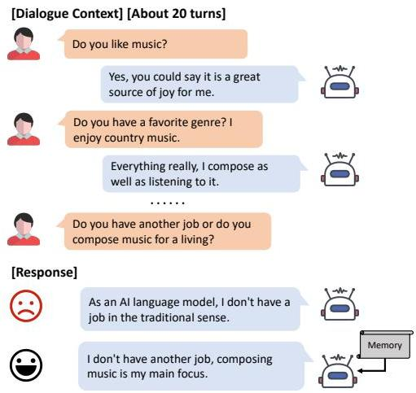
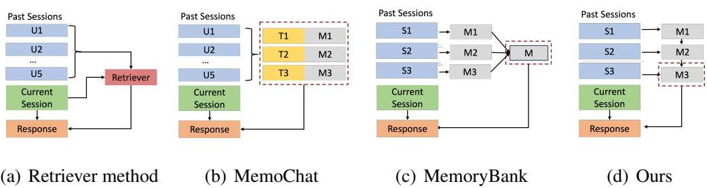
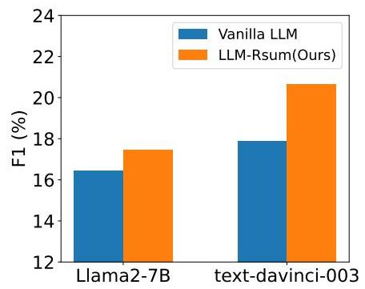
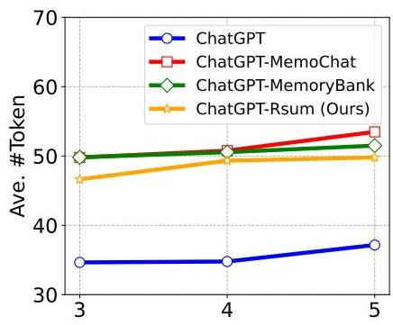

# 遞迴式摘要功能使大型語言模型具備長期對話記憶

![[qingyuetitle1.png]]

## 摘要

近期，大型語言模型（LLMs），例如 GPT-4，因其卓越的對話能力而備受矚目，能夠在廣泛的主題中進行動態且與上下文相關的對話。然而，在長期對話中，這些聊天機器人卻無法回憶起過去的適當資訊，導致回應不一致。為了解決這個問題，我們提出利用大型語言模型遞迴地產生摘要/記憶，以增強其長期對話能力。具體而言，我們的方法首先激發 LLM 記住小範圍的對話上下文。之後，LLM 利用先前的舊記憶和後續的上下文，遞迴地產生新的記憶。最後，提示聊天機器人根據最新的記憶來產生回應。在廣泛使用的 LLMs 上的實驗表明，我們的方法在長期對話中產生了更一致的回應，並且只需兩到三個對話範例即可顯著增強其能力。此外，我們發現我們的策略可以很好地補充大型上下文視窗（例如，8K 和 16K）和檢索增強型 LLMs，進一步提升長期對話效能。值得注意的是，我們的方法是使 LLM 能夠對極長對話上下文進行建模的潛在解決方案。程式碼和腳本將在稍後發布。

**關鍵字**：遞迴摘要、長期記憶、大型語言模型、對話生成。

## 1. 前言

近期，大型語言模型（LLMs），例如 ChatGPT 和 GPT-4 (Achiam et al., 2023)，在各種自然語言應用中展現了令人矚目的性能 (Brown et al., 2020; Zeng et al., 2022; Zhong et al., 2023; Lu et al., 2023b; Peng et al., 2023; Wu et al., 2023)。其中一項值得關注的能力在於其卓越的對話能力，能夠理解輸入並生成類人類的回應。

儘管大型上下文視窗允許許多 LLMs 處理完整的對話歷史，但它們在有效理解過去互動並將關鍵資訊整合到回應中時，卻經常表現不佳 (Zhou et al., 2023)。諸如需要回憶過去對話以建立關係的個人 AI 夥伴，以及必須考量完整的病人諮詢記錄以提供診斷結果的健康助理等應用，都證明了在長期對話中保持一致性和連貫性的重要性。圖 1 舉例說明了一段超過 20 輪的對話，其核心是關於說話者人設的討論（例如，機器人會作曲，而使用者喜歡鄉村音樂）。然而，即使是強大的 ChatGPT 也忘記了過去的資訊，並產生了不佳的回應，這顯示了在對話過程中明確建模長期記憶的必要性。

圖 1：一個來自多會話聊天資料集 (Multi-Session Chat Dataset) (Xu et al., 2022a) 的長期對話範例。當使用者回顧先前的內容（即作曲）時，即使是 ChatGPT (gpt-turbo-3.5-0301 版本) 也產生了不一致的回應。

為了解決這個問題，有兩種主流方法可以增強 LLMs 的長期對話能力。第一種是**基於檢索**的方法，它直接將過去的對話語句儲存在儲存空間中，並採用先進的檢索器來識別最相關的歷史記錄 (Guu et al., 2020; Lewis et al., 2020)。然而，很難獲得一個性能良好的（理想的）檢索器，以確保檢索到的語句能捕捉到當前對話的完整語義。第二種方法是採用**記憶模組**來總結重要的對話資訊以協助 LLM，這也稱為**基於記憶**的方法 (Mazaré et al., 2018; Xu et al., 2022b; Chen et al., 2024a)。它們通常應用一個獨立訓練的模型或一個強大的大型語言模型來為過去的對話生成記憶。然而，這些方法缺乏對生成的記憶進行必要的迭代機制，導致保留的過時資訊直接損害了回應的品質。

在本文中，我們提出了一種簡單且有效的**外掛**方法，該方法讓 LLM 本身能夠產生摘要，這些摘要透過不斷更新和回顧過去的上下文來儲存說話者的即時資訊，以協助長期互動。在實踐中，首先提示生成型 LLM 在給定一個簡短對話上下文的情況下產生一個摘要。之後，我們要求 LLM 透過結合先前的記憶和後續的對話，持續更新並產生新的摘要/記憶。最後，我們鼓勵 LLM 使用最新的記憶作為主要參考來參與正在進行的對話。鑑於生成的摘要比完整的對話短得多，我們提出的方案不僅能對長期對話記憶進行建模，還能作為一個潛在的解決方案，使目前的 LLMs 能夠處理極長的上下文（跨多個對話會話），而無需昂貴地擴展最大長度設定。

透過實驗，我們使用各種最先進的開源（Llama (Touvron et al., 2023) 和 ChatGLM (GLM et al., 2024)）和閉源（OpenAI 的 GPT-3.5-Turbo）LLMs 來實施我們的方法，其在長期對話上的性能在自動和人工評估中都超越了流行的方法。此外，我們驗證了使用顯式記憶對於長期對話的有效性，並且我們生成的記憶更容易讓 LLMs 消化。這些發現強調了開發先進記憶生成策略的重要性。我們的方法可以透過整合上下文學習（ICL）技術來進一步增強回應品質，該技術以（對話、記憶和黃金回應）的格式向 LLMs 呈現多個範例。這使得它們能夠更靈活地利用生成的記憶。此外，我們證明了我們的方法在不同 LLMs 上的普適性，其中我們的方法在 text-davinci-003 上的 BLEU 分數約有 +3% 的提升。最後，我們觀察到我們的方案可以補充現有的上下文視窗擴展型 LLMs（例如，GPT-3.5-Turbo-16k 和 LongLoRA-8k）和檢索增強型 LLMs（例如，LLM-BM25 和 LLM-DPR），在長期對話中產生更連貫和一致的回應。

總而言之，我們的貢獻如下：

- 我們提出了一種**新穎**的方法，透過**遞迴總結**過去的對話來增強 LLM 的記憶，使其能夠在長期對話中產生高度一致的回應。
- 在公開資料集上的**紮實實驗**證明了所提出方法的優越性，多個開源和閉源 LLMs 驗證了其**普遍性**和**穩健性**。
- 我們方法的**簡潔性**使其能夠很好地補充現有的工作，包括基於檢索和長上下文技術，具有成為 LLM 社群正交外掛的巨大潛力。

## 2. 相關工作

### 2.1. 大型語言模型

大型語言模型（LLMs）在各種面向使用者的語言技術中顯示出卓越的性能，包括對話、摘要和創意寫作 (Achiam et al., 2023; Shuster et al., 2022; Rubin and Berant, 2024)。儘管這些 LLMs 在許多熱門任務中取得了顯著成功，但它們對長文本進行建模的能力仍然是一個挑戰 (An et al., 2023)。為了解決這個問題，一些工作致力於調整 Transformer 模型以適應更長的輸入，例如**位置內插** (position interpolation) (Chen et al., 2023) 和**高效自我注意力** (efficient self-attention) (Beltagy et al., 2020; Chen et al., 2024b)。然而，這些上下文視窗擴展型 LLMs 不僅需要對高品質長文本進行持續訓練，而且在利用和檢索整個輸入中的核心資訊方面仍然存在困難 (Liu et al., 2023)。最近，在問答任務中，一些研究人員發現當人們改變相關資訊的位置時，LLMs 的性能會顯著下降，這表明目前的語言模型無法穩健地利用長輸入上下文中的資訊 (Liu et al., 2023; Li et al., 2023)。許多工作表明，目前 LLMs 缺乏明確的記憶機制，這阻礙了它們在需要持續上下文意識和理解的任務上的表現 (Chen et al., 2024a)。如今，LLMs 在長程對話情境中的性能尚未得到深入探索。這項工作專注於開發 LLM 的長期建模能力，我們提示它在對話中進行**自我記憶**、**自我更新**和**自我使用**，以協助生成一致的回應。

### 2.2. 長期開放域對話

**開放域對話系統** (Liu et al., 2016; Zhang et al., 2018; Kann et al., 2022)，也被稱為聊天機器人或對話代理，近年來獲得了巨大的普及和大量的研究。其中，**長期對話**設定是一個相當困難的問題，因為它需要理解和記憶關於當前查詢的關鍵對話歷史資訊的能力 (Wu et al., 2022; Zhang et al., 2022)。最流行和潛在的解決方案是直接儲存部分資訊以追蹤對話歷史 (Lee et al., 2023)，通常以對話語句或摘要的形式。然後將當前對話和相關資訊輸入到回應生成器中。一個直觀的想法是應用一個檢索器根據當前對話來尋找最相關的語句，這被稱為**基於檢索**的方法。另一種流行的方法是**基於記憶**的方法，它試圖生成和管理摘要，從歷史中獲取關鍵資訊。例如，MemoChat (Lu et al., 2023a) 允許聊天機器人根據說話者的不同主題重新組織過去的對話歷史，並在生成過程中提示 LLM 從結構化記憶中檢索。更進一步，MemoryBank (Zhong et al., 2024) 提出了一種新的記憶機制，首先為每個對話會話生成摘要，然後將它們壓縮成一個全域性摘要。然而，一旦這些記憶被儲存，它們就完全固定了，無法保證其與正在進行的對話的一致性。圖 2 顯示了這些現有方法與我們方法之間的重要比較。如圖所示，我們的方法與這些方法的主要區別在於記憶的生成方式，我們持續整合歷史資訊和舊記憶以獲得**即時記憶**，從而能夠獲得準確的記憶並對長距離依賴關係進行建模。

圖 2：基線方法與我們方法的比較。 「U」、「S」、「T」和「M」分別是語句 (Utterance)、會話 (Session)、對話主題 (dialog Topic) 和記憶 (Memory) 的縮寫。紅色虛線框指的是用於生成回應的記憶。

## 3. 方法概覽

遵循先前的工作 (Xu et al., 2022a; Bae et al., 2022)，我們將一個長上下文對話定義為由與特定使用者進行的多個會話組成，這也稱為**多會話對話**。該任務的目標是根據過去的會話和當前上下文，為使用者生成與上下文相關且高度一致的回應。形式上，每個對話可以寫為 $D = \{S, C_t, r_t\}$。這裡，$S = \{S_1, S_2, \ldots , S_N\}$ 表示 $N$ 個過去的會話，每個會話由兩位說話者之間的多個語句組成。$r_t$ 是在背景會話 $S$ 下對 $C_t$ 的真實回應。$C_t = \{u_1, r_1, \ldots , u_t\}$ 表示當前會話在 $t$ 步的對話上下文，其中 $u$ 和 $r$ 分別代表來自使用者和聊天機器人的語句。

在本文中，我們提出了一種新的記憶機制，以協助大型語言模型進行多會話對話任務。記憶包含多個自然語言句子，儲存了從先前會話中提取的說話者關鍵資訊。我們的目標是在給定過去會話的情況下獲得一個可靠的記憶，並使用當前對話上下文和記憶來預測一個一致且有意義的回應。具體來說，我們將目標分解為兩個階段，其機率分佈如下：

$$P(r_{t} | M_{N}, C_{t}) = \prod_{j=1}^{t} P(r_{j} | r_{<j}, C_{t}, M_{N})$$
$$P(M_{i} | S_{i}, M_{i-1})$$

其中，$M_{i}$ 代表第 $i$ 個會話結束時可用的記憶。

![[截圖 2025-08-17 下午5.42.49.png]]
是一個序列或馬可夫過程 (Markov process)，其中每個會話 $i$ 的記憶 $M_{i}$ 僅取決於當前會話和先前的記憶 $M_{i - 1}$。

## 4. 方法

為了實現長期對話，我們提示任意的大型語言模型完成兩個任務，即**記憶迭代**和**基於記憶的回應生成**。前者負責沿著長期對話遞迴地總結關鍵資訊，後者是結合最新的記憶和當前對話來生成一個適當且一致的回應。我們提出的方法流程如圖 3 所示。

### 4.1. 記憶迭代

記憶迭代的目標是為聊天機器人獲得一個連貫且最新的摘要。早期工作 (Bae et al., 2022; Choi et al., 2023) 透過對摘要進行多個「硬操作」(hard operations)，例如**替換** (replace)、**附加** (append) 和**刪除** (delete) 來更新記憶，這些操作依賴於帶有操作標籤的高品質對話。然而，這種費力的設計破壞了摘要的語義連貫性，並且不適合長期管理。與之不同，我們引導 LLMs 使用對話上下文和先前的記憶**遞迴地自我生成**記憶（摘要）。透過利用舊摘要，模型可以充分消化當前的對話上下文，從而獲得高品質的記憶。形式上，更新後的記憶透過以下方式計算：

$$M_{i} = \mathrm{LLM}(\mathrm{P}_{\mathrm{m}}(S_{i}, M_{i - 1}))$$

其中，$M_{i} = \{m_{1},m_{2},\dots,m_{J}\}$ 表示多個句子，包含了從會話 $S_{i}$ 中總結的關鍵資訊，而 $\mathrm{P}_{\mathrm{m}}$ 是 LLM 用於生成新記憶的提示 (prompt)。記憶迭代將重複 $N$ 次，直到所有先前的會話結束，此時我們可以獲得最新的記憶 $M_{N}$。以圖 3 中的對話為例，在第一個和第二個會話結束時發生了兩次記憶迭代。在第二次迭代中，LLM 將來自會話 2 的新個性（即機器人最近加入了一個新的健身房）整合到舊記憶中（即機器人喜歡散步和跑步）。

**提示建構 (Prompt Construction)**。為了使 LLM 能夠有效地執行記憶迭代任務，我們為其設計了一個特定的提示，如表 1 所示。它主要由三部分組成：(1) **任務定義** (Task definition) 負責定義當前 LLM 的角色，以及記憶迭代器（LLM）的輸入和輸出。(2) **任務描述** (Task description) 提供了完成上述任務的詳細步驟。為了確保記憶更新及時，我們提醒 LLM 透過考量舊摘要和當前會話來為說話者創建一個新的表示。(3) **任務輸入** (Task input) 包含兩個佔位符，我們將先前的記憶和整個會話作為輸入。透過實驗驗證，我們發現使用分步說明有助於 LLM 更好地理解和執行記憶迭代。

表 1：記憶迭代的提示設計，包括任務定義、任務描述和任務輸入

| 提示 | 你是一個先進的 AI 語言模型，具有儲存和更新記憶的能力，以追蹤使用者和機器人的關鍵個性資訊。你將收到一個先前的記憶和對話上下文。你的目標是透過整合新的個性資訊來更新記憶。要成功更新記憶，請遵循以下步驟： 1. 仔細分析現有記憶並從中提取使用者和機器人的關鍵個性。 2. 考慮提供的對話上下文以識別任何需要整合到記憶中的新或改變的個性。 3. 結合舊的和新的個性資訊，創建一個使用者和機器人特徵的更新表示。 4. 以清晰簡潔的方式組織更新後的記憶，確保它不超過 20 個句子。記住，記憶應作為一個參考點，以維持對話的連續性，並幫助你根據使用者的個性準確地回應他們。 [先前的記憶] [會話上下文]|
|:---|:---|
| 輸出 | [更新後的記憶]|

表 2：基於記憶的回應生成的提示，包括任務定義、任務描述和任務輸入

| 提示 | 你將被提供一個包含你自己和使用者個性資訊的記憶。 你的目標是根據個性和對話上下文準確地回應使用者。 遵循這些步驟以成功完成任務： 1. 分析提供的記憶以提取你自己和使用者的關鍵個性特徵。 2. 審查對話歷史以了解對話的上下文和流程。 3. 利用提取的個性特徵和對話上下文來制定一個適當的回應。 4. 如果沒有特定的個性特徵適用，請像人類一樣自然地回應。 5. 注意個性資訊的相關性和重要性，專注於捕捉最重要的方面，同時保持記憶的整體連貫性。 [先前的記憶] [當前上下文]|
|:---|:---|
| 輸出 | [回應]|

### 4.2. 基於記憶的回應生成

最終目標是在給定對話記憶和當前會話上下文的情況下，產生一致且自然的回應。形式上，當前會話的回應可以透過激發 LLM 作為回應生成器來獲得：

$$P(r_{t}|C_{t}, M_{N}) = \prod_{j=1}^{t} P(r_{j} | r_{<j}, C_{t}, M_{N})$$

其中，$P_{r}$ 是生成器的提示。特別地，我們再次要求 LLM 藉由使用生成的記憶 $M_{N}$ 和當前會話 $C_t$ 來生成回應。在圖 3 中，LLM 考量了來自會話 2 的最新記憶，並向使用者提供了一個高度一致的回應，即「有了 24 小時的健身房會員資格，會更加靈活」。

**提示建構 (Prompt Construction)**。基於記憶的回應生成的提示如表 2 所示。該提示與記憶迭代的提示類似，包括任務定義、描述和輸入，我們提醒 LLM 在回應時利用提取的資訊並保持記憶的一致性。同樣，分步說明的方法對於基於記憶的回應生成也是有效的。

### 4.3. 演算法

使用遞迴記憶生成回應的過程如演算法 1 所示。開始時，初始記憶被設定為一個空字串，即「none」。之後，我們使用每個會話上下文遞迴地更新記憶（第 3 行）。最後，LLM 在最新記憶的幫助下生成回應（第 5 行）。用於記憶迭代和回應生成的生成型預訓練模型可以不同。例如，開發人員可以透過客製化模型或資料來訓練一個私有的記憶迭代器，以增強目標開源/閉源 LLMs 的長期或長上下文任務能力。

### 5. 實驗設定

### 5.1. 資料集

我們在兩個廣泛使用的長期對話資料集上驗證了所提出方法的有效性：**多會話聊天 (Multi-Session Chat, MSC)** 資料集 (Xu et al., 2022a) 和 **Carecall** 資料集 (Bae et al., 2022)。

**MSC 資料集**：是迄今為止最大的人與人長期對話資料集。早期的會話是簡短的對話，兩個說話者第一次互相了解，然後他們要麼繼續討論先前的內容，要麼引發一個新話題。

**Carecall**：是一個韓語開放域多會話資料集，用於監測病人的健康狀況。為了公平比較，我們在實驗中使用了公開的機器翻譯英文版本。

CareCall 的設定與 MSC 資料集中呈現的程序相似。主要區別在於 Carecall 額外包含了更多可能在短時間內改變的人設更新，例如使用者的健康和飲食，而 MSC 資料集中的人設資訊一旦被儲存就保持不變。這兩個資料集都有五個會話，每個會話由兩位說話者（使用者和聊天機器人）之間的多個語句組成，對話者在數小時或數天後重新參與並繼續聊天。由於早期會話只有非常短的對話歷史，我們主要評估該方法在**會話 4 和 5** 中的長期建模能力。兩個資料集的統計資料在附錄 A 中提供。

### 5.2. 評估指標

我們在實驗中進行了多樣化的評估，包括自動指標、人工評估和 LLM 判斷，重點關注生成的記憶和回應的品質。

**自動指標 (Automatic Metrics)**：我們使用 BLEU-1/2 (Papineni et al., 2002)、F1 與人工註釋進行參考。此外，我們計算 BertScore (Li et al., 2016) 來衡量參考回應和生成回應之間的語義相似性。

**人工評估 (Human Evaluation)**：許多研究指出自動評估指標不足以捕捉對話的細微之處 (Deriu et al., 2019)。遵循先前的工作 (Bae et al., 2022)，我們要求三位眾包工作者根據**引人入勝性** (engagingness)、**連貫性** (coherence) 和**一致性** (consistency) 三個方面，為生成的回應分配 0 到 2 的分數（0：差，1：一般，2：好）。這些標準的討論如下：(1) **引人入勝性**：它評估聊天機器人是否抓住了使用者的興趣，並讓他們想繼續對話。引人入勝性分數高意味著回應有趣且符合上下文，鼓勵使用者繼續聊天。(2) **連貫性**：它衡量回應是否基於對話的上下文保持邏輯和清晰的流程。連貫的回應確保對話有意義並保持相關性，從而增強使用者參與度。(3) **一致性**：它評估回應是否與先前互動中提供的信息保持一致。一致的回應透過展示聊天機器人準確記憶並整合了過去的交流，來建立信任和可靠性。

**LLM 評估 (LLM Evaluation)**：近來，「LLM 即評審」(LLM-as-a-Judge) 策略 (Pan et al., 2023) 已被廣泛用於評估生成任務。一些研究顯示，GPT-4 在對話品質方面的評估與人類的偏差極小（超過 0.85 的一致性） (Zhang et al., 2023a)。受此啟發，我們聘用 GPT-4 作為一個進階評估者，使用兩種常用方法來評估生成回應的品質。 (1) **單模型評估** (Single model evaluation) (Lu et al., 2023a)：我們提示 GPT-4 以 1 到 100 的整數分數（1：非常差，100：非常好）從引人入勝性、連貫性和一致性這三個方面個別評價回應。 (2) **成對模型評估** (Pairwise model evaluation) (Dubois et al., 2024)：我們要求 GPT-4 直接比較兩個匿名生成的回應，並判斷哪個回應更好。雖然單模型評估能為每個回應的特定方面提供詳細見解，但成對比較對於了解相對性能至關重要，尤其是在區分輸出之間的細微差異時。

## 5.3. 基線方法

我們主要採用以下方法來處理 LLM 中的長文本對話：僅上下文方法（不使用任何記憶）、基於檢索的方法（使用不同的檢索器）和基於記憶的方法（使用不同的記憶機制）。

**僅上下文方法 (Context-only Approach)**。這是最直接的方法，直接將 LLM 作為聊天機器人使用，它將過去的會話和當前的對話上下文串聯起來作為輸入。我們使用「Llama2-7B」(Touvron et al., 2023)、「ChatGLM2-6B」和 OpenAI ChatGPT「gpt-3.5-turbo-0301」作為僅上下文方法的骨幹 LLMs。

**基於檢索方法 (Retrieval-based Approach)**。許多先前的工作 (Xu et al., 2022a) 採用檢索器來過濾關鍵資訊，然後將前 $k$ 個文件納入輸入中，以協助長上下文對話。對於長期對話，前 $k$ 個文件指的是來自歷史記錄的相關語句。在此，我們選擇兩種廣泛使用的檢索演算法，即 BM25 (Robertson et al., 2009) 和預訓練的密集通道檢索 (DPR) (Karpukhin et al., 2020)，從過去的會話中尋找相關語句。為了方便，我們將上述基於檢索的基線分別命名為 ChatGPT-BM25 和 ChatGPT-DPR。

**基於記憶方法 (Memory-based Approach)**。最近的工作採用摘要器來從過去的對話中提取重要資訊，以協助長期對話。簡單地說，我們從各種基於記憶的技術中選擇了兩種代表性方法：MemoryBank (Zhong et al., 2024) 和 MemoChat (Lu et al., 2023a)。MemoryBank 提出了一種類似人類的長期記憶機制，它創建帶有時間戳的過去對話有序摘要，然後將它們重新組織以獲得全域性記憶。該記憶將根據艾賓浩斯遺忘曲線被遺忘和更新。在這裡，我們將 MemoryBank 與 ChatGPT 結合作為一個強大的基線，命名為 ChatGPT-MemoryBank。MemoChat 則不同，它維護結構化的對話記憶來協助長期對話，即為每個對話主題生成摘要。為了進行公平比較，我們將 MemoChat 插入到 ChatGPT 中，命名為 ChatGPT-MemoChat。

請注意，我們的方法專注於 LLMs 進行長期對話的零樣本 (zero-shot) 設定，這使得與其他經過微調的模型進行比較是不公平的。

## 5.4. 實作

我們透過讓 LLM 在長期對話中使用遞迴生成的記憶來回應，從而實現我們的方法，因此它被稱為「LLM-Rsum」。

**骨幹 LLMs**。我們在主要實驗中採用 OpenAI ChatGPT「gpt-3.5-turbo-0301」、《Llama2-7B》和《ChatGLM2-6B》，並在分析中採用「text-davinci-003」和「Llama2-7B」(Touvron et al., 2023) 以展示其普遍性。在補充討論中，我們採用「longlora-8k」(Chen et al., 2024b) 和 ChatGPT-16k「gpt-3.5-turbo-16k」作為骨幹模型。除非另有說明，我們使用相同的 LLM 來完成記憶迭代和基於記憶的回應生成。在生成過程中，為了公平比較，我們將所有 LLMs 的溫度設定為 0。對於 Carecall 和 MSC 資料集，輸入詞元的最大長度不超過 4k，因此實驗中所有的骨幹 LLMs 都能處理整個對話上下文。

**檢索器 (Retrievers)**。考慮到過去語句的規模不足以使用 FAISS (Research, 2019)，我們選擇了與正在進行的對話結合的前 $k$ 個最相關的語句，以提示 LLM 回應。遵循先前針對長期對話的工作 (Xu et al., 2022a)，我們將 $k$ 設定為 3 和 5。

**基於記憶的方法 (Memory-based Approaches)**。MemoryBank 和 Memochat 方法的實作和提示設計基於其原始論文中公開發布的程式碼。有關詳細資訊，請參閱原始論文。

表 3：不同方法在 MSC 和 Carecall 資料集上的自動和人工評估比較，報告了生成回應的品質。「BScore」、「Enga」、「Cohe」和「Cons」分別是 BertScore、引人入勝性 (Engagingness)、連貫性 (Coherence) 和一致性 (Consistency) 的縮寫。最佳值以粗體顯示。

| 方法 | MSC 資料集 | MSC 資料集 | MSC 資料集 | MSC 資料集 | MSC 資料集 | MSC 資料集 | Carecall 資料集 | Carecall 資料集 | Carecall 資料集 | Carecall 資料集 | Carecall 資料集 | Carecall 資料集 |
|:---|:---:|:---:|:---:|:---:|:---:|:---:|:---:|:---:|:---:|:---:|:---:|:---:|
| | F1 | BLEU-1/2 | BScore | Enga. | Cohe. | Cons. | F1 | BLEU-1/2 | BScore | Enga. | Cohe. | Cons. |
| **僅上下文 LLM** | | | | | | | | | | | | |
| Llama2-7B | 16.43 | 20.96/12.09 | 84.04 | 1.32 | 1.20 | 1.13 | 13.71 | 20.89/12.28 | 84.49 | 0.75 | 0.75 | 1.00 |
| ChatGLM2-6B | 15.38 | 21.69/12.51 | 84.48 | 1.10 | 1.15 | 1.07 | 13.09 | 20.59/12.03 | 84.91 | 0.66 | 0.63 | 0.86 |
| ChatGPT | 19.41 | 21.23/12.24 | 86.13 | 1.83 | 1.37 | 1.32 | 13.69 | 21.15/12.20 | 85.53 | 1.50 | 1.52 | 1.43 |
| **基於檢索方法** | | | | | | | | | | | | |
| ChatGPT-BM25 (k=3) | 19.56 | 21.60/12.46 | 85.82 | 1.72 | 1.48 | 1.32 | 12.64 | 21.57/12.44 | 85.24 | 1.40 | 1.31 | 1.31 |
| ChatGPT-DPR (k=3) | 20.23 | 21.75/12.55 | 86.04 | 1.76 | 1.51 | 1.34 | 12.21 | 21.39/12.35 | 85.25 | 1.55 | 1.35 | 1.45 |
| **基於記憶方法** | | | | | | | | | | | | |
| ChatGPT-MemoChat | 18.93 | 21.82/12.59 | 85.99 | 1.70 | 1.55 | 1.35 | 11.19 | 21.07/12.18 | 85.22 | 1.45 | 1.20 | 1.30 |
| ChatGPT-MemoBank | 20.28 | 21.82/12.58 | 86.12 | 1.78 | 1.57 | 1.40 | 13.15 | 21.29/12.39 | 85.34 | 1.57 | 1.52 | 1.68 |
| ChatGPT-Rsum (我們的方法) | **20.48** | **21.83/12.59** | **86.89** | **1.85** | **1.60** | **1.45** | **14.02** | **21.64/12.48** | **86.05** | **1.62** | **1.60** | **1.70** |

**LLM 評估 (LLM evaluations)**。我們使用 GPT-4 模型（版本「gpt-4-0314」）作為評估器，在進行判斷時將溫度設定為 0。單模型和成對模型的評估提示分別參照 (Lu et al., 2023a) 和 (Dubois et al., 2024)。實驗中使用的所有提示都可以在附錄 B 中看到。

## 6. 實驗結果

### 6.1. 主要結果

**自動指標結果 (Automatic Metrics Results)**。在表 3 中，我們比較了使用流行 LLMs 在 MSC 和 Carecall 資料集會話 5 上的不同方法。首先，在一般模型（「Llama2-7B」、「ChatGLM2-6B」和「ChatGPT」）中，ChatGPT 在兩個資料集上都表現出色，其在 BScore、F1 和 BLEU-1/2 方面均獲得了有競爭力的分數。這些結果表明 ChatGPT 足夠穩健，能夠處理長期對話，因此我們將 ChatGPT 作為我們方法的骨幹模型。其次，正如預期，我們提出的方法（「ChatGPT-Rsum」）在兩個資料集上都取得了最佳性能，顯示了使用自動遞迴記憶的好處。具體來說，我們的方法在 F1 分數上獲得了約 +0.2% 的提升，這與先前工作 (Xu et al., 2022a) 中的提升是可接受的。由於 MSC 資料集比其他開放域資料集難 3 倍，因此輕微的提升是正常的。第三，基於檢索的方法在提升生成品質方面可能並不總是有幫助。從結果來看，ChatGPT-BM25 和 ChatGPT-DPR 在 Carecall 資料集上的性能比一般的 ChatGPT 差得多，這與 MSC 的結果完全相反。其原因是，聊天機器人需要在 Carecall 中積極引導對話主題，因此很難從使用者的查詢中檢索到適當和相關的上下文。因此，由於不相關的資訊，生成回應的性能將會受到損害。

**人工評估結果 (Human Evaluation Results)**。我們還在表 3 中呈現了不同方法的人工評估結果。從結果中我們發現：1) 大多數增強記憶的方法在一致性和連貫性方面比一般的 ChatGPT 獲得更高的分數，這證明在長期對話中，對於 LLMs 來說，維持一個記憶比直接使用整個歷史更有效；2) 我們的方法比其他基於記憶的基線（ChatGPT-MemoryBank 和 ChatGPT-MemoChat）能生成更具吸引力的回應。原因是持續更新記憶能夠主動建立過去歷史中的全域性依賴關係，這有助於 LLMs 更好地理解對話並生成高品質的回應。

表 4：GPT-4 在 MSC 資料集會話 5 上對不同方法的評估指標結果比較。

| 方法 | 引人入勝性 (Engagingness) | 連貫性 (Coherence) | 一致性 (Consistency) | 平均 (Average) |
|:---|:---:|:---:|:---:|:---:|
| ChatGPT | 75.48 | 75.00 | 75.48 | 75.32 |
| ChatGPT-MemoryBank | 74.68 | 80.92 | 84.56 | 80.05 |
| ChatGPT-MemoChat | 72.32 | 77.36 | 78.96 | 76.21 |
| ChatGPT-Rsum (我們的方法) | **78.92** | **83.56** | **84.76** | **82.41** |

## 6.2. LLM 評估

**單模型評估 (Single Model Evaluation)**。表 4 報告了 GPT-4 在 MSC 資料集會話 5 上對各種方法的評估指標結果。此外，結果證明人類（在表 3 中）和 GPT-4 對生成回應的整體品質判斷高度一致，即 ChatGPT-Rsum > ChatGPT-MemoryBank > ChatGPT-MemoChat > ChatGPT。鑑於此，我們在後續實驗中主要呈現 LLM 評估，以降低人力成本。最後，值得注意的是，與人工評估結果相比，GPT-4 傾向於在句子連貫性和一致性上給予更高的分數。我們認為人類和 LLMs 的價值觀在細粒度層面上可能無法完全對齊，這可能是開發 LLM 評估的一個新方向。

**成對模型評估 (Pairwise Models Evaluation)**。此外，我們從成對模型（即我們的方法 vs. 基線）中隨機取樣 1000 個生成的回應，然後請 GPT-4 根據引人入勝性、一致性和連貫性來判斷哪個回應更好。結果如圖 4 所示。與最具競爭力的基線 (MemoryBank) 相比，我們提出的方法獲得了 36.3% 的提升（勝率為 48.2%，僅輸了 11.9%），這說明了所提出的迭代機制的優越性。

  
圖 4：我們的方法與具有競爭力的基線方法（包括 ChatGPT、ChatGPT-MemoChat 和 ChatGPT-MemoryBank）的勝率比較。

## 6.3. 消融研究

為了更好地理解所提出的記憶機制對 LLMs 的有效性，我們使用 ChatGPT 作為 LLM，並在會話 5 中進行了消融研究。結果如表 5 所示。首先，我們只使用當前會話的對話上下文作為 LLMs 的輸入，命名為「W/O Memory」。正如預期，模型的性能顯著下降，證明了在長期對話中，來自過去的可用記憶是必要的。其次，我們用黃金記憶 (ground truth memory) 替換生成的記憶，即提示 ChatGPT 使用黃金記憶和對話上下文生成回應，命名為「Gt. Memory」。有趣的是，與使用預測記憶（我們的方法）相比，該模型獲得了較低的 BLEU 和 F1 分數。潛在的原因是黃金記憶（例如，「我正試著減重」和「我想開始跑步」）是零碎且缺乏連貫性的，這對於 LLM 的提示來說是次優的。而遞迴總結記憶生成方法則可以巧妙地對長期依賴關係進行建模，並為 LLMs 生成易於消化的提示。更多分析可以在 §6.4 和 §6.5 中看到。

表 5：在 MSC 資料集上進行的記憶消融研究。

| 方法 | BScore | F1 | BLEU-1/2 |
|:---|:---:|:---:|:---:|
| ChatGPT-Rsum (我們的方法) | 86.89 | 20.48 | 21.83/12.59 |
| W/O Memory | 85.40 | 18.94 | 21.10/12.17 |
| Gt. Memory | 85.93 | 20.46 | 21.50/12.40 |

## 6.4. 分析

除了主要結果和消融研究，我們還旨在更深入地探討我們的方法。在以下部分，我們將討論幾個研究問題 (RQs)：RQ1：生成的記憶品質如何？ RQ2：記憶生成中可能出現哪些錯誤？ RQ3：所提出的方法對其他 LLMs 是否穩健？ RQ4：我們的零樣本方法是否能有效地應用於少樣本 (few-shot) 情境？

我們的方法可以產生準確和可用的記憶 (Q1)。這個框架的核心是透過持續總結來生成對話記憶。為了驗證摘要的品質，我們在 MSC 資料集上分別計算了 ChatGPT-MemoryBank 和我們的方法所產生的預測記憶與黃金記憶之間的自動指標，結果如圖 5 所示。可以看出，這兩種模型生成的記憶都獲得了相當可觀的 F1 分數（+25%），這解釋了使用對話摘要作為記憶的可靠性。此外，ChatGPT-Rsum（我們的方法）在記憶方面取得了更高的整體性能，這表明遞迴總結比 ChatGPT-MemoryBank 能夠獲得更完整和長期的資訊。最後，鑑於表 3 中會話 5 的回應性能（我們的方法 > ChatGPT-MemoryBank），我們認為記憶預測的準確性與回應的品質呈正相關。我們還認為，更先進的記憶機制可以實現進一步的改進，這可能在未來的研究中進行探討。

  
圖 5：對 ChatGPT-MemoryBank 和我們的方法所生成記憶的評估。 「P」和「R」分別指精確率 (precision) 和召回率 (recall)。

我們的記憶存在一些事實錯誤，但處於可接受的範圍內 (Q2)。有人可能會懷疑生成的摘要可能存在嚴重的事實不一致和錯誤傳播問題。我們認為摘要並不是一個困難的任務，並且一些工作發現 LLM 摘要表現出更好的事實一致性和更少幻覺 (Pu et al., 2023)。為了進一步解決這個問題，我們隨機選擇了 100 個對話樣本，並手動評估了最後一個會話中記憶的品質。表 6 報告了在我們生成的記憶中發現的三種錯誤類型。1) **捏造事實 (Fabricated Facts)** 指的是記憶包含對話歷史無法驗證的資訊。在第一個案例中，機器人走路去上班並不是為了看動物。2) **不正確的關係 (Incorrect Relationships)** 指的是生成的記憶從歷史中得出錯誤的因果關係或參考。在第二個對話中，使用者是讓步給她的女兒，而不是讓步給貓。3) **遺漏細節 (Missing Details)** 指的是記憶遺漏了事件的部分細節。在第三個情境中，模型忽略了使用者最喜歡的電影名稱，而只粗略地總結為喜歡看電視。儘管我們生成的記憶中存在一些錯誤，但錯誤/不準確的資訊不超過摘要內容的 10%，這表明大多數遞迴生成的摘要是可信且可用於協助長期對話。此外，大量的實驗（在表 3 和圖 5 中）驗證了我們方法在利用生成的摘要進行長期對話方面的效力，這構成了本文的主要貢獻。最後，上述分析也表明我們的方法需要在記憶準確的對話細節方面得到加強。未來可以應用更先進的基於代理 (agent-based) 的技術，例如檢索增強型方法 (Zhang et al., 2023b)。

表 6：生成的記憶中三種錯誤類型，包括對應的例子和內容錯誤比例。錯誤內容以紅色標記。

| 錯誤類型 | 過去的對話 | 生成的記憶 | 黃金記憶 | 比例 |
|:---|:---|:---|:---|:---:|
| 捏造事實 | Bot: I like to walk to work instead of driving so I see animals. | The bot enjoys walking to work to see animals. | bot: I walk to work. | 2.7% |
| 不正確的關係 | User: I ended up giving in and getting my daughters the cat....Well when you have daughters you sort of give in to them. She named it Angie. | The user's daughters now have a cat named Angie, which the user gave in to. | User: I got my daughters a cat. My cat is named Angie. My daughters named the cat. | 3.2% |
| 遺漏細節 | User: I just saw the best movie on netflix. Bot: What movie did you see? User: It's a documentary called The Social Dilemma. | User: Enjoys watching TV, reading, and listening to music | User: I think the documentary The Social Dilemma is the best movie on Netflix. | 3.9% |

我們即插即用的方法對其他小型和大型 LLMs 也有效 (Q3)。為了檢查所提出的遞迴總結方法對於應對長期會話是否對其他大型語言模型穩健，我們採用「Llama2-7B」和「text-davinci-003」作為骨幹模型來評估該框架。圖 6 顯示了在長上下文對話（MSC 資料集的會話 5）中的性能，其顯著的提升證實了我們方法對於不同 LLMs 的穩健性。我們也相信，更強大的語言模型，即「text-davinci-003」>「Llama2-7b」，確實能更好地理解上下文，並生成更準確的記憶和回應，從而透過所提出的機制帶來更好的改進。

  
圖 6：使用其他 LLMs 時回應的 F1 分數。

  
圖 7：生成回應中的平均詞元數。

我們的方法可以透過幾個帶有標籤的對話進一步增強 (Q4)。我們透過上下文學習 (in-context learning) 技術評估了所提出機制的少樣本性能。具體來說，我們利用從驗證集中隨機取樣的幾個帶有生成記憶和標籤回應（黃金真相）的對話，在測試輸入之前提示回應生成器。表 7 顯示，即使是兩個帶有標籤的樣本，在我們的框架下也能帶來明顯的優勢，無論是 F1 分數還是 BLEU 分數，這表明了我們框架的潛力。我們分析認為，生成的記憶可能包含大量的說話者偏好資訊，這無疑增加了生成回覆的難度。因此，帶有標籤的資料對於所提出的方法非常有價值，因為它能自然地引導 LLM 有效地利用記憶。

表 7：在 MSC 資料集上使用生成記憶時的零樣本和少樣本比較結果 (%)。

| N-shot | 會話 4 | 會話 4 | 會話 5 | 會話 5 |
|:---|:---:|:---:|:---:|:---:|
| | F1 | BLEU-1/2 | F1 | BLEU-1/2 |
| 零樣本 (Zero-shot) | 20.19 | 21.80/12.57 | 20.48 | 21.76/12.59 |
| 兩樣本 (Two-shot) | 20.37 | 22.11/12.65 | 20.63 | 22.04/12.71 |
| 三樣本 (Three-shot) | 20.98 | 22.43/12.76 | 21.08 | 22.23/12.82 |

  
圖 8：在 MSC 資料集上使用不同方法時生成的範例回應。其中，我們的框架可以獲得最新的記憶並將其整合到生成的回應中。為了清晰起見，我們省略了與當前查詢無關的其他語句和預測記憶。

## 6.5. 案例研究

為了檢查記憶是否將長程對話資訊整合到回應中，我們首先比較了使用不同方法時回應的長度。如圖 7 所示，使用生成記憶的平均回應長度比一般 LLM（沒有記憶）在所有會話中長約 15 個詞元。此外，我們從生成的範例回應中取樣，以分析記憶對不同方法的影響。在圖 8 的案例中，使用者在當前回合提到了「購物成癮」，指的是機器人買太多鞋子的習慣。從結果中，我們可以得出以下結論：(1) 基於檢索的方法 (ChatGPT-DPR) 和僅上下文 LLM (ChatGPT) 傾向於專注於長上下文輸入中的局部（或最接近的）對話資訊。(2) 與使用黃金記憶相比，生成的記憶更流暢和連貫。這也解釋了為什麼我們的方法表現優於直接使用黃金記憶，這一點已在表 5 中觀察到。(3) 與有競爭力的記憶機制 (MemoryBank) 相比，我們的方法可以及時迭代和更新記憶，與正在進行的對話保持一致。(4) 所提出的遞迴總結記憶方法確實將長期對話資訊整合到了生成的範例回應中。在圖 8 中，最新的記憶（即機器人對籃球鞋的偏好）被理解並在回應中被提及。

## 6.6. 對現有工作的補充

我們提出的方法是一種新的記憶機制，用於改善 LLMs 的長程對話能力，預計將能補充現有的工作，包括基於檢索和輸入擴展的方法。在這裡，我們列出兩種代表性方法並展示它們的正交性。

**基於檢索的 LLMs**。基於檢索的方法在 MSC 資料集上的有效性可以在表 3 中觀察到，這說明了它們在長程對話中的潛力。在這裡，我們進一步探討與所提出方法的互補性。如表 8 所示，檢索增強型方法（ChatGPT-BM25 和 ChatGPT-DPR）比一般 ChatGPT 獲得了進一步的改進，這表明在長程對話中回憶相關資訊的重要性。此外，使用我們的框架可以推動這些基於檢索的方法取得更好的性能，獲得約 +0.8% 的 F1 分數。我們解釋說，這些檢索到的語句可以被視為事件細節的證據，它們與我們生成的記憶一起增強了 LLM 的長期對話能力。

表 8：我們的方法與基於檢索的方法的互補性，以 MSC 資料集會話 5 上的自動和 LLM 評估為準。

| 方法 | F1 | 連貫性 (Coherence) | 一致性 (Consistency) |
|:---|:---:|:---:|:---:|
| ChatGPT | 19.41 | 75.00 | 75.48 |
| ChatGPT-BM25 (k=5) | 20.91 | 75.44 | 76.88 |
| + 我們的框架 | **21.81** | **84.44** | **90.68** |
| ChatGPT-DPR (k=5) | 20.97 | 78.60 | 79.20 |
| + 我們的框架 | **21.69** | **83.40** | **86.48** |

表 9：我們的方法與長上下文 LLMs 的互補性，以 MSC 資料集會話 5 上的自動和 LLM 評估為準。

| 方法 | F1 | 連貫性 (Coherence) | 一致性 (Consistency) |
|:---|:---:|:---:|:---:|
| longlora-8k | 14.02 | 42.44 | 62.04 |
| longlora-8k + 我們的框架 | 15.77 | 53.41 | 68.60 |
| ChatGPT | 19.41 | 75.00 | 75.48 |
| ChatGPT-16k | 19.92 | 78.60 | 79.20 |
| ChatGPT-16k + 我們的框架 | 19.29 | 90.04 | 92.44 |
| GPT-4o | 20.35 | 87.70 | 82.00 |
| GPT-4o + 我們的框架 | 21.02 | 91.12 | 93.29 |

**長上下文 LLMs**。為了處理整個上下文並減少資訊丟失，許多研究人員試圖透過從頭開始訓練、微調或其他特定演算法（例如 FlashAttention）(Dao et al., 2022) 來擴展 LLMs 的上下文長度。例如，LongLoRA (Chen et al., 2024b) 將 Llama2 (Touvron et al., 2023) 7B 從 4k 上下文擴展到 100k。儘管所用資料集的最大長度不超過 4k，這足以容納大多數流行的 LLMs，但我們仍然想探索所提出的方法是否能補充這些長度擴展的模型。在這裡，我們利用三種具有大型上下文視窗的流行 LLMs，即「longlora-8k」、ChatGPT-16k（版本「gpt-3.5-turbo-16k-0613」）和 GPT-4o，以驗證我們所提出框架的有效性。為了確保生成記憶的品質，我們使用 ChatGPT「gpt-3.5-turbo-0301」作為記憶迭代器，並且只應用上述長上下文 LLMs 來完成基於記憶的回應生成。從表 9 的結果中，我們得出結論：1) 增加 LLMs 的最大上下文長度確實能增強對話的長期能力，在連貫性和一致性方面有明顯的改進，即使輸入長度遠小於上下文視窗；2) 即使輸入長度沒有超過視窗大小，將我們的方法應用於 LLMs 仍然是回憶資訊和維持長期聯繫的有效方式；3) 搭配更強大的 LLM 作為骨幹（例如 GPT-4o、ChatGPT、longloRA），模型在我們的增強後取得了更好的性能。我們解釋說，我們的遞迴摘要有助於有效地重新組織和消化過去的資訊，從而增強對長程對話中語義的理解。

## 7. 結論

在本文中，我們提出了一種簡單而有效的策略，透過遞迴總結來改善 LLMs 的長期對話能力。實驗結果表明，我們生成的記憶可以對長期依賴關係進行建模，並提示 LLMs 生成高度一致的回應。額外的分析顯示，此方法在不同的 LLM 中皆具備穩健性，並且在少樣本情境下能進一步提升。重要的是，我們的方法對於流行的檢索式模型和長上下文模型也表現出強大的互補性。

### 限制

我們方法的主要限制之一是它沒有考慮到呼叫大型模型的成本。在實際應用中，計算資源和相關成本往往是限制因素，這是不可忽視的一個重要考量。此外，儘管我們生成的記憶是有效的，但偶爾會出現輕微的事實錯誤。這些不準確之處雖然不多，但凸顯了一個未來研究中可以改進的領域。

### 未來工作

未來工作的一個有前景的方向是探索我們的方法在對話之外的長上下文任務（例如故事生成）中的有效性。研究我們的方法能多大程度地處理不同類型的長上下文任務，將提供對其多功能性和潛在應用的更深入見解。另一個未來研究途徑是透過使用局部監督、微調的 LLM 來優化我們的摘要方法效能。這種方法可能會減少對昂貴的線上 API 的依賴，使該方法更具可及性和成本效益，以供更廣泛的使用。

# 8. 致謝

本研究由中國國家自然科學基金（編號 U2336202）支持。

## 附錄 A. 資料集統計

MSC 和 Carecall 的統計資料如表 A.10 和表 A.11 所示。對話回合 ID \(i\) 表示在最後一個回合之前，已經發生了 \(i-1\) 個歷史對話回合。"#平均標記數" 和 "#最大標記數" 分別指對話的平均和最大標記數量。

**表 A.10：MSC 資料集的統計資料。**

| 對話回合 ID | #對話數 | #回應數 | #平均標記數 | #最大標記數 |
| :--- | :--- | :--- | :--- | :--- |
| 對話回合 2 | 501 | 5,939 | 444.84 | 951 |
| 對話回合 3 | 501 | 5,924 | 810.19 | 1733 |
| 對話回合 4 | 501 | 5,940 | 1195.08 | 2234 |
| 對話回合 5 | 501 | 5,945 | 1598.78 | 2613 |

**表 A.11：Carecall 資料集的統計資料。**

| 對話回合 ID | #對話數 | #回應數 | #平均標記數 | #最大標記數 |
| :--- | :--- | :--- | :--- | :--- |
| 對話回合 2 | 2798 | 7826 | 285.03 | 692 |
| 對話回合 3 | 743 | 7693 | 459.63 | 1093 |
| 對話回合 4 | 674 | 7065 | 636.55 | 1418 |
| 對話回合 5 | 638 | 6553 | 809.45 | 1744 |

## 附錄 B. 提示詞設計

以下是我們在實驗中使用的所有提示詞：

* **僅限上下文的 LLM** (Llama-7B, ChatGLM-6B, 和 ChatGPT): 表 B.12
* **檢索式 LLM** (ChatGPT-BM25 和 ChatGPT-DPR): 表 B.13
* **由我們框架增強的檢索式 LLM** (ChatGPT-BM25 + 我們的框架 和 ChatGPT-DPR + 我們的框架): 表 B.14
* **由上下文學習增強的我們方法** (以單樣本為例): 表 B.15
* **LLM 評估**: 表 B.16 和 表 B.17

**表 B.12：僅限上下文的 LLM 提示詞。**

| 提示詞 | 你是一個能夠進行基於個性的對話的進階 AI 語言模型。根據提供的對話上下文回應使用者。請設計一個自然且對話性的回應。對話上下文：[dialog]。對使用者的回應是： |
| :--- | :--- |
| 輸出 | [response] |

**表 B.13：檢索式 LLM 提示詞。**

| 提示詞 | 你是一個旨在進行自然、基於個性的對話的進階 AI。你將會獲得對話記憶、相關歷史上下文和對話上下文。對話記憶包含說話者（使用者和助理）的個性、偏好和經驗。在回應時，請考慮維持對話性和流暢的語氣。回應應與上下文相關，並旨在保持對話流暢。相關上下文：[retrieved utterances]。對話上下文：[dialog]。因此，對使用者的回應是： |
| :--- | :--- |
| 輸出 | [response] |

**表 B.14：由我們框架增強的檢索式 LLM 提示詞。**

| 提示詞 | 你是一個旨在進行自然、基於個性的對話的進階 AI。你將會獲得對話記憶、相關歷史上下文和對話上下文。對話記憶包含說話者（助理和使用者）的個性、偏好和經驗。在回應時，請考慮維持對話性和流暢的語氣。回應應與上下文相關，並旨在保持對話流暢。相關上下文：[retrieval utterances]。記憶：[latest memory]。對話：[current context] |
| :--- | :--- |
| 輸出 | [response] |

**表 B.15：我們方法與上下文學習的提示詞。**

| 提示詞 | 你是一個旨在進行自然、基於個性的對話的進階 AI。你將會獲得包含說話者（助理和使用者）個人偏好和經驗的記憶，以及對話上下文。在回應時，請考慮維持對話性和流暢的語氣。回應應與上下文相關，與給定的記憶一致，並旨在保持對話流暢。你的目標是根據提供的對話上下文提供引人入勝且連貫的回應。為了幫助你理解這項任務，我們在下面提供了一個範例。範例 1：範例記憶是：使用者：- 已離婚 - 正在撫養一個孩子 - 去年從英國移民 - 金屬工人。助理：- 未婚 - 女友有 2 個孩子 - 從事 mTurk、景觀美化、銷售、信封填充、繪畫等工作 - 以前喜歡冬天，但現在已無法忍受。與擁有「John of all trades」的朋友一起工作。範例對話上下文是：使用者：今天是我在佛羅里達經歷過最熱的一天！因此，對使用者的回應是：與英國相比，你更喜歡炎熱天氣嗎？以下是你需要測試的案例：測試記憶是：[previous memory]。測試對話上下文是：[dialog]。因此，對使用者的回應是： |
| :--- | :--- |
| 輸出 | [response] |

**表 B.16：單一模型評估的提示詞。**

| | 你是一個公正的評審。你將看到一個對話上下文、說話者的個性和助理的回應。**#流暢性**：請評估助理的回應是否自然、流暢，與人類交流相似，避免重複並確保輸出多樣化。**#一致性**：請評估助理的回應是否與個人資料清單的資訊一致。任何與預期個性的偏差都可能表示缺乏連貫性。 |
| :--- | :--- |
| 提示詞 | **#連貫性**：請評估助理的回應是否根據不斷發展的上下文維持了連貫和邏輯性的對話流。一個具有良好上下文連貫性的回應能夠理解並適當地回應對話主題的變化，提供順暢且明智的互動。對話上下文：[dialog]。個性：[persona]。助理回應：[response]。請先提供簡短解釋，然後嚴格遵循以下格式，以 1（非常差）到 100（非常好）的整數分數評估助理回應：[[score]]。 |
| 輸出 | [output] |

**### 表 B.17：成對模型評估的提示詞。**

| | 嗨！我們是一群研究人工智慧的研究人員。在這項任務中，我們將請你協助評分助理的回應。在下面的區域中，你將首先閱讀：1. 來自兩位說話者（使用者和機器人）的對話上下文。2. 從過去對話中提取的兩位說話者（使用者和機器人）的個性。3. 來自 AI 系統的兩個回應。你的任務是決定哪個回應更好。你可以從幾個維度進行思考。請考慮以下問題：1. 回應是否連貫？一個具有良好上下文連貫性的回應能夠理解並適當地回應對話主題的變化，提供順暢且明智的互動。2. 回應是否一致？評估回應是否與個人資料清單的資訊一致。任何與預期個性的偏差都可能表示缺乏一致性。3. 回應是否自然和流暢？請評估回應是否自然、流暢，與人類交流相似，避免過度重複並確保輸出多樣化。 |
| :--- | :--- |
| 提示詞 | 根據你的美學觀點，你更喜歡哪一個？例如，你可能更喜歡一首詩而不是另一首。最終，你應根據你的判斷和你自己的偏好來決定哪個回應更好。你有四個選項可供選擇：1. 回應 1 更好：如果你認為回應 1 具有優勢，請選擇此選項。2. 回應 1 稍微好一點：回應 1 略優於回應 2，差異很小。3. 回應 2 稍微好一點：回應 2 略優於回應 1，差異很小。4. 回應 2 更好：如果你認為回應 2 具有優勢，請選擇此選項。有時兩個回應之間的差異不明顯。在這種情況下，你可以選擇第二或第三個選項。然而，一般來說，我們要求你盡可能少地選擇這些選項。回應 1：[response1]。回應 2：[response2]。 |
| 輸出 | [response] |

# 參考文獻

Achiam, J., Adler, S., Agarwal, S., Ahmad, L., Akkaya, I., Aleman, F.L., Almeida, D., Altenschmidt, J., Altman, S., Anadkat, S., et al., 2023. Gpt-4 技術報告。arXiv 預印本 arXiv:2303.08774。

An, C., Gong, S., Zhong, M., Li, M., Zhang, J., Kong, L., Qiu, X., 2023. L-eval：為長上下文語言模型制定標準化評估。arXiv 預印本 arXiv:2307.11088 abs/2307.11088。

Bae, S., Kwak, D., Kang, S., Lee, M.Y., Kim, S., Jeong, Y., Kim, H., Lee, S.W., Park, W., Sung, N., 2022. 讓我隨時了解！在長期對話中的記憶管理，發表於：經驗方法自然語言處理會議文集。

Beltagy, I., Peters, M.E., Cohan, A., 2020. Longformer：長文件轉換器。arXiv 預印本 arXiv:2004.05150。

Brown, T.B., Mann, B., Ryder, N., Subbiah, M., Kaplan, J., Dhariwal, P., Neelakantan, A., Shyam, P., Sastry, G., Askell, A., Agarwal, S., Herbert-Voss, A., Krueger, G., Henighan, T.J., Child, R., Ramesh, A., Ziegler, D.M., Wu, J., Winter, C., Hesse, C., Chen, M., Sigler, E., Litwin, M., Gray, S., Chess, B., Clark, J., Berner, C., McCandlish, S., Radford, A., Sutskever, I., Amodei, D., 2020. 語言模型是少樣本學習者。arXiv 預印本 ArXiv:2005.14165。

Chen, N., Li, H., Huang, J., Wang, B., Li, J., 2024a. 壓縮以留下深刻印象：在現實世界長期對話中釋放壓縮記憶的潛力。arXiv 預印本 arXiv:2402.11975。

Chen, S., Wong, S., Chen, L., Tian, Y., 2023. 透過位置插值擴展大型語言模型的上下文視窗。arXiv 預印本 arXiv:2306.15595。

Chen, Y., Qian, S., Tang, H., Lai, X., Liu, Z., Han, S., Jia, J., 2024b. Longora：長上下文大型語言模型的高效微調，發表於：國際學習表徵會議。

Choi, E., On, K.W., Han, G., Kim, S., Nam, D.W., Jo, D., Rho, S.E., Kwon, T., Seo, M., 2023. 將記憶管理輕鬆整合到開放域對話系統中。arXiv 預印本 arXiv:2305.13973。

Dao, T., Fu, D., Ermon, S., Rudra, A., Re, C., 2022. FlashAttention：具備 IO 感知的快速且記憶體高效的精確注意力。神經資訊處理系統進展 35, 16344-16359。

Deriu, J., Rodrigo, Á., Otegi, A., Echegoyen, G., Rosset, S., Agirre, E., Cieliebak, M., 2019. 對話系統評估方法綜述。人工智慧評論 54, 755 - 810。

Dubois, Y., Li, C.X., Taori, R., Zhang, T., Gulrajani, I., Ba, J., Guestrin, C., Liang, P.S., Hashimoto, T.B., 2024. AlpacaFarm：一種從人類回饋中學習的方法的模擬框架。神經資訊處理系統進展 36。

GLM, T., Zeng, A., Xu, B., Wang, B., Zhang, C., Yin, D., Rojas, D., Feng, G., Zhao, H., Lai, H., et al., 2024. ChatGLM：從 GLM-130B 到 GLM-4 All Tools 的大型語言模型系列。arXiv 預印本 arXiv:2406.12793。

Guu, K., Lee, K., Tung, Z., Pasupat, P., Chang, M., 2020. 檢索增強語言模型預訓練，發表於：國際學習表徵會議。

Kann, K., Ebrahimi, A., Koh, J.J., Dudy, S., Roncone, A., 2022. 開放域對話生成：我們能做什麼、不能做什麼以及下一步應該做什麼，發表於：NLP4CONVAI。

Karpukhin, V., Oguz, B., Min, S., Lewis, P., Wu, L., Edunov, S., Chen, D., Yih, W.t., 2020. 用於開放域問答的密集段落檢索，發表於：經驗方法自然語言處理會議。

Lee, G., Hartmann, V., Park, J., Papailiopoulos, D., Lee, K., 2023. 提示 LLM 作為用於長開放域對話的聊天機器人模組，發表於：計算語言學學會年會文集。

Lewis, P., Perez, E., Piktus, A., Petroni, F., Karpukhin, V., Goyal, N., Kuttler, H., Lewis, M., tau Yih, W., Rocktischel, T., Riedel, S., Kiela, D., 2020. 用於知識密集型 NLP 任務的檢索增強生成，發表於：神經資訊處理系統年會。

Li, J., Galley, M., Brockett, C., Gao, J., Dolan, B., 2016. 用於神經對話模型的多樣性促進目標函數，發表於：北美計算語言學會分會年會。

Li, J., Wang, M., Zheng, Z., Zhang, M., 2023. Loogle：長上下文語言模型能理解長上下文嗎？arXiv 預印本 arXiv:2311.04939。

Liu, C.W., Lowe, R., Serban, I., Noseworthy, M., Charlin, L., Pineau, J., 2016. 如何不評估你的對話系統：對話回應生成無監督評估指標的實證研究，發表於：經驗方法自然語言處理會議。

Liu, N.F., Lin, K., Hewitt, J., Paranjape, A., Bevilacqua, M., Petroni, F., Liang, P., 2023. 迷失在中間：語言模型如何使用長上下文，發表於：計算語言學學會彙刊。

Lu, J., An, S., Lin, M., Pergola, G., He, Y., Yin, D., Sun, X., Wu, Y., 2023a. MemoChat：調整 LLM 以使用備忘錄進行一致的長距離開放域對話。arXiv 預印本 arXiv:2308.08239。

Lu, Q., Qiu, B., Ding, L., Xie, L., Tao, D., 2023b. 錯誤分析提示詞使大型語言模型能夠進行類似人類的翻譯評估：以 ChatGPT 為例。arXiv 預印本。

Mazare, P.E., Humeau, S., Raison, M., Bordes, A., 2018. 訓練數百萬個個性化對話代理，發表於：經驗方法自然語言處理會議。

MetaAI, 2024. Llama 3。網址：https://llama.meta.com/llama3/。訪問日期：2024-08-26。

Pan, A., Shern, C.J., Zou, A., Li, N., Basart, S., Woodside, T., Ng, J., Zhang, H., Emmons, S., Hendrycks, D., 2023. 獎勵是否證明手段正當？在馬基維利基準測試中衡量獎勵與道德行為之間的權衡，發表於：國際機器學習會議。

Papineni, K., Roukos, S., Ward, T., Zhu, W.J., 2002. BLEU：一種機器翻譯自動評估方法，發表於：計算語言學學會年會。網址：https://doi.org/10.3115/1073083.1073135。

Peng, K., Ding, L., Zhong, Q., Shen, L., Liu, X., Zhang, M., Ouyang, Y., Tao, D., 2023. 盡可能利用 ChatGPT 進行機器翻譯。arXiv 預印本 arXiv:2303.13780。

Pu, X., Gao, M., Wan, X., 2023. 摘要功能（幾乎）已死。arXiv 預印本 arXiv:2309.09558 abs/2309.09558。

Research, F.A., 2019. Faiss。網址：https://ai.meta.com/tools/faiss/。訪問日期：2024-08-26。

Robertson, S., Zaragoza, H., et al., 2009. 概率相關性框架：BM25 及以後。資訊檢索基礎與趨勢®。

Rubin, O., Berant, J., 2024. 具備自我檢索的長距離語言建模，發表於：計算語言學學會彙刊。

Shuster, K., Xu, J., Komeili, M., Ju, D., Smith, E.M., Roller, S., Ung, M., Chen, M., Arora, K., Lane, J., Behrooz, M., Ngan, W., Poff, S., Goyal, N., Szlam, A., Boureau, Y.L., Kambadur, M., Weston, J., 2022. BlenderBot 3：一個持續學習並以負責任方式參與的已部署對話代理。arXiv 預印本 arXiv:2208.03188。

Touvron, H., Martin, L., Stone, K., Albert, P., Almahairi, A., Babaei, Y., Bashlykov, N., Batra, S., Bhargava, P., Bhosale, S., et al., 2023. Llama 2：開放基礎和微調聊天模型。arXiv 預印本 arXiv:2307.09288。

Wu, H., Wang, W., Wan, Y., Jiao, W., Lyu, M., 2023. ChatGPT 還是 Grammarly？評估 ChatGPT 在語法錯誤修正基準上的表現。arXiv 預印本 arXiv:2303.13648。

Wu, Q., Lan, Z., Qian, K., Gu, J., Geramifard, A., Yu, Z., 2022. Memformer：用於序列建模的記憶增強型轉換器，發表於：計算語言學學會年會文集。

Xu, J., Szlam, A., Weston, J., 2022a. 超越金魚記憶：長期開放域對話，發表於：計算語言學學會年會。

Xu, X., Gou, Z., Wu, W., Niu, Z.Y., Wu, H., Wang, H., Wang, S., 2022b. 好久不見！具備長期個性記憶的開放域對話，發表於：計算語言學學會年會文集。

Zeng, A., Liu, X., Du, Z., Wang, Z., Lai, H., Ding, M., Yang, Z., Xu, Y., Zheng, W., Xia, X., Tam, W.L., Ma, Z., Xue, Y., Zhai, J., Chen, W., Zhang, P., Dong, Y., Tang, J., 2022. GLM-130B：一個開放雙語預訓練模型。arXiv 預印本 arXiv:2210.02414。

Zhang, C., D'Haro, L.F., Chen, Y., Zhang, M., Li, H., 2023a. 大型語言模型作為自動對話評估工具有效性的綜合分析，發表於：AAAI 人工智慧會議。

Zhang, P., Xiao, S., Liu, Z., Dou, Z., Nie, J.Y., 2023b. 檢索任何東西以增強大型語言模型。arXiv 預印本 arXiv:2310.07554。

Zhang, S., Dinan, E., Urbanek, J., Szlam, A., Kiela, D., Weston, J., 2018. 個性化對話代理：我有一隻狗，你也有寵物嗎？，發表於：計算語言學學會年會。

Zhang, T., Liu, Y., Li, B., Zeng, Z., Wang, P., You, Y., Miao, C., Cui, L., 2022. 具備歷史意識的分層轉換器，用於多回合開放域對話系統，發表於：經驗方法自然語言處理會議文集。

Zhong, Q., Ding, L., Liu, J., Du, B., Tao, D., 2023. ChatGPT 也能理解嗎？一項關於 ChatGPT 和微調 BERT 的比較研究。arXiv 預印本 arXiv:2302.10198。

Zhong, W., Guo, L., Gao, Q., Ye, H., Wang, Y., 2024. MemoryBank：使用長期記憶增強大型語言模型，發表於：AAAI 人工智慧會議文集，第 19724-19731 頁。

Zhou, J., Chen, Z., Wang, B., Huang, M., 2023. 透過積極情緒引導促進多回合情感支持對話：一種強化學習方法，發表於：計算語言學學會第 61 屆年會（第 1 卷：長篇論文），第 1714-1729 頁。