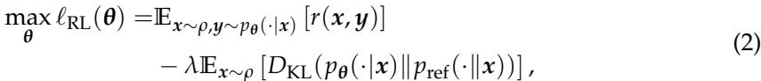

# Self-Rewarding PPO：僅使用示範資料對齊大型語言模型

**Qingru Zhang\***, Liang Qiu,  \(\diamond\) , **Ilgee Hong\***, **Zhenghao Xu\***, **Tianyi Liu\***, **Shiyang Li\***, **Rongzhi Zhang\***, **Zheng Li\***, **Lihong Li\***, **Bing Yin\***, **Chao Zhang\***, **Jianshu Chen\***, **Haoming Jiang\***, **Tuo Zhao\***

\(^{\dagger}\) Georgia Institute of Technology  \(\circ\) Amazon {qingru.zhang, tourzhao}@gategch.edu

## 摘要

監督式微調（SFT）已成為將大型語言模型（LLM）與人類標註的示範資料對齊的關鍵方法。然而，SFT 作為一種類似於行為模仿的離線（off-policy）方法，經常在資料有限的情境下，面臨過度擬合（overfitting）和域外（out-of-domain）泛化能力差的問題。為了解決這些限制，我們提出了一種新穎的微調方法——**Self-Rewarding PPO**，它利用在線（on-policy）技術來提升泛化效能。我們的方法結合了 SFT 和近端策略最佳化（PPO）的優點，從示範資料中實現更有效的對齊。其核心是設計一個獎勵函數，該函數為 SFT 模型與預訓練基礎模型之間的對數策略比率。此函數作為一個隱式獎勵訊號，使用預訓練策略作為基線，SFT 策略作為目標。透過這種方式，它無需依賴人類偏好標註即可實現線上微調。將這種自獎勵機制與 PPO 結合，解決了 SFT 的關鍵限制，從而改善了泛化能力、資料效率和穩健性。我們在多個自然語言處理任務上的實證評估顯示，**Self-Rewarding PPO** 始終優於傳統的 SFT 方法。結果突顯了我們方法在使用示範資料對齊大型語言模型方面的有效性，尤其是在高品質標註資料稀缺的場景中。

---

## 1 導論

大型語言模型（LLM）在從文本生成到複雜推理的各種任務中展現出卓越的效能（例如，Brown et al., 2020; Touvron et al., 2023; OpenAI, 2023）。它們生成連貫且與上下文相關的文本的能力，已在創意寫作、程式碼生成和對話式 AI 等領域實現了突破（Chen et al., 2021; Thoppilan et al., 2022; Bubeck et al., 2023; Anil et al., 2023）。然而，對齊這些模型以確保其安全性和實用性仍然是一項關鍵挑戰。

對齊（alignment）指的是塑造模型行為，使其遵循人類價值觀，同時避免產生有害、帶有偏見或無益的輸出（Bai et al., 2022a; Ganguli et al., 2022）。對齊過程通常包含兩個階段：（i）在示範資料上進行**監督式微調（SFT）**，在此階段模型會根據專家（人類或 AI）生成的提示與回應對進行微調，以模仿期望的行為（Wei et al., 2021; Chung et al., 2022; Zhou et al., 2023a; Tunstall et al., 2023）；（ii）**偏好學習**，在此階段使用偏好資料來學習一個獎勵模型，然後將其用於強化學習（RL）步驟中來微調模型（Christiano et al., 2017; Ouyang et al., 2022; Stiannon et al., 2020; Bai et al., 2022b）。在本研究中，我們專注於第一個階段：僅從示範資料中對齊語言模型，而不依賴偏好標註。

監督式微調（SFT）已成為從人類標註示範資料中學習期望行為的預設方法。這個目標與**模仿學習（imitation learning）**緊密相關（Hussein et al., 2017; Osa et al., 2018）。透過最大化示範資料中展示的專家行為的似然，SFT 等同於執行**行為模仿（behavior cloning）**，即模型旨在模仿示範的行動（Bratko et al., 1995; Torabi et al., 2018; Florence et al., 2022）。然而，作為一種類似於行為模仿的離線（off-policy）方法，SFT 通常需要大量的優質資料才能實現穩健的效能（Dubey et al., 2024）。在資料有限的場景中，SFT 經常會過度擬合到訓練分佈，尤其是在長時間訓練後，這會損害模型在未見過的範例和領域上的泛化能力（Zhang et al., 2024; Chen et al., 2024）。

  
圖 1：**自獎勵近端策略最佳化（SRPPO）**的示意圖。SRPPO 根據監督式微調（SFT）和預訓練策略之間的對數密度比率來定義獎勵。然後，它透過近端策略最佳化將該獎勵應用於進一步微調 SFT 策略。SRPPO 利用線上（on-policy）資料來改善學習策略的域外泛化能力。

值得注意的是，在線（on-policy）訓練方法，例如**近端策略最佳化（PPO, Schulman et al. (2017)）**，已廣泛應用於偏好學習階段（Ouyang et al., 2022; Bai et al., 2022b）。與 SFT 不同，PPO 生成多樣化的線上樣本來進行微調。它增強了資料多樣性，並使訓練過程適應模型的演變行為，從而提高了泛化效能。它們在偏好學習上的成功促使我們探索是否可以利用線上訓練技術來幫助 SFT。然而，一個主要挑戰是如何從資料中導出一個有意義的獎勵訊號，以實現線上訓練。最近的一些研究試圖從兩個角度解決這個挑戰。

一方面，受模仿學習進展的啟發，Li et al. (2024) 和 Sun & van der Schaar (2024) 採用**逆向強化學習（IRL）**（Ziebart et al., 2008; Ho & Ermon, 2016; Ghasemipour et al., 2020）來明確地學習一個獎勵模型。儘管有效，但這些方法需要使用雙層最佳化框架同時訓練策略和獎勵模型，這在收斂和訓練穩定性方面引入了顯著的複雜性。

另一方面，SPIN (Chen et al., 2024) 透過假設示範中的回應總是優於模型的線上樣本，從而繞過訓練一個明確的獎勵模型。它應用 DPO (Rafailov et al., 2024b) 來微調模型。由於它不涉及明確的獎勵，SPIN 在訓練期間無法容納示範資料之外的額外提示。同時，這個偏好假設並不總是成立，可能導致效能下降。儘管有這些努力，從示範資料中設計有意義的獎勵訊號仍然在很大程度上未經探索且充滿挑戰。

在本研究中，我們提出了 **Self-Rewarding PPO (SRPPO)**，這是一種新穎的微調方法，它彌合了監督式微調和強化學習微調之間的鴻溝，透過線上訓練從示範中實現更有效和穩健的對齊。我們方法的核心是提出一個名為**連貫獎勵（coherent reward）**的獎勵函數，它被設計為監督式微調模型（SFT 策略）和預訓練基礎模型（預訓練策略）之間的對數策略比率。具體來說，我們的方法包含兩個步驟。首先，我們使用高品質示範——提示和期望回應對——來對預訓練基礎模型執行 SFT。接著，我們從 SFT 和預訓練策略中導出連貫獎勵。在連貫獎勵的指導下，我們應用 PPO 使用一系列提示來持續微調模型。圖 1 說明了我們方法的兩個階段。

與現有的 IRL 方法 Li et al. (2024) 不同，SRPPO 無需訓練一個獎勵模型。相反，連貫獎勵直接從 SFT 策略導出，這與要訓練的模型是同一個，提供了一個簡單而有效的自獎勵機制。這個獎勵設計的靈感來自於**連貫軟模仿學習（coherent soft imitation learning）**（Watson et al., 2024）。連貫獎勵利用預訓練策略作為基線，SFT 策略作為目標。它建立了一個訓練方向，將模型的行為從預訓練基線推向中度對齊的 SFT 策略。然後，PPO 階段透過線上取樣進一步沿著這個對齊方向精煉模型。此外，與 SPIN 相比，SRPPO 允許在 PPO 步驟中使用示範資料之外的額外提示。這種靈活性在高品質回應稀缺但容易獲得大量相似提示的場景中特別有優勢。在這種情況下，少量的優質示範資料可以在 SFT 期間用於建立一個由連貫獎勵捕捉到的對齊方向。隨後，在 PPO 微調步驟中，額外提示可以用來取樣更多的線上回應，然後由連貫獎勵進行評估，進一步沿著既定方向精煉模型。從經驗上看，我們觀察到連貫獎勵能有效地從一小部分代表性示範泛化到更廣泛的提示範圍（第 4 節）。因此，**Self-Rewarding PPO** 不僅利用線上樣本擴充了訓練資料，還允許使用額外的提示來增強對齊。

我們進行了實驗，使用 LLAMA3-8B 和 Mistral-7B 作為基礎模型來證明 **Self-Rewering PPO** 的有效性。實證結果顯示，與 SFT 和其他替代方法相比，SRPPO 在各種自然語言處理任務的評估基準上顯著提高了微調效能，證明了其在改進模型對齊和泛化能力上的有效性。

---

## 2 背景

考慮一個由 \(\theta\) 參數化的語言模型，並將其輸出機率（或策略）表示為 \(p_{\theta}(y|x)\)，其中 \(x = [x_1, \ldots, x_n]\) 是輸入提示序列，\(y = [y_1, \ldots, y_m]\) 是輸出回應序列。LLM 通常是**自迴歸模型（auto-regressive models）**：它們一個接一個地生成詞元，並在每個給定位置根據 \(x\) 和 \(y_{<j} = [y_1, \ldots, y_{j-1}]\) 預測 \(y_j\) 的輸出機率（\(y_{<1}\) 為空）：

這個過程構成一個**馬可夫決策過程（MDP）**，其中狀態轉換是確定的，模型在每個給定位置順序生成詞元，僅利用先前的詞元序列。接下來，我們將討論兩種常見的微調 \(\theta\) 程序：（i）在示範資料集上的**監督式微調（SFT）**，以及（ii）在偏好資料集上的**帶有人類回饋的強化學習（RLHF）**。

**SFT**。監督式微調（SFT）將預訓練的 LLM 對齊或適應特定任務，（例如，指令遵循、程式碼生成、數學推理）。這個過程依賴於一個示範資料集 \(\mathcal{D} = \{(x,y)\}\)，其中包含從任務分佈 \(\rho\) 中取樣的提示 \(x\)，以及由專家 \(p_{\mathrm{expert}}(\cdot | x)\) 標註的回應 \(y\)。SFT 使用**最大似然目標（maximum-likelihood objective）**：

顯然，上述問題與 \(\min_{\pmb{\theta}}\mathbb{E}_{x\sim \rho}[D_{\mathrm{KL}}(p_{\mathrm{expert}}(\cdot |x)\| p_{\pmb{\theta}}(\cdot |x))]\) 共享相同的最佳解。\(\ell_{\mathrm{SFT}}(\pmb {\theta})\) 在模型 \(p_{\theta}\) 與專家行為完美對齊時達到其最佳狀態。因此，微調後的模型預期會生成與專家相似的回應。SFT 與模仿學習 Osa et al. (2018) 緊密相關，其目標是模仿專家的策略。

**RLHF**。RLHF 是對齊 LLM 的第二個階段，在 SFT 階段之後。假設我們有一個確定性獎勵模型 \(r(x,y)\)，它評估一個給定的提示-回應對 \((x,y)\)。RLHF 透過解決以下 RL 問題來微調模型：

其中 \(p_{\mathrm{ref}}\) 是一個參考模型。由於計算所有可能輸出 \(y\) 上的 KL 正則化是難以處理的，(2) 通常由**策略最佳化技術**（如 REINFORCE (Williams, 1992; Ahmadian et al., 2024) 和 PPO (Schulman et al., 2017)）來解決。

為了獲得獎勵模型 \(r(x,y)\)，RLHF 通常假設有一個偏好資料集 \(\mathcal{M} = \{x,y_w,y_l\}\)，其中每筆資料包含一個針對提示 \(x\) 的輸出對 \((y_w,y_l)\)。在這裡，\(y_w\) 被人類標註者認為優於 \(y_l\)，表示為 \(y_w\succ y_l\) (Christiano et al., 2017; Ouyang et al., 2022)。**Bradley-Terry 模型** (Bradley & Terry, 1952) 用於模擬選擇 \(y_w\) 而非 \(y_l\) 的機率：

其中 \(\sigma (\cdot)\) 是 sigmoid 函數。獎勵模型透過以下目標進行訓練：

廣泛研究表明，透過週期性地學習策略 (2) 和學習獎勵來訓練的模型通常優於僅使用 SFT 訓練的模型 (Ouyang et al., 2022)。獎勵模型指導了 LLM 的效能，並由於整合了來自人類標註者的額外偏好資料而具有更好的泛化能力。

**討論**。在本研究中，我們專注於使用示範資料對齊 LLM。如 (1) 所示，SFT 是一種類似於行為模仿的離線（off-policy）方法，其中模型僅根據提供的資料進行微調以模仿專家行為。因此，它經常過度擬合訓練分佈，導致次優的域外泛化。相比之下，(2) 中的 RL 微調是一種在線（on-policy）方法，它直接從模型當前策略中取樣回應並進行最佳化，以最大化後續樣本的獎勵。這種適應性使得訓練過程能夠與模型不斷演變的行為對齊，從而改善泛化和穩健性。受此啟發，本文研究了以下問題：

*我們能否利用在線訓練技術來彌合 SFT 和 RL 微調之間的鴻溝，從而僅從示範中增強對齊？*

在下一節中，我們將深入探討這個前景，並用我們的解決方案來回答這個問題。

---

## 3 方法

我們提出的方法 **Self-Rewarding PPO (SRPPO)** 結合了 SFT 和 RL 微調的優點。在 SRPPO 的核心，我們引入了一個新穎的獎勵函數——**連貫獎勵**，它建立了與監督式微調階段一致的對齊方向，從而透過 RL 微調實現持續精煉。

### 3.1 連貫獎勵

為了使用示範資料實現線上訓練，我們提出了**連貫獎勵（Coherent Reward）**，這是一種新穎的獎勵函數，其導出方式為初始預訓練模型（預訓練策略 \(p_{\theta^{(\mathrm{PT})}}\)）與在示範上微調的模型（SFT 策略 \(p_{\theta^{(\mathrm{SFT})}}\)）之間的對數策略比率。具體來說，對於任何對 \((x,y)\)，連貫獎勵定義為：

我們的連貫獎勵受到**連貫軟模仿學習（coherent soft imitation learning）**方法 Watson et al. (2024) 的啟發。直觀地說，它利用預訓練策略作為基線，SFT 策略作為目標。對於一對提示和回應，它量化了這兩個策略在該對上的差異，從而建立了一個訓練方向，將模型的行為從預訓練基線轉變為中度對齊的 SFT 策略。然後，我們利用這個獎勵進行後續的 RL 微調，確保 RL 微調在 SFT 階段的改進基礎上有效建立，並沿著這個對齊軌跡進一步精煉模型。

### 3.2 自獎勵 PPO

如圖 1 所示，我們的 **Self-Rewarding PPO** 方法包含兩個連續的訓練階段：

1. **監督式微調**：給定一個示範資料集 \(\mathcal{D} = \{(x,y)_i\}_i\)，我們透過最佳化 (1) 在 \(\mathcal{D}\) 上微調預訓練基礎模型 \(p_{\theta^{(\mathrm{PT})}}\)，並獲得 SFT 策略 \(p_{\theta^{(\mathrm{SFT})}}\)，我們從中導出如 (3) 的連貫獎勵 \(\tilde{r}\)。  
2. **RL 微調**：給定一個提示集 \(\mathcal{P} = \{\pmb{y}_i\}_i\)，我們進一步執行線上 RL 微調，透過最佳化目標 (2) 來持續精煉 SFT 策略，其中獎勵值是我們的連貫獎勵。

對於 RL 微調階段，我們使用 PPO 作為策略最佳化演算法。請參見附錄 B 以獲取 PPO 的詳細資訊。值得注意的是，其他演算法，如 REINFORCE (Williams, 1992)、GRPO (Shao et al., 2024) 或 RLOO (Ahmadian et al., 2024) 也可以作為替代方案。

在使用 PPO 微調模型時，我們將包含 [EOS] 詞元的狀態視為終止狀態。我們在過程層級分配如 (4) 所定義的連貫獎勵。或者，我們可以將過程層級的連貫獎勵修訂為一個詞元級別的獎勵 \(r(y_{j}|x,y_{< j}) = \log \frac{p_{\theta(\mathrm{SFT})}(y_{j}|x,y_{< j})}{p_{\theta(\mathrm{PT})}(y_{j}|x,y_{< j})}\)，並在詞元級別分配它，我們在附錄 E 中進一步討論。

我們的連貫獎勵簡單而有意義。它為來自示範的線上對齊訓練提供了一個簡單而有效的自獎勵機制，無需獎勵學習或逆向強化學習。它的優勢主要來自兩個關於線上回應 \(y \sim p_{\theta}(\cdot | x)\) 和輸入提示 \(x \sim \rho\) 的關鍵視角。首先，連貫獎勵源自正在微調的同一模型（即 SFT 策略）。值得注意的是，在 RL 微調期間，線上回應 \(y\) 是從同一模型中取樣的。因此，連貫獎勵對模型自身回應 \(y \sim p_{\theta}(\cdot | x)\) 的變化**本質上是敏感的**。與獨立的獎勵模型相比，連貫獎勵可以捕捉到 \(y\) 的細微變化，提供更準確和適應性的獎勵評估。其次，我們的方法**允許包含示範資料集之外的額外提示**。與 SPIN (Chen et al., 2024) 等依賴 DPO 並僅限於示範提示的方法相比，這是一個顯著的優勢。當高品質、人類標註的回應稀缺但可以輕鬆獲得相似的提示時，這種靈活性可能特別有益。在這種情況下，SFT 容易過度擬合。相比之下，SRPPO 允許我們首先使用少量示範資料微調模型，以建立一個對齊方向。隨後，我們可以從任務分佈 \(x \sim \rho\) 中取樣更多提示，並利用它們和它們的線上樣本來繼續沿著由連貫獎勵給定的對齊方向精煉模型。在第 4 節中，我們透過實證證明了連貫獎勵如何有效地從少量示範資料泛化到更廣泛的提示範圍。我們在演算法 1 中總結了 **Self-Rewarding PPO**。

**表 1**：在**最小重疊（minimum overlap）**設置下，Mistral-7B 的微調結果。SFT 僅使用 Tulu-v2 進行。最佳結果以**粗體**顯示。平均分數是透過首先對每個任務的兩個分數進行平均，然後對四個任務的平均分數進行平均來計算的。  

**表 2**：在**最小重疊（minimum overlap）**設置下，LLAMA3-8B 的微調結果。SFT 僅使用 Tulu-v2 進行。最佳結果以**粗體**顯示。  

---

## 4 實驗

我們透過微調預訓練的 Mistral-7B (Jiang et al., 2023) 和 LLAMA3-8B (Dubey et al., 2024) 模型來評估 **Self-Rewarding PPO** 的有效性。評估涵蓋了一系列多樣化的基準，包括**指令遵循** (IFEval, Zhou et al. (2023b))、**數學推理** (GSM8k, Cobbe et al. (2021))、**研究生級別問答** (GPQA, Rein et al. (2023)) 和**對話能力** (AlpacaEval, Dubois et al. (2024))。我們的實驗突顯了 SRPPO 的以下優勢：

- **無需額外的人工標註即可提高效能**：在不引入新的人類標註資料的情況下，與 SFT 和其他替代方案相比，SRPPO 在廣泛的評估基準上顯著提高了模型效能。
- **有效泛化到額外提示**：SRPPO 能夠在 RL 微調中包含額外提示，從而進一步提高模型效能。這表明連貫獎勵可以有效地從人類標註的示範資料泛化到更廣泛的提示範圍，在沒有新標註的情況下增強對齊。

### 4.1 實驗設置

**模型和資料集**。我們採用預訓練的 Mistral-7B (Jiang et al., 2023) 和 LLAMA3-8B (Dubey et al., 2024) 作為我們的基礎模型，然後進行監督式和 RL 微調以評估我們的方法。對於訓練，我們利用兩個資料集：**TULU-v2-mix** (Ivison et al., 2023) 和 **UltraFeedback** (Cui et al., 2024)。TULU-v2-mix 是一個混合了高品質指令資料集的集合，包含來自 11 個不同來源的 32.6 萬個範例。UltraFeedback 是一個大規模、細粒度的偏好資料集，包含 6.4 萬個與指令遵循、真實性、誠實性和有用性等方面相關的範例。由於 TULU-v2-mix 是一個以在各種任務上持續改進模型能力而聞名的高品質資料集，我們主要將其用於監督式微調，以確保模型的初始對齊。為了評估我們的連貫獎勵在示範資料之外的泛化能力，我們在 PPO 微調階段使用來自 UltraFeedback 的提示。這種設置使我們能夠檢驗我們的獎勵機制在沒有額外人類標註的情況下，如何很好地轉換到新的提示上。

由於連貫獎勵是從 SFT 策略中導出的，因此 SFT 訓練資料的選擇對其有效性至關重要。根據經驗，我們發現將 SFT 示範資料與 PPO 提示資料重疊有助於導出更穩健的連貫獎勵。為了系統地評估我們方法的泛化能力，我們考慮了以下 SRPPO 中選擇 SFT 訓練資料的實驗設置：

1. **最小重疊（Minimum overlap）**：我們僅在 TULU-v2-mix 上進行 SFT，確保 SFT 訓練對和 PPO 訓練提示之間存在最小重疊。這個設置旨在評估當 PPO 階段遇到 SFT 期間未見過的提示時，SRPPO 的泛化能力。表 1 和表 2 展示了這種設置下的結果。  
2. **中等重疊（Medium overlap）**：為了引入受控的重疊程度，我們從 UltraFeedback 中取樣了 9,000 個提示，並使用 GPT-4 生成高品質回應進行標註。模型首先使用 TULU-v2-mix 進行微調，然後在這個小的 UltraFeedback 示範子集上進行額外微調。表 3 顯示了結果。  
3. **減弱重疊（Diminished overlap）**：我們首先使用 TULU-v2-mix 微調模型以建立初始對齊。然後，我們使用小的 UltraFeedback 示範子集和額外的 4 萬個來自 TULU-v2-mix 的範例進行額外監督式微調，以進一步精煉模型。表 4 展示了這種設置下的結果。

這些設置使我們能夠分析不同程度的訓練資料重疊如何影響連貫獎勵的有效性。

**評估**。我們從不同角度評估模型效能，包括指令遵循 (IFEval, Zhou et al. (2023b))、數學推理 (GSM8k, Cobbe et al. (2021))、研究生級別問答 (GPQA, Rein et al. (2023)) 和對話能力 (AlpacaEval, Dubois et al. (2024))。對於 IFEval，我們報告指令級別的**寬鬆準確率（L.Acc）**和**嚴格準確率（S.Acc）**。對於 GSM8k，我們評估 5-shot 效能並報告**精確匹配（EM）**。對於 GPQA，我們評估**少樣本（few-shot）**和**少樣本思維鏈（few-shot Chain-of-Thought (CoT)）**效能 (Wei et al., 2022b)。這些評估均使用 'lm-evaluation-harness' 框架 (Gao et al., 2024) 在其預設設置下進行。對於 AlpacaEval，我們報告**長度控制的勝率（length-controlled win-rate）**和**總體勝率（overall win-rate）**。

**實施細節**。我們使用 PyTorch (Paszke et al., 2019) 來實施所有演算法。我們的實施基於公開可用的 Huggingface Transformers¹ (Wolf et al., 2019) 和 OpenRLHF (Hu et al., 2024) 程式碼庫。所有實驗均在 NVIDIA A100 GPU 上進行。

關於 SFT 的超參數，我們將批次大小設定為 128，訓練週期為 2，從 \(\{1\times 10^{-5},5\times 10^{-6},1\times 10^{-6},5\times 10^{-7}\}\) 中選擇學習率，並為 SRPPO 和基準方法選擇最佳學習率。對於 PPO 的超參數，我們將 rollout 緩衝區大小設定為 1024，訓練批次大小為 128，KL 係數為 0.2 或 0.5，裁剪係數為 0.2。我們從 SFT 策略初始化 critic 模型，將其學習率設定為 \(9\times 10^{-6}\)，並為 35 個 rollout 緩衝區進行 critic 微調的熱身。然後，我們微調 actor 模型 2 個 episodes，並從 \(\{5\times 10^{-8},2\times 10^{-8},1\times 10^{-8}\}\) 中選擇 actor 的學習率。

**基準**。我們將 **Self-Rewarding PPO** 與以下方法進行比較：

- **SFT**：這是用於對齊 LLM 的標準方法，它最佳化 (1)。SFT 也是 SRPPO 繼續微調的起始模型。我們將訓練週期設定為 2，因為這通常會產生最佳效能。針對不同的訓練資料，我們將 SRPPO 與其僅有 SFT 的階段進行比較，以展示使用我們的連貫獎勵進行 PPO 微調的有效性。  
- **SFT (Extended)**：這個基準透過運行額外的 SFT 週期來擴展 SFT 策略的微調。具體來說，它從 SFT 策略開始，並進行進一步微調，例如總共 6 個週期，以檢驗延長的 SFT 如何影響模型效能。

**表 3**：在**中等重疊（medium overlap）**設置下，Mistral-7B 和 LLAMA3-8B 的微調結果。SFT 使用 Tulu-v2 和少量 Ultrafeedback 示範進行。最佳結果以粗體顯示。  

**表 4**：在**減弱重疊（diminished overlap）**設置下，Mistral-7B 的微調結果。我們首先使用 TULU-v2-mix 微調模型，然後使用小的 UltraFeedback 示範子集和額外的 4 萬個來自 TULU-v2-mix 的範例進行額外的 SFT 來精煉模型。  

- **帶有獨立偏好獎勵模型的 PPO**：這個基準在 SFT 階段之後，採用一個公開可用的偏好獎勵模型 (Fsfairx-LLAMA3-RM; Dong et al., 2024) 進行 PPO 微調，而不是使用我們的連貫獎勵。這個基準展示了我們的連貫獎勵與從偏好資料訓練的獎勵模型之間的比較，前者不依賴額外的偏好資料。  
- **SPIN** (Chen et al., 2024)：這個基準是一種基於**自玩（self-play）**的微調方法，其中相同的目標 LLM 生成合成資料並評論自己的輸出。

### 4.2 主要結果

我們在表 1 和表 2 中呈現主要結果。這對應於選擇 SFT 資料的**最小重疊**的第一個設置，其中我們僅在 TULU-v2-mix 上執行 SFT，然後使用 UltraFeedback 提示應用 PPO。如圖所示，SRPPO 在 IFEval、GSM8k 和 AlpacaEval 上始終優於基準方法，為 Mistral-7B 和 LLAMA3-8B 實現了最佳的總體平均分數。儘管 SFT (Extended) 在 GPQA 上實現了最佳的 Direct EM，SRPPO 仍然表現出競爭力。特別是，將 SFT 訓練延長到更多週期在某些領域（如問答和指令遵循）提高了效能。然而，延長的 SFT 也導致對訓練分佈的過度擬合，對域外泛化產生負面影響。如表 2 所示，在 TULU-v2-mix 上將 SFT 延長到 6 個週期（相較於 2 個週期）提高了 IFEval 和 GPQA 的準確性，這很可能是因為大多數 TULU-v2-mix 範例屬於相似的領域。然而，這種延長的訓練降低了在數學推理上的效能（表 1 和表 2）。這個結果驗證了我們在第 1 節中的論點，即延長的 SFT 傾向於導致過度擬合，從而損害對域外任務的泛化。相比之下，SRPPO 增強了模型的泛化能力，在所有四個任務上都產生了效能增益。如表 2 所示，SRPPO 顯著提高了指令遵循和數學推理的效能，因為它有效地實現了在額外提示上的線上訓練。這些結果表明，SRPPO 可以有效利用額外提示來增強模型能力，而無需偏好標註。

此外，如表 2 所示，帶有獨立偏好獎勵模型的 PPO 相對於 SFT 僅提供了微小的改進，而 SRPPO 在所有基準上都持續優於 SFT。這表明我們的自獎勵機制的有效性。由於連貫獎勵直接從 SFT 策略導出，它在 RL 微調期間對模型自身回應 \(y \sim p_{\theta}\) 的變化**本質上是敏感的**。與獨立的獎勵模型相比（表 2），我們假設連貫獎勵可以捕捉到 \(y\) 的細微變化，從而實現更準確和適應性的獎勵評估。此外，我們在表 1 中將 SRPPO 與 SPIN 進行比較。與 SRPPO 類似，SPIN 從 SFT 策略初始化。然而，與 SRPPO 不同的是，SPIN 使用來自 TULU-v2-mix 的全部 35 萬個範例進行其首次迭代的 DPO，這個資料集顯著大於 SRPPO 使用的資料集。儘管有這個資料優勢，雖然 SPIN 相對於 SFT 有所改進，但 SRPPO 始終優於 SPIN，證明了其作為一種用示範進行對齊的微調方法的有效性。

表 3 和表 4 分別呈現了**中等重疊**和**減弱重疊**設置的結果（參見第 4.1 節）。在表 3 中，在 SFT 階段，我們首先在大規模的 TULU-v2-mix 上微調模型以建立其基本能力，然後使用來自 UltraFeedback 的 9,000 個高品質示範子集進行額外精煉，其中提示來自 UltraFeedback，回應由 GPT-4 標註。這導致 SFT 提示和 PPO 提示之間存在**中等重疊**。我們觀察到，使用這 9,000 個子集的 SFT 顯著提高了指令遵循和對話能力，但由於這個子集中數學相關資料的稀缺，嚴重降低了數學推理能力，導致對訓練領域的過度擬合。相比之下，SRPPO 有效地緩解了這個問題，恢復了數學推理效能，並為 Mistral-7B 產生了顯著的 \(4.06\%\) EM 提升，這與表 1 和表 2 中的觀察結果一致。更重要的是，SRPPO 進一步增強了 IFEval 準確率，因為提示重疊導致連貫獎勵在 PPO 提示上表現出更好的泛化能力。在**減弱重疊**的設置中，我們從**中等重疊**設置的 SFT 策略開始，並使用額外的 4 萬個來自 TULU-v2-mix 的範例進一步微調它。這一步驟減少了由 9,000 個 UltraFeedback 示範子集引入的重疊效應。即使在這種設置下，SRPPO 仍然持續優於 SFT，證明了連貫獎勵有效地泛化到額外提示。這些結果證實，SRPPO 透過使用額外提示進行線上訓練來增強模型效能。