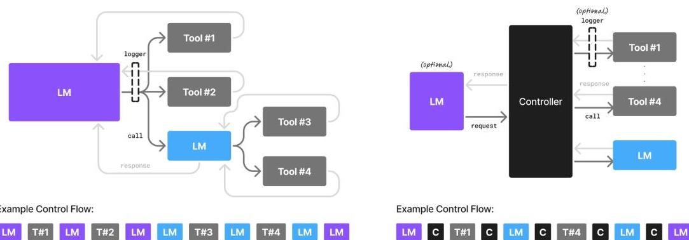

# 小型語言模型是代理式 AI 的未來

Peter Belcak1 Greg Heinrich1 Shizhe Diao1 Yonggan Fu1 Xin Dong1 Saurav Muralidharan1 Yingyan Celine Lin1,2 Pavlo Molchanov1 1NVIDIA Research 2Georgia Institute of Technology agents@nvidia.com

## 摘要

大型語言模型 (LLMs) 經常因其在廣泛任務上展現出近乎人類的表現，以及其進行一般對話的能力而備受讚譽。然而，代理式 AI 系統的興起，正迎來了大量的應用，其中語言模型重複執行少量特定任務，且變化甚微。

我們在此提出一個觀點：**小型語言模型 (SLMs)** 對於代理式系統中的許多應用來說，不僅足夠強大、本質上更適合，而且必然更具經濟效益，因此是代理式 AI 的未來。我們的論證基於 SLMs 目前展現的能力水平、代理式系統的常見架構，以及語言模型部署的經濟性。我們進一步論證，在通用對話能力至關重要的情況下，**異構代理式系統**（即調用多個不同模型的代理）是自然而然的選擇。我們討論了在代理式系統中採用 SLMs 的潛在障礙，並概述了一個通用的 LLM-to-SLM 代理轉換演算法。

我們的立場，以價值陳述的形式提出，強調了即使是從 LLMs 部分轉向 SLMs，也將對 AI 代理產業產生巨大的營運和經濟影響。我們的目標是激發關於有效利用 AI 資源的討論，並希望能推動降低當前 AI 成本的努力。我們呼籲對我們的立場提供貢獻和批評，並承諾將所有此類信函發布在 research.nvidia.com/labs/lpr/slm-agents。

## 1 簡介

代理式人工智慧的部署正呈爆炸性增長。最近的調查顯示，超過一半的大型 IT 企業正在積極使用 AI 代理，其中有 $21\%$ 是在去年才剛開始採用 [12]。除了使用者之外，市場也看到了 AI 代理的巨大經濟價值：截至 2024 年底，代理式 AI 領域已獲得超過 20 億美元的新創資金，市值達 52 億美元，並預計在 2034 年增長至近 2000 億美元 [42, 47]。簡而言之，人們越來越期待 AI 代理將在現代經濟中扮演重要角色。

大多數現代 AI 代理的核心元件是（非常）大的語言模型 [48, 44]。正是 LLMs 提供了基礎智慧，使代理能夠對何時以及如何使用可用工具做出策略性決策，控制完成任務所需的操作流程，並在必要時將複雜任務分解為可管理的子任務，並進行推理以進行行動規劃和問題解決 [48, 14]。一個典型的 AI 代理然後只需透過向託管這些模型的中心化雲端基礎設施發出請求，來與選定的 LLM API 端點進行通訊 [48]。

LLM API 端點專門設計用於使用一個通用 LLM 來處理大量多樣化的請求。這種操作模型在產業中根深蒂固——事實上，它已成為巨額資本押注的基礎：雖然支撐代理式應用程式的 LLM API 服務市場在 2024 年估計為 56 億美元 [26]，但同年對託管雲端基礎設施的投資卻激增至 570 億美元 [72]。投資與市場規模之間存在 10 倍的差距已被接受，因為人們假設這種操作模型將在沒有任何實質性改變的情況下，繼續作為該產業的基石，並且巨大的初始投資將在 3-4 年內帶來與傳統軟體和網際網路解決方案相當的回報 [53]。

在這項工作中，我們承認標準操作模型的主導地位，但口頭上挑戰其一個方面，即儘管代理的語言智慧請求相對簡單，但卻習慣性地由單一選擇的通用 LLMs 處理。我們陳述（第 2 節）、論證（第 3 節）和捍衛（第 4 節）了這樣一個立場：小型語言模型而非大型語言模型是代理式 AI 的未來。然而，我們也意識到業務承諾和非傳統做法是導致目前現狀的原因（第 5 節）。作為補救，我們提供了一個將代理式應用程式從 LLMs 遷移到 SLMs 的轉換演算法綱要（第 6 節），並呼籲進行更廣泛的討論（第 7 節）。如果需要具體化我們的立場，我們附上了一組簡短的案例研究，評估在選定的流行開源代理中 LLM-to-SLM 替代的潛在程度（附錄 B）。

## 2 立場

### 2.1 定義

為了具體化我們的立場，我們採用以下工作定義：

**WD1** SLM 是一種可以裝入普通消費電子設備並以足夠低的延遲進行推論，以實用化地服務一個使用者的代理請求的語言模型。
**WD2** LLM 是一種不是 SLM 的語言模型。

我們在附錄 A 中解釋了這些定義的措辭，但請注意，它們的選擇對我們立場的本質影響不大。我們注意到，截至 2025 年，我們樂於將大多數參數數量低於 100 億的模型視為 SLMs。

我們交替使用**代理 (agent)** 和**代理式系統 (agentic system)** 這兩個詞，當強調作為一個整體具有一定**代理性 (agency)** 的軟體時，我們更喜歡前者（例如，“在流行的程式設計代理中可以看到”），而當強調代理式應用程式作為其組成部分總和的系統方面時，我們更喜歡後者（例如，“並非代理式系統中的所有 LMs 都可以被 SLMs 替換”）。為簡潔起見，我們專注於 LMs 作為代理式應用程式的基石，並未明確考慮視覺-語言模型，儘管我們注意到我們的立場和大多數論點也同樣適用於視覺-語言模型。

### 2.2 陳述

我們認為 SLMs 是：

**V1** 原則上足夠強大，可以處理代理式應用程式的語言建模任務；
**V2** 在代理式系統中的使用上，本質上比 LLMs 更具營運上的適宜性；
**V3** 由於其尺寸較小，對於代理式系統中的絕大多數語言模型用途來說，必然比其通用 LLM 對應物更具經濟效益；

並且基於 V1-V3 觀點，SLMs 是代理式 AI 的未來。

我們立場的措辭是經過深思熟慮的。在我們的陳述中，我們希望傳達，如果遵循自然優先順序，所描述的未來發展最終將是 SLMs 和 LLMs 之間差異的必然結果。我們不作推薦或試圖強加義務——我們陳述我們所看到的，是對社群在此背景下價值觀的忠實反映。

### 2.3 闡述

我們斷言，LLMs 在 AI 代理設計中的主導地位是過度且與大多數代理式用例的功能需求不符。雖然 LLMs 提供了令人印象深刻的通用性和對話流暢性，但已部署的代理式系統中，大多數代理子任務是重複的、有範圍限制的且非對話性的——這需要高效、可預測且廉價的模型。在這種情況下，SLMs 不僅足夠，而且通常更為優選。它們提供了多個優勢；**更低的延遲、更少的記憶體和運算需求，以及顯著更低的營運成本**，同時在受限領域內保持足夠的任務效能。

我們的立場源於對代理式架構內語言模型使用模式的實用觀點。這些系統通常將複雜目標分解為模組化子任務，每個子任務都可以由專門化或微調過的 SLMs 可靠地處理。我們認為，堅持為所有此類任務使用 LLMs 反映了運算資源的錯誤配置——這在大規模上是經濟低效且環境不可持續的。

此外，在需要通用推理或開放領域對話的情況下，我們提倡**異構代理式系統**，其中預設使用 SLMs，而 LLMs 僅被選擇性且少量地調用。這種模組化組合——將 SLMs 的精準和效率與 LLMs 的通用性相結合——能夠構建出既具成本效益又功能強大的代理。

最終，我們觀察到，將範式從以 LLM 為中心轉向以 SLM 為優先的架構，對許多人來說不僅僅是技術上的改進，也是一種休謨式的**道德義務 (Humean moral ought)**。隨著 AI 社群努力應對不斷上升的基礎設施成本和環境問題，在代理式工作流程中採用和正規化 SLMs 的使用，可以在促進負責任和可持續的 AI 部署方面發揮關鍵作用。

## 3 立場論點

我們以下列非獨有的論點來支持 V1-V3 觀點。

### 3.1 SLMs 在代理中的使用已足夠強大

**A1** SLMs 足夠強大，可以取代代理式系統中的 LLMs。此論點支持觀點 V1。

在過去幾年裡，小型語言模型的能力已顯著提升。儘管語言模型的縮放定律仍被觀察到，但模型尺寸與能力之間的縮放曲線正變得越來越陡峭，這意味著較新的小型語言模型的能力與以前的大型語言模型更為接近。事實上，最近的進展表明，設計精良的小型語言模型可以達到或超過先前僅歸因於更大模型的任務效能。

在以下引用的個別研究中，已進行了與大型模型的廣泛比較，但並非所有基準測試評估的能力都對其在代理式情境中的部署至關重要。我們在此強調它們在以下方面的能力：**常識推理**（基本理解的指標）、**工具調用和程式碼生成**（兩者都是跨模型 $\rightarrow$ 工具/程式碼介面正確通訊的能力指標；參見圖 1；[74, 75]），以及**指令遵循**（跨程式碼-模型介面正確回應的能力；[80]）。在每種情況下，我們也引用了作者所述的效率提升。

* **Microsoft Phi 系列**。Phi-2 (2.7 億) 在常識推理和程式碼生成方面達到了與 300 億模型相當的分數，同時運行速度快約 $15\times$ [34]。Phi-3 small (70 億) [3] 在語言理解和常識推理方面達到了與高達 700 億同代模型相當的分數，並且在程式碼生成方面也表現出色。
* **NVIDIA Nemotron-H 系列**。20/48/90 億混合 Mamba-Transformer 模型實現了與同代 300 億密集 LLMs 相當的指令遵循和程式碼生成準確度，其推論 FLOPs 僅為其一個量級的分數 [7]。
* **Huggingface SmoILM2 系列**。SmoILM2 系列緊湊型語言模型，尺寸從 $125\mathrm{mn}$ 到 17 億參數不等 [6]，在語言理解、工具調用和指令遵循方面均達到其 140 億同代模型的水平，同時與兩年前的 700 億模型表現相當。
* **NVIDIA Hymba-1.5B**。這款 Mamba-attention 混合頭 SLM 展現出最佳的指令準確度，以及比同尺寸的 Transformer 模型高 $3.5 \times$ 的代幣吞吐量 [20]。在指令遵循方面，它甚至超越了更大的 130 億模型。
* **DeepSeek-R1-Distill 系列**。DeepSeek-R1-Distill 是一個推理模型家族，尺寸從 1.5 到 80 億不等，訓練數據來自 DeepSeek-R1 生成的樣本 [16]。它們展示了強大的常識推理能力。值得注意的是，DeepSeek-R1-Distill-Queen-7B 模型超越了像 Claude-3.5-Sonnet-1022 和 GPT-4o-0513 這樣的大型專有模型。
* **DeepMind RETRO-7.5B**。檢索增強型 Transformer (RETRO) 是一個 75 億參數的模型，並透過一個廣泛的外部文字資料庫進行增強，其在語言建模方面的效能與 GPT-3 (1750 億) 相當，同時使用的參數數量少了 $25 \times$ [8]。
* **Salesforce xLAM-2-8B**。這款 80 億參數模型儘管尺寸相對適中，但在工具調用方面取得了最先進的效能，超越了像 GPT-4o 和 Claude 3.5 這樣的頂尖模型 [78]。

請注意，除了具有競爭力的開箱即用效能外，SLMs 的推理能力還可以透過**自我一致性、驗證器回饋或工具增強**在推論時得到提升——例如，Toolformer (67 億) 透過 API 使用超越了 GPT-3 (1750 億) [61]，而 10-30 億模型則透過結構化推理在數學問題上與 300 億+ LLMs 競爭 [81]。

總之，憑藉現代訓練、提示和代理式增強技術，**能力——而非參數數量——才是束縛性約束**。SLMs 現在為代理式調用的絕大部分提供了足夠的推理能力，使其不僅可行，而且與 LLMs 相比，對於模組化和可擴展的代理式系統來說更具適用性。

圖 1：不同代理模式的代理式系統圖示。左：**語言模型代理**。語言模型既是人機介面 (HCI)，也是工具調用的協調者，以完成任務。右：**程式碼代理**。語言模型扮演人機介面（可選）的角色，而一個專門的控制器程式碼則協調所有互動。

### 3.2 SLMs 在代理式系統中更具經濟效益

**A2** SLMs 在代理式系統中比 LLMs 更具經濟效益。此論點支持觀點 V3。

小型模型在成本效益、適應性和部署靈活性方面提供了顯著優勢。這些優勢在代理式工作流程中特別有價值，其中**專業化和迭代細化**至關重要。第 3.1 節詳細介紹了所列 SLMs 與相關 LLMs 的多項效率比較。我們在此繪製一幅更全面的圖景來支持論點 A2。

* **推論效率**。服務一個 70 億 SLM 比一個 700-1750 億 LLM 便宜 $10-30 \times$（在延遲、能耗和 FLOPs 方面），從而實現大規模即時代理式回應 [66, 64, 33, 49]。最近的推論作業系統進展，例如 NVIDIA Dynamo [21]，明確支援在雲端和邊緣部署中進行高吞吐量、低延遲的 SLM 推論。此外，由於 SLMs 較少或不需要跨 GPU 和節點進行平行化，因此服務基礎設施的維護和營運費用也更低（參見反駁論點 CA4 和論點 A13）。
* **微調敏捷性**。參數高效（例如 LoRA [30] 和 DoRA [40]）和全參數微調對於 SLMs 來說僅需幾個 GPU-小時，允許在一夜之間而不是數週內添加、修復或專業化行為 [66]。
* **邊緣部署**。裝置上推論系統的進展，例如 ChatRTX [55]，展示了在消費級 GPU 上本地執行 SLMs，展示了具有更低延遲和更強數據控制的即時、離線代理式推論。
* **參數利用率**。從一開始，LLMs 似乎作為一個整體運作，涉及大量參數來表示其輸出中壓縮的大量資訊。然而，仔細觀察，透過這些系統傳遞的許多訊號是**稀疏的 (sparse)**，對於任何單一輸入，其參數只有一小部分參與 [65, 41]。這種行為在 SLMs 中似乎更為溫和 [65, 71]，這表明 SLMs 可能本質上更有效率，因為它們有較少比例的參數對推論成本做出貢獻，而對輸出沒有實質性影響。

**模組化系統設計**。在 [52] 中提出的立場徹底論證了支援複合代理式系統的優勢。我們在此指出，利用多個不同尺寸模型的這種方法，與代理式任務的真實世界異構性非常吻合，並已緩慢地被納入主要的軟體開發框架中 [25]。此外，這種在代理環境中新發現的模組化概念，允許輕鬆添加新技能和適應不斷變化的要求，並與推動語言模型設計模組化的趨勢保持一致 [24, 10, 37]。

上述提到的代理智慧的“樂高式”組成——透過添加小型、專業化的專家來擴展，而不是擴大單一模型——產生了更便宜、更易於除錯、更易於部署、並更符合真實世界代理營運多樣性的系統。當與工具調用、快取和細粒度路由相結合時，以 SLM 為優先的架構似乎為具備成本效益、模組化和可持續的代理式 AI 提供了最佳的前進道路。

### 3.3 SLMs 更具靈活性

**A3** 與 LLMs 相比，SLMs 擁有更大的營運靈活性。此論點支持觀點 V2 和 V3。

由於其尺寸小以及相關的預訓練和微調成本降低（第 3.2 節），SLMs 在代理式系統中出現時，本質上比其大型對應物更具靈活性。因此，訓練、適應和部署多個專門化的專家模型以用於不同的代理式例行程式變得更加實惠和實用。這種效率使得快速迭代和適應成為可能，使其能夠應對不斷變化的使用者需求，包括支援新行為、滿足新的輸出格式要求，以及遵守選定市場中不斷變化的本地法規 [69, 38, 68]。

**民主化**。將 SLM 放在 LLMs 的位置所帶來的一個特別值得注意和期望的後果是隨之而來的**代理民主化**。當更多的個人和組織可以參與開發旨在部署在代理式系統中的語言模型時，代理的總體群體更有可能代表更多樣化的觀點和社會需求。這種多樣性可以幫助降低系統性偏見的風險，並鼓勵競爭和創新。隨著更多參與者進入該領域來創建和改進模型，該領域將發展得更快 [35]。

### 3.4 代理只暴露非常狹窄的 LM 功能

**A4** 代理式應用程式是語言模型能力的一個有限子集的介面。這支持觀點 V1 和 V2。

一個 AI 代理本質上是一個被重度指導和外部編排的語言模型閘道，其特點是具備人機介面和一系列工具，當正確使用時，這些工具會執行某些有用功能 [69]。從這個角度來看，底層的大型語言模型被設計為一個強大的通才，透過一系列冗長編寫的提示和精心編排的上下文管理，被限制在一個較小的技能範圍內運作。因此，我們認為一個針對所選提示進行適當微調的 SLM 就已足夠，同時還能帶來上述提高效率和更大靈活性的好處。

有人可能會反駁說，與通用 LLM 進行謹慎的介面是為了在狹窄任務上獲得強大效能所必需的，因為 LLM 對更廣泛的語言和世界有更好的理解（另一個觀點 AV1）。這將在第 4.1 節中討論。

### 3.5 代理式互動需要嚴格的行為一致性

**A5** 代理式互動需要嚴格的行為一致性。這與觀點 V2 一致。

一個典型的 AI 代理與程式碼有頻繁的互動，無論是透過語言模型工具調用，還是透過返回將被代理程式碼解析的輸出，而該代理程式碼發起了語言模型調用 [48]。對於這些互動的成功至關重要的一點是，生成的工具調用和生成的輸出必須符合由工具參數的順序、類型和性質，以及調用語言模型的程式碼的預期所施加的嚴格格式要求。在這種情況下，模型處理多種不同格式（例如，用於工具調用的 JSON/XML/Python，以及用於輸出的 XML/YAML/Markdown/Latex [50]）變得沒有必要，因為為了在代理式應用程式中保持一致性，只會選擇一種格式。對於模型來說，偶爾的幻覺錯誤並以與代理式系統“程式碼部分”預期不同的格式回應也是不可取的。正因為如此，在 AI 代理的背景下，一個以單一格式決策在後訓練期間強制執行或透過低成本的額外微調來鼓勵的 SLM，比一個通用 LLM 更為可取。

### 3.6 代理式系統天然是異構的

**A6** 代理式系統天然允許在其所使用的模型選擇上具備異構性。這與觀點 V2 一致。

一個語言模型本身可以是被另一個語言模型調用的工具。同樣地，每次代理的程式碼調用一個語言模型時，原則上都可以選擇任何語言模型。這在圖 1 中有所說明。我們認為，對於不同複雜度等級的查詢或操作，整合多個不同尺寸和能力的語言模型，為 SLMs 的引入提供了一種自然的方式。在圖 1-左的情境中，LLM 可以用作具有根代理性的模型，而 SLM 可以用於從屬語言模型。在圖 1-右中，所有語言模型原則上都可以是專業化的 SLMs：一個用於對話，另一個用於執行控制器定義的語言建模任務。

### 3.7 代理式互動是收集未來改進數據的自然途徑

**A7** 代理式互動是收集未來模型改進數據的良好來源。這從根本上支持觀點 V2。

如第 3.4 節所述，在代理式過程中調用工具和語言模型時，通常會伴隨著謹慎的提示，將語言模型專注於提供當時所需的狹窄功能。這些調用中的每一個本身就是未來改進數據的自然來源（在必要的假設下，即不處理不可保留的機密數據）。裝飾工具/模型調用介面的監聽器可以收集專業化的指令數據，這些數據稍後可用於產生一個微調的專家 SLM，並在未來降低該調用的成本（參見圖 1 中的記錄器）。我們認為，這種途徑是由代理的架構所實現的 [48]，並產生了高品質的有機數據（可以透過考慮工作流程的整體成功來進一步後過濾），從而使得產生專家 SLMs 來取代 LLMs 成為代理部署中的一個自然步驟——而不僅僅是一項輔助工作。

## 4 另類觀點

學術界和流行文獻中已表達了以下重要的另類觀點。

### 4.1 通用 LLM 總會因其更廣泛的語言理解而佔據優勢

**AV1** 假設 $\mathcal{T}$ 是一個使用通用語言的單一任務，而 $L,S$ 分別是同一代的大型和小型語言模型。$L$ 在 $\mathcal{T}$ 上的效能將永遠勝過 $S$。

這個另類觀點質疑觀點 V2，並基於以下反駁論點：

**CA1** 存在大量經驗證據，證明大型語言模型在通用語言理解方面優於同代小型語言模型。LLMs 根據縮放定律獲取其語言理解能力 [15]。它們更大的規模使其能夠在一系列廣泛的專業自然語言任務上展示更好的效能，包括文字生成、翻譯和推理，其表現優於以相同通用方式和專門針對這些任務從頭訓練的小型模型 [54]。因此，可以說，聲稱相反的說法與語言模型縮放定律相矛盾 [29, 28]。
**CA2** 此外，最近的研究還聲稱 LLMs 擁有一種“語義中樞”機制，據推測，該機制使它們能夠以廣義方式整合和抽象來自各種模態和語言的語義資訊 [77]。如果屬實，LLMs 可以被認為比小型模型更有效地跨語言和領域泛化知識，而在同一研究中，小型模型缺乏這種中樞的能力 [77]。因此，可以說，雖然小型語言模型對於狹義或高度專業化的任務可能很有效，但它們有限的規模從根本上限制了它們在這些專業化任務中達到與 LLMs 相同水平的通用語言理解的能力，因為缺乏內部化複雜抽象的空間。

因此可以得出結論，通用 LLM 模型將永遠在語言任務上保持普遍更好的效能優勢，無論這些任務被定義得多麼狹窄，都勝過同代的小型語言模型。這將是它們在部署於代理式應用程式時相較於 SLMs 的優勢。

**反駁**。上述另類觀點是反對使用 SLMs 最常被引用的信念，即使只需要執行狹窄的語言任務 [2, 67, 27, 1]。

我們認為反駁論點 CA1 過於有限，無法攻擊觀點 V2，原因如下：

**A8** 流行的縮放定律研究假設在同一代中模型架構保持不變 [29, 28]，然而最近關於小型語言模型訓練的研究表明，對於不同的模型尺寸，考慮不同的架構會帶來顯著的效能優勢 [20, 7]。
**A9** 小型語言模型的靈活性（第 3.3 節）恰好解決了這個問題。一個小型語言模型可以輕鬆地針對另類觀點 AV1 的任務 $\mathcal{T}$ 進行微調，以達到所需的可靠性水平。這在縮放定律研究中並未考慮在內。
**A10** 推理（或更廣泛地說，測試時計算縮放；參見第 3.2 節）顯著更具成本效益。一個小型語言模型，仍然保留其更大的跨裝置敏捷性優勢，可以合理地預期在推論時可擴展到所需的可靠性水平。

我們也認為反駁論點 CA2 過於神秘，無法攻擊觀點 V2，原因如下：

**A11** 所謂“語義中樞”的效用，在其所要處理的任務或輸入複雜時才會顯現出來。然而，先進的代理式系統要麼在整體上被設計，要麼至少被積極提示以執行複雜問題和輸入的分解 [48, 14]。因此，我們反而認為，在代理式系統中調用小型語言模型將會被適當地分解為子任務，這些子任務如此簡單，以至於由於中樞而產生的任何通用抽象理解幾乎沒有用處。

### 4.2 LLM 推論仍然會更便宜，因為它們的中心化

**AV2** 專業化 SLMs 在代理式應用程式中，由於其小型化而帶來的單位代幣推論成本效益，被規模經濟所掩蓋。

有人可能會爭辯說，論點 A2 中為支持觀點 V3 而提出的分析，忽略了 AI 模型部署的更廣泛業務：

**CA3** 要完全利用和適當平衡一個專家 SLM 推論端點的負載，比平衡一個通用 LLM 端點的負載更困難 [66, 22]。
**CA4** 推論基礎設施設置的成本，加上獲取和留住人才以進行維護的成本，在推論成本計算中經常被省略，但如果 (S)LMs 的部署成為代理服務開發者的責任，這些成本將顯得更為突出。早期的產業報告指出與這些營運相關的成本相當可觀 [36, 11, 63]。

**致謝**。我們承認另類觀點 AV2 是一個有效的觀點，其具體的經濟考量因情況而異。我們相信對於另類觀點 AV2，目前還沒有定論，但有幾個因素暗示觀點 V3 可能會佔上風：

**A12** 最近在推論排程和大型推論系統模組化方面的改進，在單一運算叢集中提供了前所未有的推論系統靈活性 [82, 56, 46]，這反擊了反駁論點 CA3 中表達的傳統立場。
**A13** 關於推論基礎設施設置成本的最新分析顯示，由於底層技術原因，其成本呈現持續下降趨勢 [79, 4]。

### 4.3 同樣可能的兩種世界

**AV3** 利用 SLMs 的代理式世界和利用 LLMs 的代理式世界是同樣可能的世界，但“LLM 代理式世界”在部署實踐和優化方面已有了相當大的領先優勢，而產業慣性已經將努力僅僅集中在該方向的創新上。

**致謝**。我們承認另類觀點 AV3 是一種明確的可能性，但我們堅持我們的立場，即在論點 A1-A7 中描述的優勢分量，完全有可能推翻目前的現狀。

## 5 採用的障礙

我們理應自問：如果論點 A1-A7 真的如此引人注目，為什麼越來越新的代理世代似乎只是延續使用通用 LLMs 的現狀？

我們認為以下是當前廣泛採用 SLMs 的主要障礙：

**B1** 對中心化 LLM 推論基礎設施的大量前期投資。如第 1 節所詳述，大量的資本押注已投入到中心化 LLM 推論將成為未來提供 AI 服務的主導範式。因此，該產業在為此目的構建工具和基礎設施方面行動更快，忽略了分散式 SLM 或裝置上推論在不久的將來可能同樣可行的可能性。
**B2** 在 SLM 訓練、設計和評估中使用通用基準。必須指出，許多關於 SLM 設計和開發的工作都遵循 LLM 設計的軌跡，在其開發中專注於相同的通用基準 [43, 57]。關於這一點，[20] 指出，如果僅專注於測量代理代理性效用的基準，所研究的 SLMs 很容易超越更大的模型。
**B3** 缺乏大眾認知。儘管 SLMs 在許多工業場景中更具適用性，但它們通常沒有得到 LLMs 那樣的行銷力度和媒體關注。

我們注意到，障礙 B1-B3 都是實際的障礙，遠非 SLM 技術在代理式 AI 背景下的根本缺陷。有了像 Dynamo [21] 這樣的先進推論排程系統，障礙 B1 正在被縮減為單純的慣性效應。障礙 B2 正日益在該領域中得到認可 [20, 34]，而一旦 SLM 在代理式應用程式中部署的經濟效益（論點 A2）更為人所知，障礙 B3 自然會消失。特別是考慮到障礙 B1 的慣性，我們不打算為這些障礙的消退或 SLM 的普遍採用給出一個時間表。

## 6 LLM-to-SLM 代理轉換演算法

代理式應用程式的本質使其最終能夠在許多介面上從使用通用 LLM 轉向使用專業化 SLM。在以下步驟中，我們概述了一個演算法，該演算法描述了**一種可能的方式來無痛地進行底層模型的更換**。

**S1** 確保使用數據收集。初始步驟包括部署儀器來記錄所有非 HCI 代理調用，捕捉輸入提示、輸出回應、個別工具調用的內容，以及可選的延遲指標，以便稍後進行針對性優化。在實作方面，建議的做法是建立帶有基於角色存取控制的加密日誌管道 [51]，並在儲存前對所有數據進行來源匿名化處理 [70]。參見圖 1 中的**記錄器 (logger)** 以獲得圖示。

**S2** 數據整理與過濾。開始透過步驟 S1 的管道收集數據。一旦收集到足夠的數據（對於微調小型模型，1 萬到 10 萬個範例通常足夠 [5, 19]），就必須移除任何 PII、PHI 或任何其他可能導致數據洩漏的應用程式特定敏感數據，以免一旦用於產生 SLM 專家，數據會在使用者帳戶之間洩漏。許多常見類型的敏感數據可以使用流行的自動化工具進行檢測和遮罩或移除，以用於數據集準備 [60, 58]。應用程式特定的輸入（例如法律或內部文件）通常可以被自動**改寫 (paraphrased)**，以混淆命名實體和數值細節，同時不損害其一般資訊內容 [9, 76, 73]。

**S3** 任務分群。對收集到的提示和代理動作採用**無監督分群技術 (unsupervised clustering techniques)**，以識別重複出現的請求或內部代理操作模式 [32, 39, 18]。這些群集有助於定義 SLM 專業化的候選任務。任務的粒度將取決於操作的多樣性；常見的例子包括意圖識別、數據擷取、特定文件類型的摘要，或相對於代理可用工具的程式碼生成。

**S4** SLM 選擇。對於每個已識別的任務，選擇一個或多個候選 SLMs。選擇標準包括 SLM 的**內在能力**（例如，指令遵循、推理、上下文窗口大小）、其在相關任務類型基準上的效能、其**許可證**，以及其**部署佔用空間**（記憶體、運算需求）。第 3.2 節中的模型是很好的起始候選者。

**S5** 專業化 SLM 微調。對於每個選定的任務和相應的 SLM 候選者，從步驟 S2 和 S3 中整理出的數據準備一個任務特定的數據集。然後，在這些專業化數據集上微調選定的 SLMs。可以利用 PEFT 技術，如 **LoRA [31] 或 QLoRA [17]**，來減少與微調相關的運算成本和記憶體需求，使過程更易於實現。如果資源允許且需要最大程度的適應，也可以考慮**全微調 (full fine-tuning)**。在某些情況下，使用**知識蒸餾 (knowledge distillation)** 可能會有所裨益，其中專業化 SLM 被訓練來模仿更強大的通用 LLM 在任務特定數據集上的輸出。這有助於將 LLM 一些更細微的能力轉移到 SLM 上。

**S6** 迭代與改進。可以定期用新數據重新訓練 SLMs 和路由模型，以維持效能並適應不斷變化的使用模式。這形成了一個持續改進的循環，根據需要返回到步驟 S2 或步驟 S4。

## 7 呼籲討論

代理式 AI 產業正顯示出對白領工作及其他領域產生變革性影響的承諾。

作者們認為，任何 AI 基礎設施的費用節省或可持續性改進都將成為這場變革的催化劑，因此探索所有這樣做的選擇是極其值得的。

因此，我們呼籲對我們的立場提供貢獻和批評，請發送至 agents@nvidia.com，並承諾將所有此類信函發布在 research.nvidia.com/labs/lpr/slm-agents。

## 參考文獻

... (參考文獻保持原樣，不翻譯)

## A 定義

本附錄為第 2.1 節中定義的選擇提供了兩個理由。

### A.1 務實論證

一個對 SLMs 的定義最好滿足三個關鍵標準：

**時效性 (Timeliness)**。定義應**不具時限性**：它應避免依賴於參數數量或 FLOPs 等與特定硬體相關的指標，這些指標會隨著技術進步而迅速過時——今天被認為“小”的東西，明天可能就變“大”了。
**實用性 (Practicality)**。如果定義基於實際用途，它可能具有更廣泛的通用性，反映了在廣泛可用的消費裝置上部署 SLMs 的真實目標，在這些裝置上它們可以以低延遲的推論服務於使用者。
**動機一致性 (Motivation alignment)**。定義應捕捉驅動訓練 SLMs 的根本動機，即**實現有能力的語言模型，這些模型可以在裝置上運行或在比 LLMs 顯著受限的預算內運行**。

我們認為定義 WD1 具備所有這三個特點。然後，定義 WD2 被措辭為補充所有語言模型的集合。

### A.2 極限論證

為了在代理式 AI 的背景下探索小型和大型語言模型之間的區別，讓我們採用**極端主義者的不妥協視角**，對他來說，智慧必須是最大程度地小或最大程度地大。

想像一個橫跨銀河系尺度的超級智慧系統，調動所有可用的物質來優化其計算。這樣的系統，儘管理論上能夠解決深奧的問題，但將面臨無法克服的物理限制。光速限制了通訊，跨銀河系的一次來回延遲可能長達數萬年 [59]。這種延遲排除了即時協調，將系統分裂成鬆散耦合的組件而非一個統一的“心智”。在宇宙學尺度上，跨越數百萬或數十億光年，通訊延遲可能接近或超過宇宙年齡 138 億年 [13]。這樣的系統，儘管龐大，但對於與人類相關的應用來說是不切實際的，其計算需要數個紀元才能展開。

相反，考慮一個無限小的智慧系統，它被縮減到能夠進行計算的最小基質。這樣的系統，類似於最簡單的生物體，將缺乏有意義地與其環境互動所需的感測器、效應器或計算能力。它的智慧將被限制在初級進化中，就像 35 億年前出現的早期生命形式一樣 [62]。然而，即使在自然界中，規模也差異巨大：生物體範圍從細菌（數百奈米）到藍鯨（長達 30 公尺），最重的生物體因其高體積-表面積比率而受到散熱的限制 [23]。在宇宙尺度上，所有陸地生命都顯得微不足道，這表明**絕對尺寸不如功能適應性關鍵**。

因此：人類，通常被認為是智慧的頂峰，為定義 SLMs 和 LLMs 提供了一個有用的錨點。人類的大腦與體重比例僅次於小老鼠等小型哺乳動物 [45]，平衡了運算效率與實用體現。**類比來說，SLMs 是足夠緊湊以在個人裝置上運行、以適度人類互動進行訓練或執行受限、可驗證任務的系統**。**相比之下，LLMs 需要資料中心規模的基礎設施、組織級別的訓練和廣泛的驗證，這反映了它們的運算負載**。極端主義者的視角暗示了一個深刻的真相：**智慧不僅由尺寸定義，還由能力、效率和情境的平衡定義**。對於代理式工作流程，SLMs 可以提供敏捷性和可及性，而 LLMs 則以規模為代價提供深度。

正因為這種明顯的連續性，如果非要我們提供一個 SLMs 的定義，我們選擇將其錨定在**一個模型的特徵上，該模型可以使用當今技術以分散式方式部署，並且在與人類互動時足夠互動以發揮作用**。以這種方式進行，隨著支撐這些模型的技術進步，該定義的當代實例將會演變，使其足夠不具時限性以保持實用。

## B LLM-to-SLM 替換案例研究

本附錄評估了在三個流行的開源代理中，用小型語言模型替換大型語言模型調用的潛在程度：MetaGPT、Open Operator 和 Cradle。每個案例研究都檢查了 LLMs 的使用，評估了 SLMs 在何處可能是可行的替代品，並總結了可替換查詢的估計百分比。

### B.1 案例研究 1：MetaGPT

**名稱**。MetaGPT
**許可證**。Apache 2.0
**目的**。MetaGPT 是一個多代理框架，旨在模仿一家軟體公司。它為不同的角色分配任務，如產品經理、架構師、工程師和品管工程師，以協作處理任務，包括需求起草、系統設計、實作和測試。

**LLM 調用**。
* **基於角色的動作**。每個代理角色都調用 LLMs 來履行其專業職責（例如，程式碼編寫、文件撰寫）。
* **提示模板**。使用結構化提示來實現一致的輸出。
* **動態智慧**。用於規劃、推理和適應。
* **檢索增強生成 (RAG)**。檢索相關文件以增強生成。

**SLM 替換評估**。SLMs 將非常適合常規程式碼生成和樣板任務，以及根據預定義模板產生結構化回應。然而，它們需要進一步的微調數據才能可靠地執行更複雜的任務，例如架構推理和自適應規劃或除錯，這些任務最初將受益於 LLMs 更廣泛的上下文理解和通用性。

**結論**。在 MetaGPT 的案例中，我們估計其約 **$60\%$** 的 LLM 查詢可以由適當專業化的 SLMs 可靠地處理。

### B.2 案例研究 2：Open Operator

**名稱**。Open Operator
**許可證**。MIT License
**目的**。Open Operator 是一個工作流程自動化代理，讓使用者能夠定義代理的行為，這些代理可以使用工具和服務執行 API 調用、監控和編排等任務。

**LLM 調用**
* **自然語言處理**。解析使用者意圖。
* **決策制定**。指導執行流程。
* **內容生成**。撰寫摘要、報告。

**SLM 替換評估**。SLMs 將非常適合諸如簡單命令解析和路由等任務，以及根據預定義模板生成訊息。它們在處理需要多步驟推理或需要長時間維持對話流程和上下文的更複雜任務時可能會遇到限制——在這些領域，LLMs 將繼續提供顯著優勢。

**結論**。在 Open Operator 的案例中，我們估計其約 **$40\%$** 的 LLM 查詢可以由適當專業化的 SLMs 可靠地處理。

### B.3 案例研究 3：Cradle

**名稱**。Cradle
**許可證**。MIT License
**目的**。Cradle 旨在進行通用電腦控制 (GCC)，使代理能夠透過螢幕截圖輸入和模擬使用者互動來操作圖形使用者介面 (GUI) 應用程式。

**LLM 調用**。
* **介面解釋**。理解視覺上下文。
* **任務執行規劃**。確定 GUI 操作的序列。
* **錯誤處理**。診斷並對意外的軟體狀態做出反應。

**SLM 替換評估**。SLMs 將非常適合處理重複的 GUI 互動工作流程和執行預先學習的點擊序列。然而，當涉及到需要動態 GUI 適應或非結構化錯誤解決的任務時，它們將面臨挑戰，這些任務需要更高程度的上下文理解，而這通常由 LLMs 提供。

**結論**。在 Cradle 的案例中，我們估計其約 **$70\%$** 的 LLM 查詢可以由適當專業化的 SLMs 可靠地處理。